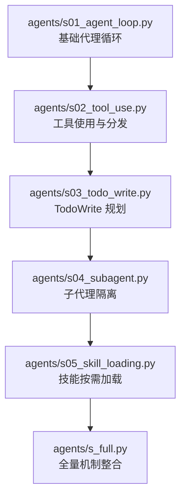
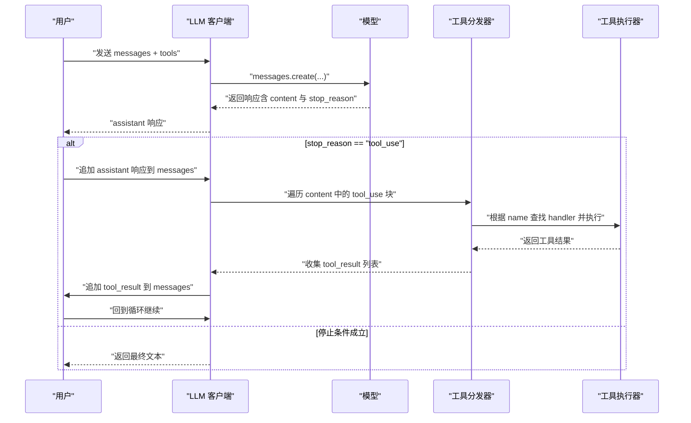
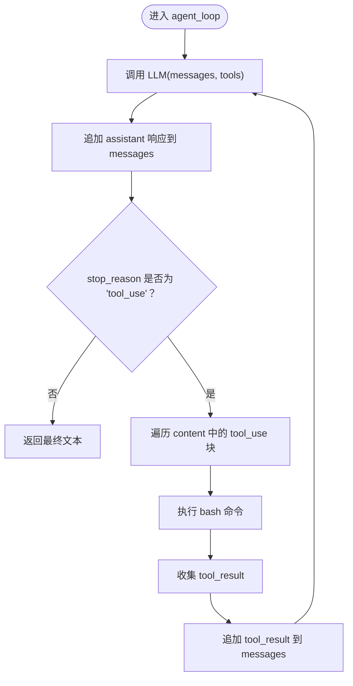
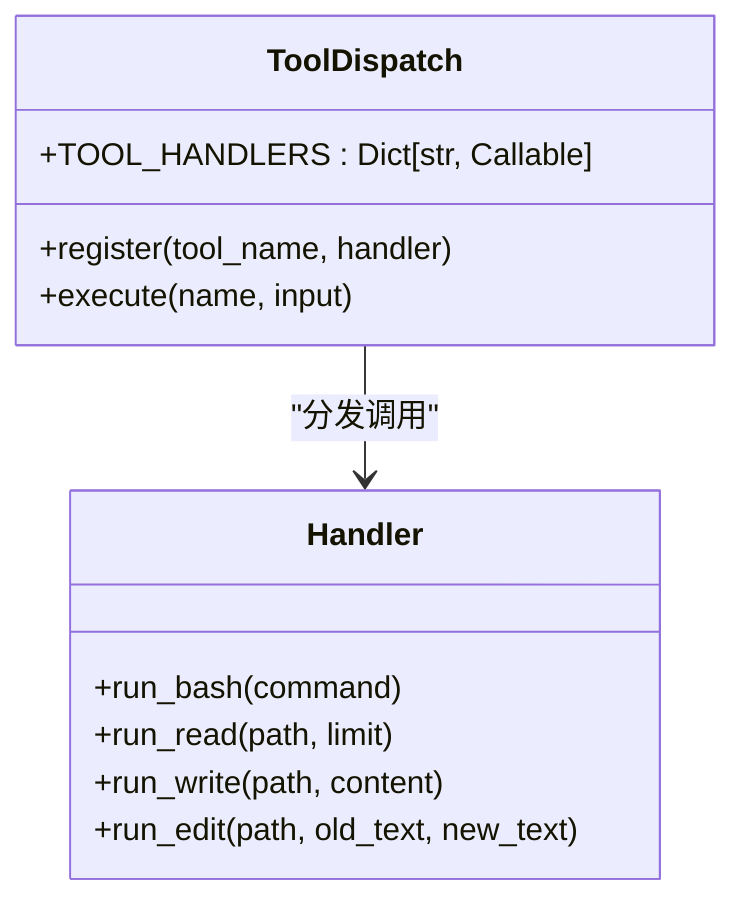
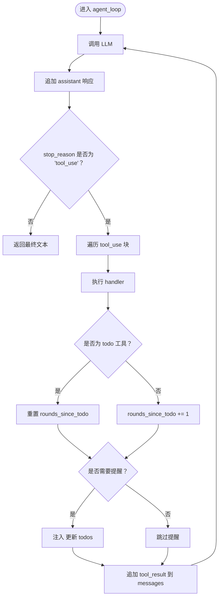
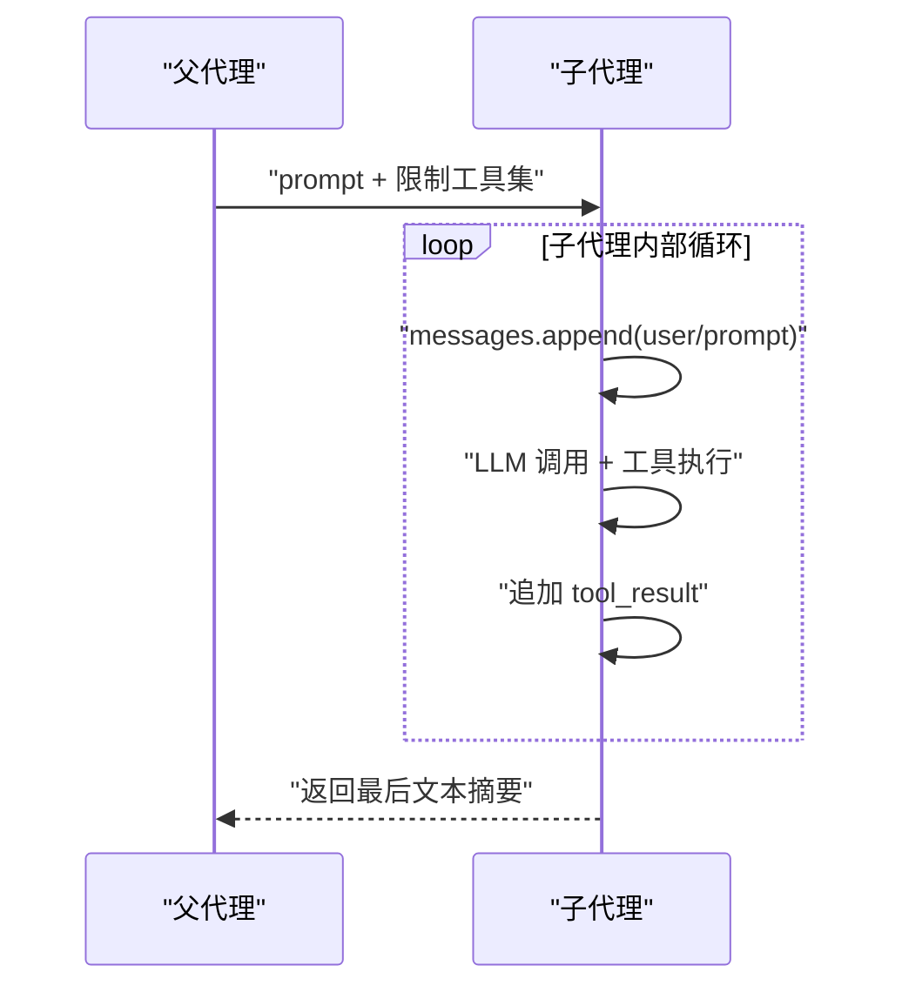
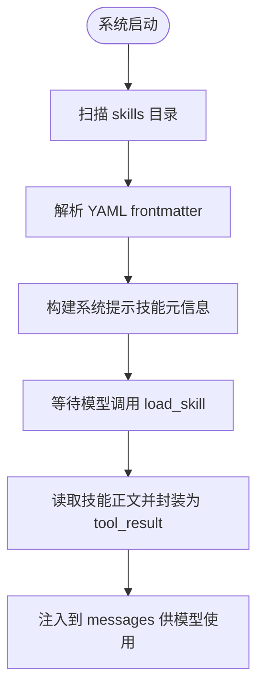
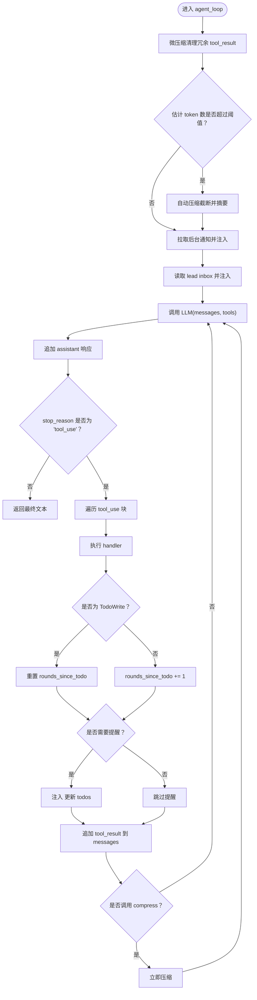

# 代理循环系统

<cite>
**本文档引用的文件**
- [s01_agent_loop.py](file://agents/s01_agent_loop.py)
- [s02_tool_use.py](file://agents/s02_tool_use.py)
- [s03_todo_write.py](file://agents/s03_todo_write.py)
- [s04_subagent.py](file://agents/s04_subagent.py)
- [s05_skill_loading.py](file://agents/s05_skill_loading.py)
- [s_full.py](file://agents/s_full.py)
- [README.md](file://README.md)
- [s01-the-agent-loop.md](file://docs/en/s01-the-agent-loop.md)
- [s02-tool-use.md](file://docs/en/s02-tool-use.md)
- [requirements.txt](file://requirements.txt)
</cite>

## 目录
1. [简介](#简介)
2. [项目结构](#项目结构)
3. [核心组件](#核心组件)
4. [架构总览](#架构总览)
5. [详细组件分析](#详细组件分析)
6. [依赖分析](#依赖分析)
7. [性能考虑](#性能考虑)
8. [故障排除指南](#故障排除指南)
9. [结论](#结论)
10. [附录](#附录)

## 简介
本技术文档围绕代理循环系统，系统性解析 s01 基础代理循环与 s02 工具使用机制，并延展到后续机制（规划、子代理、技能加载、上下文压缩、任务系统、后台任务、团队协作、协议与隔离）在 s_full 中的整合实现。重点阐述：
- while 循环机制与 stop_reason 检查逻辑
- messages 累积与工具调用结果回传
- 工具分发映射（name→handler）的工作原理与扩展方法
- 代理循环与 LLM API 的交互流程
- 最佳实践与常见问题解决方案

## 项目结构
该仓库采用“会话式教学”的组织方式：每个 sxx 文件代表一个独立的“机制”或“会话”，从最简的代理循环逐步叠加能力，最终在 s_full 中汇聚所有机制。核心目录与文件如下：
- agents/: 各个会话的参考实现（s01–s12 + s_full）
- docs/en/: 英文版会话文档
- web/: 可视化学习平台
- skills/: 技能资源目录（用于 s05 技能加载）

图表来源
- [s01_agent_loop.py:1-121](file://agents/s01_agent_loop.py#L1-L121)
- [s02_tool_use.py:1-151](file://agents/s02_tool_use.py#L1-L151)
- [s03_todo_write.py:1-212](file://agents/s03_todo_write.py#L1-L212)
- [s04_subagent.py:1-188](file://agents/s04_subagent.py#L1-L188)
- [s05_skill_loading.py:1-228](file://agents/s05_skill_loading.py#L1-L228)
- [s_full.py:1-741](file://agents/s_full.py#L1-L741)

章节来源
- [README.md: 项目概览与学习路径:1-378](file://README.md#L1-L378)

## 核心组件
- 代理循环（agent_loop）：统一的 while 循环控制流，基于 LLM 返回的 stop_reason 决定是否继续工具调用。
- 工具定义（TOOLS）：LLM 可见的工具清单，包含名称、描述与输入模式。
- 工具分发映射（TOOL_HANDLERS）：name→handler 的字典，将模型调用的工具名映射到具体执行函数。
- 消息累积（messages）：历史消息列表，包含用户提示、助手响应、工具调用与工具结果，作为下一轮 LLM 的上下文。
- LLM 客户端：Anthropic Messages API 客户端，负责与模型交互。

章节来源
- [s01_agent_loop.py: agent_loop 与基础工具:80-102](file://agents/s01_agent_loop.py#L80-L102)
- [s02_tool_use.py: TOOL_HANDLERS 与多工具:94-131](file://agents/s02_tool_use.py#L94-L131)
- [s03_todo_write.py: TodoManager 与 nag 提醒:52-192](file://agents/s03_todo_write.py#L52-L192)
- [s05_skill_loading.py: 技能加载与工具集成:166-208](file://agents/s05_skill_loading.py#L166-L208)
- [s_full.py: 全量工具与循环整合:653-707](file://agents/s_full.py#L653-L707)

## 架构总览
代理循环的核心模式是“LLM 决策 + 工具执行 + 结果回传”。s01 展示了最小闭环；s02 引入工具分发映射；s03 加入 TodoWrite 规划；s04 引入子代理隔离；s05 引入技能按需加载；s_full 将上述机制整合为完整参考实现。

图表来源
- [s01_agent_loop.py: agent_loop 流程:80-102](file://agents/s01_agent_loop.py#L80-L102)
- [s02_tool_use.py: 工具分发与执行:114-131](file://agents/s02_tool_use.py#L114-L131)
- [s03_todo_write.py: 周期性提醒注入:164-192](file://agents/s03_todo_write.py#L164-L192)
- [s05_skill_loading.py: 技能加载工具:188-208](file://agents/s05_skill_loading.py#L188-L208)
- [s_full.py: 综合循环与前置处理:653-707](file://agents/s_full.py#L653-L707)

## 详细组件分析

### s01 基础代理循环
- while 循环机制：持续调用 LLM，直到 stop_reason 不再为 "tool_use"。
- stop_reason 检查逻辑：若非工具调用，则认为模型已决定停止，返回最终文本。
- messages 累积：每次将 assistant 响应与 tool_result 追加到历史中，形成连续对话。
- 工具调用：在 s01 中仅支持 bash，直接执行命令并返回结果。

图表来源
- [s01_agent_loop.py: agent_loop 实现:80-102](file://agents/s01_agent_loop.py#L80-L102)

章节来源
- [s01_agent_loop.py: agent_loop 与基础工具:80-102](file://agents/s01_agent_loop.py#L80-L102)
- [s01-the-agent-loop.md: 会话文档:1-117](file://docs/en/s01-the-agent-loop.md#L1-L117)

### s02 工具使用机制与分发映射
- 工具分发映射（TOOL_HANDLERS）：以工具名为键，handler 函数为值，实现 name→handler 的查找。
- 扩展新工具的步骤：
  1) 在 TOOLS 中添加工具定义（名称、描述、输入模式）
  2) 在 TOOL_HANDLERS 中注册对应的 handler
  3) 在循环中通过 block.name 查找并执行 handler
- 路径安全：通过 safe_path 防止工作区逃逸，提升安全性。

图表来源
- [s02_tool_use.py: TOOL_HANDLERS 与工具实现:94-131](file://agents/s02_tool_use.py#L94-L131)

章节来源
- [s02_tool_use.py: 工具分发与安全路径检查:41-131](file://agents/s02_tool_use.py#L41-L131)
- [s02-tool-use.md: 会话文档:1-100](file://docs/en/s02-tool-use.md#L1-L100)

### s03 TodoWrite 规划与 nag 提醒
- TodoManager：维护任务列表，校验状态与唯一性，渲染当前进度。
- nag 提醒：当连续若干轮未使用 todo 工具时，向 messages 注入提醒，促使模型更新任务状态。
- 与工具分发的结合：todo 工具被识别后重置计数器，避免过度提醒。

图表来源
- [s03_todo_write.py: TodoManager 与 nag 提醒:52-192](file://agents/s03_todo_write.py#L52-L192)

章节来源
- [s03_todo_write.py: TodoManager 与循环整合:52-192](file://agents/s03_todo_write.py#L52-L192)

### s04 子代理（Subagent）与上下文隔离
- 子代理：为子任务创建 fresh messages=[]，在独立上下文中执行工具循环，完成后仅返回总结文本给父代理。
- 工具集差异：子代理工具集不含 task，防止递归生成。
- 上下文隔离：子代理结束后丢弃其消息历史，保持父代理上下文清洁。

图表来源
- [s04_subagent.py: 子代理实现与工具集分离:117-168](file://agents/s04_subagent.py#L117-L168)

章节来源
- [s04_subagent.py: 子代理与上下文隔离:117-168](file://agents/s04_subagent.py#L117-L168)

### s05 技能加载（On-Demand Knowledge）
- 技能扫描：SkillLoader 扫描 skills/<name>/SKILL.md，提取 YAML frontmatter 与正文。
- 分层注入：系统提示中仅注入技能元信息（轻量），实际技能内容在工具调用时以 tool_result 形式注入，避免系统提示膨胀。
- 工具集成：load_skill 工具返回指定技能的完整内容，供模型按需使用。

图表来源
- [s05_skill_loading.py: SkillLoader 与系统提示构建:58-114](file://agents/s05_skill_loading.py#L58-L114)
- [s05_skill_loading.py: 工具分发与循环:188-208](file://agents/s05_skill_loading.py#L188-L208)

章节来源
- [s05_skill_loading.py: 技能加载与工具集成:58-208](file://agents/s05_skill_loading.py#L58-L208)

### s_full 全量机制整合
- 前置处理：在每次 LLM 调用前执行三类操作
  - s06 上下文压缩：微压缩（清理冗余 tool_result）、阈值触发自动压缩、手动压缩指令
  - s08 后台任务：拉取后台任务通知并注入到 messages
  - s10 协议：检查 lead inbox，注入消息
- 工具分发：整合 s02–s11 的全部工具，形成超大工具集与 handler 映射
- TodoWrite：在活跃 todo 状态下启用 nag 提醒
- 循环收尾：支持手动压缩指令触发即时压缩

图表来源
- [s_full.py: 前置处理与循环整合:653-707](file://agents/s_full.py#L653-L707)

章节来源
- [s_full.py: 全量机制整合与循环:653-707](file://agents/s_full.py#L653-L707)

## 依赖分析
- 外部依赖：anthropic、python-dotenv、pyyaml
- 运行环境：通过 .env 配置 ANTHROPIC_BASE_URL 与 MODEL_ID
- LLM 客户端：Anthropic Messages API，支持 tools 参数与 stop_reason 字段

章节来源
- [requirements.txt: 依赖声明:1-3](file://requirements.txt#L1-L3)
- [s01_agent_loop.py: 客户端初始化与环境变量:27-50](file://agents/s01_agent_loop.py#L27-L50)
- [s02_tool_use.py: 客户端初始化与环境变量:22-36](file://agents/s02_tool_use.py#L22-L36)
- [s_full.py: 客户端初始化与全局配置:49-58](file://agents/s_full.py#L49-L58)

## 性能考虑
- 上下文压缩
  - 微压缩：清理冗长 tool_result，减少 token 占用
  - 自动压缩：当 token 超过阈值时触发，截断并摘要
  - 手动压缩：通过 compress 工具即时压缩
- 后台任务
  - 使用线程池异步执行耗时命令，完成后通过队列通知注入
- 工具执行
  - 限制超时时间，避免阻塞循环
  - 对危险命令进行白名单过滤
- 消息管理
  - 仅保留必要文本块，tool_result 适度裁剪

章节来源
- [s06 上下文压缩实现:226-258](file://agents/s_full.py#L226-L258)
- [s08 后台任务实现:327-361](file://agents/s_full.py#L327-L361)
- [s01 安全命令检查:65-78](file://agents/s01_agent_loop.py#L65-L78)
- [s02 安全路径检查:41-45](file://agents/s02_tool_use.py#L41-L45)

## 故障排除指南
- LLM 返回非工具调用
  - 现象：stop_reason 非 "tool_use"，直接返回文本
  - 处理：无需工具执行，直接结束循环
- 工具未知或执行异常
  - 现象：handler 不存在或抛出异常
  - 处理：记录 "Unknown tool" 或 "Error: ..."，不影响循环继续
- 路径逃逸与权限问题
  - 现象：访问工作区外路径
  - 处理：safe_path 抛出异常，阻止越界访问
- 命令超时与错误
  - 现象：子进程超时或系统错误
  - 处理：捕获 TimeoutExpired 与 FileNotFoundError/OSError，返回错误信息
- 上下文过大导致性能下降
  - 现象：token 数过高
  - 处理：启用微压缩、阈值自动压缩或手动压缩

章节来源
- [s02_tool_use.py: 工具执行与异常处理:114-131](file://agents/s02_tool_use.py#L114-L131)
- [s03_todo_write.py: 异常处理与提醒注入:164-192](file://agents/s03_todo_write.py#L164-L192)
- [s05_skill_loading.py: 工具执行与异常处理:188-208](file://agents/s05_skill_loading.py#L188-L208)
- [s_full.py: 循环中的异常处理与压缩策略:653-707](file://agents/s_full.py#L653-L707)

## 结论
代理循环系统以“最小闭环 + 可扩展工具分发”为核心，通过 s01–s05 的逐步演进，展示了如何在不改变循环的前提下叠加多种机制。s_full 将这些机制整合为生产级参考实现，强调：
- 循环属于模型，机制属于 harness
- 工具分发映射是扩展点，新增工具只需注册 handler 与 schema
- 上下文管理、权限控制与生命周期治理是 harness 的关键

## 附录
- 快速开始
  - 安装依赖：pip install -r requirements.txt
  - 配置 .env：设置 ANTHROPIC_BASE_URL 与 MODEL_ID
  - 运行示例：python agents/s01_agent_loop.py
- 学习路径
  - s01 → s02 → s03 → s04 → s05 → s_full
- 相关文档
  - 会话文档：docs/en/s01-the-agent-loop.md、docs/en/s02-tool-use.md
  - 项目总览：README.md