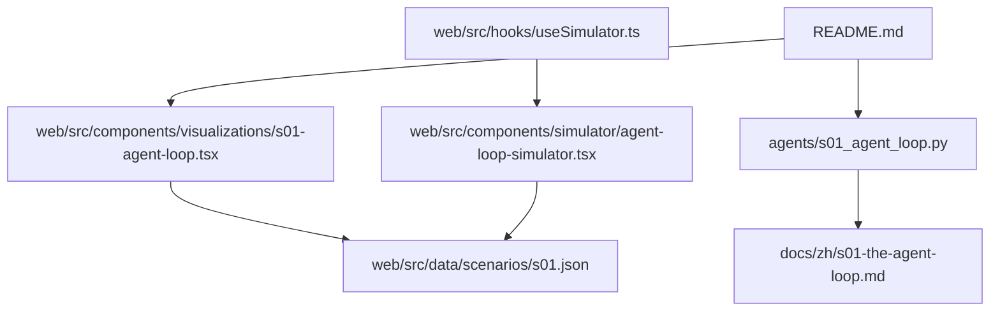
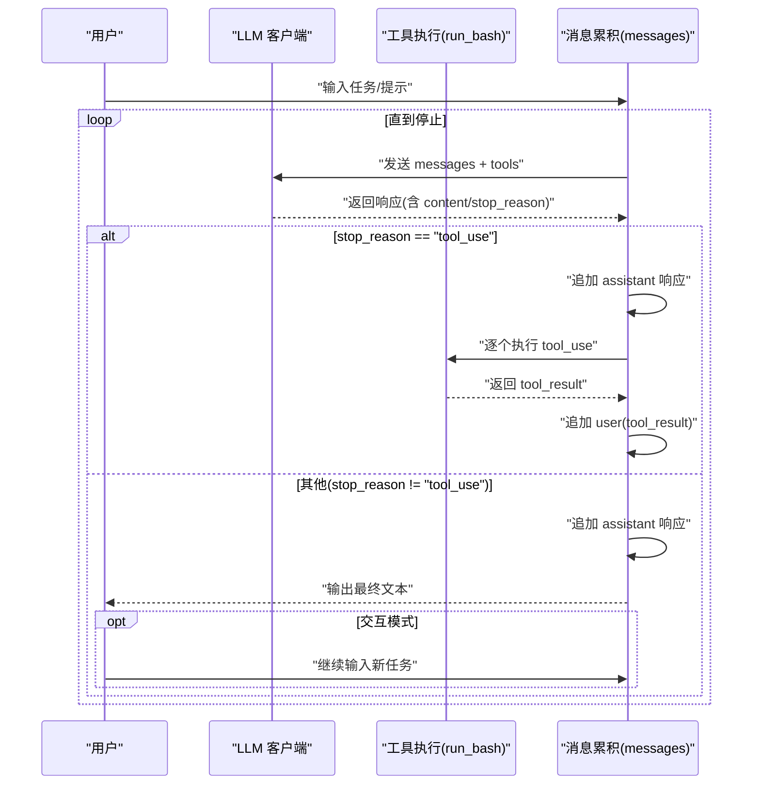
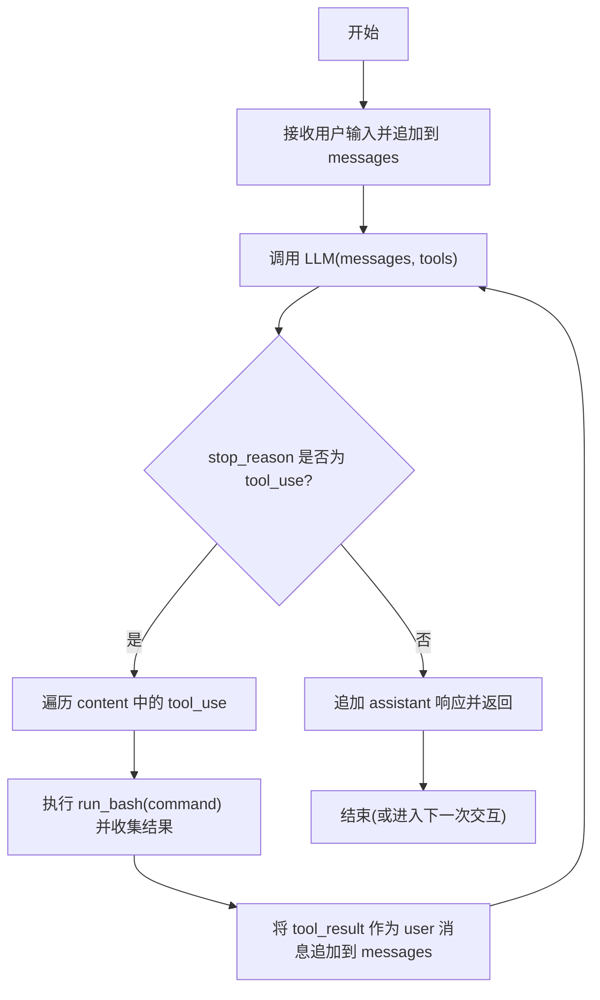
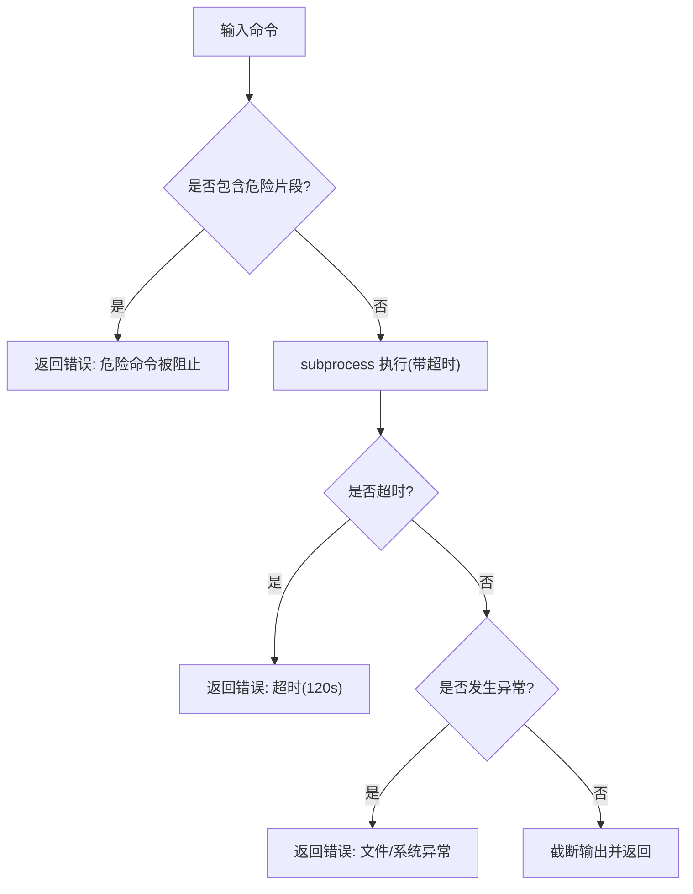
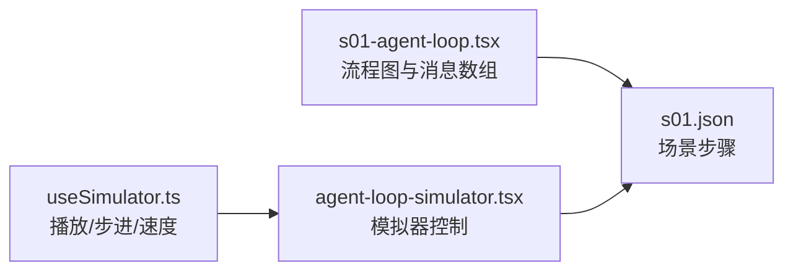
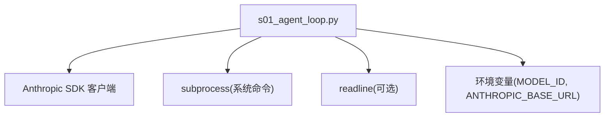

# 基础代理循环

<cite>
**本文引用的文件**
- [agents/s01_agent_loop.py](file://agents/s01_agent_loop.py)
- [docs/zh/s01-the-agent-loop.md](file://docs/zh/s01-the-agent-loop.md)
- [web/src/components/visualizations/s01-agent-loop.tsx](file://web/src/components/visualizations/s01-agent-loop.tsx)
- [web/src/components/simulator/agent-loop-simulator.tsx](file://web/src/components/simulator/agent-loop-simulator.tsx)
- [web/src/data/scenarios/s01.json](file://web/src/data/scenarios/s01.json)
- [web/src/hooks/useSimulator.ts](file://web/src/hooks/useSimulator.ts)
- [README.md](file://README.md)
</cite>

## 目录
1. [引言](#引言)
2. [项目结构](#项目结构)
3. [核心组件](#核心组件)
4. [架构总览](#架构总览)
5. [详细组件分析](#详细组件分析)
6. [依赖分析](#依赖分析)
7. [性能考虑](#性能考虑)
8. [故障排查指南](#故障排查指南)
9. [结论](#结论)
10. [附录](#附录)

## 引言
本篇文档围绕“基础代理循环”（s01）展开，系统阐述最小可行代理的核心实现：while 循环机制、stop_reason 检查逻辑、messages 累积、LLM 推理、工具调用与结果回流的完整闭环。我们将结合源码与可视化资料，帮助读者建立对代理循环的统一认知，并在此基础上扩展为更复杂的代理系统。

## 项目结构
本仓库采用“教学型”分层组织：
- agents：各阶段参考实现（s01–s12），s01 是最小循环范式
- docs：多语言文档，s01 文档提供工作原理与示例
- web：交互式可视化平台，包含流程图、模拟器与场景数据
- tests：基础脚本编译与存在性校验

图表来源
- [agents/s01_agent_loop.py:1-121](file://agents/s01_agent_loop.py#L1-L121)
- [docs/zh/s01-the-agent-loop.md:1-119](file://docs/zh/s01-the-agent-loop.md#L1-L119)
- [web/src/components/visualizations/s01-agent-loop.tsx:1-417](file://web/src/components/visualizations/s01-agent-loop.tsx#L1-L417)
- [web/src/components/simulator/agent-loop-simulator.tsx:1-97](file://web/src/components/simulator/agent-loop-simulator.tsx#L1-L97)
- [web/src/data/scenarios/s01.json:1-52](file://web/src/data/scenarios/s01.json#L1-L52)
- [web/src/hooks/useSimulator.ts:1-85](file://web/src/hooks/useSimulator.ts#L1-L85)
- [README.md:190-243](file://README.md#L190-L243)

章节来源
- [README.md:287-298](file://README.md#L287-L298)

## 核心组件
- 代理循环函数：负责持续调用 LLM、解析响应、执行工具、回写结果，直到模型决定停止
- 工具定义：当前仅定义 bash 工具，输入为字符串命令
- 安全执行函数：run_bash，内置危险命令拦截、超时与异常处理
- 交互入口：本地交互式会话，支持退出与历史累积

章节来源
- [agents/s01_agent_loop.py:80-121](file://agents/s01_agent_loop.py#L80-L121)
- [agents/s01_agent_loop.py:54-62](file://agents/s01_agent_loop.py#L54-L62)
- [agents/s01_agent_loop.py:65-78](file://agents/s01_agent_loop.py#L65-L78)
- [agents/s01_agent_loop.py:104-121](file://agents/s01_agent_loop.py#L104-L121)

## 架构总览
s01 的核心是“while + stop_reason”的循环范式：每次迭代将 messages 与工具定义发送给 LLM；若 stop_reason 为 tool_use，则执行工具并将结果回写 messages，继续下一轮；否则返回文本结果，结束循环。

图表来源
- [agents/s01_agent_loop.py:80-101](file://agents/s01_agent_loop.py#L80-L101)
- [agents/s01_agent_loop.py:83-86](file://agents/s01_agent_loop.py#L83-L86)
- [agents/s01_agent_loop.py:94-101](file://agents/s01_agent_loop.py#L94-L101)

## 详细组件分析

### 代理循环执行流程
- 初始化：history（messages）为空
- 交互循环：接收用户输入，追加到 messages
- 调用 LLM：携带 system 提示词、messages、tools
- 处理响应：追加 assistant 响应；若 stop_reason 不为 tool_use，直接返回
- 工具执行：遍历 content 中的 tool_use 块，调用 run_bash，收集 tool_result
- 回写结果：将 tool_result 作为 user 消息追加到 messages
- 继续循环：回到 LLM 调用，直至模型决定停止

图表来源
- [agents/s01_agent_loop.py:80-101](file://agents/s01_agent_loop.py#L80-L101)
- [agents/s01_agent_loop.py:83-86](file://agents/s01_agent_loop.py#L83-L86)
- [agents/s01_agent_loop.py:94-101](file://agents/s01_agent_loop.py#L94-L101)

章节来源
- [agents/s01_agent_loop.py:80-101](file://agents/s01_agent_loop.py#L80-L101)
- [docs/zh/s01-the-agent-loop.md:28-95](file://docs/zh/s01-the-agent-loop.md#L28-L95)

### System 提示词（System）
- 作用：限定代理角色与权限边界，例如“在当前工作目录下使用 bash 解决任务”，并要求“行动，不要解释”
- 配置方式：通过环境变量 MODEL_ID 指定模型，SYSTEM 字符串注入到 messages.create 调用中
- 影响：决定 LLM 的行为风格与可执行范围，是安全与可控性的第一道防线

章节来源
- [agents/s01_agent_loop.py:52](file://agents/s01_agent_loop.py#L52)
- [agents/s01_agent_loop.py:83-86](file://agents/s01_agent_loop.py#L83-L86)

### run_bash 安全机制与错误处理
- 危险命令拦截：检测常见高危命令片段，直接拒绝执行并返回错误提示
- 超时保护：默认 120 秒超时，避免长时间阻塞
- 输出截断：限制最大输出长度，防止内存与传输压力
- 异常处理：捕获子进程超时、文件/系统错误，返回标准化错误信息
- 适用场景：适合沙箱化、受限的开发/调试环境；生产环境建议引入更强的隔离与审计

图表来源
- [agents/s01_agent_loop.py:65-78](file://agents/s01_agent_loop.py#L65-L78)

章节来源
- [agents/s01_agent_loop.py:65-78](file://agents/s01_agent_loop.py#L65-L78)

### 交互式会话与用户输入处理
- 交互循环：持续读取用户输入，支持 q/exit/空输入退出
- 历史累积：每次输入追加到 messages，形成对话历史
- 结果打印：根据响应内容类型选择打印策略（文本块）

章节来源
- [agents/s01_agent_loop.py:104-121](file://agents/s01_agent_loop.py#L104-L121)

### 可视化与模拟器
- 流程图可视化：节点覆盖“开始、API 调用、stop_reason 判断、工具执行、追加结果、结束”，边标注分支标签
- 场景数据：s01.json 描述了从创建文件到验证输出的完整步骤序列
- 模拟器：useSimulator 控制步进播放，AgentLoopSimulator 加载场景并渲染步骤

图表来源
- [web/src/components/visualizations/s01-agent-loop.tsx:1-417](file://web/src/components/visualizations/s01-agent-loop.tsx#L1-L417)
- [web/src/components/simulator/agent-loop-simulator.tsx:1-97](file://web/src/components/simulator/agent-loop-simulator.tsx#L1-L97)
- [web/src/data/scenarios/s01.json:1-52](file://web/src/data/scenarios/s01.json#L1-L52)
- [web/src/hooks/useSimulator.ts:1-85](file://web/src/hooks/useSimulator.ts#L1-L85)

章节来源
- [web/src/components/visualizations/s01-agent-loop.tsx:138-417](file://web/src/components/visualizations/s01-agent-loop.tsx#L138-L417)
- [web/src/components/simulator/agent-loop-simulator.tsx:30-97](file://web/src/components/simulator/agent-loop-simulator.tsx#L30-L97)
- [web/src/data/scenarios/s01.json:1-52](file://web/src/data/scenarios/s01.json#L1-L52)
- [web/src/hooks/useSimulator.ts:12-85](file://web/src/hooks/useSimulator.ts#L12-L85)

## 依赖分析
- 代理循环依赖 LLM 客户端（Anthropic SDK），通过 messages.create 发送 system、messages、tools
- 工具定义与输入 schema 由 TOOLS 提供，当前仅支持 bash
- run_bash 依赖 subprocess，受系统环境与权限影响
- 交互入口依赖标准输入输出与 readline（可选）

图表来源
- [agents/s01_agent_loop.py:27-49](file://agents/s01_agent_loop.py#L27-L49)
- [agents/s01_agent_loop.py:83-86](file://agents/s01_agent_loop.py#L83-L86)
- [agents/s01_agent_loop.py:65-78](file://agents/s01_agent_loop.py#L65-L78)

章节来源
- [agents/s01_agent_loop.py:27-49](file://agents/s01_agent_loop.py#L27-L49)
- [agents/s01_agent_loop.py:83-86](file://agents/s01_agent_loop.py#L83-L86)

## 性能考虑
- 消息累积增长：messages 会随每轮迭代增加，建议在更高阶段引入上下文压缩与分页
- 工具执行开销：bash 执行可能耗时较长，建议配合后台任务与通知机制
- 输出截断：run_bash 对输出进行截断，避免大体量文本影响显示与传输
- 超时控制：固定超时保障稳定性，可根据任务特性调整

[本节为通用建议，不直接分析具体文件]

## 故障排查指南
- 无法连接 LLM：检查 ANTHROPIC_BASE_URL 与 MODEL_ID 环境变量是否正确设置
- 代理无响应：确认 messages 是否正确追加 assistant 响应；若 stop_reason 非 tool_use，循环会提前结束
- 工具执行失败：run_bash 返回错误信息，优先检查危险命令拦截、权限与路径
- 输入异常：readline 初始化失败不影响功能，可忽略；交互退出可通过 q/exit/空输入触发

章节来源
- [agents/s01_agent_loop.py:44-49](file://agents/s01_agent_loop.py#L44-L49)
- [agents/s01_agent_loop.py:89-91](file://agents/s01_agent_loop.py#L89-L91)
- [agents/s01_agent_loop.py:65-78](file://agents/s01_agent_loop.py#L65-L78)
- [agents/s01_agent_loop.py:108-112](file://agents/s01_agent_loop.py#L108-L112)

## 结论
s01 以“while + stop_reason”为核心，构建了最小而完整的代理循环：LLM 决策、工具执行、结果回流，形成可扩展的协作范式。通过 System 提示词与 run_bash 安全机制，既保证可控性又保留灵活性。后续章节（s02–s12）在此基础上叠加规划、知识、团队与隔离等机制，逐步逼近真实产品级代理。

[本节为总结性内容，不直接分析具体文件]

## 附录

### 启动交互式会话与处理用户输入（步骤指引）
- 设置环境变量：MODEL_ID、ANTHROPIC_BASE_URL（可选）
- 运行脚本：启动交互式会话，输入任务后自动进入循环
- 退出方式：输入 q、exit 或直接回车

章节来源
- [README.md:232-243](file://README.md#L232-L243)
- [agents/s01_agent_loop.py:104-121](file://agents/s01_agent_loop.py#L104-L121)

### 扩展 messages 数组的最佳实践
- 保持消息顺序：user -> assistant -> user(tool_result) 循环
- 分类处理响应内容：文本块与工具结果需分别打印与记录
- 控制上下文长度：在更高阶段引入压缩与分页，避免超出模型上下文上限

章节来源
- [docs/zh/s01-the-agent-loop.md:30-66](file://docs/zh/s01-the-agent-loop.md#L30-L66)
- [web/src/components/visualizations/s01-agent-loop.tsx:353-417](file://web/src/components/visualizations/s01-agent-loop.tsx#L353-L417)

### System 提示词配置要点
- 明确角色与边界：限定工作目录与可执行动作
- 强化行动导向：要求“行动，不要解释”，减少冗余描述
- 与工具能力匹配：确保提示词与可用工具一致，避免无效决策

章节来源
- [agents/s01_agent_loop.py:52](file://agents/s01_agent_loop.py#L52)
- [agents/s01_agent_loop.py:83-86](file://agents/s01_agent_loop.py#L83-L86)