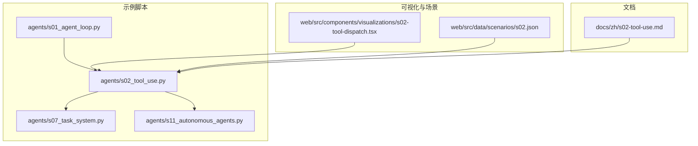
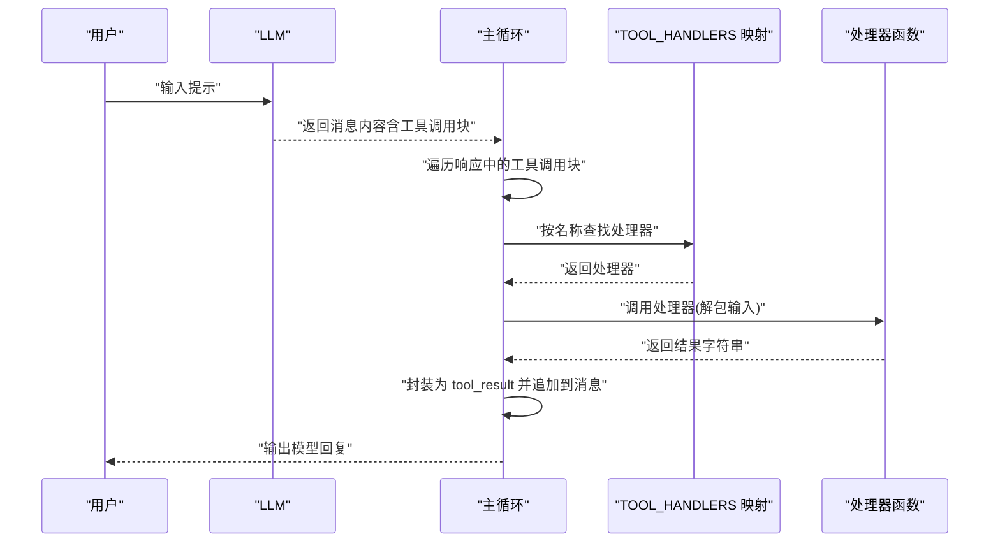
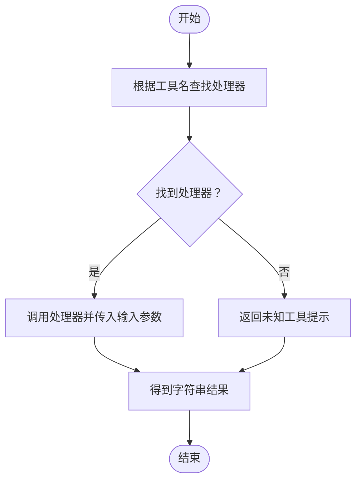
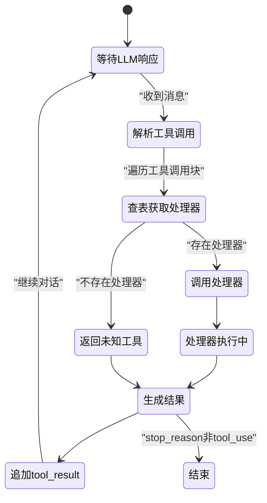
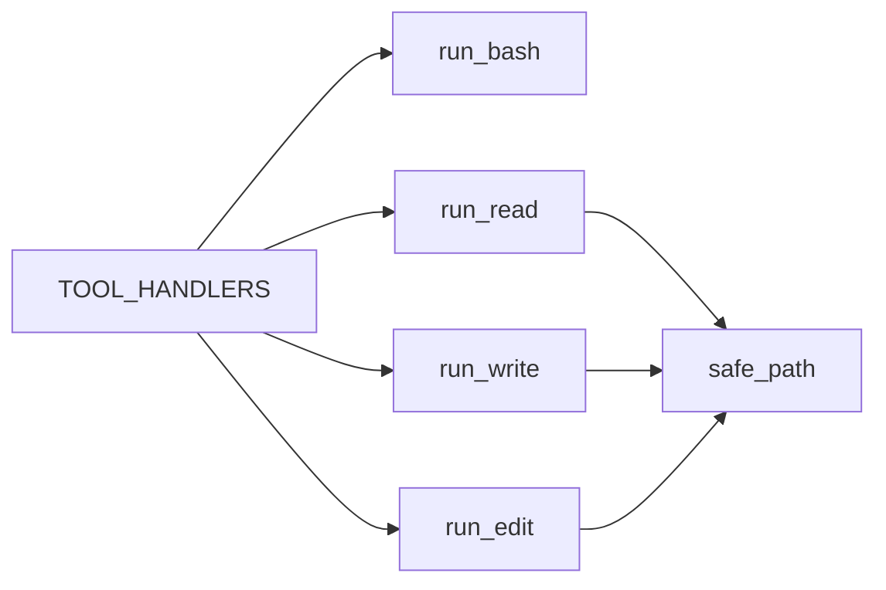

# 工具分发系统

<cite>
**本文引用的文件**
- [agents/s02_tool_use.py](file://agents/s02_tool_use.py)
- [agents/s07_task_system.py](file://agents/s07_task_system.py)
- [agents/s11_autonomous_agents.py](file://agents/s11_autonomous_agents.py)
- [skills/agent-builder/references/tool-templates.py](file://skills/agent-builder/references/tool-templates.py)
- [web/src/components/visualizations/s02-tool-dispatch.tsx](file://web/src/components/visualizations/s02-tool-dispatch.tsx)
- [web/src/data/scenarios/s02.json](file://web/src/data/scenarios/s02.json)
- [docs/zh/s02-tool-use.md](file://docs/zh/s02-tool-use.md)
</cite>

## 目录
1. [简介](#简介)
2. [项目结构](#项目结构)
3. [核心组件](#核心组件)
4. [架构总览](#架构总览)
5. [详细组件分析](#详细组件分析)
6. [依赖分析](#依赖分析)
7. [性能考量](#性能考量)
8. [故障排查指南](#故障排查指南)
9. [结论](#结论)
10. [附录](#附录)

## 简介
本技术文档围绕“工具分发系统”展开，聚焦 s02 工具使用机制的实现原理，系统阐述：
- 工具分发映射（name→handler）的工作机制与数据结构
- TOOL_HANDLERS 字典的结构、注册方式与扩展方法
- 工具调用的生命周期：从 LLM 生成工具调用指令到实际执行工具函数的完整流程
- 安全考虑与错误处理策略
- 工具开发最佳实践（参数校验、返回值格式化、异常处理）
- 如何添加新工具（如文件读写、网络请求等）

目标是帮助读者理解工具系统的扩展机制，并能独立开发自定义工具。

## 项目结构
该仓库采用“章节式”脚本组织，每个 sxx 文件是一个可独立运行的示例或演示。工具分发系统主要集中在 agents/s02_tool_use.py 中，同时在 s07_task_system.py、s11_autonomous_agents.py 中也有类似模式的扩展与增强。

图表来源
- [agents/s02_tool_use.py:1-151](file://agents/s02_tool_use.py#L1-L151)
- [agents/s07_task_system.py:173-201](file://agents/s07_task_system.py#L173-L201)
- [agents/s11_autonomous_agents.py:383-408](file://agents/s11_autonomous_agents.py#L383-L408)
- [web/src/components/visualizations/s02-tool-dispatch.tsx:1-381](file://web/src/components/visualizations/s02-tool-dispatch.tsx#L1-L381)
- [web/src/data/scenarios/s02.json:1-46](file://web/src/data/scenarios/s02.json#L1-L46)
- [docs/zh/s02-tool-use.md:1-102](file://docs/zh/s02-tool-use.md#L1-L102)

章节来源
- [agents/s02_tool_use.py:1-151](file://agents/s02_tool_use.py#L1-L151)
- [agents/s07_task_system.py:173-201](file://agents/s07_task_system.py#L173-L201)
- [web/src/components/visualizations/s02-tool-dispatch.tsx:1-381](file://web/src/components/visualizations/s02-tool-dispatch.tsx#L1-L381)
- [web/src/data/scenarios/s02.json:1-46](file://web/src/data/scenarios/s02.json#L1-L46)
- [docs/zh/s02-tool-use.md:1-102](file://docs/zh/s02-tool-use.md#L1-L102)

## 核心组件
- 工具处理器映射（TOOL_HANDLERS）：将工具名映射到具体处理函数，支持 O(1) 查找，替代 if/elif 分支链。
- 工具定义（TOOLS）：向 LLM 提供工具描述与输入模式（JSON Schema），用于指导模型选择与参数填充。
- 安全沙箱（safe_path）：限制文件访问范围，防止路径逃逸。
- 工具执行循环：接收 LLM 的工具调用块，查表获取处理器，执行并回传结果。

章节来源
- [agents/s02_tool_use.py:94-111](file://agents/s02_tool_use.py#L94-L111)
- [agents/s02_tool_use.py:41-45](file://agents/s02_tool_use.py#L41-L45)
- [agents/s02_tool_use.py:114-131](file://agents/s02_tool_use.py#L114-L131)

## 架构总览
工具分发系统的核心流程如下：
- LLM 生成工具调用块（包含 name 与 input）
- 主循环根据 block.name 在 TOOL_HANDLERS 中查找处理器
- 调用处理器并收集结果，封装为 tool_result 追加到消息历史
- 下一轮继续对话，直到 stop_reason 非 tool_use

图表来源
- [agents/s02_tool_use.py:114-131](file://agents/s02_tool_use.py#L114-L131)
- [agents/s07_task_system.py:204-224](file://agents/s07_task_system.py#L204-L224)

## 详细组件分析

### TOOL_HANDLERS 字典与注册方式
- 结构：字典键为工具名字符串，值为可调用对象（lambda 或函数），统一签名接受关键字参数并返回字符串。
- 注册方式：在模块顶层维护 TOOL_HANDLERS，新增工具只需添加一条键值对。
- 查询策略：使用 get(block.name) 获取处理器；若未找到则返回“未知工具”提示，避免崩溃。

图表来源
- [agents/s02_tool_use.py:124-130](file://agents/s02_tool_use.py#L124-L130)
- [agents/s07_task_system.py:214-223](file://agents/s07_task_system.py#L214-L223)

章节来源
- [agents/s02_tool_use.py:94-100](file://agents/s02_tool_use.py#L94-L100)
- [agents/s07_task_system.py:173-182](file://agents/s07_task_system.py#L173-L182)

### 工具定义（TOOLS）与输入模式
- 每个工具包含三要素：name、description、input_schema（JSON Schema）。
- input_schema 描述参数类型、是否必填、默认值等，便于 LLM 正确构造调用。
- 示例工具：bash、read_file、write_file、edit_file；s07 增加了任务管理工具。

章节来源
- [agents/s02_tool_use.py:102-111](file://agents/s02_tool_use.py#L102-L111)
- [agents/s07_task_system.py:184-201](file://agents/s07_task_system.py#L184-L201)

### 安全沙箱与路径校验
- safe_path 将相对路径解析为绝对路径，并检查是否位于工作目录内，防止 ../.. 访问。
- 所有文件类工具均通过 safe_path 限定作用域，避免越权访问。

章节来源
- [agents/s02_tool_use.py:41-45](file://agents/s02_tool_use.py#L41-L45)
- [skills/agent-builder/references/tool-templates.py:141-149](file://skills/agent-builder/references/tool-templates.py#L141-L149)

### 工具处理器实现要点
- bash：危险命令拦截、超时控制、输出截断。
- read_file：读取文本、可选行数限制、输出截断。
- write_file：自动创建父目录、返回写入字节数确认。
- edit_file：精确文本替换（只替换第一个匹配）、找不到时报错。

章节来源
- [agents/s02_tool_use.py:48-92](file://agents/s02_tool_use.py#L48-L92)
- [skills/agent-builder/references/tool-templates.py:152-246](file://skills/agent-builder/references/tool-templates.py#L152-L246)

### 工具调用生命周期（端到端）
- 输入阶段：用户输入提示，LLM 生成包含工具调用块的消息。
- 分发阶段：主循环遍历工具调用块，按名称查表获取处理器。
- 执行阶段：调用处理器，捕获异常并返回统一字符串结果。
- 输出阶段：将结果封装为 tool_result 追加到消息历史，继续对话直至结束。

图表来源
- [agents/s02_tool_use.py:114-131](file://agents/s02_tool_use.py#L114-L131)
- [agents/s07_task_system.py:204-224](file://agents/s07_task_system.py#L204-L224)

章节来源
- [agents/s02_tool_use.py:114-131](file://agents/s02_tool_use.py#L114-L131)
- [agents/s07_task_system.py:204-224](file://agents/s07_task_system.py#L204-L224)

### 可视化与场景说明
- s02-tool-dispatch.tsx 展示了工具分发图：调度器与四个工具卡片之间的连接，强调“按名称路由”的设计。
- s02.json 场景展示了 read_file、write_file 的典型调用顺序与交互。

章节来源
- [web/src/components/visualizations/s02-tool-dispatch.tsx:1-381](file://web/src/components/visualizations/s02-tool-dispatch.tsx#L1-L381)
- [web/src/data/scenarios/s02.json:1-46](file://web/src/data/scenarios/s02.json#L1-L46)

## 依赖分析
- s02_tool_use.py 作为基础示例，定义了最小可用的工具集与分发逻辑。
- s07_task_system.py 在 s02 基础上扩展了更多工具与更完善的错误处理（try/catch 包裹处理器调用）。
- s11_autonomous_agents.py 复用 s02 的基础工具实现，保持一致性。
- tool-templates.py 提供了模板化的工具定义与实现，便于快速复制与定制。

图表来源
- [agents/s02_tool_use.py:94-100](file://agents/s02_tool_use.py#L94-L100)
- [agents/s02_tool_use.py:41-45](file://agents/s02_tool_use.py#L41-L45)

章节来源
- [agents/s02_tool_use.py:94-100](file://agents/s02_tool_use.py#L94-L100)
- [agents/s07_task_system.py:173-182](file://agents/s07_task_system.py#L173-L182)
- [agents/s11_autonomous_agents.py:383-408](file://agents/s11_autonomous_agents.py#L383-L408)
- [skills/agent-builder/references/tool-templates.py:141-246](file://skills/agent-builder/references/tool-templates.py#L141-L246)

## 性能考量
- 名称查表：O(1) 查找，避免长 if/elif 链带来的分支开销。
- 输出截断：统一限制最大输出长度，防止大文本影响显示与传输。
- 超时控制：对外部进程调用设置超时，避免阻塞。
- I/O 优化：文件读写前自动创建父目录，减少失败重试成本。

章节来源
- [agents/s02_tool_use.py:52-58](file://agents/s02_tool_use.py#L52-L58)
- [agents/s02_tool_use.py:67](file://agents/s02_tool_use.py#L67)
- [skills/agent-builder/references/tool-templates.py:172-178](file://skills/agent-builder/references/tool-templates.py#L172-L178)

## 故障排查指南
- 未知工具：当 TOOL_HANDLERS 中缺少对应键时，会返回“未知工具”提示。检查工具名拼写与注册项。
- 路径逃逸：safe_path 抛出异常时，检查传入路径是否相对且位于工作目录内。
- 外部命令失败：bash 处理器会拦截危险命令并返回错误信息；超时会返回超时提示。
- 异常捕获：s07 的实现对处理器调用进行了 try/catch，确保异常不会中断主循环。

章节来源
- [agents/s02_tool_use.py:126-130](file://agents/s02_tool_use.py#L126-L130)
- [agents/s02_tool_use.py:48-58](file://agents/s02_tool_use.py#L48-L58)
- [agents/s07_task_system.py:217-223](file://agents/s07_task_system.py#L217-L223)

## 结论
工具分发系统通过“名称到处理器”的字典映射，实现了高内聚、低耦合的工具扩展机制。其优势包括：
- 无需修改主循环即可增加新工具
- 统一的安全沙箱与错误处理
- 清晰的输入模式定义，提升 LLM 的工具选择准确性
- 可视化与场景化文档辅助理解与教学

## 附录

### 如何扩展新的工具处理器
- 步骤一：编写处理器函数
  - 使用 safe_path 保护文件访问
  - 对输入进行必要校验（类型、范围、必填字段）
  - 返回统一字符串结果，必要时包含错误信息
  - 参考路径：[agents/s02_tool_use.py:61-92](file://agents/s02_tool_use.py#L61-L92)，[skills/agent-builder/references/tool-templates.py:183-246](file://skills/agent-builder/references/tool-templates.py#L183-L246)

- 步骤二：在 TOOL_HANDLERS 中注册
  - 添加一条键值对，键为工具名，值为处理器调用（可使用 lambda 解包关键字参数）
  - 参考路径：[agents/s02_tool_use.py:94-100](file://agents/s02_tool_use.py#L94-L100)

- 步骤三：在 TOOLS 中定义工具描述与输入模式
  - name、description、input_schema（JSON Schema）
  - 参考路径：[agents/s02_tool_use.py:102-111](file://agents/s02_tool_use.py#L102-L111)

- 步骤四：测试与验证
  - 使用 web 场景或本地脚本进行测试
  - 参考路径：[web/src/data/scenarios/s02.json:1-46](file://web/src/data/scenarios/s02.json#L1-46)

### 工具开发最佳实践
- 参数验证：严格校验输入类型与范围，必要时提供默认值
- 返回值格式化：统一返回字符串，包含必要的上下文信息（如字节数、行数）
- 异常处理：捕获并格式化异常，避免泄露内部细节
- 安全性：始终使用安全沙箱，避免危险命令与路径逃逸
- 可靠性：对外部调用设置超时，避免阻塞
- 可观测性：在日志中记录关键步骤与输入摘要（避免敏感信息）

章节来源
- [skills/agent-builder/references/tool-templates.py:152-246](file://skills/agent-builder/references/tool-templates.py#L152-L246)
- [docs/zh/s02-tool-use.md:1-102](file://docs/zh/s02-tool-use.md#L1-L102)