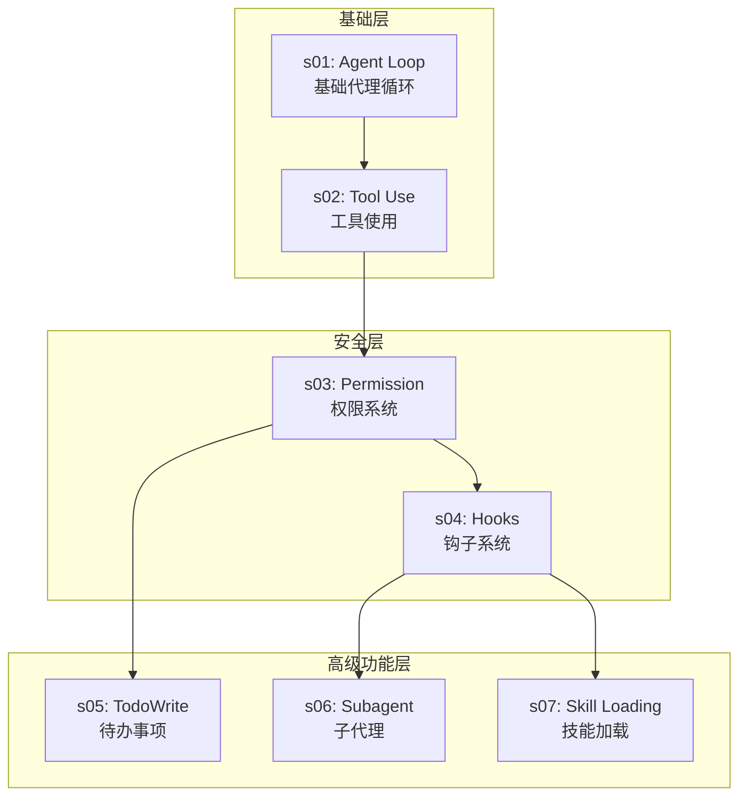
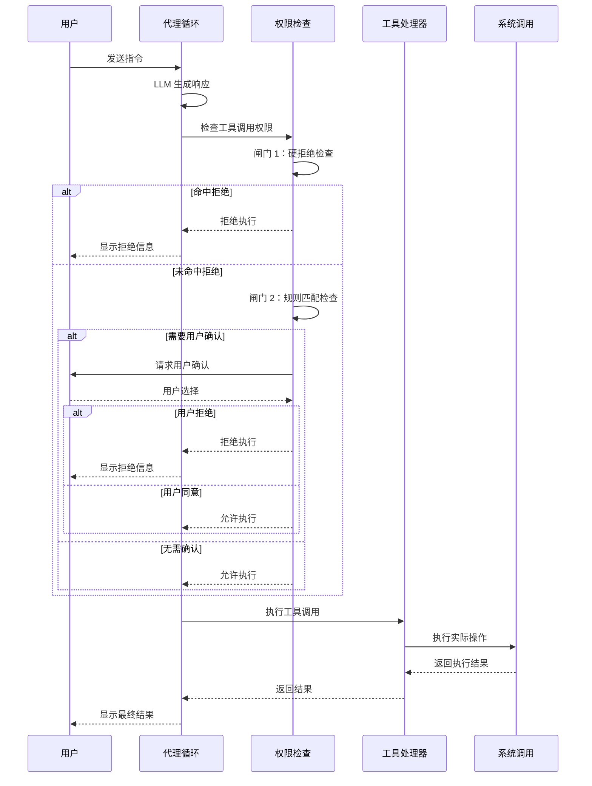
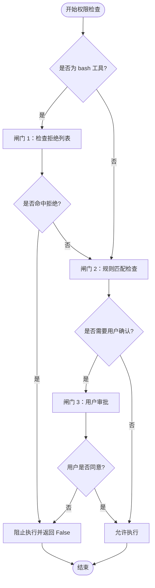
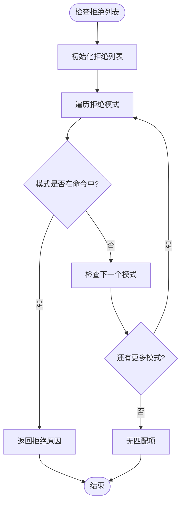
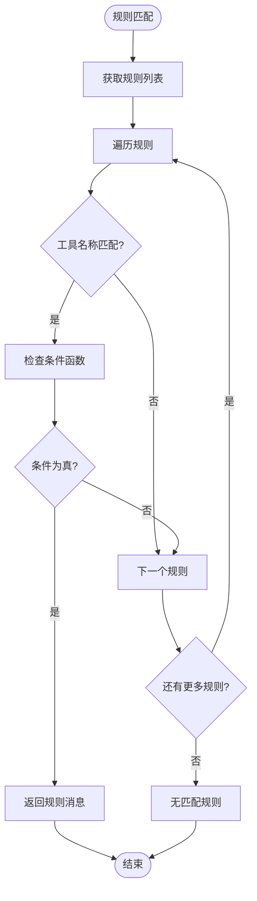
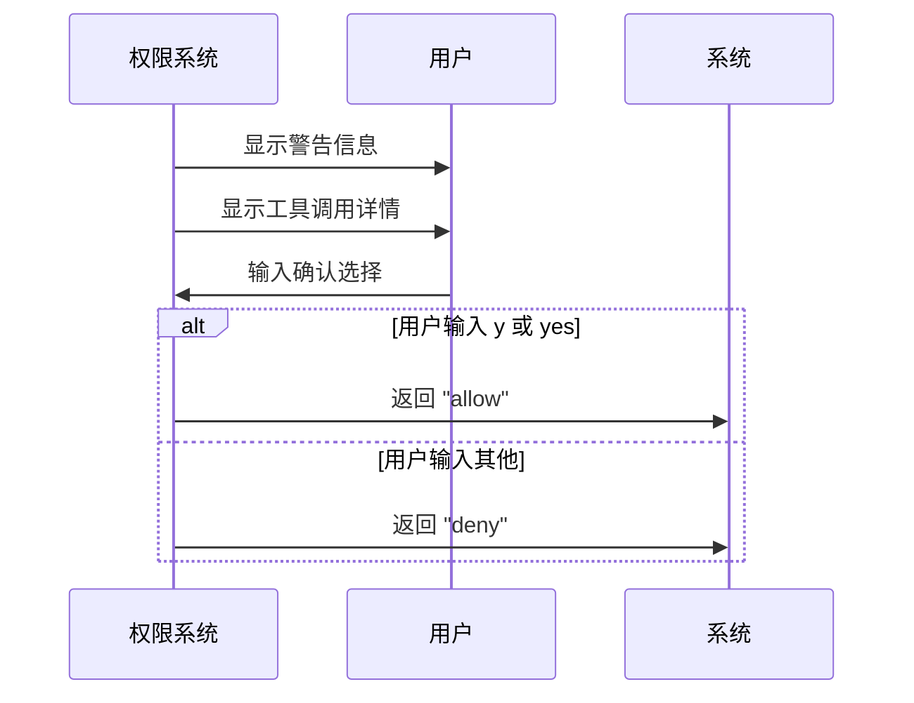
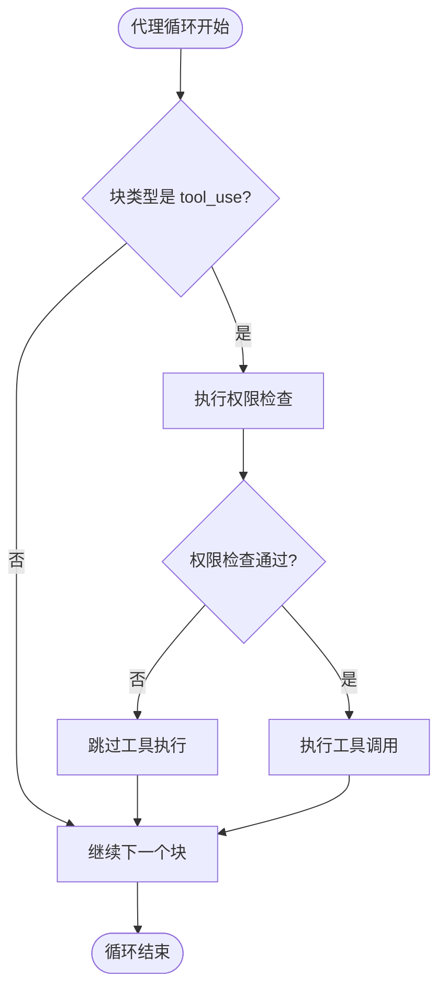
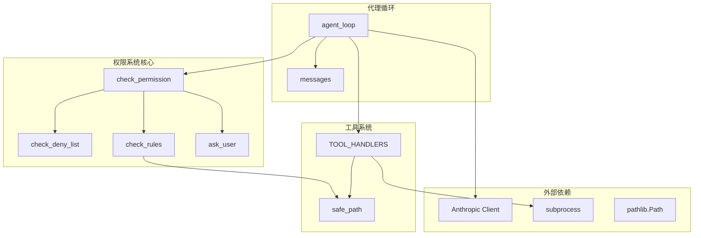
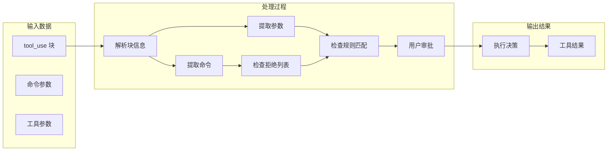

# 权限系统

<cite>
**本文档引用的文件**
- [s03_permission/README.md](file://s03_permission/README.md)
- [s03_permission/README.en.md](file://s03_permission/README.en.md)
- [s03_permission/code.py](file://s03_permission/code.py)
- [s02_tool_use/code.py](file://s02_tool_use/code.py)
- [s01_agent_loop/code.py](file://s01_agent_loop/code.py)
- [s04_hooks/README.md](file://s04_hooks/README.md)
- [README.md](file://README.md)
- [docs/en/s01-the-agent-loop.md](file://docs/en/s01-the-agent-loop.md)
</cite>

## 目录
1. [简介](#简介)
2. [项目结构](#项目结构)
3. [核心组件](#核心组件)
4. [架构概览](#架构概览)
5. [详细组件分析](#详细组件分析)
6. [依赖关系分析](#依赖关系分析)
7. [性能考虑](#性能考虑)
8. [故障排除指南](#故障排除指南)
9. [结论](#结论)

## 简介

权限系统是学习 Claude Code 教程中的第 3 个核心章节，专注于在工具执行前进行安全检查。该系统通过"三道闸门"的设计，在保证安全性的同时保持了系统的简洁性和可扩展性。

### 核心理念

- **安全第一原则**：安全不能依赖于信任模型，必须通过代码实现
- **渐进式权限控制**：从简单的拒绝列表到复杂的规则匹配
- **用户体验平衡**：在安全性和便利性之间找到最佳平衡点
- **可扩展性设计**：为未来的钩子系统预留接口

## 项目结构

学习 Claude Code 采用渐进式教学方法，每个章节都建立在前一个章节的基础之上：



**图表来源**
- [README.md: 259-300:259-300](file://README.md#L259-L300)
- [s03_permission/README.md: 1-10:1-10](file://s03_permission/README.md#L1-L10)

**章节来源**
- [README.md: 209-252:209-252](file://README.md#L209-L252)
- [s03_permission/README.md: 1-10:1-10](file://s03_permission/README.md#L1-L10)

## 核心组件

### 三道闸门权限管道

权限系统的核心是三个安全闸门，按照固定的顺序执行：

#### 闸门 1：硬拒绝列表
- **作用**：阻止永久禁止的操作
- **实现**：简单的字符串匹配
- **示例**：`rm -rf /`、`sudo`、`shutdown`、`reboot`、`mkfs`、`dd if=`、`> /dev/sda`

#### 闸门 2：规则匹配
- **作用**：根据上下文判断是否需要用户确认
- **实现**：基于规则的条件检查
- **示例**：写工作区外文件、潜在破坏性命令

#### 闸门 3：用户审批
- **作用**：在规则匹配后等待用户确认
- **实现**：交互式确认对话
- **示例**：用户输入 `y` 或 `yes` 允许，其他输入拒绝

**章节来源**
- [s03_permission/README.md: 24-34:24-34](file://s03_permission/README.md#L24-L34)
- [s03_permission/README.en.md: 24-34:24-34](file://s03_permission/README.en.md#L24-L34)

### 工具安全机制

#### 路径安全验证
- **目的**：防止路径遍历攻击
- **实现**：确保文件操作限制在工作目录内
- **机制**：使用 `resolve().is_relative_to(WORKDIR)` 进行验证

#### 工具执行安全
- **bash 工具**：额外的安全检查，防止危险命令
- **文件工具**：通过 `safe_path` 函数保护
- **其他工具**：标准化的安全检查流程

**章节来源**
- [s03_permission/code.py: 60-69:60-69](file://s03_permission/code.py#L60-L69)
- [s03_permission/code.py: 148-155:148-155](file://s03_permission/code.py#L148-L155)

## 架构概览



**图表来源**
- [s03_permission/code.py: 220-229:220-229](file://s03_permission/code.py#L220-L229)
- [s03_permission/README.md: 90-118:90-118](file://s03_permission/README.md#L90-L118)

## 详细组件分析

### 权限检查函数

#### check_permission 主函数
这是权限系统的核心函数，实现了三道闸门的完整逻辑：



**图表来源**
- [s03_permission/code.py: 183-195:183-195](file://s03_permission/code.py#L183-L195)

#### 硬拒绝列表检查


**图表来源**
- [s03_permission/code.py: 151-155:151-155](file://s03_permission/code.py#L151-L155)

**章节来源**
- [s03_permission/code.py: 183-195:183-195](file://s03_permission/code.py#L183-L195)

### 规则匹配系统

#### 权限规则定义
规则系统提供了灵活的权限控制机制：

| 工具名称 | 规则条件 | 检查逻辑 | 拒绝原因 |
|---------|---------|---------|---------|
| write_file, edit_file | 路径不在工作目录内 | `(WORKDIR / path).resolve().is_relative_to(WORKDIR)` | 写入工作区外文件 |
| bash | 命令包含危险关键字 | `any(kw in command for kw in ["rm ", "> /etc/", "chmod 777"])` | 潜在破坏性命令 |

#### 规则匹配算法


**图表来源**
- [s03_permission/code.py: 168-172:168-172](file://s03_permission/code.py#L168-L172)

**章节来源**
- [s03_permission/code.py: 158-172:158-172](file://s03_permission/code.py#L158-L172)

### 用户交互机制

#### 用户审批流程
用户审批是权限系统的重要组成部分，提供了人机协作的安全保障：



**图表来源**
- [s03_permission/code.py: 175-180:175-180](file://s03_permission/code.py#L175-L180)

**章节来源**
- [s03_permission/code.py: 175-180:175-180](file://s03_permission/code.py#L175-L180)

### 代理循环集成

#### 权限检查的集成点
权限检查被无缝集成到代理循环中，只增加了一行代码：



**图表来源**
- [s03_permission/code.py: 213-229:213-229](file://s03_permission/code.py#L213-L229)

**章节来源**
- [s03_permission/code.py: 213-229:213-229](file://s03_permission/code.py#L213-L229)

## 依赖关系分析

### 组件间依赖



**图表来源**
- [s03_permission/code.py: 137-141:137-141](file://s03_permission/code.py#L137-L141)
- [s03_permission/code.py: 202-231:202-231](file://s03_permission/code.py#L202-L231)

### 数据流分析

#### 权限检查数据流


**图表来源**
- [s03_permission/code.py: 93-108:93-108](file://s03_permission/code.py#L93-L108)

**章节来源**
- [s03_permission/code.py: 93-108:93-108](file://s03_permission/code.py#L93-L108)

## 性能考虑

### 权限检查性能特征

#### 时间复杂度分析
- **硬拒绝检查**：O(n)，其中 n 是拒绝模式数量
- **规则匹配检查**：O(m)，其中 m 是规则数量
- **整体复杂度**：O(n + m)，通常非常高效

#### 空间复杂度
- **拒绝列表**：O(n)，存储在内存中
- **规则列表**：O(m)，存储在内存中
- **缓存机制**：无持久化缓存，每次检查重新计算

### 优化建议

#### 缓存策略
- **规则编译缓存**：预编译正则表达式
- **路径解析缓存**：缓存工作目录解析结果
- **用户决策缓存**：短期缓存用户偏好设置

#### 批处理优化
- **批量规则检查**：同时检查多个规则
- **并行处理**：利用多核处理器
- **异步执行**：非阻塞用户交互

## 故障排除指南

### 常见问题诊断

#### 权限检查失败
**症状**：工具调用被意外拒绝
**排查步骤**：
1. 检查拒绝列表中是否包含误判模式
2. 验证规则条件是否过于严格
3. 确认用户输入是否正确

#### 用户审批卡顿
**症状**：用户确认环节响应缓慢
**解决方案**：
1. 简化规则检查逻辑
2. 优化用户界面反馈
3. 考虑异步审批机制

#### 路径安全问题
**症状**：合法文件操作被拒绝
**排查步骤**：
1. 检查工作目录配置
2. 验证路径解析逻辑
3. 确认权限设置

### 调试技巧

#### 日志记录
```python
# 添加调试信息
print(f"DEBUG: Checking {block.name} with args {block.input}")
result = check_permission(block)
print(f"DEBUG: Permission result: {result}")
```

#### 错误处理
```python
# 异常捕获和处理
try:
    result = check_permission(block)
except Exception as e:
    print(f"ERROR: Permission check failed: {e}")
    return False  # 默认拒绝
```

**章节来源**
- [s03_permission/code.py: 175-180:175-180](file://s03_permission/code.py#L175-L180)

## 结论

权限系统作为学习 Claude Code 教程的核心组成部分，展示了如何在保持系统简洁性的同时实现强大的安全控制。通过三道闸门的设计，该系统在安全性、可用性和可扩展性之间找到了良好的平衡。

### 主要成就

1. **简洁而有效的安全模型**：通过简单的三道闸门实现了全面的权限控制
2. **用户友好的交互设计**：在必要时提供清晰的用户确认机制
3. **可扩展的架构**：为未来的钩子系统和更复杂的权限管理奠定了基础
4. **教育价值**：通过渐进式教学展示了复杂系统的设计思路

### 未来发展方向

1. **规则引擎增强**：支持更复杂的规则组合和条件判断
2. **自动化审批**：基于历史数据和上下文的智能审批决策
3. **审计日志**：完整的权限使用记录和分析能力
4. **多租户支持**：为不同用户和环境提供定制化的权限策略

该权限系统不仅是一个教学示例，更是构建真实代理系统的重要基础设施，为后续的钩子系统、团队协作和复杂应用场景提供了坚实的基础。