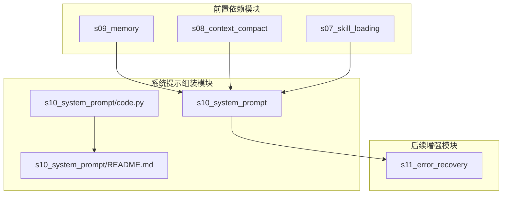
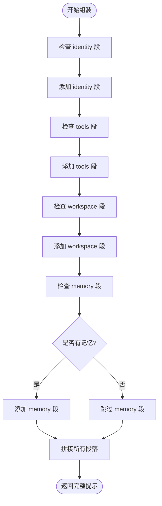
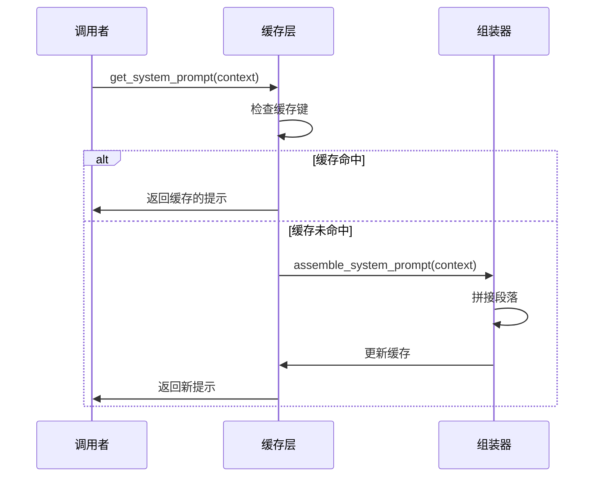
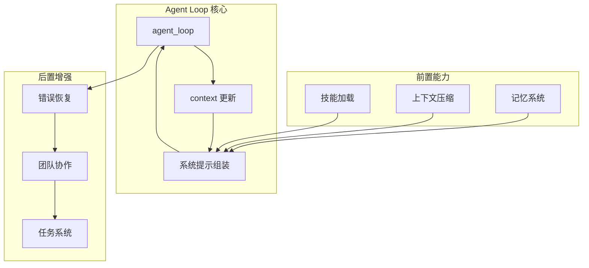
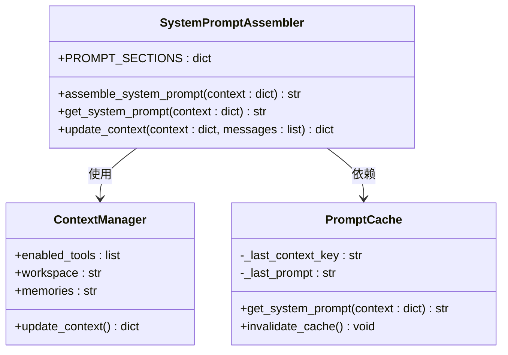
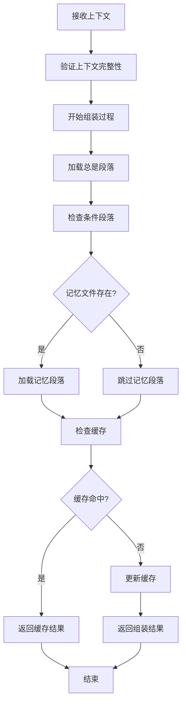
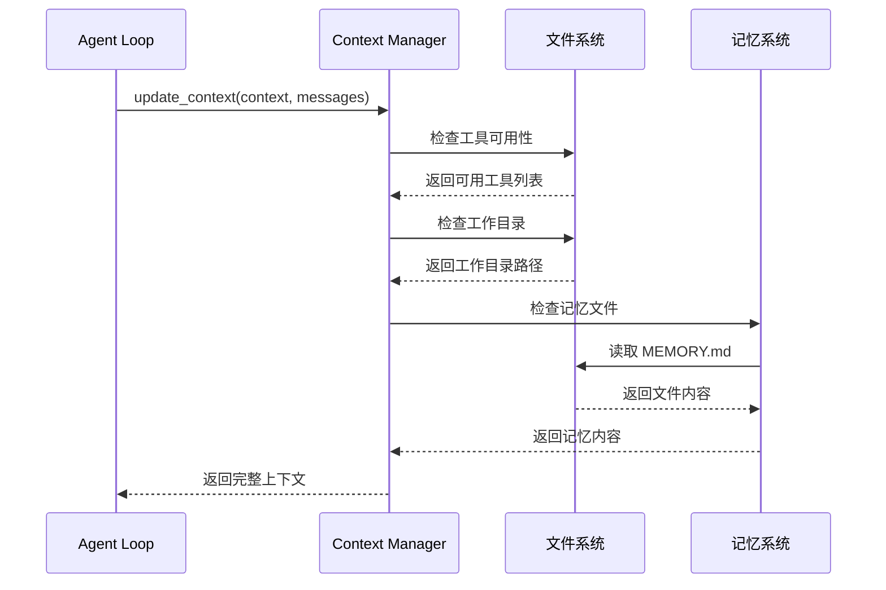
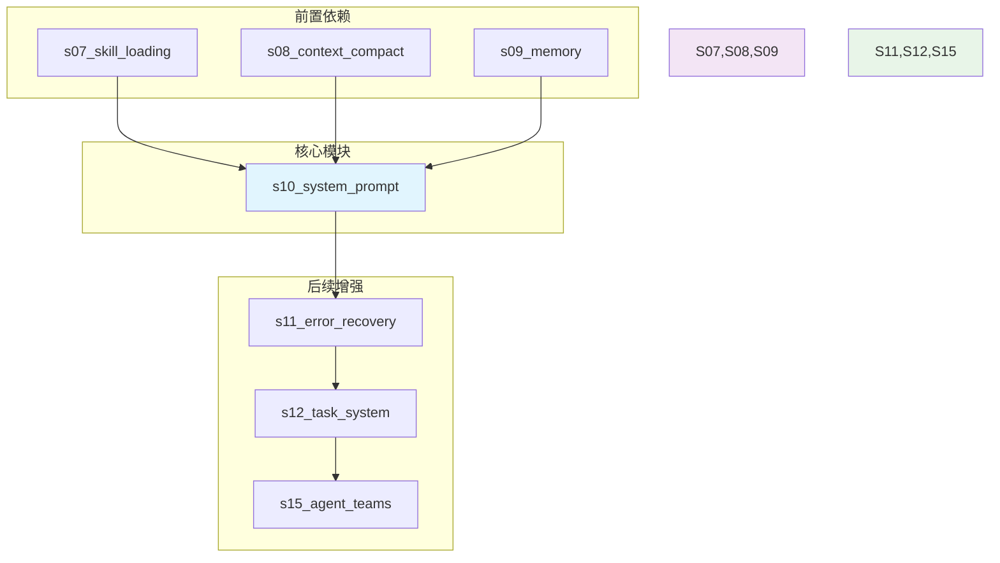
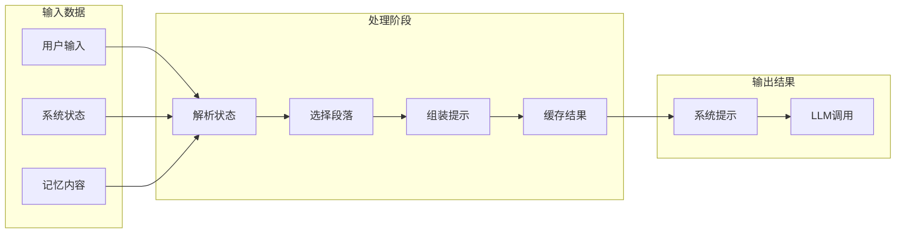

# 系统提示组装

<cite>
**本文档引用的文件**
- [s10_system_prompt/code.py](file://s10_system_prompt/code.py)
- [s10_system_prompt/README.md](file://s10_system_prompt/README.md)
- [s09_memory/code.py](file://s09_memory/code.py)
- [s08_context_compact/code.py](file://s08_context_compact/code.py)
- [s07_skill_loading/code.py](file://s07_skill_loading/code.py)
- [s11_error_recovery/code.py](file://s11_error_recovery/code.py)
- [README.md](file://README.md)
</cite>

## 目录
1. [简介](#简介)
2. [项目结构](#项目结构)
3. [核心组件](#核心组件)
4. [架构概览](#架构概览)
5. [详细组件分析](#详细组件分析)
6. [依赖关系分析](#依赖关系分析)
7. [性能考虑](#性能考虑)
8. [故障排除指南](#故障排除指南)
9. [结论](#结论)

## 简介

系统提示组装（System Prompt Assembly）是 Claude Code 教程系列中的第10个核心章节，专注于将传统的硬编码系统提示转换为运行时动态组装的机制。这一机制通过将系统提示分解为独立的"段落"（sections），根据实时状态按需拼接，并提供智能缓存以避免重复组装。

### 核心理念

传统的系统提示（SYSTEM）在早期版本中是硬编码的一整段字符串，但随着功能的增加，这种做法变得不可维护。s10 引入了"分段组装"的理念：

- **分段定义**：将系统提示分解为独立的主题片段
- **按需加载**：根据真实状态决定加载哪些段落
- **智能缓存**：避免重复的字符串组装操作
- **动态更新**：每轮对话开始时重新评估上下文状态

## 项目结构

**图表来源**
- [s10_system_prompt/code.py:1-219](file://s10_system_prompt/code.py#L1-L219)
- [s09_memory/code.py:1-617](file://s09_memory/code.py#L1-L617)
- [s08_context_compact/code.py:1-470](file://s08_context_compact/code.py#L1-L470)

**章节来源**
- [s10_system_prompt/code.py:1-219](file://s10_system_prompt/code.py#L1-L219)
- [s10_system_prompt/README.md:1-255](file://s10_system_prompt/README.md#L1-L255)

## 核心组件

### PROMPT_SECTIONS：分段定义

系统提示被分解为四个独立的段落，每个段落都有明确的职责：

| 段落名称 | 加载策略 | 内容 | 判断依据 |
|---------|---------|------|---------|
| identity | 始终 | 你是谁、怎么做事 | 始终存在 |
| tools | 始终 | 可用工具列表 | enabled_tools |
| workspace | 始终 | 工作目录 | 始终存在 |
| memory | 按需 | 相关记忆内容 | .memory/MEMORY.md 是否存在 |

### assemble_system_prompt：按需拼接

**图表来源**
- [s10_system_prompt/code.py:50-98](file://s10_system_prompt/code.py#L50-L98)

### get_system_prompt：缓存机制

系统实现了智能缓存机制，避免重复的字符串组装操作：

**图表来源**
- [s10_system_prompt/code.py:71-92](file://s10_system_prompt/code.py#L71-L92)

**章节来源**
- [s10_system_prompt/code.py:40-98](file://s10_system_prompt/code.py#L40-L98)

## 架构概览

系统提示组装在整个 Claude Code 架构中的位置：

**图表来源**
- [s10_system_prompt/code.py:170-198](file://s10_system_prompt/code.py#L170-L198)
- [s09_memory/code.py:549-591](file://s09_memory/code.py#L549-L591)
- [s08_context_compact/code.py:397-454](file://s08_context_compact/code.py#L397-L454)

## 详细组件分析

### 组件A：系统提示组装器

系统提示组装器是整个模块的核心，负责将各个段落按照指定策略组合成最终的系统提示。

#### 类结构图

**图表来源**
- [s10_system_prompt/code.py:40-98](file://s10_system_prompt/code.py#L40-L98)
- [s10_system_prompt/code.py:154-167](file://s10_system_prompt/code.py#L154-L167)
- [s10_system_prompt/code.py:71-92](file://s10_system_prompt/code.py#L71-L92)

#### 关键算法流程

**图表来源**
- [s10_system_prompt/code.py:50-98](file://s10_system_prompt/code.py#L50-L98)
- [s10_system_prompt/code.py:71-92](file://s10_system_prompt/code.py#L71-L92)

**章节来源**
- [s10_system_prompt/code.py:50-167](file://s10_system_prompt/code.py#L50-L167)

### 组件B：上下文管理系统

上下文管理系统负责从真实状态推导出当前可用的工具、工作目录和记忆内容。

#### 上下文更新流程

**图表来源**
- [s10_system_prompt/code.py:154-167](file://s10_system_prompt/code.py#L154-L167)
- [s09_memory/code.py:84-104](file://s09_memory/code.py#L84-L104)

**章节来源**
- [s10_system_prompt/code.py:154-167](file://s10_system_prompt/code.py#L154-L167)

### 组件C：工具系统集成

工具系统与系统提示组装紧密集成，确保工具描述的准确性和一致性。

#### 工具描述同步机制

| 工具名称 | 描述 | 在系统提示中的体现 |
|---------|------|-------------------|
| bash | 运行 shell 命令 | tools 段落中的可用工具列表 |
| read_file | 读取文件内容 | tools 段落中的可用工具列表 |
| write_file | 写入文件内容 | tools 段落中的可用工具列表 |

**章节来源**
- [s10_system_prompt/code.py:134-151](file://s10_system_prompt/code.py#L134-L151)

## 依赖关系分析

### 模块依赖图

**图表来源**
- [s10_system_prompt/code.py:1-219](file://s10_system_prompt/code.py#L1-L219)
- [s07_skill_loading/code.py:1-200](file://s07_skill_loading/code.py#L1-L200)
- [s08_context_compact/code.py:1-470](file://s08_context_compact/code.py#L1-L470)
- [s09_memory/code.py:1-617](file://s09_memory/code.py#L1-L617)

### 数据流分析

系统提示组装的数据流遵循以下模式：

**图表来源**
- [s10_system_prompt/code.py:170-198](file://s10_system_prompt/code.py#L170-L198)
- [s10_system_prompt/code.py:71-92](file://s10_system_prompt/code.py#L71-L92)

**章节来源**
- [s10_system_prompt/code.py:170-198](file://s10_system_prompt/code.py#L170-L198)

## 性能考虑

### 缓存策略优化

系统提示组装实现了多层次的性能优化：

1. **内存缓存**：避免重复的字符串拼接操作
2. **确定性序列化**：使用 `json.dumps` 确保缓存键的稳定性
3. **按需加载**：只加载必要的段落，减少 token 消耗
4. **智能判断**：基于真实状态而非关键词匹配

### Token 成本控制

通过分段组装，系统能够有效控制 token 成本：

- **总是段落**：identity、tools、workspace（必需）
- **按需段落**：memory（仅在需要时加载）
- **动态调整**：根据上下文状态智能选择加载内容

## 故障排除指南

### 常见问题及解决方案

#### 问题1：系统提示组装失败

**症状**：`get_system_prompt` 函数抛出异常

**解决方案**：
1. 检查 `PROMPT_SECTIONS` 字典是否正确初始化
2. 验证 `context` 参数的完整性
3. 确认缓存变量的正确性

#### 问题2：缓存未生效

**症状**：每次调用都重新组装系统提示

**解决方案**：
1. 检查 `json.dumps` 的序列化参数
2. 验证 `_last_context_key` 的更新逻辑
3. 确认 `context` 对象的稳定性

#### 问题3：内存段落未加载

**症状**：`.memory/MEMORY.md` 文件存在但未被加载

**解决方案**：
1. 检查文件路径是否正确
2. 验证文件内容是否为空
3. 确认 `update_context` 函数的逻辑

**章节来源**
- [s10_system_prompt/code.py:71-92](file://s10_system_prompt/code.py#L71-L92)
- [s10_system_prompt/code.py:154-167](file://s10_system_prompt/code.py#L154-L167)

## 结论

系统提示组装代表了 Claude Code 教程系列中的一个重要里程碑，它将传统的硬编码系统提示转变为灵活的动态组装机制。这一设计具有以下优势：

1. **可维护性**：独立的段落便于管理和修改
2. **灵活性**：根据实时状态动态调整提示内容
3. **性能**：智能缓存和按需加载优化资源使用
4. **扩展性**：为后续功能增强奠定基础

通过将系统提示分解为独立的段落，开发者可以更精确地控制 Agent 的行为，同时保持代码的清晰性和可维护性。这一机制为构建复杂的 Agent 系统提供了坚实的基础。

在未来的发展中，系统提示组装将继续演进，结合更多的上下文信息和动态内容，为 Agent 提供更加智能和适应性强的指导。