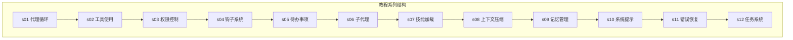
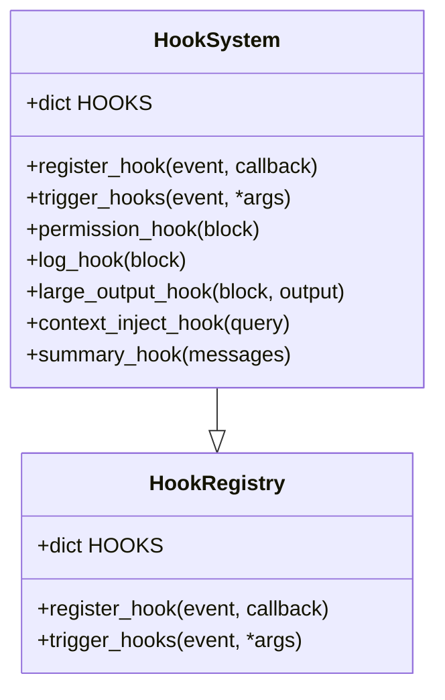
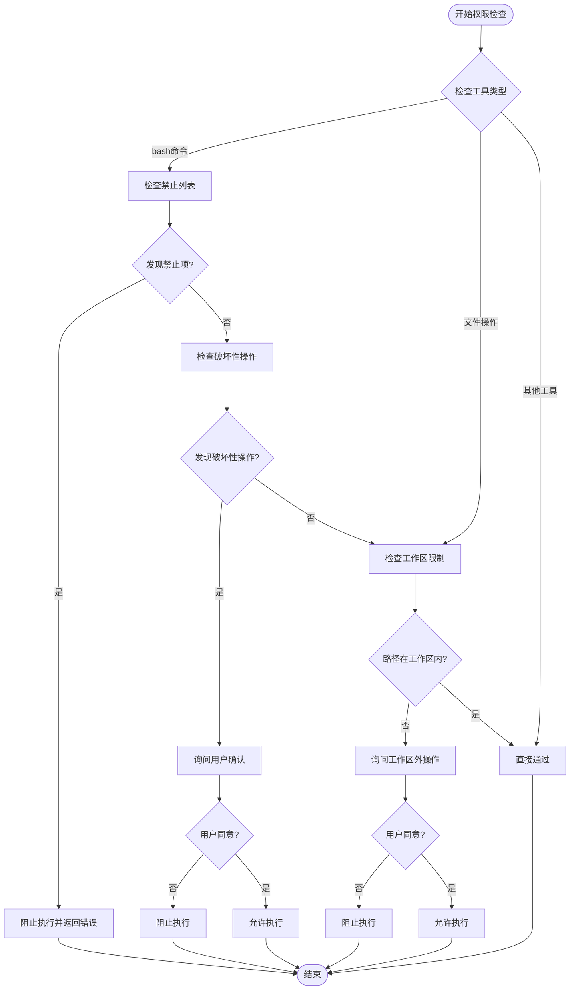
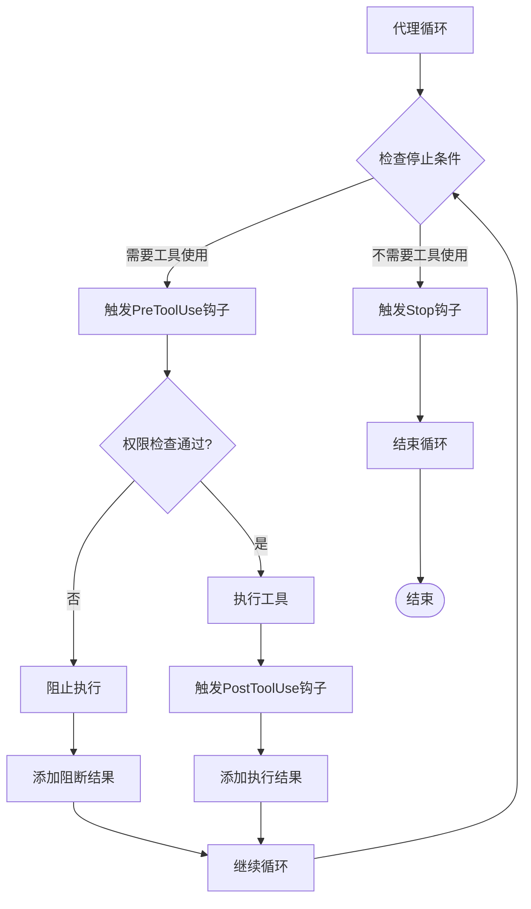
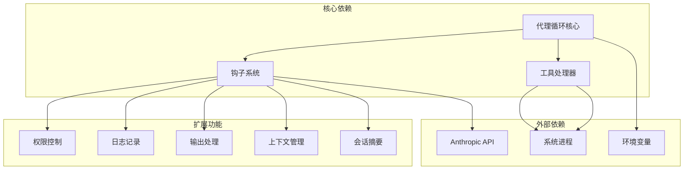

# 钩子系统

<cite>
**本文档引用的文件**
- [s04_hooks/code.py](file://s04_hooks/code.py)
- [s04_hooks/README.md](file://s04_hooks/README.md)
- [s05_todo_write/code.py](file://s05_todo_write/code.py)
- [s06_subagent/code.py](file://s06_subagent/code.py)
- [README.md](file://README.md)
- [requirements.txt](file://requirements.txt)
</cite>

## 目录
1. [简介](#简介)
2. [项目结构](#项目结构)
3. [核心组件](#核心组件)
4. [架构概览](#架构概览)
5. [详细组件分析](#详细组件分析)
6. [依赖关系分析](#依赖关系分析)
7. [性能考虑](#性能考虑)
8. [故障排除指南](#故障排除指南)
9. [结论](#结论)

## 简介

钩子系统（Hooks System）是本教程系列中的一个重要概念，它提供了一种优雅的方式来扩展智能体的行为，而无需修改核心代理循环。通过钩子系统，开发者可以在代理生命周期的关键节点插入自定义逻辑，实现权限检查、日志记录、输出处理等功能。

钩子系统的核心思想是"扩展点不侵入循环"，即把原本硬编码在代理循环中的功能逻辑转移到独立的钩子函数中，通过注册表管理这些钩子，并在适当的时机触发它们。

## 项目结构

本项目采用模块化的设计，每个章节都专注于特定的代理功能增强。钩子系统作为第4章的主题，在整个教程体系中扮演着承上启下的关键角色。



**图表来源**
- [README.md:164-191](file://README.md#L164-L191)

**章节来源**
- [README.md:164-191](file://README.md#L164-L191)

## 核心组件

钩子系统主要包含以下几个核心组件：

### 1. 钩子注册表（HOOKS）
这是一个字典结构，将事件名称映射到回调函数列表：
- `UserPromptSubmit`: 用户提交查询后触发
- `PreToolUse`: 工具执行前触发
- `PostToolUse`: 工具执行后触发  
- `Stop`: 代理循环即将停止时触发

### 2. 核心函数
- `register_hook(event, callback)`: 注册钩子函数
- `trigger_hooks(event, *args)`: 触发指定事件的所有钩子

### 3. 预定义钩子
- `permission_hook`: 权限检查钩子
- `log_hook`: 日志记录钩子
- `large_output_hook`: 大输出警告钩子
- `context_inject_hook`: 上下文注入钩子
- `summary_hook`: 会话摘要钩子

**章节来源**
- [s04_hooks/code.py:159-229](file://s04_hooks/code.py#L159-L229)
- [s04_hooks/README.md:56-77](file://s04_hooks/README.md#L56-L77)

## 架构概览

钩子系统采用事件驱动的架构模式，通过注册表管理钩子函数的生命周期。

```mermaid
sequenceDiagram
participant User as 用户
participant Main as 主程序
participant Hook as 钩子系统
participant Loop as 代理循环
participant Tools as 工具处理器
User->>Main : 输入查询
Main->>Hook : trigger_hooks("UserPromptSubmit", query)
Hook-->>Main : 钩子执行完成
Main->>Loop : 调用 agent_loop()
Loop->>Loop : LLM推理
Loop->>Hook : trigger_hooks("PreToolUse", block)
Hook-->>Loop : 权限检查结果
alt 通过权限检查
Loop->>Tools : 执行工具
Tools-->>Loop : 返回结果
Loop->>Hook : trigger_hooks("PostToolUse", block, output)
Hook-->>Loop : 后处理完成
else 权限被拒绝
Loop-->>Main : 返回阻断消息
end
Loop->>Hook : trigger_hooks("Stop", messages)
Hook-->>Loop : 会话摘要
Loop-->>Main : 返回最终结果
```

**图表来源**
- [s04_hooks/code.py:238-273](file://s04_hooks/code.py#L238-L273)
- [s04_hooks/README.md:146-156](file://s04_hooks/README.md#L146-L156)

## 详细组件分析

### 钩子注册表设计

钩子注册表采用简单的字典结构，每个事件类型对应一个回调函数列表：



**图表来源**
- [s04_hooks/code.py:159-229](file://s04_hooks/code.py#L159-L229)

### 权限检查钩子

权限检查钩子实现了安全策略，防止危险操作：



**图表来源**
- [s04_hooks/code.py:176-198](file://s04_hooks/code.py#L176-L198)

### 代理循环集成

钩子系统与代理循环的集成展示了如何将扩展逻辑从核心循环中分离：



**图表来源**
- [s04_hooks/code.py:238-273](file://s04_hooks/code.py#L238-L273)

**章节来源**
- [s04_hooks/code.py:176-198](file://s04_hooks/code.py#L176-L198)
- [s04_hooks/code.py:238-273](file://s04_hooks/code.py#L238-L273)

## 依赖关系分析

钩子系统在整个教程体系中与其他组件存在密切的依赖关系：



**图表来源**
- [s04_hooks/code.py:74-152](file://s04_hooks/code.py#L74-L152)
- [requirements.txt:1-3](file://requirements.txt#L1-L3)

**章节来源**
- [s04_hooks/code.py:74-152](file://s04_hooks/code.py#L74-L152)
- [requirements.txt:1-3](file://requirements.txt#L1-L3)

## 性能考虑

钩子系统的性能特性主要体现在以下几个方面：

### 1. 时间复杂度
- 钩子注册：O(1) - 字典插入操作
- 钩子触发：O(n) - n为该事件注册的钩子数量
- 权限检查：O(m) - m为禁止列表长度

### 2. 空间复杂度
- 钩子注册表：O(k) - k为所有注册钩子的总数
- 每个钩子函数：O(1) - 仅存储函数引用

### 3. 性能优化建议
- 合理控制每个事件的钩子数量，避免过多钩子影响响应时间
- 对昂贵的钩子操作进行缓存
- 使用异步钩子处理I/O密集型操作

## 故障排除指南

### 常见问题及解决方案

#### 1. 钩子未生效
**症状**：注册的钩子函数没有被执行
**可能原因**：
- 钩子注册时事件名称不匹配
- 钩子函数签名不正确
- 触发时机不正确

**解决方法**：
```python
# 确保事件名称正确
register_hook("PreToolUse", permission_hook)

# 确保函数签名正确
def permission_hook(block):
    # 处理逻辑
    pass
```

#### 2. 权限检查过于严格
**症状**：合法操作被错误阻止
**解决方法**：
- 检查禁止列表配置
- 调整破坏性操作的判断逻辑
- 提供更灵活的用户确认机制

#### 3. 钩子执行顺序问题
**症状**：多个钩子的执行顺序导致逻辑冲突
**解决方法**：
- 明确钩子的执行顺序要求
- 在钩子内部处理相互依赖关系
- 考虑使用优先级机制

**章节来源**
- [s04_hooks/code.py:161-169](file://s04_hooks/code.py#L161-L169)
- [s04_hooks/code.py:176-198](file://s04_hooks/code.py#L176-L198)

## 结论

钩子系统是构建可扩展智能体的重要基础设施。通过将扩展逻辑从核心代理循环中分离，钩子系统提供了以下优势：

### 主要优势
1. **解耦设计**：核心循环保持简洁，扩展逻辑独立管理
2. **可维护性**：新增功能只需添加钩子，无需修改核心代码
3. **灵活性**：支持动态注册和注销钩子
4. **安全性**：统一的权限检查机制

### 最佳实践
1. **单一职责**：每个钩子函数专注于特定功能
2. **错误处理**：钩子函数应具备完善的错误处理机制
3. **性能考虑**：避免在钩子中执行耗时操作
4. **文档规范**：为钩子函数提供清晰的接口文档

### 发展方向
随着智能体功能的复杂化，钩子系统可以进一步演进：
- 支持异步钩子处理
- 提供钩子优先级和依赖管理
- 增强钩子间的通信机制
- 完善钩子状态管理和持久化

钩子系统为构建生产级别的智能体平台奠定了坚实的基础，是Harness工程中的关键组件之一。