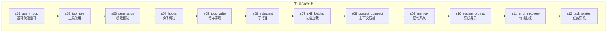
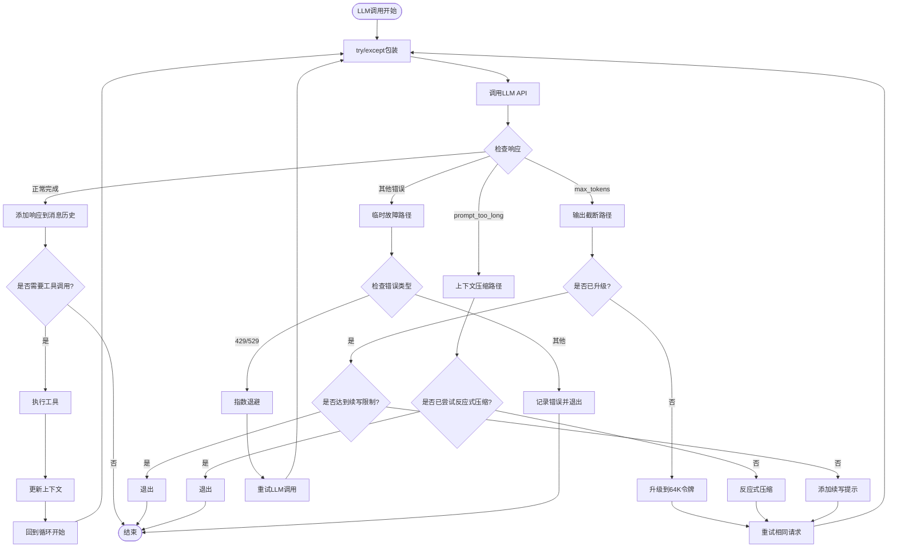
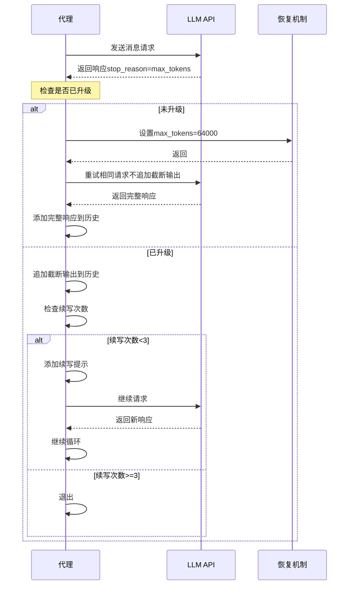
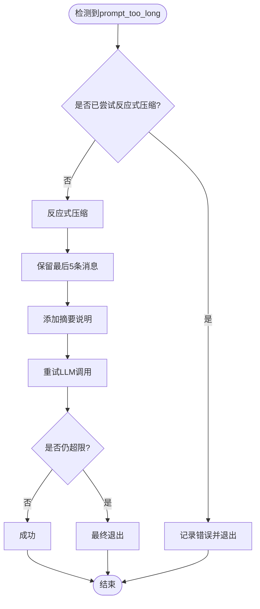
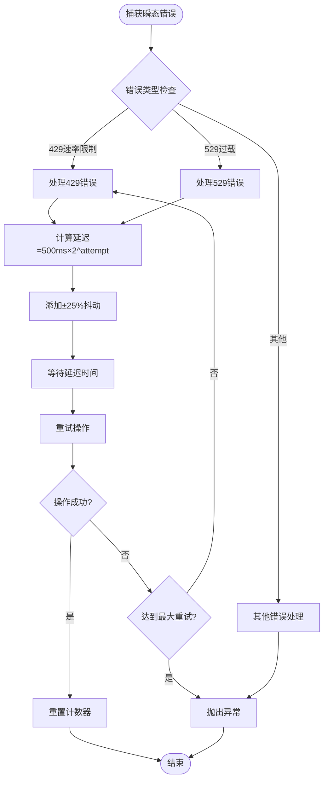
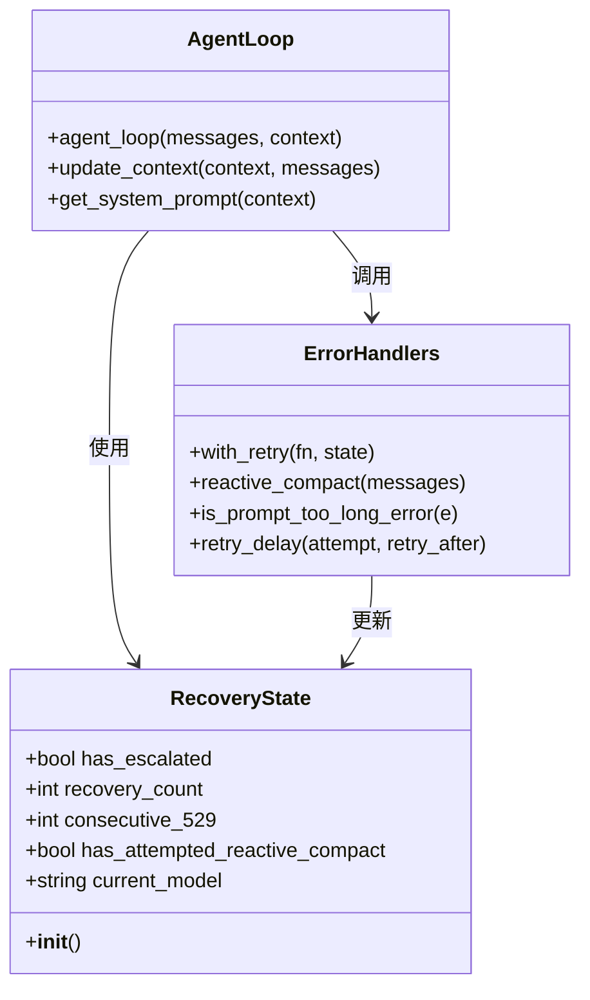
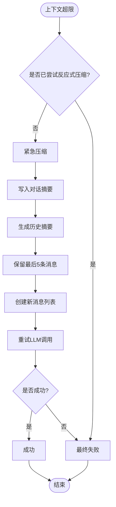

# 错误恢复机制

<cite>
**本文档引用的文件**
- [s11_error_recovery/code.py](file://s11_error_recovery/code.py)
- [s11_error_recovery/README.md](file://s11_error_recovery/README.md)
- [s11_error_recovery/README.en.md](file://s11_error_recovery/README.en.md)
- [s08_context_compact/README.md](file://s08_context_compact/README.md)
- [s08_context_compact/README.en.md](file://s08_context_compact/README.en.md)
- [tests/test_agents_smoke.py](file://tests/test_agents_smoke.py)
</cite>

## 目录
1. [简介](#简介)
2. [项目结构](#项目结构)
3. [核心组件](#核心组件)
4. [架构概览](#架构概览)
5. [详细组件分析](#详细组件分析)
6. [错误恢复策略](#错误恢复策略)
7. [指数退避算法](#指数退避算法)
8. [上下文压缩机制](#上下文压缩机制)
9. [性能考虑](#性能考虑)
10. [故障排除指南](#故障排除指南)
11. [结论](#结论)

## 简介

错误恢复机制是智能代理系统中的关键组成部分，它确保代理能够在面对各种类型的错误和异常时保持稳定运行。本项目实现了三种主要的错误恢复路径：输出截断恢复、上下文超限处理和临时故障应对。这些机制共同构成了一个健壮的错误处理框架，使代理能够在生产环境中可靠地执行任务。

错误恢复机制的设计理念是"错误不是终点，而是重试的起点"，通过智能的错误分类和相应的恢复策略，最大化代理的可用性和成功率。

## 项目结构

该项目采用模块化设计，每个章节专注于特定的功能领域。错误恢复机制位于第11个学习阶段，与之前的上下文压缩机制形成互补关系。



**图表来源**
- [s11_error_recovery/README.md:1-278](file://s11_error_recovery/README.md#L1-L278)

**章节来源**
- [s11_error_recovery/README.md:1-278](file://s11_error_recovery/README.md#L1-L278)

## 核心组件

错误恢复机制包含以下核心组件：

### RecoveryState 类
负责跟踪恢复过程中的状态信息，包括：
- 是否已经进行过升级（has_escalated）
- 恢复次数统计（recovery_count）
- 连续529错误计数（consecutive_529）
- 是否尝试过反应式压缩（has_attempted_reactive_compact）
- 当前使用的模型（current_model）

### with_retry 函数
实现指数退避算法，处理瞬态错误（429/529）：
- 基础延迟：500ms × 2^attempt
- 最大延迟：32秒
- 随机抖动：±25%
- 最大重试次数：10次

### agent_loop 函数
主循环，集成所有错误恢复逻辑：
- LLM调用包装在try/except中
- 根据错误类型选择相应的恢复路径
- 支持三种恢复模式的组合使用

**章节来源**
- [s11_error_recovery/code.py:163-341](file://s11_error_recovery/code.py#L163-L341)

## 架构概览

错误恢复机制采用分层架构设计，每个层次负责特定类型的错误处理：



**图表来源**
- [s11_error_recovery/code.py:265-341](file://s11_error_recovery/code.py#L265-L341)

## 详细组件分析

### 输出截断恢复路径

当模型在输出过程中耗尽令牌时，系统会执行以下流程：



**图表来源**
- [s11_error_recovery/code.py:300-318](file://s11_error_recovery/code.py#L300-L318)

### 上下文超限处理路径

当上下文长度超过限制时，系统采用反应式压缩：



**图表来源**
- [s11_error_recovery/code.py:281-298](file://s11_error_recovery/code.py#L281-L298)

### 临时故障应对机制

对于429/529等瞬态错误，系统使用指数退避算法：



**图表来源**
- [s11_error_recovery/code.py:182-223](file://s11_error_recovery/code.py#L182-L223)

**章节来源**
- [s11_error_recovery/code.py:163-341](file://s11_error_recovery/code.py#L163-L341)

## 错误恢复策略

### 错误分类与处理

系统将错误分为三大类，并采用相应的处理策略：

| 错误类型 | 触发条件 | 恢复策略 | 限制条件 |
|---------|---------|---------|---------|
| 输出截断 | `max_tokens` | 升级令牌限制→续写提示 | 令牌升级1次，续写最多3次 |
| 上下文超限 | `prompt_too_long` | 反应式压缩→重试 | 压缩1次，超过则退出 |
| 临时故障 | 429/529 | 指数退避+抖动 | 最多10次重试，连续3次529切换模型 |

### 恢复状态管理

RecoveryState类提供完整的状态跟踪：



**图表来源**
- [s11_error_recovery/code.py:163-245](file://s11_error_recovery/code.py#L163-L245)

**章节来源**
- [s11_error_recovery/code.py:163-245](file://s11_error_recovery/code.py#L163-L245)

## 指数退避算法

指数退避是处理临时故障的核心算法，具有以下特性：

### 基础公式
```
延迟 = min(500ms × 2^attempt, 32000ms) + 随机抖动(±25%)
```

### 延迟序列

| 尝试次数 | 基础延迟 | 抖动范围 | 实际延迟 |
|---------|---------|---------|---------|
| 1 | 500ms | ±125ms | 375-625ms |
| 2 | 1000ms | ±250ms | 750-1250ms |
| 3 | 2000ms | ±500ms | 1500-2500ms |
| 4 | 4000ms | ±1000ms | 3000-5000ms |
| 5 | 8000ms | ±2000ms | 6000-10000ms |
| 6+ | 32000ms | ±8000ms | 24000-40000ms |

### 退避策略优势

1. **避免雪崩效应**：随机抖动防止大量请求同时重试
2. **自适应调节**：随着失败次数增加，等待时间呈指数增长
3. **上限保护**：最大延迟32秒，防止无限等待
4. **优先级处理**：服务器返回的Retry-After头具有最高优先级

**章节来源**
- [s11_error_recovery/code.py:173-223](file://s11_error_recovery/code.py#L173-L223)

## 上下文压缩机制

错误恢复机制与上下文压缩机制形成互补关系，共同确保代理的稳定性。

### 压缩层次对比

| 压缩层次 | 触发条件 | 处理方式 | 成本 | 适用场景 |
|---------|---------|---------|------|---------|
| L3预算处理 | 大型工具结果 | 落盘持久化 | 低 | 大文件读取 |
| L1中间裁剪 | 中等上下文 | 裁剪中间内容 | 低 | 多文件读取 |
| L2微压缩 | 旧结果占位 | 文本占位符 | 低 | 长对话历史 |
| L4自动摘要 | 阈值触发 | LLM摘要 | 高 | 大型上下文 |
| 反应式压缩 | 紧急情况 | 末尾裁剪+摘要 | 中 | 临时超限 |

### 反应式压缩流程



**图表来源**
- [s08_context_compact/README.md:135-142](file://s08_context_compact/README.md#L135-L142)

**章节来源**
- [s08_context_compact/README.md:140-180](file://s08_context_compact/README.md#L140-L180)

## 性能考虑

### 资源优化策略

1. **令牌预算管理**
   - 默认8000令牌，必要时升级到64000
   - 续写限制3次，防止无限扩展
   - 智能判断继续输出的价值

2. **内存使用控制**
   - 反应式压缩保留最近5条消息
   - 上下文摘要替代完整历史
   - 大文件结果落盘而非内存存储

3. **网络资源保护**
   - 指数退避避免API过载
   - 最大重试10次，防止资源浪费
   - 连续529错误切换备用模型

### 性能监控指标

| 指标类型 | 目标值 | 监控方法 |
|---------|--------|---------|
| 成功率 | >95% | 统计错误恢复次数 |
| 平均恢复时间 | <5秒 | 记录退避等待时间 |
| 上下文大小 | <50000tokens | 监控消息长度 |
| 重试频率 | <10% | 统计重试比例 |

## 故障排除指南

### 常见问题诊断

#### 问题1：频繁429错误
**症状**：大量"429 rate limit"日志
**原因**：API配额不足或请求过于频繁
**解决方案**：
1. 检查环境变量配置
2. 实现请求节流
3. 考虑升级API配额

#### 问题2：持续529错误
**症状**：连续"529 overloaded"日志
**原因**：服务端过载
**解决方案**：
1. 配置备用模型
2. 增加退避延迟
3. 实现负载均衡

#### 问题3：上下文仍然超限
**症状**：即使压缩后仍报"prompt_too_long"
**原因**：上下文过大或压缩不足
**解决方案**：
1. 检查压缩层次配置
2. 增加压缩强度
3. 实现更激进的压缩策略

### 调试技巧

1. **启用详细日志**：观察错误恢复的具体步骤
2. **监控状态变化**：跟踪RecoveryState的状态转换
3. **测试边界条件**：验证各种错误场景的处理
4. **性能基准测试**：评估不同配置的性能影响

**章节来源**
- [s11_error_recovery/README.md:176-188](file://s11_error_recovery/README.md#L176-L188)

## 结论

错误恢复机制是构建可靠智能代理系统的关键基础设施。通过实现三种互补的恢复路径，系统能够在面对各种类型的错误时保持稳定运行。

### 核心价值

1. **提高可用性**：通过智能恢复策略，显著提升代理的成功率
2. **增强韧性**：指数退避和状态管理确保系统在压力下的稳定性
3. **优化用户体验**：无缝的错误处理避免用户感知到系统故障
4. **支持生产部署**：健壮的错误处理机制适合在生产环境中使用

### 未来发展方向

1. **增强错误分类**：识别更多类型的错误并提供针对性恢复
2. **智能阈值调整**：根据历史数据动态调整恢复参数
3. **分布式协调**：在多实例环境下协调错误恢复策略
4. **机器学习优化**：利用机器学习优化恢复决策

错误恢复机制不仅解决了技术层面的问题，更重要的是为智能代理的实用化奠定了坚实基础。通过持续的优化和完善，这一机制将继续推动AI代理系统向更高水平发展。