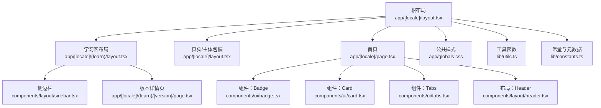
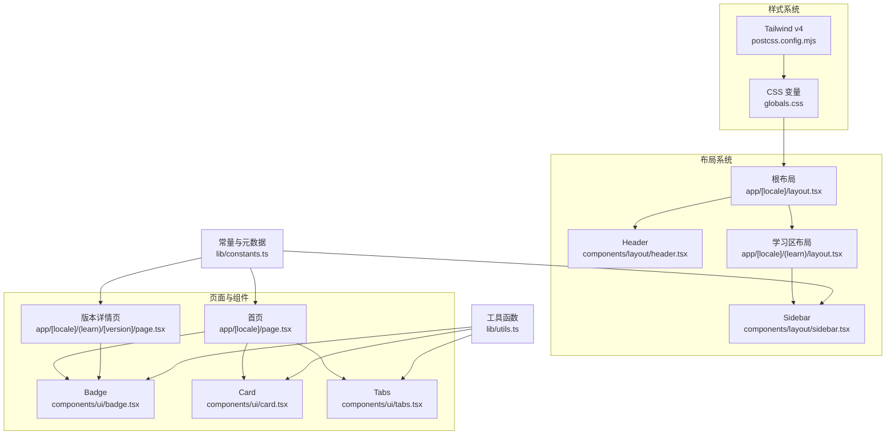
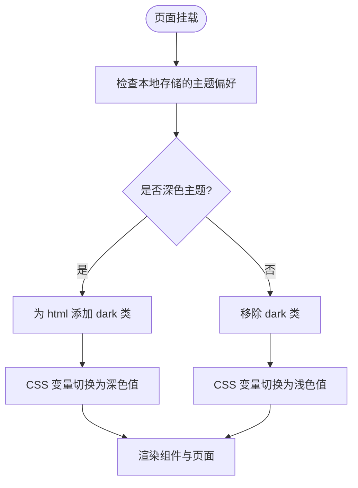
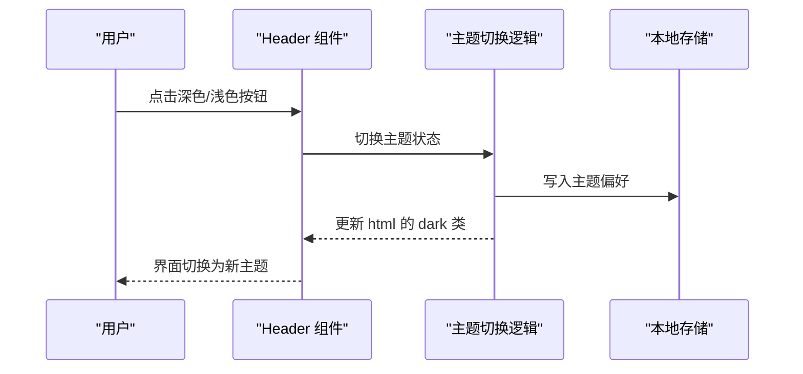
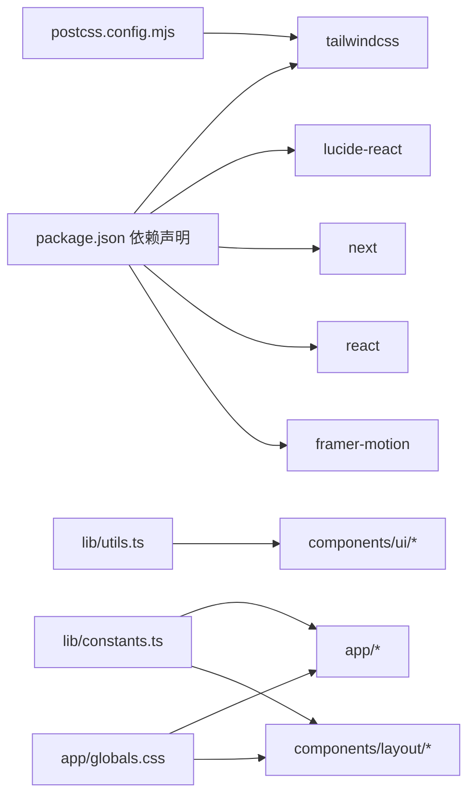

# UI/UX设计规范

<cite>
**本文档引用的文件**
- [globals.css](file://web/src/app/globals.css)
- [constants.ts](file://web/src/lib/constants.ts)
- [badge.tsx](file://web/src/components/ui/badge.tsx)
- [card.tsx](file://web/src/components/ui/card.tsx)
- [tabs.tsx](file://web/src/components/ui/tabs.tsx)
- [header.tsx](file://web/src/components/layout/header.tsx)
- [sidebar.tsx](file://web/src/components/layout/sidebar.tsx)
- [layout.tsx](file://web/src/app/[locale]/layout.tsx)
- [layout.tsx](file://web/src/app/[locale]/(learn)/layout.tsx)
- [page.tsx](file://web/src/app/[locale]/page.tsx)
- [page.tsx](file://web/src/app/[locale]/(learn)/[version]/page.tsx)
- [utils.ts](file://web/src/lib/utils.ts)
- [package.json](file://web/package.json)
- [postcss.config.mjs](file://web/postcss.config.mjs)
</cite>

## 目录
1. [引言](#引言)
2. [项目结构](#项目结构)
3. [核心组件](#核心组件)
4. [架构总览](#架构总览)
5. [详细组件分析](#详细组件分析)
6. [依赖关系分析](#依赖关系分析)
7. [性能考虑](#性能考虑)
8. [故障排除指南](#故障排除指南)
9. [结论](#结论)
10. [附录](#附录)

## 引言
本设计规范旨在为“Learn Claude Code”网站提供统一的视觉与交互语言，确保在多语言、深色模式、响应式布局下的用户体验一致且高效。内容涵盖颜色体系、字体与排版、间距与断点、组件库（badge、card、tabs 等）的设计原则与使用规范，以及布局系统（header、sidebar）的设计理念与实现策略，并给出可访问性与性能优化建议。

## 项目结构
该站点采用 Next.js App Router 结构，样式通过 Tailwind CSS v4 与自定义 CSS 变量实现，全局样式集中于全局样式表，组件化 UI 与布局位于 components 目录，国际化与常量配置位于 lib 目录。

图表来源
- [layout.tsx:29-60](file://web/src/app/[locale]/layout.tsx#L29-L60)
- [layout.tsx](file://web/src/app/[locale]/(learn)/layout.tsx#L3-L14)
- [page.tsx:40-234](file://web/src/app/[locale]/page.tsx#L40-L234)
- [page.tsx](file://web/src/app/[locale]/(learn)/[version]/page.tsx#L12-L125)
- [globals.css:1-556](file://web/src/app/globals.css#L1-L556)
- [utils.ts:1-4](file://web/src/lib/utils.ts#L1-L4)
- [constants.ts:1-38](file://web/src/lib/constants.ts#L1-L38)
- [badge.tsx:1-35](file://web/src/components/ui/badge.tsx#L1-L35)
- [card.tsx:1-40](file://web/src/components/ui/card.tsx#L1-L40)
- [tabs.tsx:1-38](file://web/src/components/ui/tabs.tsx#L1-L38)
- [header.tsx:1-167](file://web/src/components/layout/header.tsx#L1-L167)
- [sidebar.tsx:1-67](file://web/src/components/layout/sidebar.tsx#L1-L67)

章节来源
- [layout.tsx:29-60](file://web/src/app/[locale]/layout.tsx#L29-L60)
- [layout.tsx](file://web/src/app/[locale]/(learn)/layout.tsx#L3-L14)

## 核心组件
本节聚焦基础 UI 组件的设计原则与使用规范，确保在不同页面中保持一致的视觉与交互体验。

- Badge（徽章）
  - 设计目标：用于标识版本所属的“层”（tools/planning/memory/concurrency/collaboration），以颜色与语义化标签增强可读性。
  - 颜色映射：每层对应一组浅色背景与深色文字的明/暗主题组合，便于快速识别。
  - 使用场景：首页卡片、版本详情页标题区域、侧边栏版本条目等。
  - 规范要点：使用预设的层名作为属性值；支持传入 className 进行微调；文本内容应简洁明确。

- Card（卡片）
  - 设计目标：承载信息区块，提供清晰的边界与阴影，区分内容层级。
  - 规范要点：默认圆角、边框与内边距；支持透传 HTML 属性；建议在卡片内部组织 CardHeader 与 CardTitle 提升结构化。
  - 深色模式：自动适配深色边框与背景，避免视觉疲劳。

- Tabs（选项卡）
  - 设计目标：在有限空间内切换内容视图，强调当前激活状态。
  - 规范要点：提供默认激活项；通过回调渲染子内容；按钮态与激活态有明确的分隔线与色彩对比。
  - 交互反馈：点击切换时提供即时反馈，保持焦点可见性。

章节来源
- [badge.tsx:1-35](file://web/src/components/ui/badge.tsx#L1-L35)
- [card.tsx:1-40](file://web/src/components/ui/card.tsx#L1-L40)
- [tabs.tsx:1-38](file://web/src/components/ui/tabs.tsx#L1-L38)

## 架构总览
整体架构由“全局样式 + 布局组件 + 页面组件 + 工具函数 + 常量配置”构成，遵循“样式变量驱动 + 组件化 + 国际化”的设计思路。

图表来源
- [globals.css:1-556](file://web/src/app/globals.css#L1-L556)
- [postcss.config.mjs:1-8](file://web/postcss.config.mjs#L1-L8)
- [header.tsx:1-167](file://web/src/components/layout/header.tsx#L1-L167)
- [sidebar.tsx:1-67](file://web/src/components/layout/sidebar.tsx#L1-L67)
- [layout.tsx:29-60](file://web/src/app/[locale]/layout.tsx#L29-L60)
- [layout.tsx](file://web/src/app/[locale]/(learn)/layout.tsx#L3-L14)
- [page.tsx:40-234](file://web/src/app/[locale]/page.tsx#L40-L234)
- [page.tsx](file://web/src/app/[locale]/(learn)/[version]/page.tsx#L12-L125)
- [badge.tsx:1-35](file://web/src/components/ui/badge.tsx#L1-L35)
- [card.tsx:1-40](file://web/src/components/ui/card.tsx#L1-L40)
- [tabs.tsx:1-38](file://web/src/components/ui/tabs.tsx#L1-L38)
- [utils.ts:1-4](file://web/src/lib/utils.ts#L1-L4)
- [constants.ts:1-38](file://web/src/lib/constants.ts#L1-L38)

## 详细组件分析

### 颜色方案与主题系统
- 设计系统核心
  - 主题变量：通过 CSS 自定义属性定义背景、文本、边框等基础色，支持明/暗两套值。
  - 深色模式：使用自定义变体选择器与本地存储同步，保证首次加载即正确主题。
  - 层级配色：为五个“层”分别定义主色，用于徽章、侧边栏标记与卡片边框强调。
- 实现要点
  - 全局样式中定义变量与深色块，页面主体与组件通过变量引用，确保一致性。
  - 组件内部使用 Tailwind 类与变量类混合，兼顾灵活性与可维护性。

图表来源
- [layout.tsx:41-48](file://web/src/app/[locale]/layout.tsx#L41-L48)
- [globals.css:5-24](file://web/src/app/globals.css#L5-L24)

章节来源
- [globals.css:5-24](file://web/src/app/globals.css#L5-L24)
- [layout.tsx:41-48](file://web/src/app/[locale]/layout.tsx#L41-L48)

### 字体系统与排版规范
- 字号与行高
  - 标题层级：h1、h2、h3、h4 分别设置不同的字号与行高，配合字重与字间距，形成清晰的信息层级。
  - 正文与辅助文本：正文段落与二级文本在明/暗主题下具备合适的对比度，确保可读性。
- 代码与等宽文本
  - 代码块与行内代码在明/暗主题下采用对比度良好的配色，等宽字体提升可读性。
- 文档渲染样式
  - prose-custom 类提供文档渲染的定制样式，包含块引用、列表、表格、分隔线等元素的统一风格。

章节来源
- [globals.css:45-116](file://web/src/app/globals.css#L45-L116)
- [globals.css:118-184](file://web/src/app/globals.css#L118-L184)
- [globals.css:186-263](file://web/src/app/globals.css#L186-L263)
- [globals.css:265-287](file://web/src/app/globals.css#L265-L287)
- [globals.css:289-367](file://web/src/app/globals.css#L289-L367)
- [globals.css:369-449](file://web/src/app/globals.css#L369-L449)
- [globals.css:451-470](file://web/src/app/globals.css#L451-L470)

### 间距与断点设计
- 间距规范
  - 页面主体采用最大宽度与居中布局，内边距在不同屏幕尺寸下保持一致的阅读节奏。
  - 卡片、列表、网格等容器使用统一的外边距与内边距，确保视觉平衡。
- 断点策略
  - 移动端优先：在小屏设备上优先展示紧凑布局与折叠菜单。
  - 桌面端扩展：大屏时启用侧边栏与更宽的内容区域，提升信息密度。
- 交互细节
  - 移动端汉堡菜单在打开时提供全屏导航，按钮尺寸符合触控可点性要求。
  - 代码块在窄屏下调整字号，避免横向滚动。

章节来源
- [globals.css:31-35](file://web/src/app/globals.css#L31-L35)
- [layout.tsx:50-56](file://web/src/app/[locale]/layout.tsx#L50-L56)
- [header.tsx:106-112](file://web/src/components/layout/header.tsx#L106-L112)
- [header.tsx:115-163](file://web/src/components/layout/header.tsx#L115-L163)

### 组件库设计原则
- Badge（徽章）
  - 语义化：根据“层”动态选择颜色，避免仅依赖颜色传达信息。
  - 可访问性：提供足够的对比度与清晰的文本；支持键盘导航与屏幕阅读器友好。
  - 扩展性：允许传入 className 覆盖样式，满足局部设计需求。

- Card（卡片）
  - 结构化：建议配合 CardHeader 与 CardTitle 使用，形成清晰的层次。
  - 一致性：统一圆角、边框与阴影，避免在同一页面出现多种卡片风格。
  - 深色模式：自动适配深色背景与边框，减少额外样式编写。

- Tabs（选项卡）
  - 明确的状态指示：激活态与非激活态有清晰的视觉差异。
  - 内容隔离：通过回调渲染子内容，避免一次性渲染所有面板带来的性能问题。

章节来源
- [badge.tsx:1-35](file://web/src/components/ui/badge.tsx#L1-L35)
- [card.tsx:1-40](file://web/src/components/ui/card.tsx#L1-L40)
- [tabs.tsx:1-38](file://web/src/components/ui/tabs.tsx#L1-L38)

### 布局系统架构
- Header（头部导航）
  - 导航项：桌面端水平排列，移动端折叠为汉堡菜单。
  - 多语言切换：提供三种语言按钮，点击后跳转到对应语言路径。
  - 主题切换：支持深色/浅色切换，状态持久化到本地存储。
  - 响应式行为：在小屏设备上隐藏部分元素，优先保证核心导航可见。
- Sidebar（侧边栏）
  - 层级分组：按“层”分组显示版本列表，每组顶部以彩色圆点标识。
  - 激活状态：根据当前路径高亮对应版本条目，提供上下文感知。
  - 可访问性：支持键盘导航与屏幕阅读器识别。

图表来源
- [header.tsx:35-40](file://web/src/components/layout/header.tsx#L35-L40)
- [layout.tsx:41-48](file://web/src/app/[locale]/layout.tsx#L41-L48)

章节来源
- [header.tsx:1-167](file://web/src/components/layout/header.tsx#L1-L167)
- [sidebar.tsx:1-67](file://web/src/components/layout/sidebar.tsx#L1-L67)
- [layout.tsx](file://web/src/app/[locale]/(learn)/layout.tsx#L3-L14)

### 响应式设计实现策略
- 移动端适配
  - 触摸交互：按钮最小尺寸符合触控可点性；导航菜单在移动端完全展开。
  - 性能优化：在小屏设备上降低复杂动画与重绘频率，优先保证首屏渲染。
- 触摸交互
  - 按钮与链接提供明确的悬停与激活状态，移动端通过轻触反馈增强确认感。
- 性能优化
  - 使用 CSS 变量与 Tailwind 类减少重复样式，提升构建与运行效率。
  - 图片与代码块在窄屏下进行字号与尺寸调整，避免不必要的缩放与滚动。

章节来源
- [globals.css:31-35](file://web/src/app/globals.css#L31-L35)
- [header.tsx:106-112](file://web/src/components/layout/header.tsx#L106-L112)
- [header.tsx:115-163](file://web/src/components/layout/header.tsx#L115-L163)

### 用户体验设计指南
- 信息架构
  - 清晰的层级：通过标题、副标题与段落形成信息层级，避免信息过载。
  - 一致性：同一类型的信息在不同页面采用相同的呈现方式（如卡片、徽章）。
- 导航设计
  - 多语言与主题切换入口显眼且易用；面包屑或上下文导航帮助用户定位。
- 交互反馈
  - 按钮与链接提供即时反馈（颜色变化、轻微位移动画）；加载状态与错误提示明确。
- 可访问性
  - 对比度充足：文本与背景满足 WCAG 对比度要求；深色模式下同样适用。
  - 键盘导航：支持 Tab 切换、Enter/Space 激活；提供焦点可见性。
  - 屏幕阅读器：语义化标签与可读性文案，避免仅靠颜色传达信息。

章节来源
- [globals.css:5-24](file://web/src/app/globals.css#L5-L24)
- [badge.tsx:22-34](file://web/src/components/ui/badge.tsx#L22-L34)
- [card.tsx:7-19](file://web/src/components/ui/card.tsx#L7-L19)

## 依赖关系分析
- 样式依赖
  - 全局样式依赖 Tailwind v4 插件；组件通过 CSS 变量与 Tailwind 类共同作用。
- 组件依赖
  - 页面组件依赖工具函数与常量配置；布局组件依赖国际化与常量配置。
- 运行时依赖
  - Next.js 提供路由与静态生成能力；Lucide React 提供图标支持。

图表来源
- [package.json:13-38](file://web/package.json#L13-L38)
- [postcss.config.mjs:1-8](file://web/postcss.config.mjs#L1-L8)
- [utils.ts:1-4](file://web/src/lib/utils.ts#L1-L4)
- [constants.ts:1-38](file://web/src/lib/constants.ts#L1-L38)
- [globals.css:1-556](file://web/src/app/globals.css#L1-L556)

章节来源
- [package.json:13-38](file://web/package.json#L13-L38)
- [postcss.config.mjs:1-8](file://web/postcss.config.mjs#L1-L8)

## 性能考虑
- 样式层面
  - 使用 CSS 变量与 Tailwind 类减少重复样式，降低 CSS 体积与解析成本。
  - 在小屏设备上适度简化样式（如字号调整），减少重排与重绘。
- 交互层面
  - 深色模式切换通过本地存储与一次性类操作完成，避免频繁计算。
  - 选项卡组件按需渲染子内容，减少初始渲染压力。
- 资源层面
  - 图标库按需引入，避免打包无关资源；代码高亮在需要时才加载。

## 故障排除指南
- 深色模式不生效
  - 检查根节点是否正确添加/移除 dark 类；确认本地存储键值是否存在。
  - 确认 CSS 变量在深色块中的定义完整。
- 主题切换后样式异常
  - 检查组件是否同时使用了变量类与硬编码颜色；优先使用变量类。
- 移动端交互不可达
  - 检查按钮尺寸与间距是否符合触控可点性；确认事件绑定未被覆盖。
- 版本导航不正确
  - 检查常量中的版本顺序与元数据是否与页面路由匹配；确认路径拼接逻辑。

章节来源
- [layout.tsx:41-48](file://web/src/app/[locale]/layout.tsx#L41-L48)
- [globals.css:5-24](file://web/src/app/globals.css#L5-L24)
- [header.tsx:35-40](file://web/src/components/layout/header.tsx#L35-L40)
- [constants.ts:1-38](file://web/src/lib/constants.ts#L1-L38)

## 结论
本设计规范通过统一的颜色、字体、间距与断点策略，结合组件化的 UI 库与响应式布局，为“Learn Claude Code”提供了清晰、一致且高效的用户体验。遵循本规范可在保证开发效率的同时，持续提升产品的可用性与一致性。

## 附录
- 常用颜色变量参考
  - 背景与文本：通过 CSS 变量控制明/暗主题下的背景与文本色。
  - 边框与分隔线：统一使用变量色，确保在不同主题下的一致性。
- 组件使用清单
  - Badge：用于标识层；Card：承载信息区块；Tabs：切换内容视图。
- 布局使用清单
  - Header：主导航、多语言与主题切换；Sidebar：版本导航与上下文提示。