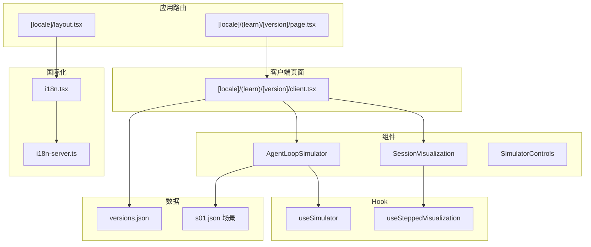
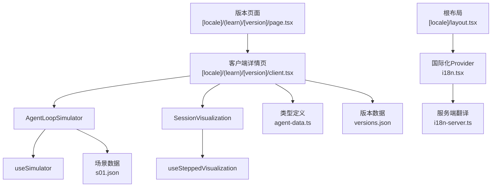
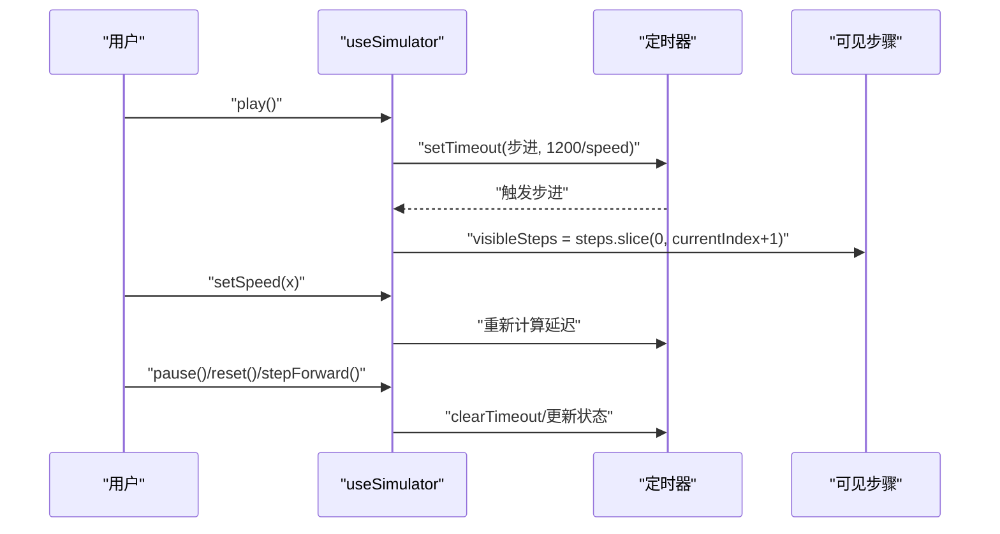
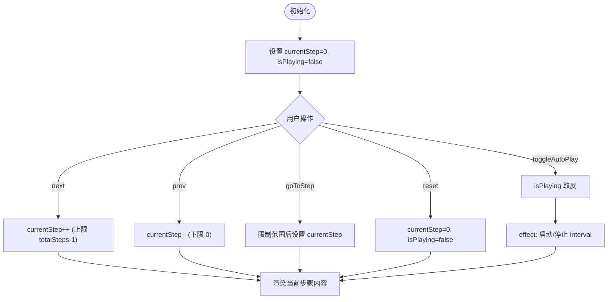
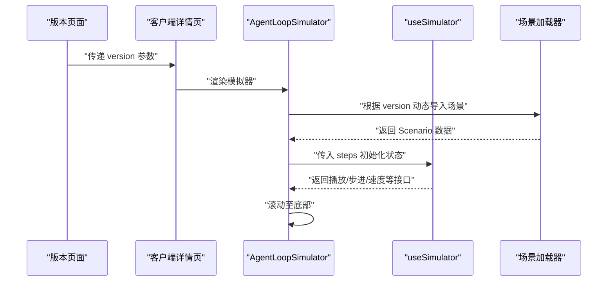
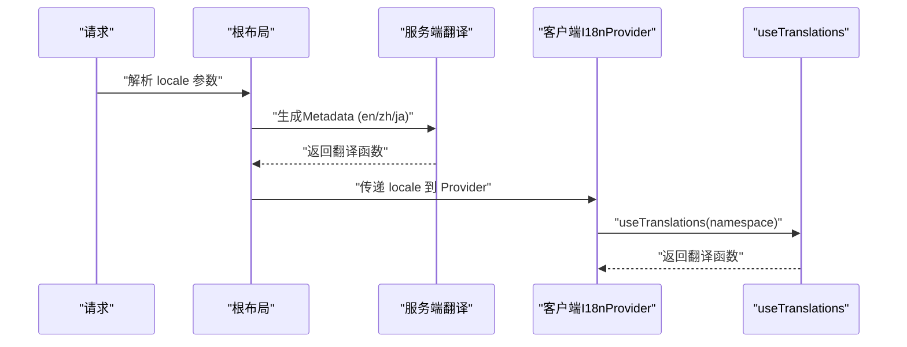
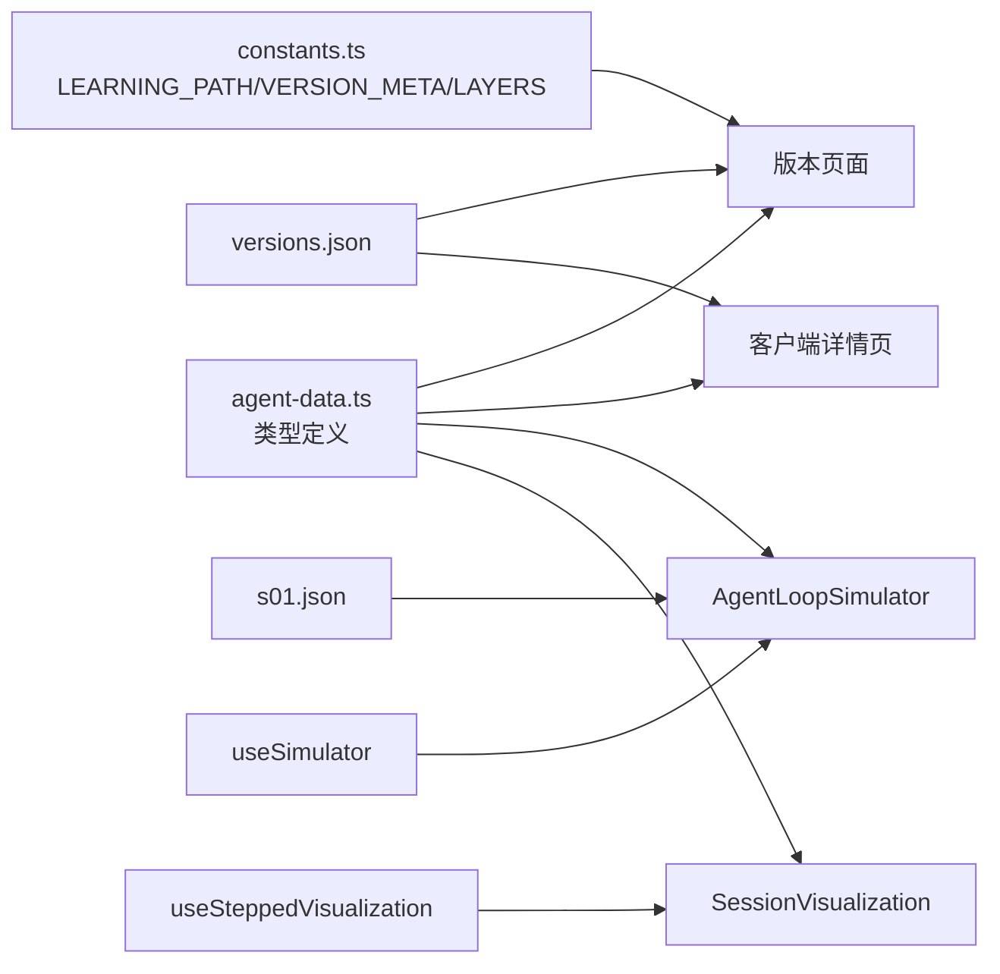

# 交互式学习功能

<cite>
**本文档引用的文件**
- [web/src/hooks/useSimulator.ts](file://web/src/hooks/useSimulator.ts)
- [web/src/hooks/useSteppedVisualization.ts](file://web/src/hooks/useSteppedVisualization.ts)
- [web/src/lib/i18n.tsx](file://web/src/lib/i18n.tsx)
- [web/src/app/[locale]/layout.tsx](file://web/src/app/[locale]/layout.tsx)
- [web/src/components/simulator/agent-loop-simulator.tsx](file://web/src/components/simulator/agent-loop-simulator.tsx)
- [web/src/components/simulator/simulator-controls.tsx](file://web/src/components/simulator/simulator-controls.tsx)
- [web/src/types/agent-data.ts](file://web/src/types/agent-data.ts)
- [web/src/data/generated/versions.json](file://web/src/data/generated/versions.json)
- [web/src/app/[locale]/(learn)/[version]/page.tsx](file://web/src/app/[locale]/(learn)/[version]/page.tsx)
- [web/src/app/[locale]/(learn)/[version]/client.tsx](file://web/src/app/[locale]/(learn)/[version]/client.tsx)
- [web/src/components/visualizations/index.tsx](file://web/src/components/visualizations/index.tsx)
- [web/src/components/visualizations/s01-agent-loop.tsx](file://web/src/components/visualizations/s01-agent-loop.tsx)
- [web/src/lib/constants.ts](file://web/src/lib/constants.ts)
- [web/src/lib/i18n-server.ts](file://web/src/lib/i18n-server.ts)
- [web/src/data/scenarios/s01.json](file://web/src/data/scenarios/s01.json)
</cite>

## 目录
1. [简介](#简介)
2. [项目结构](#项目结构)
3. [核心组件](#核心组件)
4. [架构总览](#架构总览)
5. [详细组件分析](#详细组件分析)
6. [依赖关系分析](#依赖关系分析)
7. [性能考虑](#性能考虑)
8. [故障排除指南](#故障排除指南)
9. [结论](#结论)
10. [附录](#附录)

## 简介
本项目提供一个渐进式的交互式学习平台，围绕“从零构建AI编码代理”的12个版本演进，通过模拟器、可视化与文档渲染相结合的方式，帮助学习者逐步掌握代理的核心循环、工具系统、规划与记忆管理、并发与协作等关键技术层。系统采用Next.js应用路由与服务端国际化，前端通过自定义Hook实现状态驱动的模拟与分步可视化，支持多语言与主题切换。

## 项目结构
前端位于 web/src 目录，按功能域组织：
- hooks：状态与生命周期管理（useSimulator、useSteppedVisualization）
- lib：国际化、常量与工具
- app：页面路由与布局（包含多语言子路径）
- components：UI组件、架构图、代码查看器、模拟器、时间线、可视化模块
- data：生成的数据（版本索引、场景）、注释与执行流
- types：类型定义（版本、差异、模拟步骤、场景）

**图表来源**
- [web/src/app/[locale]/(learn)/[version]/page.tsx](file://web/src/app/[locale]/(learn)/[version]/page.tsx#L12-L126)
- [web/src/app/[locale]/layout.tsx](file://web/src/app/[locale]/layout.tsx#L1-L61)
- [web/src/app/[locale]/(learn)/[version]/client.tsx](file://web/src/app/[locale]/(learn)/[version]/client.tsx#L1-L83)
- [web/src/components/simulator/agent-loop-simulator.tsx:1-97](file://web/src/components/simulator/agent-loop-simulator.tsx#L1-L97)
- [web/src/components/visualizations/index.tsx:1-40](file://web/src/components/visualizations/index.tsx#L1-L40)
- [web/src/hooks/useSimulator.ts:1-85](file://web/src/hooks/useSimulator.ts#L1-L85)
- [web/src/hooks/useSteppedVisualization.ts:1-85](file://web/src/hooks/useSteppedVisualization.ts#L1-L85)
- [web/src/data/generated/versions.json:1-537](file://web/src/data/generated/versions.json#L1-L537)
- [web/src/data/scenarios/s01.json:1-52](file://web/src/data/scenarios/s01.json#L1-L52)
- [web/src/lib/i18n.tsx:1-37](file://web/src/lib/i18n.tsx#L1-L37)
- [web/src/lib/i18n-server.ts:1-17](file://web/src/lib/i18n-server.ts#L1-L17)

**章节来源**
- [web/src/app/[locale]/layout.tsx](file://web/src/app/[locale]/layout.tsx#L1-L61)
- [web/src/app/[locale]/(learn)/[version]/page.tsx](file://web/src/app/[locale]/(learn)/[version]/page.tsx#L1-L126)
- [web/src/app/[locale]/(learn)/[version]/client.tsx](file://web/src/app/[locale]/(learn)/[version]/client.tsx#L1-L83)

## 核心组件
- 渐进式学习路径：通过版本顺序与元数据定义学习路径，每个版本聚焦一个技术层（工具、规划、记忆、并发、协作）。
- 模拟器：基于useSimulator Hook驱动的自动播放与手动步进，展示代理在特定版本中的消息流转与工具调用。
- 分步可视化：基于useSteppedVisualization Hook的流程图与消息数组演示，支持自动播放与手动控制。
- 国际化：客户端与服务端双通道翻译，支持多语言切换与静态参数生成。

**章节来源**
- [web/src/lib/constants.ts:1-38](file://web/src/lib/constants.ts#L1-L38)
- [web/src/hooks/useSimulator.ts:1-85](file://web/src/hooks/useSimulator.ts#L1-L85)
- [web/src/hooks/useSteppedVisualization.ts:1-85](file://web/src/hooks/useSteppedVisualization.ts#L1-L85)
- [web/src/lib/i18n.tsx:1-37](file://web/src/lib/i18n.tsx#L1-L37)
- [web/src/lib/i18n-server.ts:1-17](file://web/src/lib/i18n-server.ts#L1-L17)

## 架构总览
系统采用“页面路由 + 客户端组件 + 自定义Hook + 数据与类型”的分层架构：
- 页面层负责路由与静态参数生成，加载版本元数据与源码。
- 客户端组件负责Tab内容切换与交互区域渲染。
- Hook层封装模拟器与分步可视化状态，提供统一的状态接口。
- 数据层提供版本索引、场景与文档内容，类型层确保数据一致性。

**图表来源**
- [web/src/app/[locale]/(learn)/[version]/page.tsx](file://web/src/app/[locale]/(learn)/[version]/page.tsx#L1-L126)
- [web/src/app/[locale]/(learn)/[version]/client.tsx](file://web/src/app/[locale]/(learn)/[version]/client.tsx#L1-L83)
- [web/src/components/simulator/agent-loop-simulator.tsx:1-97](file://web/src/components/simulator/agent-loop-simulator.tsx#L1-L97)
- [web/src/components/visualizations/index.tsx:1-40](file://web/src/components/visualizations/index.tsx#L1-L40)
- [web/src/hooks/useSimulator.ts:1-85](file://web/src/hooks/useSimulator.ts#L1-L85)
- [web/src/hooks/useSteppedVisualization.ts:1-85](file://web/src/hooks/useSteppedVisualization.ts#L1-L85)
- [web/src/types/agent-data.ts:1-73](file://web/src/types/agent-data.ts#L1-L73)
- [web/src/data/generated/versions.json:1-537](file://web/src/data/generated/versions.json#L1-L537)
- [web/src/data/scenarios/s01.json:1-52](file://web/src/data/scenarios/s01.json#L1-L52)
- [web/src/app/[locale]/layout.tsx](file://web/src/app/[locale]/layout.tsx#L1-L61)
- [web/src/lib/i18n.tsx:1-37](file://web/src/lib/i18n.tsx#L1-L37)
- [web/src/lib/i18n-server.ts:1-17](file://web/src/lib/i18n-server.ts#L1-L17)

## 详细组件分析

### 组件A：useSimulator Hook（模拟器状态管理）
- 职责：管理模拟器的播放/暂停、步进、重置、速度调节与当前索引；基于定时器实现自动播放。
- 关键状态：currentIndex、isPlaying、speed；派生属性：visibleSteps、isComplete。
- 性能特性：使用useRef保存定时器句柄，effect中根据播放状态与速度动态调度；清理时清除定时器避免内存泄漏。
- 使用场景：AgentLoopSimulator中作为核心状态源，驱动消息序列的渲染与控制条。

**图表来源**
- [web/src/hooks/useSimulator.ts:1-85](file://web/src/hooks/useSimulator.ts#L1-L85)
- [web/src/components/simulator/agent-loop-simulator.tsx:1-97](file://web/src/components/simulator/agent-loop-simulator.tsx#L1-L97)
- [web/src/components/simulator/simulator-controls.tsx:1-100](file://web/src/components/simulator/simulator-controls.tsx#L1-L100)

**章节来源**
- [web/src/hooks/useSimulator.ts:1-85](file://web/src/hooks/useSimulator.ts#L1-L85)
- [web/src/components/simulator/agent-loop-simulator.tsx:1-97](file://web/src/components/simulator/agent-loop-simulator.tsx#L1-L97)
- [web/src/components/simulator/simulator-controls.tsx:1-100](file://web/src/components/simulator/simulator-controls.tsx#L1-L100)

### 组件B：useSteppedVisualization Hook（分步可视化）
- 职责：管理分步可视化当前步骤、自动播放、跳转到指定步骤；提供上一步/下一步/重置/切换自动播放等操作。
- 关键状态：currentStep、isPlaying；派生属性：isFirstStep、isLastStep。
- 性能特性：使用useRef保存interval句柄，在effect中根据播放状态启停；自动播放间隔可配置。
- 使用场景：s01-agent-loop可视化中驱动流程图节点高亮与消息数组的累积展示。

**图表来源**
- [web/src/hooks/useSteppedVisualization.ts:1-85](file://web/src/hooks/useSteppedVisualization.ts#L1-L85)
- [web/src/components/visualizations/s01-agent-loop.tsx:1-417](file://web/src/components/visualizations/s01-agent-loop.tsx#L1-L417)

**章节来源**
- [web/src/hooks/useSteppedVisualization.ts:1-85](file://web/src/hooks/useSteppedVisualization.ts#L1-L85)
- [web/src/components/visualizations/s01-agent-loop.tsx:1-417](file://web/src/components/visualizations/s01-agent-loop.tsx#L1-L417)

### 组件C：AgentLoopSimulator（模拟器容器）
- 职责：按版本动态加载场景数据，集成模拟器控制条与消息列表；自动滚动到底部以显示最新消息。
- 数据加载：通过动态导入映射加载对应版本的场景JSON。
- 状态绑定：useSimulator返回的currentIndex、visibleSteps、isPlaying等与控制条联动。
- 性能优化：仅在visibleSteps长度变化时触发滚动；使用AnimatePresence进行消息动画过渡。

**图表来源**
- [web/src/app/[locale]/(learn)/[version]/page.tsx](file://web/src/app/[locale]/(learn)/[version]/page.tsx#L1-L126)
- [web/src/app/[locale]/(learn)/[version]/client.tsx](file://web/src/app/[locale]/(learn)/[version]/client.tsx#L1-L83)
- [web/src/components/simulator/agent-loop-simulator.tsx:1-97](file://web/src/components/simulator/agent-loop-simulator.tsx#L1-L97)
- [web/src/data/scenarios/s01.json:1-52](file://web/src/data/scenarios/s01.json#L1-L52)

**章节来源**
- [web/src/components/simulator/agent-loop-simulator.tsx:1-97](file://web/src/components/simulator/agent-loop-simulator.tsx#L1-L97)
- [web/src/data/scenarios/s01.json:1-52](file://web/src/data/scenarios/s01.json#L1-L52)

### 组件D：SessionVisualization（分步可视化入口）
- 职责：根据版本ID懒加载对应的可视化组件，支持Suspense占位与标题翻译。
- 性能优化：使用React.lazy与Suspense实现按需加载，避免首屏体积过大。

**章节来源**
- [web/src/components/visualizations/index.tsx:1-40](file://web/src/components/visualizations/index.tsx#L1-L40)
- [web/src/components/visualizations/s01-agent-loop.tsx:1-417](file://web/src/components/visualizations/s01-agent-loop.tsx#L1-L417)

### 组件E：国际化与多语言支持
- 客户端国际化：I18nProvider根据locale选择消息集合并暴露上下文；useTranslations按命名空间返回翻译函数；useLocale读取当前语言。
- 服务端国际化：getTranslations在服务端按locale与命名空间返回翻译函数，用于页面元信息与静态参数生成。
- 多语言配置：支持en、zh、ja三种语言的消息文件，根布局生成静态参数并注入元信息。

**图表来源**
- [web/src/app/[locale]/layout.tsx](file://web/src/app/[locale]/layout.tsx#L1-L61)
- [web/src/lib/i18n.tsx:1-37](file://web/src/lib/i18n.tsx#L1-L37)
- [web/src/lib/i18n-server.ts:1-17](file://web/src/lib/i18n-server.ts#L1-L17)

**章节来源**
- [web/src/lib/i18n.tsx:1-37](file://web/src/lib/i18n.tsx#L1-L37)
- [web/src/lib/i18n-server.ts:1-17](file://web/src/lib/i18n-server.ts#L1-L17)
- [web/src/app/[locale]/layout.tsx](file://web/src/app/[locale]/layout.tsx#L1-L61)

## 依赖关系分析
- 版本与元数据：LEARNING_PATH与VERSION_META定义学习路径与各版本元信息，用于导航与标签展示。
- 类型约束：agent-data.ts定义了版本、差异、文档、场景与模拟步骤等类型，保证数据一致性。
- 数据耦合：版本页面从versions.json读取版本与差异信息，客户端组件从场景JSON读取模拟步骤。
- 组件耦合：AgentLoopSimulator依赖useSimulator；SessionVisualization依赖useSteppedVisualization；两者均依赖类型与数据。

**图表来源**
- [web/src/lib/constants.ts:1-38](file://web/src/lib/constants.ts#L1-L38)
- [web/src/types/agent-data.ts:1-73](file://web/src/types/agent-data.ts#L1-L73)
- [web/src/data/generated/versions.json:1-537](file://web/src/data/generated/versions.json#L1-L537)
- [web/src/data/scenarios/s01.json:1-52](file://web/src/data/scenarios/s01.json#L1-L52)
- [web/src/app/[locale]/(learn)/[version]/page.tsx](file://web/src/app/[locale]/(learn)/[version]/page.tsx#L1-L126)
- [web/src/app/[locale]/(learn)/[version]/client.tsx](file://web/src/app/[locale]/(learn)/[version]/client.tsx#L1-L83)
- [web/src/components/simulator/agent-loop-simulator.tsx:1-97](file://web/src/components/simulator/agent-loop-simulator.tsx#L1-L97)
- [web/src/components/visualizations/index.tsx:1-40](file://web/src/components/visualizations/index.tsx#L1-L40)

**章节来源**
- [web/src/lib/constants.ts:1-38](file://web/src/lib/constants.ts#L1-L38)
- [web/src/types/agent-data.ts:1-73](file://web/src/types/agent-data.ts#L1-L73)
- [web/src/data/generated/versions.json:1-537](file://web/src/data/generated/versions.json#L1-L537)

## 性能考虑
- 懒加载与分割：使用React.lazy与Suspense对可视化组件进行按需加载，减少首屏负载。
- 状态最小化：useSimulator与useSteppedVisualization仅维护必要状态，避免不必要的重渲染。
- 动画与滚动：使用AnimatePresence与受控滚动，确保流畅体验且不阻塞主线程。
- 定时器与区间任务：通过useRef持有句柄并在effect清理中释放，防止内存泄漏与竞态条件。
- 静态参数生成：根布局为多语言生成静态参数，提升SEO与首屏性能。

[本节为通用性能建议，无需特定文件引用]

## 故障排除指南
- 模拟器无法开始播放
  - 检查useSimulator的steps是否已加载；确认currentIndex未达到末尾。
  - 查看定时器是否被正确清理与重建。
  - 参考：[web/src/hooks/useSimulator.ts:59-69](file://web/src/hooks/useSimulator.ts#L59-L69)
- 分步可视化不响应
  - 确认totalSteps与autoPlayInterval配置；检查interval是否在effect中启停。
  - 参考：[web/src/hooks/useSteppedVisualization.ts:55-70](file://web/src/hooks/useSteppedVisualization.ts#L55-L70)
- 多语言显示异常
  - 根布局的generateStaticParams与I18nProvider locale是否匹配；服务端翻译fallback逻辑是否生效。
  - 参考：[web/src/app/[locale]/layout.tsx](file://web/src/app/[locale]/layout.tsx#L12-L27), [web/src/lib/i18n.tsx:16-23](file://web/src/lib/i18n.tsx#L16-L23), [web/src/lib/i18n-server.ts:9-16](file://web/src/lib/i18n-server.ts#L9-L16)
- 场景数据未显示
  - 确认版本ID与场景文件名一致；动态导入路径是否正确。
  - 参考：[web/src/components/simulator/agent-loop-simulator.tsx:35-40](file://web/src/components/simulator/agent-loop-simulator.tsx#L35-L40), [web/src/data/scenarios/s01.json:1-52](file://web/src/data/scenarios/s01.json#L1-L52)

**章节来源**
- [web/src/hooks/useSimulator.ts:59-69](file://web/src/hooks/useSimulator.ts#L59-L69)
- [web/src/hooks/useSteppedVisualization.ts:55-70](file://web/src/hooks/useSteppedVisualization.ts#L55-L70)
- [web/src/app/[locale]/layout.tsx](file://web/src/app/[locale]/layout.tsx#L12-L27)
- [web/src/lib/i18n.tsx:16-23](file://web/src/lib/i18n.tsx#L16-L23)
- [web/src/lib/i18n-server.ts:9-16](file://web/src/lib/i18n-server.ts#L9-L16)
- [web/src/components/simulator/agent-loop-simulator.tsx:35-40](file://web/src/components/simulator/agent-loop-simulator.tsx#L35-L40)
- [web/src/data/scenarios/s01.json:1-52](file://web/src/data/scenarios/s01.json#L1-L52)

## 结论
该交互式学习系统通过清晰的渐进式路径、可靠的模拟器与可视化组件、完善的国际化支持，为学习者提供了沉浸式的学习体验。自定义Hook将复杂的状态管理抽象为简洁的接口，结合按需加载与动画优化，兼顾了可维护性与性能表现。未来可在学习进度追踪、个性化推荐与知识关联方面进一步扩展，以形成更完整的智能学习闭环。

[本节为总结性内容，无需特定文件引用]

## 附录
- 版本与层级：学习路径由12个版本组成，覆盖工具、规划、记忆、并发与协作五大技术层。
- 数据模型：版本索引包含版本元信息与差异；场景包含模拟步骤与注解；类型定义确保数据一致性。
- 国际化资源：消息文件按语言存放，根布局生成静态参数，服务端与客户端分别提供翻译能力。

**章节来源**
- [web/src/lib/constants.ts:1-38](file://web/src/lib/constants.ts#L1-L38)
- [web/src/data/generated/versions.json:1-537](file://web/src/data/generated/versions.json#L1-L537)
- [web/src/types/agent-data.ts:1-73](file://web/src/types/agent-data.ts#L1-L73)
- [web/src/lib/i18n.tsx:1-37](file://web/src/lib/i18n.tsx#L1-L37)
- [web/src/lib/i18n-server.ts:1-17](file://web/src/lib/i18n-server.ts#L1-L17)