# 可视化学习平台

<cite>
**本文引用的文件**
- [package.json](file://web/package.json)
- [next.config.ts](file://web/next.config.ts)
- [tsconfig.json](file://web/tsconfig.json)
- [postcss.config.mjs](file://web/postcss.config.mjs)
- [constants.ts](file://web/src/lib/constants.ts)
- [i18n.tsx](file://web/src/lib/i18n.tsx)
- [layout.tsx](file://web/src/app/[locale]/layout.tsx)
- [arch-diagram.tsx](file://web/src/components/architecture/arch-diagram.tsx)
- [agent-loop-simulator.tsx](file://web/src/components/simulator/agent-loop-simulator.tsx)
- [useSimulator.ts](file://web/src/hooks/useSimulator.ts)
- [execution-flows.ts](file://web/src/data/execution-flows.ts)
- [agent-data.ts](file://web/src/types/agent-data.ts)
- [index.tsx](file://web/src/components/visualizations/index.tsx)
- [s01-agent-loop.tsx](file://web/src/components/visualizations/s01-agent-loop.tsx)
- [s08-background-tasks.tsx](file://web/src/components/visualizations/s08-background-tasks.tsx)
- [s09-agent-teams.tsx](file://web/src/components/visualizations/s09-agent-teams.tsx)
- [s10-team-protocols.tsx](file://web/src/components/visualizations/s10-team-protocols.tsx)
- [s11-autonomous-agents.tsx](file://web/src/components/visualizations/s11-autonomous-agents.tsx)
- [s12-worktree-task-isolation.tsx](file://web/src/components/visualizations/s12-worktree-task-isolation.tsx)
- [source-viewer.tsx](file://web/src/components/code/source-viewer.tsx)
- [code-diff.tsx](file://web/src/components/diff/code-diff.tsx)
- [step-controls.tsx](file://web/src/components/visualizations/shared/step-controls.tsx)
- [utils.ts](file://web/src/lib/utils.ts)
- [README.md](file://web/README.md)
</cite>

## 更新摘要
**所做更改**
- 新增8个章节的可视化组件：背景任务、代理团队、团队协议、自主代理、工作树任务隔离
- 更新可视化索引以包含新组件
- 增强步进式可视化组件的多样性和复杂性
- 扩展可视化工具集，涵盖更多代理系统概念

## 目录
1. [简介](#简介)
2. [项目结构](#项目结构)
3. [核心组件](#核心组件)
4. [架构总览](#架构总览)
5. [详细组件分析](#详细组件分析)
6. [新增可视化组件详解](#新增可视化组件详解)
7. [依赖分析](#依赖分析)
8. [性能考虑](#性能考虑)
9. [故障排查指南](#故障排查指南)
10. [结论](#结论)
11. [附录](#附录)

## 简介
本项目是一个以"逐步构建智能体"为主题的可视化学习平台，基于 Next.js 16 与 TypeScript 构建，采用 TailwindCSS 4 进行样式管理，并通过丰富的交互式可视化组件帮助学习者理解代理系统的演进过程。平台提供渐进式学习路径（从基础代理循环到团队协作与任务隔离），支持多语言（英语、简体中文、日语），并提供架构图、执行流程图、消息流模拟器、源码查看器与差异对比等工具，增强对代理系统工作原理的理解。

**更新** 平台现已扩展至12个核心章节，新增了背景任务并发执行、代理团队协作、团队协议通信、自主代理循环、工作树任务隔离等高级概念的可视化展示。

## 项目结构
前端位于 web 目录，采用 App Router 的约定式路由与国际化布局，核心目录组织如下：
- app：页面与布局，按语言与版本分层组织
- components：可复用 UI 组件与可视化组件
- hooks：自定义 Hook（如模拟器状态、步进可视化）
- data：数据模型与静态数据（版本元信息、执行流程、场景）
- lib：通用常量、国际化、工具函数
- types：类型定义
- public：公共资源
- scripts：构建期脚本（内容提取）

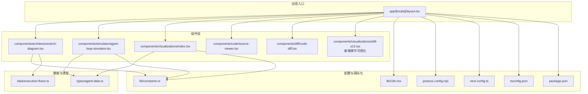

**图表来源**
- [layout.tsx:1-61](file://web/src/app/[locale]/layout.tsx#L1-L61)
- [arch-diagram.tsx:1-229](file://web/src/components/architecture/arch-diagram.tsx#L1-L229)
- [agent-loop-simulator.tsx:1-97](file://web/src/components/simulator/agent-loop-simulator.tsx#L1-L97)
- [index.tsx:1-40](file://web/src/components/visualizations/index.tsx#L1-L40)
- [source-viewer.tsx:1-103](file://web/src/components/code/source-viewer.tsx#L1-L103)
- [code-diff.tsx:1-206](file://web/src/components/diff/code-diff.tsx#L1-L206)
- [s08-background-tasks.tsx:1-625](file://web/src/components/visualizations/s08-background-tasks.tsx#L1-L625)
- [s09-agent-teams.tsx:1-394](file://web/src/components/visualizations/s09-agent-teams.tsx#L1-L394)
- [s10-team-protocols.tsx:1-498](file://web/src/components/visualizations/s10-team-protocols.tsx#L1-L498)
- [s11-autonomous-agents.tsx:1-467](file://web/src/components/visualizations/s11-autonomous-agents.tsx#L1-L467)
- [s12-worktree-task-isolation.tsx:1-279](file://web/src/components/visualizations/s12-worktree-task-isolation.tsx#L1-L279)

**章节来源**
- [layout.tsx:1-61](file://web/src/app/[locale]/layout.tsx#L1-L61)
- [package.json:1-39](file://web/package.json#L1-L39)
- [next.config.ts:1-10](file://web/next.config.ts#L1-L10)
- [tsconfig.json:1-35](file://web/tsconfig.json#L1-L35)
- [postcss.config.mjs:1-8](file://web/postcss.config.mjs#L1-L8)

## 核心组件
- 国际化与布局
  - 布局组件负责语言参数解析、元数据生成、主题初始化与根容器渲染，支持多语言切换与暗色模式。
  - 国际化上下文提供翻译钩子与当前语言访问。
- 版本与学习路径
  - 版本顺序、元信息与层级映射集中于常量模块，用于导航、图示与筛选。
- 架构图组件
  - 按版本收集类与工具，高亮新增类，按层级着色，展示类引入历史与工具清单。
- 执行流程图
  - 预置各版本的节点与边，形成可复用的流程定义，便于在可视化中渲染。
- 消息流模拟器
  - 加载对应版本场景数据，提供播放/暂停/步进/重置/速度控制，自动滚动至最新消息。
- 步进式可视化
  - 为特定演示（如代理循环）提供手动/自动步进控制与节点高亮。
- 源码查看器与差异对比
  - 提供语法高亮、行号、统一/分屏差异视图，支持快速定位变更。
- 工具函数与样式
  - 类名拼接工具、Tailwind 配置与 Next 静态导出配置。

**更新** 新增的8个章节可视化组件扩展了平台的核心功能，包括：
- 背景任务并发执行的时序可视化
- 代理团队协作的文件邮箱通信模式
- 团队协议的序列图展示
- 自主代理的状态机循环
- 工作树任务隔离的执行面板

**章节来源**
- [layout.tsx:1-61](file://web/src/app/[locale]/layout.tsx#L1-L61)
- [i18n.tsx:1-37](file://web/src/lib/i18n.tsx#L1-L37)
- [constants.ts:1-38](file://web/src/lib/constants.ts#L1-L38)
- [arch-diagram.tsx:1-229](file://web/src/components/architecture/arch-diagram.tsx#L1-L229)
- [execution-flows.ts:1-316](file://web/src/data/execution-flows.ts#L1-L316)
- [agent-loop-simulator.tsx:1-97](file://web/src/components/simulator/agent-loop-simulator.tsx#L1-L97)
- [useSimulator.ts:1-85](file://web/src/hooks/useSimulator.ts#L1-L85)
- [s01-agent-loop.tsx:1-417](file://web/src/components/visualizations/s01-agent-loop.tsx#L1-L417)
- [source-viewer.tsx:1-103](file://web/src/components/code/source-viewer.tsx#L1-L103)
- [code-diff.tsx:1-206](file://web/src/components/diff/code-diff.tsx#L1-L206)
- [utils.ts:1-4](file://web/src/lib/utils.ts#L1-L4)

## 架构总览
平台采用"数据驱动 + 组件解耦"的架构：
- 数据层：版本元数据、执行流程、场景步骤、文档内容
- 视图层：布局、导航、可视化组件、代码查看与差异对比
- 控制层：Hook 状态管理（模拟器、步进、主题、国际化）
- 配置层：Next、TypeScript、PostCSS、Tailwind

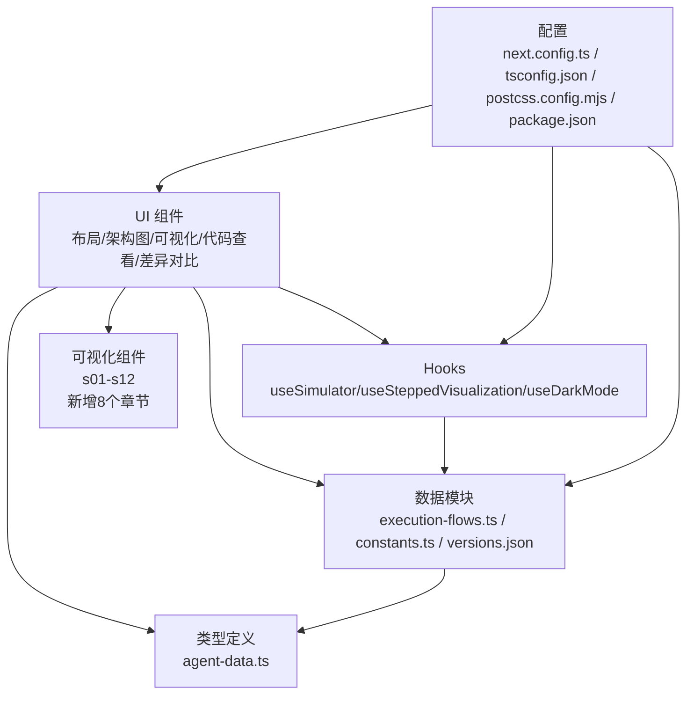

**图表来源**
- [agent-data.ts:1-73](file://web/src/types/agent-data.ts#L1-L73)
- [execution-flows.ts:1-316](file://web/src/data/execution-flows.ts#L1-L316)
- [constants.ts:1-38](file://web/src/lib/constants.ts#L1-L38)
- [useSimulator.ts:1-85](file://web/src/hooks/useSimulator.ts#L1-L85)
- [next.config.ts:1-10](file://web/next.config.ts#L1-L10)
- [tsconfig.json:1-35](file://web/tsconfig.json#L1-L35)
- [postcss.config.mjs:1-8](file://web/postcss.config.mjs#L1-L8)
- [package.json:1-39](file://web/package.json#L1-L39)

## 详细组件分析

### 布局与国际化
- 功能要点
  - 动态生成语言参数与元数据，设置 html lang 属性与主题初始化脚本
  - 提供 I18nProvider 包裹，暴露 useTranslations/useLocale
- 设计原则
  - 将国际化与主题逻辑下沉到根布局，确保全局可用
  - 使用静态参数生成支持多语言页面

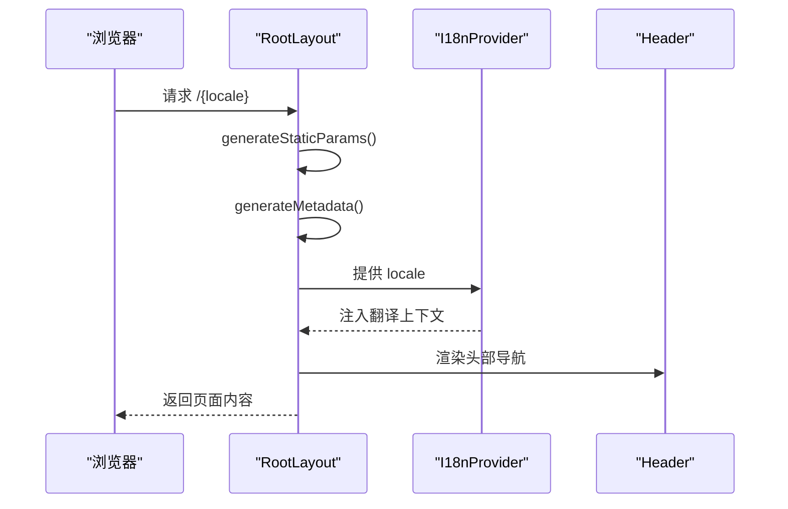

**图表来源**
- [layout.tsx:12-61](file://web/src/app/[locale]/layout.tsx#L12-L61)
- [i18n.tsx:16-37](file://web/src/lib/i18n.tsx#L16-L37)

**章节来源**
- [layout.tsx:1-61](file://web/src/app/[locale]/layout.tsx#L1-L61)
- [i18n.tsx:1-37](file://web/src/lib/i18n.tsx#L1-L37)

### 架构图组件（ArchDiagram）
- 功能要点
  - 收集版本之前所有类，计算新增类并高亮
  - 根据层级为节点添加边框/背景色
  - 展示工具列表与引入版本标注
  - 使用动画逐条呈现节点，增强学习节奏感
- 复杂度与性能
  - 时间复杂度 O(n) 收集类，O(m) 计算新增集合（n 为版本数，m 为类数量）
  - 通过 Framer Motion 实现渐显与箭头动画，注意在长列表时的渲染开销

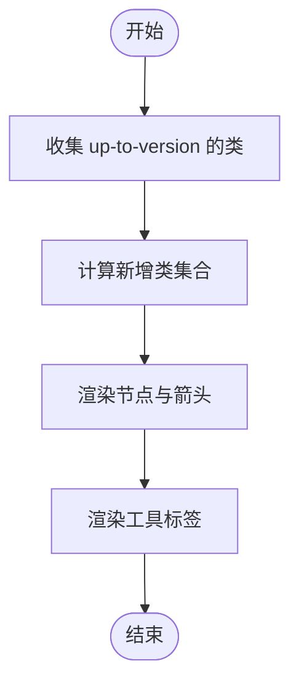

**图表来源**
- [arch-diagram.tsx:71-103](file://web/src/components/architecture/arch-diagram.tsx#L71-L103)
- [constants.ts:31-38](file://web/src/lib/constants.ts#L31-L38)

**章节来源**
- [arch-diagram.tsx:1-229](file://web/src/components/architecture/arch-diagram.tsx#L1-L229)
- [constants.ts:1-38](file://web/src/lib/constants.ts#L1-L38)

### 执行流程图（ExecutionFlows）
- 功能要点
  - 为每个版本预置节点与边，形成标准流程定义
  - 提供查询函数按版本获取流程定义
- 复杂度与性能
  - 查询为 O(1)，适合在渲染时直接读取

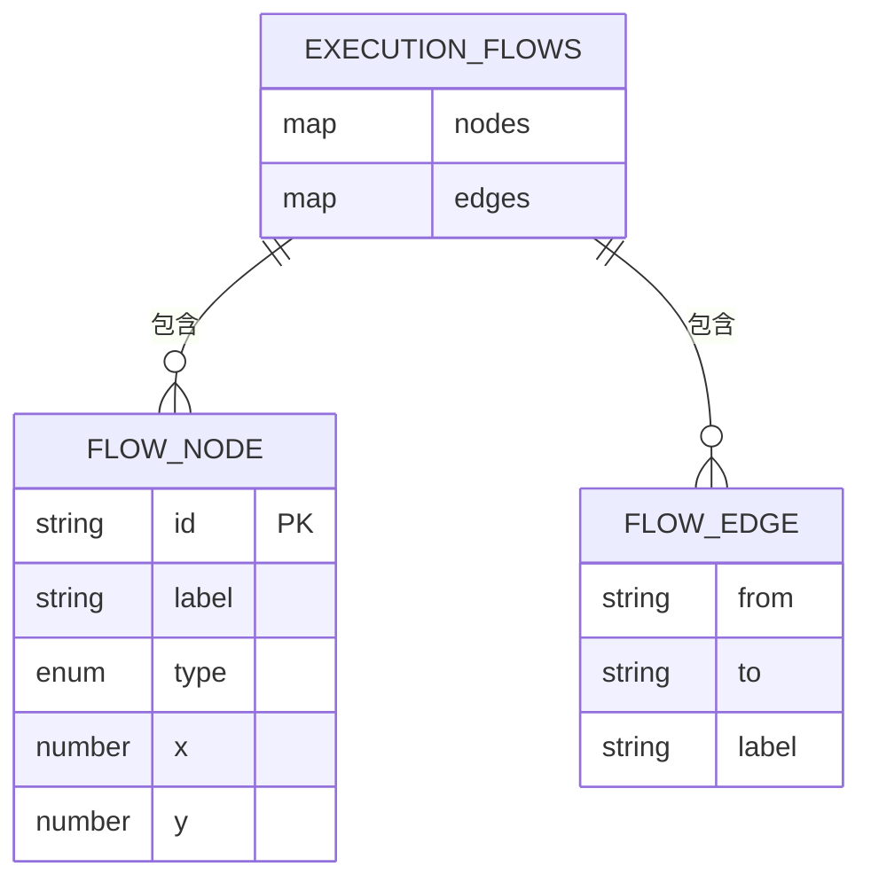

**图表来源**
- [execution-flows.ts:3-7](file://web/src/data/execution-flows.ts#L3-L7)
- [execution-flows.ts:13-316](file://web/src/data/execution-flows.ts#L13-L316)

**章节来源**
- [execution-flows.ts:1-316](file://web/src/data/execution-flows.ts#L1-L316)
- [agent-data.ts:60-72](file://web/src/types/agent-data.ts#L60-L72)

### 消息流模拟器（AgentLoopSimulator）
- 功能要点
  - 按版本懒加载场景 JSON，动态导入
  - useSimulator 管理播放/暂停/步进/重置/速度
  - 自动滚动到最新消息，使用 AnimatePresence 实现弹出过渡
- 错误处理
  - 场景加载失败时返回空（由上层处理）
  - 播放完成自动停止

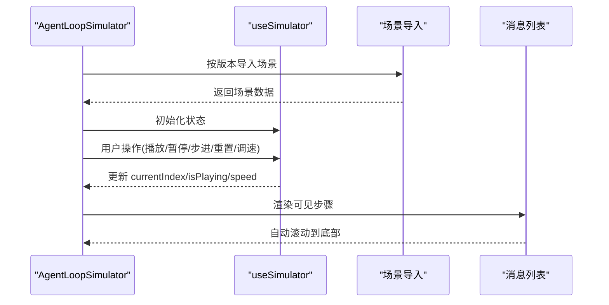

**图表来源**
- [agent-loop-simulator.tsx:30-97](file://web/src/components/simulator/agent-loop-simulator.tsx#L30-L97)
- [useSimulator.ts:12-85](file://web/src/hooks/useSimulator.ts#L12-L85)

**章节来源**
- [agent-loop-simulator.tsx:1-97](file://web/src/components/simulator/agent-loop-simulator.tsx#L1-L97)
- [useSimulator.ts:1-85](file://web/src/hooks/useSimulator.ts#L1-L85)

### 步进式可视化（以 s01 为例）
- 功能要点
  - 定义节点、边、每步激活集合与消息块
  - 使用 Framer Motion 渲染高亮与过渡
  - 提供 StepControls 控制步进与自动播放
- 设计原则
  - 将"步骤信息"与"视觉高亮"解耦，便于扩展其他版本

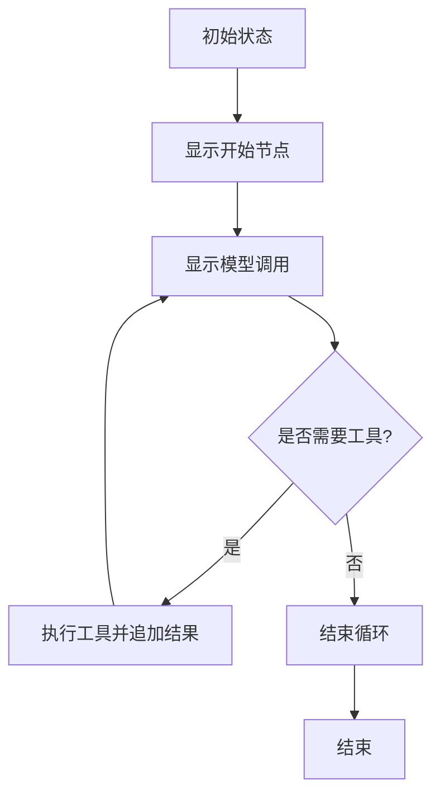

**图表来源**
- [s01-agent-loop.tsx:46-98](file://web/src/components/visualizations/s01-agent-loop.tsx#L46-L98)

**章节来源**
- [s01-agent-loop.tsx:1-417](file://web/src/components/visualizations/s01-agent-loop.tsx#L1-L417)

### 源码查看器与差异对比
- 源码查看器
  - 行级高亮：注释、装饰器、三引号字符串、关键字、self、字面量、数字
  - 行号与标题栏，适配暗色主题
- 差异对比
  - 支持统一视图与分屏视图，按变更类型高亮
  - 自动匹配上下文，尽量对齐增删行

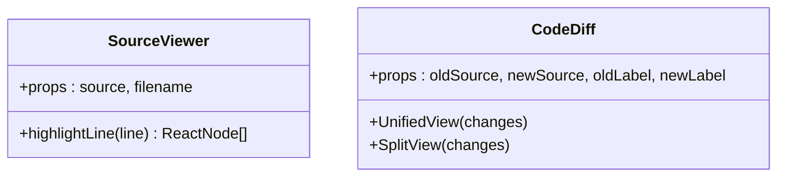

**图表来源**
- [source-viewer.tsx:10-69](file://web/src/components/code/source-viewer.tsx#L10-L69)
- [code-diff.tsx:62-206](file://web/src/components/diff/code-diff.tsx#L62-L206)

**章节来源**
- [source-viewer.tsx:1-103](file://web/src/components/code/source-viewer.tsx#L1-L103)
- [code-diff.tsx:1-206](file://web/src/components/diff/code-diff.tsx#L1-L206)

### 版本与可视化索引
- 功能要点
  - 通过懒加载按版本渲染对应可视化组件
  - 提供统一的占位与加载提示
- 更新** 新增8个章节的可视化组件集成

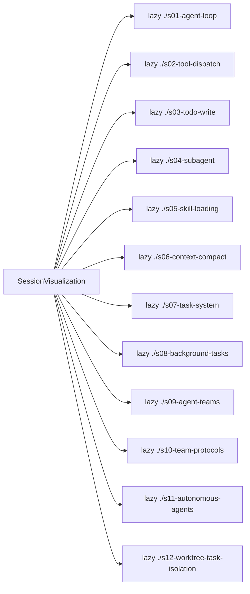

**图表来源**
- [index.tsx:6-22](file://web/src/components/visualizations/index.tsx#L6-L22)

**章节来源**
- [index.tsx:1-40](file://web/src/components/visualizations/index.tsx#L1-L40)

## 新增可视化组件详解

### 背景任务并发执行（s08）
- 功能概述
  - 展示代理主线程与后台线程的并发执行模式
  - 可视化三个执行通道的时间轴和任务分配
  - 演示通知队列的异步注入机制
- 技术特点
  - 使用SVG绘制三条执行通道（主通道、后台1、后台2）
  - 实现任务块的渐进式展开和完成标记
  - 动态箭头指示任务分叉和结果回流
  - 通知队列的卡片式展示和动画效果

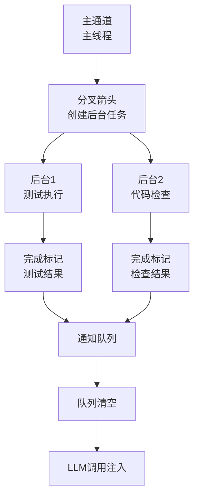

**图表来源**
- [s08-background-tasks.tsx:50-133](file://web/src/components/visualizations/s08-background-tasks.tsx#L50-L133)

**章节来源**
- [s08-background-tasks.tsx:1-625](file://web/src/components/visualizations/s08-background-tasks.tsx#L1-L625)

### 代理团队协作（s09）
- 功能概述
  - 展示领导者-工作者的团队协作模式
  - 可视化文件邮箱通信机制
  - 演示异步消息传递和独立工作流程
- 技术特点
  - 三角形布局展示团队结构（领导者在顶部，工作者在底部）
  - 动画消息从一个代理传输到另一个代理
  - Inbox托盘的视觉反馈和文件图标风格
  - 支持多种通信拓扑结构

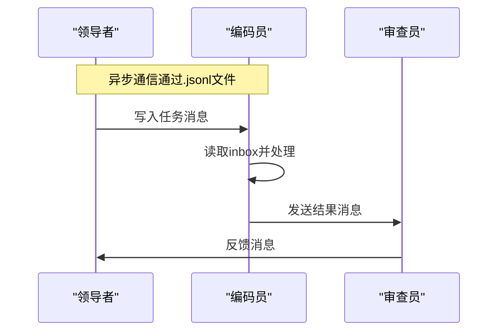

**图表来源**
- [s09-agent-teams.tsx:13-18](file://web/src/components/visualizations/s09-agent-teams.tsx#L13-L18)

**章节来源**
- [s09-agent-teams.tsx:1-394](file://web/src/components/visualizations/s09-agent-teams.tsx#L1-L394)

### 团队协议通信（s10）
- 功能概述
  - 展示结构化协议的消息交换模式
  - 可视化请求-响应模式和决策分支
  - 支持关闭协议和计划审批两种协议类型
- 技术特点
  - 使用UML序列图展示生命周期线和激活条
  - 动态箭头显示消息流向和请求ID关联
  - 决策菱形表示接受/拒绝的选择分支
  - 协议切换按钮支持不同协议的演示

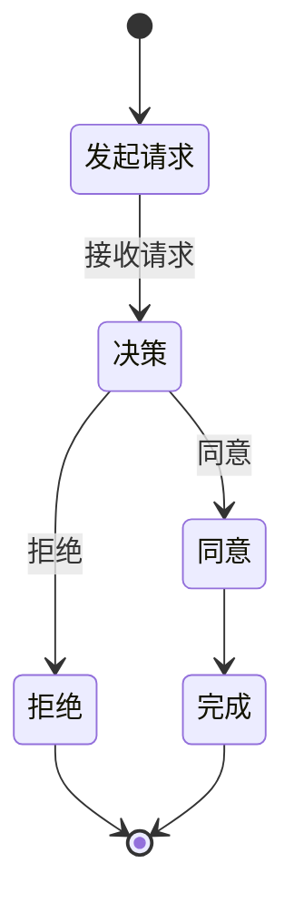

**图表来源**
- [s10-team-protocols.tsx:129-156](file://web/src/components/visualizations/s10-team-protocols.tsx#L129-L156)

**章节来源**
- [s10-team-protocols.tsx:1-498](file://web/src/components/visualizations/s10-team-protocols.tsx#L1-L498)

### 自主代理循环（s11）
- 功能概述
  - 展示自主代理的空闲-轮询-认领-工作循环
  - 可视化状态机转换和任务板交互
  - 演示多代理的去中心化协调机制
- 技术特点
  - 圆形状态机展示四个核心阶段
  - 任务板表格显示任务状态变化
  - 代理围绕任务板的空间布局
  - 计时器环显示空闲超时状态

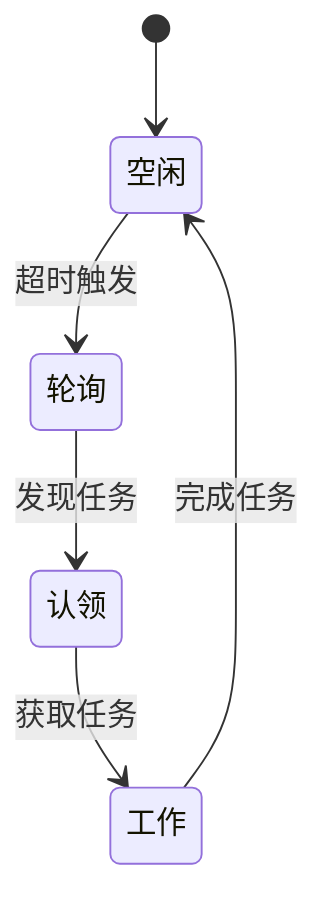

**图表来源**
- [s11-autonomous-agents.tsx:8-28](file://web/src/components/visualizations/s11-autonomous-agents.tsx#L8-L28)

**章节来源**
- [s11-autonomous-agents.tsx:1-467](file://web/src/components/visualizations/s11-autonomous-agents.tsx#L1-L467)

### 工作树任务隔离（s12）
- 功能概述
  - 展示工作树隔离的任务执行环境
  - 可视化任务板、工作树索引和执行通道
  - 演示任务分配、执行和清理的完整流程
- 技术特点
  - 三列布局展示任务板、工作树和执行通道
  - 动态状态指示器显示任务状态变化
  - 工作树状态分类（活动、保留、移除）
  - 文件路径高亮显示执行影响范围

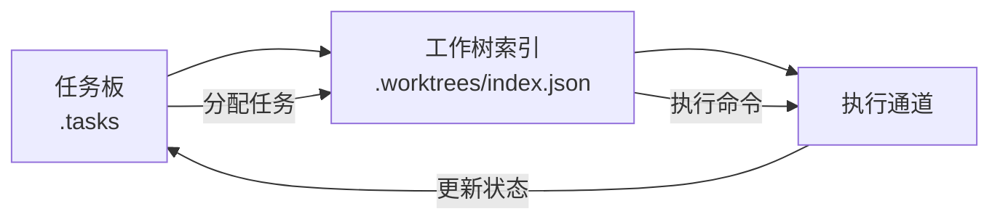

**图表来源**
- [s12-worktree-task-isolation.tsx:29-36](file://web/src/components/visualizations/s12-worktree-task-isolation.tsx#L29-L36)

**章节来源**
- [s12-worktree-task-isolation.tsx:1-279](file://web/src/components/visualizations/s12-worktree-task-isolation.tsx#L1-L279)

### 步进式可视化控制（StepControls）
- 功能概述
  - 为所有可视化组件提供统一的步进控制界面
  - 支持自动播放、手动步进、重置等操作
  - 显示步骤标题和描述信息
- 技术特点
  - 使用Lucide React图标提供直观的操作反馈
  - 步骤指示器显示当前进度和已完成步骤
  - 响应式设计适配不同屏幕尺寸

**章节来源**
- [step-controls.tsx:1-103](file://web/src/components/visualizations/shared/step-controls.tsx#L1-L103)

## 依赖分析
- 框架与运行时
  - Next.js 16（App Router）、React 19、TypeScript 5
- 样式与动画
  - TailwindCSS 4、Framer Motion、Lucide React
- 内容处理
  - remark/rehype 生态链（解析、GFM、转换、高亮）
- 工具库
  - diff（行级差异对比）
- 构建脚本
  - tsx 脚本执行、静态导出配置

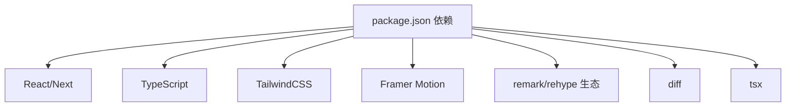

**图表来源**
- [package.json:13-28](file://web/package.json#L13-L28)
- [postcss.config.mjs:1-8](file://web/postcss.config.mjs#L1-L8)

**章节来源**
- [package.json:1-39](file://web/package.json#L1-L39)
- [next.config.ts:1-10](file://web/next.config.ts#L1-L10)
- [tsconfig.json:1-35](file://web/tsconfig.json#L1-L35)
- [postcss.config.mjs:1-8](file://web/postcss.config.mjs#L1-L8)

## 性能考虑
- 懒加载与分割
  - 可视化组件与场景数据均采用动态导入，减少首屏体积
  - 新增的8个章节组件同样采用懒加载策略
- 动画与渲染
  - 架构图与消息流使用 Framer Motion，建议在长列表时限制一次性渲染数量或启用虚拟化
  - 各可视化组件的动画复杂度控制在合理范围内
- 图表与数据
  - 执行流程图使用预置数据，查询 O(1)，渲染前可做缓存
  - 新增组件的数据结构保持简洁高效
- 主题与国际化
  - 布局内一次性注入主题偏好，避免重复计算
- 构建优化
  - 静态导出与尾随斜杠配置，利于部署与缓存策略

## 故障排查指南
- 页面无内容或空白
  - 检查版本对应的场景数据是否存在且可导入
  - 确认版本 ID 与路由一致
  - 验证新增的s08-s12组件路径正确性
- 模拟器不播放
  - 检查 useSimulator 的状态更新与定时器清理
  - 确认 speed 与 isPlaying 的联动
- 架构图不显示类
  - 检查 versions.json 中对应版本的 classes 字段
  - 确认层级映射与颜色类生成逻辑
- 差异对比错位
  - 统一视图会尝试匹配上下文，若差异过大可能造成列对齐问题
- 国际化无效
  - 确认 I18nProvider 的 locale 传入与消息键存在
- 新增组件问题
  - 检查懒加载组件的导入路径和默认导出
  - 验证StepControls组件的属性传递
  - 确认SVG组件的坐标系统和动画配置

**章节来源**
- [agent-loop-simulator.tsx:30-97](file://web/src/components/simulator/agent-loop-simulator.tsx#L30-L97)
- [useSimulator.ts:19-69](file://web/src/hooks/useSimulator.ts#L19-L69)
- [arch-diagram.tsx:71-103](file://web/src/components/architecture/arch-diagram.tsx#L71-L103)
- [code-diff.tsx:62-206](file://web/src/components/diff/code-diff.tsx#L62-L206)
- [i18n.tsx:16-37](file://web/src/lib/i18n.tsx#L16-L37)
- [index.tsx:6-22](file://web/src/components/visualizations/index.tsx#L6-L22)

## 结论
该平台以清晰的学习路径与丰富的可视化工具为核心，结合 Next.js 16 的现代特性与 TypeScript 的强类型保障，提供了高效、直观的学习体验。通过架构图、执行流程图、消息流模拟器与代码查看/对比工具，学习者可以逐步理解代理系统的演进与工作机制。

**更新** 新增的8个章节可视化组件显著扩展了平台的功能范围，涵盖了代理系统的高级概念：
- 并发执行与资源隔离
- 团队协作与通信协议  
- 自主决策与状态管理
- 工作空间隔离与任务治理

这些组件通过统一的StepControls接口和一致的视觉设计，保持了平台的整体性和易用性。建议在后续迭代中进一步完善数据驱动的可视化配置与性能监控，以支撑更复杂的场景与更大的数据规模。

## 附录
- 开发环境搭建
  - 安装 Node.js 与包管理器后，进入 web 目录安装依赖并启动开发服务器
  - 构建产物可通过静态导出配置输出到 dist 文件夹
- 组件开发规范
  - 使用 @/* 路径别名，保持组件职责单一
  - 可视化组件应明确"数据定义"与"渲染逻辑"的边界
  - 使用 cn 工具进行条件类名拼接
  - 新增组件需遵循现有的StepControls接口规范
- 样式定制
  - Tailwind 4 与 PostCSS 已配置，可在全局样式中扩展变量与主题
  - SVG组件使用统一的颜色调色板和主题适配
- 多语言支持
  - 在 i18n/messages 下新增语言文件，并在根布局中注册
- 响应式设计
  - 使用 Tailwind 断点与 Flex/Grid 布局，保证在移动端的良好体验
- 新增组件开发指南
  - 继承useSteppedVisualization Hook管理步骤状态
  - 使用StepControls提供统一的用户交互界面
  - 采用SVG进行精确的图形渲染和动画控制
  - 实现响应式的布局适配不同屏幕尺寸

**章节来源**
- [README.md](file://web/README.md)
- [utils.ts:1-4](file://web/src/lib/utils.ts#L1-L4)
- [postcss.config.mjs:1-8](file://web/postcss.config.mjs#L1-L8)
- [next.config.ts:1-10](file://web/next.config.ts#L1-L10)
- [package.json:5-12](file://web/package.json#L5-L12)
- [step-controls.tsx:19-103](file://web/src/components/visualizations/shared/step-controls.tsx#L19-L103)