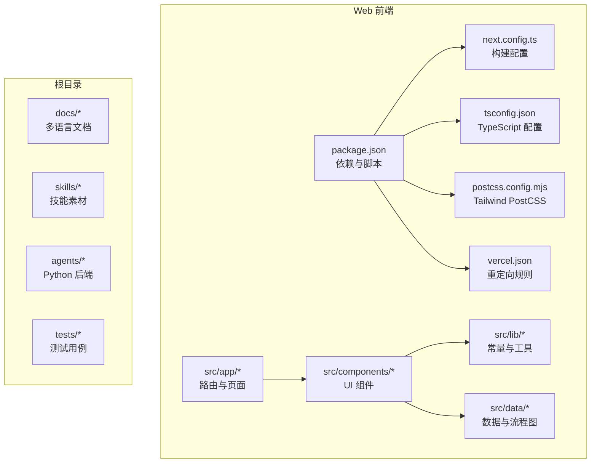
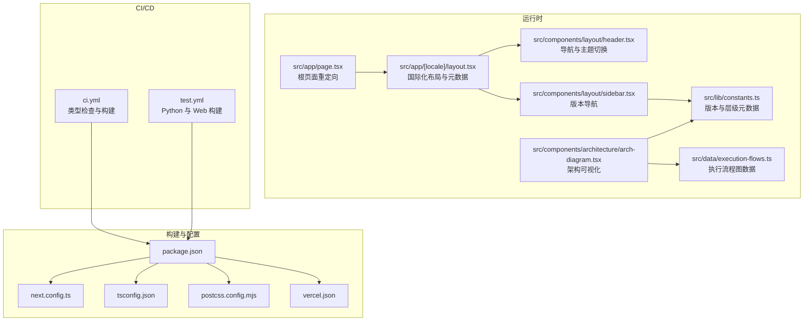
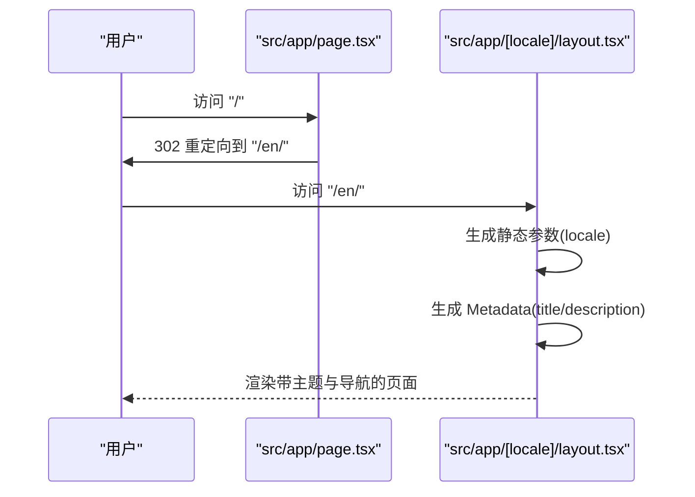
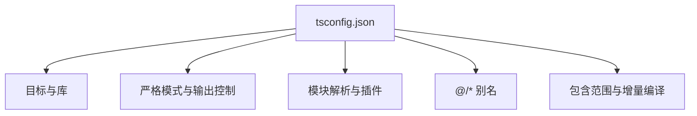
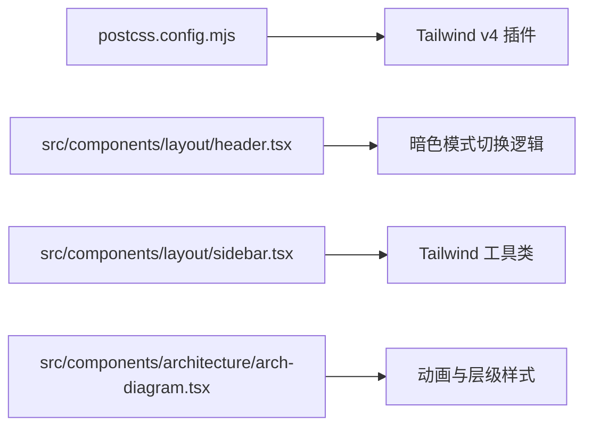
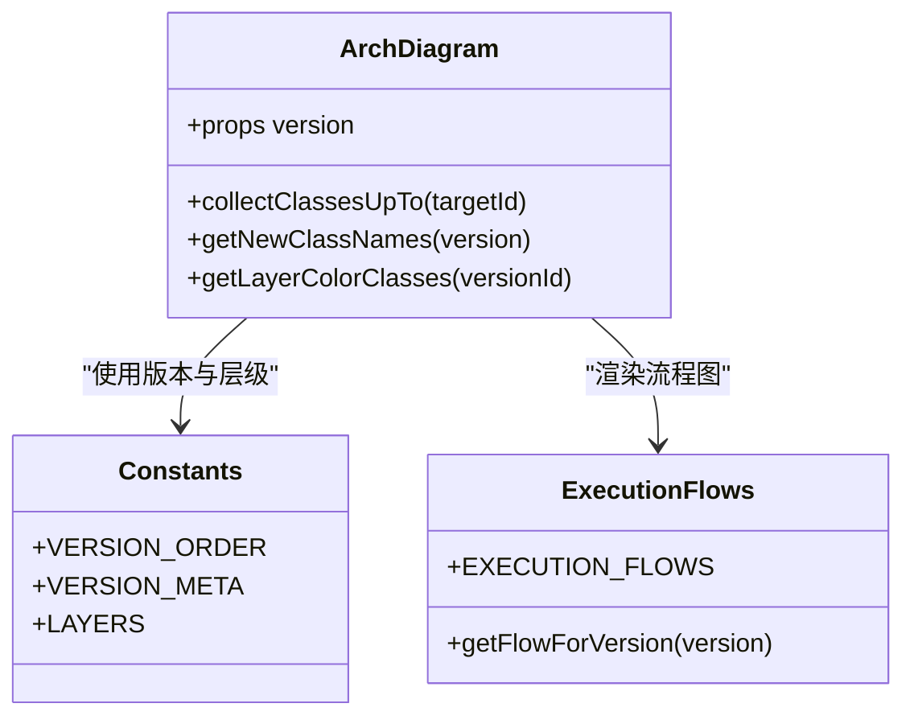
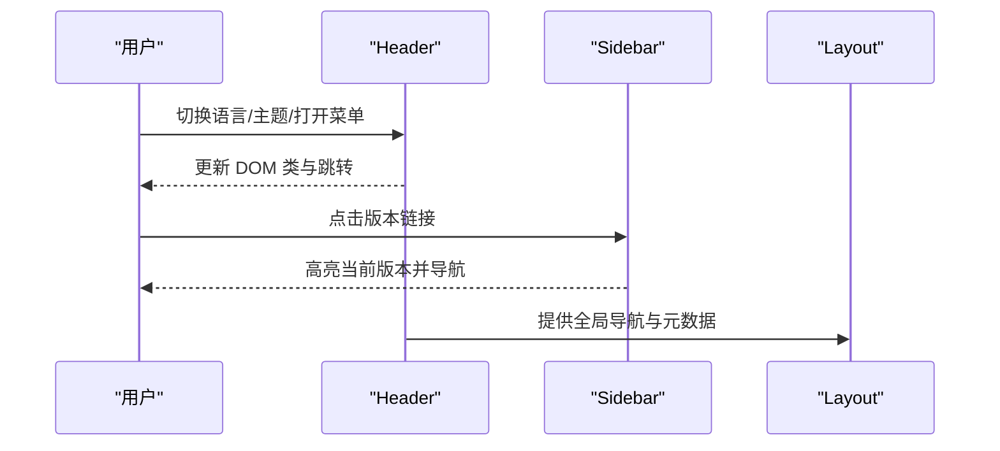
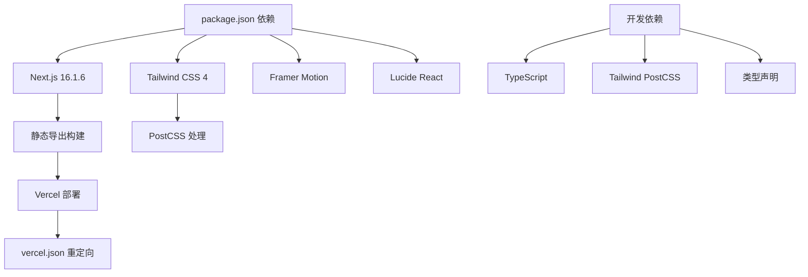

# 平台架构设计

<cite>
**本文引用的文件**
- [package.json](file://web/package.json)
- [next.config.ts](file://web/next.config.ts)
- [tsconfig.json](file://web/tsconfig.json)
- [postcss.config.mjs](file://web/postcss.config.mjs)
- [vercel.json](file://web/vercel.json)
- [ci.yml](file://.github/workflows/ci.yml)
- [test.yml](file://.github/workflows/test.yml)
- [src/app/page.tsx](file://web/src/app/page.tsx)
- [src/app/[locale]/layout.tsx](file://web/src/app/[locale]/layout.tsx)
- [src/components/architecture/arch-diagram.tsx](file://web/src/components/architecture/arch-diagram.tsx)
- [src/lib/constants.ts](file://web/src/lib/constants.ts)
- [src/data/execution-flows.ts](file://web/src/data/execution-flows.ts)
- [src/components/layout/header.tsx](file://web/src/components/layout/header.tsx)
- [src/components/layout/sidebar.tsx](file://web/src/components/layout/sidebar.tsx)
</cite>

## 目录
1. [引言](#引言)
2. [项目结构](#项目结构)
3. [核心组件](#核心组件)
4. [架构总览](#架构总览)
5. [详细组件分析](#详细组件分析)
6. [依赖关系分析](#依赖关系分析)
7. [性能考量](#性能考量)
8. [故障排查指南](#故障排查指南)
9. [结论](#结论)
10. [附录](#附录)

## 引言
本文件系统化阐述“可视化学习平台”的整体架构设计与实现细节，重点围绕以下方面展开：  
- Next.js 16.1.6 的框架选择与配置策略（App Router 架构、静态导出、国际化、元数据生成等）  
- TypeScript 配置体系（编译选项、路径别名、类型声明与增量编译）  
- Tailwind CSS 4 的现代化集成（PostCSS 插件、响应式与暗色模式支持）  
- Vercel 部署与重定向规则、CI/CD 流程（GitHub Actions）  
- 架构决策的技术考量（性能、可扩展性、安全性与开发体验）

## 项目结构
该平台采用 Next.js App Router 的分层组织方式，前端代码集中在 web 子目录中，文档与技能素材位于根目录的 docs 与 skills 中，Python 后端与测试位于根目录 agents 与 tests。

图表来源
- [package.json:1-39](file://web/package.json#L1-L39)
- [next.config.ts:1-10](file://web/next.config.ts#L1-L10)
- [tsconfig.json:1-35](file://web/tsconfig.json#L1-L35)
- [postcss.config.mjs:1-8](file://web/postcss.config.mjs#L1-L8)
- [vercel.json:1-21](file://web/vercel.json#L1-L21)

章节来源
- [package.json:1-39](file://web/package.json#L1-L39)
- [next.config.ts:1-10](file://web/next.config.ts#L1-L10)
- [tsconfig.json:1-35](file://web/tsconfig.json#L1-L35)
- [postcss.config.mjs:1-8](file://web/postcss.config.mjs#L1-L8)
- [vercel.json:1-21](file://web/vercel.json#L1-L21)

## 核心组件
- 路由与页面
  - 根页面重定向至默认语言路径，确保统一入口与 SEO 友好
  - 国际化布局通过动态参数与静态参数生成，结合元数据生成函数实现多语言标题与描述
- 架构可视化组件
  - 架构图组件基于版本数据与层级映射，使用动画库实现逐层呈现与新增标识
- 数据与流程
  - 版本元信息与执行流程图数据集中管理，便于在不同页面复用
- 布局与导航
  - 头部组件支持移动端菜单、语言切换、暗色模式切换；侧边栏按层级聚合版本列表并高亮当前页

章节来源
- [src/app/page.tsx:1-6](file://web/src/app/page.tsx#L1-L6)
- [src/app/[locale]/layout.tsx:1-61](file://web/src/app/[locale]/layout.tsx#L1-L61)
- [src/components/architecture/arch-diagram.tsx:1-229](file://web/src/components/architecture/arch-diagram.tsx#L1-L229)
- [src/lib/constants.ts:1-38](file://web/src/lib/constants.ts#L1-L38)
- [src/data/execution-flows.ts:1-316](file://web/src/data/execution-flows.ts#L1-L316)
- [src/components/layout/header.tsx:1-167](file://web/src/components/layout/header.tsx#L1-L167)
- [src/components/layout/sidebar.tsx:1-67](file://web/src/components/layout/sidebar.tsx#L1-L67)

## 架构总览
平台采用“静态导出 + 国际化 + 主题切换”的混合渲染策略，结合 Tailwind CSS 实现响应式与暗色模式，通过 GitHub Actions 完成类型检查与构建验证，最终在 Vercel 上进行托管与重定向。

图表来源
- [package.json:1-39](file://web/package.json#L1-L39)
- [next.config.ts:1-10](file://web/next.config.ts#L1-L10)
- [tsconfig.json:1-35](file://web/tsconfig.json#L1-L35)
- [postcss.config.mjs:1-8](file://web/postcss.config.mjs#L1-L8)
- [vercel.json:1-21](file://web/vercel.json#L1-L21)
- [src/app/page.tsx:1-6](file://web/src/app/page.tsx#L1-L6)
- [src/app/[locale]/layout.tsx:1-61](file://web/src/app/[locale]/layout.tsx#L1-L61)
- [src/components/layout/header.tsx:1-167](file://web/src/components/layout/header.tsx#L1-L167)
- [src/components/layout/sidebar.tsx:1-67](file://web/src/components/layout/sidebar.tsx#L1-L67)
- [src/components/architecture/arch-diagram.tsx:1-229](file://web/src/components/architecture/arch-diagram.tsx#L1-L229)
- [src/lib/constants.ts:1-38](file://web/src/lib/constants.ts#L1-L38)
- [src/data/execution-flows.ts:1-316](file://web/src/data/execution-flows.ts#L1-L316)
- [.github/workflows/ci.yml:1-33](file://.github/workflows/ci.yml#L1-L33)
- [.github/workflows/test.yml:1-46](file://.github/workflows/test.yml#L1-L46)

## 详细组件分析

### Next.js 16.1.6 与 App Router 架构
- 静态导出与图像优化
  - 使用静态导出模式以适配 CDN 与自托管需求，关闭图片优化以避免运行时处理
  - 尾随斜杠启用，提升链接一致性
- 国际化与元数据
  - 动态路由参数用于 locale，静态生成语言参数，结合元数据生成函数为不同语言提供标题与描述
- 根页面重定向
  - 根路径重定向到默认语言，保证统一入口与搜索引擎友好

图表来源
- [src/app/page.tsx:1-6](file://web/src/app/page.tsx#L1-L6)
- [src/app/[locale]/layout.tsx:12-27](file://web/src/app/[locale]/layout.tsx#L12-L27)

章节来源
- [next.config.ts:1-10](file://web/next.config.ts#L1-L10)
- [src/app/page.tsx:1-6](file://web/src/app/page.tsx#L1-L6)
- [src/app/[locale]/layout.tsx:12-27](file://web/src/app/[locale]/layout.tsx#L12-L27)

### TypeScript 配置体系
- 编译目标与模块解析
  - ES2018 目标、ESNext 模块与 bundler 解析器，配合严格模式与 noEmit 确保类型安全且不输出 JS
- 路径别名与包含范围
  - 使用 @/* 映射到 src/*，便于跨目录引用
  - 包含 next-env.d.ts、所有 ts/tsx 与 Next 类型目录，支持增量编译
- 插件与工具链
  - 启用 Next 类型插件，与 Next.js 开发体验深度集成

图表来源
- [tsconfig.json:1-35](file://web/tsconfig.json#L1-L35)

章节来源
- [tsconfig.json:1-35](file://web/tsconfig.json#L1-L35)

### Tailwind CSS 4 集成与主题
- PostCSS 配置
  - 通过 Tailwind PostCSS 插件加载器启用 v4 能力，简化构建管线
- 响应式与暗色模式
  - 头部组件在挂载后根据本地存储或系统偏好设置暗色类，全局样式通过 CSS 变量与暗色类组合实现一致的主题切换
- 组件级样式
  - 导航、侧边栏与架构图组件广泛使用 Tailwind 工具类，确保一致的视觉语言与响应式断点

图表来源
- [postcss.config.mjs:1-8](file://web/postcss.config.mjs#L1-L8)
- [src/components/layout/header.tsx:30-40](file://web/src/components/layout/header.tsx#L30-L40)
- [src/components/layout/sidebar.tsx:17-67](file://web/src/components/layout/sidebar.tsx#L17-L67)
- [src/components/architecture/arch-diagram.tsx:105-229](file://web/src/components/architecture/arch-diagram.tsx#L105-L229)

章节来源
- [postcss.config.mjs:1-8](file://web/postcss.config.mjs#L1-L8)
- [src/components/layout/header.tsx:30-40](file://web/src/components/layout/header.tsx#L30-L40)
- [src/components/layout/sidebar.tsx:17-67](file://web/src/components/layout/sidebar.tsx#L17-L67)
- [src/components/architecture/arch-diagram.tsx:105-229](file://web/src/components/architecture/arch-diagram.tsx#L105-L229)

### 架构可视化与数据驱动
- 架构图组件
  - 基于版本数据与层级映射，计算每个类引入的层级颜色，区分新旧类并添加视觉强调
  - 使用动画库实现逐层出现与箭头引导，增强学习体验
- 执行流程图
  - 以节点与边定义各版本的执行流程，便于在页面中渲染对应流程图

图表来源
- [src/components/architecture/arch-diagram.tsx:105-229](file://web/src/components/architecture/arch-diagram.tsx#L105-L229)
- [src/lib/constants.ts:1-38](file://web/src/lib/constants.ts#L1-L38)
- [src/data/execution-flows.ts:13-316](file://web/src/data/execution-flows.ts#L13-L316)

章节来源
- [src/components/architecture/arch-diagram.tsx:105-229](file://web/src/components/architecture/arch-diagram.tsx#L105-L229)
- [src/lib/constants.ts:1-38](file://web/src/lib/constants.ts#L1-L38)
- [src/data/execution-flows.ts:13-316](file://web/src/data/execution-flows.ts#L13-L316)

### 布局与导航
- 头部组件
  - 支持移动端汉堡菜单、语言切换、暗色模式切换与外部链接
- 侧边栏组件
  - 按层级聚合版本列表，高亮当前激活项，提供清晰的学习路径

图表来源
- [src/components/layout/header.tsx:22-167](file://web/src/components/layout/header.tsx#L22-L167)
- [src/components/layout/sidebar.tsx:17-67](file://web/src/components/layout/sidebar.tsx#L17-L67)
- [src/app/[locale]/layout.tsx:29-60](file://web/src/app/[locale]/layout.tsx#L29-L60)

章节来源
- [src/components/layout/header.tsx:22-167](file://web/src/components/layout/header.tsx#L22-L167)
- [src/components/layout/sidebar.tsx:17-67](file://web/src/components/layout/sidebar.tsx#L17-L67)
- [src/app/[locale]/layout.tsx:29-60](file://web/src/app/[locale]/layout.tsx#L29-L60)

## 依赖关系分析
- 运行时依赖
  - Next.js 16.1.6、React 19、Tailwind CSS 4、动画与图标库等
- 开发依赖
  - TypeScript、Tailwind PostCSS 插件、类型声明等
- 构建与部署
  - 静态导出、PostCSS 插件、Vercel 重定向规则

图表来源
- [package.json:13-37](file://web/package.json#L13-L37)
- [postcss.config.mjs:1-8](file://web/postcss.config.mjs#L1-L8)
- [vercel.json:1-21](file://web/vercel.json#L1-L21)

章节来源
- [package.json:13-37](file://web/package.json#L13-L37)
- [postcss.config.mjs:1-8](file://web/postcss.config.mjs#L1-L8)
- [vercel.json:1-21](file://web/vercel.json#L1-L21)

## 性能考量
- 构建与渲染
  - 静态导出减少运行时开销，适合文档型站点与 CDN 分发
  - 关闭图片优化避免额外处理，提升构建稳定性
- 类型与增量编译
  - 严格类型检查与 noEmit 确保构建前发现潜在问题
  - 启用增量编译降低开发时编译时间
- 样式与交互
  - Tailwind 工具类减少自定义 CSS，提升维护效率
  - 动画库按需使用，避免不必要的重绘与回流

## 故障排查指南
- 构建失败
  - 检查类型检查是否通过（CI 中已执行）
  - 确认静态导出配置未被覆盖
- 国际化问题
  - 确认动态参数与静态参数生成函数返回值正确
  - 检查语言包是否存在并被正确导入
- 主题切换异常
  - 确认本地存储键值与头部组件逻辑一致
  - 检查 HTML 根元素是否正确添加/移除暗色类
- 部署重定向
  - 确认 vercel.json 中重定向规则与预期一致

章节来源
- [.github/workflows/ci.yml:28-32](file://.github/workflows/ci.yml#L28-L32)
- [next.config.ts:3-7](file://web/next.config.ts#L3-L7)
- [src/app/[locale]/layout.tsx:12-27](file://web/src/app/[locale]/layout.tsx#L12-L27)
- [src/components/layout/header.tsx:30-40](file://web/src/components/layout/header.tsx#L30-L40)
- [vercel.json:2-19](file://web/vercel.json#L2-L19)

## 结论
该平台以 Next.js 16.1.6 为核心，结合静态导出、国际化与主题切换，构建了面向学习场景的可视化平台。通过 TypeScript 与 Tailwind CSS 的规范化配置，提升了开发效率与一致性；借助 GitHub Actions 与 Vercel 的自动化流程，保障了质量与交付效率。整体架构在性能、可扩展性与开发体验之间取得平衡，适合持续演进与多语言扩展。

## 附录
- CI/CD 流程
  - CI 工作流：安装依赖、类型检查、构建
  - Test 工作流：Python 冒烟测试与 Web 构建
- 部署与重定向
  - vercel.json 提供域名重定向与首页默认语言重定向

章节来源
- [.github/workflows/ci.yml:1-33](file://.github/workflows/ci.yml#L1-L33)
- [.github/workflows/test.yml:1-46](file://.github/workflows/test.yml#L1-L46)
- [vercel.json:1-21](file://web/vercel.json#L1-L21)