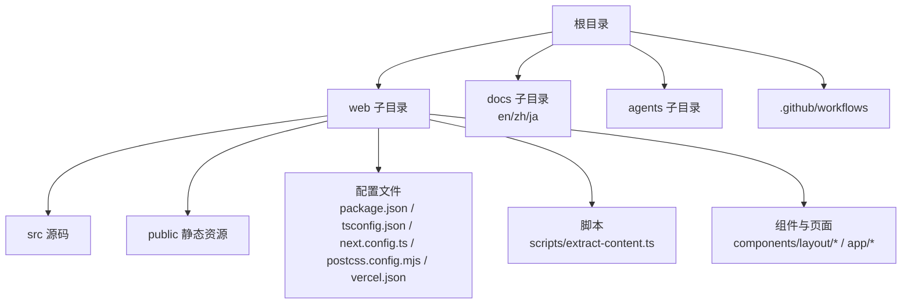
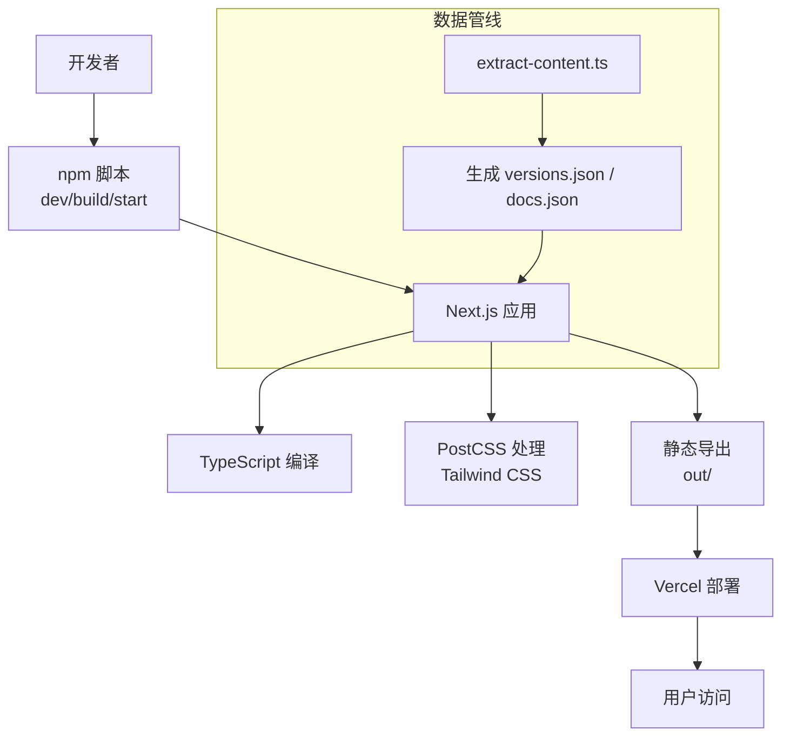
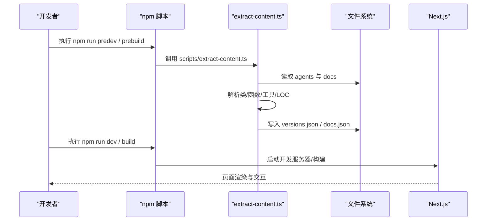
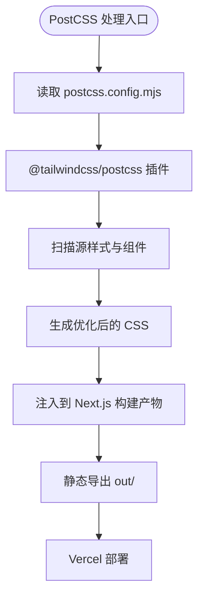
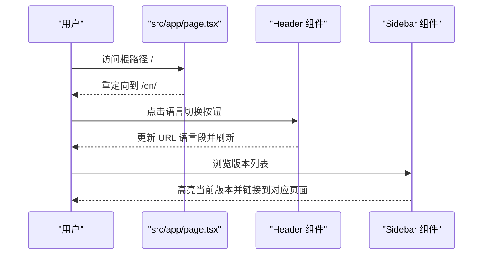
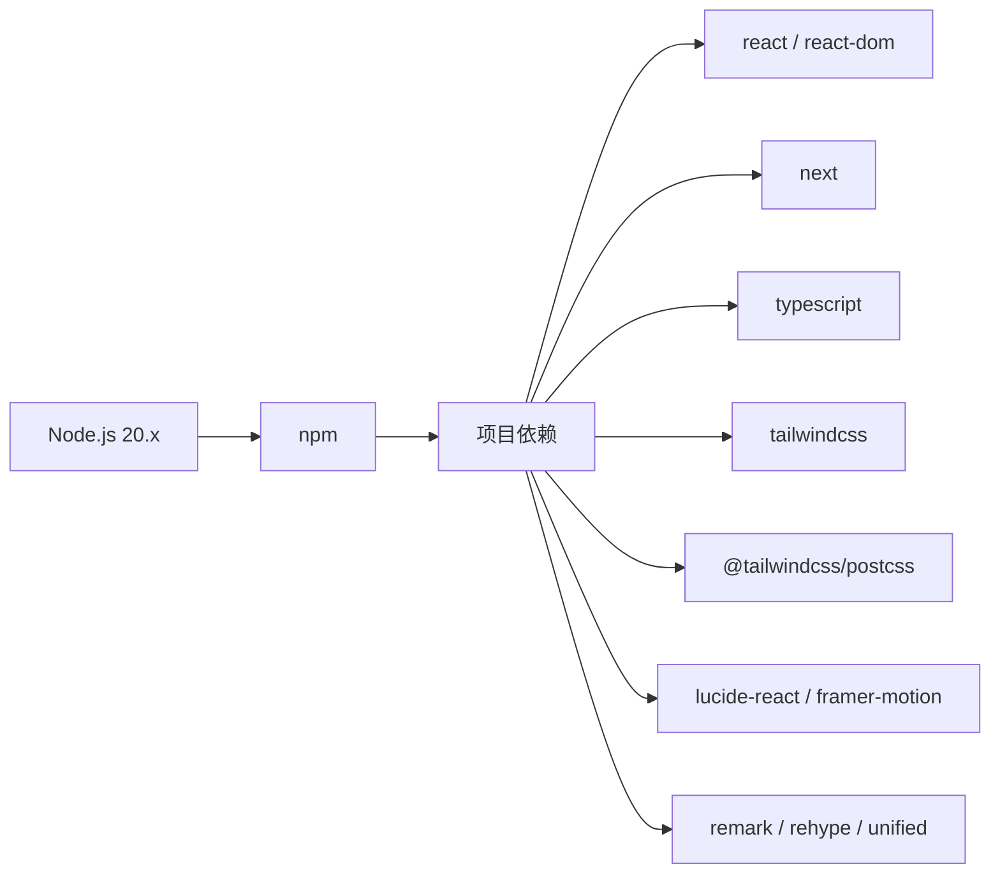

# 开发指南

<cite>
**本文引用的文件**
- [README.md](file://README.md)
- [README-zh.md](file://README-zh.md)
- [web/package.json](file://web/package.json)
- [web/next.config.ts](file://web/next.config.ts)
- [web/postcss.config.mjs](file://web/postcss.config.mjs)
- [web/tsconfig.json](file://web/tsconfig.json)
- [web/vercel.json](file://web/vercel.json)
- [.github/workflows/ci.yml](file://.github/workflows/ci.yml)
- [.github/workflows/test.yml](file://.github/workflows/test.yml)
- [web/.gitignore](file://web/.gitignore)
- [web/scripts/extract-content.ts](file://web/scripts/extract-content.ts)
- [web/src/app/page.tsx](file://web/src/app/page.tsx)
- [web/src/components/layout/header.tsx](file://web/src/components/layout/header.tsx)
- [web/src/components/layout/sidebar.tsx](file://web/src/components/layout/sidebar.tsx)
</cite>

## 目录
1. [简介](#简介)
2. [项目结构](#项目结构)
3. [核心组件](#核心组件)
4. [架构总览](#架构总览)
5. [详细组件分析](#详细组件分析)
6. [依赖关系分析](#依赖关系分析)
7. [性能考虑](#性能考虑)
8. [故障排除指南](#故障排除指南)
9. [结论](#结论)
10. [附录](#附录)

## 简介
本指南面向可视化学习平台的开发者，覆盖开发环境搭建、开发工作流、Git 配置与版本控制策略、PostCSS 与样式处理、调试与故障排除、以及参与开源贡献的实践方法。平台基于 Next.js 16、TypeScript 5、Tailwind CSS 4，采用静态导出部署，并通过 GitHub Actions 实现 CI/CD。

## 项目结构
- 根目录包含英文、中文、日文三语文档，Python 示例与技能素材，以及 GitHub Actions 工作流。
- web 子目录为核心前端平台，包含 Next.js 应用、TypeScript 配置、PostCSS 配置、构建与部署配置、国际化资源、组件与页面等。
- 顶层 README 提供快速开始、学习路径与架构概览；web/.gitignore 控制构建产物与缓存文件的忽略策略。

图表来源
- [web/package.json:1-39](file://web/package.json#L1-L39)
- [web/tsconfig.json:1-35](file://web/tsconfig.json#L1-L35)
- [web/next.config.ts:1-10](file://web/next.config.ts#L1-L10)
- [web/postcss.config.mjs:1-8](file://web/postcss.config.mjs#L1-L8)
- [web/vercel.json:1-21](file://web/vercel.json#L1-L21)

章节来源
- [README.md:245-252](file://README.md#L245-L252)
- [web/package.json:1-39](file://web/package.json#L1-L39)
- [web/tsconfig.json:1-35](file://web/tsconfig.json#L1-L35)
- [web/next.config.ts:1-10](file://web/next.config.ts#L1-L10)
- [web/postcss.config.mjs:1-8](file://web/postcss.config.mjs#L1-L8)
- [web/vercel.json:1-21](file://web/vercel.json#L1-L21)

## 核心组件
- 构建与脚本
  - package.json 定义了开发、构建、预构建提取脚本，使用 Next.js 16、React 19、TypeScript 5、Tailwind CSS 4。
  - 预构建脚本通过 scripts/extract-content.ts 从 agents 与 docs 提取版本元数据、差异与文档内容，生成 web/src/data/generated 下的 JSON 文件。
- 配置中心
  - next.config.ts 设置静态导出、图片未优化与尾斜杠策略。
  - tsconfig.json 配置严格模式、模块解析为 bundler、路径别名 @/* 指向 src/*。
  - postcss.config.mjs 使用 Tailwind CSS PostCSS 插件。
  - vercel.json 定义重定向规则，将 learn-claude-agents.vercel.app 的主机头重定向至 learn.shareai.run，并设置默认语言路径。
- 页面与布局
  - src/app/page.tsx 重定向至 /en/。
  - src/components/layout/header.tsx 提供导航、语言切换、主题切换与移动端菜单。
  - src/components/layout/sidebar.tsx 提供版本导航与层级标签。

章节来源
- [web/package.json:1-39](file://web/package.json#L1-L39)
- [web/scripts/extract-content.ts:118-282](file://web/scripts/extract-content.ts#L118-L282)
- [web/next.config.ts:1-10](file://web/next.config.ts#L1-L10)
- [web/tsconfig.json:1-35](file://web/tsconfig.json#L1-L35)
- [web/postcss.config.mjs:1-8](file://web/postcss.config.mjs#L1-L8)
- [web/vercel.json:1-21](file://web/vercel.json#L1-L21)
- [web/src/app/page.tsx:1-6](file://web/src/app/page.tsx#L1-L6)
- [web/src/components/layout/header.tsx:1-167](file://web/src/components/layout/header.tsx#L1-L167)
- [web/src/components/layout/sidebar.tsx:1-67](file://web/src/components/layout/sidebar.tsx#L1-L67)

## 架构总览
平台采用“静态导出 + 本地开发”的前后端分离思路：
- 前端：Next.js 应用，TypeScript 类型检查，Tailwind CSS 样式，PostCSS 自动前缀与优化，静态导出用于部署。
- 数据：通过预构建脚本从 Python 示例与文档中抽取版本元数据、差异与文档内容，生成 JSON 供页面渲染。
- 部署：Vercel 静态托管，vercel.json 控制重定向与默认语言。

图表来源
- [web/package.json:5-11](file://web/package.json#L5-L11)
- [web/scripts/extract-content.ts:118-282](file://web/scripts/extract-content.ts#L118-L282)
- [web/next.config.ts:3-7](file://web/next.config.ts#L3-L7)
- [web/vercel.json:2-19](file://web/vercel.json#L2-L19)

## 详细组件分析

### 组件一：开发脚本与预构建流程
- 预开发与预构建：predev 与 prebuild 分别调用 extract 脚本，确保在开发与构建前生成数据。
- 开发与构建：dev 使用 next dev，build 调用 next build，start 运行生产服务。
- 提取逻辑：从 agents 与 docs 目录扫描 Python 示例与 Markdown 文档，解析类、函数、工具名称与 LOC，计算相邻版本差异，输出 versions.json 与 docs.json。

图表来源
- [web/package.json:5-11](file://web/package.json#L5-L11)
- [web/scripts/extract-content.ts:118-282](file://web/scripts/extract-content.ts#L118-L282)

章节来源
- [web/package.json:5-11](file://web/package.json#L5-L11)
- [web/scripts/extract-content.ts:118-282](file://web/scripts/extract-content.ts#L118-L282)

### 组件二：样式与 PostCSS 配置
- PostCSS 插件：使用 Tailwind CSS PostCSS 插件，实现自动前缀与样式优化。
- Tailwind 集成：通过 Tailwind CSS 4 与 PostCSS 配置，结合 Next.js 的样式处理链路。
- 静态导出与图片：next.config.ts 设置 images.unoptimized 与静态导出，确保部署一致性。

图表来源
- [web/postcss.config.mjs:1-8](file://web/postcss.config.mjs#L1-L8)
- [web/next.config.ts:3-7](file://web/next.config.ts#L3-L7)

章节来源
- [web/postcss.config.mjs:1-8](file://web/postcss.config.mjs#L1-L8)
- [web/next.config.ts:1-10](file://web/next.config.ts#L1-L10)

### 组件三：国际化与路由
- 默认语言：src/app/page.tsx 重定向至 /en/。
- 语言切换：Header 组件提供 EN/中文/日本語 切换，更新路径并刷新页面。
- 版本导航：Sidebar 组件根据 LAYERS 与 VERSION_META 渲染版本列表，支持当前版本高亮。

图表来源
- [web/src/app/page.tsx:1-6](file://web/src/app/page.tsx#L1-L6)
- [web/src/components/layout/header.tsx:16-45](file://web/src/components/layout/header.tsx#L16-L45)
- [web/src/components/layout/sidebar.tsx:17-62](file://web/src/components/layout/sidebar.tsx#L17-L62)

章节来源
- [web/src/app/page.tsx:1-6](file://web/src/app/page.tsx#L1-L6)
- [web/src/components/layout/header.tsx:1-167](file://web/src/components/layout/header.tsx#L1-L167)
- [web/src/components/layout/sidebar.tsx:1-67](file://web/src/components/layout/sidebar.tsx#L1-L67)

## 依赖关系分析
- Node.js 与包管理器
  - GitHub Actions 使用 Node.js 20，缓存 npm 依赖，使用 npm ci 进行确定性安装。
  - 本地开发建议使用 Node.js 20.x，推荐使用 npm 作为包管理器（与 CI 一致）。
- 依赖与版本
  - React 19、Next.js 16、TypeScript 5、Tailwind CSS 4、PostCSS 插件等。
  - 开发依赖包括类型定义与构建工具，生产依赖包括 UI 组件库与文档处理工具链。

图表来源
- [.github/workflows/ci.yml:19-26](file://.github/workflows/ci.yml#L19-L26)
- [web/package.json:13-37](file://web/package.json#L13-L37)

章节来源
- [.github/workflows/ci.yml:19-26](file://.github/workflows/ci.yml#L19-L26)
- [web/package.json:13-37](file://web/package.json#L13-L37)

## 性能考虑
- 构建优化
  - 使用静态导出与 images.unoptimized，减少运行时图片处理开销，提升首屏性能。
  - TypeScript 严格模式与增量编译提升开发体验与构建稳定性。
- 样式优化
  - Tailwind CSS 4 与 PostCSS 插件配合，自动前缀与按需生成样式，避免冗余 CSS。
- 数据预处理
  - 预构建脚本在 CI 与本地开发前生成 JSON 数据，避免运行时解析成本。
- 部署策略
  - Vercel 静态托管与重定向配置，确保域名迁移与默认语言路径的一致性。

章节来源
- [web/next.config.ts:3-7](file://web/next.config.ts#L3-L7)
- [web/tsconfig.json:6-15](file://web/tsconfig.json#L6-L15)
- [web/postcss.config.mjs:1-8](file://web/postcss.config.mjs#L1-L8)
- [web/vercel.json:2-19](file://web/vercel.json#L2-L19)
- [web/scripts/extract-content.ts:118-282](file://web/scripts/extract-content.ts#L118-L282)

## 故障排除指南
- Node.js 版本不匹配
  - 症状：CI 与本地构建失败或依赖安装异常。
  - 处理：确保使用 Node.js 20.x，清理缓存后重新安装依赖。
- 依赖安装失败
  - 症状：npm ci 报错或安装缓慢。
  - 处理：检查网络与缓存配置，确认 package-lock.json 与缓存路径一致。
- 预构建脚本缺失源目录
  - 症状：构建日志显示跳过提取，使用已提交的生成数据。
  - 处理：确认 agents 与 docs 目录存在，或在本地保留源数据以便提取。
- 样式未生效
  - 症状：Tailwind 类无效或样式未生成。
  - 处理：检查 postcss.config.mjs 与 Tailwind 插件配置，确认构建链路正常。
- 部署重定向异常
  - 症状：访问 learn-claude-agents.vercel.app 未正确跳转。
  - 处理：核对 vercel.json 的重定向规则与主机头匹配条件。

章节来源
- [.github/workflows/ci.yml:19-26](file://.github/workflows/ci.yml#L19-L26)
- [web/.gitignore:16-18](file://web/.gitignore#L16-L18)
- [web/scripts/extract-content.ts:125-131](file://web/scripts/extract-content.ts#L125-L131)
- [web/postcss.config.mjs:1-8](file://web/postcss.config.mjs#L1-L8)
- [web/vercel.json:2-19](file://web/vercel.json#L2-L19)

## 结论
本指南提供了从环境搭建到部署运维的全流程实践，强调静态导出、预构建数据与 Tailwind CSS 的集成，结合 GitHub Actions 的 CI/CD 流程，确保开发与发布的稳定与高效。遵循本文档可快速上手并高质量交付可视化学习平台。

## 附录

### 开发环境搭建与工作流
- Node.js 版本：使用 Node.js 20.x。
- 包管理器：推荐使用 npm（与 CI 一致）。
- 依赖安装：在 web 目录执行 npm ci 或 npm install。
- 开发启动：npm run dev，访问 http://localhost:3000。
- 构建与预览：npm run build 与 npm run start。
- 预构建：npm run predev/prebuild 会触发 extract 脚本，生成版本与文档数据。

章节来源
- [.github/workflows/ci.yml:19-26](file://.github/workflows/ci.yml#L19-L26)
- [web/package.json:5-11](file://web/package.json#L5-L11)
- [README.md:245-252](file://README.md#L245-L252)

### Git 配置与版本控制策略
- 分支管理：CI/CD 在 main 分支触发，建议采用功能分支开发，合并前通过 PR。
- 提交规范：建议采用清晰的提交信息，描述变更目的与影响范围。
- 代码审查：PR 合并前进行代码审查，确保类型检查与构建通过。

章节来源
- [.github/workflows/ci.yml:3-7](file://.github/workflows/ci.yml#L3-L7)
- [.github/workflows/test.yml:3-7](file://.github/workflows/test.yml#L3-L7)

### PostCSS 与样式处理
- 插件配置：使用 @tailwindcss/postcss 插件，结合 Tailwind CSS 4。
- 自动前缀与优化：由 PostCSS 与 Tailwind 协同完成，确保跨浏览器兼容。
- 构建流程：Next.js 在构建时集成 PostCSS 处理，最终产物包含优化后的 CSS。

章节来源
- [web/postcss.config.mjs:1-8](file://web/postcss.config.mjs#L1-L8)
- [web/next.config.ts:3-7](file://web/next.config.ts#L3-L7)

### 调试技巧与性能分析
- 类型检查：使用 npx tsc --noEmit 在 CI 中进行类型检查。
- 构建验证：在本地执行 npm run build，确保静态导出与部署配置正确。
- 样式排查：确认 Tailwind 配置与组件类名使用一致。
- 部署验证：通过 vercel.json 的重定向规则验证域名与默认语言路径。

章节来源
- [.github/workflows/ci.yml:28-32](file://.github/workflows/ci.yml#L28-L32)
- [web/vercel.json:2-19](file://web/vercel.json#L2-L19)

### 参与开源贡献
- Issue 报告：描述问题背景、复现步骤与期望结果。
- Pull Request：提供清晰的变更说明与测试验证，确保 CI 通过。
- 社区规范：遵循仓库许可（MIT），保持尊重与协作的沟通氛围。

章节来源
- [README.md:369-378](file://README.md#L369-L378)
- [README-zh.md:364-373](file://README-zh.md#L364-L373)