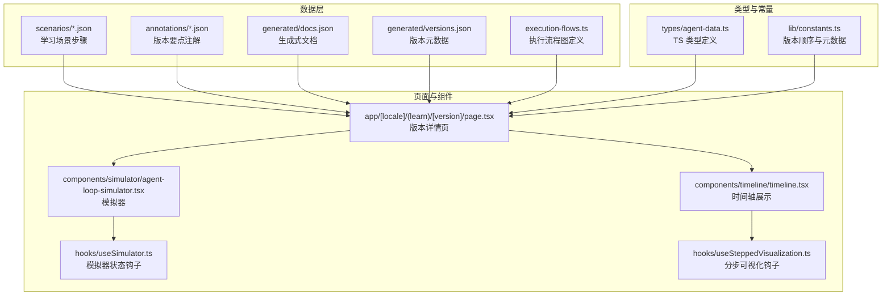
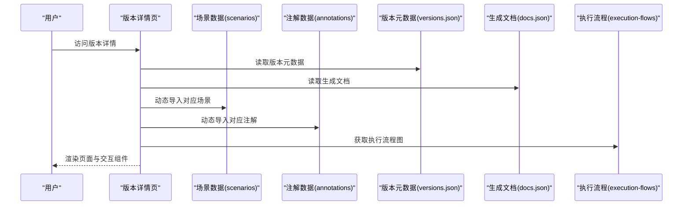
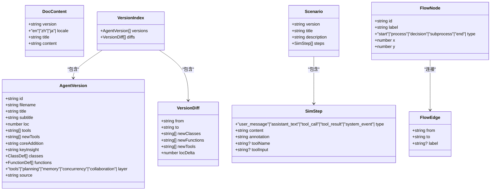
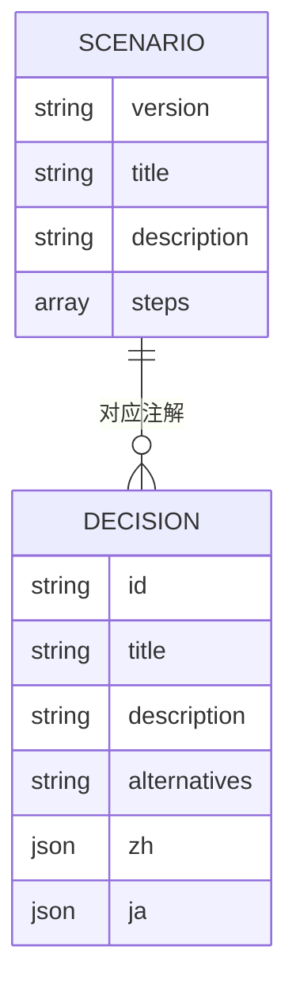
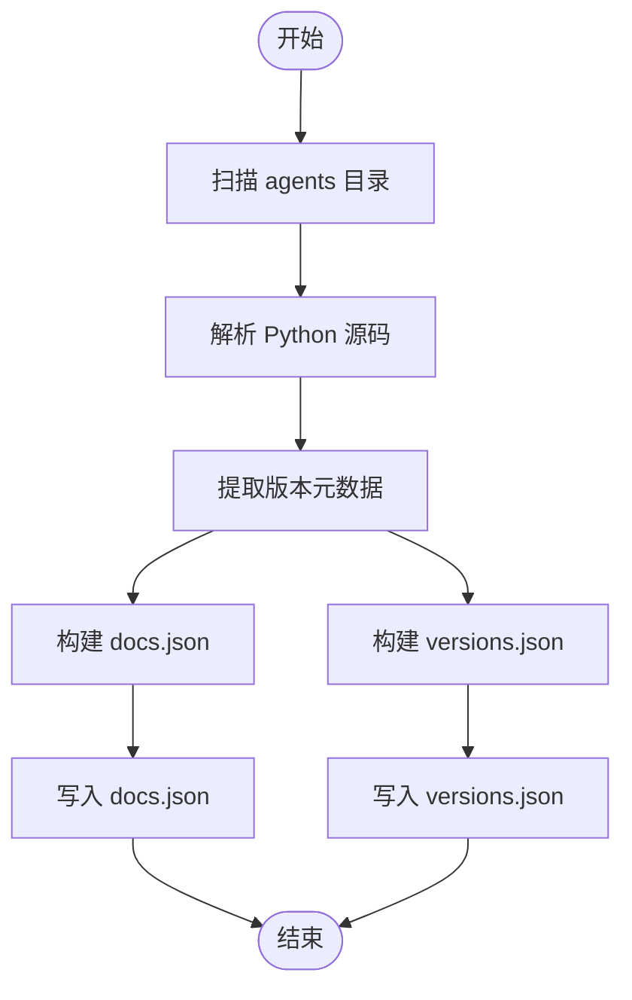
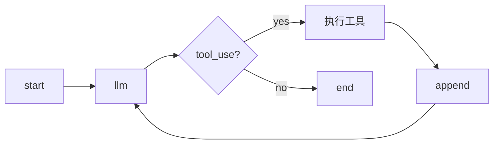
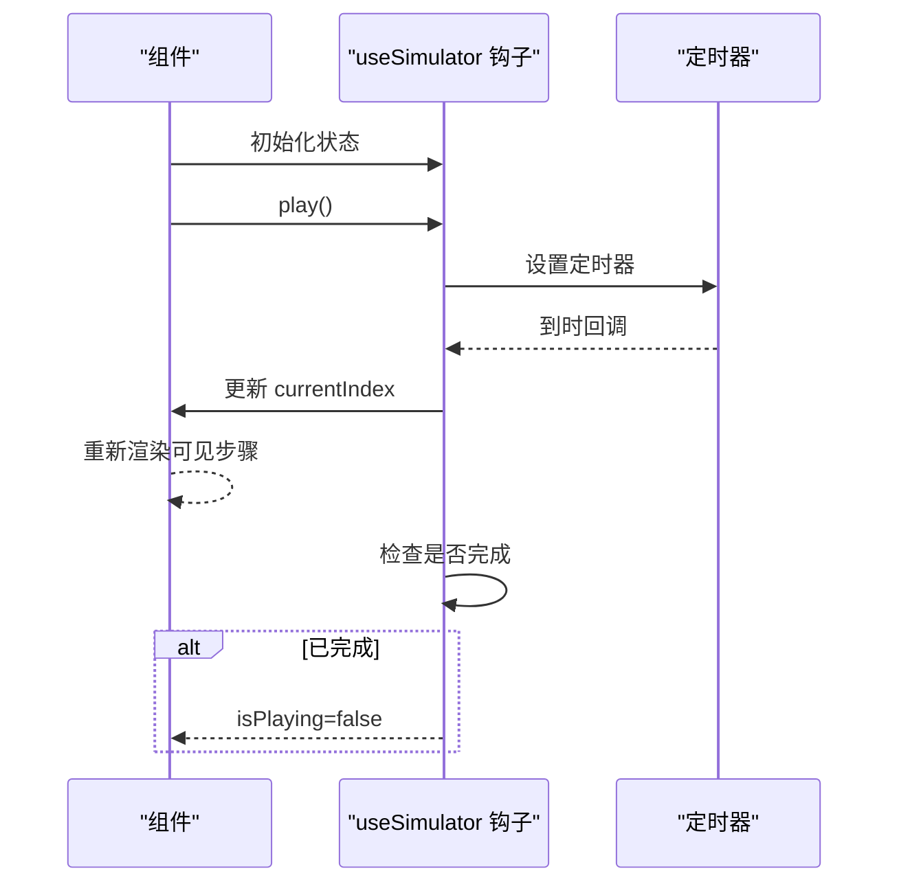
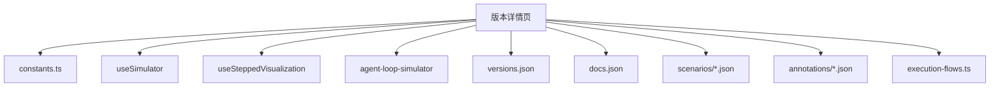

# 数据管理与状态

<cite>
**本文档引用的文件**
- [web/src/types/agent-data.ts](file://web/src/types/agent-data.ts)
- [web/src/data/scenarios/s01.json](file://web/src/data/scenarios/s01.json)
- [web/src/data/annotations/s01.json](file://web/src/data/annotations/s01.json)
- [web/src/data/generated/docs.json](file://web/src/data/generated/docs.json)
- [web/src/data/generated/versions.json](file://web/src/data/generated/versions.json)
- [web/src/lib/constants.ts](file://web/src/lib/constants.ts)
- [web/src/data/execution-flows.ts](file://web/src/data/execution-flows.ts)
- [web/src/app/[locale]/(learn)/[version]/page.tsx](file://web/src/app/[locale]/(learn)/[version]/page.tsx)
- [web/src/components/timeline/timeline.tsx](file://web/src/components/timeline/timeline.tsx)
- [web/src/hooks/useSimulator.ts](file://web/src/hooks/useSimulator.ts)
- [web/src/hooks/useSteppedVisualization.ts](file://web/src/hooks/useSteppedVisualization.ts)
- [web/src/components/simulator/agent-loop-simulator.tsx](file://web/src/components/simulator/agent-loop-simulator.tsx)
</cite>

## 目录
1. [简介](#简介)
2. [项目结构](#项目结构)
3. [核心组件](#核心组件)
4. [架构总览](#架构总览)
5. [详细组件分析](#详细组件分析)
6. [依赖关系分析](#依赖关系分析)
7. [性能考虑](#性能考虑)
8. [故障排除指南](#故障排除指南)
9. [结论](#结论)
10. [附录](#附录)

## 简介
本文件系统性梳理学习场景数据管理与状态系统，涵盖以下方面：
- 学习场景数据的组织结构：scenarios 与 annotations 的数据格式、字段定义与关系映射
- 生成式数据的处理流程：docs.json 与 versions.json 的生成机制、更新策略与缓存管理
- TypeScript 类型定义的设计原则：agent-data 类型、接口规范与类型安全
- 数据驱动的 UI 更新机制：状态订阅、变更检测与性能优化
- 最佳实践：数据验证、错误处理与备份恢复

## 项目结构
前端采用 Next.js 应用结构，数据管理主要集中在 web/src/data 目录，类型定义位于 web/src/types，UI 展示与交互逻辑位于 web/src/components 与 web/src/hooks。

**图表来源**
- [web/src/data/scenarios/s01.json:1-52](file://web/src/data/scenarios/s01.json#L1-L52)
- [web/src/data/annotations/s01.json:1-48](file://web/src/data/annotations/s01.json#L1-L48)
- [web/src/data/generated/docs.json:1-156](file://web/src/data/generated/docs.json#L1-L156)
- [web/src/data/generated/versions.json:1-537](file://web/src/data/generated/versions.json#L1-L537)
- [web/src/data/execution-flows.ts:1-316](file://web/src/data/execution-flows.ts#L1-L316)
- [web/src/types/agent-data.ts:1-73](file://web/src/types/agent-data.ts#L1-L73)
- [web/src/lib/constants.ts:1-38](file://web/src/lib/constants.ts#L1-L38)
- [web/src/app/[locale]/(learn)/[version]/page.tsx](file://web/src/app/[locale]/(learn)/[version]/page.tsx#L1-L126)
- [web/src/components/timeline/timeline.tsx:1-216](file://web/src/components/timeline/timeline.tsx#L1-L216)
- [web/src/components/simulator/agent-loop-simulator.tsx:1-97](file://web/src/components/simulator/agent-loop-simulator.tsx#L1-L97)
- [web/src/hooks/useSimulator.ts:1-85](file://web/src/hooks/useSimulator.ts#L1-L85)
- [web/src/hooks/useSteppedVisualization.ts:1-85](file://web/src/hooks/useSteppedVisualization.ts#L1-L85)

**章节来源**
- [web/src/app/[locale]/(learn)/[version]/page.tsx](file://web/src/app/[locale]/(learn)/[version]/page.tsx#L1-L126)
- [web/src/lib/constants.ts:1-38](file://web/src/lib/constants.ts#L1-L38)

## 核心组件
- 类型系统：统一的 TypeScript 接口定义，确保数据结构一致性与类型安全
- 场景数据：scenarios 与 annotations 提供学习步骤与要点注解
- 生成式数据：docs.json 与 versions.json 提供文档与版本元数据
- 执行流程：execution-flows.ts 定义各版本的执行流程图
- UI 钩子：useSimulator 与 useSteppedVisualization 实现状态驱动的 UI 更新

**章节来源**
- [web/src/types/agent-data.ts:1-73](file://web/src/types/agent-data.ts#L1-L73)
- [web/src/data/execution-flows.ts:1-316](file://web/src/data/execution-flows.ts#L1-L316)
- [web/src/hooks/useSimulator.ts:1-85](file://web/src/hooks/useSimulator.ts#L1-L85)
- [web/src/hooks/useSteppedVisualization.ts:1-85](file://web/src/hooks/useSteppedVisualization.ts#L1-L85)

## 架构总览
数据从静态 JSON 文件与生成式 JSON 开始，经过页面渲染与组件交互，最终通过 UI 钩子实现状态驱动的可视化与模拟。

**图表来源**
- [web/src/app/[locale]/(learn)/[version]/page.tsx](file://web/src/app/[locale]/(learn)/[version]/page.tsx#L1-L126)
- [web/src/data/generated/versions.json:1-537](file://web/src/data/generated/versions.json#L1-L537)
- [web/src/data/generated/docs.json:1-156](file://web/src/data/generated/docs.json#L1-L156)
- [web/src/data/scenarios/s01.json:1-52](file://web/src/data/scenarios/s01.json#L1-L52)
- [web/src/data/annotations/s01.json:1-48](file://web/src/data/annotations/s01.json#L1-L48)
- [web/src/data/execution-flows.ts:1-316](file://web/src/data/execution-flows.ts#L1-L316)

## 详细组件分析

### 类型系统与设计原则
- 设计原则
  - 明确区分运行时数据结构与 UI 展示结构
  - 使用联合类型与字面量类型保证枚举值正确性
  - 通过接口聚合相关字段，避免分散的类型定义
- 关键类型
  - AgentVersion：版本元数据，包含 id、filename、title、subtitle、loc、tools、newTools、coreAddition、keyInsight、classes、functions、layer、source
  - VersionDiff：版本差异，包含 from、to、newClasses、newFunctions、newTools、locDelta
  - DocContent：文档内容，包含 version、locale、title、content
  - VersionIndex：版本索引，包含 versions、diffs
  - SimStepType：模拟步骤类型枚举
  - SimStep：模拟步骤，包含 type、content、annotation、toolName、toolInput
  - Scenario：学习场景，包含 version、title、description、steps
  - FlowNode/FlowEdge：执行流程节点与边

**图表来源**
- [web/src/types/agent-data.ts:1-73](file://web/src/types/agent-data.ts#L1-L73)

**章节来源**
- [web/src/types/agent-data.ts:1-73](file://web/src/types/agent-data.ts#L1-L73)

### 学习场景数据组织
- scenarios 数据
  - 结构：包含 version、title、description、steps
  - steps：数组，元素为 SimStep，描述一次交互的完整过程
  - 示例：s01.json 展示了最小 Agent Loop 的完整交互序列
- annotations 数据
  - 结构：包含 version、decisions[]
  - decisions：数组，元素为注解对象，包含 id、title、description、alternatives 以及多语言 zh/ja 片段
  - 作用：为每个版本提供关键洞察与替代方案说明

**图表来源**
- [web/src/data/scenarios/s01.json:1-52](file://web/src/data/scenarios/s01.json#L1-L52)
- [web/src/data/annotations/s01.json:1-48](file://web/src/data/annotations/s01.json#L1-L48)

**章节来源**
- [web/src/data/scenarios/s01.json:1-52](file://web/src/data/scenarios/s01.json#L1-L52)
- [web/src/data/annotations/s01.json:1-48](file://web/src/data/annotations/s01.json#L1-L48)

### 生成式数据处理流程
- docs.json
  - 内容：按版本组织的 Markdown 文档，包含问题、解决方案、工作原理、变更内容与试一试等章节
  - 生成：由后端脚本或构建流程生成，覆盖 s01-s12 的完整内容
  - 用途：页面渲染与文档展示
- versions.json
  - 内容：版本元数据与源码，包含 id、filename、title、subtitle、loc、tools、newTools、coreAddition、keyInsight、classes、functions、layer、source
  - 生成：由后端脚本扫描 agents 目录，解析 Python 源码生成
  - 用途：版本导航、统计与源码展示

**图表来源**
- [web/src/data/generated/docs.json:1-156](file://web/src/data/generated/docs.json#L1-L156)
- [web/src/data/generated/versions.json:1-537](file://web/src/data/generated/versions.json#L1-L537)

**章节来源**
- [web/src/data/generated/docs.json:1-156](file://web/src/data/generated/docs.json#L1-L156)
- [web/src/data/generated/versions.json:1-537](file://web/src/data/generated/versions.json#L1-L537)

### 执行流程图定义
- execution-flows.ts
  - 定义每个版本的执行流程图，包含节点与边
  - 节点类型：start、process、decision、subprocess、end
  - 边：标注 yes/no 或具体条件
  - 用途：可视化展示各版本 Agent 的执行逻辑

**图表来源**
- [web/src/data/execution-flows.ts:1-316](file://web/src/data/execution-flows.ts#L1-L316)

**章节来源**
- [web/src/data/execution-flows.ts:1-316](file://web/src/data/execution-flows.ts#L1-L316)

### 数据驱动的 UI 更新机制
- 状态订阅与变更检测
  - useSimulator：管理模拟器状态（currentIndex、isPlaying、speed），基于 useEffect 实现播放控制与自动前进
  - useSteppedVisualization：管理分步可视化状态（currentStep、isPlaying、totalSteps），支持自动播放与步进控制
- 性能优化
  - 使用 useRef 缓存定时器引用，避免重复创建
  - 使用 useCallback 优化回调函数，减少不必要的重渲染
  - 使用 Framer Motion 的 AnimatePresence 实现流畅的动画过渡

**图表来源**
- [web/src/hooks/useSimulator.ts:1-85](file://web/src/hooks/useSimulator.ts#L1-L85)
- [web/src/components/simulator/agent-loop-simulator.tsx:1-97](file://web/src/components/simulator/agent-loop-simulator.tsx#L1-L97)

**章节来源**
- [web/src/hooks/useSimulator.ts:1-85](file://web/src/hooks/useSimulator.ts#L1-L85)
- [web/src/hooks/useSteppedVisualization.ts:1-85](file://web/src/hooks/useSteppedVisualization.ts#L1-L85)
- [web/src/components/simulator/agent-loop-simulator.tsx:1-97](file://web/src/components/simulator/agent-loop-simulator.tsx#L1-L97)

## 依赖关系分析
- 页面依赖
  - 版本详情页依赖 constants.ts 中的版本顺序与元数据、hooks 中的状态管理、components 中的可视化组件
- 数据依赖
  - 版本详情页依赖 generated/versions.json 与 generated/docs.json
  - 场景与注解通过动态导入按需加载
- 流程依赖
  - execution-flows.ts 为页面提供执行流程图数据

**图表来源**
- [web/src/app/[locale]/(learn)/[version]/page.tsx](file://web/src/app/[locale]/(learn)/[version]/page.tsx#L1-L126)
- [web/src/lib/constants.ts:1-38](file://web/src/lib/constants.ts#L1-L38)
- [web/src/hooks/useSimulator.ts:1-85](file://web/src/hooks/useSimulator.ts#L1-L85)
- [web/src/hooks/useSteppedVisualization.ts:1-85](file://web/src/hooks/useSteppedVisualization.ts#L1-L85)
- [web/src/components/simulator/agent-loop-simulator.tsx:1-97](file://web/src/components/simulator/agent-loop-simulator.tsx#L1-L97)
- [web/src/data/generated/versions.json:1-537](file://web/src/data/generated/versions.json#L1-L537)
- [web/src/data/generated/docs.json:1-156](file://web/src/data/generated/docs.json#L1-L156)
- [web/src/data/scenarios/s01.json:1-52](file://web/src/data/scenarios/s01.json#L1-L52)
- [web/src/data/annotations/s01.json:1-48](file://web/src/data/annotations/s01.json#L1-L48)
- [web/src/data/execution-flows.ts:1-316](file://web/src/data/execution-flows.ts#L1-L316)

**章节来源**
- [web/src/app/[locale]/(learn)/[version]/page.tsx](file://web/src/app/[locale]/(learn)/[version]/page.tsx#L1-L126)
- [web/src/lib/constants.ts:1-38](file://web/src/lib/constants.ts#L1-L38)

## 性能考虑
- 按需加载：场景与注解通过动态导入，避免首屏加载过多数据
- 状态管理：使用 React Hooks 管理本地状态，减少全局状态复杂度
- 动画优化：使用 Framer Motion 的 AnimatePresence 与合理的布局切换策略
- 定时器清理：确保 useEffect 清理逻辑正确，避免内存泄漏

## 故障排除指南
- 数据加载失败
  - 检查 generated/versions.json 与 generated/docs.json 是否存在且格式正确
  - 确认 constants.ts 中的版本顺序与实际文件一致
- 模拟器不工作
  - 检查 useSimulator 钩子的定时器清理逻辑
  - 确认 steps 参数正确传入且非空
- 执行流程图异常
  - 检查 execution-flows.ts 中对应版本的节点与边定义
  - 确认节点坐标与连接关系合理

**章节来源**
- [web/src/hooks/useSimulator.ts:1-85](file://web/src/hooks/useSimulator.ts#L1-L85)
- [web/src/data/execution-flows.ts:1-316](file://web/src/data/execution-flows.ts#L1-L316)

## 结论
该数据管理与状态系统通过清晰的类型定义、结构化的场景数据与生成式元数据，结合状态驱动的 UI 钩子，实现了高效、可维护的学习场景展示与交互体验。建议在后续迭代中进一步完善数据校验与错误边界处理，并考虑引入缓存策略以提升性能。

## 附录
- 最佳实践
  - 数据验证：在读取 JSON 文件时进行字段校验与默认值处理
  - 错误处理：为动态导入与异步数据加载提供错误边界与降级方案
  - 备份恢复：定期备份 generated 目录，确保数据可恢复
  - 缓存管理：对生成式数据设置合理的缓存策略与失效机制