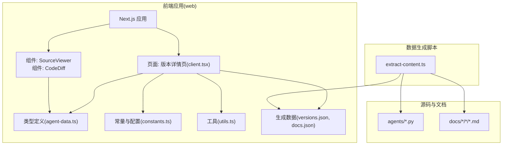
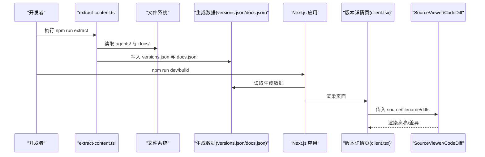
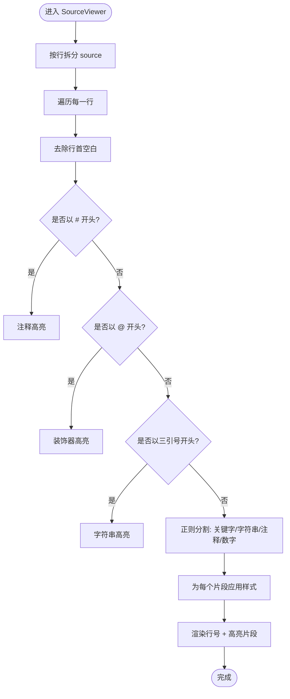
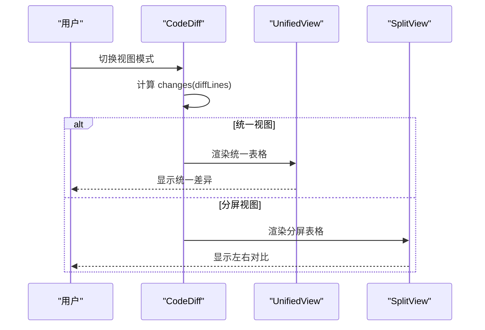
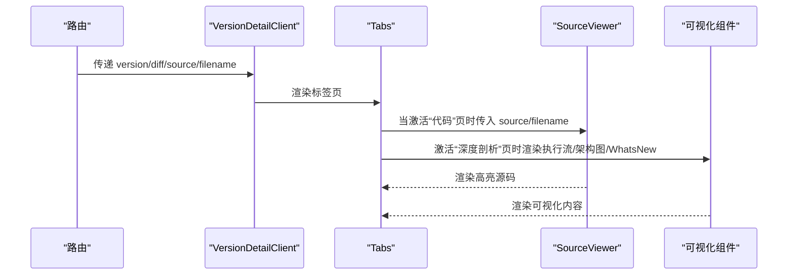
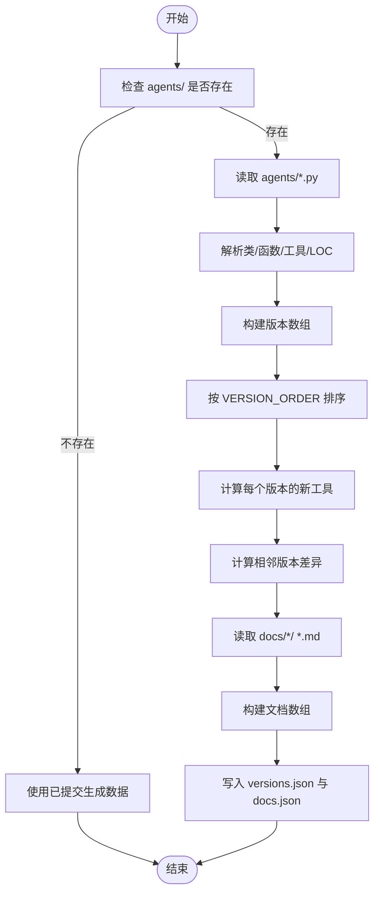
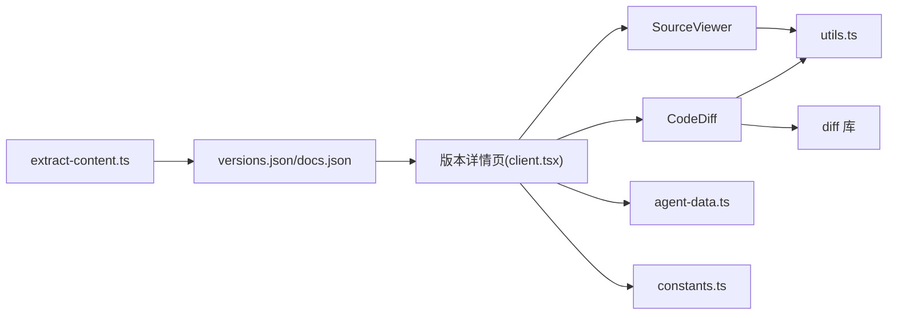

# 代码组件

<cite>
**本文引用的文件**
- [web/src/components/code/source-viewer.tsx](file://web/src/components/code/source-viewer.tsx)
- [web/src/components/diff/code-diff.tsx](file://web/src/components/diff/code-diff.tsx)
- [web/src/app/[locale]/(learn)/[version]/client.tsx](file://web/src/app/[locale]/(learn)/[version]/client.tsx)
- [web/scripts/extract-content.ts](file://web/scripts/extract-content.ts)
- [web/src/types/agent-data.ts](file://web/src/types/agent-data.ts)
- [web/src/lib/constants.ts](file://web/src/lib/constants.ts)
- [web/src/lib/utils.ts](file://web/src/lib/utils.ts)
- [web/src/data/generated/versions.json](file://web/src/data/generated/versions.json)
- [web/src/data/generated/docs.json](file://web/src/data/generated/docs.json)
- [web/package.json](file://web/package.json)
- [agents/s01_agent_loop.py](file://agents/s01_agent_loop.py)
- [agents/s02_tool_use.py](file://agents/s02_tool_use.py)
</cite>

## 目录
1. [简介](#简介)
2. [项目结构](#项目结构)
3. [核心组件](#核心组件)
4. [架构总览](#架构总览)
5. [详细组件分析](#详细组件分析)
6. [依赖分析](#依赖分析)
7. [性能考虑](#性能考虑)
8. [故障排查指南](#故障排查指南)
9. [结论](#结论)
10. [附录](#附录)

## 简介
本文件围绕“代码组件”展开，系统性阐述源码查看器的设计与实现、代码提取脚本的工作原理、与可视化系统的集成方式（实时更新、版本对比、差异展示），并提供开发指南（解析算法、性能优化、缓存机制）。文档还结合项目中的代理实现细节，帮助读者通过代码组件深入理解代理的演进过程与关键机制。

## 项目结构
该项目采用前端 Next.js 应用与后端数据生成脚本相结合的方式：
- 前端位于 web/ 目录，包含 React 组件、类型定义、样式与构建脚本。
- 数据生成脚本位于 web/scripts/extract-content.ts，负责从 agents/ 与 docs/ 目录抽取源码与文档元数据，生成 web/src/data/generated 下的 JSON 文件。
- agents/ 目录存放代理实现的 Python 源码，按版本编号命名，用于演示代理能力的逐步增强。

图表来源
- [web/src/app/[locale]/(learn)/[version]/client.tsx](file://web/src/app/[locale]/(learn)/[version]/client.tsx#L1-L83)
- [web/src/components/code/source-viewer.tsx:1-103](file://web/src/components/code/source-viewer.tsx#L1-L103)
- [web/src/components/diff/code-diff.tsx:1-206](file://web/src/components/diff/code-diff.tsx#L1-L206)
- [web/scripts/extract-content.ts:1-282](file://web/scripts/extract-content.ts#L1-L282)
- [web/src/types/agent-data.ts:1-73](file://web/src/types/agent-data.ts#L1-L73)
- [web/src/lib/constants.ts:1-38](file://web/src/lib/constants.ts#L1-L38)
- [web/src/lib/utils.ts:1-4](file://web/src/lib/utils.ts#L1-L4)
- [web/src/data/generated/versions.json:1-200](file://web/src/data/generated/versions.json#L1-L200)
- [web/src/data/generated/docs.json:1-156](file://web/src/data/generated/docs.json#L1-L156)

章节来源
- [web/src/app/[locale]/(learn)/[version]/client.tsx](file://web/src/app/[locale]/(learn)/[version]/client.tsx#L1-L83)
- [web/scripts/extract-content.ts:1-282](file://web/scripts/extract-content.ts#L1-L282)

## 核心组件
- 源码查看器(SourceViewer)
  - 功能：在页面中渲染 Python 源码，提供行号、语法高亮、注释与关键字着色。
  - 实现要点：按行拆分、正则匹配关键字/字符串/数字/注释；根据行首特征（如 #、@、三引号）进行语义高亮；使用 useMemo 缓存行数组。
- 代码差异展示(CodeDiff)
  - 功能：对比两段源码，支持统一视图与分屏视图，标注新增/删除/上下文行。
  - 实现要点：基于 diff 库计算变更；根据视图模式渲染表格；行号与颜色区分。
- 版本详情客户端页面
  - 功能：承载“学习/仿真/代码/深度剖析”四个标签页，其中“代码”页使用 SourceViewer 展示当前版本源码。
- 数据生成脚本
  - 功能：从 agents/ 与 docs/ 目录抽取版本元数据、工具、类、函数、文档标题与内容，生成 versions.json 与 docs.json。
- 类型与常量
  - 功能：定义 AgentVersion、VersionDiff、DocContent 等类型，以及版本顺序、学习路径、图层等常量。

章节来源
- [web/src/components/code/source-viewer.tsx:1-103](file://web/src/components/code/source-viewer.tsx#L1-L103)
- [web/src/components/diff/code-diff.tsx:1-206](file://web/src/components/diff/code-diff.tsx#L1-L206)
- [web/src/app/[locale]/(learn)/[version]/client.tsx](file://web/src/app/[locale]/(learn)/[version]/client.tsx#L1-L83)
- [web/src/types/agent-data.ts:1-73](file://web/src/types/agent-data.ts#L1-L73)
- [web/src/lib/constants.ts:1-38](file://web/src/lib/constants.ts#L1-L38)

## 架构总览
前端通过 Next.js 页面加载生成数据，SourceViewer 与 CodeDiff 组件消费这些数据，实现“源码查看 + 差异对比”的可视化体验。数据生成脚本在开发与构建前自动执行，确保页面渲染所需的数据可用。

图表来源
- [web/scripts/extract-content.ts:119-282](file://web/scripts/extract-content.ts#L119-L282)
- [web/package.json:5-12](file://web/package.json#L5-L12)
- [web/src/app/[locale]/(learn)/[version]/client.tsx](file://web/src/app/[locale]/(learn)/[version]/client.tsx#L28-L82)
- [web/src/data/generated/versions.json:1-200](file://web/src/data/generated/versions.json#L1-L200)
- [web/src/data/generated/docs.json:1-156](file://web/src/data/generated/docs.json#L1-L156)

## 详细组件分析

### 源码查看器组件分析
- 设计原则
  - 专注阅读体验：行号、等宽字体、浅色背景、暗色主题适配。
  - 语法高亮：基于行内正则识别关键字、字符串、注释、数字；对特殊行首进行语义高亮。
  - 性能优化：使用 useMemo 缓存 lines，避免不必要的重渲染。
- 关键实现点
  - 行内高亮：highlightLine 将每行拆分为多个片段，分别应用不同样式。
  - 行首特征：对以 #、@、三引号开头的行进行特殊高亮。
  - 关键字集合：预定义 Python 关键字集合，命中时应用蓝色强调。
  - 数字与字符串：使用正则识别数字与字符串字面量，分别高亮。
  - 自适应样式：根据主题切换明暗模式。
- 使用场景
  - 在“代码”标签页展示当前版本源码。
  - 与文档渲染、仿真器、架构图等并列展示，便于对照理解。

图表来源
- [web/src/components/code/source-viewer.tsx:10-69](file://web/src/components/code/source-viewer.tsx#L10-L69)

章节来源
- [web/src/components/code/source-viewer.tsx:1-103](file://web/src/components/code/source-viewer.tsx#L1-L103)

### 代码差异展示组件分析
- 设计原则
  - 双视图：统一视图紧凑展示，分屏视图清晰对比左右差异。
  - 交互：支持切换视图模式，按钮状态随当前模式变化。
  - 可读性：新增/删除/上下文行使用不同颜色与标记。
- 关键实现点
  - 变更计算：使用 diff 库按行比较，得到 Change 列表。
  - 统一视图：合并左右侧行，左侧显示旧行号，右侧显示新行号，用符号标识增删。
  - 分屏视图：左右两列分别渲染，尝试对齐相同上下文，空槽填充“空”单元格。
  - 行号与样式：根据类型设置行号、颜色与文本样式。
- 使用场景
  - 在“深度剖析”标签页展示版本间差异。
  - 与“WhatsNew”组件配合，突出新增类、函数、工具与 LOC 变化。

图表来源
- [web/src/components/diff/code-diff.tsx:14-60](file://web/src/components/diff/code-diff.tsx#L14-L60)
- [web/src/components/diff/code-diff.tsx:62-120](file://web/src/components/diff/code-diff.tsx#L62-L120)
- [web/src/components/diff/code-diff.tsx:122-206](file://web/src/components/diff/code-diff.tsx#L122-L206)

章节来源
- [web/src/components/diff/code-diff.tsx:1-206](file://web/src/components/diff/code-diff.tsx#L1-L206)

### 版本详情客户端页面与代码组件集成
- 设计原则
  - 标签页布局：学习、仿真、代码、深度剖析四类内容。
  - 代码页：直接渲染 SourceViewer，并传入 source 与 filename。
  - 深度剖析：展示执行流程、架构图、新增项与设计决策。
- 关键实现点
  - 从路由参数与生成数据中获取版本、差异、源码与文件名。
  - Tabs 组件切换活动页，代码页直接挂载 SourceViewer。
  - 与可视化组件（执行流、架构图、WhatsNew）协同展示。

图表来源
- [web/src/app/[locale]/(learn)/[version]/client.tsx](file://web/src/app/[locale]/(learn)/[version]/client.tsx#L28-L82)

章节来源
- [web/src/app/[locale]/(learn)/[version]/client.tsx](file://web/src/app/[locale]/(learn)/[version]/client.tsx#L1-L83)

### 代码提取脚本工作原理
- 目标
  - 从 agents/ 与 docs/ 目录抽取版本元数据、工具、类、函数、文档标题与内容，生成 versions.json 与 docs.json。
- 关键流程
  - 路径解析：定位 agents/、docs/、生成输出目录。
  - 版本识别：从文件名推导版本 ID，过滤 s_full.py 与 __init__.py。
  - 源码解析：读取 Python 源码，按行提取类定义范围、顶层函数签名、工具名称（通过字面量匹配）、统计非注释/空行数量。
  - 文档解析：按 locale 子目录读取 md 文件，提取版本与标题。
  - 差异计算：基于相邻版本计算新增类、函数、工具与 LOC 变化。
  - 输出：写入 versions.json 与 docs.json。
- 性能与健壮性
  - 仅在源目录存在时执行抽取，否则跳过并使用已提交的生成数据。
  - 使用 Set 去重工具名，避免重复统计。
  - 严格按 VERSION_ORDER 排序，保证学习路径一致性。

图表来源
- [web/scripts/extract-content.ts:119-282](file://web/scripts/extract-content.ts#L119-L282)

章节来源
- [web/scripts/extract-content.ts:1-282](file://web/scripts/extract-content.ts#L1-L282)
- [web/src/types/agent-data.ts:1-73](file://web/src/types/agent-data.ts#L1-L73)
- [web/src/lib/constants.ts:1-38](file://web/src/lib/constants.ts#L1-L38)

### 与可视化系统的集成
- 实时代码更新
  - 通过 Next.js 的页面渲染机制，版本详情页在加载时读取生成数据，SourceViewer 以 props 形式接收 source 与 filename，实现“所见即所得”的实时展示。
- 版本对比与差异展示
  - CodeDiff 组件消费版本差异数据，支持统一/分屏视图，直观呈现新增类、函数、工具与 LOC 变化。
- 与文档/仿真/架构图联动
  - 版本详情页的 Tabs 将“代码”与其他可视化内容并列，便于对照理解代理实现的演进。

章节来源
- [web/src/app/[locale]/(learn)/[version]/client.tsx](file://web/src/app/[locale]/(learn)/[version]/client.tsx#L28-L82)
- [web/src/components/diff/code-diff.tsx:14-60](file://web/src/components/diff/code-diff.tsx#L14-L60)
- [web/src/data/generated/versions.json:1-200](file://web/src/data/generated/versions.json#L1-L200)
- [web/src/data/generated/docs.json:1-156](file://web/src/data/generated/docs.json#L1-L156)

## 依赖分析
- 组件依赖
  - SourceViewer 依赖 React 的 useMemo；与 utils.ts 的 cn 工具函数配合。
  - CodeDiff 依赖 diff 库进行行级差异计算；依赖 utils.ts 的 cn。
  - 版本详情页依赖 SourceViewer、CodeDiff 以及其他可视化组件。
- 数据依赖
  - 生成数据来源于 extract-content.ts；类型定义来自 agent-data.ts；常量来自 constants.ts。
- 构建与脚本
  - package.json 中定义了 extract、predev、prebuild 等脚本，确保在开发与构建前执行数据抽取。

图表来源
- [web/src/components/code/source-viewer.tsx:1-103](file://web/src/components/code/source-viewer.tsx#L1-L103)
- [web/src/components/diff/code-diff.tsx:1-206](file://web/src/components/diff/code-diff.tsx#L1-L206)
- [web/src/app/[locale]/(learn)/[version]/client.tsx](file://web/src/app/[locale]/(learn)/[version]/client.tsx#L1-L83)
- [web/src/lib/utils.ts:1-4](file://web/src/lib/utils.ts#L1-L4)
- [web/scripts/extract-content.ts:1-282](file://web/scripts/extract-content.ts#L1-L282)
- [web/src/types/agent-data.ts:1-73](file://web/src/types/agent-data.ts#L1-L73)
- [web/src/lib/constants.ts:1-38](file://web/src/lib/constants.ts#L1-L38)
- [web/package.json:5-12](file://web/package.json#L5-L12)

章节来源
- [web/package.json:5-12](file://web/package.json#L5-L12)

## 性能考虑
- 渲染性能
  - SourceViewer 使用 useMemo 缓存 lines，避免每次渲染都重新拆分行，降低重渲染成本。
  - CodeDiff 使用 useMemo 缓存 diff 结果，减少重复计算。
- 数据规模
  - 生成脚本按版本顺序排序，避免无序导致的额外开销。
  - 差异计算仅针对相邻版本，复杂度可控。
- I/O 与缓存
  - 生成脚本在源目录不存在时跳过抽取，直接使用已提交的生成数据，避免不必要的 I/O。
  - 生成数据以 JSON 形式存储，前端按需读取，无需二次解析。

章节来源
- [web/src/components/code/source-viewer.tsx:71-72](file://web/src/components/code/source-viewer.tsx#L71-L72)
- [web/src/components/diff/code-diff.tsx:17-17](file://web/src/components/diff/code-diff.tsx#L17-L17)
- [web/scripts/extract-content.ts:125-131](file://web/scripts/extract-content.ts#L125-L131)

## 故障排查指南
- 无法看到源码高亮
  - 检查 SourceViewer 的 props 是否正确传入 source 与 filename。
  - 确认生成数据 versions.json 是否存在且包含对应版本的 source。
- 差异视图异常
  - 确认传入 oldSource/newSource 是否有效。
  - 检查 diff 库是否正确安装与导入。
- 构建失败或数据缺失
  - 确认 agents/ 与 docs/ 目录是否存在；若不存在，脚本会跳过抽取。
  - 执行 npm run extract 或使用 predev/prebuild 自动抽取。
- 主题样式异常
  - 检查 utils.ts 的 cn 工具函数是否正常拼接样式类。

章节来源
- [web/src/app/[locale]/(learn)/[version]/client.tsx](file://web/src/app/[locale]/(learn)/[version]/client.tsx#L56-L58)
- [web/scripts/extract-content.ts:125-131](file://web/scripts/extract-content.ts#L125-L131)
- [web/package.json:5-12](file://web/package.json#L5-L12)

## 结论
该代码组件体系以“源码查看器 + 差异展示 + 生成数据 + 页面集成”为核心，实现了从源码抽取到可视化展示的完整闭环。通过正则高亮、行级差异计算与标签页布局，用户能够高效理解代理实现的演进路径与关键机制。建议在后续迭代中进一步引入增量更新与缓存策略，以提升大规模源码场景下的渲染性能与交互体验。

## 附录
- 代码示例与使用技巧
  - 在“代码”标签页中，SourceViewer 会自动高亮 Python 关键字、注释与字符串，便于快速定位核心逻辑。
  - 在“深度剖析”标签页中，结合 CodeDiff 的统一/分屏视图，可直观对比版本间的差异。
  - 若需本地调试，可在 agents/ 目录中直接修改 Python 源码，然后执行 npm run extract 更新生成数据，再通过 npm run dev 预览效果。
- 参考文件
  - 示例代理实现：agents/s01_agent_loop.py、agents/s02_tool_use.py
  - 生成数据：web/src/data/generated/versions.json、web/src/data/generated/docs.json

章节来源
- [agents/s01_agent_loop.py:1-121](file://agents/s01_agent_loop.py#L1-L121)
- [agents/s02_tool_use.py:1-151](file://agents/s02_tool_use.py#L1-L151)
- [web/src/data/generated/versions.json:1-200](file://web/src/data/generated/versions.json#L1-L200)
- [web/src/data/generated/docs.json:1-156](file://web/src/data/generated/docs.json#L1-L156)