# 可视化组件

<cite>
**本文引用的文件**
- [web/src/components/visualizations/index.tsx](file://web/src/components/visualizations/index.tsx)
- [web/src/components/visualizations/s01-agent-loop.tsx](file://web/src/components/visualizations/s01-agent-loop.tsx)
- [web/src/components/visualizations/s02-tool-dispatch.tsx](file://web/src/components/visualizations/s02-tool-dispatch.tsx)
- [web/src/components/visualizations/s03-todo-write.tsx](file://web/src/components/visualizations/s03-todo-write.tsx)
- [web/src/components/visualizations/s04-subagent.tsx](file://web/src/components/visualizations/s04-subagent.tsx)
- [web/src/components/visualizations/s05-skill-loading.tsx](file://web/src/components/visualizations/s05-skill-loading.tsx)
- [web/src/components/visualizations/s07-task-system.tsx](file://web/src/components/visualizations/s07-task-system.tsx)
- [web/src/components/visualizations/s08-background-tasks.tsx](file://web/src/components/visualizations/s08-background-tasks.tsx)
- [web/src/components/visualizations/s09-agent-teams.tsx](file://web/src/components/visualizations/s09-agent-teams.tsx)
- [web/src/hooks/useSteppedVisualization.ts](file://web/src/hooks/useSteppedVisualization.ts)
- [web/src/components/visualizations/shared/step-controls.tsx](file://web/src/components/visualizations/shared/step-controls.tsx)
- [web/src/hooks/useDarkMode.ts](file://web/src/hooks/useDarkMode.ts)
- [web/src/app/[locale]/(learn)/[version]/page.tsx](file://web/src/app/[locale]/(learn)/[version]/page.tsx)
- [web/package.json](file://web/package.json)
- [web/src/lib/constants.ts](file://web/src/lib/constants.ts)
</cite>

## 目录
1. [简介](#简介)
2. [项目结构](#项目结构)
3. [核心组件](#核心组件)
4. [架构总览](#架构总览)
5. [详细组件分析](#详细组件分析)
6. [依赖关系分析](#依赖关系分析)
7. [性能考量](#性能考量)
8. [故障排查指南](#故障排查指南)
9. [结论](#结论)
10. [附录：组件开发指南与最佳实践](#附录组件开发指南与最佳实践)

## 简介
本文件系统性梳理了可视化组件体系的设计与实现，重点覆盖：
- 动态导入与懒加载机制（基于 React.lazy/Suspense）
- 懒加载策略与骨架屏占位
- 组件注册模式与路由版本映射
- 各可视化组件的实现原理（代理循环展示、工具分发模拟、任务系统可视化、背景任务并行、团队协作等）
- Framer Motion 动画库在流畅过渡、状态变化与交互反馈中的应用
- 组件开发指南（Props 设计、事件处理、错误边界）
- 通过组件化设计提升用户体验与代码复用性的方法论

## 项目结构
可视化组件位于 web/src/components/visualizations 下，采用“按版本号命名”的模块化组织方式，每个版本对应一个独立组件文件，统一由入口 index.tsx 进行动态导入与注册。

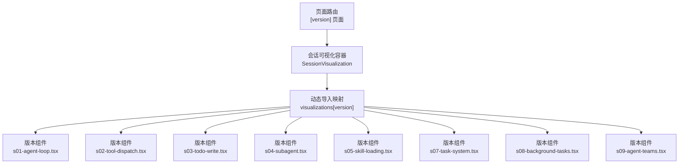

图表来源
- [web/src/components/visualizations/index.tsx:6-22](file://web/src/components/visualizations/index.tsx#L6-L22)
- [web/src/app/[locale]/(learn)/[version]/page.tsx:12-82](file://web/src/app/[locale]/(learn)/[version]/page.tsx#L12-L82)

章节来源
- [web/src/components/visualizations/index.tsx:1-40](file://web/src/components/visualizations/index.tsx#L1-L40)
- [web/src/app/[locale]/(learn)/[version]/page.tsx:12-82](file://web/src/app/[locale]/(learn)/[version]/page.tsx#L12-L82)

## 核心组件
- 动态导入与懒加载注册器：通过一个记录型映射将版本字符串映射到对应的 React Lazy 组件，结合 Suspense 提供骨架屏占位。
- 步进式可视化 Hook：useSteppedVisualization 提供步进控制、自动播放、边界保护等能力，所有版本组件共享。
- 步骤控制控件：StepControls 负责渲染步骤注释、控制按钮与进度指示。
- 深色模式与 SVG 调色板：useDarkMode 与 useSvgPalette 提供主题感知的颜色方案，确保深浅色一致的视觉体验。

章节来源
- [web/src/components/visualizations/index.tsx:6-39](file://web/src/components/visualizations/index.tsx#L6-L39)
- [web/src/hooks/useSteppedVisualization.ts:23-84](file://web/src/hooks/useSteppedVisualization.ts#L23-L84)
- [web/src/components/visualizations/shared/step-controls.tsx:19-102](file://web/src/components/visualizations/shared/step-controls.tsx#L19-L102)
- [web/src/hooks/useDarkMode.ts:39-75](file://web/src/hooks/useDarkMode.ts#L39-L75)

## 架构总览
整体架构围绕“版本化可视化组件 + 公共 Hook + 主题与动画”三层展开，页面层负责版本选择与容器渲染，组件层负责具体演示逻辑与动画，公共层提供一致的交互体验。

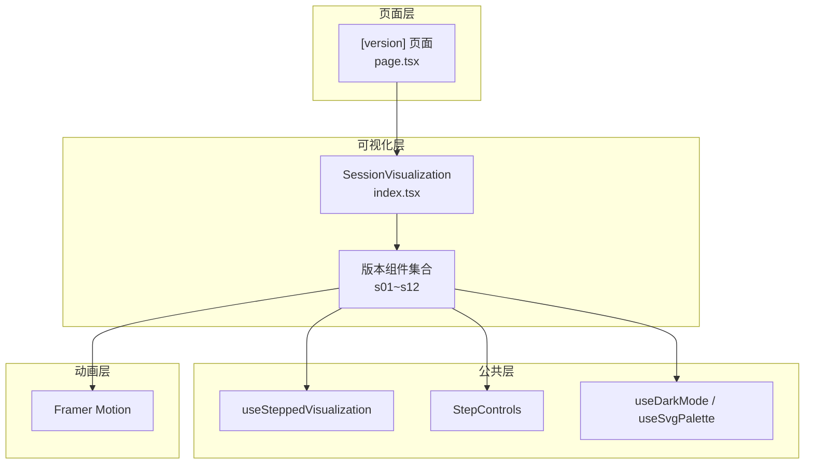

图表来源
- [web/src/app/[locale]/(learn)/[version]/page.tsx:12-82](file://web/src/app/[locale]/(learn)/[version]/page.tsx#L12-L82)
- [web/src/components/visualizations/index.tsx:24-39](file://web/src/components/visualizations/index.tsx#L24-L39)
- [web/src/hooks/useSteppedVisualization.ts:23-84](file://web/src/hooks/useSteppedVisualization.ts#L23-L84)
- [web/src/components/visualizations/shared/step-controls.tsx:19-102](file://web/src/components/visualizations/shared/step-controls.tsx#L19-L102)
- [web/src/hooks/useDarkMode.ts:39-75](file://web/src/hooks/useDarkMode.ts#L39-L75)

## 详细组件分析

### 代理循环展示（s01-agent-loop）
- 数据结构：节点数组、边数组、每步活跃节点/边、消息块序列、步骤说明。
- 动画策略：使用 Framer Motion 的 rect/polygon/path/text 组件进行高亮与颜色过渡；AnimatePresence 配合布局动画展示消息块。
- 交互：StepControls 控制步进，useSteppedVisualization 提供自动播放与边界保护。
- 视觉要点：决策菱形、回环路径、迭代计数提示、深色模式下的滤镜高光。

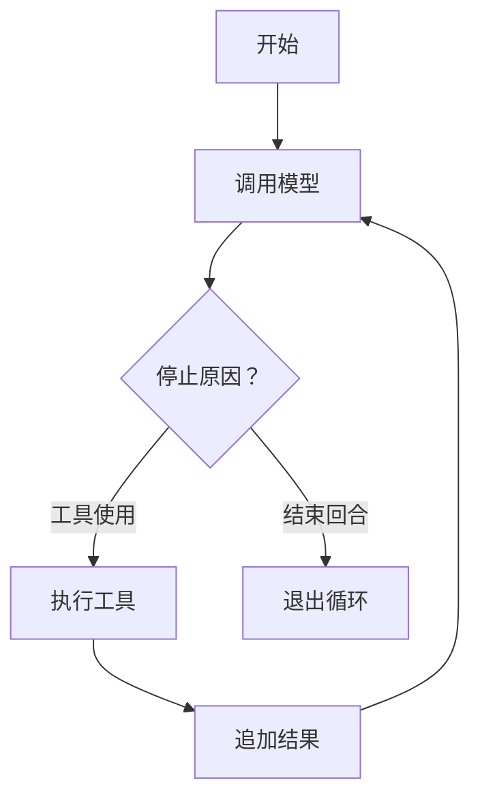

图表来源
- [web/src/components/visualizations/s01-agent-loop.tsx:20-65](file://web/src/components/visualizations/s01-agent-loop.tsx#L20-L65)
- [web/src/components/visualizations/s01-agent-loop.tsx:138-416](file://web/src/components/visualizations/s01-agent-loop.tsx#L138-L416)

章节来源
- [web/src/components/visualizations/s01-agent-loop.tsx:138-416](file://web/src/components/visualizations/s01-agent-loop.tsx#L138-L416)

### 工具分发模拟（s02-tool-dispatch）
- 数据结构：工具定义数组、每步激活工具索引、请求 JSON 片段、步骤说明。
- 动画策略：Dispatcher 方框与工具卡片连线随步骤高亮；代码片段中被激活的键名以动画强调。
- 视觉要点：全路由激活时的“+”可扩展提示；深色模式下的发光滤镜。

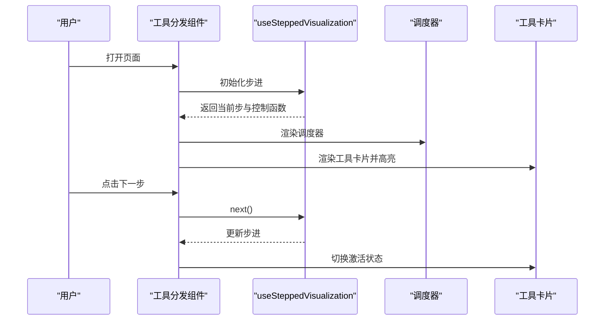

图表来源
- [web/src/components/visualizations/s02-tool-dispatch.tsx:95-380](file://web/src/components/visualizations/s02-tool-dispatch.tsx#L95-L380)
- [web/src/hooks/useSteppedVisualization.ts:23-84](file://web/src/hooks/useSteppedVisualization.ts#L23-L84)

章节来源
- [web/src/components/visualizations/s02-tool-dispatch.tsx:95-380](file://web/src/components/visualizations/s02-tool-dispatch.tsx#L95-L380)

### 待办写入与 Nag 压力（s03-todo-write）
- 数据结构：多步任务状态快照、Nag 计时器阈值、是否触发 Nag。
- 动画策略：任务卡片使用 AnimatePresence + layoutId 实现跨列移动与尺寸变化；Nag 计量条随值变化与触发抖动。
- 视觉要点：三列看板（待办/进行/完成）、任务计数徽标、状态样式区分。

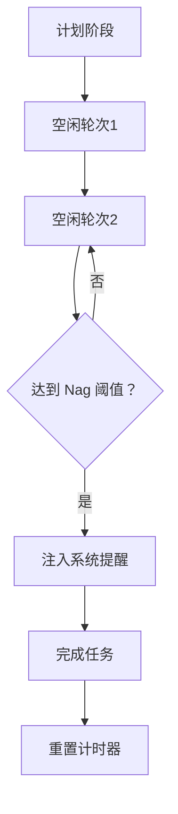

图表来源
- [web/src/components/visualizations/s03-todo-write.tsx:18-86](file://web/src/components/visualizations/s03-todo-write.tsx#L18-L86)
- [web/src/components/visualizations/s03-todo-write.tsx:129-167](file://web/src/components/visualizations/s03-todo-write.tsx#L129-L167)

章节来源
- [web/src/components/visualizations/s03-todo-write.tsx:129-167](file://web/src/components/visualizations/s03-todo-write.tsx#L129-L167)

### 子代理上下文隔离（s04-subagent）
- 数据结构：父进程基础消息、子进程工作消息、摘要块。
- 动画策略：父/子容器在不同步骤显示不同内容；隔离墙在特定步骤出现；消息进入/退出使用位移与透明度过渡。
- 视觉要点：父子消息区隔、隔离标识、摘要压缩提示。

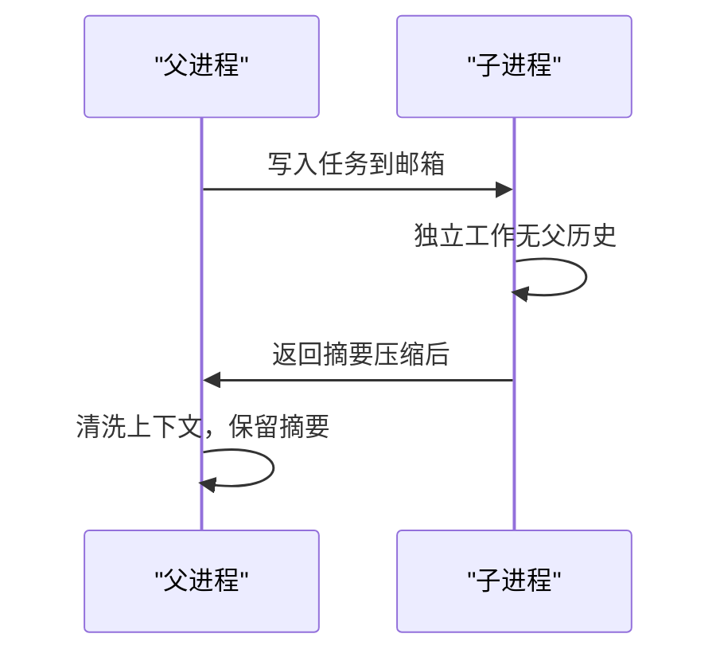

图表来源
- [web/src/components/visualizations/s04-subagent.tsx:69-200](file://web/src/components/visualizations/s04-subagent.tsx#L69-L200)

章节来源
- [web/src/components/visualizations/s04-subagent.tsx:69-200](file://web/src/components/visualizations/s04-subagent.tsx#L69-L200)

### 技能按需加载（s05-skill-loading）
- 数据结构：技能条目（名称、摘要、令牌数、内容）、令牌状态序列。
- 动画策略：系统提示中高亮目标技能；分层注入时内容块淡入；多技能堆叠时强调两层架构。
- 视觉要点：两层架构（摘要常驻 + 详情按需）。

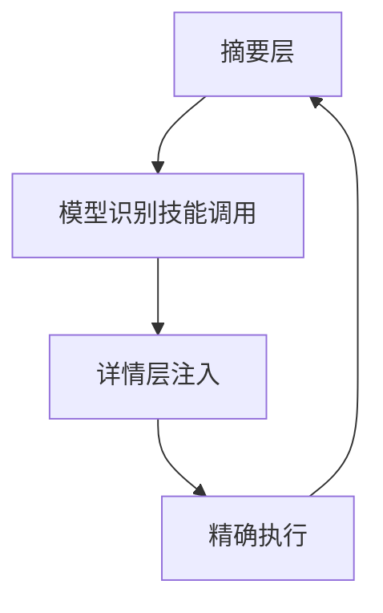

图表来源
- [web/src/components/visualizations/s05-skill-loading.tsx:97-200](file://web/src/components/visualizations/s05-skill-loading.tsx#L97-L200)

章节来源
- [web/src/components/visualizations/s05-skill-loading.tsx:97-200](file://web/src/components/visualizations/s05-skill-loading.tsx#L97-L200)

### 任务依赖图（s07-task-system）
- 数据结构：任务节点、依赖边、每步状态映射、边激活判定。
- 动画策略：依赖边根据状态切换颜色与虚实；节点根据状态应用发光滤镜；阻塞标注在特定步骤出现。
- 视觉要点：曲线边、状态图例、磁盘持久化指示。

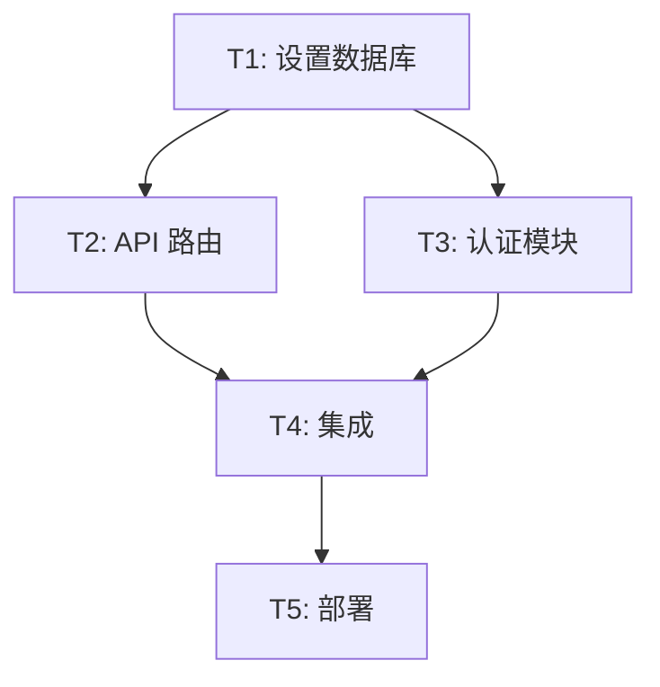

图表来源
- [web/src/components/visualizations/s07-task-system.tsx:24-30](file://web/src/components/visualizations/s07-task-system.tsx#L24-L30)
- [web/src/components/visualizations/s07-task-system.tsx:195-494](file://web/src/components/visualizations/s07-task-system.tsx#L195-L494)

章节来源
- [web/src/components/visualizations/s07-task-system.tsx:195-494](file://web/src/components/visualizations/s07-task-system.tsx#L195-L494)

### 背景任务并行（s08-background-tasks）
- 数据结构：三条轨道（主线程、bg1、bg2）、工作块区间、队列卡片、分叉箭头。
- 动画策略：工作块按步长线性增长；分叉箭头在出现步骤显示；队列卡片在到达与清空步骤之间切换。
- 视觉要点：时间轴、并行轨道、通知队列注入时机。

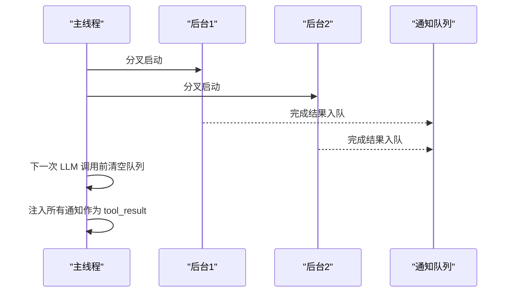

图表来源
- [web/src/components/visualizations/s08-background-tasks.tsx:151-200](file://web/src/components/visualizations/s08-background-tasks.tsx#L151-L200)

章节来源
- [web/src/components/visualizations/s08-background-tasks.tsx:151-200](file://web/src/components/visualizations/s08-background-tasks.tsx#L151-L200)

### 团队协作与邮箱（s09-agent-teams）
- 数据结构：三位代理位置、收件箱文件名、消息轨迹、步骤代理高亮。
- 动画策略：旅行消息从发件人收件箱到收件人收件箱的路径动画；代理在关键步骤高亮与脉冲。
- 视觉要点：三角形团队布局、文件邮箱通信拓扑、反馈链路可视化。

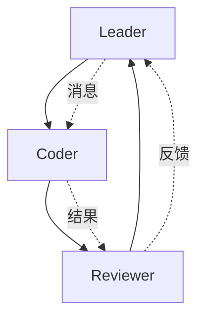

图表来源
- [web/src/components/visualizations/s09-agent-teams.tsx:134-200](file://web/src/components/visualizations/s09-agent-teams.tsx#L134-L200)

章节来源
- [web/src/components/visualizations/s09-agent-teams.tsx:134-200](file://web/src/components/visualizations/s09-agent-teams.tsx#L134-L200)

## 依赖关系分析
- 外部依赖：Framer Motion 用于动画；Lucide React 用于图标；Next.js 用于页面与路由；Tailwind CSS 用于样式。
- 内部依赖：各版本组件共享 useSteppedVisualization、StepControls、useDarkMode/useSvgPalette；入口 index.tsx 统一管理动态导入。

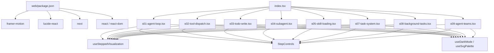

图表来源
- [web/package.json:13-27](file://web/package.json#L13-L27)
- [web/src/components/visualizations/index.tsx:6-22](file://web/src/components/visualizations/index.tsx#L6-L22)

章节来源
- [web/package.json:13-27](file://web/package.json#L13-L27)
- [web/src/components/visualizations/index.tsx:6-22](file://web/src/components/visualizations/index.tsx#L6-L22)

## 性能考量
- 懒加载与骨架屏：通过 React.lazy 与 Suspense 将组件拆分，避免首屏加载大体积资源；骨架屏占位提升感知性能。
- 动画优化：合理设置 transition/duration，避免过度复杂路径动画；仅在必要元素上启用滤镜与阴影。
- 步进控制：useSteppedVisualization 使用防抖与边界保护，避免频繁重渲染；自动播放时及时清理定时器。
- 主题感知：useSvgPalette 在深浅色间切换时减少不必要的 reflow，保持一致的视觉权重。

## 故障排查指南
- 动态导入失败：检查版本字符串与映射键是否一致；确认 Suspense fallback 是否正确渲染。
- 动画异常：检查 Framer Motion 的 animate/initial/exit 配置是否匹配；确认 transition 参数范围合理。
- 步进错乱：核对 useSteppedVisualization 的 totalSteps 与各组件的步骤数一致；确认自动播放定时器在卸载时清理。
- 深色模式不生效：确认 useDarkMode 的 DOM 监听是否正常；检查 useSvgPalette 返回值与组件颜色绑定。

章节来源
- [web/src/components/visualizations/index.tsx:24-39](file://web/src/components/visualizations/index.tsx#L24-L39)
- [web/src/hooks/useSteppedVisualization.ts:55-70](file://web/src/hooks/useSteppedVisualization.ts#L55-L70)
- [web/src/hooks/useDarkMode.ts:5-21](file://web/src/hooks/useDarkMode.ts#L5-L21)

## 结论
该可视化组件系统通过“版本化组件 + 公共 Hook + 主题与动画”三层架构，实现了清晰的职责分离与良好的可维护性。动态导入与懒加载策略显著降低了首屏压力，Framer Motion 的广泛运用带来了流畅且富有表现力的交互体验。组件化的结构便于扩展新的版本与功能，同时保证了跨组件的一致性与可复用性。

## 附录：组件开发指南与最佳实践
- Props 接口设计
  - 明确输入参数与默认值，如标题、版本号等；避免在组件内部做过多的参数推断。
  - 对于需要外部控制的状态（如自动播放），通过回调函数暴露控制能力。
- 事件处理模式
  - 使用受控组件模式，将状态提升至父级或通过自定义 Hook 管理；避免在子组件内直接修改全局状态。
  - 为 StepControls 提供统一的 onPrev/onNext/onReset/onToggleAutoPlay 回调，确保各版本组件行为一致。
- 错误边界处理
  - 在动态导入处包裹 Suspense 并提供骨架屏 fallback；对不可恢复的版本缺失返回友好提示。
  - 对动画异常场景（如 transition 配置错误）提供降级方案（禁用动画或简化效果）。
- 动画与交互
  - 优先使用 Framer Motion 的 animate/initial/exit 组合，配合 AnimatePresence 实现列表与布局切换。
  - 控制动画频率与时长，避免密集动画导致卡顿；对复杂路径动画考虑拆分为多个简单动画。
- 主题与可访问性
  - 使用 useSvgPalette 生成主题色，确保深浅色下对比度与可读性；为关键信息提供语义化标签。
  - 为键盘可访问性提供必要的焦点顺序与替代文本。
- 代码复用与扩展
  - 将通用逻辑抽取为 Hook（如 useSteppedVisualization、useDarkMode）；将通用 UI 抽取为可复用组件（如 StepControls）。
  - 新增版本时遵循现有数据结构与动画风格，保持一致性；通过 constants 中的版本元数据与学习路径统一管理。

章节来源
- [web/src/components/visualizations/shared/step-controls.tsx:19-102](file://web/src/components/visualizations/shared/step-controls.tsx#L19-L102)
- [web/src/hooks/useSteppedVisualization.ts:23-84](file://web/src/hooks/useSteppedVisualization.ts#L23-L84)
- [web/src/hooks/useDarkMode.ts:39-75](file://web/src/hooks/useDarkMode.ts#L39-L75)
- [web/src/lib/constants.ts:1-38](file://web/src/lib/constants.ts#L1-L38)