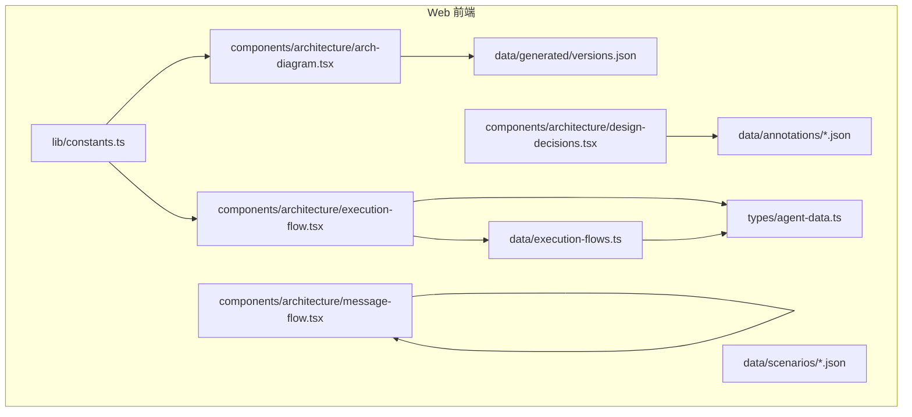
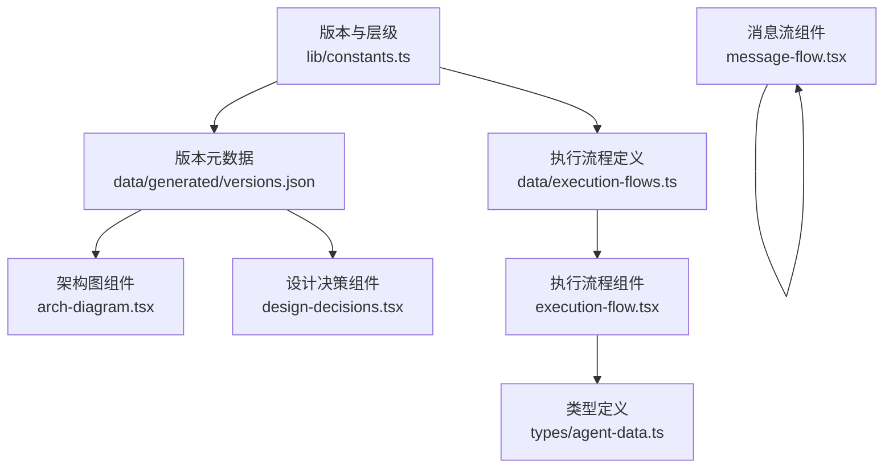
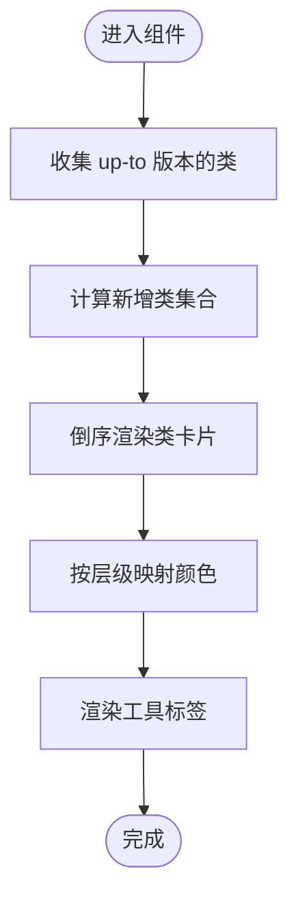
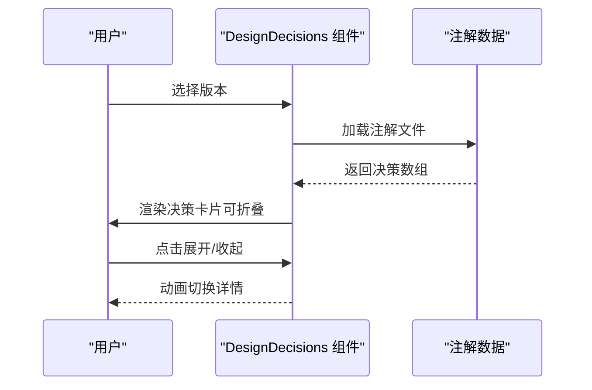
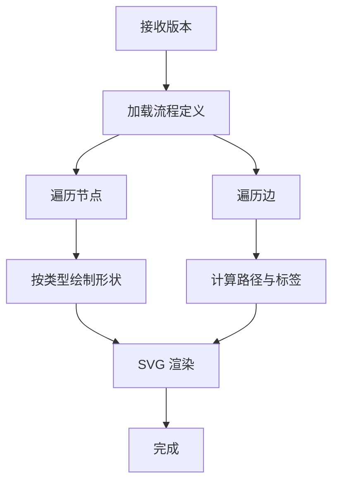
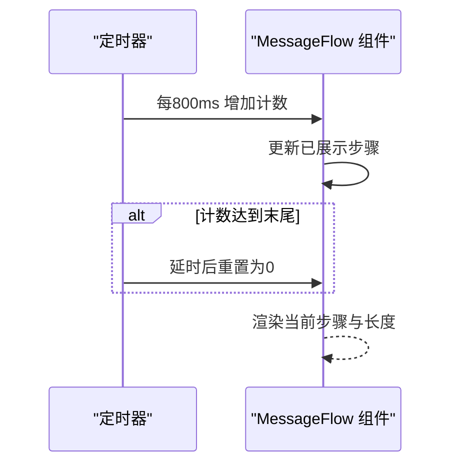
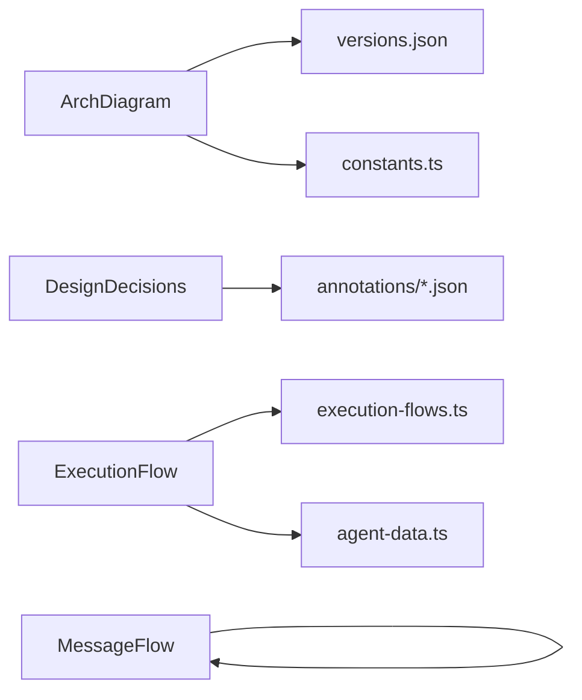

# 架构组件

<cite>
**本文引用的文件**
- [web/src/components/architecture/arch-diagram.tsx](file://web/src/components/architecture/arch-diagram.tsx)
- [web/src/components/architecture/design-decisions.tsx](file://web/src/components/architecture/design-decisions.tsx)
- [web/src/components/architecture/execution-flow.tsx](file://web/src/components/architecture/execution-flow.tsx)
- [web/src/components/architecture/message-flow.tsx](file://web/src/components/architecture/message-flow.tsx)
- [web/src/data/execution-flows.ts](file://web/src/data/execution-flows.ts)
- [web/src/lib/constants.ts](file://web/src/lib/constants.ts)
- [web/src/types/agent-data.ts](file://web/src/types/agent-data.ts)
- [web/src/data/generated/versions.json](file://web/src/data/generated/versions.json)
- [web/src/data/annotations/s01.json](file://web/src/data/annotations/s01.json)
- [web/src/data/annotations/s02.json](file://web/src/data/annotations/s02.json)
- [web/src/data/annotations/s03.json](file://web/src/data/annotations/s03.json)
- [web/src/data/annotations/s04.json](file://web/src/data/annotations/s04.json)
- [web/src/data/annotations/s05.json](file://web/src/data/annotations/s05.json)
- [web/src/data/annotations/s06.json](file://web/src/data/annotations/s06.json)
- [web/src/data/scenarios/s01.json](file://web/src/data/scenarios/s01.json)
</cite>

## 目录
1. [引言](#引言)
2. [项目结构](#项目结构)
3. [核心组件](#核心组件)
4. [架构总览](#架构总览)
5. [详细组件分析](#详细组件分析)
6. [依赖分析](#依赖分析)
7. [性能考量](#性能考量)
8. [故障排查指南](#故障排查指南)
9. [结论](#结论)
10. [附录](#附录)

## 引言
本文件围绕“架构组件”主题，系统化梳理并阐释该代码库中与架构可视化与说明相关的核心前端组件与数据结构，包括：
- 架构图组件：组件演进与版本化展示
- 设计决策组件：技术选型与权衡说明
- 执行流程组件：代理执行序列与状态转换
- 消息流组件：消息类型与异步处理展示
- 架构文档编写指南：图表设计原则、信息层次与可读性优化
目标是帮助开发者快速理解系统整体设计与演进脉络。

## 项目结构
该仓库的“架构组件”主要集中在 Web 前端目录中，通过 React 组件与 TypeScript 类型定义，结合 JSON 数据驱动的方式，实现版本化、可交互的架构可视化与说明。

**图表来源**
- [web/src/components/architecture/arch-diagram.tsx:105-228](file://web/src/components/architecture/arch-diagram.tsx#L105-L228)
- [web/src/components/architecture/design-decisions.tsx:121-147](file://web/src/components/architecture/design-decisions.tsx#L121-L147)
- [web/src/components/architecture/execution-flow.tsx:187-238](file://web/src/components/architecture/execution-flow.tsx#L187-L238)
- [web/src/components/architecture/message-flow.tsx:17-70](file://web/src/components/architecture/message-flow.tsx#L17-L70)
- [web/src/data/execution-flows.ts:13-315](file://web/src/data/execution-flows.ts#L13-L315)
- [web/src/lib/constants.ts:1-38](file://web/src/lib/constants.ts#L1-L38)
- [web/src/types/agent-data.ts:1-73](file://web/src/types/agent-data.ts#L1-L73)
- [web/src/data/generated/versions.json:1-537](file://web/src/data/generated/versions.json#L1-L537)

**章节来源**
- [web/src/lib/constants.ts:1-38](file://web/src/lib/constants.ts#L1-L38)
- [web/src/types/agent-data.ts:1-73](file://web/src/types/agent-data.ts#L1-L73)
- [web/src/data/execution-flows.ts:1-316](file://web/src/data/execution-flows.ts#L1-L316)

## 核心组件
本节聚焦四大架构组件：架构图、设计决策、执行流程、消息流，分别承担“组件演进可视化”“技术选型与权衡”“代理执行序列与状态转换”“消息类型与异步处理”的职责。

- 架构图组件（ArchDiagram）
  - 功能：按版本收集类与工具，展示引入层级与新增类，支持动画与颜色区分。
  - 关键点：版本到层级映射、新增类高亮、工具列表展示。
- 设计决策组件（DesignDecisions）
  - 功能：按版本加载注解，展开卡片式决策说明，支持多语言。
  - 关键点：注解数据结构、本地化标题与描述、折叠动画。
- 执行流程组件（ExecutionFlow）
  - 功能：根据版本渲染流程图节点与边，支持决策/子过程等形状，带箭头与标签。
  - 关键点：节点类型与形状、边路径计算、动画延迟与文本标签。
- 消息流组件（MessageFlow）
  - 功能：循环展示消息类型序列，模拟异步推进。
  - 关键点：固定步骤序列、定时器推进、长度指示器。

**章节来源**
- [web/src/components/architecture/arch-diagram.tsx:105-228](file://web/src/components/architecture/arch-diagram.tsx#L105-L228)
- [web/src/components/architecture/design-decisions.tsx:121-147](file://web/src/components/architecture/design-decisions.tsx#L121-L147)
- [web/src/components/architecture/execution-flow.tsx:187-238](file://web/src/components/architecture/execution-flow.tsx#L187-L238)
- [web/src/components/architecture/message-flow.tsx:17-70](file://web/src/components/architecture/message-flow.tsx#L17-L70)

## 架构总览
架构组件通过“版本-数据-组件”的三层协作实现可视化：
- 版本与层级：常量模块定义版本顺序、元信息与分层。
- 数据驱动：版本元数据、注解与执行流程数据提供结构化输入。
- 组件渲染：React 组件消费数据，生成可视化与交互体验。

**图表来源**
- [web/src/lib/constants.ts:9-38](file://web/src/lib/constants.ts#L9-L38)
- [web/src/data/generated/versions.json:1-537](file://web/src/data/generated/versions.json#L1-L537)
- [web/src/data/execution-flows.ts:13-315](file://web/src/data/execution-flows.ts#L13-L315)
- [web/src/types/agent-data.ts:60-72](file://web/src/types/agent-data.ts#L60-L72)
- [web/src/components/architecture/arch-diagram.tsx:105-228](file://web/src/components/architecture/arch-diagram.tsx#L105-L228)
- [web/src/components/architecture/design-decisions.tsx:121-147](file://web/src/components/architecture/design-decisions.tsx#L121-L147)
- [web/src/components/architecture/execution-flow.tsx:187-238](file://web/src/components/architecture/execution-flow.tsx#L187-L238)
- [web/src/components/architecture/message-flow.tsx:17-70](file://web/src/components/architecture/message-flow.tsx#L17-L70)

## 详细组件分析

### 架构图组件（ArchDiagram）
- 组件职责
  - 收集指定版本之前的所有类，按引入顺序倒序渲染。
  - 标记新增类（NEW 标签），按版本所属层级设置边框与背景色。
  - 展示版本工具清单。
- 关键算法
  - 版本排序与定位：依据版本顺序数组定位目标版本索引。
  - 新类判定：比较 diff 中的新增类集合。
  - 层级颜色：根据版本元信息映射到 LAYERS 颜色。
- 可视化要点
  - 动画：垂直方向渐显，箭头与类卡片逐个入场。
  - 新增高亮：边框与背景色强调新引入类。
  - 工具标签：工具名以标签形式展示。

**图表来源**
- [web/src/components/architecture/arch-diagram.tsx:71-103](file://web/src/components/architecture/arch-diagram.tsx#L71-L103)
- [web/src/lib/constants.ts:31-37](file://web/src/lib/constants.ts#L31-L37)

**章节来源**
- [web/src/components/architecture/arch-diagram.tsx:105-228](file://web/src/components/architecture/arch-diagram.tsx#L105-L228)
- [web/src/lib/constants.ts:31-37](file://web/src/lib/constants.ts#L31-L37)
- [web/src/data/generated/versions.json:1-537](file://web/src/data/generated/versions.json#L1-L537)

### 设计决策组件（DesignDecisions）
- 组件职责
  - 加载对应版本的注解数据，渲染决策卡片。
  - 支持多语言标题与描述，折叠展开详情。
- 关键逻辑
  - 注解映射：按版本字符串映射到注解文件。
  - 本地化：根据当前语言选择 zh/ja 字段。
  - 动画：展开/收起使用高度过渡与图标旋转。

**图表来源**
- [web/src/components/architecture/design-decisions.tsx:121-147](file://web/src/components/architecture/design-decisions.tsx#L121-L147)
- [web/src/data/annotations/s01.json:1-48](file://web/src/data/annotations/s01.json#L1-L48)
- [web/src/data/annotations/s02.json:1-48](file://web/src/data/annotations/s02.json#L1-L48)
- [web/src/data/annotations/s03.json:1-48](file://web/src/data/annotations/s03.json#L1-L48)
- [web/src/data/annotations/s04.json:1-48](file://web/src/data/annotations/s04.json#L1-L48)
- [web/src/data/annotations/s05.json:1-48](file://web/src/data/annotations/s05.json#L1-L48)
- [web/src/data/annotations/s06.json:1-62](file://web/src/data/annotations/s06.json#L1-L62)

**章节来源**
- [web/src/components/architecture/design-decisions.tsx:121-147](file://web/src/components/architecture/design-decisions.tsx#L121-L147)
- [web/src/data/annotations/s01.json:1-48](file://web/src/data/annotations/s01.json#L1-L48)
- [web/src/data/annotations/s02.json:1-48](file://web/src/data/annotations/s02.json#L1-L48)
- [web/src/data/annotations/s03.json:1-48](file://web/src/data/annotations/s03.json#L1-L48)
- [web/src/data/annotations/s04.json:1-48](file://web/src/data/annotations/s04.json#L1-L48)
- [web/src/data/annotations/s05.json:1-48](file://web/src/data/annotations/s05.json#L1-L48)
- [web/src/data/annotations/s06.json:1-62](file://web/src/data/annotations/s06.json#L1-L62)

### 执行流程组件（ExecutionFlow）
- 组件职责
  - 根据版本获取流程定义，渲染节点与边，支持决策/子过程/开始/结束等形状。
  - 边路径计算与标签展示，节点与边带入场动画。
- 关键算法
  - 节点中心与边路径：根据节点坐标与类型计算路径，保证垂直对齐。
  - 形状绘制：矩形（处理/子过程）、菱形（决策）、椭圆（开始/结束）。
  - 动画：节点与边按序入场，边带箭头与标签延迟出现。

**图表来源**
- [web/src/components/architecture/execution-flow.tsx:187-238](file://web/src/components/architecture/execution-flow.tsx#L187-L238)
- [web/src/data/execution-flows.ts:13-315](file://web/src/data/execution-flows.ts#L13-L315)
- [web/src/types/agent-data.ts:60-72](file://web/src/types/agent-data.ts#L60-L72)

**章节来源**
- [web/src/components/architecture/execution-flow.tsx:187-238](file://web/src/components/architecture/execution-flow.tsx#L187-L238)
- [web/src/data/execution-flows.ts:13-315](file://web/src/data/execution-flows.ts#L13-L315)
- [web/src/types/agent-data.ts:60-72](file://web/src/types/agent-data.ts#L60-L72)

### 消息流组件（MessageFlow）
- 组件职责
  - 循环展示消息类型序列，模拟异步推进与长度变化。
- 关键逻辑
  - 固定步骤序列：user → assistant → tool_call → tool_result → assistant …
  - 定时器推进：每 800ms 前进一步，到达末尾后延时重置。
  - 长度指示器：实时显示当前消息数量。

**图表来源**
- [web/src/components/architecture/message-flow.tsx:17-70](file://web/src/components/architecture/message-flow.tsx#L17-L70)

**章节来源**
- [web/src/components/architecture/message-flow.tsx:17-70](file://web/src/components/architecture/message-flow.tsx#L17-L70)

## 依赖分析
- 组件到数据
  - ArchDiagram 依赖版本元数据与层级常量。
  - DesignDecisions 依赖注解 JSON。
  - ExecutionFlow 依赖执行流程定义与类型定义。
  - MessageFlow 为纯前端组件，无外部依赖。
- 数据到类型
  - 执行流程数据与类型定义共同约束节点与边结构。
- 版本到层级
  - 常量模块提供版本顺序与层级映射，贯穿多个组件。

**图表来源**
- [web/src/components/architecture/arch-diagram.tsx:105-228](file://web/src/components/architecture/arch-diagram.tsx#L105-L228)
- [web/src/components/architecture/design-decisions.tsx:121-147](file://web/src/components/architecture/design-decisions.tsx#L121-L147)
- [web/src/components/architecture/execution-flow.tsx:187-238](file://web/src/components/architecture/execution-flow.tsx#L187-L238)
- [web/src/components/architecture/message-flow.tsx:17-70](file://web/src/components/architecture/message-flow.tsx#L17-L70)
- [web/src/data/generated/versions.json:1-537](file://web/src/data/generated/versions.json#L1-L537)
- [web/src/lib/constants.ts:1-38](file://web/src/lib/constants.ts#L1-L38)
- [web/src/data/execution-flows.ts:13-315](file://web/src/data/execution-flows.ts#L13-L315)
- [web/src/types/agent-data.ts:60-72](file://web/src/types/agent-data.ts#L60-L72)

**章节来源**
- [web/src/lib/constants.ts:1-38](file://web/src/lib/constants.ts#L1-L38)
- [web/src/types/agent-data.ts:60-72](file://web/src/types/agent-data.ts#L60-L72)
- [web/src/data/execution-flows.ts:13-315](file://web/src/data/execution-flows.ts#L13-L315)

## 性能考量
- 渲染性能
  - 动画入场：组件普遍使用逐元素动画，建议在大量节点/类时控制动画延迟与数量，避免卡顿。
  - SVG 渲染：执行流程组件使用 SVG，节点与边数量较多时注意重排与重绘开销。
- 数据规模
  - 版本元数据与注解数据体量较小，渲染影响有限；执行流程定义按版本拆分，按需加载。
- 交互响应
  - 消息流组件使用定时器推进，建议在组件卸载时清理定时器，避免内存泄漏。

[本节为通用指导，无需具体文件分析]

## 故障排查指南
- 架构图无类展示
  - 检查版本是否包含 classes 字段；确认版本顺序与层级映射正确。
- 设计决策为空
  - 检查注解文件是否存在对应版本字段；确认本地化字段是否齐全。
- 执行流程不显示
  - 检查版本是否存在于执行流程定义；核对节点/边结构与类型。
- 消息流不推进
  - 检查定时器是否正常启动与清理；确认步骤数组长度与计数逻辑。

**章节来源**
- [web/src/components/architecture/arch-diagram.tsx:203-207](file://web/src/components/architecture/arch-diagram.tsx#L203-L207)
- [web/src/components/architecture/design-decisions.tsx:125-128](file://web/src/components/architecture/design-decisions.tsx#L125-L128)
- [web/src/components/architecture/execution-flow.tsx:194-194](file://web/src/components/architecture/execution-flow.tsx#L194-L194)
- [web/src/components/architecture/message-flow.tsx:31-34](file://web/src/components/architecture/message-flow.tsx#L31-L34)

## 结论
通过架构图、设计决策、执行流程与消息流四个组件，系统实现了从“组件演进”“技术选型”“执行序列”“消息类型”的多维度可视化与说明。组件间通过版本与数据驱动形成清晰的协作关系，既便于开发者理解整体设计，也为后续扩展提供了稳定基础。

[本节为总结性内容，无需具体文件分析]

## 附录
- 架构文档编写指南
  - 图表设计原则
    - 一致性：颜色、形状、字体与间距统一。
    - 分层表达：用颜色与边框区分层级，突出新增与变更。
    - 可读性：标签简洁、箭头清晰、布局合理。
  - 信息层次组织
    - 先全局后细节：先展示版本与层级，再呈现具体组件与流程。
    - 对齐数据源：组件与数据一一对应，避免信息漂移。
  - 可读性优化
    - 动画适度：逐元素入场增强体验，避免密集动画造成眩晕。
    - 文案本地化：支持多语言，确保标题与描述一致。
    - 错误兜底：空状态友好提示，加载状态明确。

[本节为通用指导，无需具体文件分析]