# 核心组件系统

<cite>
**本文档引用的文件**
- [web/src/components/simulator/agent-loop-simulator.tsx](file://web/src/components/simulator/agent-loop-simulator.tsx)
- [web/src/components/simulator/simulator-controls.tsx](file://web/src/components/simulator/simulator-controls.tsx)
- [web/src/components/simulator/simulator-message.tsx](file://web/src/components/simulator/simulator-message.tsx)
- [web/src/hooks/useSimulator.ts](file://web/src/hooks/useSimulator.ts)
- [web/src/components/architecture/arch-diagram.tsx](file://web/src/components/architecture/arch-diagram.tsx)
- [web/src/components/code/source-viewer.tsx](file://web/src/components/code/source-viewer.tsx)
- [web/src/components/visualizations/index.tsx](file://web/src/components/visualizations/index.tsx)
- [web/src/components/visualizations/s01-agent-loop.tsx](file://web/src/components/visualizations/s01-agent-loop.tsx)
- [web/src/components/visualizations/shared/step-controls.tsx](file://web/src/components/visualizations/shared/step-controls.tsx)
- [web/src/hooks/useSteppedVisualization.ts](file://web/src/hooks/useSteppedVisualization.ts)
- [web/src/tabs.tsx](file://web/src/tabs.tsx)
- [web/src/types/agent-data.ts](file://web/src/types/agent-data.ts)
- [web/src/lib/constants.ts](file://web/src/lib/constants.ts)
- [web/src/data/generated/versions.json](file://web/src/data/generated/versions.json)
- [web/src/app/[locale]/(learn)/[version]/page.tsx](file://web/src/app/[locale]/(learn)/[version]/page.tsx)
- [web/package.json](file://web/package.json)
</cite>

## 目录
1. [引言](#引言)
2. [项目结构](#项目结构)
3. [核心组件](#核心组件)
4. [架构概览](#架构概览)
5. [详细组件分析](#详细组件分析)
6. [依赖关系分析](#依赖关系分析)
7. [性能考虑](#性能考虑)
8. [故障排除指南](#故障排除指南)
9. [结论](#结论)
10. [附录](#附录)

## 引言

Learn Claude Code 是一个基于 Next.js 的教育型可视化学习平台，专注于展示 Claude AI 代码代理的发展历程。该项目通过精心设计的组件系统，为用户提供了一个沉浸式的交互式学习体验，涵盖了从基础代理循环到复杂多智能体协作的完整技术栈。

该平台的核心价值在于其创新的可视化组件设计，包括代理循环模拟器、架构图展示、代码查看器等，这些组件共同构建了一个强大的教学工具生态系统。通过 Framer Motion 动画库的应用，实现了流畅的过渡效果和丰富的交互反馈，显著提升了用户体验。

## 项目结构

项目采用模块化的前端架构，主要分为以下几个核心区域：

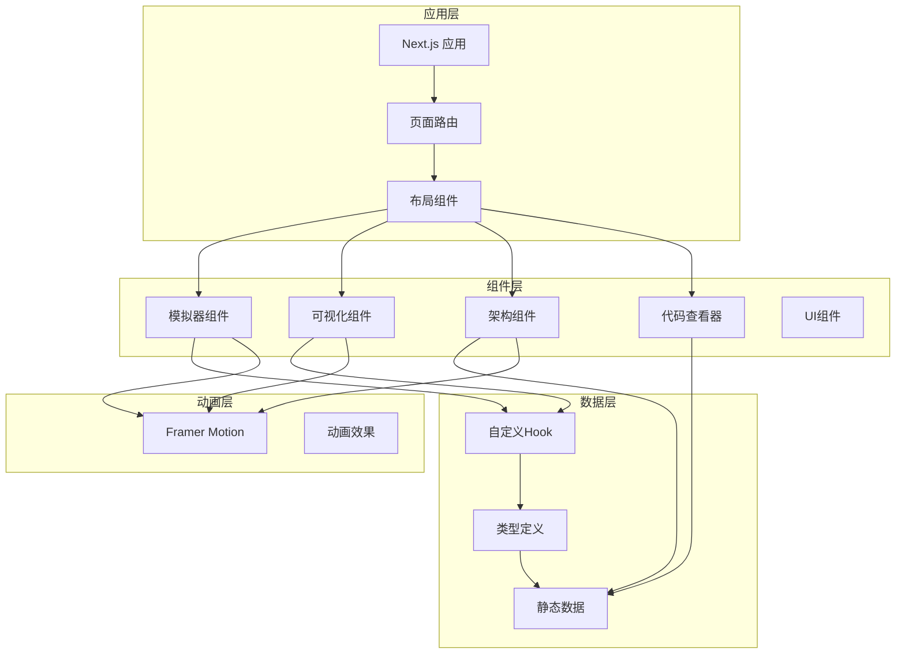

**图表来源**
- [web/src/app/[locale]/(learn)/[version]/page.tsx](file://web/src/app/[locale]/(learn)/[version]/page.tsx#L1-L126)
- [web/src/components/simulator/agent-loop-simulator.tsx:1-97](file://web/src/components/simulator/agent-loop-simulator.tsx#L1-L97)

**章节来源**
- [web/src/app/[locale]/(learn)/[version]/page.tsx](file://web/src/app/[locale]/(learn)/[version]/page.tsx#L1-L126)
- [web/package.json:1-39](file://web/package.json#L1-L39)

## 核心组件

### 代理循环模拟器系统

代理循环模拟器是整个平台的核心组件之一，它提供了对 Claude 代理发展历程的动态演示。该系统由三个主要部分组成：模拟器容器、控制面板和消息显示组件。

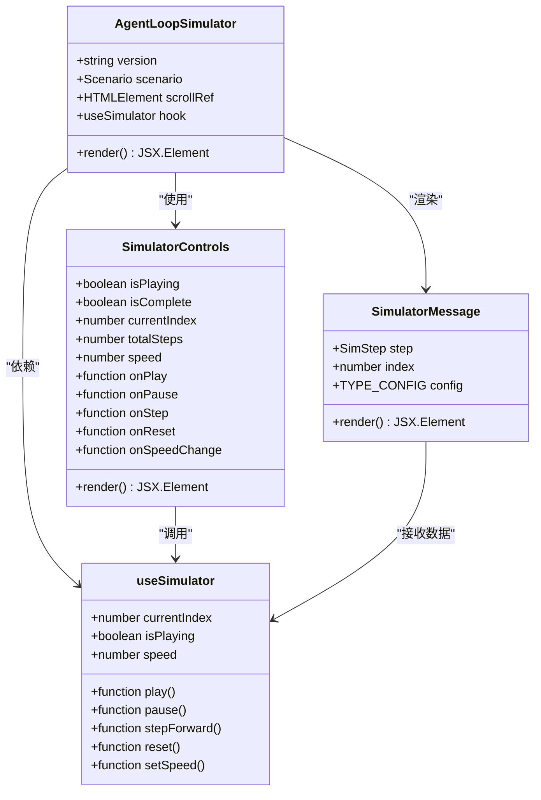

**图表来源**
- [web/src/components/simulator/agent-loop-simulator.tsx:26-97](file://web/src/components/simulator/agent-loop-simulator.tsx#L26-L97)
- [web/src/components/simulator/simulator-controls.tsx:7-100](file://web/src/components/simulator/simulator-controls.tsx#L7-L100)
- [web/src/components/simulator/simulator-message.tsx:8-94](file://web/src/components/simulator/simulator-message.tsx#L8-L94)
- [web/src/hooks/useSimulator.ts:12-85](file://web/src/hooks/useSimulator.ts#L12-L85)

### 架构图展示系统

架构图展示系统提供了对代理系统演进过程的可视化呈现，通过动态的层级颜色编码和渐进式动画，清晰地展示了各个版本中新增的类和工具。

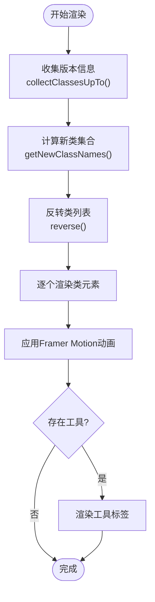

**图表来源**
- [web/src/components/architecture/arch-diagram.tsx:71-103](file://web/src/components/architecture/arch-diagram.tsx#L71-L103)
- [web/src/components/architecture/arch-diagram.tsx:105-229](file://web/src/components/architecture/arch-diagram.tsx#L105-L229)

### 可视化组件系统

可视化组件系统为每个版本提供了专门的教学内容，通过步骤化的控制和丰富的动画效果，帮助用户深入理解代理系统的工作原理。

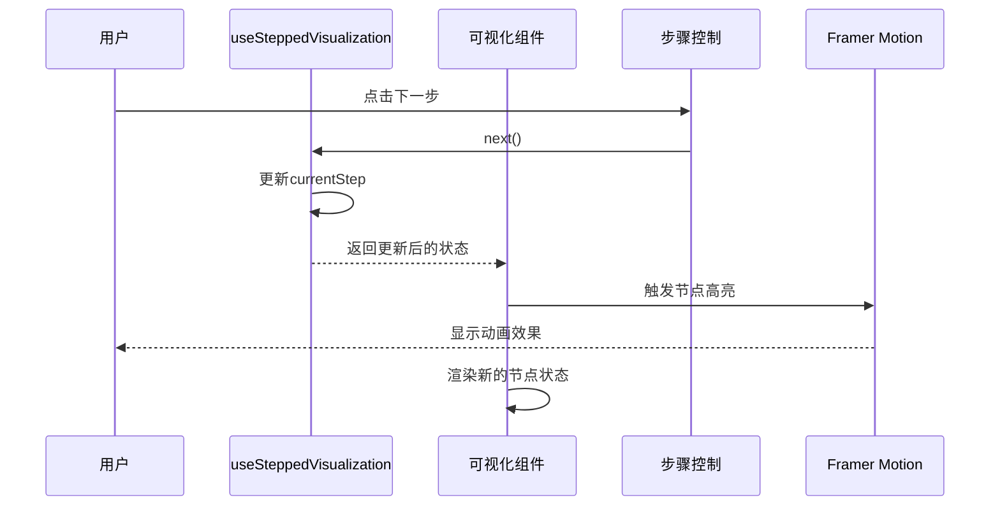

**图表来源**
- [web/src/hooks/useSteppedVisualization.ts:23-85](file://web/src/hooks/useSteppedVisualization.ts#L23-L85)
- [web/src/components/visualizations/shared/step-controls.tsx:19-103](file://web/src/components/visualizations/shared/step-controls.tsx#L19-L103)
- [web/src/components/visualizations/s01-agent-loop.tsx:138-417](file://web/src/components/visualizations/s01-agent-loop.tsx#L138-L417)

**章节来源**
- [web/src/components/simulator/agent-loop-simulator.tsx:1-97](file://web/src/components/simulator/agent-loop-simulator.tsx#L1-L97)
- [web/src/components/architecture/arch-diagram.tsx:1-229](file://web/src/components/architecture/arch-diagram.tsx#L1-L229)
- [web/src/components/visualizations/s01-agent-loop.tsx:1-417](file://web/src/components/visualizations/s01-agent-loop.tsx#L1-L417)

## 架构概览

整个系统采用了分层架构设计，确保了良好的可维护性和扩展性：

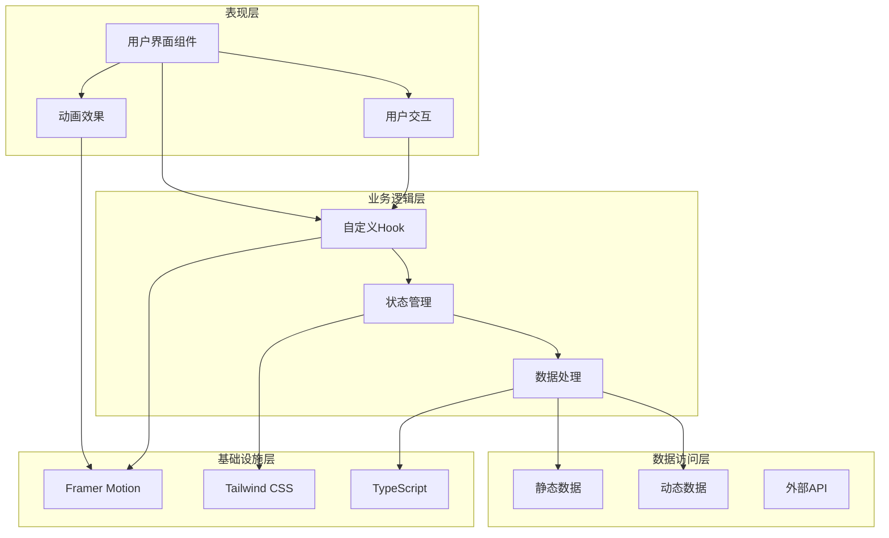

**图表来源**
- [web/src/hooks/useSimulator.ts:1-85](file://web/src/hooks/useSimulator.ts#L1-L85)
- [web/src/hooks/useSteppedVisualization.ts:1-85](file://web/src/hooks/useSteppedVisualization.ts#L1-L85)
- [web/src/lib/constants.ts:1-38](file://web/src/lib/constants.ts#L1-L38)

## 详细组件分析

### 代理循环模拟器组件

#### 组件设计原理

代理循环模拟器采用了响应式设计和状态驱动的架构模式。组件通过 `useSimulator` Hook 实现了完整的状态管理，包括播放控制、速度调节和步进功能。

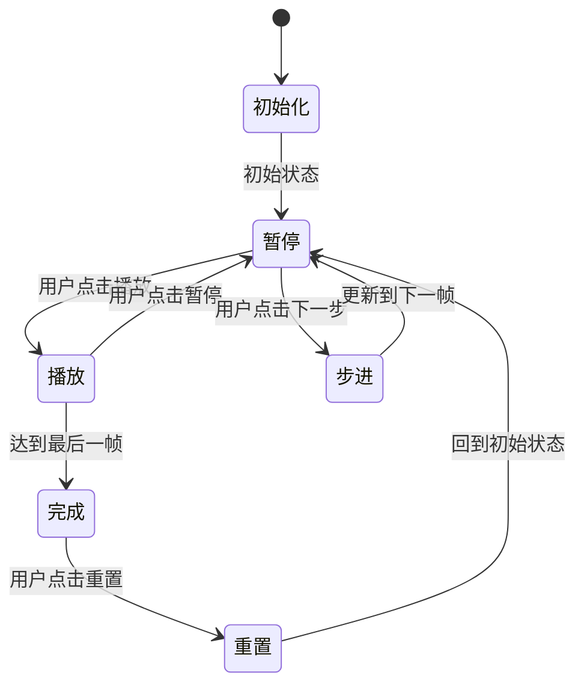

**图表来源**
- [web/src/hooks/useSimulator.ts:12-85](file://web/src/hooks/useSimulator.ts#L12-L85)

#### 数据流设计

模拟器的数据流遵循单向数据流原则，确保了状态的一致性和可预测性：

1. **输入阶段**: 版本参数传递给组件
2. **加载阶段**: 动态导入对应的场景数据
3. **处理阶段**: 使用 `useSimulator` Hook 处理状态逻辑
4. **渲染阶段**: 基于当前状态渲染 UI 元素

#### 动画实现机制

组件充分利用了 Framer Motion 的特性，实现了流畅的过渡效果：

- **Anchored Presence**: 使用 `AnimatePresence` 确保元素进入和离开时的平滑过渡
- **Sequential Animations**: 通过延迟控制实现序列化的动画效果
- **Layout Animations**: 支持布局变化时的自动动画

**章节来源**
- [web/src/components/simulator/agent-loop-simulator.tsx:1-97](file://web/src/components/simulator/agent-loop-simulator.tsx#L1-L97)
- [web/src/components/simulator/simulator-controls.tsx:1-100](file://web/src/components/simulator/simulator-controls.tsx#L1-L100)
- [web/src/components/simulator/simulator-message.tsx:1-94](file://web/src/components/simulator/simulator-message.tsx#L1-L94)
- [web/src/hooks/useSimulator.ts:1-85](file://web/src/hooks/useSimulator.ts#L1-L85)

### 架构图展示组件

#### 设计模式应用

架构图展示组件采用了多种设计模式来处理复杂的渲染逻辑：

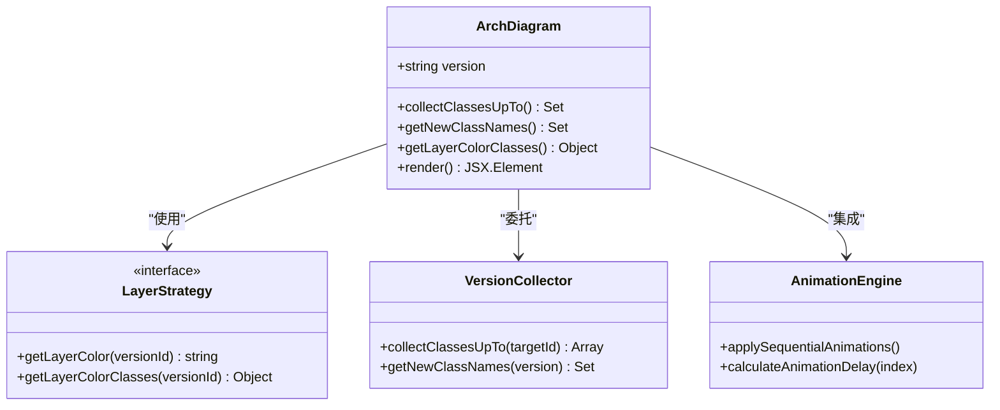

**图表来源**
- [web/src/components/architecture/arch-diagram.tsx:105-229](file://web/src/components/architecture/arch-diagram.tsx#L105-L229)

#### 层级管理系统

组件实现了智能的层级颜色管理系统，根据版本所属的技术领域自动选择相应的视觉样式：

- **工具执行层** (`tools`): 蓝色主题
- **规划协调层** (`planning`): 绿色主题  
- **内存管理层** (`memory`): 紫色主题
- **并发执行层** (`concurrency`): 橙色主题
- **协作层** (`collaboration`): 红色主题

**章节来源**
- [web/src/components/architecture/arch-diagram.tsx:1-229](file://web/src/components/architecture/arch-diagram.tsx#L1-L229)
- [web/src/lib/constants.ts:31-38](file://web/src/lib/constants.ts#L31-L38)

### 可视化组件系统

#### 步骤化控制机制

可视化组件系统通过 `useSteppedVisualization` Hook 实现了统一的步骤控制机制：

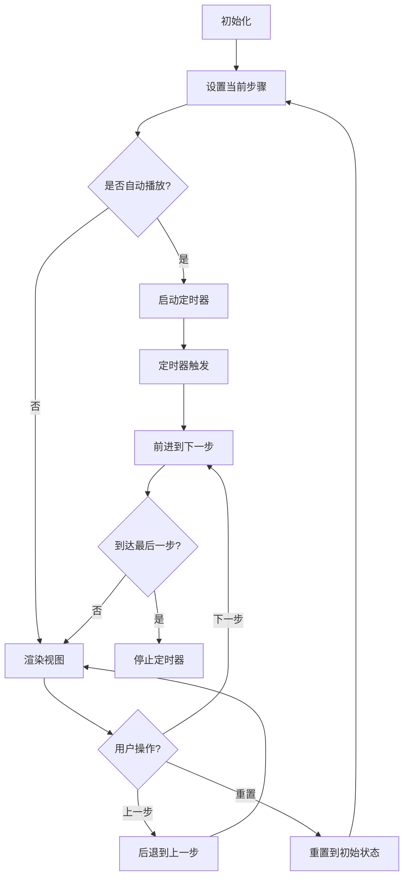

**图表来源**
- [web/src/hooks/useSteppedVisualization.ts:23-85](file://web/src/hooks/useSteppedVisualization.ts#L23-L85)

#### 动画编排策略

组件系统采用了多层次的动画编排策略：

1. **节点高亮动画**: 使用 Framer Motion 的 `filter` 和 `animate` 属性实现发光效果
2. **边流动画**: 通过 SVG 路径动画展示数据流向
3. **消息弹出动画**: 使用 `AnimatePresence` 实现消息的淡入淡出效果
4. **步骤指示器动画**: 通过颜色渐变展示进度状态

**章节来源**
- [web/src/components/visualizations/s01-agent-loop.tsx:1-417](file://web/src/components/visualizations/s01-agent-loop.tsx#L1-L417)
- [web/src/components/visualizations/shared/step-controls.tsx:1-103](file://web/src/components/visualizations/shared/step-controls.tsx#L1-L103)
- [web/src/hooks/useSteppedVisualization.ts:1-85](file://web/src/hooks/useSteppedVisualization.ts#L1-L85)

### 代码查看器组件

#### 语法高亮引擎

代码查看器组件实现了智能化的语法高亮功能，支持多种编程语言特性的识别：

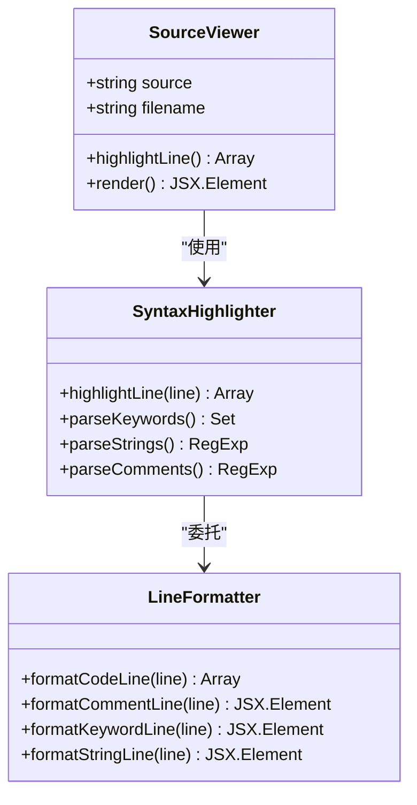

**图表来源**
- [web/src/components/code/source-viewer.tsx:10-69](file://web/src/components/code/source-viewer.tsx#L10-L69)

#### 高亮规则系统

组件实现了灵活的高亮规则系统，能够准确识别各种代码元素：

- **注释高亮**: 以 `#` 开头的行使用灰色斜体样式
- **装饰器高亮**: 以 `@` 开头的行使用琥珀色样式
- **字符串字面量**: 使用绿色强调显示
- **关键字识别**: Python 关键字集合自动高亮
- **数字常量**: 使用橙色样式突出显示

**章节来源**
- [web/src/components/code/source-viewer.tsx:1-103](file://web/src/components/code/source-viewer.tsx#L1-L103)

## 依赖关系分析

### 核心依赖关系

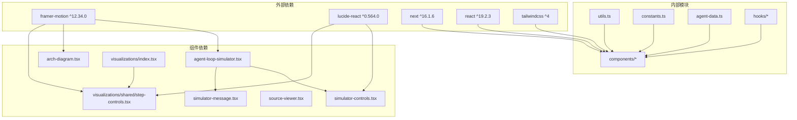

**图表来源**
- [web/package.json:13-28](file://web/package.json#L13-L28)
- [web/src/components/simulator/agent-loop-simulator.tsx:1-10](file://web/src/components/simulator/agent-loop-simulator.tsx#L1-L10)
- [web/src/components/architecture/arch-diagram.tsx:1-6](file://web/src/components/architecture/arch-diagram.tsx#L1-L6)

### 数据依赖链

组件系统中的数据依赖关系形成了清晰的层次结构：

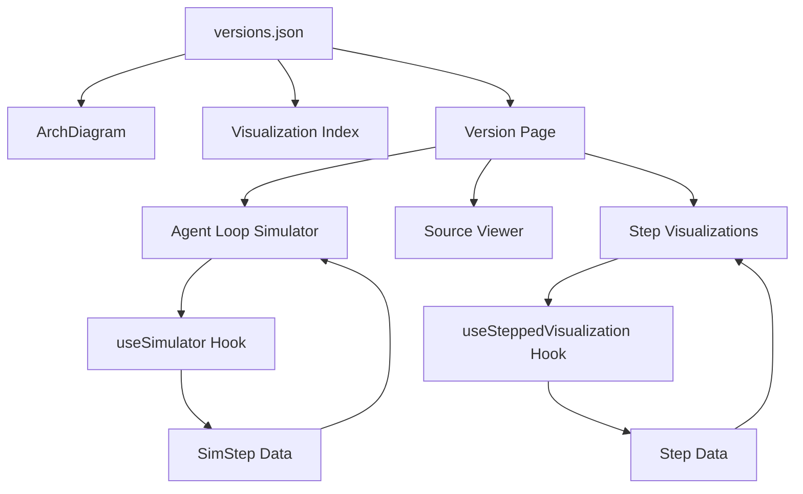

**图表来源**
- [web/src/data/generated/versions.json:1-537](file://web/src/data/generated/versions.json#L1-L537)
- [web/src/app/[locale]/(learn)/[version]/page.tsx](file://web/src/app/[locale]/(learn)/[version]/page.tsx#L1-L126)

**章节来源**
- [web/package.json:1-39](file://web/package.json#L1-L39)
- [web/src/data/generated/versions.json:1-537](file://web/src/data/generated/versions.json#L1-L537)

## 性能考虑

### 渲染优化策略

1. **懒加载机制**: 使用 React.lazy 和 Suspense 实现组件的按需加载
2. **虚拟滚动**: 对长列表使用虚拟化技术减少 DOM 节点数量
3. **动画性能**: 合理使用 transform 和 opacity 属性避免重排
4. **状态缓存**: 使用 useMemo 和 useCallback 优化昂贵的计算

### 内存管理

- **定时器清理**: 在组件卸载时及时清理定时器和订阅
- **事件监听器**: 使用 useRef 存储回调函数避免不必要的重渲染
- **数据结构优化**: 使用 Set 和 Map 提高查找效率

### 加载性能

- **代码分割**: 将大型组件拆分为独立的模块
- **预加载策略**: 对常用组件实施预加载
- **缓存机制**: 利用浏览器缓存减少重复请求

## 故障排除指南

### 常见问题诊断

#### 动画不生效

**症状**: Framer Motion 动画没有按预期工作

**可能原因**:
1. 缺少必要的依赖包
2. 动画属性配置错误
3. 组件未正确标记为客户端组件

**解决方案**:
1. 确认 `framer-motion` 已正确安装
2. 检查组件是否包含 `"use client"` 指令
3. 验证动画属性的值是否正确

#### 数据加载失败

**症状**: 版本数据无法正确加载

**可能原因**:
1. JSON 文件路径错误
2. 数据格式不符合预期
3. 网络请求超时

**解决方案**:
1. 验证文件路径和文件名
2. 检查 JSON 结构是否符合类型定义
3. 实施适当的错误边界和重试机制

#### 性能问题

**症状**: 页面渲染缓慢或动画卡顿

**可能原因**:
1. 过多的重渲染
2. 大量的 DOM 操作
3. 不必要的计算

**解决方案**:
1. 使用 React DevTools 分析渲染性能
2. 实施 memoization 优化
3. 减少不必要的状态更新

**章节来源**
- [web/src/hooks/useSimulator.ts:19-25](file://web/src/hooks/useSimulator.ts#L19-L25)
- [web/src/hooks/useSteppedVisualization.ts:67-70](file://web/src/hooks/useSteppedVisualization.ts#L67-L70)

## 结论

Learn Claude Code 核心组件系统展现了现代前端开发的最佳实践，通过精心设计的组件架构、优雅的动画效果和高效的性能优化，为用户提供了卓越的学习体验。

该系统的主要优势包括：

1. **模块化设计**: 清晰的组件分离和职责划分
2. **状态管理**: 统一的状态管理模式和 Hook 体系
3. **动画体验**: 流畅的过渡效果和丰富的交互反馈
4. **性能优化**: 多层次的性能优化策略
5. **可维护性**: 良好的代码组织和文档化

通过组件化设计，项目实现了高度的代码复用性和维护性，为类似教育类应用的开发提供了宝贵的参考经验。

## 附录

### 组件开发规范

#### Props 接口设计

所有组件的 Props 接口应遵循以下规范：
- 使用 TypeScript 接口定义 Props 类型
- 区分必需和可选属性
- 提供合理的默认值
- 包含详细的 JSDoc 注释

#### 事件处理

事件处理函数应具备以下特征：
- 使用箭头函数避免 this 绑定问题
- 实施防抖和节流机制
- 提供适当的错误处理
- 记录必要的日志信息

#### 错误边界

组件应实现适当的错误边界：
- 使用 React Error Boundary 捕获异常
- 提供友好的错误提示
- 实施降级渲染策略
- 记录错误详情用于调试

### 最佳实践清单

1. **组件设计**: 单一职责原则，保持组件简洁
2. **状态管理**: 集中式状态管理，避免状态漂移
3. **性能优化**: 实施必要的优化措施
4. **测试覆盖**: 编写充分的单元测试
5. **文档维护**: 保持代码和文档同步更新