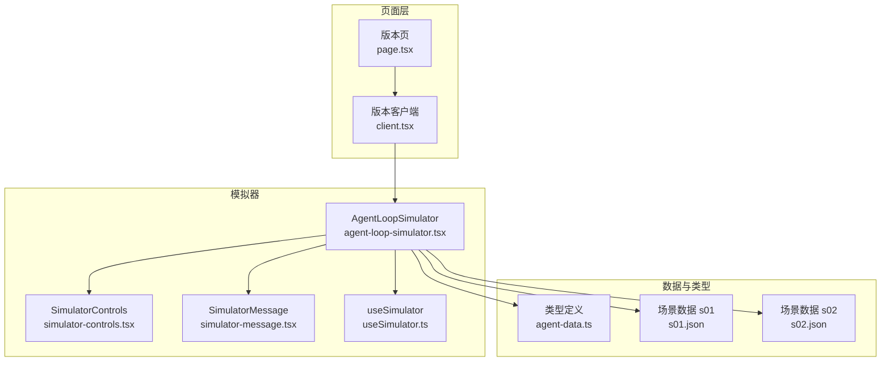
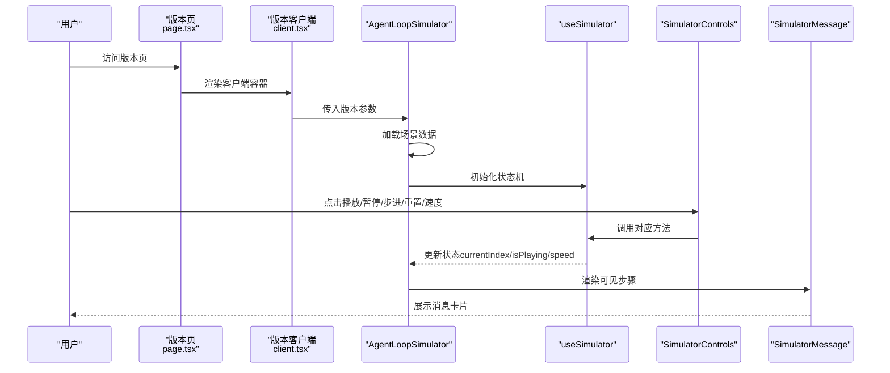
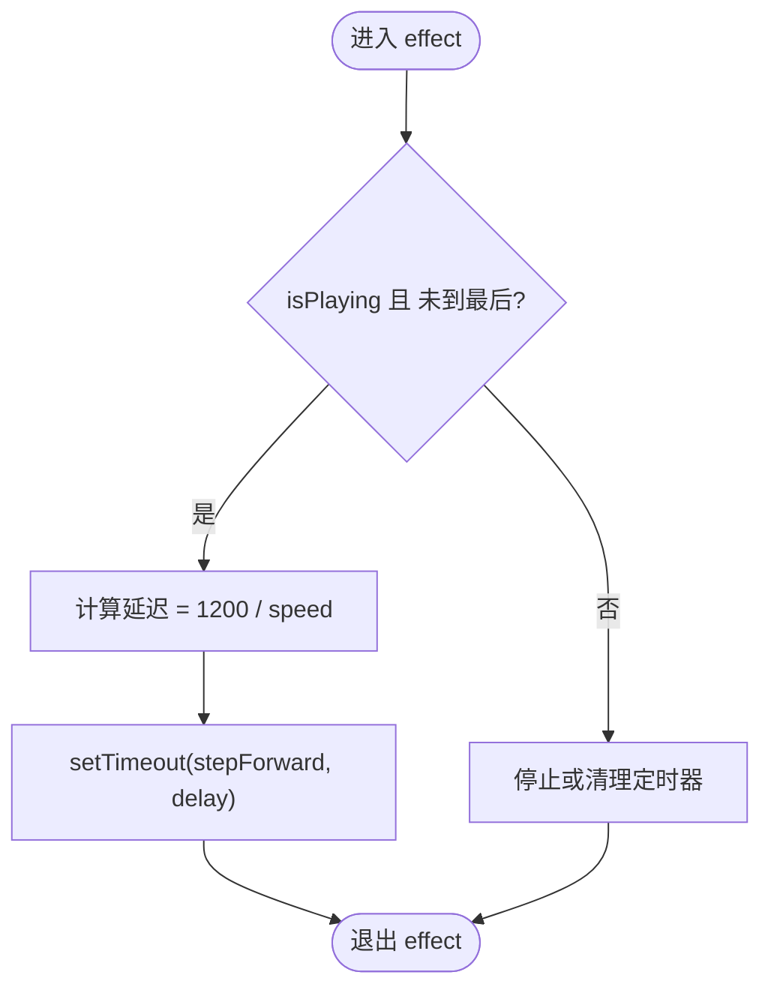
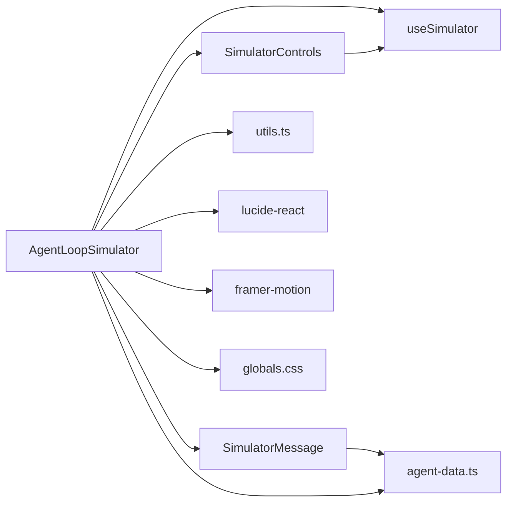

# 模拟器组件

<cite>
**本文引用的文件**
- [web/src/components/simulator/agent-loop-simulator.tsx](file://web/src/components/simulator/agent-loop-simulator.tsx)
- [web/src/components/simulator/simulator-controls.tsx](file://web/src/components/simulator/simulator-controls.tsx)
- [web/src/components/simulator/simulator-message.tsx](file://web/src/components/simulator/simulator-message.tsx)
- [web/src/hooks/useSimulator.ts](file://web/src/hooks/useSimulator.ts)
- [web/src/types/agent-data.ts](file://web/src/types/agent-data.ts)
- [web/src/data/scenarios/s01.json](file://web/src/data/scenarios/s01.json)
- [web/src/data/scenarios/s02.json](file://web/src/data/scenarios/s02.json)
- [web/src/app/[locale]/(learn)/[version]/page.tsx](file://web/src/app/[locale]/(learn)/[version]/page.tsx)
- [web/src/app/[locale]/(learn)/[version]/client.tsx](file://web/src/app/[locale]/(learn)/[version]/client.tsx)
- [web/src/lib/utils.ts](file://web/src/lib/utils.ts)
- [web/src/lib/constants.ts](file://web/src/lib/constants.ts)
- [web/src/components/visualizations/index.tsx](file://web/src/components/visualizations/index.tsx)
- [web/package.json](file://web/package.json)
- [web/src/app/globals.css](file://web/src/app/globals.css)
</cite>

## 目录
1. [简介](#简介)
2. [项目结构](#项目结构)
3. [核心组件](#核心组件)
4. [架构总览](#架构总览)
5. [详细组件分析](#详细组件分析)
6. [依赖关系分析](#依赖关系分析)
7. [性能考虑](#性能考虑)
8. [故障排查指南](#故障排查指南)
9. [结论](#结论)
10. [附录](#附录)

## 简介
本文件系统性梳理“代理循环模拟器”组件的设计与实现，覆盖消息流控制、状态管理、用户交互处理；详解模拟器控制面板（启动/暂停/重置、步进、速度调节）；说明消息渲染逻辑（类型化消息样式、时间戳处理、交互响应）；给出开发指南（状态同步、性能优化、内存管理）；并通过具体代码路径与调试技巧帮助读者深入理解代理执行过程。

## 项目结构
模拟器相关代码位于 web/src/components/simulator 及其配套的 hooks、types、data/scenarios 和页面入口中。页面层通过版本路由加载对应场景数据，使用自定义 hook 驱动播放流程，并以消息卡片组件渲染每一步骤。

图表来源
- [web/src/app/[locale]/(learn)/[version]/page.tsx](file://web/src/app/[locale]/(learn)/[version]/page.tsx#L1-L126)
- [web/src/app/[locale]/(learn)/[version]/client.tsx](file://web/src/app/[locale]/(learn)/[version]/client.tsx#L1-L83)
- [web/src/components/simulator/agent-loop-simulator.tsx:1-97](file://web/src/components/simulator/agent-loop-simulator.tsx#L1-L97)
- [web/src/components/simulator/simulator-controls.tsx:1-100](file://web/src/components/simulator/simulator-controls.tsx#L1-L100)
- [web/src/components/simulator/simulator-message.tsx:1-94](file://web/src/components/simulator/simulator-message.tsx#L1-L94)
- [web/src/hooks/useSimulator.ts:1-85](file://web/src/hooks/useSimulator.ts#L1-L85)
- [web/src/types/agent-data.ts:1-73](file://web/src/types/agent-data.ts#L1-L73)
- [web/src/data/scenarios/s01.json:1-52](file://web/src/data/scenarios/s01.json#L1-L52)
- [web/src/data/scenarios/s02.json:1-47](file://web/src/data/scenarios/s02.json#L1-L47)

章节来源
- [web/src/app/[locale]/(learn)/[version]/page.tsx](file://web/src/app/[locale]/(learn)/[version]/page.tsx#L1-L126)
- [web/src/app/[locale]/(learn)/[version]/client.tsx](file://web/src/app/[locale]/(learn)/[version]/client.tsx#L1-L83)
- [web/src/components/simulator/agent-loop-simulator.tsx:1-97](file://web/src/components/simulator/agent-loop-simulator.tsx#L1-L97)

## 核心组件
- AgentLoopSimulator：负责加载指定版本的场景数据，驱动 useSimulator 的状态机，渲染控制面板与消息列表，并自动滚动到底部。
- useSimulator：核心状态机 hook，维护当前索引、播放状态、速度，提供 play/pause/step/reset/setSpeed 等方法，并通过定时器推进播放。
- SimulatorControls：控制面板 UI，提供播放/暂停、单步、重置、速度选择与进度指示。
- SimulatorMessage：消息卡片渲染器，按消息类型映射图标、标签、背景色与内容展示方式。

章节来源
- [web/src/components/simulator/agent-loop-simulator.tsx:30-96](file://web/src/components/simulator/agent-loop-simulator.tsx#L30-L96)
- [web/src/hooks/useSimulator.ts:12-84](file://web/src/hooks/useSimulator.ts#L12-L84)
- [web/src/components/simulator/simulator-controls.tsx:22-99](file://web/src/components/simulator/simulator-controls.tsx#L22-L99)
- [web/src/components/simulator/simulator-message.tsx:49-93](file://web/src/components/simulator/simulator-message.tsx#L49-L93)

## 架构总览
模拟器采用“页面路由 → 客户端组件 → 自定义 hook → 控制面板/消息渲染”的分层设计。页面层负责版本元信息与导航，客户端组件承载 Tab 切换与可视化区域，AgentLoopSimulator 负责场景加载与状态驱动，useSimulator 提供统一的状态与调度，控制面板与消息组件分别承担用户交互与展示职责。

图表来源
- [web/src/app/[locale]/(learn)/[version]/page.tsx](file://web/src/app/[locale]/(learn)/[version]/page.tsx#L12-L125)
- [web/src/app/[locale]/(learn)/[version]/client.tsx](file://web/src/app/[locale]/(learn)/[version]/client.tsx#L28-L82)
- [web/src/components/simulator/agent-loop-simulator.tsx:30-96](file://web/src/components/simulator/agent-loop-simulator.tsx#L30-L96)
- [web/src/hooks/useSimulator.ts:12-84](file://web/src/hooks/useSimulator.ts#L12-L84)
- [web/src/components/simulator/simulator-controls.tsx:22-99](file://web/src/components/simulator/simulator-controls.tsx#L22-L99)
- [web/src/components/simulator/simulator-message.tsx:49-93](file://web/src/components/simulator/simulator-message.tsx#L49-L93)

## 详细组件分析

### AgentLoopSimulator 组件
- 场景加载：根据版本参数动态导入对应 JSON 场景，设置到组件状态。
- 状态绑定：通过 useSimulator 获取播放状态、当前索引、速度与可见步骤。
- 自动滚动：当可见步骤变化时，容器滚动到底部，确保最新消息可见。
- 布局：顶部描述区 + 控制面板 + 消息列表容器，使用动画库进行消息入场动画。

章节来源
- [web/src/components/simulator/agent-loop-simulator.tsx:30-96](file://web/src/components/simulator/agent-loop-simulator.tsx#L30-L96)

### useSimulator 状态机
- 状态字段：currentIndex、isPlaying、speed。
- 关键方法：
  - stepForward：向前推进一步，若已到最后则停止播放。
  - play：开始播放（仅在未完成时生效）。
  - pause：清除定时器并停止播放。
  - reset：重置为初始状态，保留速度。
  - setSpeed：更新播放速度。
- 定时器逻辑：当处于播放且未完成时，按 1200ms/速度 的间隔触发 stepForward。
- 可见步骤：visibleSteps = steps.slice(0, currentIndex+1)，用于只渲染已完成步骤。

图表来源
- [web/src/hooks/useSimulator.ts:59-69](file://web/src/hooks/useSimulator.ts#L59-L69)

章节来源
- [web/src/hooks/useSimulator.ts:12-84](file://web/src/hooks/useSimulator.ts#L12-L84)

### SimulatorControls 控制面板
- 功能按钮：播放/暂停、单步、重置。
- 速度调节：支持 0.5x/1x/2x/4x 四档速度，点击切换。
- 进度显示：当前步数/总步数。
- 禁用逻辑：播放完成时禁用播放、单步、重置按钮中的部分操作。

章节来源
- [web/src/components/simulator/simulator-controls.tsx:22-99](file://web/src/components/simulator/simulator-controls.tsx#L22-L99)

### SimulatorMessage 消息渲染
- 类型配置：按消息类型映射图标、标签、背景色与边框类名。
- 内容渲染：
  - tool_call/tool_result：等宽块展示工具调用/结果，空内容显示占位提示。
  - system_event：等宽块展示系统事件，强调紫色系。
  - 其他：普通段落展示文本内容。
- 注解：每条消息下方展示注释文本，便于教学讲解。

章节来源
- [web/src/components/simulator/simulator-message.tsx:49-93](file://web/src/components/simulator/simulator-message.tsx#L49-L93)
- [web/src/types/agent-data.ts:38-51](file://web/src/types/agent-data.ts#L38-L51)

### 场景数据与类型
- SimStep：定义消息类型、内容、注释、可选工具名/输入。
- Scenario：包含版本、标题、描述与步骤数组。
- 场景样例：s01.json 展示最小代理循环，s02.json 展示多工具协作。

章节来源
- [web/src/types/agent-data.ts:38-58](file://web/src/types/agent-data.ts#L38-L58)
- [web/src/data/scenarios/s01.json:1-52](file://web/src/data/scenarios/s01.json#L1-L52)
- [web/src/data/scenarios/s02.json:1-47](file://web/src/data/scenarios/s02.json#L1-L47)

### 页面集成与导航
- 版本页：生成静态参数，渲染版本元信息与前后导航。
- 客户端容器：Tab 切换“学习/模拟/代码/深度剖析”，模拟器在“模拟”标签下渲染。
- 可视化组件：懒加载对应版本的可视化图示，提升首屏性能。

章节来源
- [web/src/app/[locale]/(learn)/[version]/page.tsx](file://web/src/app/[locale]/(learn)/[version]/page.tsx#L12-L125)
- [web/src/app/[locale]/(learn)/[version]/client.tsx](file://web/src/app/[locale]/(learn)/[version]/client.tsx#L28-L82)
- [web/src/components/visualizations/index.tsx:24-39](file://web/src/components/visualizations/index.tsx#L24-L39)

## 依赖关系分析
- 组件依赖：
  - AgentLoopSimulator 依赖 useSimulator、SimulatorControls、SimulatorMessage。
  - SimulatorControls 依赖 useSimulator 的回调。
  - SimulatorMessage 依赖类型定义与图标库。
- 外部依赖：
  - 动画：framer-motion。
  - 图标：lucide-react。
  - 工具函数：cn（类名合并）。
- 主题与样式：全局 CSS 定义颜色变量与暗色模式适配。

图表来源
- [web/src/components/simulator/agent-loop-simulator.tsx:1-10](file://web/src/components/simulator/agent-loop-simulator.tsx#L1-L10)
- [web/src/components/simulator/simulator-controls.tsx:1-6](file://web/src/components/simulator/simulator-controls.tsx#L1-L6)
- [web/src/components/simulator/simulator-message.tsx:1-6](file://web/src/components/simulator/simulator-message.tsx#L1-L6)
- [web/src/hooks/useSimulator.ts:1-4](file://web/src/hooks/useSimulator.ts#L1-L4)
- [web/src/lib/utils.ts:1-4](file://web/src/lib/utils.ts#L1-L4)
- [web/src/app/globals.css:1-35](file://web/src/app/globals.css#L1-L35)
- [web/package.json:13-27](file://web/package.json#L13-L27)

章节来源
- [web/src/lib/utils.ts:1-4](file://web/src/lib/utils.ts#L1-L4)
- [web/package.json:13-27](file://web/package.json#L13-L27)
- [web/src/app/globals.css:1-35](file://web/src/app/globals.css#L1-L35)

## 性能考虑
- 懒加载与分割：页面级可视化组件使用懒加载，减少首屏体积与初次渲染压力。
- 动画与滚动：消息入场使用轻量动画，容器滚动采用平滑滚动，避免频繁强制布局。
- 状态最小化：useSimulator 仅维护必要状态，visibleSteps 通过切片计算，避免重复渲染。
- 定时器清理：pause/reset 显式清理定时器，防止内存泄漏与后台任务堆积。
- 依赖稳定：useCallback 包裹方法，减少子组件重渲染；速度变更不触发额外副作用。

章节来源
- [web/src/components/visualizations/index.tsx:24-39](file://web/src/components/visualizations/index.tsx#L24-L39)
- [web/src/hooks/useSimulator.ts:20-25](file://web/src/hooks/useSimulator.ts#L20-L25)
- [web/src/components/simulator/agent-loop-simulator.tsx:44-51](file://web/src/components/simulator/agent-loop-simulator.tsx#L44-L51)

## 故障排查指南
- 播放无响应
  - 检查是否已到最后一步（isComplete），完成状态下播放按钮会禁用。
  - 确认 speed 是否为有效数值，setSpeed 会更新状态。
- 单步无效
  - 若 currentIndex 已达到最后，stepForward 会自动停止播放。
- 暂停后无法继续
  - 确保 pause 后再次调用 play，且未到达最后一步。
- 滚动异常
  - visibleSteps 变化时才会触发滚动，确认是否有新步骤渲染。
- 样式问题
  - 检查主题变量与暗色模式类名是否正确应用。
- 场景未加载
  - 确认版本参数与场景文件名一致，动态导入模块路径正确。

章节来源
- [web/src/hooks/useSimulator.ts:36-53](file://web/src/hooks/useSimulator.ts#L36-L53)
- [web/src/components/simulator/agent-loop-simulator.tsx:44-51](file://web/src/components/simulator/agent-loop-simulator.tsx#L44-L51)
- [web/src/app/globals.css:1-25](file://web/src/app/globals.css#L1-L25)

## 结论
该模拟器组件通过清晰的分层设计与简洁的状态机，实现了对代理执行过程的可视化演示。控制面板提供直观的操作入口，消息渲染组件针对不同消息类型提供了差异化的展示策略。配合页面路由与可视化组件，用户可以在“学习/模拟/代码/深度剖析”之间自由切换，深入理解代理循环与工具使用机制。

## 附录

### 开发指南：状态同步机制
- 使用 useSimulator 统一管理播放状态与索引，避免多处分散状态导致的竞态。
- visibleSteps 由 currentIndex 推导，保证渲染与状态的一致性。
- 在 effect 中监听 isPlaying/speed/index，确保定时器行为与 UI 同步。

章节来源
- [web/src/hooks/useSimulator.ts:59-69](file://web/src/hooks/useSimulator.ts#L59-L69)

### 开发指南：性能优化策略
- 将长列表消息渲染交给虚拟化或分页（当前通过切片可见步骤降低渲染量）。
- 控制面板按钮使用受控禁用，避免无效交互带来的重渲染。
- 使用 cn 合并类名，减少条件判断开销。

章节来源
- [web/src/hooks/useSimulator.ts:75-75](file://web/src/hooks/useSimulator.ts#L75-L75)
- [web/src/lib/utils.ts:1-4](file://web/src/lib/utils.ts#L1-L4)

### 开发指南：内存管理
- 在 pause/reset 中清理定时器，防止泄漏。
- 在组件卸载时清理定时器，避免副作用残留。

章节来源
- [web/src/hooks/useSimulator.ts:20-25](file://web/src/hooks/useSimulator.ts#L20-L25)
- [web/src/hooks/useSimulator.ts:68-68](file://web/src/hooks/useSimulator.ts#L68-L68)

### 调试技巧
- 在 useSimulator 中打印 state 变化，观察 isPlaying/speed/index 的联动。
- 在 SimulatorControls 中为按钮添加临时提示，验证回调是否被调用。
- 在 SimulatorMessage 中为不同类型消息添加唯一标识，便于定位渲染问题。
- 使用浏览器开发者工具检查定时器数量与 DOM 结构变化。

章节来源
- [web/src/hooks/useSimulator.ts:59-69](file://web/src/hooks/useSimulator.ts#L59-L69)
- [web/src/components/simulator/simulator-controls.tsx:36-97](file://web/src/components/simulator/simulator-controls.tsx#L36-L97)
- [web/src/components/simulator/simulator-message.tsx:49-93](file://web/src/components/simulator/simulator-message.tsx#L49-L93)