# MCP插件系统

<cite>
**本文档引用的文件**
- [s19_mcp_plugin/code.py](file://s19_mcp_plugin/code.py)
- [s19_mcp_plugin/README.md](file://s19_mcp_plugin/README.md)
- [skills/mcp-builder/SKILL.md](file://skills/mcp-builder/SKILL.md)
- [skills/agent-builder/SKILL.md](file://skills/agent-builder/SKILL.md)
</cite>

## 目录
1. [简介](#简介)
2. [项目结构](#项目结构)
3. [核心组件](#核心组件)
4. [架构概览](#架构概览)
5. [详细组件分析](#详细组件分析)
6. [MCP客户端系统](#mcp客户端系统)
7. [工具池组装机制](#工具池组装机制)
8. [命名规范化系统](#命名规范化系统)
9. [权限与安全机制](#权限与安全机制)
10. [集成与扩展](#集成与扩展)
11. [性能考虑](#性能考虑)
12. [故障排除指南](#故障排除指南)
13. [结论](#结论)

## 简介

MCP（Model Context Protocol）插件系统是Claude Code项目中的一个重要组成部分，它实现了标准协议来连接外部工具和服务。该系统允许代理程序通过统一的接口发现、调用和管理外部能力，而无需了解这些工具的具体实现细节。

### 主要特性

- **标准化协议**：通过MCP协议实现跨语言、跨平台的工具集成
- **动态发现**：运行时动态发现和加载外部工具
- **命名空间隔离**：使用前缀避免工具名称冲突
- **权限控制**：支持只读和破坏性操作的权限标注
- **灵活扩展**：支持多种传输方式和配置来源

## 项目结构

MCP插件系统位于`s19_mcp_plugin`目录中，采用模块化设计，主要包含以下组件：

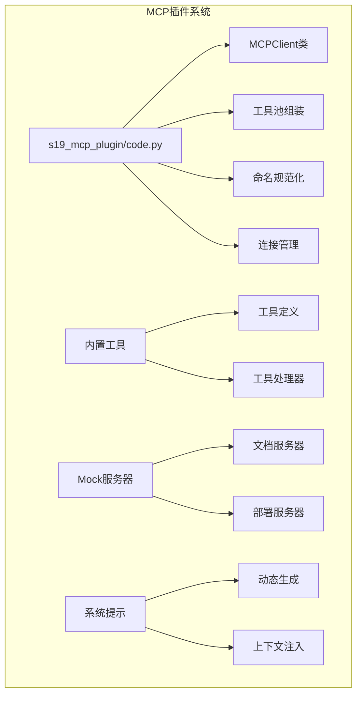

**图表来源**
- [s19_mcp_plugin/code.py:658-770](file://s19_mcp_plugin/code.py#L658-L770)
- [s19_mcp_plugin/code.py:837-944](file://s19_mcp_plugin/code.py#L837-L944)

**章节来源**
- [s19_mcp_plugin/code.py:1-1025](file://s19_mcp_plugin/code.py#L1-L1025)

## 核心组件

### MCPClient类

MCPClient是系统的核心组件，负责与MCP服务器建立连接、发现工具并执行调用。

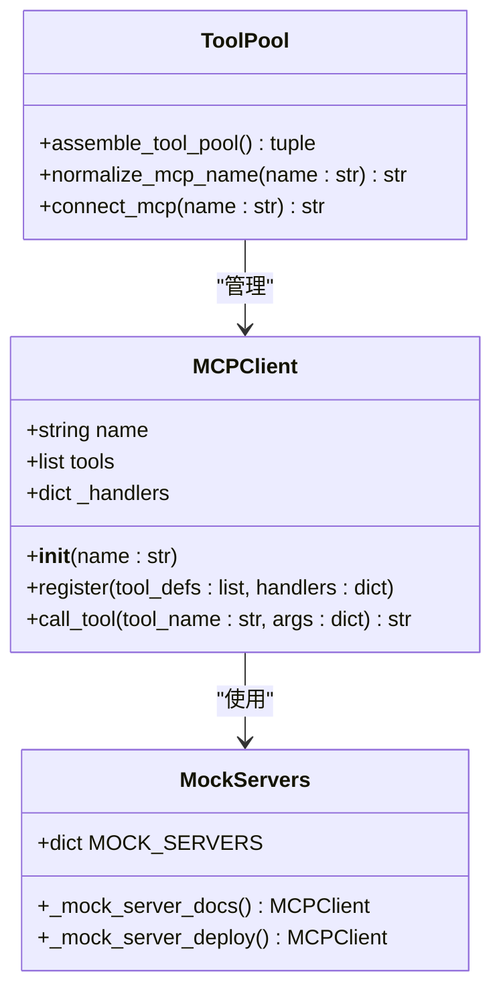

**图表来源**
- [s19_mcp_plugin/code.py:660-683](file://s19_mcp_plugin/code.py#L660-L683)
- [s19_mcp_plugin/code.py:733-736](file://s19_mcp_plugin/code.py#L733-L736)
- [s19_mcp_plugin/code.py:754-770](file://s19_mcp_plugin/code.py#L754-L770)

### 工具系统

系统支持两种类型的工具：内置工具和MCP外部工具。

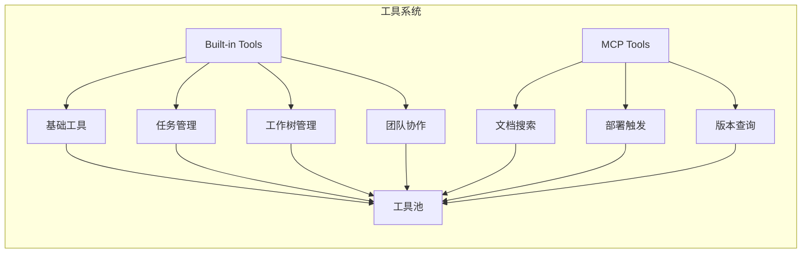

**图表来源**
- [s19_mcp_plugin/code.py:839-929](file://s19_mcp_plugin/code.py#L839-L929)

**章节来源**
- [s19_mcp_plugin/code.py:837-944](file://s19_mcp_plugin/code.py#L837-L944)

## 架构概览

MCP插件系统采用分层架构设计，确保了良好的模块化和可扩展性。

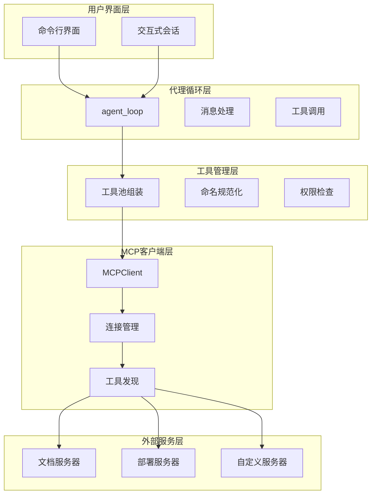

**图表来源**
- [s19_mcp_plugin/code.py:960-996](file://s19_mcp_plugin/code.py#L960-L996)
- [s19_mcp_plugin/code.py:658-752](file://s19_mcp_plugin/code.py#L658-L752)

## 详细组件分析

### MCP客户端实现

MCPClient类提供了与外部MCP服务器交互的核心功能：

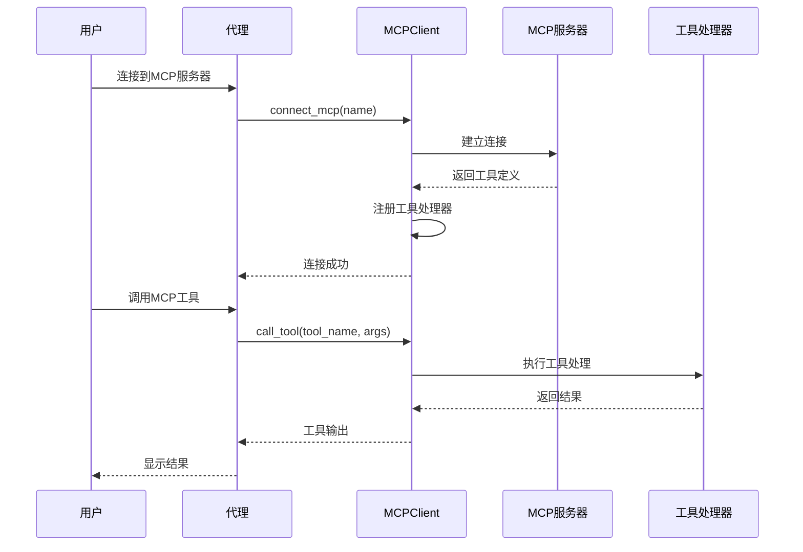

**图表来源**
- [s19_mcp_plugin/code.py:739-751](file://s19_mcp_plugin/code.py#L739-L751)
- [s19_mcp_plugin/code.py:673-680](file://s19_mcp_plugin/code.py#L673-L680)

**章节来源**
- [s19_mcp_plugin/code.py:660-752](file://s19_mcp_plugin/code.py#L660-L752)

### 工具池组装算法

工具池组装是MCP系统的核心机制，负责将内置工具和MCP工具合并为统一的工具集合。

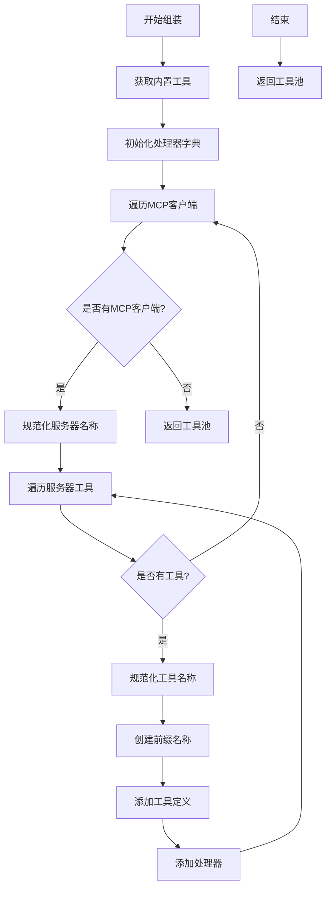

**图表来源**
- [s19_mcp_plugin/code.py:754-770](file://s19_mcp_plugin/code.py#L754-L770)

**章节来源**
- [s19_mcp_plugin/code.py:754-770](file://s19_mcp_plugin/code.py#L754-L770)

## MCP客户端系统

### Mock服务器实现

系统提供了两个示例Mock服务器来演示MCP协议的工作原理：

#### 文档服务器（docs）

文档服务器提供只读工具，用于演示搜索和版本查询功能：

| 工具名称 | 描述 | 输入参数 | 权限级别 |
|---------|------|----------|----------|
| search | 搜索文档 | query: string | readOnly |
| get_version | 获取API版本 | 无 | readOnly |

#### 部署服务器（deploy）

部署服务器提供破坏性工具，用于演示部署触发和状态查询：

| 工具名称 | 描述 | 输入参数 | 权限级别 |
|---------|------|----------|----------|
| trigger | 触发部署 | service: string | destructive |
| status | 检查部署状态 | service: string | readOnly |

**章节来源**
- [s19_mcp_plugin/code.py:693-730](file://s19_mcp_plugin/code.py#L693-L730)

### 连接管理机制

MCP连接管理确保了服务器的正确初始化和状态跟踪：

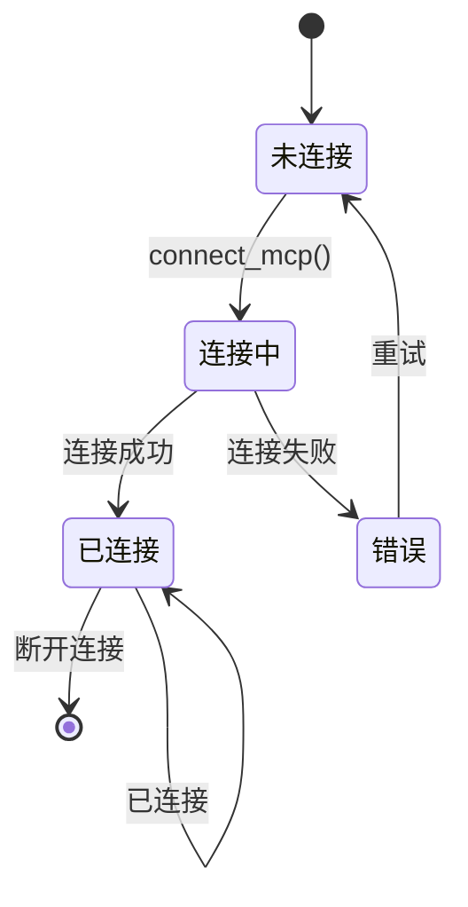

**图表来源**
- [s19_mcp_plugin/code.py:739-751](file://s19_mcp_plugin/code.py#L739-L751)

**章节来源**
- [s19_mcp_plugin/code.py:739-751](file://s19_mcp_plugin/code.py#L739-L751)

## 工具池组装机制

### 动态工具池构建

工具池组装机制确保了工具的动态性和一致性：

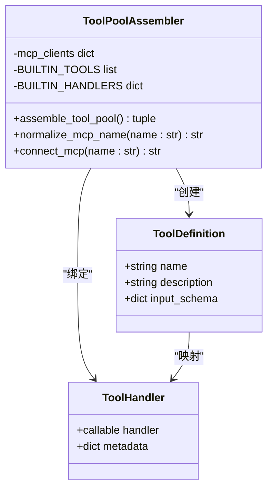

**图表来源**
- [s19_mcp_plugin/code.py:754-770](file://s19_mcp_plugin/code.py#L754-L770)
- [s19_mcp_plugin/code.py:839-944](file://s19_mcp_plugin/code.py#L839-L944)

### 工具命名规范

MCP工具采用统一的命名规范，确保跨服务器的工具名称唯一性：

```
mcp__{server_name}__{tool_name}
```

其中：
- `server_name`：服务器名称，经过字符过滤处理
- `tool_name`：工具名称，经过字符过滤处理
- `mcp__`：MCP工具标识前缀

**章节来源**
- [s19_mcp_plugin/code.py:754-770](file://s19_mcp_plugin/code.py#L754-L770)

## 命名规范化系统

### 字符过滤机制

命名规范化系统确保了工具名称的安全性和兼容性：

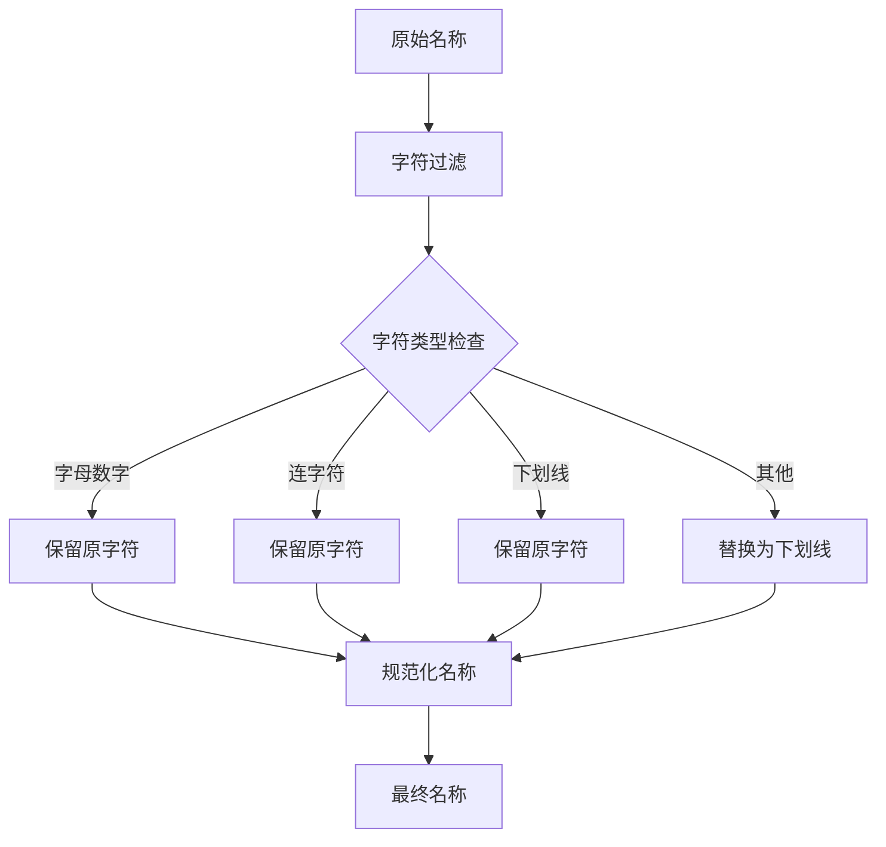

**图表来源**
- [s19_mcp_plugin/code.py:688-690](file://s19_mcp_plugin/code.py#L688-L690)

### 安全考虑

命名规范化系统解决了以下安全问题：

1. **路径遍历攻击**：防止通过特殊字符进行路径遍历
2. **注入攻击**：避免特殊字符导致的代码注入
3. **命名冲突**：确保工具名称的唯一性
4. **跨平台兼容性**：保证在不同操作系统上的兼容性

**章节来源**
- [s19_mcp_plugin/code.py:685-690](file://s19_mcp_plugin/code.py#L685-L690)

## 权限与安全机制

### 权限标注系统

MCP工具支持权限标注，用于区分只读和破坏性操作：

| 权限类型 | 标注格式 | 示例 | 说明 |
|---------|----------|------|------|
| 只读操作 | `(readOnly)` | `搜索文档 (readOnly)` | 无副作用的操作 |
| 破坏性操作 | `(destructive)` | `触发部署 (destructive)` | 可能影响生产环境的操作 |

### 安全最佳实践

1. **最小权限原则**：为工具分配必要的最小权限
2. **权限分离**：将只读和破坏性操作分离
3. **审计日志**：记录所有工具调用和权限决策
4. **输入验证**：对所有工具输入进行严格验证

**章节来源**
- [s19_mcp_plugin/code.py:697-729](file://s19_mcp_plugin/code.py#L697-L729)

## 集成与扩展

### MCP服务器构建

系统提供了完整的MCP服务器构建指南，支持多种编程语言：

#### Python MCP服务器模板

```python
from mcp.server import Server
from mcp.server.stdio import stdio_server

# 创建MCP服务器实例
server = Server("my-server")

# 定义工具函数
@server.tool()
async def hello(name: str) -> str:
    """向某人问好"""
    return f"Hello, {name}!"

# 启动服务器
async def main():
    async with stdio_server() as (read, write):
        await server.run(read, write)

if __name__ == "__main__":
    import asyncio
    asyncio.run(main())
```

#### TypeScript MCP服务器模板

```typescript
import { Server } from "@modelcontextprotocol/sdk/server/index.js";
import { StdioServerTransport } from "@modelcontextprotocol/sdk/server/stdio.js";

const server = new Server({
    name: "my-server",
    version: "1.0.0",
});

// 定义工具处理器
server.setRequestHandler("tools/list", async () => ({
    tools: [
        {
            name: "hello",
            description: "向某人问好",
            inputSchema: {
                type: "object",
                properties: {
                    name: { type: "string", description: "要问候的人名" },
                },
                required: ["name"],
            },
        },
    ],
}));

// 启动服务器
const transport = new StdioServerTransport();
server.connect(transport);
```

**章节来源**
- [skills/mcp-builder/SKILL.md:30-137](file://skills/mcp-builder/SKILL.md#L30-L137)

### 配置管理

MCP服务器配置支持多种来源，具有明确的优先级顺序：

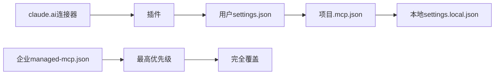

**图表来源**
- [s19_mcp_plugin/README.md:233-239](file://s19_mcp_plugin/README.md#L233-L239)

**章节来源**
- [s19_mcp_plugin/README.md:231-241](file://s19_mcp_plugin/README.md#L231-L241)

## 性能考虑

### 工具池动态更新

MCP系统采用了动态工具池更新机制，确保工具列表的实时性和准确性：

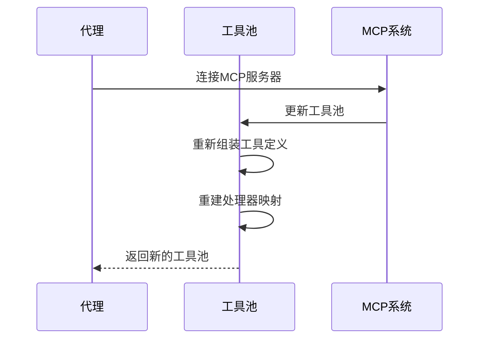

**图表来源**
- [s19_mcp_plugin/code.py:991-995](file://s19_mcp_plugin/code.py#L991-L995)

### 缓存策略

系统采用了智能的缓存策略，平衡了性能和准确性：

| 缓存类型 | 使用场景 | 生命周期 | 清除条件 |
|---------|----------|----------|----------|
| 工具池缓存 | 固定工具集合 | 持久化 | 工具池变更 |
| 系统提示缓存 | 静态提示模板 | 持久化 | 系统重启 |
| 上下文缓存 | 任务和工作树信息 | 会话级 | 会话结束 |
| MCP连接缓存 | 服务器连接状态 | 会话级 | 连接断开 |

**章节来源**
- [s19_mcp_plugin/code.py:960-996](file://s19_mcp_plugin/code.py#L960-L996)

## 故障排除指南

### 常见问题诊断

#### 连接问题

**问题症状**：无法连接到MCP服务器
**可能原因**：
1. 服务器名称拼写错误
2. 服务器未在MOCK_SERVERS中注册
3. 网络连接问题
4. 权限配置错误

**解决方案**：
1. 验证服务器名称是否正确
2. 检查MOCK_SERVERS字典中的可用服务器
3. 确认网络连接正常
4. 检查权限配置

#### 工具调用失败

**问题症状**：MCP工具调用返回错误
**可能原因**：
1. 工具名称不匹配
2. 输入参数格式错误
3. 服务器内部错误
4. 权限不足

**解决方案**：
1. 验证工具名称的规范化格式
2. 检查输入参数的JSON Schema
3. 查看服务器日志
4. 确认权限标注

#### 工具池冲突

**问题症状**：工具名称冲突或重复
**可能原因**：
1. 服务器名称包含特殊字符
2. 工具名称包含特殊字符
3. 命名规范化规则未生效

**解决方案**：
1. 检查服务器名称的字符过滤
2. 验证工具名称的字符过滤
3. 确认命名规范化函数的正确性

**章节来源**
- [s19_mcp_plugin/code.py:688-690](file://s19_mcp_plugin/code.py#L688-L690)

### 调试技巧

1. **启用详细日志**：观察MCP连接和工具调用过程
2. **检查工具定义**：验证工具的输入参数和描述
3. **测试连接**：使用简单的连接测试验证系统功能
4. **监控资源使用**：关注内存和CPU使用情况

## 结论

MCP插件系统为Claude Code项目提供了一个强大而灵活的外部工具集成框架。通过标准化的协议、动态的工具发现机制和完善的权限控制系统，该系统实现了：

### 主要优势

1. **标准化协议**：通过MCP协议实现了跨语言、跨平台的工具集成
2. **动态扩展**：支持运行时动态发现和加载外部工具
3. **安全隔离**：通过命名空间和权限标注确保系统安全
4. **灵活配置**：支持多种配置来源和优先级管理
5. **易于扩展**：提供了完整的MCP服务器构建指南

### 应用场景

- **企业集成**：连接Jira、Confluence等企业工具
- **开发工具**：集成代码编辑器、调试器、构建系统
- **云服务**：访问AWS、Azure、GCP等云服务API
- **数据库**：连接各种数据库和数据存储
- **第三方服务**：集成支付、邮件、短信等服务

### 未来发展

随着项目的演进，MCP插件系统将继续发展，包括：

1. **增强的权限系统**：更细粒度的权限控制和审计
2. **改进的错误处理**：更完善的错误分类和恢复机制
3. **优化的性能**：更好的缓存策略和资源管理
4. **扩展的传输方式**：支持更多的通信协议和传输方式
5. **增强的监控**：更全面的系统监控和诊断功能

通过持续的改进和扩展，MCP插件系统将成为Claude Code生态系统中不可或缺的重要组成部分，为用户提供更加丰富和强大的AI代理能力。