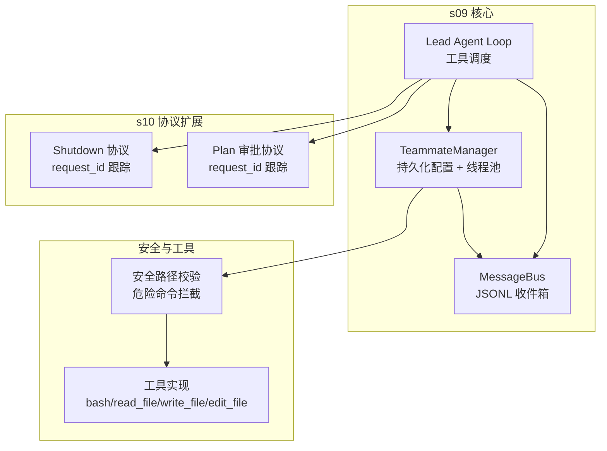
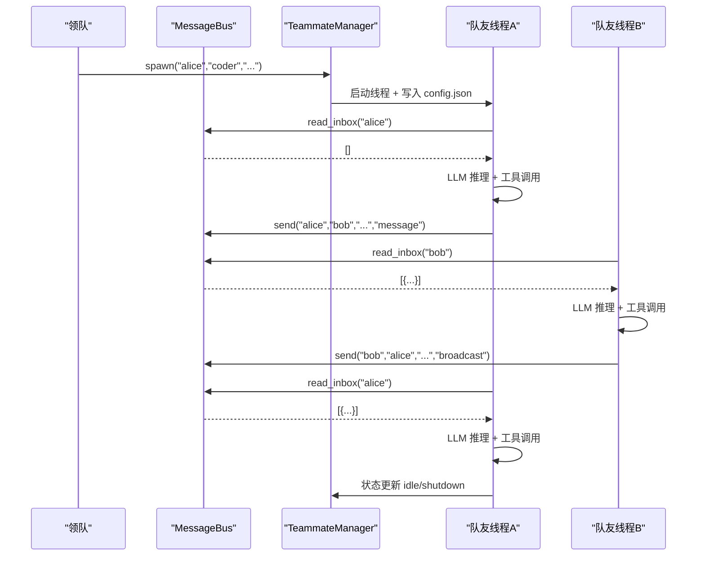
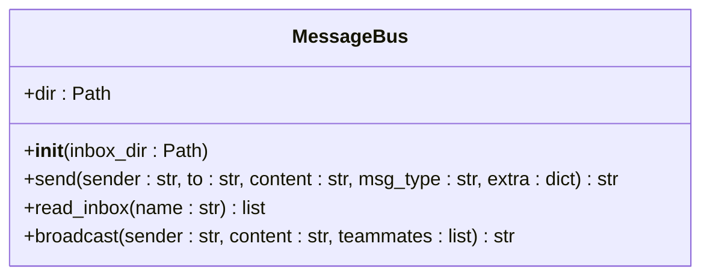
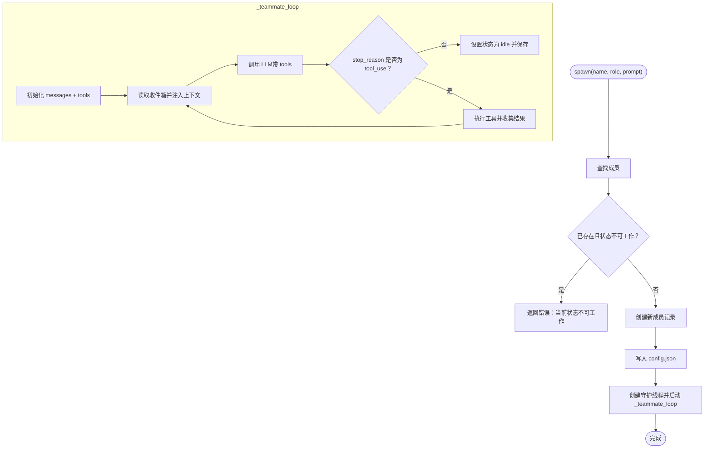
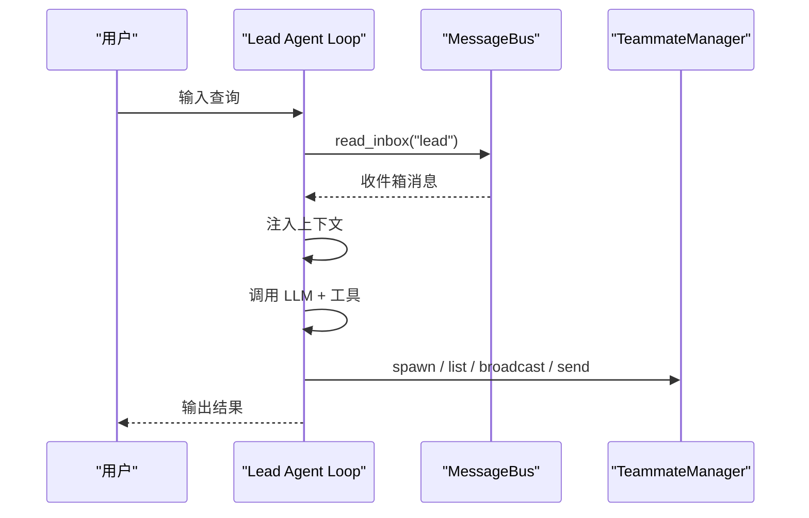
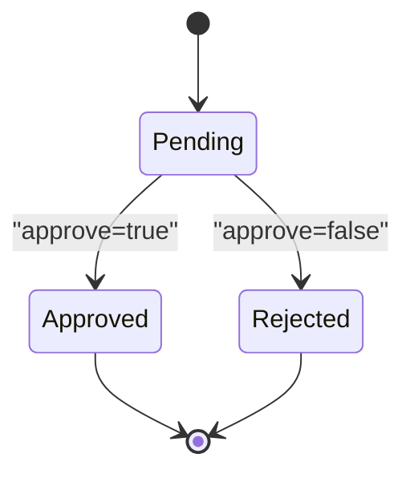
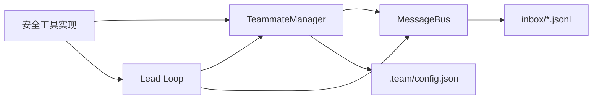

# 代理团队机制

<cite>
**本文引用的文件**
- [s09_agent_teams.py](file://agents/s09_agent_teams.py)
- [s10_team_protocols.py](file://agents/s10_team_protocols.py)
- [s08_background_tasks.py](file://agents/s08_background_tasks.py)
- [s04_subagent.py](file://agents/s04_subagent.py)
- [s02_tool_use.py](file://agents/s02_tool_use.py)
- [s12_worktree_task_isolation.py](file://agents/s12_worktree_task_isolation.py)
- [s09-agent-teams.md](file://docs/zh/s09-agent-teams.md)
- [s10-team-protocols.md](file://docs/zh/s10-team-protocols.md)
- [agent-philosophy.md](file://skills/agent-builder/references/agent-philosophy.md)
- [test_agents_smoke.py](file://tests/test_agents_smoke.py)
</cite>

## 目录
1. [简介](#简介)
2. [项目结构](#项目结构)
3. [核心组件](#核心组件)
4. [架构总览](#架构总览)
5. [详细组件分析](#详细组件分析)
6. [依赖关系分析](#依赖关系分析)
7. [性能考量](#性能考量)
8. [故障排查指南](#故障排查指南)
9. [结论](#结论)
10. [附录：使用示例与最佳实践](#附录使用示例与最佳实践)

## 简介
本文件面向 s09 版本的“代理团队”机制，系统性阐述多代理协作体系：持久化队友管理、基于 JSONL 的文件收件箱通信、线程池管理（每个队友独立线程）、MessageBus 类的消息传递机制（send、read_inbox、broadcast），以及 TeammateManager 的持久化与状态跟踪。同时结合 s10 的协议扩展，说明关闭请求与计划审批的结构化握手流程，并给出安全与最佳实践建议。

## 项目结构
- agents/s09_agent_teams.py：s09 的团队协作核心，定义 MessageBus、TeammateManager、基础工具集与主循环。
- agents/s10_team_protocols.py：在 s09 基础上引入协议层，支持关闭请求/响应与计划审批协议。
- agents/s08_background_tasks.py：背景任务与通知队列，为理解并发执行与线程模型提供参考。
- agents/s04_subagent.py：子代理与上下文隔离，帮助理解“持久代理”的生命周期边界。
- agents/s02_tool_use.py：通用工具与安全路径校验，为 s09 的 bash/read_file/write_file/edit_file 提供安全基线。
- agents/s12_worktree_task_isolation.py：工作树隔离与更严格的工具实现，体现安全工程的演进。
- docs/zh/s09-agent-teams.md、docs/zh/s10-team-protocols.md：官方文档，解释设计动机、工作原理与使用方式。
- skills/agent-builder/references/agent-philosophy.md：关于权限、信任边界的哲学与原则。
- tests/test_agents_smoke.py：确保各版本脚本可编译运行的基础测试。

图表来源
- [s09_agent_teams.py:77-121](file://agents/s09_agent_teams.py#L77-L121)
- [s09_agent_teams.py:123-251](file://agents/s09_agent_teams.py#L123-L251)
- [s10_team_protocols.py:87-131](file://agents/s10_team_protocols.py#L87-L131)
- [s10_team_protocols.py:133-292](file://agents/s10_team_protocols.py#L133-L292)
- [s02_tool_use.py:41-81](file://agents/s02_tool_use.py#L41-L81)

章节来源
- [s09_agent_teams.py:1-404](file://agents/s09_agent_teams.py#L1-L404)
- [s10_team_protocols.py:1-485](file://agents/s10_team_protocols.py#L1-L485)
- [s09-agent-teams.md:1-128](file://docs/zh/s09-agent-teams.md#L1-L128)
- [s10-team-protocols.md:1-83](file://docs/zh/s10-team-protocols.md#L1-L83)

## 核心组件
- MessageBus：为每个队友维护独立的 JSONL 收件箱，提供 send、read_inbox、broadcast 三种消息操作；read_inbox 采用“读取即清空”的排空策略，避免重复处理。
- TeammateManager：负责团队配置持久化（config.json）、成员状态跟踪（spawn -> working -> idle -> ... -> shutdown）、线程池管理（每个队友一个守护线程）。
- Lead Agent Loop：作为团队领导者，提供 spawn/list/broadcast/send/read_inbox 等工具，驱动团队协作。
- 协议扩展（s10）：引入 request_id 关联的握手协议，统一处理“关闭请求/响应”和“计划审批”。

章节来源
- [s09_agent_teams.py:77-121](file://agents/s09_agent_teams.py#L77-L121)
- [s09_agent_teams.py:123-251](file://agents/s09_agent_teams.py#L123-L251)
- [s10_team_protocols.py:87-131](file://agents/s10_team_protocols.py#L87-L131)
- [s10_team_protocols.py:133-292](file://agents/s10_team_protocols.py#L133-L292)

## 架构总览
s09 的团队协作以“文件驱动的异步通信”为核心：每个队友拥有独立的线程与 JSONL 收件箱；TeammateManager 通过 config.json 维护团队名册与状态；MessageBus 提供点对点与广播通信；Lead 通过工具接口发起任务与沟通。

图表来源
- [s09_agent_teams.py:146-164](file://agents/s09_agent_teams.py#L146-L164)
- [s09_agent_teams.py:166-204](file://agents/s09_agent_teams.py#L166-L204)
- [s09_agent_teams.py:100-118](file://agents/s09_agent_teams.py#L100-L118)
- [s09_agent_teams.py:345-379](file://agents/s09_agent_teams.py#L345-L379)

## 详细组件分析

### MessageBus：消息传递机制
- send(sender, to, content, msg_type, extra)
  - 校验消息类型是否在允许集合内；构造消息体（含 type、from、content、timestamp）；追加写入 to.jsonl。
- read_inbox(name)
  - 若收件箱不存在则返回空列表；否则逐行解析 JSONL，读取后将文件清空，实现“读取即清空”的排空语义。
- broadcast(sender, content, teammates)
  - 遍历所有队友（除发送者），逐一调用 send 发送广播消息。

图表来源
- [s09_agent_teams.py:77-121](file://agents/s09_agent_teams.py#L77-L121)
- [s10_team_protocols.py:87-131](file://agents/s10_team_protocols.py#L87-L131)

章节来源
- [s09_agent_teams.py:77-121](file://agents/s09_agent_teams.py#L77-L121)
- [s10_team_protocols.py:87-131](file://agents/s10_team_protocols.py#L87-L131)

### TeammateManager：持久化与线程池管理
- 配置持久化
  - 初始化时加载或创建 config.json；保存时使用缩进格式化。
  - 成员查询与状态更新均通过 _find_member 与 _save_config 实现。
- 生命周期管理
  - spawn：若成员存在且非 idle/shutdown 则拒绝；否则标记为 working，写入配置并启动守护线程。
  - _teammate_loop：每轮读取收件箱注入上下文，调用 LLM 并执行工具；当不再触发工具调用或达到最大轮次时，进入 idle。
  - 状态转换：working -> idle；在 s10 中可被协议触发 shutdown。
- 线程池
  - 使用 threading.Thread(daemon=True) 为每个队友创建独立线程，避免主线程阻塞。

图表来源
- [s09_agent_teams.py:146-204](file://agents/s09_agent_teams.py#L146-L204)
- [s09_agent_teams.py:222-237](file://agents/s09_agent_teams.py#L222-L237)

章节来源
- [s09_agent_teams.py:123-251](file://agents/s09_agent_teams.py#L123-L251)
- [s09-agent-teams.md:17-101](file://docs/zh/s09-agent-teams.md#L17-L101)

### Lead Agent Loop：工具调度与交互
- 提供工具集：bash、read_file、write_file、edit_file、spawn_teammate、list_teammates、send_message、read_inbox、broadcast。
- 主循环逻辑：每轮读取收件箱，将其注入系统提示，调用 LLM，执行工具，将结果注入上下文，直至不再触发工具调用。

图表来源
- [s09_agent_teams.py:345-379](file://agents/s09_agent_teams.py#L345-L379)
- [s09_agent_teams.py:322-342](file://agents/s09_agent_teams.py#L322-L342)

章节来源
- [s09_agent_teams.py:322-379](file://agents/s09_agent_teams.py#L322-L379)

### 协议扩展（s10）：结构化握手
- 关闭请求/响应
  - 领导生成 request_id，向目标队友发送 shutdown_request；队友通过 shutdown_response 返回 approve/reject，并回传给领导。
- 计划审批
  - 队友提交 plan，生成 request_id；领导 review 并通过 plan_approval_response 返回 approve/reject 与反馈。
- 请求跟踪器
  - 使用 shutdown_requests、plan_requests 字典与锁进行并发安全的状态跟踪。

图表来源
- [s10_team_protocols.py:48-84](file://agents/s10_team_protocols.py#L48-L84)
- [s10-team-protocols.md:21-41](file://docs/zh/s10-team-protocols.md#L21-L41)

章节来源
- [s10_team_protocols.py:87-292](file://agents/s10_team_protocols.py#L87-L292)
- [s10-team-protocols.md:45-83](file://docs/zh/s10-team-protocols.md#L45-L83)

## 依赖关系分析
- MessageBus 与 TeammateManager：TeammateManager 在 spawn 时写入 config.json，并在 _teammate_loop 中通过 BUS.read_inbox 与 BUS.send 进行通信。
- Lead Agent Loop 与 TeammateManager：通过工具接口调用 TeammateManager 的 spawn/list/broadcast/send。
- 安全与工具：s02 的安全路径校验与危险命令拦截在 s09 中被复用，s12 中进一步强化。

图表来源
- [s09_agent_teams.py:123-251](file://agents/s09_agent_teams.py#L123-L251)
- [s09_agent_teams.py:77-121](file://agents/s09_agent_teams.py#L77-L121)
- [s02_tool_use.py:41-81](file://agents/s02_tool_use.py#L41-L81)

章节来源
- [s09_agent_teams.py:123-251](file://agents/s09_agent_teams.py#L123-L251)
- [s02_tool_use.py:41-81](file://agents/s02_tool_use.py#L41-L81)

## 性能考量
- 文件 I/O 与 JSONL 解析：read_inbox 会顺序扫描整文件并清空，适合小规模消息；在高并发场景下建议控制消息大小与频率，避免频繁磁盘写入。
- 线程模型：每个队友一个守护线程，适合 CPU 密集型任务；对于大量 IO 密集任务，可考虑线程池或协程模型优化。
- LLM 调用成本：每轮工具调用都会触发一次 LLM 推理，建议在工具链中合并同类操作，减少不必要的推理次数。
- 收件箱排空：read_inbox 的排空语义避免重复处理，但需确保工具执行幂等，防止消息丢失导致的执行缺失。

## 故障排查指南
- 收件箱为空或未读取
  - 确认收件箱文件是否存在；确认 read_inbox 是否被正确调用；检查消息类型是否在允许集合内。
- 线程未启动或状态不更新
  - 检查 spawn 的成员状态约束；确认线程已创建并启动；查看 config.json 是否成功写入。
- 协议请求未生效
  - 检查 request_id 是否正确传递；确认跟踪器状态是否更新；核对消息类型与字段。
- 安全限制导致失败
  - 检查危险命令拦截规则；确认路径是否逃逸工作区；查看工具超时与异常输出。

章节来源
- [s09_agent_teams.py:100-118](file://agents/s09_agent_teams.py#L100-L118)
- [s10_team_protocols.py:110-128](file://agents/s10_team_protocols.py#L110-L128)
- [s02_tool_use.py:48-58](file://agents/s02_tool_use.py#L48-L58)

## 结论
s09 通过“文件驱动的 JSONL 收件箱 + 线程池 + 持久化配置”构建了轻量而强大的多代理协作框架；s10 在此基础上引入结构化握手协议，使团队具备可审计、可控制的生命周期管理能力。配合安全路径校验与工具实现，该机制在可扩展性与安全性之间取得平衡，适用于需要跨任务协作与长期记忆的复杂场景。

## 附录：使用示例与最佳实践

### 使用示例（基于 s09）
- 启动团队
  - 运行脚本后输入自然语言指令，如“Spawn alice (coder) and bob (tester). Have alice send bob a message.”。
- 检查团队状态
  - 输入“/team”查看所有队友的姓名、角色与状态。
- 检查收件箱
  - 输入“/inbox”查看领导的收件箱内容。
- 广播消息
  - “Broadcast 'status update: phase 1 complete' to all teammates.”

章节来源
- [s09-agent-teams.md:114-128](file://docs/zh/s09-agent-teams.md#L114-L128)
- [s09_agent_teams.py:381-404](file://agents/s09_agent_teams.py#L381-L404)

### 最佳实践与安全建议
- 权限与信任边界
  - 严格限制文件系统访问范围，禁止路径逃逸；对危险命令进行拦截（如 rm -rf、sudo、shutdown 等）。
- 幂等与一致性
  - 工具执行应尽量幂等；对关键操作（如写文件）提供原子性保障。
- 消息类型与协议
  - 仅使用允许的消息类型；在 s10 中使用 request_id 关联请求与响应，确保可追溯。
- 线程与资源
  - 控制并发度，避免过多守护线程造成资源争用；定期清理不再使用的线程与配置。
- 可观测性
  - 记录关键事件（spawn、状态转换、工具调用、异常）以便调试与审计。

章节来源
- [agent-philosophy.md:57-89](file://skills/agent-builder/references/agent-philosophy.md#L57-L89)
- [s02_tool_use.py:48-58](file://agents/s02_tool_use.py#L48-L58)
- [s12_worktree_task_isolation.py:488-531](file://agents/s12_worktree_task_isolation.py#L488-L531)