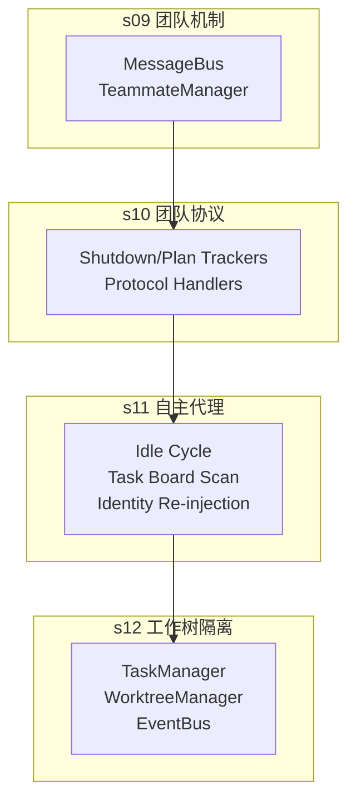
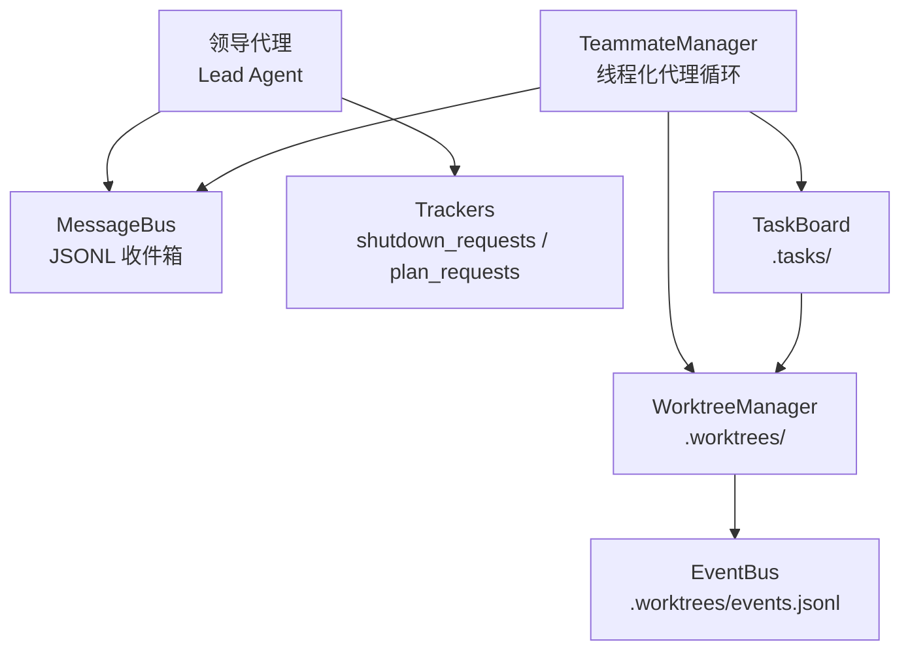
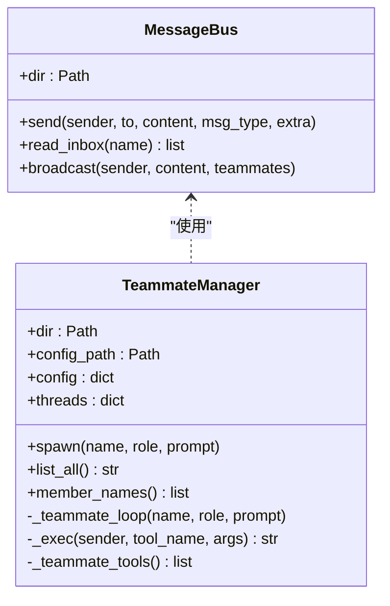
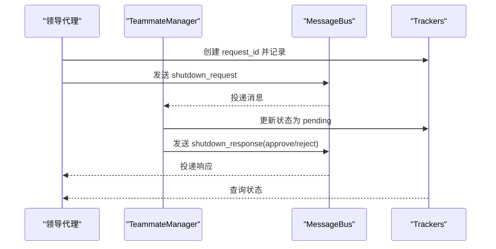
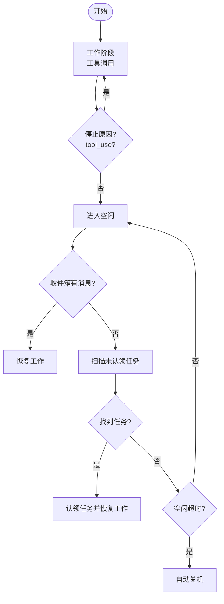
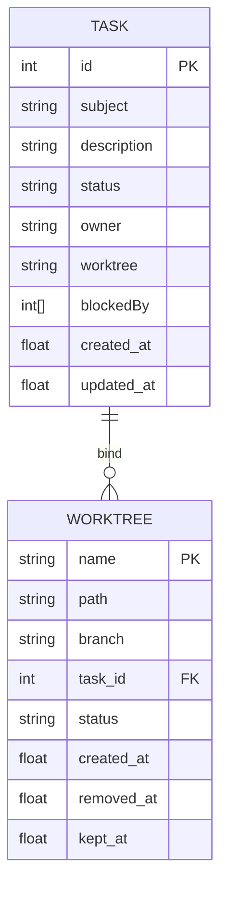
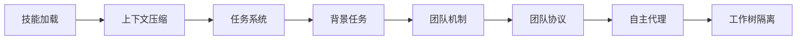

# 团队协作系统

<cite>
**本文档引用的文件**
- [s09_agent_teams.py](file://agents/s09_agent_teams.py)
- [s10_team_protocols.py](file://agents/s10_team_protocols.py)
- [s11_autonomous_agents.py](file://agents/s11_autonomous_agents.py)
- [s12_worktree_task_isolation.py](file://agents/s12_worktree_task_isolation.py)
- [s08_background_tasks.py](file://agents/s08_background_tasks.py)
- [s07_task_system.py](file://agents/s07_task_system.py)
- [s06_context_compact.py](file://agents/s06_context_compact.py)
- [s05_skill_loading.py](file://agents/s05_skill_loading.py)
- [s09-agent-teams.md](file://docs/zh/s09-agent-teams.md)
- [s10-team-protocols.md](file://docs/zh/s10-team-protocols.md)
- [s11-autonomous-agents.md](file://docs/zh/s11-autonomous-agents.md)
- [s12-worktree-task-isolation.md](file://docs/zh/s12-worktree-task-isolation.md)
</cite>

## 目录
1. [简介](#简介)
2. [项目结构](#项目结构)
3. [核心组件](#核心组件)
4. [架构总览](#架构总览)
5. [详细组件分析](#详细组件分析)
6. [依赖关系分析](#依赖关系分析)
7. [性能考量](#性能考量)
8. [故障排查指南](#故障排查指南)
9. [结论](#结论)
10. [附录](#附录)

## 简介
本项目围绕“多代理团队协作”构建，通过四层演进逐步实现从单代理到多代理、从人工调度到协议化协商、再到自主认领与目录隔离的完整体系：
- s09：团队机制（多代理、持久化队友、异步邮箱通信）
- s10：团队协议（请求-响应模式、关闭流程、计划审批状态机）
- s11：自主代理（空闲周期扫描、自动认领任务、身份重注入）
- s12：工作树隔离（任务协调、可选隔离执行通道）

该系统以文件为“收件箱”实现异步通信，以任务看板与工作树索引实现任务与执行空间的解耦，辅以协议化的请求-响应状态机保障安全关闭与计划审批，最终形成可扩展、可观测、可恢复的团队协作框架。

## 项目结构
- agents/：核心实现模块，按主题分层
  - s09_agent_teams.py：团队机制与异步邮箱通信
  - s10_team_protocols.py：团队协议（关闭与计划审批）
  - s11_autonomous_agents.py：自主代理（空闲扫描与自动认领）
  - s12_worktree_task_isolation.py：工作树隔离与任务执行通道
  - s08_background_tasks.py：后台任务（通知队列）
  - s07_task_system.py：任务系统（持久化任务与依赖图）
  - s06_context_compact.py：上下文压缩（无限会话）
  - s05_skill_loading.py：技能加载（按需注入）
- docs/zh/：配套中文文档
- web/：可视化演示与交互界面（非本次重点）

图表来源
- [s09_agent_teams.py:78-120](file://agents/s09_agent_teams.py#L78-L120)
- [s10_team_protocols.py:82-131](file://agents/s10_team_protocols.py#L82-L131)
- [s11_autonomous_agents.py:127-157](file://agents/s11_autonomous_agents.py#L127-L157)
- [s12_worktree_task_isolation.py:122-221](file://agents/s12_worktree_task_isolation.py#L122-L221)

章节来源
- [s09_agent_teams.py:1-404](file://agents/s09_agent_teams.py#L1-L404)
- [s10_team_protocols.py:1-485](file://agents/s10_team_protocols.py#L1-L485)
- [s11_autonomous_agents.py:1-587](file://agents/s11_autonomous_agents.py#L1-L587)
- [s12_worktree_task_isolation.py:1-783](file://agents/s12_worktree_task_isolation.py#L1-L783)

## 核心组件
- MessageBus：基于JSONL文件的异步收件箱，支持发送、读取与广播
- TeammateManager：团队成员的持久化配置与线程化代理循环
- 协议跟踪器：shutdown_requests、plan_requests，配合锁保证并发安全
- 任务看板：.tasks/目录下的任务持久化，支持依赖图与状态机
- 工作树管理：.worktrees/索引与事件日志，提供隔离执行通道
- 背景任务：通知队列在LLM调用前注入结果，提升交互流畅度
- 技能加载：按需注入领域知识，避免系统提示膨胀
- 上下文压缩：三层压缩策略，确保长期会话可用

章节来源
- [s09_agent_teams.py:78-120](file://agents/s09_agent_teams.py#L78-L120)
- [s10_team_protocols.py:82-131](file://agents/s10_team_protocols.py#L82-L131)
- [s11_autonomous_agents.py:127-157](file://agents/s11_autonomous_agents.py#L127-L157)
- [s12_worktree_task_isolation.py:122-221](file://agents/s12_worktree_task_isolation.py#L122-L221)
- [s08_background_tasks.py:49-111](file://agents/s08_background_tasks.py#L49-L111)
- [s07_task_system.py:47-121](file://agents/s07_task_system.py#L47-L121)
- [s06_context_compact.py:68-128](file://agents/s06_context_compact.py#L68-L128)
- [s05_skill_loading.py:58-107](file://agents/s05_skill_loading.py#L58-L107)

## 架构总览
系统采用“控制平面 + 执行平面”的双层设计：
- 控制平面：任务看板与协议跟踪器，负责任务编排与状态治理
- 执行平面：工作树与消息收件箱，负责隔离执行与异步通信

图表来源
- [s09_agent_teams.py:124-251](file://agents/s09_agent_teams.py#L124-L251)
- [s10_team_protocols.py:134-292](file://agents/s10_team_protocols.py#L134-L292)
- [s11_autonomous_agents.py:168-380](file://agents/s11_autonomous_agents.py#L168-L380)
- [s12_worktree_task_isolation.py:225-474](file://agents/s12_worktree_task_isolation.py#L225-L474)

## 详细组件分析

### s09：团队机制与异步邮箱通信
- MessageBus：每线程独立的收件箱，append-only，读取后清空，避免重复处理
- TeammateManager：维护团队配置、spawn队友、线程化执行、状态持久化
- 通信模型：send_message/read_inbox/broadcast，支持多种消息类型
- 工具集：基础工具 + spawn/list/read_inbox + send_message

图表来源
- [s09_agent_teams.py:78-120](file://agents/s09_agent_teams.py#L78-L120)
- [s09_agent_teams.py:124-251](file://agents/s09_agent_teams.py#L124-L251)

章节来源
- [s09_agent_teams.py:78-120](file://agents/s09_agent_teams.py#L78-L120)
- [s09_agent_teams.py:124-251](file://agents/s09_agent_teams.py#L124-L251)
- [s09-agent-teams.md:17-101](file://docs/zh/s09-agent-teams.md#L17-L101)

### s10：团队协议（请求-响应与状态机）
- 关闭协议：领导发起 shutdown_request，队友以 shutdown_response 回应，状态机 pending -> approved/rejected
- 计划审批：队友提交 plan_approval，领导 review 并以 plan_approval_response 回复
- 跟踪器：shutdown_requests、plan_requests，线程安全锁保护
- 工具集：新增 shutdown_request/shutdown_response/plan_approval

图表来源
- [s10_team_protocols.py:351-395](file://agents/s10_team_protocols.py#L351-L395)
- [s10_team_protocols.py:236-257](file://agents/s10_team_protocols.py#L236-L257)

章节来源
- [s10_team_protocols.py:82-131](file://agents/s10_team_protocols.py#L82-L131)
- [s10_team_protocols.py:351-395](file://agents/s10_team_protocols.py#L351-L395)
- [s10-team-protocols.md:21-83](file://docs/zh/s10-team-protocols.md#L21-L83)

### s11：自主代理（空闲扫描与自动认领）
- 生命周期：spawn -> WORK -> IDLE -> WORK/SHUTDOWN
- 空闲阶段：轮询收件箱与任务看板，超时自动关机
- 任务扫描：pending、无 owner、无 blockedBy 的任务
- 身份重注入：上下文压缩后在消息头注入身份块
- 工具集：新增 idle/claim_task

图表来源
- [s11_autonomous_agents.py:216-303](file://agents/s11_autonomous_agents.py#L216-L303)
- [s11_autonomous_agents.py:127-157](file://agents/s11_autonomous_agents.py#L127-L157)

章节来源
- [s11_autonomous_agents.py:168-380](file://agents/s11_autonomous_agents.py#L168-L380)
- [s11-autonomous-agents.md:19-93](file://docs/zh/s11-autonomous-agents.md#L19-L93)

### s12：工作树隔离（任务协调与执行通道）
- 任务看板：.tasks/持久化任务，含 status/owner/worktree/blockedBy
- 工作树：.worktrees/索引 + events.jsonl 事件流
- 绑定：任务与工作树双向绑定，推进状态
- 执行：在隔离目录运行命令，支持 keep/remove/closeout
- 工具集：task_* 与 worktree_* 工具族

图表来源
- [s12_worktree_task_isolation.py:122-221](file://agents/s12_worktree_task_isolation.py#L122-L221)
- [s12_worktree_task_isolation.py:225-474](file://agents/s12_worktree_task_isolation.py#L225-L474)

章节来源
- [s12_worktree_task_isolation.py:122-221](file://agents/s12_worktree_task_isolation.py#L122-L221)
- [s12_worktree_task_isolation.py:225-474](file://agents/s12_worktree_task_isolation.py#L225-L474)
- [s12-worktree-task-isolation.md:17-98](file://docs/zh/s12-worktree-task-isolation.md#L17-L98)

### 背景任务与上下文压缩（支撑性能力）
- 背景任务：后台线程执行命令，通知队列在LLM调用前注入结果
- 上下文压缩：三层压缩策略，避免会话过长导致超限

章节来源
- [s08_background_tasks.py:49-111](file://agents/s08_background_tasks.py#L49-L111)
- [s06_context_compact.py:68-128](file://agents/s06_context_compact.py#L68-L128)

## 依赖关系分析
- s09 为底层通信与团队管理
- s10 在 s09 基础上引入协议化跟踪器
- s11 在 s10 基础上引入空闲扫描与自动认领
- s12 在 s11 基础上引入任务与工作树的执行隔离
- s07 任务系统贯穿 s11/s12，提供持久化与依赖管理
- s08 背景任务与 s06 上下文压缩为通用支撑能力

图表来源
- [s05_skill_loading.py:58-107](file://agents/s05_skill_loading.py#L58-L107)
- [s06_context_compact.py:68-128](file://agents/s06_context_compact.py#L68-L128)
- [s07_task_system.py:47-121](file://agents/s07_task_system.py#L47-L121)
- [s08_background_tasks.py:49-111](file://agents/s08_background_tasks.py#L49-L111)
- [s09_agent_teams.py:124-251](file://agents/s09_agent_teams.py#L124-L251)
- [s10_team_protocols.py:134-292](file://agents/s10_team_protocols.py#L134-L292)
- [s11_autonomous_agents.py:168-380](file://agents/s11_autonomous_agents.py#L168-L380)
- [s12_worktree_task_isolation.py:225-474](file://agents/s12_worktree_task_isolation.py#L225-L474)

## 性能考量
- 异步通信：JSONL收件箱避免阻塞，适合高并发消息
- 线程化执行：每个队友独立线程，资源隔离
- 轮询节流：空闲阶段固定间隔轮询，避免忙等
- 压缩策略：三层压缩降低上下文长度，延长会话寿命
- 工作树隔离：并行执行不互相污染，减少回滚成本

## 故障排查指南
- 收件箱异常
  - 症状：消息未送达或重复处理
  - 排查：确认收件箱路径存在且可写；read_inbox 是否正确清空
  - 参考：[s09_agent_teams.py:100-118](file://agents/s09_agent_teams.py#L100-L118)
- 协议跟踪器冲突
  - 症状：请求-响应错配或状态不一致
  - 排查：检查 request_id 是否匹配；并发访问是否加锁
  - 参考：[s10_team_protocols.py:82-84](file://agents/s10_team_protocols.py#L82-L84)
- 自主代理卡死
  - 症状：空闲超时未关机或无法认领任务
  - 排查：确认空闲轮询间隔与超时设置；任务看板状态是否正确
  - 参考：[s11_autonomous_agents.py:267-303](file://agents/s11_autonomous_agents.py#L267-L303)
- 工作树异常
  - 症状：创建失败、状态不一致、事件缺失
  - 排查：确认 Git 环境可用；索引与事件文件完整性
  - 参考：[s12_worktree_task_isolation.py:237-264](file://agents/s12_worktree_task_isolation.py#L237-L264)

章节来源
- [s09_agent_teams.py:100-118](file://agents/s09_agent_teams.py#L100-L118)
- [s10_team_protocols.py:82-84](file://agents/s10_team_protocols.py#L82-L84)
- [s11_autonomous_agents.py:267-303](file://agents/s11_autonomous_agents.py#L267-L303)
- [s12_worktree_task_isolation.py:237-264](file://agents/s12_worktree_task_isolation.py#L237-L264)

## 结论
本团队协作系统通过“异步邮箱通信 + 协议化状态机 + 自主代理 + 工作树隔离”的组合，实现了可扩展、可观测、可恢复的多代理协作框架。s09 提供通信与持久化，s10 提供安全协商，s11 实现自组织，s12 提供隔离执行。配合背景任务与上下文压缩，系统可在长时间运行中保持稳定与高效。

## 附录
- 使用场景建议
  - s09：需要跨轮次协作的团队，如多人协同开发
  - s10：高风险变更必须审批，或需要优雅关闭
  - s11：任务看板驱动的自组织团队，减少人工干预
  - s12：并行重构、多分支实验，避免互相污染
- 实现要点
  - 严格区分控制平面与执行平面
  - 使用 request_id 串联请求-响应
  - 空闲阶段轮询与超时控制
  - 工作树生命周期事件可观测
  - 背景任务与上下文压缩提升体验