# 团队协议规范

<cite>
**本文档引用的文件**
- [s10_team_protocols.py](file://agents/s10_team_protocols.py)
- [s10-team-protocols.md](file://docs/zh/s10-team-protocols.md)
- [s10-team-protocols.md](file://docs/en/s10-team-protocols.md)
- [s10-team-protocols.tsx](file://web/src/components/visualizations/s10-team-protocols.tsx)
- [s10.json](file://web/src/data/scenarios/s10.json)
- [s09_agent_teams.py](file://agents/s09_agent_teams.py)
- [requirements.txt](file://requirements.txt)
</cite>

## 目录
1. [简介](#简介)
2. [项目结构](#项目结构)
3. [核心组件](#核心组件)
4. [架构概览](#架构概览)
5. [详细组件分析](#详细组件分析)
6. [依赖关系分析](#依赖关系分析)
7. [性能考虑](#性能考虑)
8. [故障排除指南](#故障排除指南)
9. [结论](#结论)
10. [附录](#附录)

## 简介

团队协议规范是s10版本引入的一套结构化通信协议，旨在解决s09版本中团队成员缺乏结构化协调的问题。该协议通过统一的请求-响应协商机制，为团队管理提供了标准化的交互模式。

### 主要特性

- **统一的请求-响应模式**：所有协商都基于request_id关联的消息交换
- **状态机设计**：采用[pending → approved | rejected]的简单状态机
- **双协议支持**：同时支持关机协议和计划审批协议
- **线程安全**：使用锁机制确保并发访问的安全性
- **可扩展性**：设计模式允许轻松添加新的协议类型

## 项目结构

团队协议规范位于项目的agents目录下，主要包含以下文件：

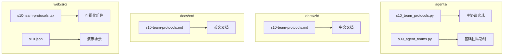

**图表来源**
- [s10_team_protocols.py:1-50](file://agents/s10_team_protocols.py#L1-L50)
- [s09_agent_teams.py:1-50](file://agents/s09_agent_teams.py#L1-L50)

**章节来源**
- [s10_team_protocols.py:1-50](file://agents/s10_team_protocols.py#L1-L50)
- [s09_agent_teams.py:1-50](file://agents/s09_agent_teams.py#L1-L50)

## 核心组件

### 消息总线(MessageBus)

消息总线是团队协议的基础通信基础设施，负责在团队成员之间传递消息。

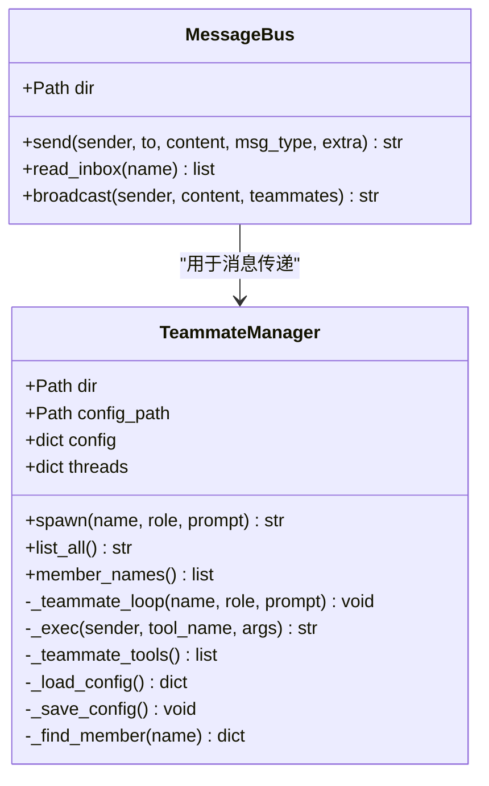

**图表来源**
- [s10_team_protocols.py:87-128](file://agents/s10_team_protocols.py#L87-L128)
- [s10_team_protocols.py:133-290](file://agents/s10_team_protocols.py#L133-L290)

### 协议跟踪器

协议跟踪器负责维护每个请求的状态信息，确保请求-响应的正确关联。

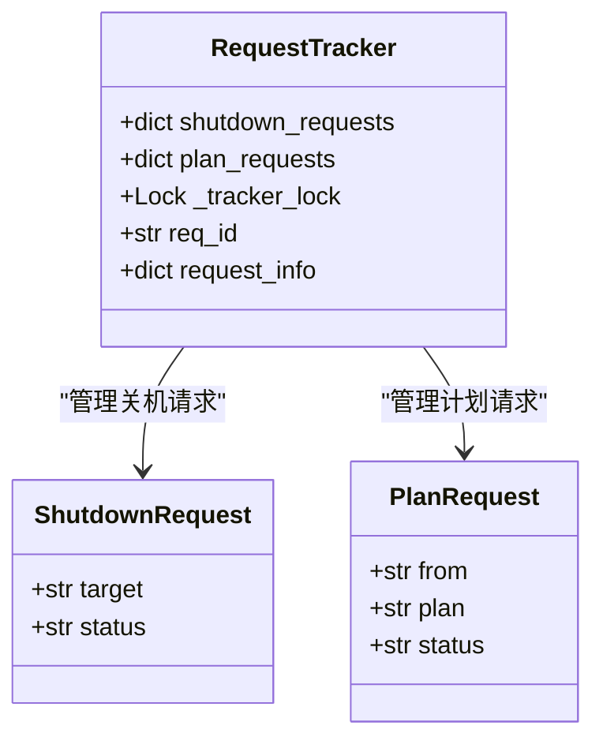

**图表来源**
- [s10_team_protocols.py:81-84](file://agents/s10_team_protocols.py#L81-L84)
- [s10_team_protocols.py:82-83](file://agents/s10_team_protocols.py#L82-L83)

**章节来源**
- [s10_team_protocols.py:87-128](file://agents/s10_team_protocols.py#L87-L128)
- [s10_team_protocols.py:133-290](file://agents/s10_team_protocols.py#L133-L290)

## 架构概览

团队协议规范采用分层架构设计，将协议功能与底层通信机制分离。

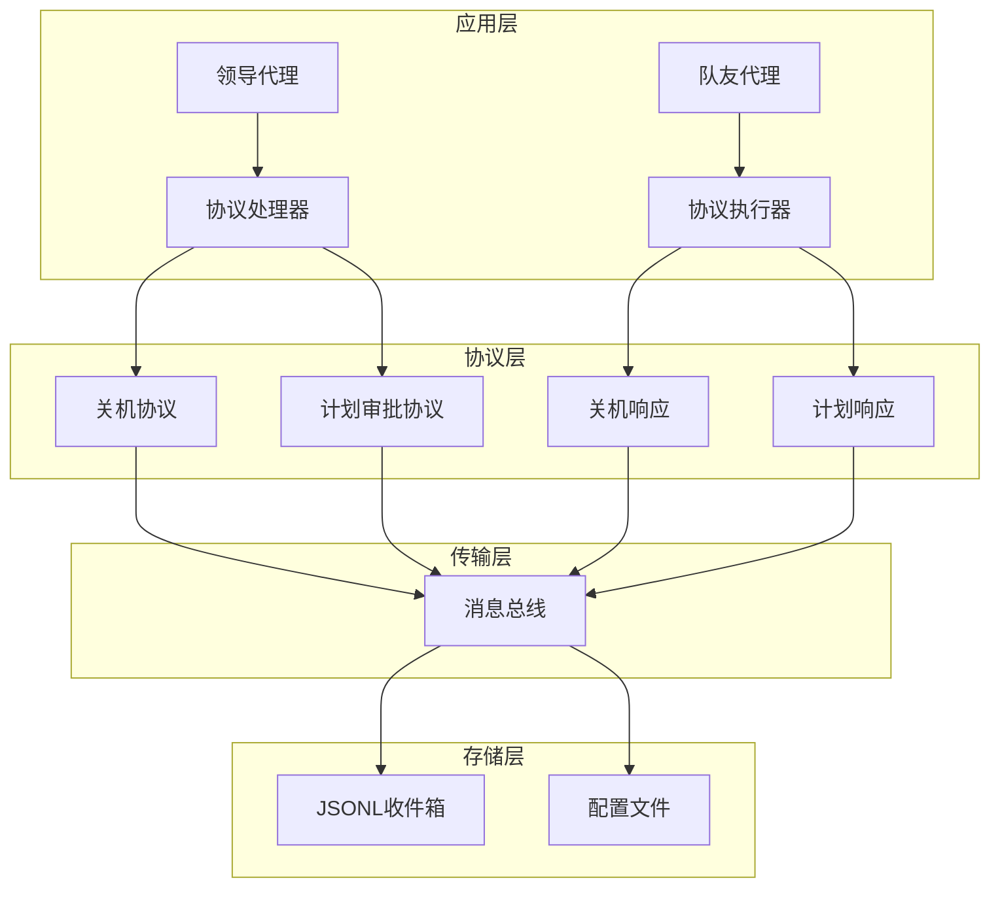

**图表来源**
- [s10_team_protocols.py:350-423](file://agents/s10_team_protocols.py#L350-L423)
- [s10_team_protocols.py:87-128](file://agents/s10_team_protocols.py#L87-L128)

### 协议状态机

两个协议都遵循相同的状态机设计：

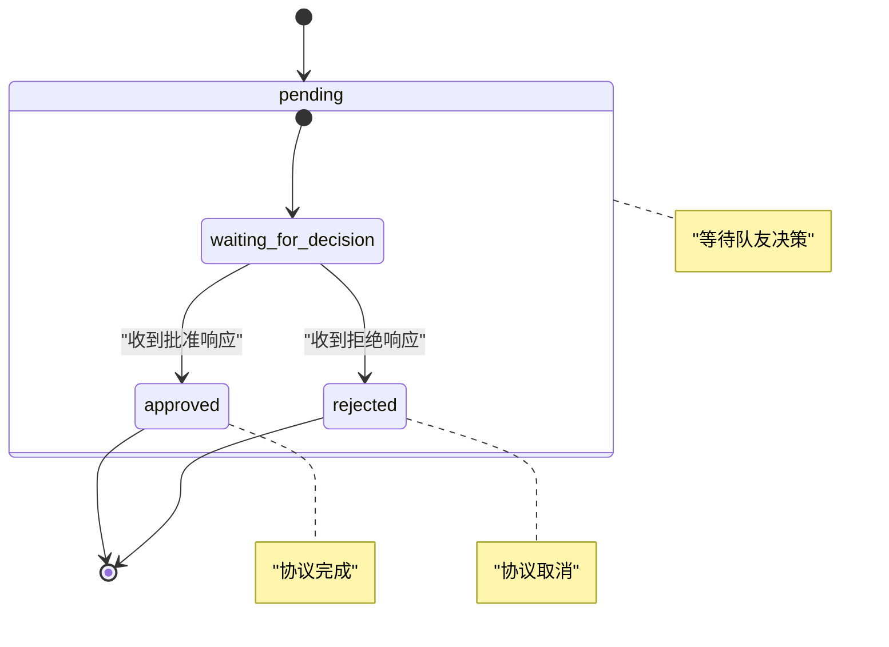

**图表来源**
- [s10_team_protocols.py:9](file://agents/s10_team_protocols.py#L9)
- [s10-team-protocols.md:34-36](file://docs/zh/s10-team-protocols.md#L34-L36)

## 详细组件分析

### 关机协议(Shutdown Protocol)

关机协议是团队协议中最核心的功能之一，确保团队成员能够优雅地停止工作。

#### 协议流程

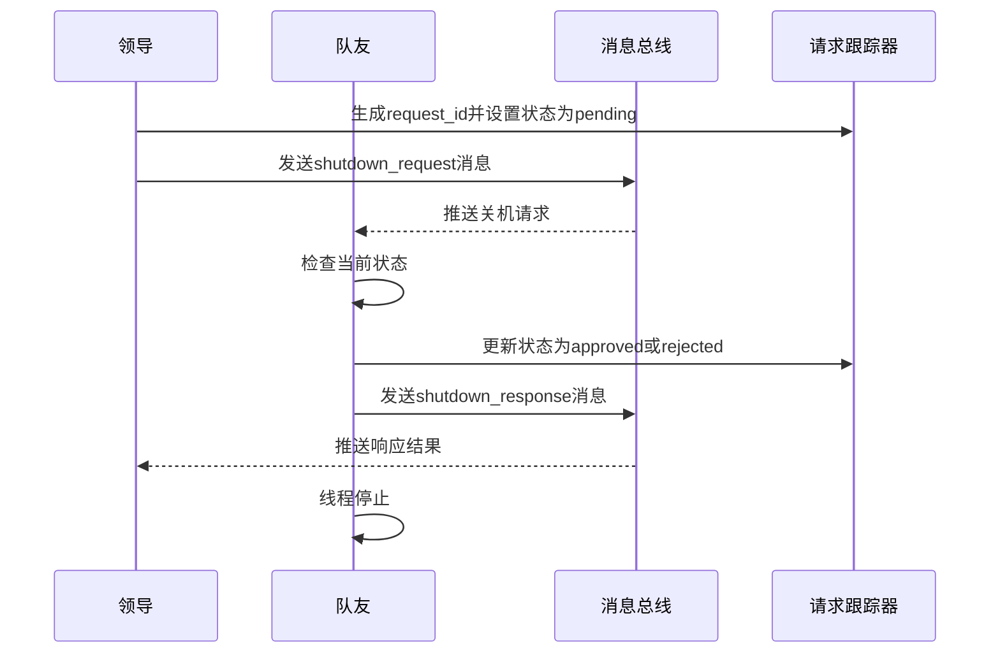

**图表来源**
- [s10_team_protocols.py:351-359](file://agents/s10_team_protocols.py#L351-L359)
- [s10_team_protocols.py:236-246](file://agents/s10_team_protocols.py#L236-L246)

#### 处理逻辑

关机协议的处理逻辑分为三个阶段：

1. **请求发起阶段**：领导生成唯一的request_id，设置跟踪器状态为"pending"
2. **决策阶段**：队友根据自身状态决定是否批准关机请求
3. **响应阶段**：队友更新跟踪器状态并发送响应消息

**章节来源**
- [s10_team_protocols.py:351-359](file://agents/s10_team_protocols.py#L351-L359)
- [s10_team_protocols.py:236-246](file://agents/s10_team_protocols.py#L236-L246)

### 计划审批协议(Plan Approval Protocol)

计划审批协议确保高风险操作在执行前得到适当的审查和批准。

#### 协议流程

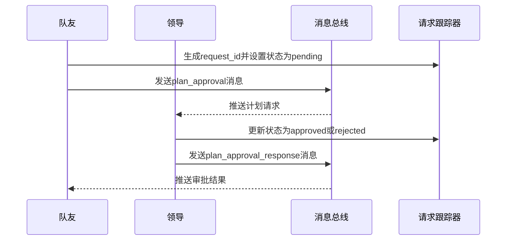

**图表来源**
- [s10_team_protocols.py:247-256](file://agents/s10_team_protocols.py#L247-L256)
- [s10_team_protocols.py:362-373](file://agents/s10_team_protocols.py#L362-L373)

#### 处理逻辑

计划审批协议的处理逻辑同样遵循三阶段设计：

1. **计划提交阶段**：队友生成request_id并提交计划
2. **审查阶段**：领导评估计划的风险和可行性
3. **审批阶段**：领导发送审批结果给队友

**章节来源**
- [s10_team_protocols.py:247-256](file://agents/s10_team_protocols.py#L247-L256)
- [s10_team_protocols.py:362-373](file://agents/s10_team_protocols.py#L362-L373)

### 工具函数系统

团队协议提供了丰富的工具函数来支持各种操作：

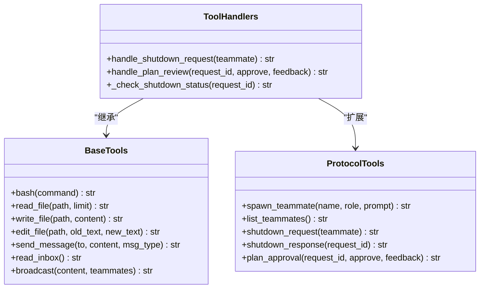

**图表来源**
- [s10_team_protocols.py:350-423](file://agents/s10_team_protocols.py#L350-L423)
- [s10_team_protocols.py:295-348](file://agents/s10_team_protocols.py#L295-L348)

**章节来源**
- [s10_team_protocols.py:350-423](file://agents/s10_team_protocols.py#L350-L423)
- [s10_team_protocols.py:295-348](file://agents/s10_team_protocols.py#L295-L348)

## 依赖关系分析

### 外部依赖

团队协议规范依赖于以下外部库：

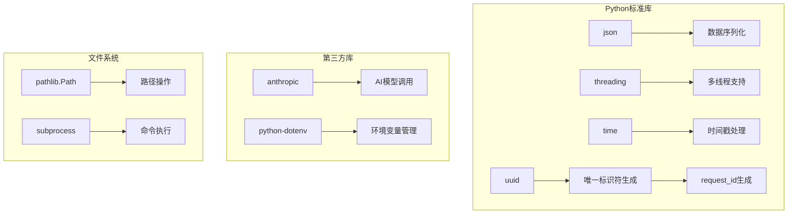

**图表来源**
- [requirements.txt:1-3](file://requirements.txt#L1-L3)
- [s10_team_protocols.py:50-68](file://agents/s10_team_protocols.py#L50-L68)

### 内部依赖关系

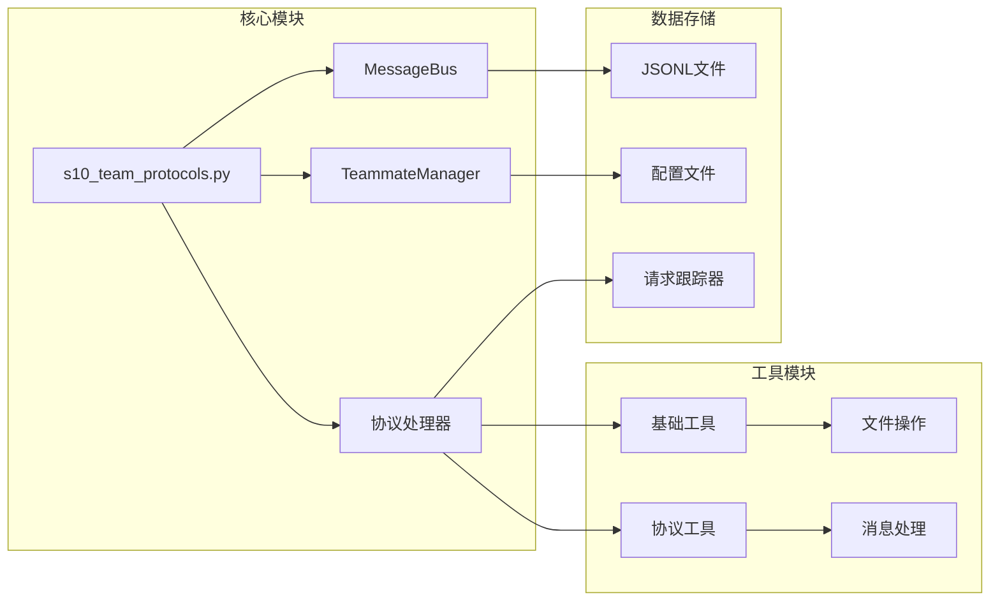

**图表来源**
- [s10_team_protocols.py:87-128](file://agents/s10_team_protocols.py#L87-L128)
- [s10_team_protocols.py:133-290](file://agents/s10_team_protocols.py#L133-L290)

**章节来源**
- [requirements.txt:1-3](file://requirements.txt#L1-L3)
- [s10_team_protocols.py:50-68](file://agents/s10_team_protocols.py#L50-L68)

## 性能考虑

### 并发安全性

团队协议通过以下机制确保并发访问的安全性：

1. **线程锁保护**：使用`threading.Lock()`保护共享资源
2. **原子操作**：关键状态更新操作保持原子性
3. **无阻塞设计**：避免长时间持有锁

### 资源管理

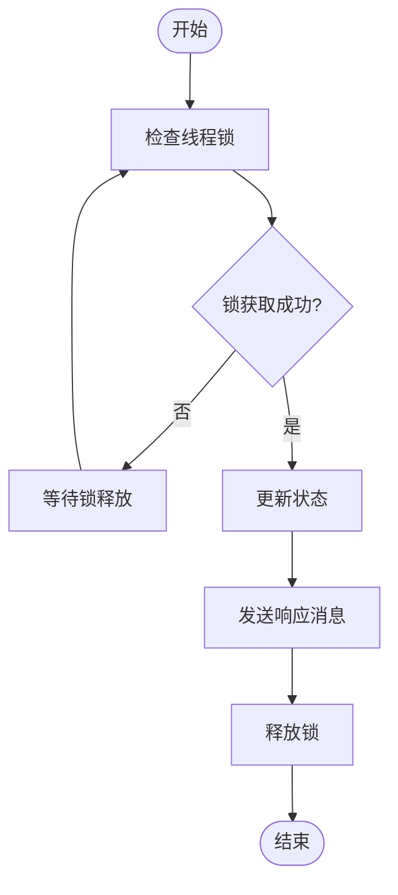

**图表来源**
- [s10_team_protocols.py:84](file://agents/s10_team_protocols.py#L84)
- [s10_team_protocols.py:239](file://agents/s10_team_protocols.py#L239)

### 错误处理策略

团队协议实现了多层次的错误处理机制：

1. **输入验证**：检查消息类型和参数的有效性
2. **异常捕获**：捕获并处理运行时异常
3. **超时管理**：为长时间操作设置超时限制
4. **回滚机制**：在失败情况下恢复到初始状态

**章节来源**
- [s10_team_protocols.py:95-96](file://agents/s10_team_protocols.py#L95-L96)
- [s10_team_protocols.py:314](file://agents/s10_team_protocols.py#L314)

## 故障排除指南

### 常见问题及解决方案

#### 消息类型错误

**问题**：发送无效的消息类型
**解决方案**：检查`VALID_MSG_TYPES`集合中的定义

#### 请求ID不匹配

**问题**：响应消息中的request_id与请求不匹配
**解决方案**：确保在处理响应时正确提取和验证request_id

#### 状态同步问题

**问题**：跟踪器状态与实际状态不一致
**解决方案**：使用线程锁保护状态更新操作

### 调试技巧

1. **启用详细日志**：在开发环境中增加调试输出
2. **监控收件箱**：定期检查JSONL文件的内容
3. **状态检查**：使用`/team`命令监控团队状态
4. **协议验证**：验证request_id的完整性和一致性

**章节来源**
- [s10_team_protocols.py:95-96](file://agents/s10_team_protocols.py#L95-L96)
- [s10_team_protocols.py:462-485](file://agents/s10_team_protocols.py#L462-L485)

## 结论

团队协议规范通过引入统一的请求-响应协商机制，显著提升了团队协作的结构化程度和可靠性。该协议的设计具有以下优势：

1. **简洁性**：采用简单的状态机设计，易于理解和实现
2. **可扩展性**：基于request_id关联的设计允许轻松添加新协议
3. **可靠性**：完善的错误处理和超时管理机制
4. **安全性**：线程安全的设计确保并发访问的正确性

该协议为后续的团队管理功能奠定了坚实的基础，是构建复杂AI团队系统的重要里程碑。

## 附录

### 使用场景示例

#### 场景1：优雅关机
```bash
# 启动团队协议
python agents/s10_team_protocols.py

# 创建队友并请求关机
Spawn alice as a coder. Then request her shutdown.
```

#### 场景2：计划审批
```bash
# 创建高风险任务并提交计划
Spawn bob with a risky refactoring task. Review and reject his plan.
```

#### 场景3：计划批准
```bash
# 提交计划并等待批准
Spawn charlie, have him submit a plan, then approve it.
```

### 最佳实践

1. **请求ID管理**：始终使用UUID生成唯一的request_id
2. **状态同步**：确保请求和响应的状态保持一致
3. **错误处理**：为所有可能的错误情况提供处理逻辑
4. **性能优化**：避免长时间持有锁，及时释放资源
5. **日志记录**：记录关键操作和状态变化以便调试

### 扩展指南

要添加新的协议类型，需要：

1. **定义消息类型**：在`VALID_MSG_TYPES`中添加新类型
2. **创建跟踪器**：添加新的请求跟踪器字典
3. **实现处理器**：编写请求和响应的处理逻辑
4. **注册工具**：在工具列表中添加新的工具函数
5. **更新文档**：更新相关的文档和示例

**章节来源**
- [s10-team-protocols.md:102-108](file://docs/zh/s10-team-protocols.md#L102-L108)
- [s10-team-protocols.tsx:200-231](file://web/src/components/visualizations/s10-team-protocols.tsx#L200-L231)