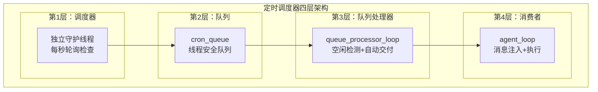
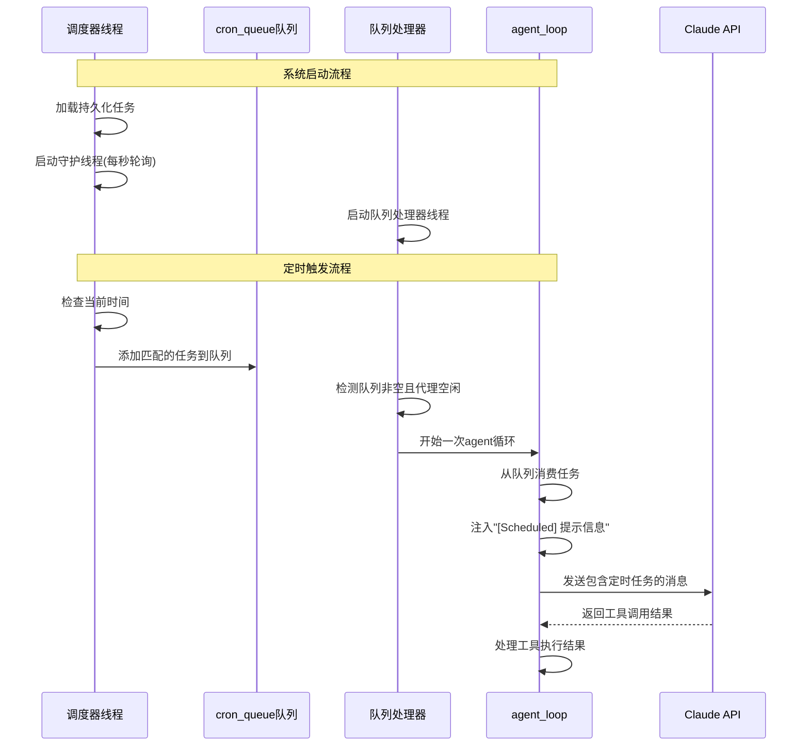
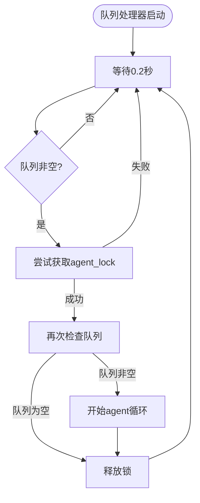
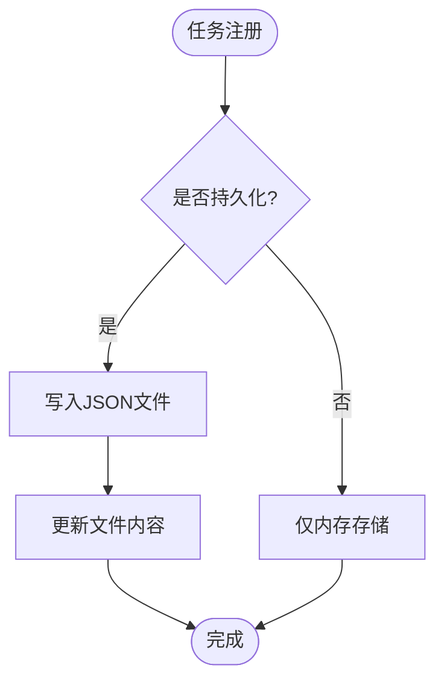
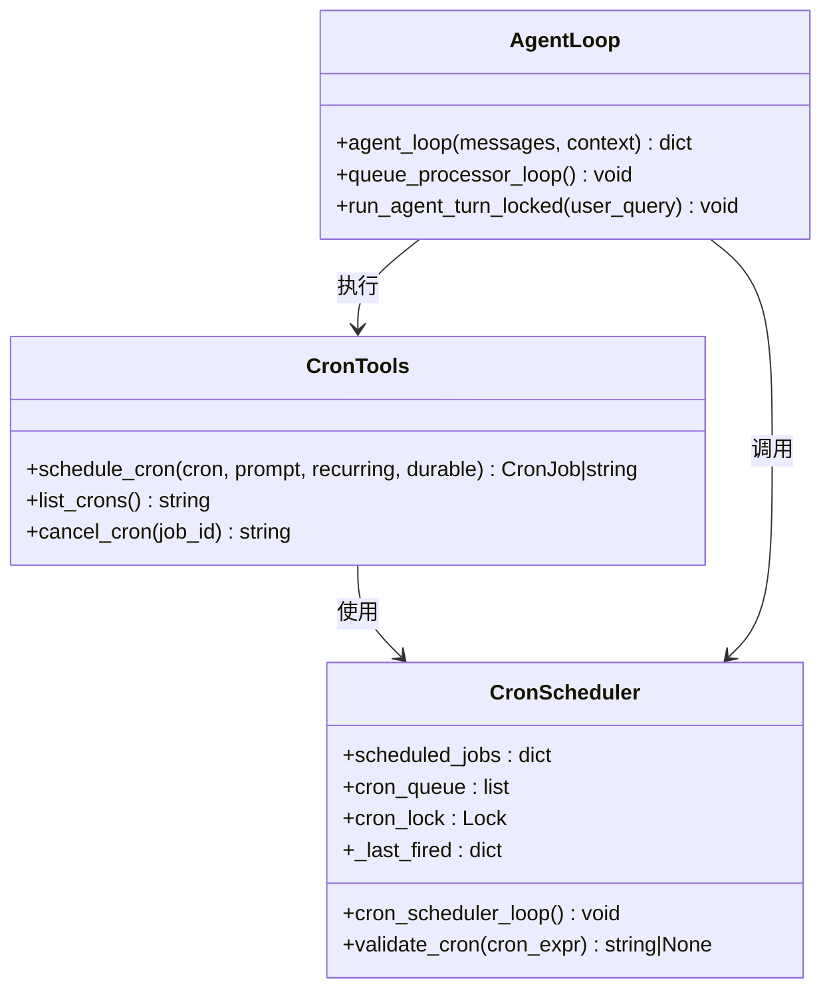
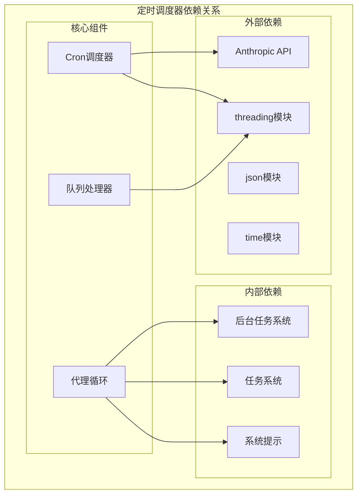

# 定时调度器

<cite>
**本文档引用的文件**
- [s14_cron_scheduler/code.py](file://s14_cron_scheduler/code.py)
- [s14_cron_scheduler/README.en.md](file://s14_cron_scheduler/README.en.md)
- [s13_background_tasks/code.py](file://s13_background_tasks/code.py)
- [s13_background_tasks/README.en.md](file://s13_background_tasks/README.en.md)
- [s12_task_system/code.py](file://s12_task_system/code.py)
- [s10_system_prompt/code.py](file://s10_system_prompt/code.py)
</cite>

## 目录
1. [简介](#简介)
2. [项目结构](#项目结构)
3. [核心组件](#核心组件)
4. [架构概览](#架构概览)
5. [详细组件分析](#详细组件分析)
6. [依赖关系分析](#依赖关系分析)
7. [性能考虑](#性能考虑)
8. [故障排除指南](#故障排除指南)
9. [结论](#结论)

## 简介

定时调度器（Cron Scheduler）是学习型代理系统中的一个关键组件，它为代理提供了自动化的周期性任务执行能力。该系统基于经典的Unix cron表达式语法，实现了独立的调度线程、队列处理机制和智能的队列处理器，使得代理能够在预定的时间自动执行任务，而无需人工干预。

定时调度器的核心价值在于：
- **自动化执行**：无需用户手动触发，系统在指定时间自动执行任务
- **持久化存储**：支持作业定义的持久化，重启后仍能正常执行
- **解耦设计**：调度、队列、执行三个层次完全分离
- **错误隔离**：单个作业失败不会影响整个调度系统的运行

## 项目结构

定时调度器位于学习型代理系统的第14个阶段，与前后相邻的模块形成了完整的学习路径：

```mermaid
graph TB
subgraph "学习路径"
S01[s01_agent_loop<br/>基础代理循环]
S02[s02_tool_use<br/>工具使用]
S03[s03_permission<br/>权限控制]
S04[s04_hooks<br/>钩子机制]
S05[s05_todo_write<br/>待办事项]
S06[s06_subagent<br/>子代理]
S07[s07_skill_loading<br/>技能加载]
S08[s08_context_compact<br/>上下文压缩]
S09[s09_memory<br/>记忆系统]
S10[s10_system_prompt<br/>系统提示]
S11[s11_error_recovery<br/>错误恢复]
S12[s12_task_system<br/>任务系统]
S13[s13_background_tasks<br/>后台任务]
S14[s14_cron_scheduler<br/>定时调度器]
S15[s15_agent_teams<br/>代理团队]
end
S01 --> S02 --> S03 --> S04 --> S05 --> S06 --> S07 --> S08 --> S09 --> S10 --> S11 --> S12 --> S13 --> S14 --> S15
```



**图表来源**
- [s14_cron_scheduler/README.en.md:1-306](file://s14_cron_scheduler/README.en.md#L1-L306)

**章节来源**
- [s14_cron_scheduler/README.en.md:1-306](file://s14_cron_scheduler/README.en.md#L1-L306)

## 核心组件

定时调度器系统由四个主要层次组成，每个层次都有明确的职责和边界：

### 四层架构模型



**图表来源**
- [s14_cron_scheduler/README.en.md:39-48](file://s14_cron_scheduler/README.en.md#L39-L48)

### CronJob 数据结构

每个定时任务都封装在一个 `CronJob` 对象中，包含以下关键属性：

| 属性名 | 类型 | 描述 | 默认值 |
|--------|------|------|--------|
| id | string | 任务唯一标识符 | 自动生成 |
| cron | string | 5字段cron表达式 | 必填 |
| prompt | string | 触发时注入的消息内容 | 必填 |
| recurring | boolean | 是否重复执行 | True |
| durable | boolean | 是否持久化存储 | True |

**章节来源**
- [s14_cron_scheduler/code.py:351-365](file://s14_cron_scheduler/code.py#L351-L365)
- [s14_cron_scheduler/README.en.md:50-62](file://s14_cron_scheduler/README.en.md#L50-L62)

## 架构概览

定时调度器采用事件驱动的设计模式，通过线程间通信实现松耦合的系统架构：



**图表来源**
- [s14_cron_scheduler/README.en.md:190-212](file://s14_cron_scheduler/README.en.md#L190-L212)
- [s14_cron_scheduler/code.py:519-562](file://s14_cron_scheduler/code.py#L519-L562)

## 详细组件分析

### 1. 独立调度器线程

调度器线程是整个系统的核心，负责监控时间并触发相应的任务：

#### 关键特性
- **独立守护线程**：不依赖于agent_loop的执行状态
- **1秒精度轮询**：精确到分钟级别的调度精度
- **日期感知标记**：防止同分钟内重复触发
- **异常隔离**：单个作业异常不影响整体调度

#### 时间匹配算法

```mermaid
flowchart TD
Start([开始调度检查]) --> GetTime[获取当前时间]
GetTime --> CreateMarker[创建"YYYY-MM-DD HH:MM"标记]
CreateMarker --> IterateJobs[遍历所有已注册作业]
IterateJobs --> CheckJob{检查作业}
CheckJob --> |匹配| AddToQueue[添加到cron_queue]
CheckJob --> |不匹配| NextJob[下一个作业]
AddToQueue --> UpdateMarker[更新最后触发标记]
UpdateMarker --> CheckRecurring{是否重复作业}
CheckRecurring --> |否| RemoveJob[移除作业]
CheckRecurring --> |是| NextJob
RemoveJob --> SaveDurable[保存持久化作业]
SaveDurable --> NextJob
NextJob --> Done([完成一轮检查])
```

**图表来源**
- [s14_cron_scheduler/code.py:519-543](file://s14_cron_scheduler/code.py#L519-L543)

**章节来源**
- [s14_cron_scheduler/code.py:519-543](file://s14_cron_scheduler/code.py#L519-L543)
- [s14_cron_scheduler/README.en.md:108-137](file://s14_cron_scheduler/README.en.md#L108-L137)

### 2. cron_queue 队列系统

队列系统采用线程安全的列表实现，提供生产者-消费者模式：

#### 设计特点
- **线程安全**：使用 `cron_lock` 保护队列访问
- **无阻塞设计**：调度器和队列处理器使用非阻塞锁
- **原子操作**：消费时清空队列，避免重复处理

#### 队列操作接口

| 函数名 | 功能描述 | 线程安全性 |
|--------|----------|------------|
| `consume_cron_queue()` | 消费队列中的所有作业 | 线程安全 |
| `has_cron_queue()` | 检查队列是否为空 | 线程安全 |
| `cron_scheduler_loop()` | 调度器写入作业 | 线程安全 |

**章节来源**
- [s14_cron_scheduler/code.py:545-557](file://s14_cron_scheduler/code.py#L545-L557)
- [s14_cron_scheduler/code.py:360-365](file://s14_cron_scheduler/code.py#L360-L365)

### 3. 队列处理器

队列处理器确保只有在代理空闲时才进行任务交付：

#### 核心机制
- **空闲检测**：使用 `agent_lock` 检测代理状态
- **非阻塞轮询**：每0.2秒检查一次队列状态
- **原子交付**：获取锁后立即检查队列，避免竞争条件

#### 自动交付流程



**图表来源**
- [s14_cron_scheduler/code.py:774-790](file://s14_cron_scheduler/code.py#L774-L790)

**章节来源**
- [s14_cron_scheduler/code.py:774-790](file://s14_cron_scheduler/code.py#L774-L790)

### 4. Cron 表达式解析

系统支持标准的5字段cron表达式，遵循Unix传统：

#### 支持的语法

| 语法 | 描述 | 示例 | 说明 |
|------|------|------|------|
| `*` | 任意值 | `*` | 每分钟/小时/日等 |
| `*/N` | 步长 | `*/5` | 每5分钟 |
| `N` | 具体值 | `15` | 第15分钟 |
| `N-M` | 范围 | `9-17` | 9点到17点 |
| `N,M,...` | 列表 | `1,15,30` | 1、15、30分钟 |

#### 特殊语义
- **DOM和DOW逻辑**：当月日和星期同时约束时使用OR逻辑
- **字段范围**：分钟(0-59)、小时(0-23)、日(1-31)、月(1-12)、星期(0-6)

**章节来源**
- [s14_cron_scheduler/code.py:383-411](file://s14_cron_scheduler/code.py#L383-L411)
- [s14_cron_scheduler/README.en.md:76-106](file://s14_cron_scheduler/README.en.md#L76-L106)

### 5. 持久化存储

系统提供两种存储模式以满足不同需求：

#### 存储类型对比

| 特性 | 会话存储 | 持久化存储 |
|------|----------|------------|
| 存储位置 | 内存中的字典 | `.scheduled_tasks.json` 文件 |
| 生命周期 | 进程运行期间 | 跨进程持久化 |
| 启动恢复 | 不支持 | 支持自动加载 |
| 适用场景 | 临时测试任务 | 生产环境任务 |

#### 持久化策略



**图表来源**
- [s14_cron_scheduler/code.py:462-486](file://s14_cron_scheduler/code.py#L462-L486)

**章节来源**
- [s14_cron_scheduler/code.py:462-486](file://s14_cron_scheduler/code.py#L462-L486)
- [s14_cron_scheduler/README.en.md:183-189](file://s14_cron_scheduler/README.en.md#L183-L189)

### 6. 工具集成

定时调度器通过新增的工具函数与代理系统深度集成：

#### 新增工具函数

| 工具名 | 参数 | 功能描述 | 返回值 |
|--------|------|----------|--------|
| `schedule_cron` | cron, prompt, recurring, durable | 注册新的定时任务 | CronJob对象或错误信息 |
| `list_crons` | 无 | 列出所有已注册任务 | 任务列表字符串 |
| `cancel_cron` | job_id | 取消指定任务 | 取消结果字符串 |

#### 工具集成方式



**图表来源**
- [s14_cron_scheduler/code.py:567-591](file://s14_cron_scheduler/code.py#L567-L591)
- [s14_cron_scheduler/code.py:595-662](file://s14_cron_scheduler/code.py#L595-L662)

**章节来源**
- [s14_cron_scheduler/code.py:567-591](file://s14_cron_scheduler/code.py#L567-L591)
- [s14_cron_scheduler/code.py:595-662](file://s14_cron_scheduler/code.py#L595-L662)

## 依赖关系分析

定时调度器与系统其他模块存在紧密的依赖关系，形成了清晰的层次化架构：



**图表来源**
- [s14_cron_scheduler/code.py:25-47](file://s14_cron_scheduler/code.py#L25-L47)
- [s14_cron_scheduler/code.py:258-263](file://s14_cron_scheduler/code.py#L258-L263)

### 组件耦合度分析

| 组件 | 耦合类型 | 说明 | 影响程度 |
|------|----------|------|----------|
| CronScheduler | 内聚高 | 专注于调度功能，职责单一 | 低 |
| QueueProcessor | 内聚中等 | 依赖调度器和代理循环 | 中等 |
| AgentLoop | 内聚中等 | 依赖队列处理器和后台任务 | 中等 |
| 工具函数 | 内聚高 | 与调度器紧密集成 | 低 |

**章节来源**
- [s14_cron_scheduler/code.py:346-591](file://s14_cron_scheduler/code.py#L346-L591)

## 性能考虑

定时调度器在设计时充分考虑了性能优化和资源管理：

### 时间复杂度分析

| 操作 | 时间复杂度 | 说明 |
|------|------------|------|
| 调度检查 | O(n) | n为已注册作业数量 |
| 队列操作 | O(1) | 队列入队和出队 |
| 作业验证 | O(1) | 固定5个字段的验证 |
| 持久化 | O(m) | m为持久化作业数量 |

### 内存使用优化

- **延迟加载**：只在需要时加载持久化作业
- **增量更新**：仅更新变化的作业状态
- **内存池**：复用CronJob对象减少GC压力

### 并发性能

- **无阻塞设计**：使用非阻塞锁避免死锁
- **原子操作**：队列消费时的原子性保证
- **线程安全**：所有共享数据结构都使用锁保护

## 故障排除指南

### 常见问题及解决方案

#### 1. 作业未触发

**症状**：设置了定时任务但未被执行

**排查步骤**：
1. 检查cron表达式格式是否正确
2. 验证系统时间设置
3. 确认代理处于空闲状态
4. 查看调度器日志输出

**解决方案**：
- 使用 `list_crons` 工具确认作业已注册
- 检查作业的 `durable` 设置
- 验证作业的 `recurring` 属性

#### 2. 调度器线程异常退出

**症状**：调度器停止工作

**排查步骤**：
1. 检查Python环境和依赖安装
2. 验证API密钥配置
3. 查看系统资源使用情况

**解决方案**：
- 确保使用守护线程启动
- 检查异常处理机制
- 验证文件权限

#### 3. 队列处理器无法交付

**症状**：作业被调度但未执行

**排查步骤**：
1. 检查 `agent_lock` 的获取状态
2. 验证代理循环的空闲检测
3. 确认队列处理器的轮询间隔

**解决方案**：
- 调整轮询间隔参数
- 检查锁的使用方式
- 验证线程同步机制

### 调试技巧

#### 日志分析
- 调度器输出：`[cron fire]` 标识作业触发
- 队列处理器输出：`[queue processor]` 标识自动交付
- 代理循环输出：`[inject cron]` 标识消息注入

#### 性能监控
- 监控队列长度变化
- 跟踪作业执行时间
- 分析调度精度偏差

**章节来源**
- [s14_cron_scheduler/code.py:520-543](file://s14_cron_scheduler/code.py#L520-L543)
- [s14_cron_scheduler/code.py:774-790](file://s14_cron_scheduler/code.py#L774-L790)

## 结论

定时调度器系统通过精心设计的四层架构，成功解决了代理系统中自动化任务执行的核心问题。其主要优势包括：

### 技术优势
- **解耦设计**：四个层次职责明确，便于维护和扩展
- **线程安全**：完善的并发控制机制
- **持久化支持**：跨进程的任务状态保持
- **错误隔离**：单个组件故障不影响整体系统

### 实际应用价值
- **自动化运维**：定期执行系统监控、备份等任务
- **数据采集**：定时抓取外部数据源信息
- **报告生成**：自动生成日报、周报等统计报告
- **系统维护**：执行清理、优化等维护任务

### 发展前景
随着代理系统复杂度的增加，定时调度器可以进一步扩展：
- 支持更复杂的调度策略（如优先级队列）
- 增强监控和告警机制
- 提供Web界面进行可视化管理
- 集成分布式调度能力

定时调度器不仅是一个功能模块，更是学习型代理系统智能化演进的重要里程碑，为后续的代理团队协作和复杂任务编排奠定了坚实基础。