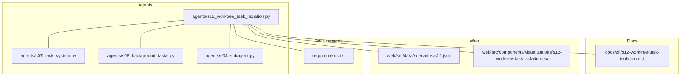
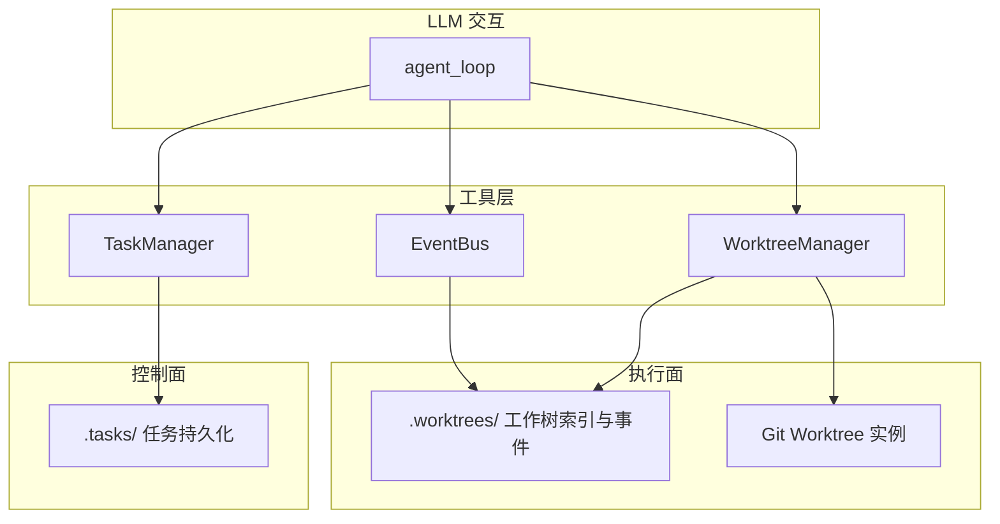
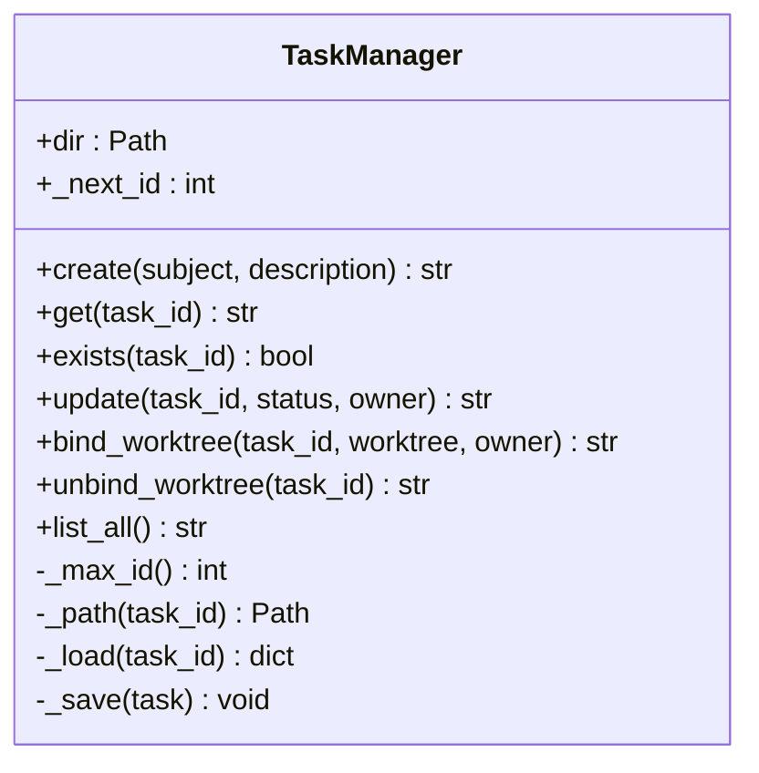
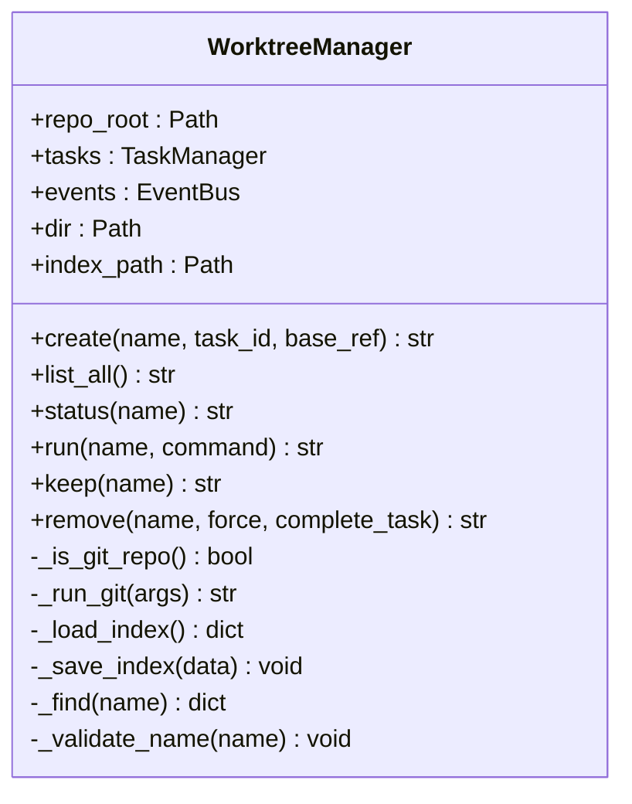
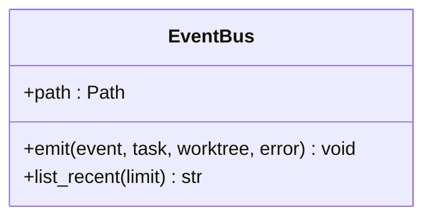
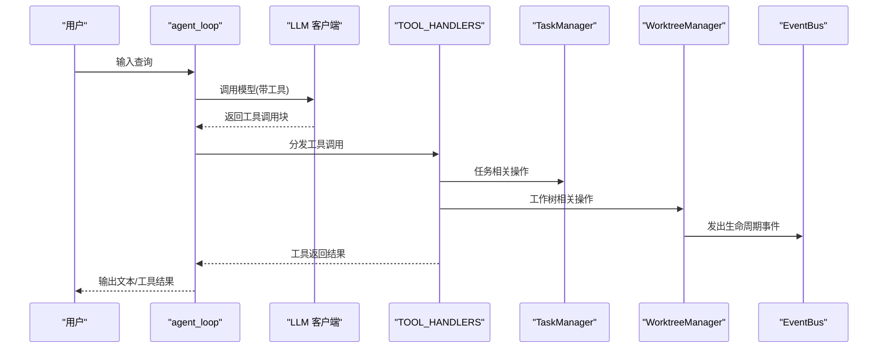
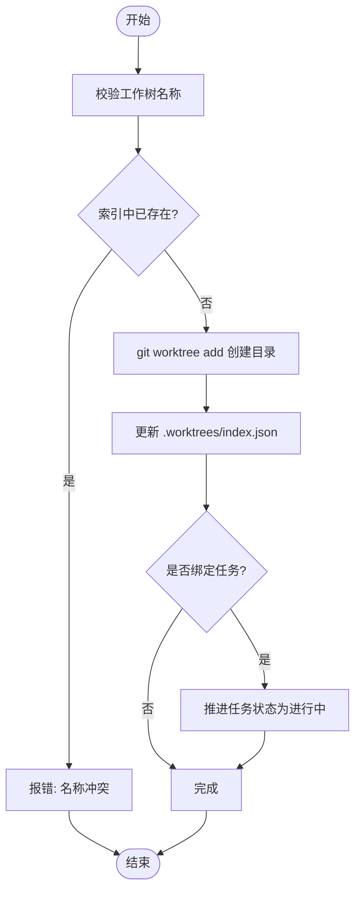
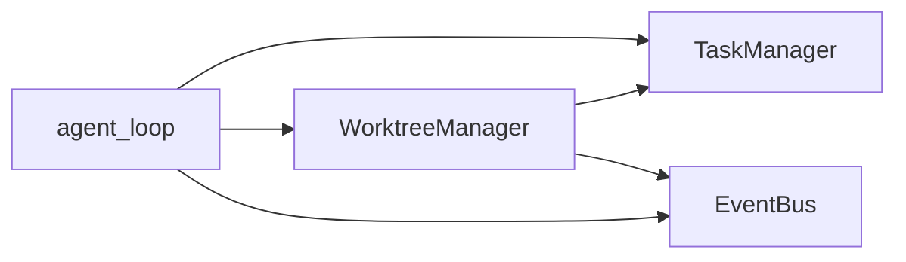

# 工作树隔离机制

<cite>
**本文引用的文件**
- [s12_worktree_task_isolation.py](file://agents/s12_worktree_task_isolation.py)
- [s12-worktree-task-isolation.md](file://docs/zh/s12-worktree-task-isolation.md)
- [s07_task_system.py](file://agents/s07_task_system.py)
- [s08_background_tasks.py](file://agents/s08_background_tasks.py)
- [s04_subagent.py](file://agents/s04_subagent.py)
- [s12.json](file://web/src/data/scenarios/s12.json)
- [s12-worktree-task-isolation.tsx](file://web/src/components/visualizations/s12-worktree-task-isolation.tsx)
- [requirements.txt](file://requirements.txt)
</cite>

## 目录
1. [简介](#简介)
2. [项目结构](#项目结构)
3. [核心组件](#核心组件)
4. [架构总览](#架构总览)
5. [详细组件分析](#详细组件分析)
6. [依赖关系分析](#依赖关系分析)
7. [性能考量](#性能考量)
8. [故障排查指南](#故障排查指南)
9. [结论](#结论)
10. [附录](#附录)

## 简介
本文件面向 s12 版本“工作树 + 任务隔离”机制，系统化阐述如何通过“任务协调 + 工作树执行”的双平面设计实现多任务并行执行的目录级隔离与可观测性。重点覆盖：
- 为每个任务分配独立工作树目录，避免资源冲突
- 隔离执行通道的设计：文件系统隔离、进程隔离与网络隔离策略
- 任务边界管理：资源限制、权限控制与清理机制
- 多任务并发执行的同步策略：锁机制与冲突解决
- 隔离级别配置：强隔离与弱隔离模式的选择建议
- 安全最佳实践与性能影响分析

## 项目结构
围绕 s12 的核心文件组织如下：
- agents/s12_worktree_task_isolation.py：工作树隔离的完整实现（任务管理、工作树管理、事件总线、工具集）
- docs/zh/s12-worktree-task-isolation.md：中文文档，解释工作原理与生命周期
- agents/s07_task_system.py：任务系统基础（持久化任务板），为 s12 提供任务协调能力
- agents/s08_background_tasks.py：后台任务并发执行（线程池 + 通知队列），为 s12 的并行执行提供参考
- agents/s04_subagent.py：上下文隔离示例（进程隔离），为理解隔离策略提供背景
- web/src/data/scenarios/s12.json：教学场景数据，展示工作流步骤
- web/src/components/visualizations/s12-worktree-task-isolation.tsx：可视化组件，直观呈现隔离流程
- requirements.txt：运行依赖

图表来源
- [s12_worktree_task_isolation.py:1-783](file://agents/s12_worktree_task_isolation.py#L1-L783)
- [s07_task_system.py:1-244](file://agents/s07_task_system.py#L1-L244)
- [s08_background_tasks.py:1-235](file://agents/s08_background_tasks.py#L1-L235)
- [s04_subagent.py:1-188](file://agents/s04_subagent.py#L1-L188)
- [s12-worktree-task-isolation.md:1-124](file://docs/zh/s12-worktree-task-isolation.md#L1-L124)
- [s12.json:1-52](file://web/src/data/scenarios/s12.json#L1-L52)
- [s12-worktree-task-isolation.tsx:1-279](file://web/src/components/visualizations/s12-worktree-task-isolation.tsx#L1-L279)
- [requirements.txt:1-3](file://requirements.txt#L1-L3)

章节来源
- [s12_worktree_task_isolation.py:1-783](file://agents/s12_worktree_task_isolation.py#L1-L783)
- [s07_task_system.py:1-244](file://agents/s07_task_system.py#L1-L244)
- [s08_background_tasks.py:1-235](file://agents/s08_background_tasks.py#L1-L235)
- [s04_subagent.py:1-188](file://agents/s04_subagent.py#L1-L188)
- [s12-worktree-task-isolation.md:1-124](file://docs/zh/s12-worktree-task-isolation.md#L1-L124)
- [s12.json:1-52](file://web/src/data/scenarios/s12.json#L1-L52)
- [s12-worktree-task-isolation.tsx:1-279](file://web/src/components/visualizations/s12-worktree-task-isolation.tsx#L1-L279)
- [requirements.txt:1-3](file://requirements.txt#L1-L3)

## 核心组件
- 任务管理器（TaskManager）：持久化任务状态，支持创建、查询、更新、列表等；维护任务依赖图与阻塞关系
- 工作树管理器（WorktreeManager）：基于 Git Worktree 创建/列出/运行/删除工作树；维护索引与生命周期事件
- 事件总线（EventBus）：以追加日志形式记录工作树生命周期事件，用于可观测性与审计
- 工具集（TOOLS/TOOL_HANDLERS）：封装 bash、文件读写、任务与工作树相关工具，统一输入输出与错误处理
- 代理循环（agent_loop）：与 LLM 交互，按工具调用结果驱动状态流转

章节来源
- [s12_worktree_task_isolation.py:122-221](file://agents/s12_worktree_task_isolation.py#L122-L221)
- [s12_worktree_task_isolation.py:225-474](file://agents/s12_worktree_task_isolation.py#L225-L474)
- [s12_worktree_task_isolation.py:83-119](file://agents/s12_worktree_task_isolation.py#L83-L119)
- [s12_worktree_task_isolation.py:536-726](file://agents/s12_worktree_task_isolation.py#L536-L726)
- [s12_worktree_task_isolation.py:729-783](file://agents/s12_worktree_task_isolation.py#L729-L783)

## 架构总览
s12 将“控制面（任务）”与“执行面（工作树）”分离：
- 控制面：.tasks/ 目录中持久化任务状态，任务 ID 作为跨组件的唯一标识
- 执行面：.worktrees/ 目录中管理 Git Worktree，每个任务对应一个独立工作树目录
- 生命周期：通过事件总线记录关键事件，便于审计与恢复

图表来源
- [s12_worktree_task_isolation.py:225-474](file://agents/s12_worktree_task_isolation.py#L225-L474)
- [s12_worktree_task_isolation.py:83-119](file://agents/s12_worktree_task_isolation.py#L83-L119)
- [s12_worktree_task_isolation.py:729-783](file://agents/s12_worktree_task_isolation.py#L729-L783)

## 详细组件分析

### 任务管理器（TaskManager）
职责与特性：
- 任务持久化：以 JSON 文件形式存储任务，包含状态、阻塞关系、拥有者等
- 任务生命周期：支持创建、查询、更新（含状态推进）、列表
- 依赖管理：自动清理已完成任务在其他任务 blockedBy 列表中的引用
- 与工作树绑定：当工作树创建并绑定任务时，任务状态推进为进行中

图表来源
- [s12_worktree_task_isolation.py:122-221](file://agents/s12_worktree_task_isolation.py#L122-L221)

章节来源
- [s12_worktree_task_isolation.py:122-221](file://agents/s12_worktree_task_isolation.py#L122-L221)
- [s07_task_system.py:47-121](file://agents/s07_task_system.py#L47-L121)

### 工作树管理器（WorktreeManager）
职责与特性：
- 基于 Git Worktree 的创建/删除/运行/状态查询
- 工作树索引：维护 .worktrees/index.json，记录名称、路径、分支、任务绑定、状态
- 生命周期事件：在创建/删除/保持等关键节点发出事件，便于审计
- 命令执行：在指定工作树目录下执行命令，设置超时与危险命令拦截
- 与任务解耦：工作树可先创建再绑定任务，或直接创建时绑定

图表来源
- [s12_worktree_task_isolation.py:225-474](file://agents/s12_worktree_task_isolation.py#L225-L474)

章节来源
- [s12_worktree_task_isolation.py:225-474](file://agents/s12_worktree_task_isolation.py#L225-L474)

### 事件总线（EventBus）
职责与特性：
- 追加日志：以 events.jsonl 记录事件，包含事件名、时间戳、任务与工作树上下文、错误信息
- 生命周期可见性：提供最近事件查询接口，便于调试与审计
- 事件类型：worktree.create.before/after/failed、worktree.remove.before/after/failed、worktree.keep、task.completed

图表来源
- [s12_worktree_task_isolation.py:83-119](file://agents/s12_worktree_task_isolation.py#L83-L119)

章节来源
- [s12_worktree_task_isolation.py:83-119](file://agents/s12_worktree_task_isolation.py#L83-L119)

### 工具集与代理循环
职责与特性：
- 工具集：封装 bash、文件读写、任务与工作树相关工具，统一输入校验与错误处理
- 代理循环：与 LLM 交互，按工具调用结果注入消息，形成闭环
- 安全：内置危险命令拦截与路径逃逸检测

图表来源
- [s12_worktree_task_isolation.py:536-726](file://agents/s12_worktree_task_isolation.py#L536-L726)
- [s12_worktree_task_isolation.py:729-783](file://agents/s12_worktree_task_isolation.py#L729-L783)

章节来源
- [s12_worktree_task_isolation.py:536-726](file://agents/s12_worktree_task_isolation.py#L536-L726)
- [s12_worktree_task_isolation.py:729-783](file://agents/s12_worktree_task_isolation.py#L729-L783)

### 并发执行与同步策略
- 并发参考：s08 的后台任务采用守护线程 + 通知队列，实现非阻塞并行；s12 的工作树执行通过独立目录与事件总线实现“并行不争”，无需全局锁
- 冲突解决：工作树命名与索引确保同一时间不会出现同名工作树；任务与工作树绑定通过任务状态推进避免重复占用
- 锁机制：工作树索引读写使用文件级原子写入；事件总线采用追加写，天然具备顺序一致性

图表来源
- [s12_worktree_task_isolation.py:284-336](file://agents/s12_worktree_task_isolation.py#L284-L336)

章节来源
- [s08_background_tasks.py:50-111](file://agents/s08_background_tasks.py#L50-L111)
- [s12_worktree_task_isolation.py:284-336](file://agents/s12_worktree_task_isolation.py#L284-L336)

### 隔离级别与安全策略
- 文件系统隔离：每个任务在独立工作树目录执行，避免文件冲突
- 进程隔离：s04 的子代理示例展示了进程隔离带来的上下文隔离；s12 通过独立目录与事件总线实现“逻辑隔离”
- 网络隔离：当前实现未显式引入网络命名空间或容器隔离；可通过外部环境变量或容器化部署实现
- 权限控制：路径解析严格限制在工作目录内，危险命令拦截，超时保护
- 清理机制：支持 keep（保留）与 remove（删除）两种收尾方式，并在删除时可选完成绑定任务并发出事件

章节来源
- [s12_worktree_task_isolation.py:478-522](file://agents/s12_worktree_task_isolation.py#L478-L522)
- [s12_worktree_task_isolation.py:368-393](file://agents/s12_worktree_task_isolation.py#L368-L393)
- [s12_worktree_task_isolation.py:394-447](file://agents/s12_worktree_task_isolation.py#L394-L447)
- [s04_subagent.py:1-24](file://agents/s04_subagent.py#L1-L24)

### 配置选项与使用建议
- 强隔离模式：使用独立工作树目录 + 事件总线审计；适合高风险变更与多团队协作
- 弱隔离模式：在同一工作树内按分支/标签区分任务；适合低风险快速迭代
- 选择建议：高风险/跨团队/需要审计时优先强隔离；低风险/快速验证时可考虑弱隔离

章节来源
- [s12-worktree-task-isolation.md:1-124](file://docs/zh/s12-worktree-task-isolation.md#L1-L124)
- [s12.json:1-52](file://web/src/data/scenarios/s12.json#L1-L52)

## 依赖关系分析
- 运行时依赖：anthropic、python-dotenv、pyyaml
- 组件间耦合：WorktreeManager 依赖 TaskManager 与 EventBus；工具层统一调度三者
- 外部依赖：Git 命令行工具（git worktree、status 等）

图表来源
- [s12_worktree_task_isolation.py:729-783](file://agents/s12_worktree_task_isolation.py#L729-L783)
- [s12_worktree_task_isolation.py:225-474](file://agents/s12_worktree_task_isolation.py#L225-L474)

章节来源
- [requirements.txt:1-3](file://requirements.txt#L1-L3)
- [s12_worktree_task_isolation.py:40-49](file://agents/s12_worktree_task_isolation.py#L40-L49)

## 性能考量
- I/O 开销：Git Worktree 创建/删除涉及磁盘与 Git 数据库操作，建议批量操作与合理缓存索引
- 并发度：s12 通过目录隔离实现“并行不争”，无需全局锁；后台任务可参考 s08 的守护线程模式提升吞吐
- 超时与安全：命令执行设置超时，危险命令拦截，降低长尾风险
- 观测成本：事件总线采用追加写，开销较低；索引读写需注意原子性与一致性

章节来源
- [s12_worktree_task_isolation.py:368-393](file://agents/s12_worktree_task_isolation.py#L368-L393)
- [s08_background_tasks.py:50-111](file://agents/s08_background_tasks.py#L50-L111)

## 故障排查指南
常见问题与定位方法：
- 工作树不存在：检查 .worktrees/index.json 与实际目录是否存在
- 命令执行失败：查看事件日志 events.jsonl，确认 before/after/failed 事件
- 路径逃逸/危险命令：safe_path 与危险命令拦截会抛出错误提示
- Git 不可用：若不在 Git 仓库，工作树工具会返回错误

章节来源
- [s12_worktree_task_isolation.py:351-367](file://agents/s12_worktree_task_isolation.py#L351-L367)
- [s12_worktree_task_isolation.py:485-501](file://agents/s12_worktree_task_isolation.py#L485-L501)
- [s12_worktree_task_isolation.py:250-263](file://agents/s12_worktree_task_isolation.py#L250-L263)

## 结论
s12 通过“任务协调 + 工作树执行”的双平面设计，在不引入复杂容器或网络隔离的前提下，实现了高效的目录级隔离与可观测性。其核心优势在于：
- 以任务 ID 为纽带，将控制面与执行面解耦
- 以工作树为执行单元，天然避免资源冲突
- 以事件总线为审计通道，提供可追溯的生命周期记录
- 在安全与性能之间取得平衡：强隔离保障安全，弱隔离提升效率

## 附录
- 教学场景与可视化：通过场景数据与可视化组件，可直观理解从任务创建到工作树执行再到收尾的全流程
- 参考实现：s07 的任务系统、s08 的后台并发、s04 的进程隔离，均为理解 s12 设计提供了良好背景

章节来源
- [s12.json:1-52](file://web/src/data/scenarios/s12.json#L1-L52)
- [s12-worktree-task-isolation.tsx:38-143](file://web/src/components/visualizations/s12-worktree-task-isolation.tsx#L38-L143)