# 综合集成

<cite>
**本文档引用的文件**
- [README.md](file://README.md)
- [requirements.txt](file://requirements.txt)
- [s01_agent_loop/code.py](file://s01_agent_loop/code.py)
- [s02_tool_use/code.py](file://s02_tool_use/code.py)
- [s07_skill_loading/code.py](file://s07_skill_loading/code.py)
- [s08_context_compact/code.py](file://s08_context_compact/code.py)
- [s12_task_system/code.py](file://s12_task_system/code.py)
- [s15_agent_teams/code.py](file://s15_agent_teams/code.py)
- [s20_comprehensive/code.py](file://s20_comprehensive/code.py)
- [agents/s_full.py](file://agents/s_full.py)
- [skills/agent-builder/SKILL.md](file://skills/agent-builder/SKILL.md)
- [web/package.json](file://web/package.json)
- [web/next.config.ts](file://web/next.config.ts)
- [web/src/lib/constants.ts](file://web/src/lib/constants.ts)
- [web/src/types/agent-data.ts](file://web/src/types/agent-data.ts)
- [web/src/app/page.tsx](file://web/src/app/page.tsx)
- [docs/en/s01-the-agent-loop.md](file://docs/en/s01-the-agent-loop.md)
- [docs/en/s02-tool-use.md](file://docs/en/s02-tool-use.md)
- [s08_context_compact/README.md](file://s08_context_compact/README.md)
- [s07_skill_loading/README.md](file://s07_skill_loading/README.md)
</cite>

## 更新摘要
**所做更改**
- 更新了上下文压缩机制部分，反映了最新的压缩策略改进
- 增强了TodoWrite输入处理的描述，体现了新的输入验证和处理能力
- 完善了综合编排系统的架构说明，突出了最新的编排能力增强

## 目录
1. [简介](#简介)
2. [项目结构](#项目结构)
3. [核心组件](#核心组件)
4. [架构总览](#架构总览)
5. [详细组件分析](#详细组件分析)
6. [依赖关系分析](#依赖关系分析)
7. [性能考虑](#性能考虑)
8. [故障排除指南](#故障排除指南)
9. [结论](#结论)
10. [附录](#附录)

## 简介
本仓库是"学习 Claude Code"系列教程的完整代码库，系统性地展示了如何构建一个可扩展、可组合的智能体编排系统。该系统以"代理循环"为核心，围绕它逐步叠加权限控制、钩子扩展、计划管理、子代理隔离、技能按需加载、上下文压缩、任务图谱、后台任务、团队协作、协议规范、自治代理、工作树隔离以及 MCP 外部能力路由等机制，最终形成一个"所有机制围绕一个循环"的完整编排框架。

该项目强调"代理能力来自模型训练，编排来自工程"，通过精心设计的"工具 + 知识 + 观察 + 行动接口 + 权限"组合，为大型语言模型提供在真实环境中感知、推理与行动的能力边界与执行环境。

**更新** 本版本集成了最新的上下文压缩改进和TodoWrite输入处理增强，提供了更完整的代理系统编排能力。

## 项目结构
仓库采用"章节式教学 + 参考实现 + Web 平台"的多轨并行结构：

- 根目录 s01–s20：每个章节包含完整的叙事 README、多语言翻译、可运行的 code.py 示例与必要的图片资源
- agents/：旧版 12 讲课程的参考实现与 s_full.py
- skills/：按需加载的技能目录，每个技能包含 SKILL.md
- docs/：英文/日文/中文章节文档
- web/：基于 Next.js 的可视化学习平台，展示版本演进、可视化流程与模拟器
- tests/：基础测试用例
- requirements.txt：Python 依赖清单

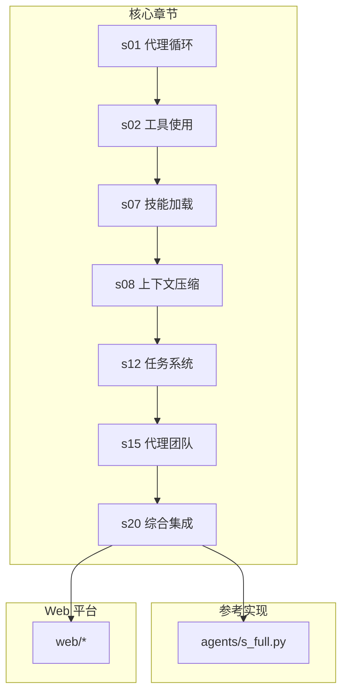

**图表来源**
- [README.md: 383-403:383-403](file://README.md#L383-L403)
- [s01_agent_loop/code.py: 1-138:1-138](file://s01_agent_loop/code.py#L1-L138)
- [s02_tool_use/code.py: 1-190:1-190](file://s02_tool_use/code.py#L1-L190)
- [s07_skill_loading/code.py: 1-412:1-412](file://s07_skill_loading/code.py#L1-L412)
- [s08_context_compact/code.py: 1-800:1-800](file://s08_context_compact/code.py#L1-L800)
- [s12_task_system/code.py: 1-377:1-377](file://s12_task_system/code.py#L1-L377)
- [s15_agent_teams/code.py: 1-930:1-930](file://s15_agent_teams/code.py#L1-L930)
- [s20_comprehensive/code.py: 1-800:1-800](file://s20_comprehensive/code.py#L1-L800)
- [agents/s_full.py: 1-741:1-741](file://agents/s_full.py#L1-L741)
- [web/package.json: 1-39:1-39](file://web/package.json#L1-L39)

**章节来源**
- [README.md: 383-403:383-403](file://README.md#L383-L403)
- [README.md: 255-301:255-301](file://README.md#L255-L301)

## 核心组件
本节从"代理循环"出发，梳理贯穿全书的核心组件及其职责与交互方式。

- 代理循环（Agent Loop）
  - 单一职责：持续向模型提交消息与可用工具，根据 stop_reason 决定是否继续调用工具
  - 关键点：循环不变，所有机制都围绕此循环进行扩展
- 工具层（Tools）
  - bash、read_file、write_file、edit_file、glob 等原子能力
  - 通过 TOOL_HANDLERS 映射工具名到处理器函数，支持路径沙箱与错误处理
- 计划与记忆（Planning & Memory）
  - TodoWrite：会话内任务跟踪与提醒，支持增强的输入验证和处理
  - 技能加载：两层注入（系统提示中的目录 + 按需加载的技能内容）
  - 上下文压缩：微压缩、自动压缩与归档，包含最新的压缩策略优化
- 任务系统（Task System）
  - 文件持久化任务记录，支持依赖图、认领与完成状态流转
- 后台任务（Background Tasks）
  - 后台线程执行慢操作，完成后通过通知队列注入历史
- 团队协作（Agent Teams）
  - 基于 JSONL 邮箱的异步通信，支持队友自组织认领任务
- 协议与自治（Protocols & Autonomous Agents）
  - 请求-响应协议（request_id）保证跨代理一致性
  - 自治代理扫描任务板、超时轮询、空闲态治理
- 工作树隔离（Worktree Isolation）
  - Git 工作树隔离，任务与工作目录绑定，事件流记录
- MCP 插件（MCP Plugin）
  - 多传输通道、频道路由与工具池组装，统一外部能力接入

**更新** 新增了上下文压缩策略优化和TodoWrite输入处理增强的详细说明。

**章节来源**
- [s01_agent_loop/code.py: 84-114:84-114](file://s01_agent_loop/code.py#L84-L114)
- [s02_tool_use/code.py: 149-170:149-170](file://s02_tool_use/code.py#L149-L170)
- [s07_skill_loading/code.py: 340-391:340-391](file://s07_skill_loading/code.py#L340-L391)
- [s08_context_compact/code.py: 1-800:1-800](file://s08_context_compact/code.py#L1-L800)
- [s12_task_system/code.py: 326-356:326-356](file://s12_task_system/code.py#L326-L356)
- [s15_agent_teams/code.py: 629-713:629-713](file://s15_agent_teams/code.py#L629-L713)
- [s20_comprehensive/code.py: 549-800:549-800](file://s20_comprehensive/code.py#L549-L800)

## 架构总览
下图展示了从基础代理循环到综合编排的整体架构，以及各机制如何围绕核心循环进行扩展。

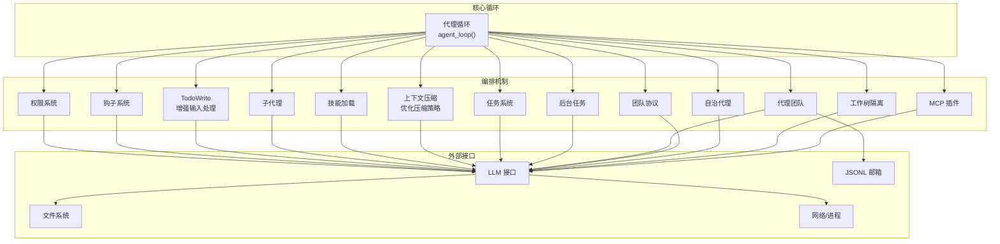

**更新** 架构图中增加了TodoWrite增强输入处理和上下文压缩优化的标识。

**图表来源**
- [s01_agent_loop/code.py: 84-114:84-114](file://s01_agent_loop/code.py#L84-L114)
- [s02_tool_use/code.py: 149-170:149-170](file://s02_tool_use/code.py#L149-L170)
- [s07_skill_loading/code.py: 340-391:340-391](file://s07_skill_loading/code.py#L340-L391)
- [s08_context_compact/code.py: 1-800:1-800](file://s08_context_compact/code.py#L1-L800)
- [s12_task_system/code.py: 326-356:326-356](file://s12_task_system/code.py#L326-L356)
- [s15_agent_teams/code.py: 629-713:629-713](file://s15_agent_teams/code.py#L629-L713)
- [s20_comprehensive/code.py: 549-800:549-800](file://s20_comprehensive/code.py#L549-L800)

## 详细组件分析

### 代理循环（Agent Loop）
- 设计思想：单一 while 循环 + stop_reason 判定，模型决定何时停止与何时继续调用工具
- 执行流程：提交 messages + tools → LLM 返回 → 若非 tool_use 则结束；否则执行工具并将结果作为用户消息追加，继续循环
- 优势：保持循环稳定，所有扩展均在循环之外进行

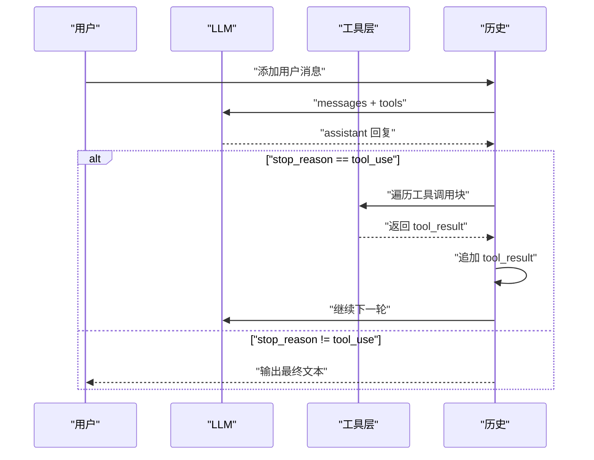

**图表来源**
- [s01_agent_loop/code.py: 84-114:84-114](file://s01_agent_loop/code.py#L84-L114)
- [docs/en/s01-the-agent-loop.md: 68-95:68-95](file://docs/en/s01-the-agent-loop.md#L68-L95)

**章节来源**
- [s01_agent_loop/code.py: 84-114:84-114](file://s01_agent_loop/code.py#L84-L114)
- [docs/en/s01-the-agent-loop.md: 1-117:1-117](file://docs/en/s01-the-agent-loop.md#L1-L117)

### 工具使用（Tool Use）
- 从单一 bash 工具扩展到多个专用工具，统一通过 TOOL_HANDLERS 进行分发
- 引入路径沙箱（safe_path）防止越权访问
- 保持 agent_loop 不变，新增工具只需注册处理器与工具定义

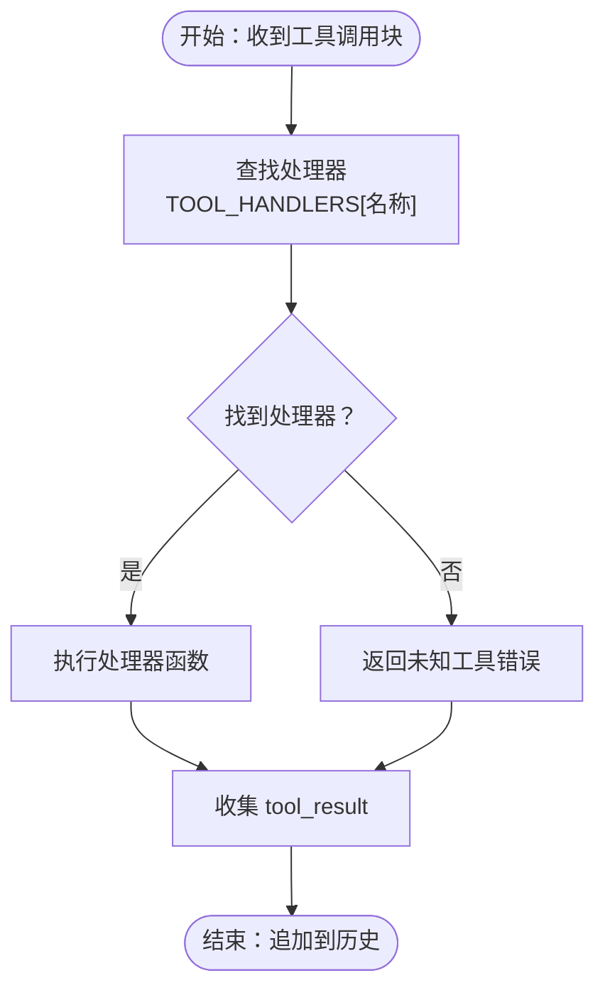

**图表来源**
- [s02_tool_use/code.py: 149-170:149-170](file://s02_tool_use/code.py#L149-L170)
- [docs/en/s02-tool-use.md: 63-78:63-78](file://docs/en/s02-tool-use.md#L63-L78)

**章节来源**
- [s02_tool_use/code.py: 149-170:149-170](file://s02_tool_use/code.py#L149-L170)
- [docs/en/s02-tool-use.md: 1-100:1-100](file://docs/en/s02-tool-use.md#L1-L100)

### 技能加载（Skill Loading）
- 两层知识注入：系统提示中注入技能目录（廉价），按需加载技能全文（昂贵）
- 技能目录扫描与注册，提供 load_skill 工具供模型调用
- 子代理拥有独立系统提示，不加载技能，避免上下文膨胀

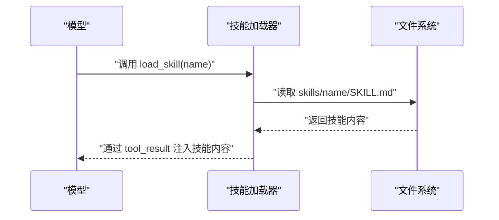

**图表来源**
- [s07_skill_loading/code.py: 251-257:251-257](file://s07_skill_loading/code.py#L251-L257)
- [skills/agent-builder/SKILL.md: 1-130:1-130](file://skills/agent-builder/SKILL.md#L1-L130)

**章节来源**
- [s07_skill_loading/code.py: 66-84:66-84](file://s07_skill_loading/code.py#L66-L84)
- [s07_skill_loading/code.py: 251-257:251-257](file://s07_skill_loading/code.py#L251-L257)
- [skills/agent-builder/SKILL.md: 1-130:1-130](file://skills/agent-builder/SKILL.md#L1-L130)

### 上下文压缩（Context Compression）
- **最新优化**：采用"预算优先"的三层压缩策略，确保大内容完整保留
- 执行顺序：applyToolResultBudget → snipCompact → microcompact → contextCollapse → autoCompact
- 预算机制：先处理大结果，确保完整内容落盘后再做占位和裁剪
- 缓存优化：维护 readFileState，重复读取未变化文件时返回 FILE_UNCHANGED_STUB
- 自动触发：当 token 估算超过阈值时自动触发压缩，应急重试机制保障稳定性

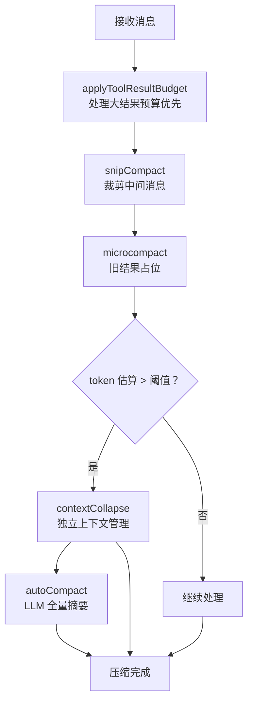

**更新** 新增了详细的压缩策略执行顺序和缓存优化机制说明。

**图表来源**
- [s08_context_compact/README.md: 251-258:251-258](file://s08_context_compact/README.md#L251-L258)
- [s08_context_compact/README.md: 261-263:261-263](file://s08_context_compact/README.md#L261-L263)

**章节来源**
- [s08_context_compact/code.py: 1-800:1-800](file://s08_context_compact/code.py#L1-L800)
- [s08_context_compact/README.md: 152-307:152-307](file://s08_context_compact/README.md#L152-L307)

### TodoWrite 输入处理（Enhanced TodoWrite）
- **增强功能**：新增严格的输入验证和状态管理
- 输入验证：检查 todos 数组格式、必需字段和状态枚举值
- 状态管理：支持 pending、in_progress、completed 三种状态
- 实时反馈：更新当前任务列表并提供彩色状态显示
- 错误处理：对无效输入返回明确的错误信息

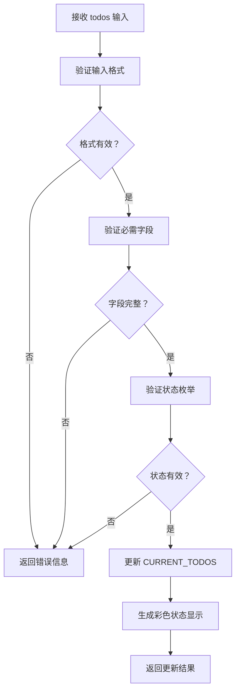

**更新** 新增了TodoWrite输入处理的详细验证流程和状态管理机制。

**图表来源**
- [s07_skill_loading/code.py: 180-202:180-202](file://s07_skill_loading/code.py#L180-L202)

**章节来源**
- [s07_skill_loading/code.py: 180-202:180-202](file://s07_skill_loading/code.py#L180-L202)
- [s07_skill_loading/README.md: 1-200:1-200](file://s07_skill_loading/README.md#L1-L200)

### 任务系统（Task System）
- 使用数据类 Task 表示任务，文件持久化存储在 .tasks 目录
- 支持创建、列出、认领、完成与依赖检查（can_start）
- 与系统提示动态组装，提供当前任务状态与依赖信息

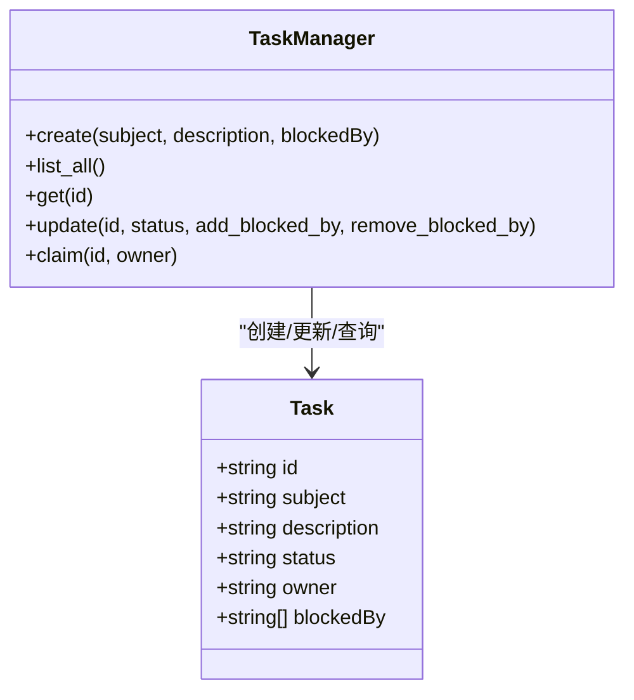

**图表来源**
- [s12_task_system/code.py: 52-61:52-61](file://s12_task_system/code.py#L52-L61)
- [s12_task_system/code.py: 66-139:66-139](file://s12_task_system/code.py#L66-L139)

**章节来源**
- [s12_task_system/code.py: 52-139:52-139](file://s12_task_system/code.py#L52-L139)

### 代理团队（Agent Teams）
- 基于 JSONL 的文件邮箱实现异步通信
- 主导代理（Lead）spawn_teammate 创建后台线程代理，代理在受限工具集上运行
- 支持 inbox 注入、结果回传与关闭请求

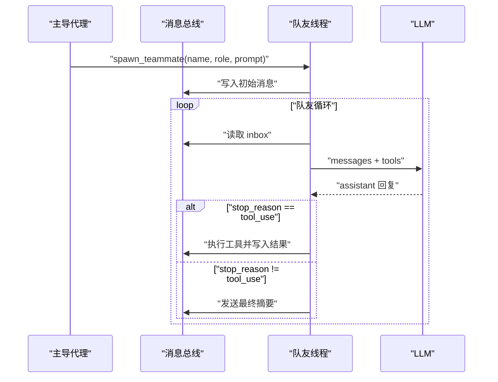

**图表来源**
- [s15_agent_teams/code.py: 629-713:629-713](file://s15_agent_teams/code.py#L629-L713)
- [s15_agent_teams/code.py: 595-621:595-621](file://s15_agent_teams/code.py#L595-L621)

**章节来源**
- [s15_agent_teams/code.py: 595-713:595-713](file://s15_agent_teams/code.py#L595-L713)

### 综合编排（s20 Comprehensive Agent）
- 将前述所有机制整合到一个循环中：工具分发、权限、钩子、计划、子代理、技能、压缩、记忆、提示组装、错误恢复、任务图、后台任务、定时调度、团队、协议、自治代理、工作树隔离、MCP
- 提供完整的 REPL 与命令（如 /compact、/tasks、/team、/inbox）
- **最新增强**：集成优化的上下文压缩策略和增强的TodoWrite输入处理

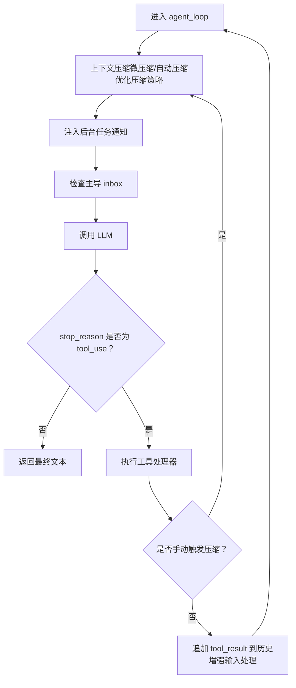

**更新** 综合编排图中增加了优化压缩策略和增强输入处理的标注。

**图表来源**
- [s20_comprehensive/code.py: 549-800:549-800](file://s20_comprehensive/code.py#L549-L800)

**章节来源**
- [s20_comprehensive/code.py: 1-800:1-800](file://s20_comprehensive/code.py#L1-L800)

## 依赖关系分析
- Python 依赖：anthropic、python-dotenv、pyyaml
- Web 平台依赖：Next.js、React、TailwindCSS、TypeScript 等
- 版本元数据与学习路径：通过 constants.ts 与 agent-data.ts 定义版本顺序、层级与差异

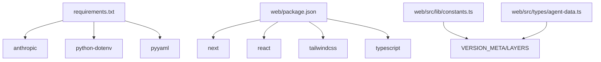

**图表来源**
- [requirements.txt: 1-3:1-3](file://requirements.txt#L1-L3)
- [web/package.json: 1-39:1-39](file://web/package.json#L1-L39)
- [web/src/lib/constants.ts: 1-38:1-38](file://web/src/lib/constants.ts#L1-L38)
- [web/src/types/agent-data.ts: 1-73:1-73](file://web/src/types/agent-data.ts#L1-L73)

**章节来源**
- [requirements.txt: 1-3:1-3](file://requirements.txt#L1-L3)
- [web/package.json: 1-39:1-39](file://web/package.json#L1-L39)
- [web/src/lib/constants.ts: 1-38:1-38](file://web/src/lib/constants.ts#L1-L38)
- [web/src/types/agent-data.ts: 1-73:1-73](file://web/src/types/agent-data.ts#L1-L73)

## 性能考虑
- **上下文压缩策略**：采用"预算优先"的三层压缩，确保大内容完整保留，超过阈值时自动压缩，避免超出模型上下文限制
- **缓存优化**：维护 readFileState，重复读取未变化文件时返回 FILE_UNCHANGED_STUB，压缩后再按预算恢复最近读过的文件内容
- 后台任务：慢操作异步执行并通过通知注入，保持主循环响应性
- 路径沙箱与权限钩子：减少无效工具调用与潜在风险，降低失败重试成本
- 任务图与依赖检查：避免重复计算与无效等待，提升多代理协作效率
- Web 平台静态导出：next.config.ts 设置为 export 输出，便于部署与离线使用

**更新** 新增了上下文压缩策略优化和缓存机制的性能考虑说明。

## 故障排除指南
- LLM 调用异常：在 agent_loop 中捕获异常并注入错误消息，避免中断循环
- 工具执行错误：统一通过 call_tool_handler 包装，捕获类型错误与异常并返回可读错误信息
- 路径越界：safe_path 对路径进行解析与相对性校验，防止工作区逃逸
- 队列与并发：后台任务使用锁保护共享状态，消息总线采用文件级一次性消费（教学版）
- **TodoWrite 输入错误**：严格验证 todos 格式，返回明确的错误信息，支持状态枚举检查
- **上下文压缩异常**：应急重试机制保障稳定性，超过重试上限抛出异常
- Web 平台开发：package.json 提供 extract、dev、build、start 脚本，确保内容提取与构建流程

**更新** 新增了TodoWrite输入错误和上下文压缩异常的故障排除说明。

**章节来源**
- [s20_comprehensive/code.py: 450-457:450-457](file://s20_comprehensive/code.py#L450-L457)
- [s15_agent_teams/code.py: 595-621:595-621](file://s15_agent_teams/code.py#L595-L621)
- [s07_skill_loading/code.py: 180-189:180-189](file://s07_skill_loading/code.py#L180-L189)
- [web/package.json: 5-12:5-12](file://web/package.json#L5-L12)

## 结论
本仓库通过 20 个渐进式章节，系统性地展示了如何围绕"代理循环"构建一个可扩展、可组合的智能体编排系统。从单一 bash 工具到复杂的多代理协作与外部能力集成，每一步都保持核心循环不变，所有增强均以"机制"形式叠加。最新版本集成了优化的上下文压缩策略和增强的TodoWrite输入处理，提供了更完整的代理系统编排能力，既保证了教学清晰度，也为生产级编排提供了坚实基础。

**更新** 本版本特别突出了上下文压缩改进和TodoWrite输入处理增强带来的编排能力提升。

## 附录
- 快速开始：安装依赖后，配置 API 密钥，运行 s01–s20 的 code.py 或 agents/s_full.py
- Web 平台：npm install && npm run dev，在本地查看可视化学习路径与模拟器
- 版本映射：README 中提供了旧版 12 讲与新版 20 讲的对应关系，便于对照学习
- **最新特性**：上下文压缩采用预算优先策略，TodoWrite支持严格输入验证和状态管理

**更新** 新增了最新特性的使用说明。

**章节来源**
- [README.md: 350-380:350-380](file://README.md#L350-L380)
- [web/src/app/page.tsx: 1-6:1-6](file://web/src/app/page.tsx#L1-L6)