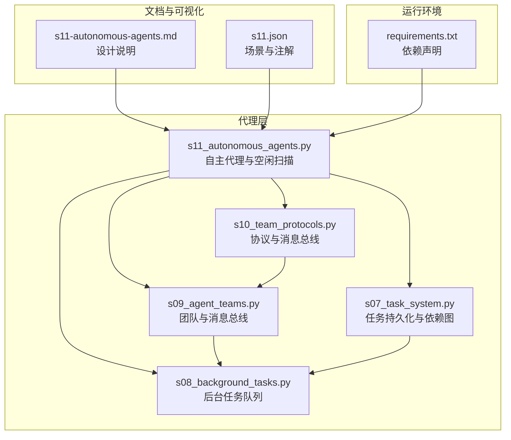
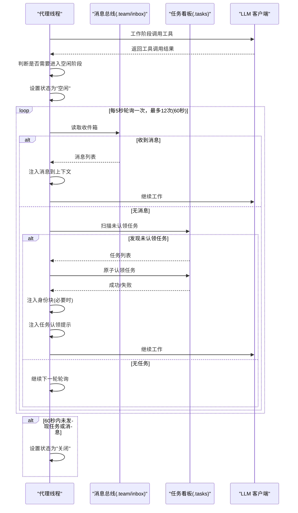
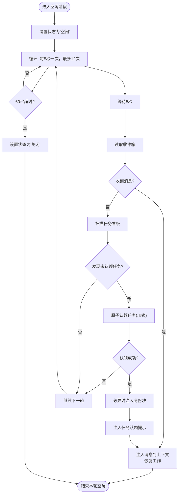
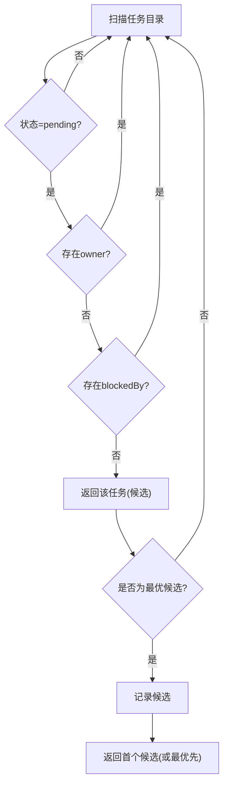
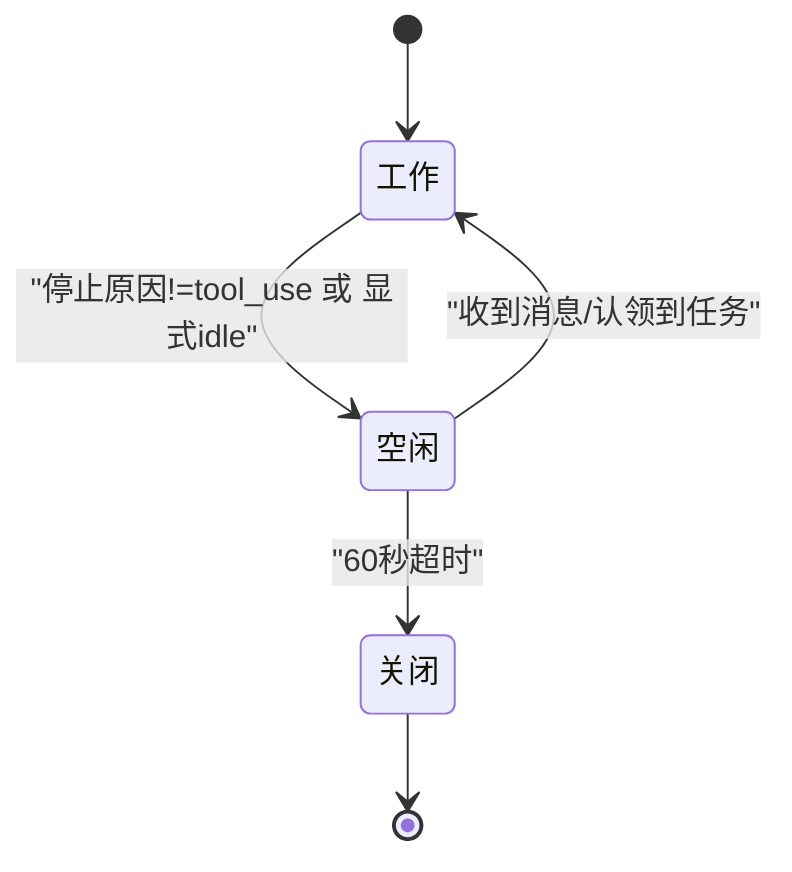
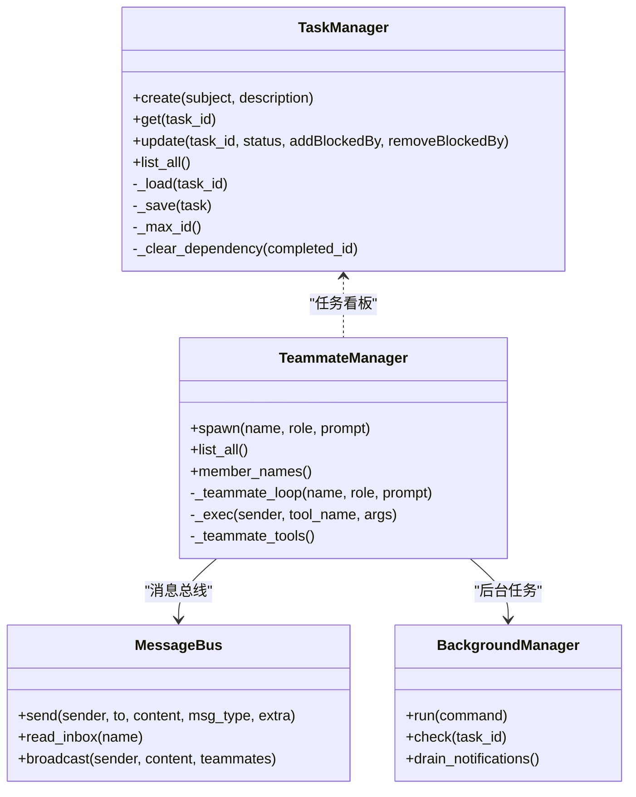
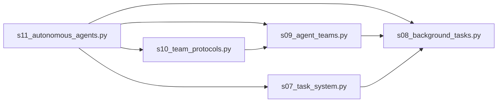

# 自主代理系统

<cite>
**本文引用的文件**
- [s11_autonomous_agents.py](file://agents/s11_autonomous_agents.py)
- [s10_team_protocols.py](file://agents/s10_team_protocols.py)
- [s09_agent_teams.py](file://agents/s09_agent_teams.py)
- [s08_background_tasks.py](file://agents/s08_background_tasks.py)
- [s07_task_system.py](file://agents/s07_task_system.py)
- [s11-autonomous-agents.md](file://docs/zh/s11-autonomous-agents.md)
- [s11.json](file://web/src/data/scenarios/s11.json)
- [s11_annotations.json](file://web/src/data/annotations/s11.json)
- [requirements.txt](file://requirements.txt)
</cite>

## 目录
1. [简介](#简介)
2. [项目结构](#项目结构)
3. [核心组件](#核心组件)
4. [架构总览](#架构总览)
5. [详细组件分析](#详细组件分析)
6. [依赖关系分析](#依赖关系分析)
7. [性能考量](#性能考量)
8. [故障排除指南](#故障排除指南)
9. [结论](#结论)
10. [附录](#附录)

## 简介
本文件面向 s11 版本的“自主代理系统”，聚焦以下主题：
- 空闲周期扫描机制：代理如何自动发现和认领待处理任务
- 任务分配算法：优先级评估、资源匹配与负载均衡策略
- 自我调度能力：代理如何根据当前状态与可用资源做出决策
- 任务监控与进度跟踪：状态更新与通知系统
- 性能优化：扫描频率调优与内存管理策略
- 实际部署案例与故障排除：帮助开发者理解并优化自主代理的行为模式

## 项目结构
该系统由多个演进阶段的 harness 组成，s11 在 s10 的协议基础上引入了“空闲周期扫描 + 自动认领”的自治能力，并通过文件系统实现任务看板与消息总线。

图表来源
- [s11_autonomous_agents.py:1-587](file://agents/s11_autonomous_agents.py#L1-L587)
- [s10_team_protocols.py:1-485](file://agents/s10_team_protocols.py#L1-L485)
- [s09_agent_teams.py:1-404](file://agents/s09_agent_teams.py#L1-L404)
- [s08_background_tasks.py:1-235](file://agents/s08_background_tasks.py#L1-L235)
- [s07_task_system.py:1-244](file://agents/s07_task_system.py#L1-L244)
- [s11-autonomous-agents.md:1-145](file://docs/zh/s11-autonomous-agents.md#L1-L145)
- [s11.json:1-45](file://web/src/data/scenarios/s11.json#L1-L45)
- [requirements.txt:1-3](file://requirements.txt#L1-L3)

章节来源
- [s11_autonomous_agents.py:1-587](file://agents/s11_autonomous_agents.py#L1-L587)
- [s10_team_protocols.py:1-485](file://agents/s10_team_protocols.py#L1-L485)
- [s09_agent_teams.py:1-404](file://agents/s09_agent_teams.py#L1-L404)
- [s08_background_tasks.py:1-235](file://agents/s08_background_tasks.py#L1-L235)
- [s07_task_system.py:1-244](file://agents/s07_task_system.py#L1-L244)
- [s11-autonomous-agents.md:1-145](file://docs/zh/s11-autonomous-agents.md#L1-L145)
- [s11.json:1-45](file://web/src/data/scenarios/s11.json#L1-L45)
- [requirements.txt:1-3](file://requirements.txt#L1-L3)

## 核心组件
- 自主代理与空闲扫描：实现“工作-空闲”双阶段循环，空闲阶段轮询收件箱与任务看板，自动认领未分配任务
- 协议与消息总线：支持“关闭请求/响应”“计划审批”等协议，以及广播与点对点消息
- 团队与消息总线：多代理持久化、线程化执行、文件式 JSONL 收件箱
- 后台任务队列：异步执行命令并将结果注入下一次 LLM 调用前的消息流
- 任务持久化与依赖图：任务以 JSON 文件持久化，支持 blockedBy 依赖链，完成后自动清理依赖

章节来源
- [s11_autonomous_agents.py:168-380](file://agents/s11_autonomous_agents.py#L168-L380)
- [s10_team_protocols.py:87-292](file://agents/s10_team_protocols.py#L87-L292)
- [s09_agent_teams.py:77-251](file://agents/s09_agent_teams.py#L77-L251)
- [s08_background_tasks.py:49-112](file://agents/s08_background_tasks.py#L49-L112)
- [s07_task_system.py:46-122](file://agents/s07_task_system.py#L46-L122)

## 架构总览
s11 将“任务看板扫描 + 自动认领”嵌入到代理的空闲阶段，形成“工作-空闲-扫描-认领-继续工作”的自治闭环。同时保留协议层用于跨代理通信与治理。

图表来源
- [s11_autonomous_agents.py:267-304](file://agents/s11_autonomous_agents.py#L267-L304)
- [s11_autonomous_agents.py:126-157](file://agents/s11_autonomous_agents.py#L126-L157)
- [s10_team_protocols.py:176-221](file://agents/s10_team_protocols.py#L176-L221)
- [s09_agent_teams.py:166-205](file://agents/s09_agent_teams.py#L166-L205)

## 详细组件分析

### 空闲周期扫描与自动认领
- 扫描策略
  - 每5秒轮询一次，最多轮询12次（60秒超时）
  - 先检查收件箱，若有消息则立即恢复工作
  - 若无消息，则扫描任务看板，选择满足条件的未认领任务进行原子认领
- 任务筛选条件
  - 状态为“待处理”
  - 无所有者(owner)
  - 无阻塞依赖(blockedBy)
- 认领流程
  - 使用互斥锁保护文件读写
  - 读取任务JSON，校验状态/阻塞/拥有者
  - 更新owner与status后写回文件
- 身份重注入
  - 当上下文长度较短（可能因压缩）时，在消息流开头注入身份块，确保后续工具调用（如认领）可用

图表来源
- [s11_autonomous_agents.py:267-304](file://agents/s11_autonomous_agents.py#L267-L304)
- [s11_autonomous_agents.py:126-157](file://agents/s11_autonomous_agents.py#L126-L157)
- [s11_autonomous_agents.py:159-165](file://agents/s11_autonomous_agents.py#L159-L165)

章节来源
- [s11_autonomous_agents.py:126-157](file://agents/s11_autonomous_agents.py#L126-L157)
- [s11_autonomous_agents.py:159-165](file://agents/s11_autonomous_agents.py#L159-L165)
- [s11_autonomous_agents.py:267-304](file://agents/s11_autonomous_agents.py#L267-L304)
- [s11-autonomous-agents.md:48-93](file://docs/zh/s11-autonomous-agents.md#L48-L93)

### 任务分配算法与优先级评估
- 任务筛选逻辑
  - 仅选择“待处理”且“无所有者”且“无阻塞依赖”的任务
  - 顺序遍历任务文件，返回第一个满足条件的任务
- 资源匹配
  - 代理通过文件系统扫描与原子写入实现“先到先得”的资源匹配
  - 互斥锁保证并发安全
- 负载均衡策略
  - 采用“轮询 + 超时”的策略，避免单代理长期占用资源
  - 多代理并发扫描，各自认领不同任务，天然实现负载分散
- 依赖与阻塞
  - 任务系统维护 blockedBy 依赖图，完成后自动清理
  - 自主代理在扫描时会跳过被阻塞的任务，等待上游完成后再认领

图表来源
- [s11_autonomous_agents.py:126-136](file://agents/s11_autonomous_agents.py#L126-L136)
- [s07_task_system.py:95-102](file://agents/s07_task_system.py#L95-L102)

章节来源
- [s11_autonomous_agents.py:126-136](file://agents/s11_autonomous_agents.py#L126-L136)
- [s07_task_system.py:95-102](file://agents/s07_task_system.py#L95-L102)

### 自我调度能力与状态管理
- 状态机
  - 工作阶段：执行工具调用，直至停止原因非“工具调用”或显式调用“空闲”工具
  - 空闲阶段：轮询收件箱与任务看板，超时后关闭
- 线程化执行
  - 每个代理在独立线程中运行，避免阻塞
- 协议集成
  - 支持“关闭请求/响应”“计划审批”等协议，通过消息总线传递

图表来源
- [s11_autonomous_agents.py:225-304](file://agents/s11_autonomous_agents.py#L225-L304)
- [s10_team_protocols.py:176-221](file://agents/s10_team_protocols.py#L176-L221)

章节来源
- [s11_autonomous_agents.py:225-304](file://agents/s11_autonomous_agents.py#L225-L304)
- [s10_team_protocols.py:176-221](file://agents/s10_team_protocols.py#L176-L221)

### 任务监控与进度跟踪
- 任务状态
  - 任务以 JSON 文件持久化，字段包含 id、subject、status、owner、blockedBy 等
  - 提供 list_all/get/update/create 等工具
- 进度跟踪
  - 代理在认领任务后注入提示消息，便于后续工作延续
  - 协议层支持计划审批与关闭请求的状态追踪
- 通知系统
  - 文件式 JSONL 收件箱，支持点对点与广播
  - 后台任务执行结果在下一次 LLM 调用前注入消息流

图表来源
- [s07_task_system.py:46-122](file://agents/s07_task_system.py#L46-L122)
- [s09_agent_teams.py:123-251](file://agents/s09_agent_teams.py#L123-L251)
- [s10_team_protocols.py:87-292](file://agents/s10_team_protocols.py#L87-L292)
- [s08_background_tasks.py:49-112](file://agents/s08_background_tasks.py#L49-L112)

章节来源
- [s07_task_system.py:46-122](file://agents/s07_task_system.py#L46-L122)
- [s09_agent_teams.py:123-251](file://agents/s09_agent_teams.py#L123-L251)
- [s10_team_protocols.py:87-292](file://agents/s10_team_protocols.py#L87-L292)
- [s08_background_tasks.py:49-112](file://agents/s08_background_tasks.py#L49-L112)

### 实际部署案例
- 场景描述
  - 创建多个未认领任务，启动多个代理，观察它们并发自动认领不同任务
  - 创建具有依赖关系的任务，验证代理遵循 blockedBy 顺序
- 行为特征
  - 代理在空闲阶段轮询，发现任务后立即认领并恢复工作
  - 测试代理在依赖未满足时等待，不进行无效认领
  - 60秒超时后自动关闭，避免僵尸进程

章节来源
- [s11.json:1-45](file://web/src/data/scenarios/s11.json#L1-L45)
- [s11-autonomous-agents.md:131-145](file://docs/zh/s11-autonomous-agents.md#L131-L145)

## 依赖关系分析
- 组件耦合
  - s11 依赖 s10 的协议与消息总线，依赖 s09 的团队管理与线程模型
  - 任务系统独立于代理，通过文件持久化与原子写入实现一致性
- 外部依赖
  - anthropic SDK 用于 LLM 调用
  - python-dotenv 用于加载环境变量
  - pyyaml 用于文档渲染（前端）

图表来源
- [s11_autonomous_agents.py:1-587](file://agents/s11_autonomous_agents.py#L1-L587)
- [s10_team_protocols.py:1-485](file://agents/s10_team_protocols.py#L1-L485)
- [s09_agent_teams.py:1-404](file://agents/s09_agent_teams.py#L1-L404)
- [s08_background_tasks.py:1-235](file://agents/s08_background_tasks.py#L1-L235)
- [s07_task_system.py:1-244](file://agents/s07_task_system.py#L1-L244)

章节来源
- [s11_autonomous_agents.py:1-587](file://agents/s11_autonomous_agents.py#L1-L587)
- [s10_team_protocols.py:1-485](file://agents/s10_team_protocols.py#L1-L485)
- [s09_agent_teams.py:1-404](file://agents/s09_agent_teams.py#L1-L404)
- [s08_background_tasks.py:1-235](file://agents/s08_background_tasks.py#L1-L235)
- [s07_task_system.py:1-244](file://agents/s07_task_system.py#L1-L244)
- [requirements.txt:1-3](file://requirements.txt#L1-L3)

## 性能考量
- 扫描频率调优
  - 当前轮询间隔为5秒，超时上限为60秒
  - 优点：实现简单、跨平台稳定、文件系统开销低
  - 优化建议：根据任务平均完成时间调整轮询间隔；在高并发场景下可考虑指数退避
- 内存管理策略
  - 代理在空闲阶段仅读取收件箱与任务文件，内存占用低
  - 身份重注入仅在上下文过短时触发，避免冗余消息
- 并发与锁
  - 认领任务使用互斥锁，避免竞态
  - 多代理并发扫描，天然实现负载分散
- I/O 优化
  - 任务文件以 JSON 存储，读写成本低
  - 收件箱为追加写入，读取后清空，减少文件锁争用

章节来源
- [s11_autonomous_agents.py:60-61](file://agents/s11_autonomous_agents.py#L60-L61)
- [s11_autonomous_agents.py:139-156](file://agents/s11_autonomous_agents.py#L139-L156)
- [s11_annotations.json:4-16](file://web/src/data/annotations/s11.json#L4-L16)
- [s11_annotations.json:19-31](file://web/src/data/annotations/s11.json#L19-L31)
- [s11_annotations.json:33-45](file://web/src/data/annotations/s11.json#L33-L45)

## 故障排除指南
- 代理长时间处于空闲状态
  - 检查任务看板是否存在满足条件的未认领任务
  - 确认任务状态为“待处理”，且无 owner/blockedBy
- 代理无法认领任务
  - 检查互斥锁是否被其他线程持有
  - 确认任务状态未被其他代理抢先更新
- 收件箱消息未生效
  - 确认消息类型在允许集合内
  - 检查收件箱文件是否被正确清空
- 身份丢失导致无法认领
  - 触发上下文压缩后，确认身份块已注入
- 协议请求无响应
  - 检查 request_id 是否正确传递
  - 确认消息总线广播/点对点发送正常

章节来源
- [s11_autonomous_agents.py:139-156](file://agents/s11_autonomous_agents.py#L139-L156)
- [s10_team_protocols.py:350-395](file://agents/s10_team_protocols.py#L350-L395)
- [s09_agent_teams.py:77-120](file://agents/s09_agent_teams.py#L77-L120)

## 结论
s11 通过“空闲周期扫描 + 自动认领”实现了真正的自治代理：代理不再依赖领导逐一分配任务，而是自组织地发现并承担工作。结合协议层的消息总线、任务系统的持久化与依赖图、以及后台任务的异步执行，形成了稳定高效的自主协作体系。通过合理的扫描频率与超时策略，系统在简单性与实用性之间取得了良好平衡。

## 附录
- 快速开始
  - 运行脚本：python agents/s11_autonomous_agents.py
  - 常用命令：/team 查看团队状态；/inbox 查看收件箱；/tasks 查看任务看板
- 参考文档
  - 设计说明：docs/zh/s11-autonomous-agents.md
  - 场景与注解：web/src/data/scenarios/s11.json、web/src/data/annotations/s11.json