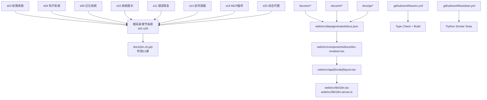
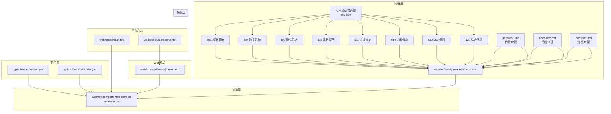
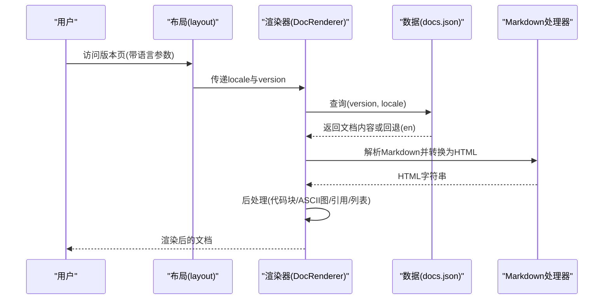
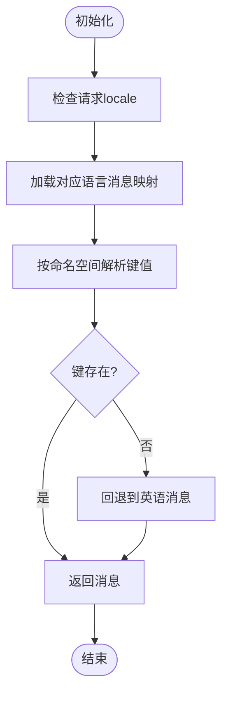
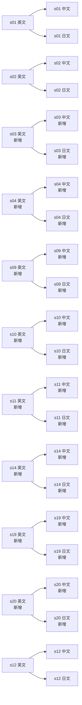
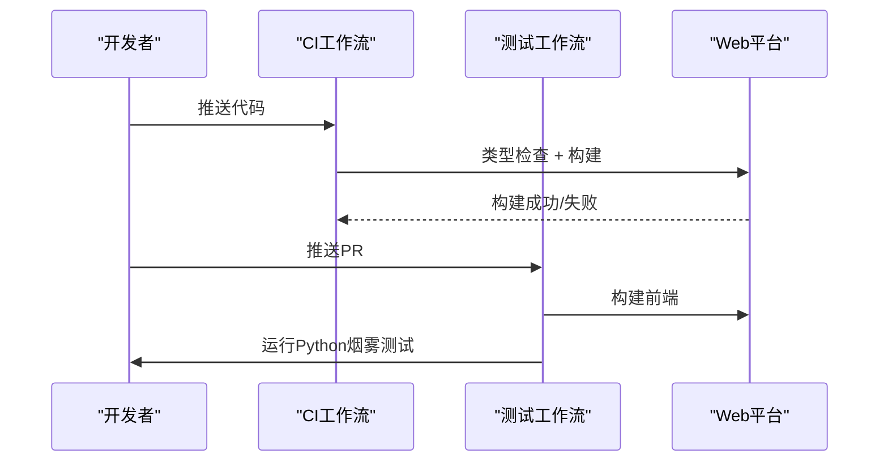
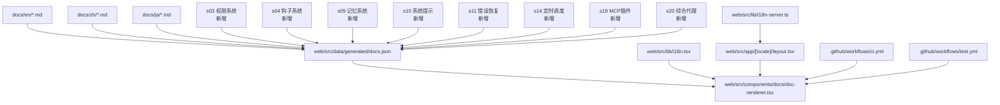

# 多语言文档

<cite>
**本文档引用的文件**
- [README.md](file://README.md)
- [README-zh.md](file://README-zh.md)
- [README-ja.md](file://README-ja.md)
- [docs/en/s01-the-agent-loop.md](file://docs/en/s01-the-agent-loop.md)
- [docs/zh/s01-the-agent-loop.md](file://docs/zh/s01-the-agent-loop.md)
- [docs/ja/s01-the-agent-loop.md](file://docs/ja/s01-the-agent-loop.md)
- [s03_permission/README.md](file://s03_permission/README.md)
- [s03_permission/README.en.md](file://s03_permission/README.en.md)
- [s03_permission/README.ja.md](file://s03_permission/README.ja.md)
- [s04_hooks/README.md](file://s04_hooks/README.md)
- [s04_hooks/README.en.md](file://s04_hooks/README.en.md)
- [s04_hooks/README.ja.md](file://s04_hooks/README.ja.md)
- [s09_memory/README.md](file://s09_memory/README.md)
- [s09_memory/README.en.md](file://s09_memory/README.en.md)
- [s09_memory/README.ja.md](file://s09_memory/README.ja.md)
- [s10_system_prompt/README.md](file://s10_system_prompt/README.md)
- [s10_system_prompt/README.en.md](file://s10_system_prompt/README.en.md)
- [s10_system_prompt/README.ja.md](file://s10_system_prompt/README.ja.md)
- [web/src/lib/i18n.tsx](file://web/src/lib/i18n.tsx)
- [web/src/lib/i18n-server.ts](file://web/src/lib/i18n-server.ts)
- [web/src/app/[locale]/layout.tsx](file://web/src/app/[locale]/layout.tsx)
- [web/src/data/generated/docs.json](file://web/src/data/generated/docs.json)
- [web/src/components/docs/doc-renderer.tsx](file://web/src/components/docs/doc-renderer.tsx)
- [.github/workflows/ci.yml](file://.github/workflows/ci.yml)
- [.github/workflows/test.yml](file://.github/workflows/test.yml)
</cite>

## 更新摘要
**所做更改**
- 新增8个章节（s03, s04, s09, s10, s11, s14, s19, s20）的完整多语言文档支持
- 更新学习路径与内容组织结构，涵盖20个渐进式课程主题
- 完善中文、英文、日文三种语言的文档体系
- 增强跨语言学习体验与版本对比功能

## 目录
1. [简介](#简介)
2. [项目结构](#项目结构)
3. [核心组件](#核心组件)
4. [架构总览](#架构总览)
5. [详细组件分析](#详细组件分析)
6. [依赖关系分析](#依赖关系分析)
7. [性能考虑](#性能考虑)
8. [故障排除指南](#故障排除指南)
9. [结论](#结论)
10. [附录](#附录)

## 简介
本项目提供一套面向多语言学习者的"教学文档体系"，现已扩展为覆盖英语、中文、日语三种语言的20个渐进式课程主题，从基础的"代理循环"到高级的"综合代理"，形成完整的学习路径与内容组织。文档不仅提供心智模型优先的讲解与示例，还在Web平台上实现了多语言渲染与版本对比功能，支持跨语言学习与版本演进追踪。

**更新** 新增8个核心章节（s03权限系统、s04钩子系统、s09记忆系统、s10系统提示、s11错误恢复、s14定时调度、s19MCP插件、s20综合代理），完善了从基础工具使用到高级代理架构的完整知识体系。

## 项目结构
- **文档层**：docs/{en,zh,ja}/ 按语言组织，每个语言包含12个传统课程文档；新增根目录章节系统，提供20个完整课程主题
- **章节系统**：s01-s20 每个章节为独立文件夹，包含README.md（中文源）、README.en.md（英文）、README.ja.md（日文）、code.py（可运行代码）、images/（SVG图表）
- **Web平台**：web/ 使用Next.js实现交互式学习界面，包含导航、时间线、版本对比、图层说明、源码查看器等
- **数据与国际化**：web/src/data/generated/docs.json 提供按版本与语言聚合的文档数据；web/src/lib/i18n*.ts 提供客户端与服务端国际化能力
- **工作流**：.github/workflows/ 包含CI与测试工作流，保障前端类型检查与构建质量

**图表来源**
- [s03_permission/README.md](file://s03_permission/README.md)
- [s04_hooks/README.md](file://s04_hooks/README.md)
- [s09_memory/README.md](file://s09_memory/README.md)
- [s10_system_prompt/README.md](file://s10_system_prompt/README.md)
- [docs/en/s01-the-agent-loop.md](file://docs/en/s01-the-agent-loop.md)
- [web/src/data/generated/docs.json](file://web/src/data/generated/docs.json)
- [web/src/components/docs/doc-renderer.tsx](file://web/src/components/docs/doc-renderer.tsx)
- [web/src/app/[locale]/layout.tsx](file://web/src/app/[locale]/layout.tsx)
- [web/src/lib/i18n.tsx](file://web/src/lib/i18n.tsx)
- [web/src/lib/i18n-server.ts](file://web/src/lib/i18n-server.ts)
- [.github/workflows/ci.yml](file://.github/workflows/ci.yml)
- [.github/workflows/test.yml](file://.github/workflows/test.yml)

**章节来源**
- [README.md:383-402](file://README.md#L383-L402)
- [README-zh.md:288-298](file://README-zh.md#L288-L298)

## 核心组件
- **多语言文档集合**：按课程编号与语言划分，确保内容与学习路径一致。新增8个核心章节提供完整的三语支持
- **国际化系统**：客户端与服务端分别提供消息映射与回退机制，支持en、zh、ja三种语言
- **文档渲染管线**：将Markdown转换为HTML，并进行语法高亮、ASCII图容器包裹、首段引用样式等后处理
- **版本与对比**：通过docs.json聚合版本与语言数据，支撑"版本对比"页面的双版本差异展示
- **工作流保障**：CI与测试工作流确保前端类型检查、构建与Python烟雾测试

**更新** 新增章节的国际化支持，确保s03-s20的完整三语文档体系

**章节来源**
- [web/src/lib/i18n.tsx:1-37](file://web/src/lib/i18n.tsx#L1-L37)
- [web/src/lib/i18n-server.ts:1-17](file://web/src/lib/i18n-server.ts#L1-L17)
- [web/src/components/docs/doc-renderer.tsx:18-92](file://web/src/components/docs/doc-renderer.tsx#L18-L92)
- [web/src/data/generated/docs.json:1-156](file://web/src/data/generated/docs.json#L1-L156)
- [.github/workflows/ci.yml:1-33](file://.github/workflows/ci.yml#L1-L33)
- [.github/workflows/test.yml:1-46](file://.github/workflows/test.yml#L1-L46)

## 架构总览
多语言文档系统由"内容层（根目录章节+s01-s12）—数据层（docs.json）—渲染层（DocRenderer）—国际化层（i18n）—Web布局（layout）—工作流（CI/测试）"构成，形成从静态文档到动态渲染的完整链路。

**图表来源**
- [s03_permission/README.md](file://s03_permission/README.md)
- [s04_hooks/README.md](file://s04_hooks/README.md)
- [s09_memory/README.md](file://s09_memory/README.md)
- [s10_system_prompt/README.md](file://s10_system_prompt/README.md)
- [docs/en/s01-the-agent-loop.md](file://docs/en/s01-the-agent-loop.md)
- [docs/zh/s01-the-agent-loop.md](file://docs/zh/s01-the-agent-loop.md)
- [docs/ja/s01-the-agent-loop.md](file://docs/ja/s01-the-agent-loop.md)
- [web/src/data/generated/docs.json](file://web/src/data/generated/docs.json)
- [web/src/components/docs/doc-renderer.tsx](file://web/src/components/docs/doc-renderer.tsx)
- [web/src/lib/i18n.tsx](file://web/src/lib/i18n.tsx)
- [web/src/lib/i18n-server.ts](file://web/src/lib/i18n-server.ts)
- [web/src/app/[locale]/layout.tsx](file://web/src/app/[locale]/layout.tsx)
- [.github/workflows/ci.yml](file://.github/workflows/ci.yml)
- [.github/workflows/test.yml](file://.github/workflows/test.yml)

## 详细组件分析

### 组件A：文档渲染与版本对比
- **文档渲染**：DocRenderer根据当前语言与版本从docs.json中匹配文档内容，使用unified链将Markdown转为HTML，并进行代码块语言标注、ASCII图容器包裹、首段引用样式修正与有序列表计数修复等后处理
- **版本对比**：docs.json包含版本号与语言字段，渲染器按版本与语言筛选，若当前语言缺失则回退至英语，确保跨语言一致性与可用性

**图表来源**
- [web/src/app/[locale]/layout.tsx:12-61](file://web/src/app/[locale]/layout.tsx#L12-L61)
- [web/src/components/docs/doc-renderer.tsx:61-92](file://web/src/components/docs/doc-renderer.tsx#L61-L92)
- [web/src/data/generated/docs.json:1-156](file://web/src/data/generated/docs.json#L1-L156)

**章节来源**
- [web/src/components/docs/doc-renderer.tsx:18-92](file://web/src/components/docs/doc-renderer.tsx#L18-L92)
- [web/src/data/generated/docs.json:1-156](file://web/src/data/generated/docs.json#L1-L156)

### 组件B：国际化与回退机制
- **客户端国际化**：I18nProvider根据locale选择消息映射，默认回退至英语；useTranslations提供命名空间下的键值解析，不存在时回退原键
- **服务端国际化**：getTranslations在服务端按命名空间与键解析，不存在时回退至英语命名空间，确保SSR与CSR一致

**图表来源**
- [web/src/lib/i18n.tsx:16-37](file://web/src/lib/i18n.tsx#L16-L37)
- [web/src/lib/i18n-server.ts:9-17](file://web/src/lib/i18n-server.ts#L9-L17)

**章节来源**
- [web/src/lib/i18n.tsx:1-37](file://web/src/lib/i18n.tsx#L1-L37)
- [web/src/lib/i18n-server.ts:1-17](file://web/src/lib/i18n-server.ts#L1-L17)

### 组件C：学习路径与内容组织
- **英文版**：README.md明确列出20个课程主题与格言，文档位于docs/en/，文件名与课程编号对应
- **中文版**：README-zh.md提供相同结构的中文说明，文档位于docs/zh/
- **日文版**：README-ja.md提供日文说明，文档位于docs/ja/
- **新增章节**：s03权限系统、s04钩子系统、s09记忆系统、s10系统提示、s11错误恢复、s14定时调度、s19MCP插件、s20综合代理
- **三语文档**在课程编号、标题、内容组织上保持一致，确保学习者在不同语言环境下获得一致的学习体验

**图表来源**
- [docs/en/s01-the-agent-loop.md](file://docs/en/s01-the-agent-loop.md)
- [docs/zh/s01-the-agent-loop.md](file://docs/zh/s01-the-agent-loop.md)
- [docs/ja/s01-the-agent-loop.md](file://docs/ja/s01-the-agent-loop.md)
- [s03_permission/README.md](file://s03_permission/README.md)
- [s04_hooks/README.md](file://s04_hooks/README.md)
- [s09_memory/README.md](file://s09_memory/README.md)
- [s10_system_prompt/README.md](file://s10_system_prompt/README.md)

**章节来源**
- [README.md:299-327](file://README.md#L299-L327)
- [README-zh.md:300-318](file://README-zh.md#L300-L318)

### 组件D：Web平台与版本管理
- **布局与元数据**：[locale]布局根据请求locale生成静态参数，动态设置页面标题与描述，确保SEO与本地化一致
- **版本数据**：docs.json包含版本、语言、标题与内容，渲染器按locale与version匹配，缺失时回退英语
- **工作流**：CI工作流执行类型检查与构建，测试工作流执行Python烟雾测试与前端构建，保障质量与稳定性

**图表来源**
- [.github/workflows/ci.yml:16-33](file://.github/workflows/ci.yml#L16-L33)
- [.github/workflows/test.yml:23-46](file://.github/workflows/test.yml#L23-L46)
- [web/src/app/[locale]/layout.tsx:12-27](file://web/src/app/[locale]/layout.tsx#L12-L27)
- [web/src/data/generated/docs.json:1-156](file://web/src/data/generated/docs.json#L1-L156)

**章节来源**
- [web/src/app/[locale]/layout.tsx:12-61](file://web/src/app/[locale]/layout.tsx#L12-L61)
- [.github/workflows/ci.yml:1-33](file://.github/workflows/ci.yml#L1-L33)
- [.github/workflows/test.yml:1-46](file://.github/workflows/test.yml#L1-L46)

## 依赖关系分析
- **文档依赖**：docs/en/*.md、docs/zh/*.md、docs/ja/*.md共同组成多语言文档集合，彼此在课程编号与主题上保持一一对应；新增s03-s20章节提供完整三语支持
- **数据依赖**：web/src/data/generated/docs.json聚合多语言文档，为渲染层提供统一的数据源
- **渲染依赖**：DocRenderer依赖docs.json与国际化消息，负责Markdown到HTML的转换与后处理
- **国际化依赖**：客户端与服务端i18n模块相互配合，确保SSR与CSR一致的本地化体验
- **工作流依赖**：CI与测试工作流依赖web目录的package.json与requirements.txt，保障构建与测试稳定

**图表来源**
- [docs/en/s01-the-agent-loop.md](file://docs/en/s01-the-agent-loop.md)
- [docs/zh/s01-the-agent-loop.md](file://docs/zh/s01-the-agent-loop.md)
- [docs/ja/s01-the-agent-loop.md](file://docs/ja/s01-the-agent-loop.md)
- [s03_permission/README.md](file://s03_permission/README.md)
- [s04_hooks/README.md](file://s04_hooks/README.md)
- [s09_memory/README.md](file://s09_memory/README.md)
- [s10_system_prompt/README.md](file://s10_system_prompt/README.md)
- [web/src/data/generated/docs.json](file://web/src/data/generated/docs.json)
- [web/src/components/docs/doc-renderer.tsx](file://web/src/components/docs/doc-renderer.tsx)
- [web/src/lib/i18n.tsx](file://web/src/lib/i18n.tsx)
- [web/src/lib/i18n-server.ts](file://web/src/lib/i18n-server.ts)
- [web/src/app/[locale]/layout.tsx](file://web/src/app/[locale]/layout.tsx)
- [.github/workflows/ci.yml](file://.github/workflows/ci.yml)
- [.github/workflows/test.yml](file://.github/workflows/test.yml)

**章节来源**
- [web/src/data/generated/docs.json:1-156](file://web/src/data/generated/docs.json#L1-L156)
- [web/src/components/docs/doc-renderer.tsx:61-92](file://web/src/components/docs/doc-renderer.tsx#L61-L92)
- [web/src/lib/i18n.tsx:16-37](file://web/src/lib/i18n.tsx#L16-L37)
- [web/src/lib/i18n-server.ts:9-17](file://web/src/lib/i18n-server.ts#L9-L17)

## 性能考虑
- **渲染优化**：Markdown到HTML的转换在客户端进行，建议对大型文档采用懒加载与分块渲染策略，减少首屏压力
- **国际化缓存**：客户端与服务端均提供消息映射缓存，避免重复解析，提升SSR与CSR性能一致性
- **数据聚合**：docs.json集中聚合多语言文档，减少多次IO与解析，有利于渲染性能与一致性
- **构建与类型检查**：CI工作流在云端执行类型检查与构建，提前发现潜在问题，降低本地开发成本

## 故障排除指南
- **文档未显示或显示为英文**：确认docs.json中是否存在对应版本与语言条目；若不存在，渲染器会自动回退至英语
- **页面标题与描述异常**：检查[locale]布局的generateMetadata是否正确加载对应语言的消息映射
- **国际化键值未解析**：确认键名是否存在，不存在时将回退原键；检查命名空间与键的拼写
- **构建失败**：CI工作流会报告类型检查与构建错误，按提示修复类型或依赖问题

**章节来源**
- [web/src/components/docs/doc-renderer.tsx:61-92](file://web/src/components/docs/doc-renderer.tsx#L61-L92)
- [web/src/lib/i18n.tsx:25-32](file://web/src/lib/i18n.tsx#L25-L32)
- [web/src/lib/i18n-server.ts:13-15](file://web/src/lib/i18n-server.ts#L13-L15)
- [.github/workflows/ci.yml:28-32](file://.github/workflows/ci.yml#L28-L32)

## 结论
本多语言文档系统通过"内容层—数据层—渲染层—国际化层—Web布局—工作流"的完整架构，实现了英语、中文、日语三语的20个课程主题的一致性教学内容与跨语言学习体验。新增的s03-s20章节完善了从基础工具使用到高级代理架构的完整知识体系，借助docs.json聚合与DocRenderer的渲染管线，结合i18n的回退机制与工作流的质量保障，学习者可以在不同语言环境下获得稳定、一致且高质量的教学内容。

## 附录

### 学习路径与内容组织对照
- **英文**：docs/en/s01-the-agent-loop.md 至 docs/en/s12-worktree-task-isolation.md；新增s03-s20章节
- **中文**：docs/zh/s01-the-agent-loop.md 至 docs/zh/s12-worktree-task-isolation.md；新增s03-s20章节  
- **日文**：docs/ja/s01-the-agent-loop.md 至 docs/ja/s12-worktree-task-isolation.md；新增s03-s20章节

**更新** 新增8个核心章节的完整三语支持，涵盖权限系统、钩子系统、记忆系统、系统提示、错误恢复、定时调度、MCP插件、综合代理

**章节来源**
- [README.md:299-327](file://README.md#L299-L327)
- [README-zh.md:300-318](file://README-zh.md#L300-L318)

### 更新同步机制与维护策略
- **内容同步**：docs/en/* 作为基准，中文与日文文档在课程编号与主题上保持一致，便于同步更新；新增章节提供完整三语支持
- **数据聚合**：docs.json由构建流程生成，确保渲染层与国际化层的数据一致性
- **回退策略**：渲染器与国际化模块均提供英语回退，保证在缺失语言内容时仍可正常显示
- **质量保障**：CI与测试工作流在推送与PR时自动执行类型检查、构建与Python烟雾测试，确保系统稳定性

**章节来源**
- [web/src/data/generated/docs.json:1-156](file://web/src/data/generated/docs.json#L1-L156)
- [web/src/lib/i18n.tsx:16-37](file://web/src/lib/i18n.tsx#L16-L37)
- [web/src/lib/i18n-server.ts:9-17](file://web/src/lib/i18n-server.ts#L9-L17)
- [.github/workflows/ci.yml:16-33](file://.github/workflows/ci.yml#L16-L33)
- [.github/workflows/test.yml:23-46](file://.github/workflows/test.yml#L23-L46)

### 贡献指南（翻译规范、格式标准、审核流程）
- **翻译规范**
  - 保持课程编号与主题一致性，确保三语文档在结构与顺序上完全对应
  - 术语与格言保持一致，避免因翻译差异导致理解偏差
  - 新增章节需提供完整的三语版本，确保内容完整性
- **格式标准**
  - Markdown格式遵循现有文档风格，保留标题层级、列表与代码块结构
  - ASCII图与代码块保持原样，避免格式破坏
  - 新增章节需包含README.md、README.en.md、README.ja.md三个文件
- **审核流程**
  - 提交PR后，CI工作流自动执行类型检查与构建；测试工作流执行Python烟雾测试
  - 维护者在PR中进行内容一致性与格式审核，确保多语言文档质量

**章节来源**
- [.github/workflows/ci.yml:16-33](file://.github/workflows/ci.yml#L16-L33)
- [.github/workflows/test.yml:23-46](file://.github/workflows/test.yml#L23-L46)

### 跨语言学习与版本管理实践
- **文档对比**：通过版本对比页面，选择任意两个版本进行对比，查看新增工具、类、函数与代码行变化
- **版本管理**：docs.json按版本与语言聚合，渲染器按locale与version匹配，缺失时回退英语，确保跨语言一致性
- **学习路径**：三语文档在课程编号与主题上保持一致，学习者可在任一语言环境下完成20个课程的学习路径
- **新增章节实践**：s03权限系统、s04钩子系统、s09记忆系统、s10系统提示、s11错误恢复、s14定时调度、s19MCP插件、s20综合代理提供完整的跨语言学习体验

**章节来源**
- [web/src/data/generated/docs.json:1-156](file://web/src/data/generated/docs.json#L1-L156)
- [web/src/components/docs/doc-renderer.tsx:61-92](file://web/src/components/docs/doc-renderer.tsx#L61-L92)