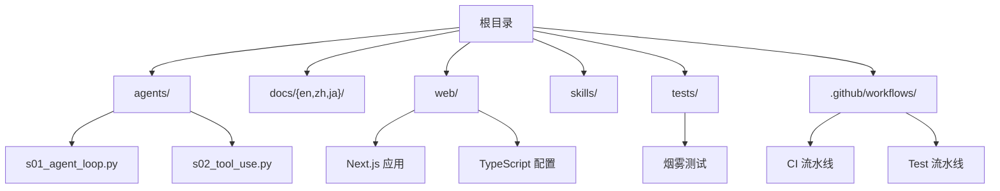
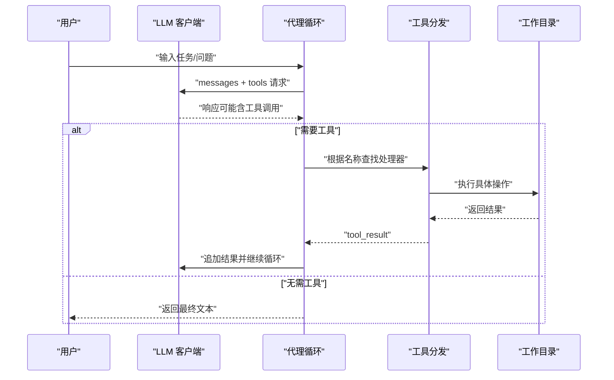
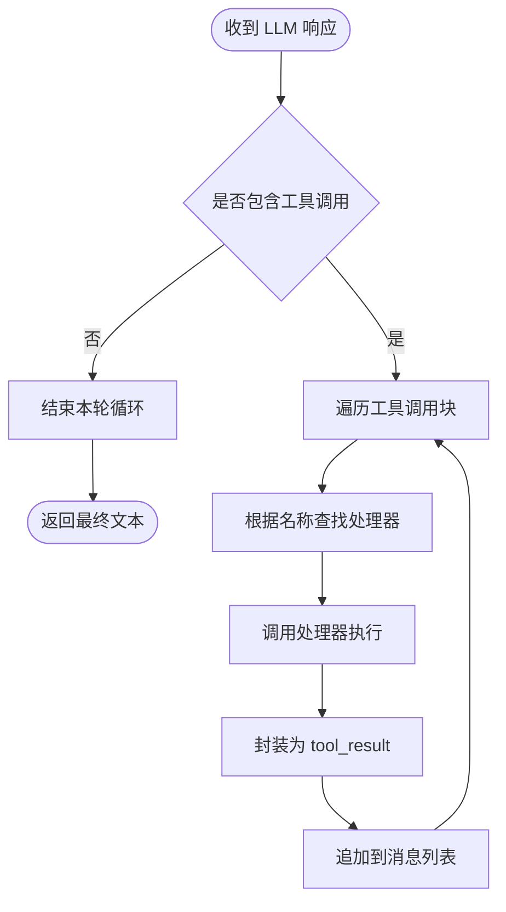
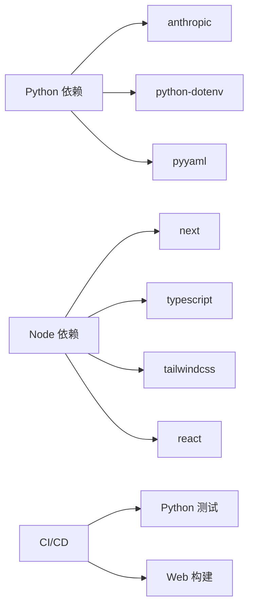

# 代码规范与贡献流程

<cite>
**本文引用的文件**
- [README.md](file://README.md)
- [README-zh.md](file://README-zh.md)
- [requirements.txt](file://requirements.txt)
- [.github/workflows/ci.yml](file://.github/workflows/ci.yml)
- [.github/workflows/test.yml](file://.github/workflows/test.yml)
- [web/package.json](file://web/package.json)
- [web/tsconfig.json](file://web/tsconfig.json)
- [web/.gitignore](file://web/.gitignore)
- [.gitignore](file://.gitignore)
- [agents/__init__.py](file://agents/__init__.py)
- [agents/s01_agent_loop.py](file://agents/s01_agent_loop.py)
- [agents/s02_tool_use.py](file://agents/s02_tool_use.py)
- [tests/test_agents_smoke.py](file://tests/test_agents_smoke.py)
- [skills/agent-builder/SKILL.md](file://skills/agent-builder/SKILL.md)
</cite>

## 目录
1. [简介](#简介)
2. [项目结构](#项目结构)
3. [核心组件](#核心组件)
4. [架构总览](#架构总览)
5. [详细组件分析](#详细组件分析)
6. [依赖分析](#依赖分析)
7. [性能考虑](#性能考虑)
8. [故障排查指南](#故障排查指南)
9. [结论](#结论)
10. [附录](#附录)

## 简介
本文件面向贡献者，系统化制定本项目的代码规范与贡献流程，覆盖：
- Python 代码编码标准（命名、注释、错误处理）
- 依赖管理策略（Python 包版本控制、Node.js 依赖管理、环境配置）
- 标准化提交流程（分支管理、代码审查、测试要求）
- 开发环境设置指南（IDE 配置、调试技巧、性能分析）
- 质量保证措施（单元测试、集成测试、持续集成）

本项目以“代理循环”为核心，强调“模型即代理、代码即夹具”的理念，所有实现均围绕最小可运行的代理循环展开，并逐步叠加工具、知识、上下文压缩、任务系统、团队协作与工作树隔离等机制。

章节来源
- [README.md:232-252](file://README.md#L232-L252)
- [README-zh.md:233-252](file://README-zh.md#L233-L252)

## 项目结构
项目采用按主题分层的组织方式：
- agents/：Python 参考实现（s01-s12 与 s_full 总纲），每个文件自包含且可直接运行
- docs/{en,zh,ja}/：面向多语言的心智模型文档
- web/：交互式学习平台（Next.js + TypeScript）
- skills/：技能文件（按需加载的知识注入）
- tests/：Python 烟雾测试
- .github/workflows/：CI/CD 流水线（类型检查 + 构建）

章节来源
- [README.md:287-298](file://README.md#L287-L298)
- [README-zh.md:288-298](file://README-zh.md#L288-L298)

## 核心组件
- 代理循环：最小可运行的“用户 → 消息 → LLM → 工具 → 结果回传”闭环
- 工具系统：工具定义与分发映射，支持 bash、文件读写、编辑等
- 知识注入：按需加载技能文件（SKILL.md），通过 tool_result 注入
- 上下文管理：上下文压缩与消息隔离（子代理、任务系统）
- 团队与工作树：多代理协作、异步邮箱、工作树隔离执行

章节来源
- [README.md:190-218](file://README.md#L190-L218)
- [README-zh.md:191-218](file://README-zh.md#L191-L218)
- [agents/s01_agent_loop.py:80-102](file://agents/s01_agent_loop.py#L80-L102)
- [agents/s02_tool_use.py:94-111](file://agents/s02_tool_use.py#L94-L111)

## 架构总览
下图展示从用户输入到工具执行再到结果回传的典型流程，体现“循环不变、机制叠加”的设计思想。

图表来源
- [agents/s01_agent_loop.py:80-102](file://agents/s01_agent_loop.py#L80-L102)
- [agents/s02_tool_use.py:114-131](file://agents/s02_tool_use.py#L114-L131)

章节来源
- [README.md:190-218](file://README.md#L190-L218)
- [README-zh.md:191-218](file://README-zh.md#L191-L218)

## 详细组件分析

### Python 代码规范
- 命名约定
  - 模块与脚本：使用小写下划线命名（如 s01_agent_loop.py）
  - 函数与变量：使用小写下划线命名（如 run_bash、safe_path）
  - 常量：使用全大写与下划线（如 MODEL、SYSTEM）
  - 类名：使用 PascalCase（如 AgentLoop）
- 注释规范
  - 模块顶部包含简短说明与“核心模式”注释
  - 关键函数提供参数与返回值说明
  - 对安全限制与异常路径进行注释说明
- 错误处理模式
  - 工具执行中捕获超时、路径逃逸、文件系统异常等
  - 返回统一格式的错误字符串，避免泄露敏感信息
  - 对危险命令进行显式拦截
- 导入与环境
  - 使用 dotenv 加载环境变量
  - 明确区分 Anthropic 客户端初始化与 base_url 设置
  - 工作目录通过 Path 管理，确保相对路径安全

章节来源
- [agents/s01_agent_loop.py:1-25](file://agents/s01_agent_loop.py#L1-L25)
- [agents/s01_agent_loop.py:44-50](file://agents/s01_agent_loop.py#L44-L50)
- [agents/s01_agent_loop.py:65-78](file://agents/s01_agent_loop.py#L65-L78)
- [agents/s02_tool_use.py:1-20](file://agents/s02_tool_use.py#L1-L20)
- [agents/s02_tool_use.py:34-36](file://agents/s02_tool_use.py#L34-L36)
- [agents/s02_tool_use.py:41-45](file://agents/s02_tool_use.py#L41-L45)
- [agents/s02_tool_use.py:48-59](file://agents/s02_tool_use.py#L48-L59)

### 工具与分发机制
- 工具定义：每个工具包含名称、描述与输入 Schema
- 分发映射：将工具名映射到处理器函数
- 结果回传：将工具执行结果封装为 tool_result 并追加到消息列表

图表来源
- [agents/s02_tool_use.py:114-131](file://agents/s02_tool_use.py#L114-L131)
- [agents/s02_tool_use.py:94-100](file://agents/s02_tool_use.py#L94-L100)

章节来源
- [agents/s02_tool_use.py:94-111](file://agents/s02_tool_use.py#L94-L111)
- [agents/s02_tool_use.py:114-131](file://agents/s02_tool_use.py#L114-L131)

### 知识注入与技能加载
- 按需加载：通过 SKILL.md 注入领域知识，避免一次性塞入系统提示
- 注入方式：以 tool_result 形式回传给模型，保持上下文清洁

章节来源
- [skills/agent-builder/SKILL.md:1-130](file://skills/agent-builder/SKILL.md#L1-L130)
- [README.md:172-173](file://README.md#L172-L173)
- [README-zh.md:173-174](file://README-zh.md#L173-L174)

### 上下文压缩与消息隔离
- 子代理隔离：子任务使用独立 messages 列表，避免噪声泄露
- 压缩策略：三层压缩策略，支持无限会话场景
- 任务系统：文件持久化任务图，支持依赖关系与顺序执行

章节来源
- [README.md:170-171](file://README.md#L170-L171)
- [README.md:174-175](file://README.md#L174-L175)
- [README.md:176-177](file://README.md#L176-L177)
- [README-zh.md:171-172](file://README-zh.md#L171-L172)
- [README-zh.md:175-176](file://README-zh.md#L175-L176)
- [README-zh.md:177-178](file://README-zh.md#L177-L178)

### 团队协作与工作树隔离
- 多代理团队：持久化队友与异步邮箱协议
- 协议规范：统一请求-响应模式，支持计划审批与关闭流程
- 自治代理：空闲轮询与自动认领任务
- 工作树隔离：任务协调与可选的隔离执行通道

章节来源
- [README.md:180-181](file://README.md#L180-L181)
- [README.md:182-183](file://README.md#L182-L183)
- [README.md:184-185](file://README.md#L184-L185)
- [README.md:186-187](file://README.md#L186-L187)
- [README-zh.md:181-182](file://README-zh.md#L181-L182)
- [README-zh.md:183-184](file://README-zh.md#L183-L184)
- [README-zh.md:185-186](file://README-zh.md#L185-L186)
- [README-zh.md:187-188](file://README-zh.md#L187-L188)

## 依赖分析
- Python 依赖
  - anthropic：LLM 客户端
  - python-dotenv：环境变量加载
  - pyyaml：YAML 支持（用于技能文件解析）
- Node.js 依赖（web 平台）
  - Next.js、React、TypeScript、TailwindCSS 等
  - 构建脚本包含提取内容、开发与构建流程
- 环境配置
  - .env 示例文件需配置 ANTHROPIC_API_KEY
  - GitHub Actions 使用固定 Node.js 与 Python 版本

图表来源
- [requirements.txt:1-3](file://requirements.txt#L1-L3)
- [web/package.json:13-37](file://web/package.json#L13-L37)
- [.github/workflows/test.yml:15-24](file://.github/workflows/test.yml#L15-L24)
- [.github/workflows/ci.yml:19-32](file://.github/workflows/ci.yml#L19-L32)

章节来源
- [requirements.txt:1-3](file://requirements.txt#L1-L3)
- [web/package.json:1-39](file://web/package.json#L1-L39)
- [.github/workflows/ci.yml:1-33](file://.github/workflows/ci.yml#L1-L33)
- [.github/workflows/test.yml:1-46](file://.github/workflows/test.yml#L1-L46)

## 性能考虑
- 工具执行超时控制：默认 120 秒，避免阻塞循环
- 输出截断：统一限制最大输出长度，防止上下文膨胀
- 路径安全：严格限定工作目录，防止路径逃逸
- 上下文压缩：三层压缩策略，降低长期会话的内存与延迟
- 并发与后台任务：后台线程执行耗时操作，完成后注入通知，提升交互流畅度

章节来源
- [agents/s01_agent_loop.py:65-78](file://agents/s01_agent_loop.py#L65-L78)
- [agents/s02_tool_use.py:48-59](file://agents/s02_tool_use.py#L48-L59)
- [README.md:174-175](file://README.md#L174-L175)
- [README-zh.md:175-176](file://README-zh.md#L175-L176)

## 故障排查指南
- 环境变量未配置
  - 确认已复制 .env.example 并填写 ANTHROPIC_API_KEY
  - 检查 base_url 是否正确设置
- Python 依赖缺失
  - 使用 pip 安装 requirements.txt 中的依赖
  - 确保 pytest 可用以运行烟雾测试
- Node.js 构建失败
  - 使用 npm ci 安装 web 目录下的依赖
  - 确保 Node.js 版本与 CI 一致（20.x）
- 类型检查失败
  - 使用 npx tsc --noEmit 进行类型检查
- 烟雾测试失败
  - 确认 agents 目录下脚本可编译通过

章节来源
- [README.md:238-244](file://README.md#L238-L244)
- [.github/workflows/test.yml:20-24](file://.github/workflows/test.yml#L20-L24)
- [.github/workflows/ci.yml:25-32](file://.github/workflows/ci.yml#L25-L32)
- [tests/test_agents_smoke.py:17-24](file://tests/test_agents_smoke.py#L17-L24)

## 结论
本规范以“最小循环 + 机制叠加”为核心，强调安全性、可维护性与可扩展性。建议贡献者遵循既有模式，新增功能时保持循环不变、仅扩展夹具机制；在工具与知识注入方面坚持“按需加载”，在上下文与权限方面坚持“隔离与约束”。通过 CI/CD 保障质量，通过文档与示例降低理解成本。

## 附录

### 提交与评审流程
- 分支策略
  - 主分支：仅合并通过 CI/测试的 PR
  - 功能分支：按课程或特性命名（如 feature/s05-skill-loading）
- 提交流程
  - 提交前本地运行类型检查与烟雾测试
  - 提交信息遵循“模块: 修改内容”的格式
- 代码评审
  - 至少一名维护者批准
  - 关注安全性（路径、命令）、健壮性（异常处理）、一致性（命名与注释）

章节来源
- [.github/workflows/ci.yml:1-33](file://.github/workflows/ci.yml#L1-L33)
- [.github/workflows/test.yml:1-46](file://.github/workflows/test.yml#L1-L46)

### 开发环境设置
- Python
  - 使用 Python 3.11（与 CI 一致）
  - 安装 requirements.txt 依赖
- Node.js（web 平台）
  - 使用 Node.js 20
  - 在 web 目录执行 npm ci
  - 开发：npm run dev；构建：npm run build
- IDE 建议
  - Python：启用类型检查与导入排序
  - TypeScript：启用 strict 模式与 noEmit
- 调试技巧
  - 在工具执行前后打印关键信息，便于定位问题
  - 使用最小化示例（如 s01）验证循环逻辑
- 性能分析
  - 关注工具执行时间与输出大小
  - 使用上下文压缩减少历史长度

章节来源
- [.github/workflows/test.yml:15-18](file://.github/workflows/test.yml#L15-L18)
- [.github/workflows/ci.yml:19-23](file://.github/workflows/ci.yml#L19-L23)
- [web/tsconfig.json:7-14](file://web/tsconfig.json#L7-L14)
- [web/package.json:5-12](file://web/package.json#L5-L12)

### 质量保证
- 单元测试
  - 烟雾测试：确保 agents 目录下脚本可编译
- 集成测试
  - CI/CD：类型检查 + 构建
  - Python 测试：pytest 驱动的烟雾测试
- 持续集成
  - CI：web 平台类型检查与构建
  - Test：Python 烟雾测试 + web 构建

章节来源
- [tests/test_agents_smoke.py:17-24](file://tests/test_agents_smoke.py#L17-L24)
- [.github/workflows/ci.yml:28-32](file://.github/workflows/ci.yml#L28-L32)
- [.github/workflows/test.yml:23-24](file://.github/workflows/test.yml#L23-L24)