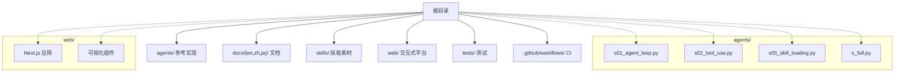
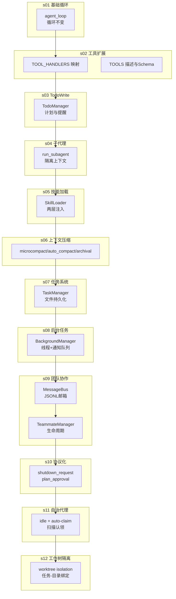
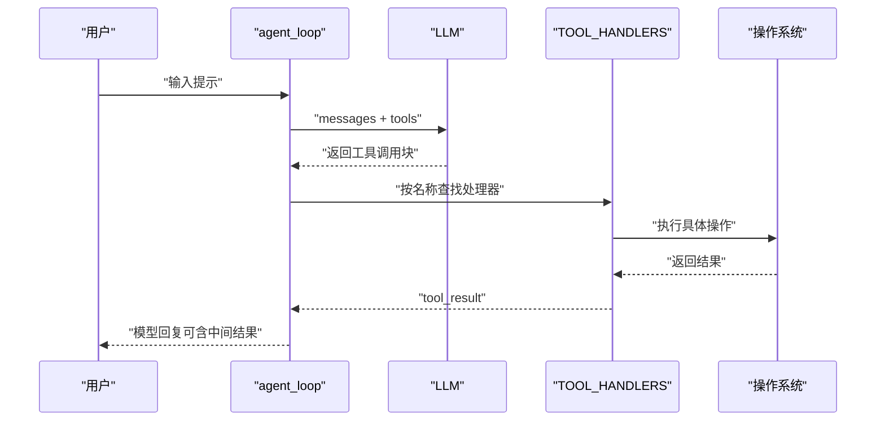
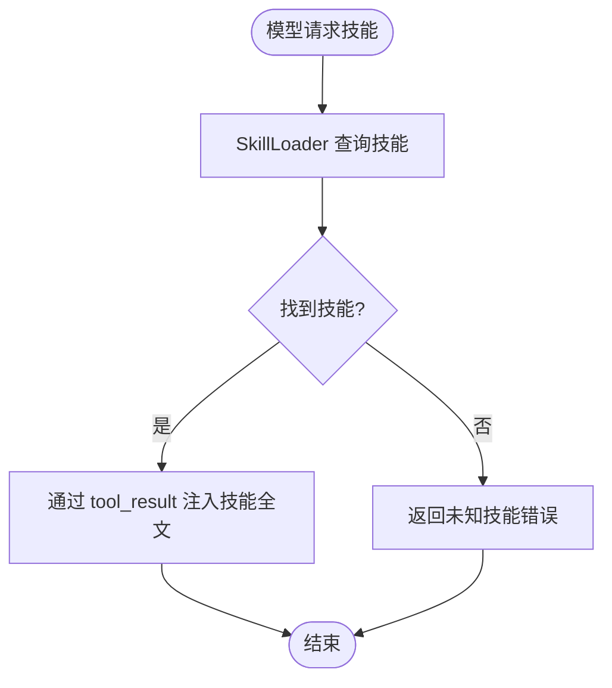
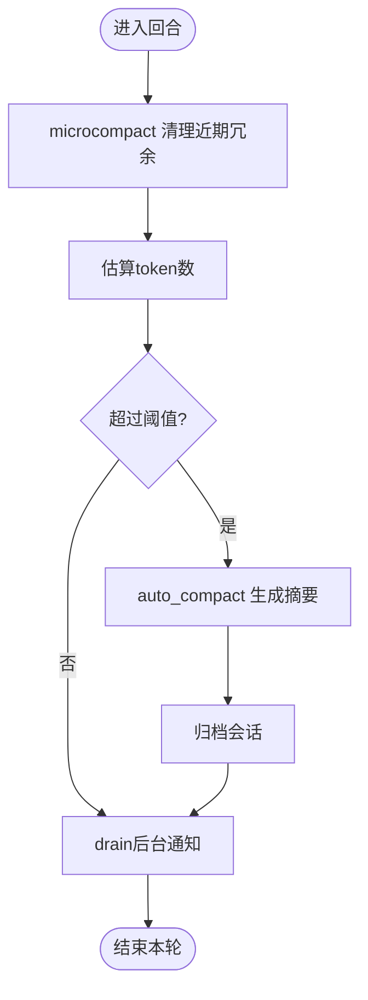
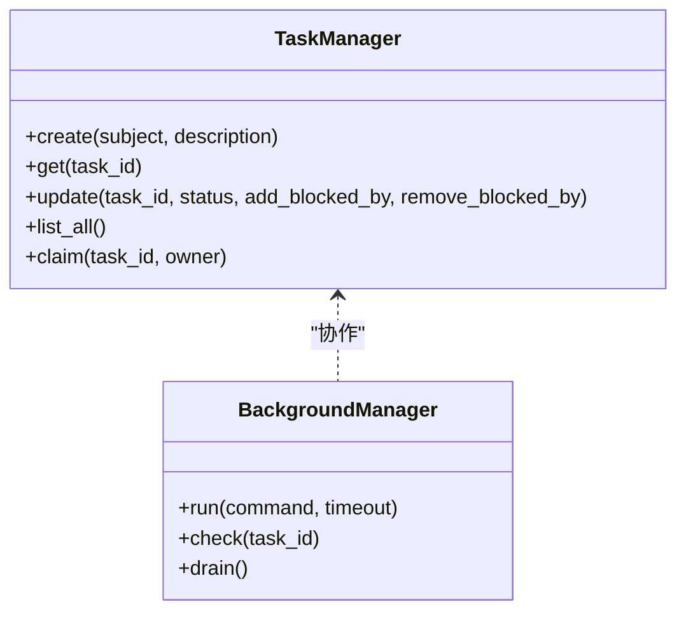
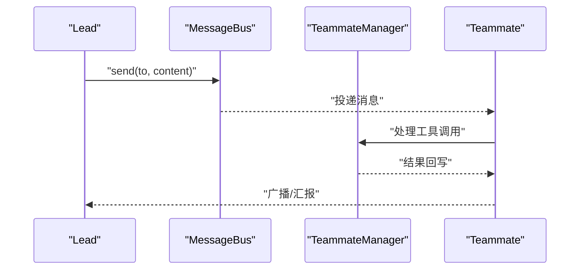
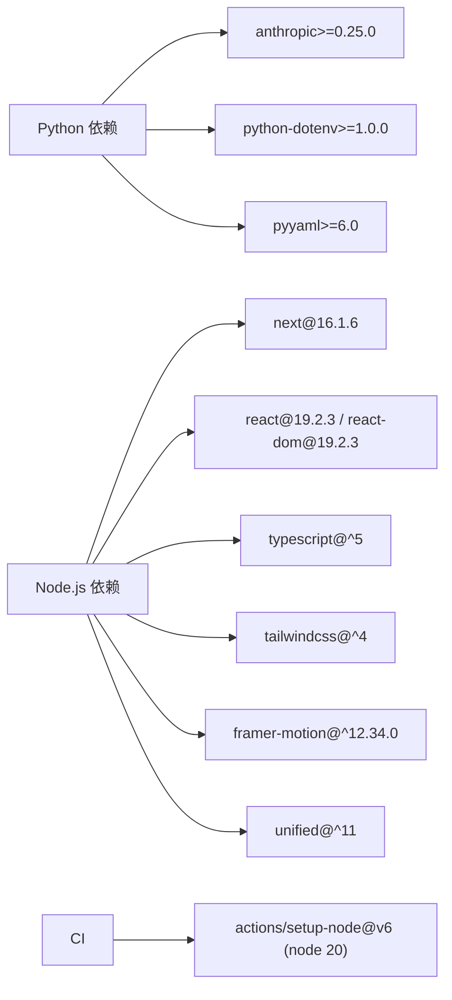

# 开发者指南

<cite>
**本文引用的文件**
- [README.md](file://README.md)
- [README-zh.md](file://README-zh.md)
- [requirements.txt](file://requirements.txt)
- [agents/__init__.py](file://agents/__init__.py)
- [agents/s01_agent_loop.py](file://agents/s01_agent_loop.py)
- [agents/s02_tool_use.py](file://agents/s02_tool_use.py)
- [agents/s05_skill_loading.py](file://agents/s05_skill_loading.py)
- [agents/s_full.py](file://agents/s_full.py)
- [skills/agent-builder/SKILL.md](file://skills/agent-builder/SKILL.md)
- [web/package.json](file://web/package.json)
- [web/src/components/architecture/arch-diagram.tsx](file://web/src/components/architecture/arch-diagram.tsx)
- [web/src/lib/constants.ts](file://web/src/lib/constants.ts)
- [web/next.config.ts](file://web/next.config.ts)
- [.github/workflows/ci.yml](file://.github/workflows/ci.yml)
- [tests/test_agents_smoke.py](file://tests/test_agents_smoke.py)
</cite>

## 目录
1. [简介](#简介)
2. [项目结构](#项目结构)
3. [核心组件](#核心组件)
4. [架构总览](#架构总览)
5. [详细组件分析](#详细组件分析)
6. [依赖分析](#依赖分析)
7. [性能考虑](#性能考虑)
8. [调试与优化指南](#调试与优化指南)
9. [扩展开发最佳实践](#扩展开发最佳实践)
10. [代码贡献指南](#代码贡献指南)
11. [结论](#结论)

## 简介
本指南面向希望基于现有机制扩展与二次开发的开发者，系统讲解如何在“代理循环 + 外部工具 + 知识注入 + 上下文管理 + 团队协作”的架构范式下，安全、可维护地新增代理功能。内容覆盖工具扩展、技能开发、协议定制、依赖管理、调试优化与贡献流程，并提供可直接落地的实践建议。

## 项目结构
仓库采用“渐进式教学 + 参考实现 + 可视化平台”的组织方式：
- agents/: Python参考实现，包含从s01到s12的12个会话，以及s_full总纲实现
- docs/{en,zh,ja}/: 多语言文档，每课对应一个主题
- skills/: 技能素材目录，用于按需加载知识
- web/: Next.js交互式学习平台，提供可视化、源码查看与演示
- tests/: 轻量级烟雾测试，确保脚本可编译
- .github/workflows/: CI流水线，前端类型检查与构建

图表来源
- [agents/__init__.py:1-4](file://agents/__init__.py#L1-L4)
- [web/src/lib/constants.ts:1-38](file://web/src/lib/constants.ts#L1-L38)

章节来源
- [README.md:287-298](file://README.md#L287-L298)
- [README-zh.md:288-298](file://README-zh.md#L288-L298)

## 核心组件
- 代理循环（Agent Loop）：统一的“思考-行动-反馈”闭环，模型决定是否调用工具，代码负责执行并回传结果
- 工具系统（Tool Dispatch）：将工具名映射到处理器，保持循环不变，新增工具只需扩展dispatch与schema
- 技能系统（On-Demand Knowledge）：两层注入（系统提示层+工具结果层），避免系统提示膨胀
- 上下文压缩（Context Compression）：三段式压缩策略，保障长时间会话的稳定性
- 任务系统（Task Graph）：文件持久化任务图，支持依赖与并行
- 后台任务（Background Tasks）：守护线程+通知队列，异步执行耗时操作
- 团队协作（Agent Teams）：持久化队友+异步邮箱；协议化请求-响应；自组织认领
- 工作树隔离（Worktree Isolation）：按任务隔离工作目录，避免相互干扰

章节来源
- [README.md:190-218](file://README.md#L190-L218)
- [README-zh.md:191-218](file://README-zh.md#L191-L218)

## 架构总览
下图展示从s01到s_full的演进路径与关键模块关系：

图表来源
- [agents/s01_agent_loop.py:80-102](file://agents/s01_agent_loop.py#L80-L102)
- [agents/s02_tool_use.py:94-111](file://agents/s02_tool_use.py#L94-L111)
- [agents/s05_skill_loading.py:166-185](file://agents/s05_skill_loading.py#L166-L185)
- [agents/s_full.py:576-650](file://agents/s_full.py#L576-L650)

## 详细组件分析

### 代理循环与工具扩展（s01 → s02）
- 设计要点
  - 循环保持不变：模型决定是否调用工具，代码只负责执行与回传
  - 工具扩展遵循“一个新工具，一个处理器”的原则，通过dispatch map路由
  - Schema定义输入参数，确保LLM调用的结构化
- 扩展方法
  - 在TOOL_HANDLERS中新增{name: handler}
  - 在TOOLS中新增工具描述与输入Schema
  - 在agent_loop中保持原逻辑，无需修改循环
- 安全与健壮性
  - bash等危险命令拦截
  - 超时控制与输出截断
  - 路径限制防止越权访问

图表来源
- [agents/s01_agent_loop.py:80-102](file://agents/s01_agent_loop.py#L80-L102)
- [agents/s02_tool_use.py:114-132](file://agents/s02_tool_use.py#L114-L132)

章节来源
- [agents/s01_agent_loop.py:1-121](file://agents/s01_agent_loop.py#L1-L121)
- [agents/s02_tool_use.py:1-151](file://agents/s02_tool_use.py#L1-L151)

### 技能加载与知识注入（s05）
- 两层注入策略
  - 层1（便宜）：系统提示中列出技能清单（简短描述）
  - 层2（按需）：模型调用load_skill时，通过tool_result返回完整技能体
- 技能素材
  - skills/<name>/SKILL.md 使用YAML前言元数据（name/description/tags）
  - 通过SkillLoader解析并缓存
- 扩展方法
  - 新增技能目录与SKILL.md
  - 在系统提示中自动汇总技能清单
  - 在TOOL_HANDLERS中注册load_skill

图表来源
- [agents/s05_skill_loading.py:58-105](file://agents/s05_skill_loading.py#L58-L105)
- [skills/agent-builder/SKILL.md:1-130](file://skills/agent-builder/SKILL.md#L1-L130)

章节来源
- [agents/s05_skill_loading.py:1-228](file://agents/s05_skill_loading.py#L1-L228)
- [skills/agent-builder/SKILL.md:1-130](file://skills/agent-builder/SKILL.md#L1-L130)

### 上下文压缩（s06）
- 三段式策略
  - microcompact：清理近期冗余tool_result
  - auto_compact：调用LLM生成摘要并归档会话
  - archival：将压缩后的摘要持久化到文件
- 触发条件
  - 当消息估算token数超过阈值时自动压缩
  - 支持手动触发/compact
- 扩展方法
  - 自定义压缩策略（如按角色聚合、按工具类型裁剪）
  - 调整阈值与摘要长度

图表来源
- [agents/s_full.py:226-258](file://agents/s_full.py#L226-L258)
- [agents/s_full.py:653-707](file://agents/s_full.py#L653-L707)

章节来源
- [agents/s_full.py:226-258](file://agents/s_full.py#L226-L258)
- [agents/s_full.py:653-707](file://agents/s_full.py#L653-L707)

### 任务系统与后台任务（s07 → s08）
- 任务系统
  - 文件持久化：每个任务一个JSON文件
  - 支持状态变更、依赖阻塞、删除与清理
  - 列表渲染与Owner绑定
- 后台任务
  - 后台线程执行命令，守护进程式运行
  - 通知队列异步回传结果
  - 支持查询与批量drain
- 扩展方法
  - 新增任务字段（优先级、截止时间、标签）
  - 新增后台任务类型（定时、轮询、事件驱动）

图表来源
- [agents/s_full.py:261-325](file://agents/s_full.py#L261-L325)
- [agents/s_full.py:327-361](file://agents/s_full.py#L327-L361)

章节来源
- [agents/s_full.py:261-325](file://agents/s_full.py#L261-L325)
- [agents/s_full.py:327-361](file://agents/s_full.py#L327-L361)

### 团队协作与协议（s09 → s11）
- 邮箱协议
  - JSONL文件作为跨代理邮箱
  - send/read_inbox/broadcast
- 协议化
  - shutdown_request + request_id相关联
  - plan_approval_response（审批流程）
- 自治代理
  - idle轮询 + auto-claim（扫描未认领任务）
  - 压缩上下文时的身份注入
- 扩展方法
  - 新增消息类型（心跳、告警、审计）
  - 新增协议（仲裁、投票、升级）

图表来源
- [agents/s_full.py:363-391](file://agents/s_full.py#L363-L391)
- [agents/s_full.py:398-542](file://agents/s_full.py#L398-L542)

章节来源
- [agents/s_full.py:363-391](file://agents/s_full.py#L363-L391)
- [agents/s_full.py:398-542](file://agents/s_full.py#L398-L542)

### 工作树隔离（s12）
- 目标
  - 每个任务在独立工作树中执行，避免相互干扰
  - 任务-目录绑定，事件流可追踪
- 实践
  - 通过任务ID生成隔离目录
  - 在工具层增加工作树切换与清理
- 扩展
  - 支持并行lane与资源配额
  - 增加快照/回滚能力

章节来源
- [README.md:186-187](file://README.md#L186-L187)
- [README-zh.md:187-188](file://README-zh.md#L187-L188)

## 依赖分析
- Python依赖
  - anthropic>=0.25.0：调用Anthropic API
  - python-dotenv>=1.0.0：加载.env环境变量
  - pyyaml>=6.0：解析技能前言元数据
- Node.js依赖（web平台）
  - Next.js 16.1.6、React 19、TypeScript 5
  - TailwindCSS 4、Framer Motion、Unified生态
  - 本地脚本：tsx用于内容提取
- 版本与兼容性
  - Python：建议使用3.10+，与anthropic版本匹配
  - Node：使用package.json锁定版本，CI使用Node 20
  - 前端构建：静态导出（export），图片未优化

图表来源
- [requirements.txt:1-3](file://requirements.txt#L1-L3)
- [web/package.json:13-37](file://web/package.json#L13-L37)
- [.github/workflows/ci.yml:19-23](file://.github/workflows/ci.yml#L19-L23)

章节来源
- [requirements.txt:1-3](file://requirements.txt#L1-3)
- [web/package.json:1-39](file://web/package.json#L1-L39)
- [.github/workflows/ci.yml:1-33](file://.github/workflows/ci.yml#L1-L33)

## 性能考虑
- 循环与工具
  - 保持循环不变，避免在循环内引入阻塞IO
  - 工具执行应尽量原子化，减少跨步调用
- 上下文
  - 合理设置压缩阈值，避免频繁压缩
  - 对长输出进行截断与摘要化
- 并发
  - 后台任务使用守护线程，避免主线程阻塞
  - 通知队列批处理drain，降低I/O频率
- 团队
  - 邮箱读取清空策略，避免重复处理
  - 协议化请求-响应，减少竞态与死锁

[本节为通用指导，无需特定文件引用]

## 调试与优化指南
- 日志与可观测性
  - 在TOOL_HANDLERS中打印关键输入与输出
  - 使用/compact手动压缩，定位长上下文瓶颈
  - 通过/read_inbox查看邮箱状态
- 错误排查
  - bash危险命令拦截：确认是否误判
  - 超时与输出截断：检查命令执行时间与输出大小
  - 路径逃逸：确认WORKDIR限制生效
- 性能分析
  - 估算token数，监控压缩触发频率
  - 统计后台任务完成时间与失败率
  - 团队代理idle轮询间隔与auto-claim命中率

章节来源
- [agents/s01_agent_loop.py:65-78](file://agents/s01_agent_loop.py#L65-L78)
- [agents/s_full.py:653-707](file://agents/s_full.py#L653-L707)

## 扩展开发最佳实践
- 工具扩展
  - 始终提供输入Schema，确保LLM调用结构化
  - 在TOOL_HANDLERS中捕获异常并返回可读错误
  - 限制危险操作，必要时引入审批流程
- 技能开发
  - 使用YAML前言标准化元数据
  - 将技能体放在tool_result中，避免系统提示膨胀
  - 为技能命名与标签，便于检索与组合
- 协议定制
  - 以request_id关联请求-响应，确保可追溯
  - 明确消息类型与语义，避免歧义
  - 为协议增加超时与重试策略
- 上下文管理
  - 三段式压缩策略应与业务场景匹配
  - 对敏感信息进行脱敏或摘要化
- 团队协作
  - 邮箱协议应支持广播与私信
  - 自治代理需明确idle与工作边界
  - 任务依赖图应支持环检测与阻塞提示

章节来源
- [agents/s02_tool_use.py:94-111](file://agents/s02_tool_use.py#L94-L111)
- [agents/s05_skill_loading.py:166-185](file://agents/s05_skill_loading.py#L166-L185)
- [agents/s_full.py:398-542](file://agents/s_full.py#L398-L542)

## 代码贡献指南
- 编码规范
  - Python：遵循PEP 8，函数与类命名清晰，注释简洁
  - TypeScript：严格类型检查，组件职责单一
- 提交流程
  - 分支策略：main分支受保护，功能在特性分支开发
  - 提交信息：简明描述+影响范围（agents/web/tests/docs）
- 代码审查
  - 关注安全性（路径限制、危险命令拦截）
  - 关注可维护性（模块化、错误处理、日志）
  - 关注性能（压缩阈值、后台任务批处理）
- 测试
  - agents脚本可通过编译测试
  - 前端CI包含类型检查与构建
- 文档
  - 每个新功能配套文档与示例
  - 多语言文档同步更新

章节来源
- [tests/test_agents_smoke.py:1-24](file://tests/test_agents_smoke.py#L1-L24)
- [.github/workflows/ci.yml:28-32](file://.github/workflows/ci.yml#L28-L32)

## 结论
本指南以“代理循环为核心，围绕工具、知识、上下文、任务、并发与团队协作”构建了可扩展的代理Harness体系。开发者可在不改变核心循环的前提下，通过模块化扩展快速迭代新能力；同时，借助两层技能注入、三段式压缩、协议化团队与工作树隔离等机制，确保系统在复杂场景下的稳定性与可维护性。