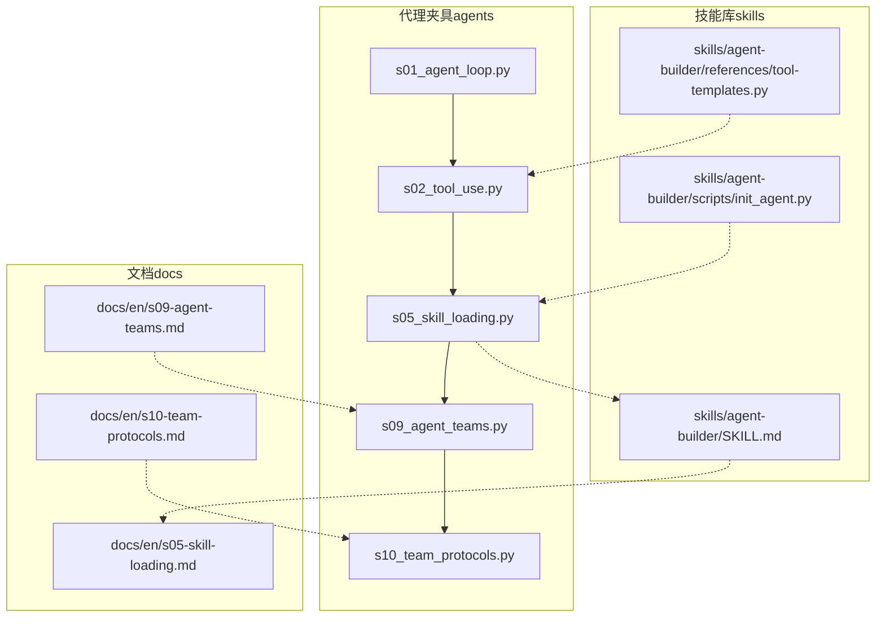
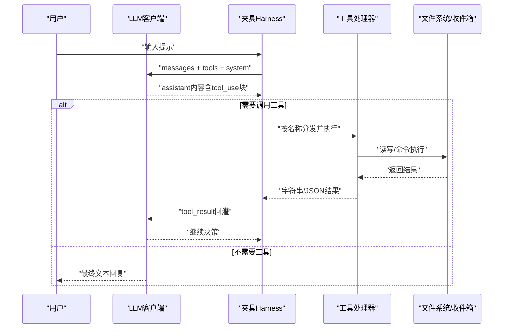
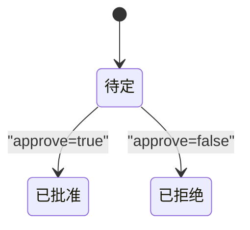
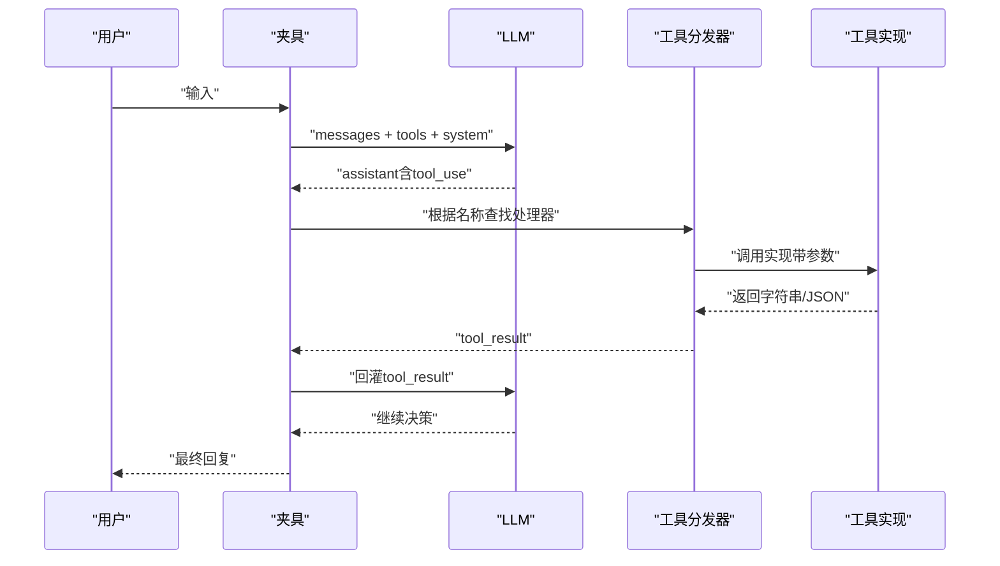

# 扩展开发指南

<cite>
**本文档引用的文件**
- [agents/__init__.py](file://agents/__init__.py)
- [agents/s01_agent_loop.py](file://agents/s01_agent_loop.py)
- [agents/s02_tool_use.py](file://agents/s02_tool_use.py)
- [agents/s05_skill_loading.py](file://agents/s05_skill_loading.py)
- [agents/s09_agent_teams.py](file://agents/s09_agent_teams.py)
- [agents/s10_team_protocols.py](file://agents/s10_team_protocols.py)
- [skills/agent-builder/SKILL.md](file://skills/agent-builder/SKILL.md)
- [skills/agent-builder/references/tool-templates.py](file://skills/agent-builder/references/tool-templates.py)
- [skills/agent-builder/scripts/init_agent.py](file://skills/agent-builder/scripts/init_agent.py)
- [README.md](file://README.md)
- [docs/en/s05-skill-loading.md](file://docs/en/s05-skill-loading.md)
- [docs/en/s09-agent-teams.md](file://docs/en/s09-agent-teams.md)
- [docs/en/s10-team-protocols.md](file://docs/en/s10-team-protocols.md)
- [requirements.txt](file://requirements.txt)
</cite>

## 目录
1. [简介](#简介)
2. [项目结构](#项目结构)
3. [核心组件](#核心组件)
4. [架构总览](#架构总览)
5. [详细组件分析](#详细组件分析)
6. [依赖分析](#依赖分析)
7. [性能考虑](#性能考虑)
8. [故障排查指南](#故障排查指南)
9. [结论](#结论)
10. [附录](#附录)

## 简介
本指南面向希望在现有机制基础上扩展代理能力的工程师，系统讲解如何：
- 基于统一的“代理循环”模式扩展工具（注册新工具、定义输入输出模式、实现安全检查）
- 设计与加载“技能”（技能文件格式、元数据配置、两层注入机制）
- 定制团队通信协议（消息格式、握手规则、状态机与追踪）
- 提供可复用的代码路径示例与最佳实践，帮助你快速构建稳定、可维护的代理扩展。

## 项目结构
该仓库以“会话式教学”的方式组织，每个脚本（s01–s12）演示一个“夹具（Harness）”机制，围绕“代理循环”叠加一层能力而不改变循环本身。核心目录与职责如下：
- agents：12个渐进式示例脚本，演示从基础循环到团队协作与协议控制
- skills：按领域划分的“技能”知识库，采用两层注入策略
- docs：多语言文档，配套讲解每个机制的设计动机与实现要点
- web：交互式可视化平台（非本文重点）
- 根目录：README与环境依赖声明

图示来源
- [agents/s01_agent_loop.py:1-121](file://agents/s01_agent_loop.py#L1-L121)
- [agents/s02_tool_use.py:1-151](file://agents/s02_tool_use.py#L1-L151)
- [agents/s05_skill_loading.py:1-228](file://agents/s05_skill_loading.py#L1-L228)
- [agents/s09_agent_teams.py:1-404](file://agents/s09_agent_teams.py#L1-L404)
- [agents/s10_team_protocols.py:1-485](file://agents/s10_team_protocols.py#L1-L485)
- [skills/agent-builder/SKILL.md:1-130](file://skills/agent-builder/SKILL.md#L1-L130)
- [skills/agent-builder/references/tool-templates.py:1-272](file://skills/agent-builder/references/tool-templates.py#L1-L272)
- [skills/agent-builder/scripts/init_agent.py:1-280](file://skills/agent-builder/scripts/init_agent.py#L1-L280)
- [docs/en/s05-skill-loading.md:1-109](file://docs/en/s05-skill-loading.md#L1-L109)
- [docs/en/s09-agent-teams.md:1-126](file://docs/en/s09-agent-teams.md#L1-L126)
- [docs/en/s10-team-protocols.md:1-107](file://docs/en/s10-team-protocols.md#L1-L107)

章节来源
- [README.md:287-378](file://README.md#L287-L378)
- [agents/__init__.py:1-4](file://agents/__init__.py#L1-L4)

## 核心组件
- 代理循环（Agent Loop）：统一的“模型决策 + 工具执行 + 结果回灌”循环，贯穿所有示例
- 工具系统（Tools）：工具定义（名称、描述、JSON Schema 输入）、分发映射（名称到处理器）
- 技能系统（Skills）：两层注入（系统提示层1 + 工具结果层2），通过目录扫描与YAML Frontmatter解析
- 团队系统（Teams）：基于线程与JSONL收件箱的异步通信，支持持久化配置与广播
- 协议系统（Protocols）：请求-响应状态机（pending → approved/rejected），使用 request_id 关联

章节来源
- [README.md:190-218](file://README.md#L190-L218)
- [agents/s02_tool_use.py:94-111](file://agents/s02_tool_use.py#L94-L111)
- [agents/s05_skill_loading.py:58-107](file://agents/s05_skill_loading.py#L58-L107)
- [agents/s09_agent_teams.py:77-121](file://agents/s09_agent_teams.py#L77-L121)
- [agents/s10_team_protocols.py:81-84](file://agents/s10_team_protocols.py#L81-L84)

## 架构总览
下图展示了从基础循环到团队与协议的演进路径，以及夹具层如何围绕循环叠加能力：

图示来源
- [agents/s01_agent_loop.py:80-102](file://agents/s01_agent_loop.py#L80-L102)
- [agents/s02_tool_use.py:114-132](file://agents/s02_tool_use.py#L114-L132)
- [agents/s09_agent_teams.py:345-379](file://agents/s09_agent_teams.py#L345-L379)
- [agents/s10_team_protocols.py:426-460](file://agents/s10_team_protocols.py#L426-L460)

## 详细组件分析

### 工具扩展指南（新增工具、输入输出模式、安全检查）
目标：在不改变代理循环的前提下，为代理增加新的原子能力。

- 注册新工具
  - 在工具列表中添加条目，包含 name、description、input_schema
  - 在分发映射中新增名称到实现函数的映射
  - 参考路径：[工具定义与分发映射:102-111](file://agents/s02_tool_use.py#L102-L111)，[分发映射:94-100](file://agents/s02_tool_use.py#L94-L100)

- 定义输入输出模式
  - input_schema 使用 JSON Schema 描述参数类型、必填字段与枚举值
  - 输出建议统一为字符串或结构化 JSON 字符串，便于回灌到消息历史
  - 参考路径：[模板工具的Schema定义:19-117](file://skills/agent-builder/references/tool-templates.py#L19-L117)

- 实现安全检查
  - 路径安全：确保操作限定在工作区目录内，防止路径逃逸
  - 命令安全：阻断高危命令，设置超时与输出截断
  - 参考路径：[路径校验与危险命令拦截:41-51](file://agents/s02_tool_use.py#L41-L51)，[命令执行与超时处理:48-59](file://agents/s02_tool_use.py#L48-L59)

- 示例：新增一个“计算工具”
  - 步骤
    1) 在工具列表中添加条目（例如 name: calc，描述与输入schema）
    2) 在分发映射中添加 lambda 处理器
    3) 实现安全的计算逻辑（限制表达式范围、异常捕获）
  - 参考路径：[工具模板与分发模式:253-272](file://skills/agent-builder/references/tool-templates.py#L253-L272)

章节来源
- [agents/s02_tool_use.py:41-111](file://agents/s02_tool_use.py#L41-L111)
- [skills/agent-builder/references/tool-templates.py:141-181](file://skills/agent-builder/references/tool-templates.py#L141-L181)

### 技能开发指南（格式规范、元数据、加载机制）
目标：将领域知识以“按需加载”的方式注入，避免系统提示膨胀。

- 文件格式与元数据
  - 每个技能位于 skills/<name>/SKILL.md
  - 使用 YAML Frontmatter 定义 name、description、tags 等元数据
  - 参考路径：[技能文件示例:1-11](file://skills/agent-builder/SKILL.md#L1-L11)

- 加载机制
  - 层1（系统提示）：列出可用技能名称与简述
  - 层2（工具结果）：当模型调用 load_skill(name) 时，返回完整技能正文
  - 参考路径：[技能加载器类与两层注入:58-107](file://agents/s05_skill_loading.py#L58-L107)，[系统提示拼接:109-114](file://agents/s05_skill_loading.py#L109-L114)，[工具定义与处理器:174-185](file://agents/s05_skill_loading.py#L174-L185)

- 最佳实践
  - 将技能拆分为独立目录，避免单文件过大
  - 元数据清晰，便于系统提示层展示
  - 使用固定标签体系，便于检索与过滤
  - 参考路径：[文档讲解:36-87](file://docs/en/s05-skill-loading.md#L36-L87)

章节来源
- [agents/s05_skill_loading.py:58-114](file://agents/s05_skill_loading.py#L58-L114)
- [skills/agent-builder/SKILL.md:1-11](file://skills/agent-builder/SKILL.md#L1-L11)
- [docs/en/s05-skill-loading.md:36-87](file://docs/en/s05-skill-loading.md#L36-L87)

### 团队与协议定制（消息格式、通信规则、状态管理）
目标：在多代理场景下建立稳定的通信与协作规则。

- 消息格式与通道
  - 收件箱：每个代理一个 JSONL 文件，追加消息，读取后清空
  - 消息类型：message、broadcast、shutdown_request、shutdown_response、plan_approval_response
  - 参考路径：[消息类型集合:68-74](file://agents/s09_agent_teams.py#L68-L74)，[MessageBus 发送与读取:83-119](file://agents/s09_agent_teams.py#L83-L119)

- 通信规则
  - 异步：代理在每次 LLM 调用前读取收件箱，注入上下文
  - 广播：向所有成员发送通知
  - 参考路径：[主循环读取收件箱:347-352](file://agents/s09_agent_teams.py#L347-L352)，[广播实现:111-118](file://agents/s09_agent_teams.py#L111-L118)

- 状态管理与生命周期
  - TeammateManager 维护 config.json，记录成员状态（idle/working/shutdown）
  - 线程池运行每个代理的 agent_loop，守护线程
  - 参考路径：[成员状态更新:201-204](file://agents/s09_agent_teams.py#L201-L204)，[线程启动:157-164](file://agents/s09_agent_teams.py#L157-L164)

- 协议设计（请求-响应状态机）
  - shutdown 协议：lead 请求 → teammate 决策（approve/reject）→ lead 记录状态
  - plan 审批协议：teammate 提交计划 → lead 审核（approve/reject）→ 反馈
  - request_id 关联，共享 pending → approved/rejected 状态机
  - 参考路径：[请求追踪与锁:81-84](file://agents/s10_team_protocols.py#L81-L84)，[关闭请求发起:351-359](file://agents/s10_team_protocols.py#L351-L359)，[计划审批处理:362-374](file://agents/s10_team_protocols.py#L362-L374)

图示来源
- [agents/s10_team_protocols.py:34-41](file://agents/s10_team_protocols.py#L34-L41)

章节来源
- [agents/s09_agent_teams.py:77-121](file://agents/s09_agent_teams.py#L77-L121)
- [agents/s10_team_protocols.py:81-128](file://agents/s10_team_protocols.py#L81-L128)

### 代码级流程图（工具执行序列）

图示来源
- [agents/s02_tool_use.py:114-132](file://agents/s02_tool_use.py#L114-L132)
- [agents/s05_skill_loading.py:188-209](file://agents/s05_skill_loading.py#L188-L209)

## 依赖分析
- 运行时依赖
  - anthropic：调用 LLM API
  - python-dotenv：加载 .env 环境变量
  - pyyaml：解析技能文件的 YAML Frontmatter
- 参考路径：[依赖声明:1-3](file://requirements.txt#L1-L3)

章节来源
- [requirements.txt:1-3](file://requirements.txt#L1-L3)

## 性能考虑
- 上下文压缩：随着对话轮次增多，应采用分层压缩策略，避免超出上下文长度
- 工具调用批量化：合并多个小工具调用的结果，减少往返次数
- 异步通信：团队协作使用 JSONL 追加与读取，避免阻塞主循环
- 超时与限流：为外部命令与网络请求设置合理超时，防止资源泄露
- 参考路径：[README 中的性能与上下文策略说明:172-176](file://README.md#L172-L176)

## 故障排查指南
- 工具未生效
  - 检查工具是否正确加入 TOOLS 列表与分发映射
  - 确认 input_schema 与调用参数一致
  - 参考路径：[工具定义与分发:94-111](file://agents/s02_tool_use.py#L94-L111)
- 路径逃逸或权限问题
  - 确保所有文件操作均通过安全路径校验
  - 参考路径：[安全路径校验:41-45](file://agents/s02_tool_use.py#L41-L45)
- 技能未被识别
  - 确认 SKILL.md 存在于 skills/<name>/ 目录
  - 确认 YAML Frontmatter 正确且 name 字段存在
  - 参考路径：[技能扫描与解析:65-83](file://agents/s05_skill_loading.py#L65-L83)
- 团队通信异常
  - 检查 .team/config.json 是否存在且可写
  - 确认收件箱 JSONL 文件可读写
  - 参考路径：[配置与收件箱:132-119](file://agents/s09_agent_teams.py#L132-L119)
- 协议状态卡住
  - 检查 request_id 是否匹配，确认状态机流转
  - 参考路径：[请求追踪与状态更新:236-246](file://agents/s10_team_protocols.py#L236-L246)

章节来源
- [agents/s02_tool_use.py:41-111](file://agents/s02_tool_use.py#L41-L111)
- [agents/s05_skill_loading.py:65-83](file://agents/s05_skill_loading.py#L65-L83)
- [agents/s09_agent_teams.py:132-119](file://agents/s09_agent_teams.py#L132-L119)
- [agents/s10_team_protocols.py:236-246](file://agents/s10_team_protocols.py#L236-L246)

## 结论
通过统一的代理循环与模块化的夹具层，你可以以“增量叠加”的方式持续扩展代理能力：
- 工具层：原子能力 + 安全边界
- 技能层：按需知识 + 两层注入
- 团队层：身份与生命周期 + 异步通信
- 协议层：请求-响应状态机 + request_id 关联

遵循本文的最佳实践，可在保证安全性与可维护性的前提下，快速构建复杂而稳健的代理系统。

## 附录
- 快速开始
  - 安装依赖：pip install -r requirements.txt
  - 复制并编辑 .env 示例，填写 API Key
  - 运行示例：python agents/s01_agent_loop.py
  - 参考路径：[快速开始与学习路径:232-286](file://README.md#L232-L286)
- 脚手架与模板
  - 使用 init_agent.py 生成新代理项目，支持不同复杂度等级
  - 参考路径：[初始化脚本:217-253](file://skills/agent-builder/scripts/init_agent.py#L217-L253)
- 相关文档
  - 技能加载：[文档:1-109](file://docs/en/s05-skill-loading.md#L1-L109)
  - 团队协作：[文档:1-126](file://docs/en/s09-agent-teams.md#L1-L126)
  - 协议控制：[文档:1-107](file://docs/en/s10-team-protocols.md#L1-L107)