# 架构设计原则

<cite>
**本文引用的文件**
- [README.md](file://README.md)
- [agents/__init__.py](file://agents/__init__.py)
- [agents/s01_agent_loop.py](file://agents/s01_agent_loop.py)
- [agents/s02_tool_use.py](file://agents/s02_tool_use.py)
- [agents/s07_task_system.py](file://agents/s07_task_system.py)
- [agents/s09_agent_teams.py](file://agents/s09_agent_teams.py)
- [agents/s12_worktree_task_isolation.py](file://agents/s12_worktree_task_isolation.py)
- [agents/s_full.py](file://agents/s_full.py)
- [web/src/components/architecture/arch-diagram.tsx](file://web/src/components/architecture/arch-diagram.tsx)
- [web/src/components/architecture/design-decisions.tsx](file://web/src/components/architecture/design-decisions.tsx)
- [web/src/lib/constants.ts](file://web/src/lib/constants.ts)
- [requirements.txt](file://requirements.txt)
- [web/package.json](file://web/package.json)
</cite>

## 目录
1. [引言](#引言)
2. [项目结构](#项目结构)
3. [核心组件](#核心组件)
4. [架构总览](#架构总览)
5. [详细组件分析](#详细组件分析)
6. [依赖分析](#依赖分析)
7. [性能考量](#性能考量)
8. [故障排查指南](#故障排查指南)
9. [结论](#结论)
10. [附录](#附录)

## 引言
本项目以“代理循环（agent loop）”为核心，围绕工具系统、知识注入、上下文压缩、任务与子代理、后台任务、团队协作、工作树隔离等机制，构建了渐进式、可组合的“ Harness 工程”体系。其核心理念是：模型即代理，代码即 Harness；通过模块化、分层设计与工具分发模式，将复杂能力以“机制叠加”的方式安全、可扩展地集成到代理循环中。

- 模型负责决策，Harness 负责执行与环境适配。
- 每个会话（s01–s12）引入一个新机制，不改变核心循环。
- 该设计强调可扩展性、安全性与可观测性，并在 Web 平台提供可视化学习体验。

章节来源
- [README.md: 1-378:1-378](file://README.md#L1-L378)

## 项目结构
仓库采用按主题分层的模块化组织：
- agents：Python 参考实现（s01–s12 与 s_full 总结）
- docs：多语言文档（英文、中文、日文）
- skills：技能文件（按需注入）
- web：Next.js 学习平台，包含架构图、设计决策、可视化组件与数据
- tests：端到端测试
- 根目录：README、依赖清单、环境配置

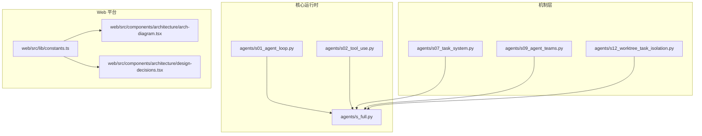

图表来源
- [agents/s01_agent_loop.py: 1-121:1-121](file://agents/s01_agent_loop.py#L1-L121)
- [agents/s02_tool_use.py: 1-151:1-151](file://agents/s02_tool_use.py#L1-L151)
- [agents/s07_task_system.py: 1-244:1-244](file://agents/s07_task_system.py#L1-L244)
- [agents/s09_agent_teams.py: 1-404:1-404](file://agents/s09_agent_teams.py#L1-L404)
- [agents/s12_worktree_task_isolation.py: 1-783:1-783](file://agents/s12_worktree_task_isolation.py#L1-L783)
- [agents/s_full.py: 1-741:1-741](file://agents/s_full.py#L1-L741)
- [web/src/components/architecture/arch-diagram.tsx: 1-229:1-229](file://web/src/components/architecture/arch-diagram.tsx#L1-L229)
- [web/src/components/architecture/design-decisions.tsx: 1-148:1-148](file://web/src/components/architecture/design-decisions.tsx#L1-L148)
- [web/src/lib/constants.ts: 1-38:1-38](file://web/src/lib/constants.ts#L1-L38)

章节来源
- [README.md: 287-318:287-318](file://README.md#L287-L318)
- [agents/__init__.py: 1-4:1-4](file://agents/__init__.py#L1-L4)

## 核心组件
- 代理循环（Agent Loop）：统一的推理与工具调用循环，模型决定何时停止与何时调用工具。
- 工具系统（Tool Dispatch）：以工具名到处理器的映射实现工具分发，保持循环不变。
- 上下文管理（Context Management）：微压缩、自动压缩与归档三段式策略，保障长会话可用性。
- 任务系统（Task System）：基于文件的任务持久化与依赖图，支持跨会话状态延续。
- 后台任务（Background Tasks）：非阻塞线程执行与通知队列，提升交互连续性。
- 团队协作（Agent Teams）：命名代理与文件型 JSONL 邮箱，异步通信与协议化握手。
- 工作树隔离（Worktree Isolation）：以目录隔离执行空间，配合任务板进行并行与边界控制。
- 技能加载（Skill Loader）：按需注入知识，避免系统提示膨胀。
- 子代理（Subagent）：为复杂子任务创建独立上下文，避免主对话污染。

章节来源
- [README.md: 190-218:190-218](file://README.md#L190-L218)
- [agents/s02_tool_use.py: 94-111:94-111](file://agents/s02_tool_use.py#L94-L111)
- [agents/s07_task_system.py: 47-119:47-119](file://agents/s07_task_system.py#L47-L119)
- [agents/s09_agent_teams.py: 77-118:77-118](file://agents/s09_agent_teams.py#L77-L118)
- [agents/s12_worktree_task_isolation.py: 82-119:82-119](file://agents/s12_worktree_task_isolation.py#L82-L119)
- [agents/s_full.py: 123-157:123-157](file://agents/s_full.py#L123-L157)
- [agents/s_full.py: 199-224:199-224](file://agents/s_full.py#L199-L224)

## 架构总览
整体采用“内核循环 + 机制叠加”的分层架构：
- 最底层：代理循环（s01），承载模型推理与工具调用。
- 中间层：工具系统（s02）、规划与知识（s03–s05）、上下文压缩（s06）、任务（s07）、后台（s08）。
- 协作层：团队（s09）、协议（s10）、自治（s11）、工作树隔离（s12）。
- Web 层：可视化展示版本演进、设计决策与交互流程。

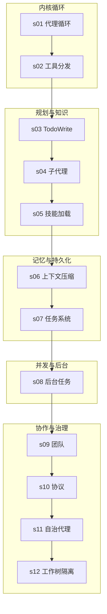

图表来源
- [README.md: 256-285:256-285](file://README.md#L256-L285)
- [agents/s01_agent_loop.py: 81-101:81-101](file://agents/s01_agent_loop.py#L81-L101)
- [agents/s02_tool_use.py: 114-131:114-131](file://agents/s02_tool_use.py#L114-L131)
- [agents/s07_task_system.py: 204-224:204-224](file://agents/s07_task_system.py#L204-L224)
- [agents/s09_agent_teams.py: 345-378:345-378](file://agents/s09_agent_teams.py#L345-L378)
- [agents/s12_worktree_task_isolation.py: 729-759:729-759](file://agents/s12_worktree_task_isolation.py#L729-L759)

## 详细组件分析

### 代理循环与工具分发（s01–s02）
- 设计要点
  - 循环保持稳定：模型决定是否继续；Harness 仅执行工具。
  - 工具分发：通过工具描述数组与处理器映射，新增工具只需注册。
  - 安全前置：危险命令拦截、超时保护、路径白名单校验。
- 扩展性
  - 新增工具不影响循环；通过输入模式约束与类型校验保证一致性。
- 可观测性
  - 工具调用结果回写消息历史，便于审计与重放。

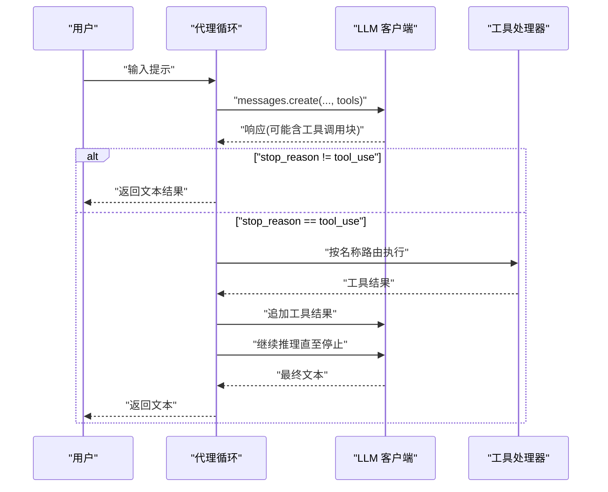

图表来源
- [agents/s01_agent_loop.py: 81-101:81-101](file://agents/s01_agent_loop.py#L81-L101)
- [agents/s02_tool_use.py: 114-131:114-131](file://agents/s02_tool_use.py#L114-L131)

章节来源
- [agents/s01_agent_loop.py: 1-121:1-121](file://agents/s01_agent_loop.py#L1-L121)
- [agents/s02_tool_use.py: 1-151:1-151](file://agents/s02_tool_use.py#L1-L151)

### 规划与知识注入（s03–s05）
- TodoWrite（s03）
  - 任务列表管理与“未完成提醒”，防止无计划漂移。
  - 状态约束与活跃项限制，确保焦点明确。
- 子代理（s04）
  - 为每个子任务创建独立消息上下文，避免主对话污染。
- 技能加载（s05）
  - 基于 SKILL.md 的两层注入：枚举描述 + 按需注入正文，避免系统提示膨胀。

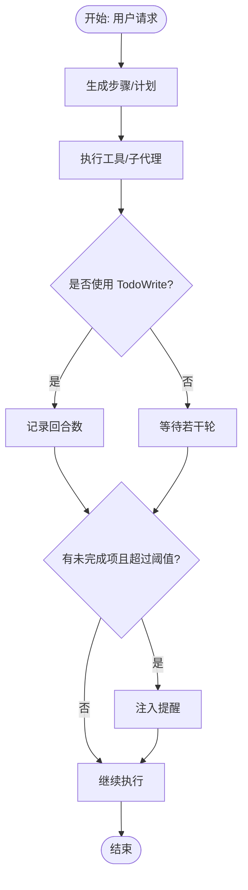

图表来源
- [agents/s_full.py: 654-707:654-707](file://agents/s_full.py#L654-L707)
- [agents/s_full.py: 123-157:123-157](file://agents/s_full.py#L123-L157)

章节来源
- [agents/s_full.py: 123-157:123-157](file://agents/s_full.py#L123-L157)
- [agents/s_full.py: 199-224:199-224](file://agents/s_full.py#L199-L224)

### 上下文压缩（s06）
- 三段式策略
  - 微压缩：清理近期冗余工具结果片段。
  - 自动压缩：将最近会话转存为归档并摘要，保留连续性。
  - 归档：长期会话持久化，降低令牌占用。
- 关键收益
  - 支持无限会话；在不牺牲理解的前提下控制上下文长度。

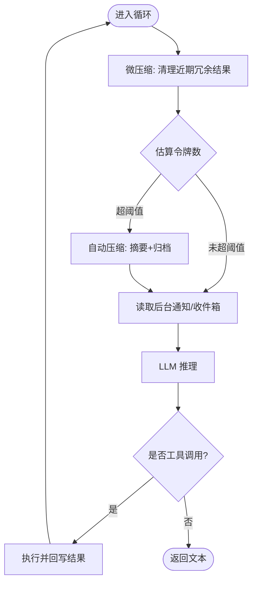

图表来源
- [agents/s_full.py: 227-258:227-258](file://agents/s_full.py#L227-L258)
- [agents/s_full.py: 654-707:654-707](file://agents/s_full.py#L654-L707)

章节来源
- [agents/s07_task_system.py: 226-258:226-258](file://agents/s07_task_system.py#L226-L258)
- [agents/s_full.py: 227-258:227-258](file://agents/s_full.py#L227-L258)

### 任务系统（s07）
- 文件化任务持久化，支持依赖图与阻塞关系。
- 提供 CRUD、依赖变更与列表展示，作为多智能体协作的协调中枢。

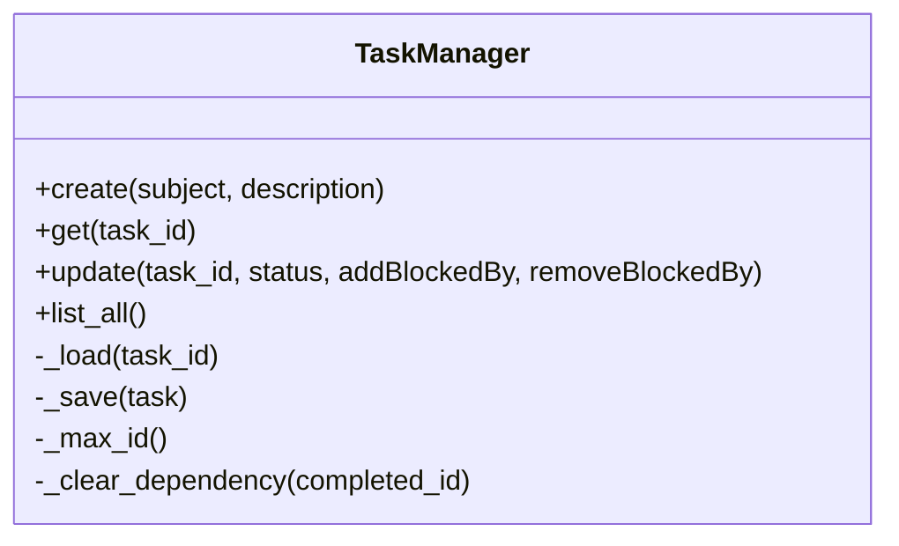

图表来源
- [agents/s07_task_system.py: 47-119:47-119](file://agents/s07_task_system.py#L47-L119)

章节来源
- [agents/s07_task_system.py: 1-244:1-244](file://agents/s07_task_system.py#L1-L244)

### 后台任务（s08）
- 非阻塞执行 + 通知队列，避免阻塞主循环。
- 支持启动、查询与批量拉取通知，提升长任务体验。

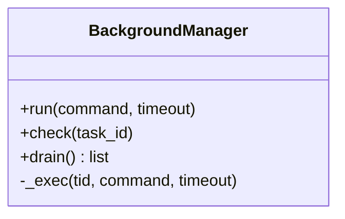

图表来源
- [agents/s_full.py: 328-361:328-361](file://agents/s_full.py#L328-L361)

章节来源
- [agents/s_full.py: 328-361:328-361](file://agents/s_full.py#L328-L361)

### 团队协作（s09–s11）
- 文件型 JSONL 邮箱：异步消息传递，支持广播与单播。
- 协议化握手：shutdown_request/response、plan_approval_response 等，统一协商范式。
- 自治代理：空闲轮询、任务扫描与认领，减少中心化分配。

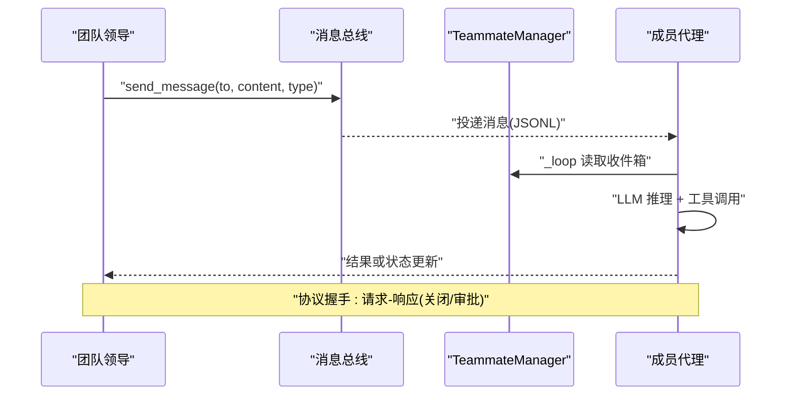

图表来源
- [agents/s09_agent_teams.py: 345-378:345-378](file://agents/s09_agent_teams.py#L345-L378)
- [agents/s09_agent_teams.py: 166-204:166-204](file://agents/s09_agent_teams.py#L166-L204)
- [agents/s_full.py: 560-574:560-574](file://agents/s_full.py#L560-L574)

章节来源
- [agents/s09_agent_teams.py: 1-404:1-404](file://agents/s09_agent_teams.py#L1-L404)
- [agents/s_full.py: 399-542:399-542](file://agents/s_full.py#L399-L542)

### 工作树隔离（s12）
- 以 Git Worktree 为执行隔离单元，结合任务板进行并行与边界控制。
- 生命周期事件流（EventBus）提供可观测性，支持 keep/remove/closeout 流程。

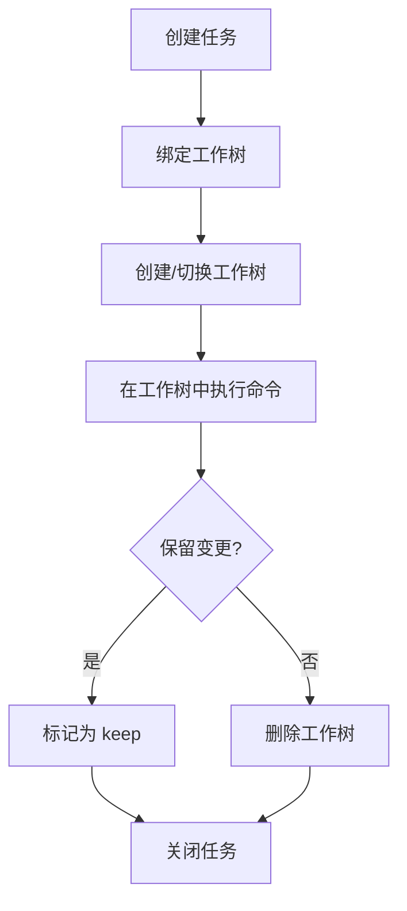

图表来源
- [agents/s12_worktree_task_isolation.py: 224-474:224-474](file://agents/s12_worktree_task_isolation.py#L224-L474)

章节来源
- [agents/s12_worktree_task_isolation.py: 1-783:1-783](file://agents/s12_worktree_task_isolation.py#L1-L783)

### Web 平台与可视化
- 架构图组件：按版本收集类与工具，动态高亮新增机制，按层着色。
- 设计决策组件：按版本展示设计权衡与替代方案，支持多语言。
- 常量定义：版本顺序、学习路径、分层映射，支撑前端渲染与导航。

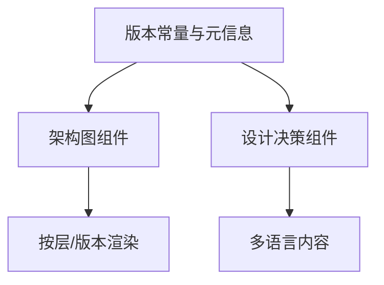

图表来源
- [web/src/lib/constants.ts: 1-38:1-38](file://web/src/lib/constants.ts#L1-L38)
- [web/src/components/architecture/arch-diagram.tsx: 105-229:105-229](file://web/src/components/architecture/arch-diagram.tsx#L105-L229)
- [web/src/components/architecture/design-decisions.tsx: 121-148:121-148](file://web/src/components/architecture/design-decisions.tsx#L121-L148)

章节来源
- [web/src/lib/constants.ts: 1-38:1-38](file://web/src/lib/constants.ts#L1-L38)
- [web/src/components/architecture/arch-diagram.tsx: 1-229:1-229](file://web/src/components/architecture/arch-diagram.tsx#L1-L229)
- [web/src/components/architecture/design-decisions.tsx: 1-148:1-148](file://web/src/components/architecture/design-decisions.tsx#L1-L148)

## 依赖分析
- 运行时依赖
  - anthropic：与 Claude API 交互。
  - python-dotenv：加载环境变量。
  - yaml：用于解析技能元数据。
- Web 依赖
  - Next.js、React、Framer Motion、TailwindCSS 等，支撑可视化与交互。
- 组件耦合
  - s_full 将各机制实例化并注入工具分发，体现“组合优于继承”的设计。
  - 团队与任务之间通过消息总线与文件系统解耦，降低直接耦合。

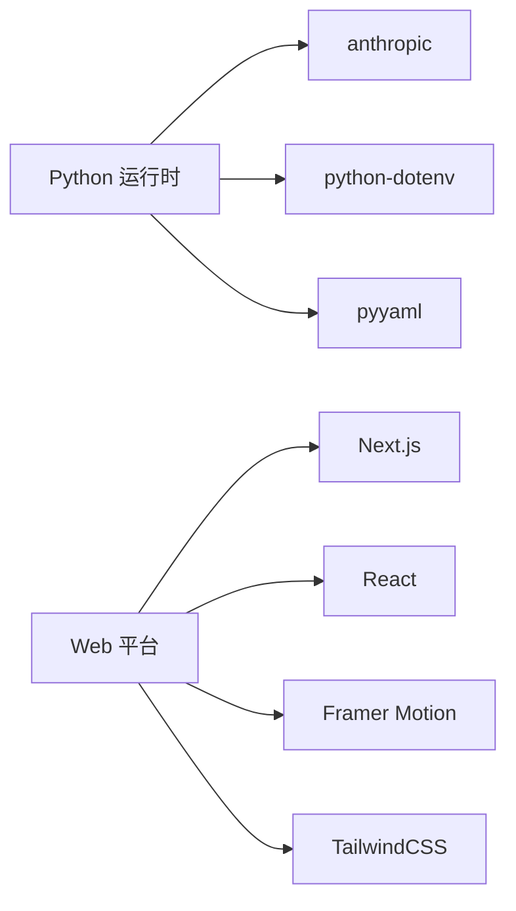

图表来源
- [requirements.txt: 1-3:1-3](file://requirements.txt#L1-L3)
- [web/package.json: 13-38:13-38](file://web/package.json#L13-L38)

章节来源
- [requirements.txt: 1-3:1-3](file://requirements.txt#L1-L3)
- [web/package.json: 1-39:1-39](file://web/package.json#L1-L39)

## 性能考量
- 令牌预算控制
  - 通过微压缩与自动压缩降低上下文长度，避免超出模型上下文窗口。
- 并发与非阻塞
  - 后台任务线程池与通知队列，避免主循环被慢操作阻塞。
- I/O 优化
  - 文件型邮箱与归档策略，减少内存压力；工作树隔离避免冲突与重复计算。
- 可观测性
  - 事件流记录生命周期事件，便于定位瓶颈与异常。

## 故障排查指南
- 常见问题
  - 工具执行失败：检查危险命令拦截、超时与路径合法性。
  - 上下文过长：触发自动压缩或手动压缩；确认归档是否正确生成。
  - 团队通信异常：检查 JSONL 邮箱权限与文件存在性；确认消息类型有效。
  - 工作树操作失败：确认 Git 环境可用；检查工作树索引与状态。
- 排查步骤
  - 查看最近事件流（s12）或收件箱（s09）。
  - 使用 REPL 命令：/compact、/tasks、/team、/inbox。
  - 检查环境变量与 API 密钥配置。

章节来源
- [agents/s01_agent_loop.py: 66-78:66-78](file://agents/s01_agent_loop.py#L66-L78)
- [agents/s09_agent_teams.py: 83-98:83-98](file://agents/s09_agent_teams.py#L83-L98)
- [agents/s12_worktree_task_isolation.py: 250-263:250-263](file://agents/s12_worktree_task_isolation.py#L250-L263)
- [agents/s_full.py: 709-741:709-741](file://agents/s_full.py#L709-L741)

## 结论
Learn Claude Code 以“代理循环 + 机制叠加”的架构，将工具、规划、记忆、并发、协作与隔离等能力以模块化方式组合，形成可扩展、可治理、可观察的 Harness 工程体系。该设计既满足教学演示的渐进性，又为生产级 Agent 系统提供了清晰的扩展路径与最佳实践。

## 附录
- 学习路径与分层映射
  - 工具与执行（s01–s02）
  - 规划与协调（s03–s05、s07）
  - 记忆管理（s06）
  - 并发（s08）
  - 协作（s09–s12）

章节来源
- [README.md: 256-285:256-285](file://README.md#L256-L285)
- [web/src/lib/constants.ts: 31-37:31-37](file://web/src/lib/constants.ts#L31-L37)