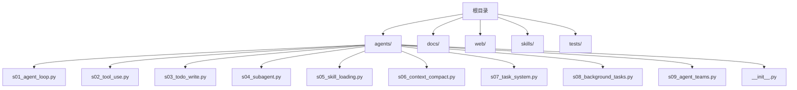
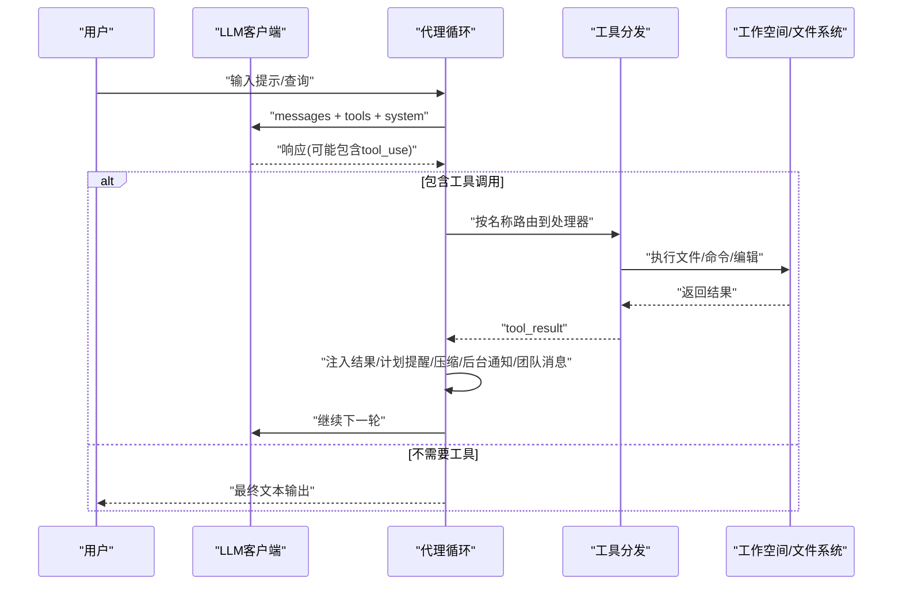
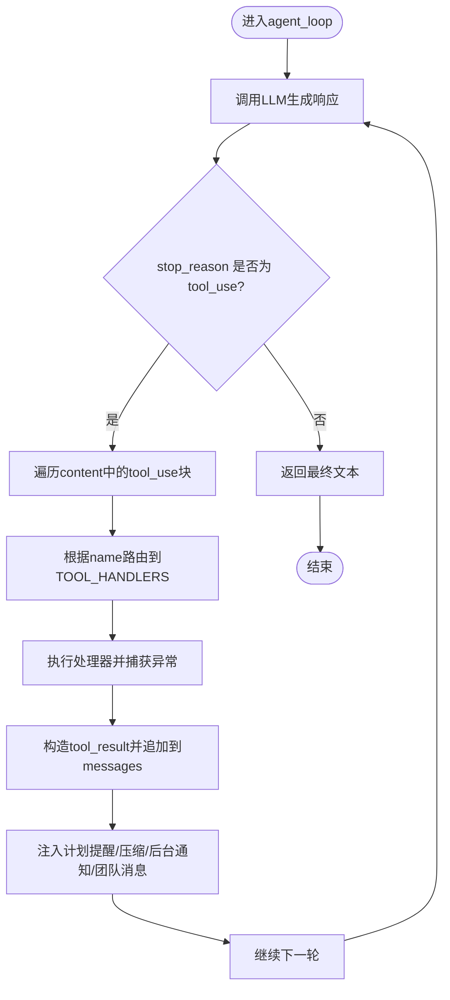
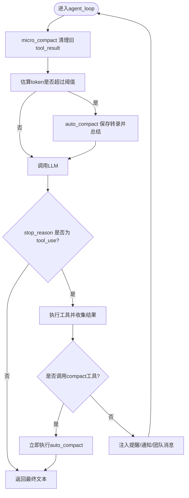
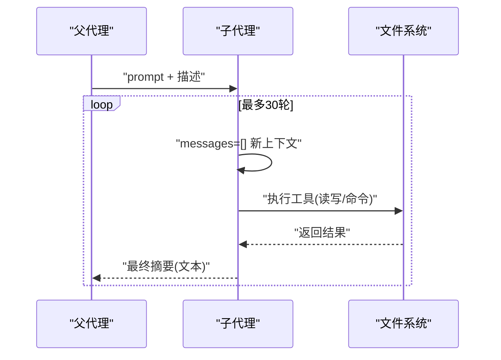
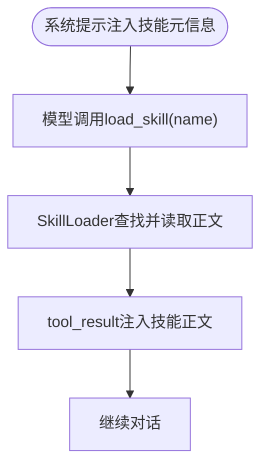
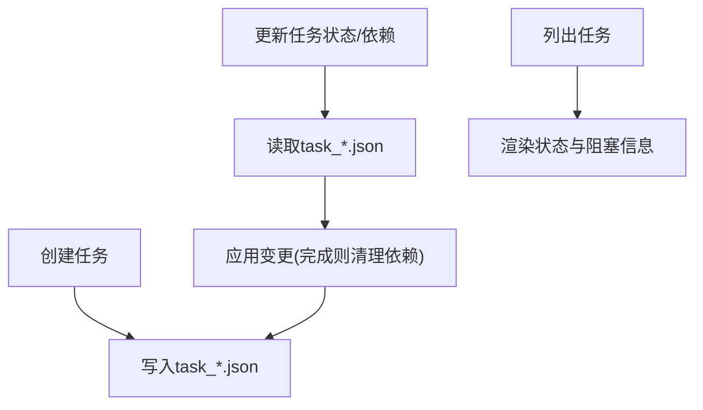
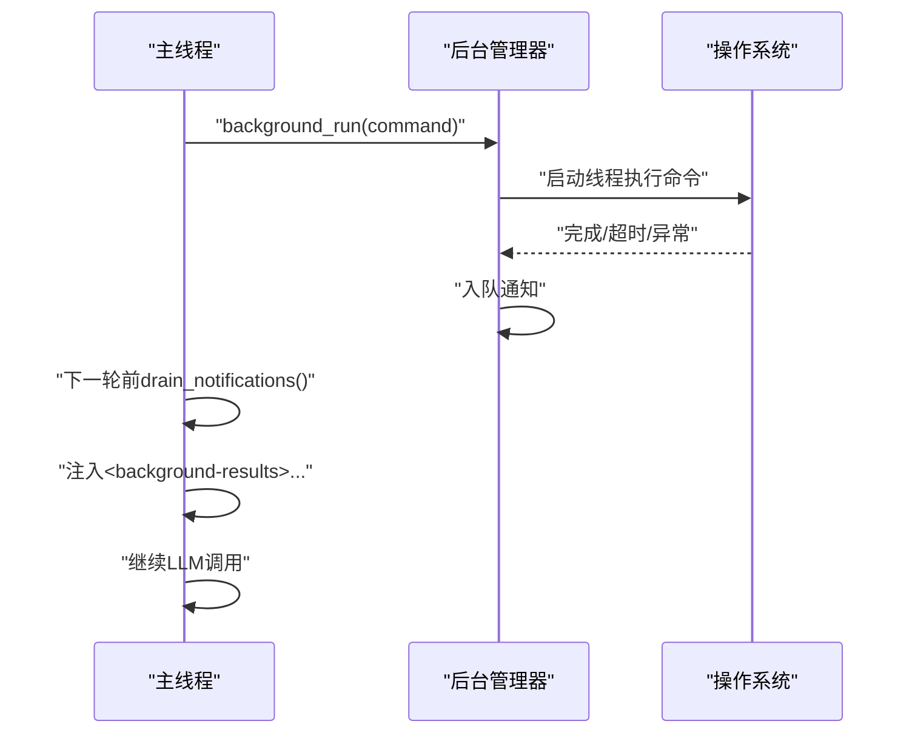
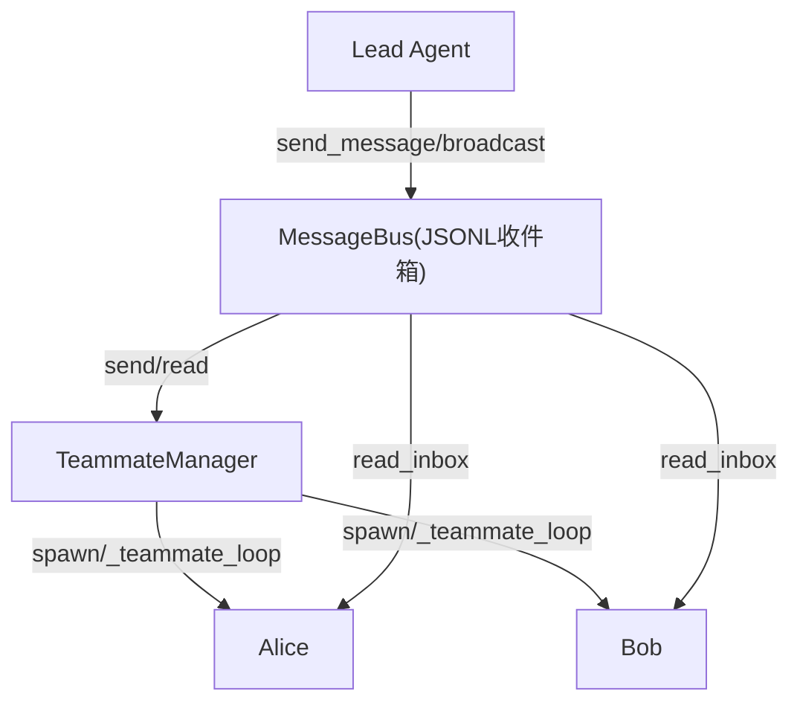
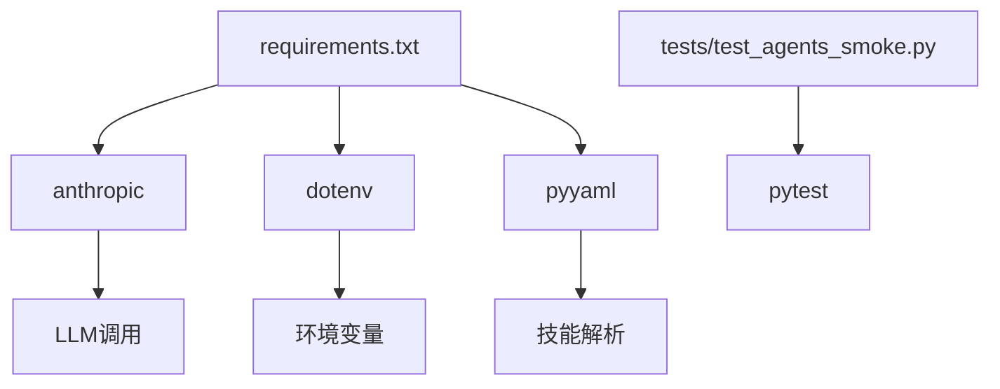

# 调试与性能优化

<cite>
**本文引用的文件**
- [README.md](file://README.md)
- [requirements.txt](file://requirements.txt)
- [agents/__init__.py](file://agents/__init__.py)
- [agents/s01_agent_loop.py](file://agents/s01_agent_loop.py)
- [agents/s02_tool_use.py](file://agents/s02_tool_use.py)
- [agents/s03_todo_write.py](file://agents/s03_todo_write.py)
- [agents/s04_subagent.py](file://agents/s04_subagent.py)
- [agents/s05_skill_loading.py](file://agents/s05_skill_loading.py)
- [agents/s06_context_compact.py](file://agents/s06_context_compact.py)
- [agents/s07_task_system.py](file://agents/s07_task_system.py)
- [agents/s08_background_tasks.py](file://agents/s08_background_tasks.py)
- [agents/s09_agent_teams.py](file://agents/s09_agent_teams.py)
- [tests/test_agents_smoke.py](file://tests/test_agents_smoke.py)
</cite>

## 目录
1. [简介](#简介)
2. [项目结构](#项目结构)
3. [核心组件](#核心组件)
4. [架构总览](#架构总览)
5. [详细组件分析](#详细组件分析)
6. [依赖分析](#依赖分析)
7. [性能考量](#性能考量)
8. [故障排除指南](#故障排除指南)
9. [结论](#结论)
10. [附录](#附录)

## 简介
本指南面向在该代理系统中进行调试与性能优化的开发者，目标是帮助你快速定位问题、理解运行瓶颈，并通过系统化的日志与监控策略、工具链与分析方法，持续提升系统的稳定性与吞吐能力。文档以代理循环为核心，串联各会话机制（工具、计划、子代理、技能加载、上下文压缩、任务持久化、后台任务、团队协作），并给出可操作的调试步骤、性能分析建议与常见问题排查清单。

## 项目结构
该仓库采用“会话式渐进教学”的组织方式：每个 agents/sXX_xxx.py 文件是一个独立的“夹具”（Harness），演示一个特定的代理机制；同时提供配套文档与可视化前端平台，便于理解与验证。

图示来源
- [agents/__init__.py:1-4](file://agents/__init__.py#L1-L4)
- [agents/s01_agent_loop.py:1-121](file://agents/s01_agent_loop.py#L1-L121)
- [agents/s02_tool_use.py:1-151](file://agents/s02_tool_use.py#L1-L151)
- [agents/s03_todo_write.py:1-212](file://agents/s03_todo_write.py#L1-L212)
- [agents/s04_subagent.py:1-188](file://agents/s04_subagent.py#L1-L188)
- [agents/s05_skill_loading.py:1-228](file://agents/s05_skill_loading.py#L1-L228)
- [agents/s06_context_compact.py:1-257](file://agents/s06_context_compact.py#L1-L257)
- [agents/s07_task_system.py:1-244](file://agents/s07_task_system.py#L1-L244)
- [agents/s08_background_tasks.py:1-235](file://agents/s08_background_tasks.py#L1-L235)
- [agents/s09_agent_teams.py:1-404](file://agents/s09_agent_teams.py#L1-L404)

章节来源
- [README.md:287-378](file://README.md#L287-L378)
- [agents/__init__.py:1-4](file://agents/__init__.py#L1-L4)

## 核心组件
- 代理循环（Agent Loop）：统一的“用户输入 → LLM推理 → 工具执行 → 结果回灌 → 循环”的主干流程，贯穿所有会话。
- 工具层（Tools）：文件读写、Shell命令、文本编辑、技能加载、任务管理、后台任务、团队消息等。
- 计划与记忆（Todo/Context）：通过TodoManager与上下文压缩策略维持长期对话的可控性与可扩展性。
- 团队与通信（Teams/Mailbox）：基于JSONL收件箱的异步通信，支持多代理并行工作。
- 持久化与状态（Tasks/Transcripts）：任务图与转录文件，确保跨会话的状态延续。

章节来源
- [README.md:190-218](file://README.md#L190-L218)
- [agents/s01_agent_loop.py:80-102](file://agents/s01_agent_loop.py#L80-L102)
- [agents/s06_context_compact.py:68-128](file://agents/s06_context_compact.py#L68-L128)
- [agents/s07_task_system.py:46-121](file://agents/s07_task_system.py#L46-L121)
- [agents/s09_agent_teams.py:77-121](file://agents/s09_agent_teams.py#L77-L121)

## 架构总览
下图展示从用户到LLM再到工具执行与结果回灌的整体路径，以及关键的控制点（计划提醒、上下文压缩、后台通知注入、团队消息注入）。

图示来源
- [agents/s01_agent_loop.py:80-102](file://agents/s01_agent_loop.py#L80-L102)
- [agents/s03_todo_write.py:163-193](file://agents/s03_todo_write.py#L163-L193)
- [agents/s06_context_compact.py:201-238](file://agents/s06_context_compact.py#L201-L238)
- [agents/s08_background_tasks.py:188-216](file://agents/s08_background_tasks.py#L188-L216)
- [agents/s09_agent_teams.py:345-379](file://agents/s09_agent_teams.py#L345-L379)

## 详细组件分析

### 组件A：代理循环与工具分发
- 关键点
  - 统一循环：每次迭代调用LLM，追加助手内容；若stop_reason非tool_use则结束；否则遍历tool_use块并执行对应处理器。
  - 分发映射：TOOL_HANDLERS将工具名映射到具体函数，新增工具只需扩展映射与输入校验。
  - 安全边界：对危险命令进行拦截；对文件路径进行工作区限制；对超时设置统一阈值。
- 调试要点
  - 在工具调用前后打印输入与输出摘要，便于定位异常。
  - 对异常进行捕获并返回“Error: ...”，避免中断循环。
  - 对工具结果进行长度截断，防止上下文膨胀。
- 性能影响
  - 工具执行阻塞主线程时，可结合后台任务模块实现异步执行与通知注入。

图示来源
- [agents/s01_agent_loop.py:80-102](file://agents/s01_agent_loop.py#L80-L102)
- [agents/s02_tool_use.py:114-132](file://agents/s02_tool_use.py#L114-L132)

章节来源
- [agents/s01_agent_loop.py:80-102](file://agents/s01_agent_loop.py#L80-L102)
- [agents/s02_tool_use.py:94-132](file://agents/s02_tool_use.py#L94-L132)

### 组件B：计划与上下文管理（Todo + Context Compact）
- 关键点
  - TodoManager：校验任务项合法性、状态唯一性、渲染当前进度；定期注入提醒，避免遗忘。
  - 上下文压缩：三层策略
    - 微型压缩：每轮清理旧的tool_result，保留最近若干条，避免重复大文本。
    - 自动压缩：当估算token超过阈值时，保存转录并请求LLM总结，替换历史消息。
    - 手动压缩：模型显式触发立即压缩。
- 调试要点
  - 估算token的方法用于触发自动压缩，建议在高负载场景下观察阈值设置。
  - 读取文件的结果需保留，避免频繁重读导致性能下降。
- 性能影响
  - 自动压缩成本较高，适合长会话；可在高频调用前先做微压缩减少冗余。

图示来源
- [agents/s03_todo_write.py:163-193](file://agents/s03_todo_write.py#L163-L193)
- [agents/s06_context_compact.py:201-238](file://agents/s06_context_compact.py#L201-L238)

章节来源
- [agents/s03_todo_write.py:52-87](file://agents/s03_todo_write.py#L52-L87)
- [agents/s06_context_compact.py:68-128](file://agents/s06_context_compact.py#L68-L128)

### 组件C：子代理与上下文隔离
- 关键点
  - 子代理使用全新messages=[]，仅返回最终文本摘要给父代理，避免上下文污染。
  - 通过有限轮次上限与stop_reason保护，防止无限循环。
- 调试要点
  - 观察子代理的tool_use次数与最终文本长度，判断是否需要拆分更小任务。
  - 对危险命令与路径逃逸进行严格拦截。
- 性能影响
  - 子代理模式天然降低父代理上下文负担，适合复杂任务分解。

图示来源
- [agents/s04_subagent.py:117-137](file://agents/s04_subagent.py#L117-L137)

章节来源
- [agents/s04_subagent.py:117-137](file://agents/s04_subagent.py#L117-L137)

### 组件D：技能加载与按需知识注入
- 关键点
  - 技能元数据注入系统提示（轻量），技能正文通过tool_result按需注入（昂贵但必要时才加载）。
  - YAML Frontmatter解析，支持名称、描述、标签等元信息。
- 调试要点
  - 检查skills目录结构与SKILL.md格式，确认元信息与正文解析正确。
  - 对未知技能名返回可用列表，便于快速定位。
- 性能影响
  - 将大体量知识延迟到需要时再注入，显著降低初始上下文开销。

图示来源
- [agents/s05_skill_loading.py:58-107](file://agents/s05_skill_loading.py#L58-L107)
- [agents/s05_skill_loading.py:188-209](file://agents/s05_skill_loading.py#L188-L209)

章节来源
- [agents/s05_skill_loading.py:58-107](file://agents/s05_skill_loading.py#L58-L107)
- [agents/s05_skill_loading.py:188-209](file://agents/s05_skill_loading.py#L188-L209)

### 组件E：任务系统与持久化
- 关键点
  - 任务以JSON文件形式持久化，支持状态变更与依赖图更新。
  - 完成任务后自动清理其他任务的blockedBy列表，保持依赖一致性。
- 调试要点
  - 检查任务文件是否存在、ID是否连续、blockedBy是否正确更新。
  - 列表输出用于快速核对当前阻塞关系。
- 性能影响
  - 任务持久化避免了上下文膨胀，适合跨会话的任务编排。

图示来源
- [agents/s07_task_system.py:46-121](file://agents/s07_task_system.py#L46-L121)
- [agents/s07_task_system.py:204-225](file://agents/s07_task_system.py#L204-L225)

章节来源
- [agents/s07_task_system.py:46-121](file://agents/s07_task_system.py#L46-L121)
- [agents/s07_task_system.py:204-225](file://agents/s07_task_system.py#L204-L225)

### 组件F：后台任务与并发执行
- 关键点
  - 后台线程执行命令，完成后将结果推送到通知队列；在下一次LLM调用前清空并注入结果。
  - 支持检查任务状态与列出所有任务。
- 调试要点
  - 观察通知队列是否及时清空，避免重复注入。
  - 对超时与异常进行统一处理，保证主线程不被阻塞。
- 性能影响
  - 并发执行显著提升交互流畅度，适合长时间运行的命令。

图示来源
- [agents/s08_background_tasks.py:49-111](file://agents/s08_background_tasks.py#L49-L111)
- [agents/s08_background_tasks.py:188-216](file://agents/s08_background_tasks.py#L188-L216)

章节来源
- [agents/s08_background_tasks.py:49-111](file://agents/s08_background_tasks.py#L49-L111)
- [agents/s08_background_tasks.py:188-216](file://agents/s08_background_tasks.py#L188-L216)

### 组件G：团队与消息总线
- 关键点
  - 基于JSONL的收件箱实现异步通信；支持点对点消息、广播、协议化消息类型。
  - 领导者代理负责spawn_teammate、发送消息、读取收件箱等。
- 调试要点
  - 检查收件箱文件是否存在、消息类型是否合法、时间戳是否正确。
  - 观察团队成员状态变化（idle/working/shutdown）。
- 性能影响
  - 异步通信降低耦合，适合大规模并行任务分解与协调。

图示来源
- [agents/s09_agent_teams.py:77-121](file://agents/s09_agent_teams.py#L77-L121)
- [agents/s09_agent_teams.py:123-251](file://agents/s09_agent_teams.py#L123-L251)
- [agents/s09_agent_teams.py:345-379](file://agents/s09_agent_teams.py#L345-L379)

章节来源
- [agents/s09_agent_teams.py:77-121](file://agents/s09_agent_teams.py#L77-L121)
- [agents/s09_agent_teams.py:123-251](file://agents/s09_agent_teams.py#L123-L251)
- [agents/s09_agent_teams.py:345-379](file://agents/s09_agent_teams.py#L345-L379)

## 依赖分析
- 运行时依赖
  - anthropic：调用LLM服务。
  - python-dotenv：加载环境变量。
  - pyyaml：解析技能元信息。
- 测试依赖
  - pytest：验证脚本可编译且存在。
- 会话间耦合
  - 多数会话保持“循环不变、机制叠加”的设计，耦合度低，便于独立调试与替换。

图示来源
- [requirements.txt:1-3](file://requirements.txt#L1-L3)
- [tests/test_agents_smoke.py:17-24](file://tests/test_agents_smoke.py#L17-L24)

章节来源
- [requirements.txt:1-3](file://requirements.txt#L1-L3)
- [tests/test_agents_smoke.py:17-24](file://tests/test_agents_smoke.py#L17-L24)

## 性能考量
- 上下文大小与Token估算
  - 使用字符串长度粗略估算token数量，作为自动压缩触发条件；建议在高负载场景下调优阈值。
  - 优先保留read_file结果，避免重复读取造成的性能与带宽浪费。
- 工具调用延迟
  - Shell命令与文件操作是主要耗时来源；对长耗时命令应使用后台任务模块。
  - 对外部API或网络请求，建议增加超时与重试策略。
- 并发与资源竞争
  - 后台线程池与通知队列需加锁保护；注意任务ID唯一性与结果落盘。
  - 团队模式下，收件箱文件IO可能成为瓶颈，建议批量读取与清空。
- 内存与磁盘
  - 转录文件与任务文件需定期清理；压缩后的摘要应包含关键决策与状态，便于后续恢复。
- CPU与I/O
  - 高频工具调用（如grep/搜索）建议缓存中间结果；对大文件读取使用limit参数。

[本节为通用指导，无需列出章节来源]

## 故障排除指南
- 常见症状与定位
  - 代理卡死：检查stop_reason是否始终为tool_use，确认工具处理器未抛出未捕获异常。
  - 输出过长/上下文溢出：启用或调整上下文压缩策略，检查是否遗漏微压缩。
  - 文件权限/路径错误：确认路径在工作区内，危险命令被拦截。
  - 后台任务无响应：检查通知队列是否被drain，线程是否daemon，超时是否合理。
  - 团队消息丢失：检查收件箱文件是否存在、消息类型是否合法、是否被正确清空。
- 快速检查清单
  - 环境变量是否正确加载（API密钥、基础URL、模型ID）。
  - 工具输入schema是否满足必填字段，类型是否匹配。
  - 上下文压缩是否生效（阈值、转录保存、摘要生成）。
  - 后台任务状态是否可见（list/all），结果是否注入到messages。
  - 团队成员状态是否正确切换（idle/working/shutdown）。
- 建议的日志与监控
  - 在工具调用前后记录摘要（命令/文件路径/输入长度/输出长度）。
  - 记录每轮LLM调用的耗时与token估算，识别热点工具。
  - 对异常进行结构化记录（错误类型、堆栈、输入上下文）。

章节来源
- [agents/s01_agent_loop.py:80-102](file://agents/s01_agent_loop.py#L80-L102)
- [agents/s06_context_compact.py:201-238](file://agents/s06_context_compact.py#L201-L238)
- [agents/s08_background_tasks.py:188-216](file://agents/s08_background_tasks.py#L188-L216)
- [agents/s09_agent_teams.py:345-379](file://agents/s09_agent_teams.py#L345-L379)

## 结论
通过将调试与性能优化聚焦于“代理循环 + 机制叠加”的架构，开发者可以以最小代价定位问题并持续改进系统表现。建议在日常开发中：
- 坚持“循环不变、机制可插拔”的设计原则；
- 以日志与监控为抓手，建立端到端的可观测性；
- 以工具链与分析方法为支撑，逐步消除上下文膨胀、工具延迟与并发瓶颈。

[本节为总结性内容，无需列出章节来源]

## 附录
- 开发与运行
  - 安装依赖与准备环境变量后，可直接运行任一会话脚本进行体验与调试。
  - 可选：启动Web平台进行可视化学习与模拟器辅助调试。
- 参考资料
  - 会话主题与动机在README中有系统阐述，可作为理解各机制背景的参考。

章节来源
- [README.md:232-251](file://README.md#L232-L251)