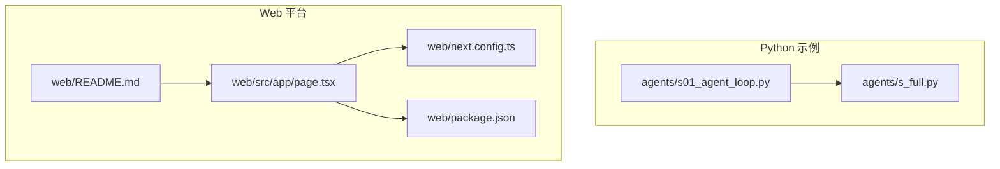
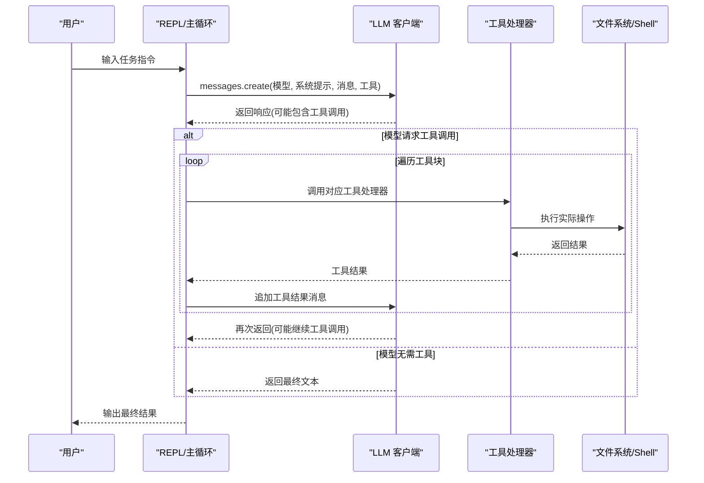
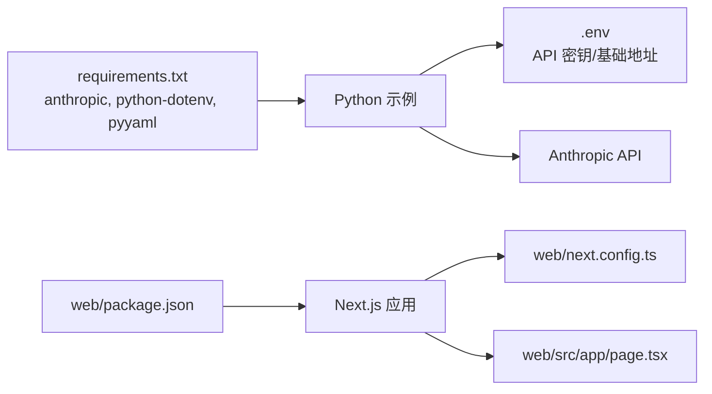

# 快速开始

<cite>
**本文引用的文件**
- [README.md](file://README.md)
- [README-zh.md](file://README-zh.md)
- [requirements.txt](file://requirements.txt)
- [agents/s01_agent_loop.py](file://agents/s01_agent_loop.py)
- [agents/s_full.py](file://agents/s_full.py)
- [web/README.md](file://web/README.md)
- [web/package.json](file://web/package.json)
- [web/next.config.ts](file://web/next.config.ts)
- [web/src/app/page.tsx](file://web/src/app/page.tsx)
- [docs/zh/s01-the-agent-loop.md](file://docs/zh/s01-the-agent-loop.md)
</cite>

## 目录
1. [简介](#简介)
2. [项目结构](#项目结构)
3. [核心组件](#核心组件)
4. [架构总览](#架构总览)
5. [详细组件分析](#详细组件分析)
6. [依赖关系分析](#依赖关系分析)
7. [性能注意事项](#性能注意事项)
8. [故障排除指南](#故障排除指南)
9. [结论](#结论)
10. [附录](#附录)

## 简介
本指南面向首次接触 Learn Claude Code 项目的用户，帮助你在最短时间内完成环境准备、安装依赖、配置 API 密钥，并成功运行第一个代理示例；同时提供 Web 平台的启动说明，让你在本地体验交互式可视化与学习内容。

## 项目结构
该项目采用“Python 示例 + Web 平台”的双入口设计：
- Python 示例位于 agents/，从 s01 到 s_full，逐步叠加机制，最终呈现完整参考实现。
- Web 平台位于 web/，基于 Next.js，提供交互式可视化、源码查看、分步讲解与课程导航。

**图表来源**
- [agents/s01_agent_loop.py](file://agents/s01_agent_loop.py)
- [agents/s_full.py](file://agents/s_full.py)
- [web/src/app/page.tsx](file://web/src/app/page.tsx)
- [web/next.config.ts](file://web/next.config.ts)
- [web/package.json](file://web/package.json)
- [web/README.md](file://web/README.md)

**章节来源**
- [README.md:287-298](file://README.md#L287-L298)
- [README-zh.md:288-298](file://README-zh.md#L288-L298)

## 核心组件
- Python 环境与依赖
  - 使用 pip 安装 requirements.txt 中的依赖，包括 anthropic、python-dotenv、pyyaml。
- API 密钥配置
  - 复制 .env.example 为 .env，并填入 ANTHROPIC_API_KEY；如需自定义服务端点，可设置 ANTHROPIC_BASE_URL。
- 运行第一个示例
  - 执行 agents/s01_agent_loop.py，进入交互式 REPL，输入任务指令即可看到模型通过 bash 工具执行命令的效果。
- 完整参考实现
  - agents/s_full.py 展示了 12 个机制的整合，适合深入理解端到端的代理编排。

**章节来源**
- [README.md:232-244](file://README.md#L232-L244)
- [README-zh.md:233-244](file://README-zh.md#L233-L244)
- [requirements.txt:1-3](file://requirements.txt#L1-L3)
- [agents/s01_agent_loop.py:44-50](file://agents/s01_agent_loop.py#L44-L50)

## 架构总览
下面的时序图展示了从用户输入到工具执行的典型流程，体现了“代理循环”这一核心模式：

**图表来源**
- [agents/s01_agent_loop.py:80-101](file://agents/s01_agent_loop.py#L80-L101)
- [agents/s_full.py:653-707](file://agents/s_full.py#L653-L707)

## 详细组件分析

### Python 环境与依赖安装
- 安装步骤
  - 克隆仓库后，进入项目根目录，执行 pip 安装依赖。
  - 依赖清单见 requirements.txt，包含 anthropic、python-dotenv、pyyaml。
- 环境变量
  - 复制 .env.example 为 .env，编辑其中的 ANTHROPIC_API_KEY。
  - 如使用自定义服务端点，可设置 ANTHROPIC_BASE_URL；若设置了自定义基础地址，将自动清理认证令牌相关环境变量以避免冲突。

**章节来源**
- [README.md:232-244](file://README.md#L232-L244)
- [README-zh.md:233-244](file://README-zh.md#L233-L244)
- [requirements.txt:1-3](file://requirements.txt#L1-L3)
- [agents/s01_agent_loop.py:44-49](file://agents/s01_agent_loop.py#L44-L49)

### 运行第一个代理示例（s01）
- 启动方式
  - 在项目根目录执行 python agents/s01_agent_loop.py。
  - REPL 会提示输入任务，输入 q/exit/回车可退出。
- 基本用法
  - 示例文档提供了多个可尝试的 prompt，建议优先使用英文 prompt 以获得更佳效果。
- 交互要点
  - 模型每次调用工具后，会将工具结果追加到消息中，循环直到模型决定停止。

**章节来源**
- [README.md:240-240](file://README.md#L240-L240)
- [README-zh.md:241-241](file://README-zh.md#L241-L241)
- [docs/zh/s01-the-agent-loop.md:106-119](file://docs/zh/s01-the-agent-loop.md#L106-L119)
- [agents/s01_agent_loop.py:104-121](file://agents/s01_agent_loop.py#L104-L121)

### 完整参考实现（s_full）
- 功能概览
  - s_full.py 将 s01–s11 的机制整合，包含任务系统、背景任务、子代理、团队通信、上下文压缩、技能加载等。
- 运行方式
  - 在项目根目录执行 python agents/s_full.py，进入 REPL。
  - 支持 /compact、/tasks、/team、/inbox 等命令辅助调试与观察。
- 适用场景
  - 适合希望一次性理解完整编排与工具生态的用户。

**章节来源**
- [README.md:242-242](file://README.md#L242-L242)
- [README-zh.md:243-243](file://README-zh.md#L243-L243)
- [agents/s_full.py:709-741](file://agents/s_full.py#L709-L741)

### Web 平台启动指南
- 环境要求
  - Node.js 与 npm（Next.js 16 需要较新的 Node 版本，请根据 package.json 的依赖范围准备环境）。
- 安装与启动
  - 进入 web 目录，执行 npm install 安装依赖。
  - 执行 npm run dev 启动开发服务器，默认访问 http://localhost:3000。
- 构建配置
  - next.config.ts 设置为静态导出模式，便于本地预览与部署。

**章节来源**
- [web/README.md:5-15](file://web/README.md#L5-L15)
- [web/package.json:1-39](file://web/package.json#L1-L39)
- [web/next.config.ts:1-10](file://web/next.config.ts#L1-L10)
- [web/src/app/page.tsx:1-6](file://web/src/app/page.tsx#L1-L6)

## 依赖关系分析
- Python 示例依赖
  - anthropic：调用 Claude API 的客户端库。
  - python-dotenv：加载 .env 文件中的环境变量。
  - pyyaml：用于处理 YAML 数据（在某些场景中使用）。
- Web 平台依赖
  - Next.js 16、React 19、TypeScript、TailwindCSS 等，详见 package.json。
- 运行时耦合
  - Python 示例通过环境变量读取 API 密钥与模型标识，未在代码中硬编码敏感信息。
  - Web 平台通过脚本在构建前抽取 agents 与 docs 的内容，生成前端可渲染的数据。

**图表来源**
- [requirements.txt:1-3](file://requirements.txt#L1-L3)
- [web/package.json:13-37](file://web/package.json#L13-L37)
- [web/next.config.ts:1-10](file://web/next.config.ts#L1-L10)
- [web/src/app/page.tsx:1-6](file://web/src/app/page.tsx#L1-L6)

**章节来源**
- [requirements.txt:1-3](file://requirements.txt#L1-L3)
- [web/package.json:13-37](file://web/package.json#L13-L37)

## 性能注意事项
- 上下文压缩
  - 在 s_full 中实现了三层压缩策略，避免消息长度超出限制；s01 示例中也内置了基础的上下文压缩触发逻辑。
- 超时与安全
  - 工具执行设置了超时时间，防止长时间阻塞；s01 示例对危险命令进行了拦截。
- 并发与后台任务
  - s_full 提供后台任务管理，避免阻塞主线程；建议在需要长时间运行的任务中使用。

**章节来源**
- [agents/s01_agent_loop.py:65-78](file://agents/s01_agent_loop.py#L65-L78)
- [agents/s_full.py:226-258](file://agents/s_full.py#L226-L258)
- [agents/s_full.py:327-361](file://agents/s_full.py#L327-L361)

## 故障排除指南
- 无法连接 API
  - 确认 .env 中已正确填写 ANTHROPIC_API_KEY；如使用自定义基础地址，确保 ANTHROPIC_BASE_URL 正确且网络可达。
- Python 依赖缺失
  - 重新执行 pip install -r requirements.txt，确保安装了 anthropic、python-dotenv、pyyaml。
- Web 启动失败
  - 确保 Node.js 版本满足 Next.js 16 要求；在 web 目录执行 npm install 后再运行 npm run dev。
- REPL 无输出或卡住
  - 检查工具调用是否触发超时；适当缩短命令或分步执行；确认当前工作目录权限正常。

**章节来源**
- [agents/s01_agent_loop.py:44-49](file://agents/s01_agent_loop.py#L44-L49)
- [requirements.txt:1-3](file://requirements.txt#L1-L3)
- [web/README.md:5-15](file://web/README.md#L5-L15)

## 结论
通过本快速开始指南，你已完成环境准备、依赖安装、API 密钥配置，并成功运行了第一个代理示例；同时掌握了 Web 平台的启动方式。建议从 s01 开始逐步深入，配合 docs/zh 下的课程文档，理解每个机制如何在“代理循环”之上叠加，最终在 s_full 中看到完整编排。

## 附录
- 快速命令清单
  - 克隆与安装：git clone 仓库地址 && cd 项目目录 && pip install -r requirements.txt
  - 配置 API 密钥：cp .env.example .env && 编辑 .env 填写 ANTHROPIC_API_KEY
  - 运行示例：python agents/s01_agent_loop.py
  - Web 平台：cd web && npm install && npm run dev
- 推荐学习路径
  - s01 → s02 → s03 → s04 → s05 → s06 → s07 → s08 → s09 → s10 → s11 → s12 → s_full