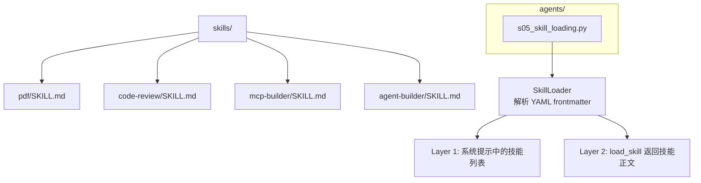
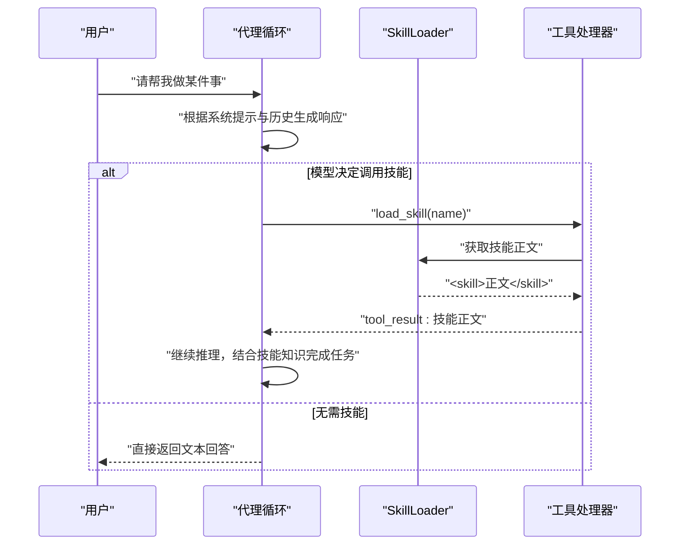
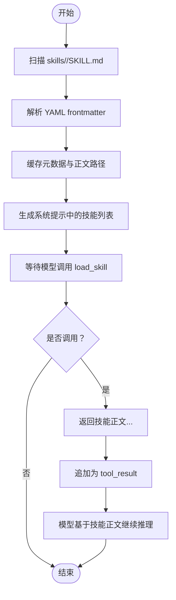
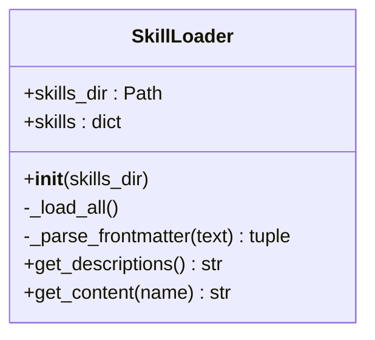
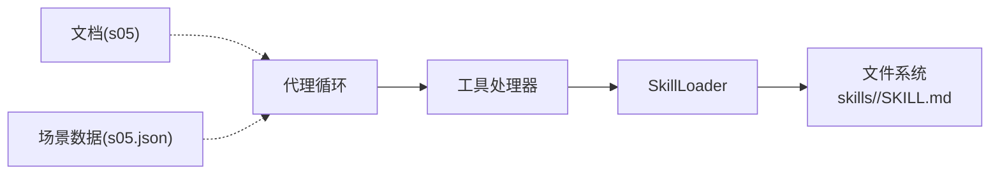

# 技能系统

<cite>
**本文引用的文件**
- [s05_skill_loading.py](file://agents/s05_skill_loading.py)
- [SKILL.md（PDF）](file://skills/pdf/SKILL.md)
- [SKILL.md（代码审查）](file://skills/code-review/SKILL.md)
- [SKILL.md（MCP 构建器）](file://skills/mcp-builder/SKILL.md)
- [SKILL.md（Agent Builder）](file://skills/agent-builder/SKILL.md)
- [minimal-agent.py](file://skills/agent-builder/references/minimal-agent.py)
- [tool-templates.py](file://skills/agent-builder/references/tool-templates.py)
- [subagent-pattern.py](file://skills/agent-builder/references/subagent-pattern.py)
- [init_agent.py](file://skills/agent-builder/scripts/init_agent.py)
- [s05-skill-loading.md（英文）](file://docs/en/s05-skill-loading.md)
- [s05.json（场景）](file://web/src/data/scenarios/s05.json)
</cite>

## 目录
1. [简介](#简介)
2. [项目结构](#项目结构)
3. [核心组件](#核心组件)
4. [架构总览](#架构总览)
5. [详细组件分析](#详细组件分析)
6. [依赖关系分析](#依赖关系分析)
7. [性能考量](#性能考量)
8. [故障排查指南](#故障排查指南)
9. [结论](#结论)
10. [附录](#附录)

## 简介
本文件面向技能系统的开发者与使用者，系统化阐述以下主题：
- 技能文件的 YAML 前言元数据格式与组织结构
- 两层注入策略（Layer 1/2）的设计动机与工作原理
- 按需加载机制的实现细节与安全边界
- 技能开发的完整指南：最小代理示例、工具模板、参考实现
- 自定义技能的创建流程：文件编写、元数据配置、工具集成
- 实际技能开发案例：代码审查、PDF 处理、MCP 构建器
- 扩展性与最佳实践建议

## 项目结构
技能系统围绕“技能目录 + YAML 前言 + Markdown 正文”的约定构建，并通过一个轻量的加载器在运行时按需注入知识，避免系统提示膨胀。

图表来源
- [s05_skill_loading.py:58-107](file://agents/s05_skill_loading.py#L58-L107)
- [SKILL.md（PDF）:1-4](file://skills/pdf/SKILL.md#L1-L4)
- [SKILL.md（代码审查）:1-4](file://skills/code-review/SKILL.md#L1-L4)
- [SKILL.md（MCP 构建器）:1-4](file://skills/mcp-builder/SKILL.md#L1-L4)
- [SKILL.md（Agent Builder）:1-11](file://skills/agent-builder/SKILL.md#L1-L11)

章节来源
- [s05_skill_loading.py:1-56](file://agents/s05_skill_loading.py#L1-L56)
- [s05-skill-loading.md（英文）:1-48](file://docs/en/s05-skill-loading.md#L1-L48)

## 核心组件
- 技能目录与文件规范
  - 每个技能以独立目录存放，包含一个 SKILL.md 文件
  - SKILL.md 使用 YAML frontmatter 定义元数据（name、description 等），其后为正文内容
- SkillLoader
  - 负责扫描 skills 目录下的 SKILL.md，解析 YAML frontmatter，缓存技能元数据与正文路径
  - 提供 Layer 1 的简短描述（用于系统提示）与 Layer 2 的全文内容（通过工具调用返回）
- 工具与代理循环
  - 提供 load_skill 工具，模型调用后由 SkillLoader 返回技能正文
  - 代理循环在收到工具结果后将其作为 tool_result 追加到消息历史，模型在上下文中直接使用技能知识

章节来源
- [s05_skill_loading.py:58-107](file://agents/s05_skill_loading.py#L58-L107)
- [s05_skill_loading.py:166-185](file://agents/s05_skill_loading.py#L166-L185)
- [s05_skill_loading.py:188-209](file://agents/s05_skill_loading.py#L188-L209)

## 架构总览
两层注入策略的核心思想是：将“技能名称与简述”常驻于系统提示（Layer 1，低成本），而“技能正文”仅在模型请求时按需注入（Layer 2，按需加载）。这样既保持系统提示简洁，又能在需要时提供完整的领域知识。

图表来源
- [s05_skill_loading.py:188-209](file://agents/s05_skill_loading.py#L188-L209)
- [s05_skill_loading.py:166-185](file://agents/s05_skill_loading.py#L166-L185)
- [s05_skill_loading.py:99-104](file://agents/s05_skill_loading.py#L99-L104)

章节来源
- [s05_skill_loading.py:1-36](file://agents/s05_skill_loading.py#L1-L36)
- [s05-skill-loading.md（英文）:15-34](file://docs/en/s05-skill-loading.md#L15-L34)

## 详细组件分析

### YAML 前言元数据格式与组织结构
- 文件位置与命名
  - 每个技能位于 skills/<name>/SKILL.md
  - 目录名即技能标识；若未显式设置 name，则回退为目录名
- YAML frontmatter
  - 必填字段：name（技能名称）、description（技能描述）
  - 可选字段：tags（标签，用于系统提示中的附加标记）
- 正文内容
  - Markdown 格式的技能说明、步骤、最佳实践、命令示例等
  - 通过工具调用按需返回，不进入系统提示

章节来源
- [s05_skill_loading.py:65-84](file://agents/s05_skill_loading.py#L65-L84)
- [SKILL.md（PDF）:1-4](file://skills/pdf/SKILL.md#L1-L4)
- [SKILL.md（代码审查）:1-4](file://skills/code-review/SKILL.md#L1-L4)
- [SKILL.md（MCP 构建器）:1-4](file://skills/mcp-builder/SKILL.md#L1-L4)
- [SKILL.md（Agent Builder）:1-11](file://skills/agent-builder/SKILL.md#L1-L11)

### 两层注入策略设计与实现
- Layer 1（系统提示）
  - 仅包含技能名称与简述，用于模型了解可用能力
  - 优点：系统提示稳定、体积小、成本低
- Layer 2（工具结果）
  - 当模型调用 load_skill 时，SkillLoader 返回技能正文包裹在 <skill> 标签内
  - 优点：按需加载，避免系统提示膨胀；正文可随时更新且不影响系统提示

图表来源
- [s05_skill_loading.py:65-84](file://agents/s05_skill_loading.py#L65-L84)
- [s05_skill_loading.py:85-104](file://agents/s05_skill_loading.py#L85-L104)

章节来源
- [s05_skill_loading.py:85-104](file://agents/s05_skill_loading.py#L85-L104)
- [s05-skill-loading.md（英文）:15-34](file://docs/en/s05-skill-loading.md#L15-L34)

### 技能加载器（SkillLoader）类图

图表来源
- [s05_skill_loading.py:58-107](file://agents/s05_skill_loading.py#L58-L107)

章节来源
- [s05_skill_loading.py:58-107](file://agents/s05_skill_loading.py#L58-L107)

### 工具与代理循环
- 工具定义
  - bash、read_file、write_file、edit_file、load_skill
  - load_skill 接收 name 参数，返回技能正文
- 代理循环
  - 每轮根据系统提示与历史生成响应
  - 若 stop_reason 为 tool_use，则执行工具并将结果以 tool_result 形式追加
  - 继续下一轮，直到不需要工具调用

章节来源
- [s05_skill_loading.py:166-185](file://agents/s05_skill_loading.py#L166-L185)
- [s05_skill_loading.py:188-209](file://agents/s05_skill_loading.py#L188-L209)

### 安全与健壮性
- 路径安全
  - 所有文件操作均进行相对路径校验，防止路径逃逸
- 命令安全
  - 对危险命令进行白名单过滤
- 超时控制
  - 子进程执行设置超时时间，避免长时间阻塞
- 错误处理
  - 工具调用异常被捕获并返回错误信息

章节来源
- [s05_skill_loading.py:118-164](file://agents/s05_skill_loading.py#L118-L164)

## 依赖关系分析
- SkillLoader 依赖
  - 文件系统扫描（skills 目录）
  - YAML 解析（frontmatter）
  - 工具处理器（load_skill）
- 工具链路
  - 代理循环 -> 工具处理器 -> SkillLoader -> 文件系统
- 文档与可视化
  - 文档说明了两层注入策略
  - 场景数据展示了技能注入后的执行流程

图表来源
- [s05_skill_loading.py:166-185](file://agents/s05_skill_loading.py#L166-L185)
- [s05_skill_loading.py:58-107](file://agents/s05_skill_loading.py#L58-L107)
- [s05-skill-loading.md（英文）:1-48](file://docs/en/s05-skill-loading.md#L1-L48)
- [s05.json（场景）:1-45](file://web/src/data/scenarios/s05.json#L1-L45)

章节来源
- [s05_skill_loading.py:1-56](file://agents/s05_skill_loading.py#L1-L56)
- [s05.json（场景）:1-45](file://web/src/data/scenarios/s05.json#L1-L45)

## 性能考量
- Token 成本控制
  - Layer 1 仅包含技能名称与简述，成本极低
  - Layer 2 仅在需要时加载完整正文，避免系统提示膨胀
- I/O 与解析开销
  - frontmatter 解析与文件读取为一次性开销，后续按需加载
- 输出截断
  - 工具输出与文件读取均有限制长度，避免过大数据影响性能

章节来源
- [s05_skill_loading.py:85-104](file://agents/s05_skill_loading.py#L85-L104)
- [s05_skill_loading.py:136-164](file://agents/s05_skill_loading.py#L136-L164)

## 故障排查指南
- 未知技能名称
  - 现象：调用 load_skill 返回错误提示
  - 处理：确认技能目录存在且包含 SKILL.md；检查 name 是否与目录一致或 frontmatter 中 name 是否正确
- 路径逃逸
  - 现象：工具报错“路径逃逸”
  - 处理：确保传入路径为相对路径，不要包含上层目录访问
- 危险命令被阻止
  - 现象：bash 工具返回“危险命令被阻止”
  - 处理：避免使用 rm -rf /、sudo、shutdown 等命令
- 超时
  - 现象：bash 工具返回“超时”
  - 处理：缩短命令执行时间或拆分为多个子任务

章节来源
- [s05_skill_loading.py:102-104](file://agents/s05_skill_loading.py#L102-L104)
- [s05_skill_loading.py:124-134](file://agents/s05_skill_loading.py#L124-L134)
- [s05_skill_loading.py:118-122](file://agents/s05_skill_loading.py#L118-L122)

## 结论
技能系统通过“两层注入策略”实现了知识的按需加载与系统提示的成本控制。SkillLoader 以最小代价解析 frontmatter 并在需要时返回完整技能正文，配合安全的工具与代理循环，形成一套可扩展、可维护的技能体系。该模式适用于任何需要在不同领域间切换知识的智能代理场景。

## 附录

### 技能开发指南（从零到一）
- 最小代理示例
  - 参考：[minimal-agent.py](file://skills/agent-builder/references/minimal-agent.py)
  - 特点：仅 4 个工具，最简代理循环，适合快速验证
- 工具模板
  - 参考：[tool-templates.py](file://skills/agent-builder/references/tool-templates.py)
  - 内容：标准化工具定义与实现，便于扩展
- 子代理模式
  - 参考：[subagent-pattern.py](file://skills/agent-builder/references/subagent-pattern.py)
  - 用途：隔离上下文，避免探索过程污染主对话
- 脚手架初始化
  - 参考：[init_agent.py](file://skills/agent-builder/scripts/init_agent.py)
  - 功能：一键生成不同复杂度的代理项目模板

章节来源
- [minimal-agent.py:1-150](file://skills/agent-builder/references/minimal-agent.py#L1-L150)
- [tool-templates.py:1-272](file://skills/agent-builder/references/tool-templates.py#L1-L272)
- [subagent-pattern.py:1-244](file://skills/agent-builder/references/subagent-pattern.py#L1-L244)
- [init_agent.py:1-280](file://skills/agent-builder/scripts/init_agent.py#L1-L280)

### 自定义技能创建流程
- 创建目录与文件
  - 在 skills/<your-skill>/ 下创建 SKILL.md
  - frontmatter 至少包含 name 与 description
- 编写正文
  - 使用 Markdown 组织技能说明、步骤、最佳实践与命令示例
- 元数据配置
  - 可选：添加 tags 字段，用于系统提示中的附加标记
- 工具集成
  - 无需额外工具定义；模型通过 load_skill 请求即可获得技能正文
- 测试与验证
  - 使用代理循环调用 load_skill，确认返回内容符合预期

章节来源
- [s05_skill_loading.py:65-84](file://agents/s05_skill_loading.py#L65-L84)
- [SKILL.md（PDF）:1-4](file://skills/pdf/SKILL.md#L1-L4)
- [SKILL.md（代码审查）:1-4](file://skills/code-review/SKILL.md#L1-L4)
- [SKILL.md（MCP 构建器）:1-4](file://skills/mcp-builder/SKILL.md#L1-L4)

### 实际技能开发案例

#### 案例一：代码审查技能
- 目标：提供结构化的安全、正确性、性能、可维护性与测试检查清单
- 关键点：明确检查项、输出格式、常见模式与命令
- 参考：[SKILL.md（代码审查）:1-158](file://skills/code-review/SKILL.md#L1-L158)

章节来源
- [SKILL.md（代码审查）:1-158](file://skills/code-review/SKILL.md#L1-L158)

#### 案例二：PDF 处理技能
- 目标：提供 PDF 读取、创建、合并与拆分的实用方法与最佳实践
- 关键点：工具安装、编码处理、大文件与 OCR 注意事项
- 参考：[SKILL.md（PDF）:1-113](file://skills/pdf/SKILL.md#L1-L113)

章节来源
- [SKILL.md（PDF）:1-113](file://skills/pdf/SKILL.md#L1-L113)

#### 案例三：MCP 构建器技能
- 目标：指导如何构建 MCP 服务器，暴露工具、资源与提示
- 关键点：Python 与 TypeScript 模板、外部 API 集成、数据库访问、资源读取
- 参考：[SKILL.md（MCP 构建器）:1-214](file://skills/mcp-builder/SKILL.md#L1-L214)

章节来源
- [SKILL.md（MCP 构建器）:1-214](file://skills/mcp-builder/SKILL.md#L1-L214)

### 扩展性与最佳实践
- 扩展性
  - 新增技能：只需在 skills/<name>/ 下新增 SKILL.md，无需修改核心逻辑
  - 多语言支持：文档与脚手架提供多语言版本，便于国际化
- 最佳实践
  - frontmatter 保持简洁，正文详尽
  - 使用清晰的命名与描述，便于模型选择合适技能
  - 定期更新技能正文，确保时效性
  - 通过工具模板统一工具定义与实现，降低维护成本
  - 使用脚手架快速生成项目，遵循统一的工程化规范

章节来源
- [s05-skill-loading.md（英文）:1-48](file://docs/en/s05-skill-loading.md#L1-L48)
- [init_agent.py:255-280](file://skills/agent-builder/scripts/init_agent.py#L255-L280)