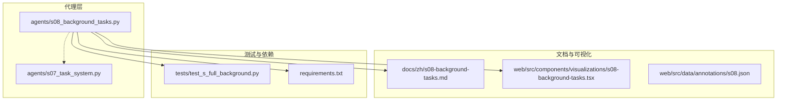
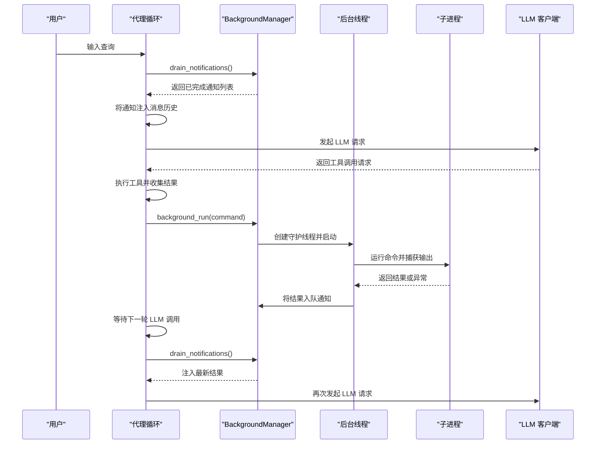
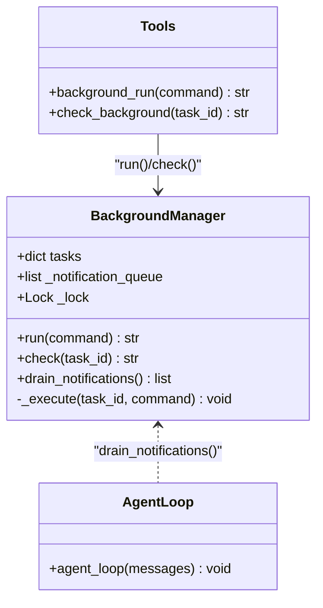
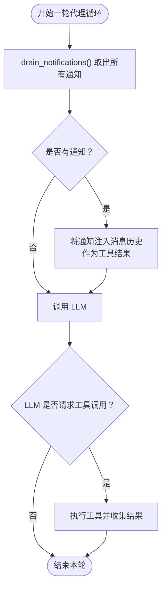
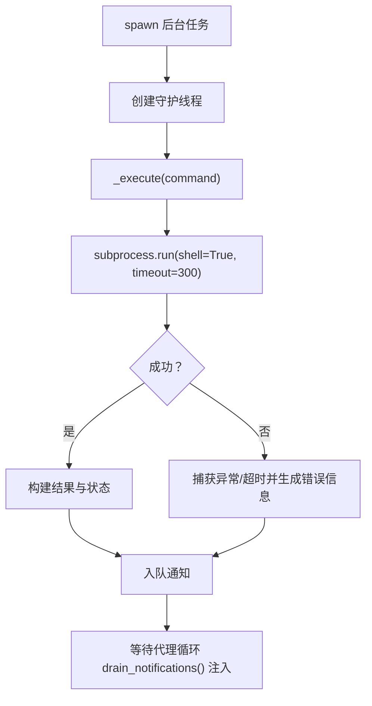
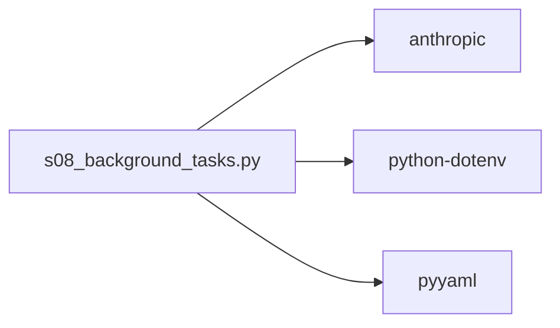

# 后台任务管理

<cite>
**本文引用的文件**
- [agents/s08_background_tasks.py](file://agents/s08_background_tasks.py)
- [docs/zh/s08-background-tasks.md](file://docs/zh/s08-background-tasks.md)
- [web/src/components/visualizations/s08-background-tasks.tsx](file://web/src/components/visualizations/s08-background-tasks.tsx)
- [web/src/data/annotations/s08.json](file://web/src/data/annotations/s08.json)
- [agents/s07_task_system.py](file://agents/s07_task_system.py)
- [tests/test_s_full_background.py](file://tests/test_s_full_background.py)
- [requirements.txt](file://requirements.txt)
</cite>

## 目录
1. [简介](#简介)
2. [项目结构](#项目结构)
3. [核心组件](#核心组件)
4. [架构总览](#架构总览)
5. [详细组件分析](#详细组件分析)
6. [依赖分析](#依赖分析)
7. [性能考虑](#性能考虑)
8. [故障排查指南](#故障排查指南)
9. [结论](#结论)
10. [附录](#附录)

## 简介
本技术文档围绕后台任务管理系统展开，重点阐述守护进程线程的工作原理、通知队列机制、异步操作处理等核心概念。文档将详细说明后台任务的生命周期管理、任务调度策略、资源分配机制等实现细节，并提供完整的代码示例路径，展示如何启动和管理后台任务、如何处理异步操作、如何实现任务间通信。同时包含错误处理策略、性能监控方案、资源清理机制等最佳实践，确保系统在长时间运行中的稳定性和高效性。最后解释与前台代理循环的协调机制，以及如何避免阻塞主线程的执行。

## 项目结构
该仓库采用“章节式”组织，每个教学阶段对应一个独立脚本与配套文档。后台任务系统位于 agents/s08_background_tasks.py，配套文档与可视化组件分别位于 docs/zh/s08-background-tasks.md 与 web/src/components/visualizations/s08-background-tasks.tsx。测试覆盖了后台管理器的关键行为，requirements.txt 提供运行依赖。

图表来源
- [agents/s08_background_tasks.py](file://agents/s08_background_tasks.py)
- [agents/s07_task_system.py](file://agents/s07_task_system.py)
- [docs/zh/s08-background-tasks.md](file://docs/zh/s08-background-tasks.md)
- [web/src/components/visualizations/s08-background-tasks.tsx](file://web/src/components/visualizations/s08-background-tasks.tsx)
- [web/src/data/annotations/s08.json](file://web/src/data/annotations/s08.json)
- [tests/test_s_full_background.py](file://tests/test_s_full_background.py)
- [requirements.txt](file://requirements.txt)

章节来源
- [agents/s08_background_tasks.py](file://agents/s08_background_tasks.py)
- [docs/zh/s08-background-tasks.md](file://docs/zh/s08-background-tasks.md)
- [web/src/components/visualizations/s08-background-tasks.tsx](file://web/src/components/visualizations/s08-background-tasks.tsx)
- [web/src/data/annotations/s08.json](file://web/src/data/annotations/s08.json)
- [agents/s07_task_system.py](file://agents/s07_task_system.py)
- [tests/test_s_full_background.py](file://tests/test_s_full_background.py)
- [requirements.txt](file://requirements.txt)

## 核心组件
- BackgroundManager：负责后台任务的创建、执行、状态跟踪与通知队列管理。支持守护线程并发执行、线程安全的通知队列、任务状态持久化与结果注入。
- 工具集：包括 bash、read_file、write_file、edit_file、background_run、check_background 等工具，其中 background_run 与 check_background 专门用于后台任务管理。
- 代理循环：在每次 LLM 调用前，从通知队列中提取已完成的任务结果，注入到消息历史中，从而实现“非阻塞”的异步结果反馈。

章节来源
- [agents/s08_background_tasks.py](file://agents/s08_background_tasks.py)
- [docs/zh/s08-background-tasks.md](file://docs/zh/s08-background-tasks.md)

## 架构总览
后台任务系统的核心思想是“前台代理循环保持单线程，后台线程并行执行耗时任务，完成后通过通知队列在下一轮 LLM 调用前注入结果”。该设计避免了阻塞主线程，同时保证模型在合适的时机看到异步结果。

图表来源
- [agents/s08_background_tasks.py](file://agents/s08_background_tasks.py)

## 详细组件分析

### BackgroundManager 类
BackgroundManager 是后台任务系统的核心类，负责：
- 任务注册与状态维护：以字典保存任务状态、命令与结果。
- 并发执行：为每个任务创建守护线程，避免主线程阻塞。
- 通知队列：在线程安全的锁保护下，将完成结果推送到通知队列。
- 结果注入：代理循环在每次 LLM 调用前，从通知队列中取出所有通知并注入到消息历史。

图表来源
- [agents/s08_background_tasks.py](file://agents/s08_background_tasks.py)

章节来源
- [agents/s08_background_tasks.py](file://agents/s08_background_tasks.py)

### 通知队列机制
通知队列采用线程安全的列表与锁保护，确保后台线程与主线程之间的数据一致性。每次代理循环在发起 LLM 调用前，调用 drain_notifications 清空队列并将结果以工具结果的形式注入消息历史，从而避免在中间步骤插入异步结果带来的竞态问题。

图表来源
- [agents/s08_background_tasks.py](file://agents/s08_background_tasks.py)

章节来源
- [agents/s08_background_tasks.py](file://agents/s08_background_tasks.py)
- [web/src/data/annotations/s08.json](file://web/src/data/annotations/s08.json)

### 异步操作处理与守护线程
- 守护线程：后台任务以 daemon=True 创建，当主线程退出时自动终止，避免僵尸进程与资源泄漏。
- 超时控制：子进程运行设置超时时间，防止长时间阻塞；异常捕获统一转化为错误状态与结果文本。
- 结果截断：输出结果进行长度限制，避免过大数据影响性能与内存占用。

图表来源
- [agents/s08_background_tasks.py](file://agents/s08_background_tasks.py)

章节来源
- [agents/s08_background_tasks.py](file://agents/s08_background_tasks.py)
- [web/src/data/annotations/s08.json](file://web/src/data/annotations/s08.json)

### 与前台代理循环的协调机制
- 协调点：代理循环在每次 LLM 调用前调用 drain_notifications，确保异步结果在合适的时机被模型看到。
- 非阻塞：前台代理循环保持单线程，不等待后台任务完成，避免阻塞主线程。
- 结果注入：通知以工具结果形式注入消息历史，便于模型在后续推理中利用异步结果。

章节来源
- [agents/s08_background_tasks.py](file://agents/s08_background_tasks.py)

### 任务生命周期管理
- 创建：background_run 接收命令，生成任务 ID 并启动守护线程。
- 执行：后台线程运行子进程，捕获输出与异常，设置状态为 completed/timeout/error。
- 查询：check_background 支持按任务 ID 查询状态或列出所有任务。
- 注入：drain_notifications 在下一轮 LLM 调用前将结果注入消息历史。

章节来源
- [agents/s08_background_tasks.py](file://agents/s08_background_tasks.py)

### 工具与安全边界
- bash：阻塞式执行命令，带危险命令过滤与超时控制。
- 文件读写：路径解析与越界检查，防止工作区外访问。
- 后台工具：background_run 与 check_background 专用于后台任务管理。

章节来源
- [agents/s08_background_tasks.py](file://agents/s08_background_tasks.py)

### 与 s07 任务系统的对比
- s07：面向“持久化任务”，任务状态保存在磁盘，关注依赖图与状态流转。
- s08：面向“异步执行”，通过守护线程与通知队列实现非阻塞的后台任务处理。
- 关系：两者互补，s07 适合长期规划与依赖管理，s08 适合快速并行执行与即时反馈。

章节来源
- [agents/s07_task_system.py](file://agents/s07_task_system.py)
- [agents/s08_background_tasks.py](file://agents/s08_background_tasks.py)

## 依赖分析
- anthropic：用于调用 LLM API。
- python-dotenv：加载环境变量，支持本地与远程 API 配置。
- pyyaml：文档与注释中涉及的数据结构与序列化需求。

图表来源
- [requirements.txt](file://requirements.txt)
- [agents/s08_background_tasks.py](file://agents/s08_background_tasks.py)

章节来源
- [requirements.txt](file://requirements.txt)
- [agents/s08_background_tasks.py](file://agents/s08_background_tasks.py)

## 性能考虑
- 并发模型：守护线程实现轻量级并发，避免复杂异步框架带来的开销。
- I/O 并行：子进程 I/O 并行化，主线程保持响应性。
- 结果截断：输出与通知内容长度限制，降低内存与网络压力。
- 超时控制：统一的超时与异常处理，避免长时间阻塞。
- 队列轮询：每次 LLM 调用前集中注入通知，减少频繁中断。

章节来源
- [agents/s08_background_tasks.py](file://agents/s08_background_tasks.py)
- [web/src/data/annotations/s08.json](file://web/src/data/annotations/s08.json)

## 故障排查指南
- 任务未显示结果：确认代理循环是否在下一轮 LLM 调用前调用了 drain_notifications。
- 任务状态异常：使用 check_background 查询具体任务状态与命令摘要。
- 超时与错误：后台线程会将超时与异常转换为标准错误信息，可在通知中查看。
- 资源清理：守护线程随主线程退出自动终止，无需手动清理；如需优雅退出，可在上层逻辑中触发退出信号。
- 测试验证：单元测试覆盖了后台管理器在特定场景下的行为，可参考测试用例定位问题。

章节来源
- [agents/s08_background_tasks.py](file://agents/s08_background_tasks.py)
- [tests/test_s_full_background.py](file://tests/test_s_full_background.py)

## 结论
后台任务管理系统通过“前台代理循环 + 后台守护线程 + 通知队列”的架构，在不改变代理循环结构的前提下实现了非阻塞的异步执行与结果注入。该设计兼顾了易用性与稳定性，适合在长时间运行的智能体场景中持续提供高效的后台能力。配合任务系统（s07）与团队协议（s10）等模块，可进一步扩展为具备计划、协作与可观测性的完整智能体平台。

## 附录

### 使用示例（代码路径）
- 启动后台任务：调用 background_run 工具，传入命令字符串，立即返回任务 ID。
- 查看任务状态：调用 check_background 工具，可按任务 ID 查询或列出全部任务。
- 结果注入：代理循环在每次 LLM 调用前自动注入通知，无需手动处理。

章节来源
- [agents/s08_background_tasks.py](file://agents/s08_background_tasks.py)

### 可视化与注解
- 交互式可视化展示了三条轨道（主线程与两条后台轨道）、任务并发、通知队列与结果注入过程。
- 注解强调了“通知总线”（队列）与“守护线程”的设计权衡与优势。

章节来源
- [web/src/components/visualizations/s08-background-tasks.tsx](file://web/src/components/visualizations/s08-background-tasks.tsx)
- [web/src/data/annotations/s08.json](file://web/src/data/annotations/s08.json)