# 持久化系统

<cite>
**本文档引用的文件**
- [s07_task_system.py](file://agents/s07_task_system.py)
- [s08_background_tasks.py](file://agents/s08_background_tasks.py)
- [s_full.py](file://agents/s_full.py)
- [s07-task-system.md](file://docs/zh/s07-task-system.md)
- [s08-background-tasks.md](file://docs/zh/s08-background-tasks.md)
- [s07-task-system.tsx](file://web/src/components/visualizations/s07-task-system.tsx)
- [s08-background-tasks.tsx](file://web/src/components/visualizations/s08-background-tasks.tsx)
- [test_s_full_background.py](file://tests/test_s_full_background.py)
</cite>

## 目录
1. [简介](#简介)
2. [项目结构](#项目结构)
3. [核心组件](#核心组件)
4. [架构概览](#架构概览)
5. [详细组件分析](#详细组件分析)
6. [依赖关系分析](#依赖关系分析)
7. [性能考虑](#性能考虑)
8. [故障排除指南](#故障排除指南)
9. [结论](#结论)

## 简介

持久化系统是本项目中两个关键机制的集合：s07文件任务系统和s08后台任务管理系统。这些系统为代理系统提供了长期任务管理和异步操作处理能力，确保任务状态能够在上下文压缩和系统重启后仍然存活。

**s07文件任务系统**实现了基于文件的任务图，每个任务都是一个独立的JSON文件，包含状态、依赖关系和所有者信息。这种设计使得任务能够跨越多次对话和系统重启而保持不变。

**s08后台任务管理系统**提供了守护进程线程机制，允许代理系统在不阻塞主流程的情况下执行长时间运行的操作。通过通知队列机制，后台任务的结果可以在合适的时机注入到LLM调用中。

## 项目结构

持久化系统主要分布在以下目录和文件中：

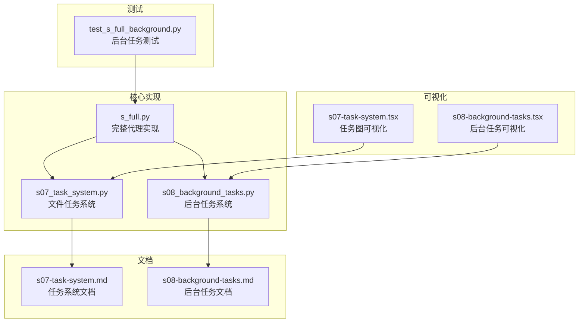

**图表来源**
- [s07_task_system.py:1-244](file://agents/s07_task_system.py#L1-L244)
- [s08_background_tasks.py:1-235](file://agents/s08_background_tasks.py#L1-L235)
- [s_full.py:1-741](file://agents/s_full.py#L1-L741)

**章节来源**
- [s07_task_system.py:1-244](file://agents/s07_task_system.py#L1-L244)
- [s08_background_tasks.py:1-235](file://agents/s08_background_tasks.py#L1-L235)
- [s_full.py:1-741](file://agents/s_full.py#L1-L741)

## 核心组件

### 任务管理系统 (TaskManager)

任务管理系统是s07系统的核心，负责管理持久化的任务图。它提供了完整的CRUD操作，并维护任务之间的依赖关系。

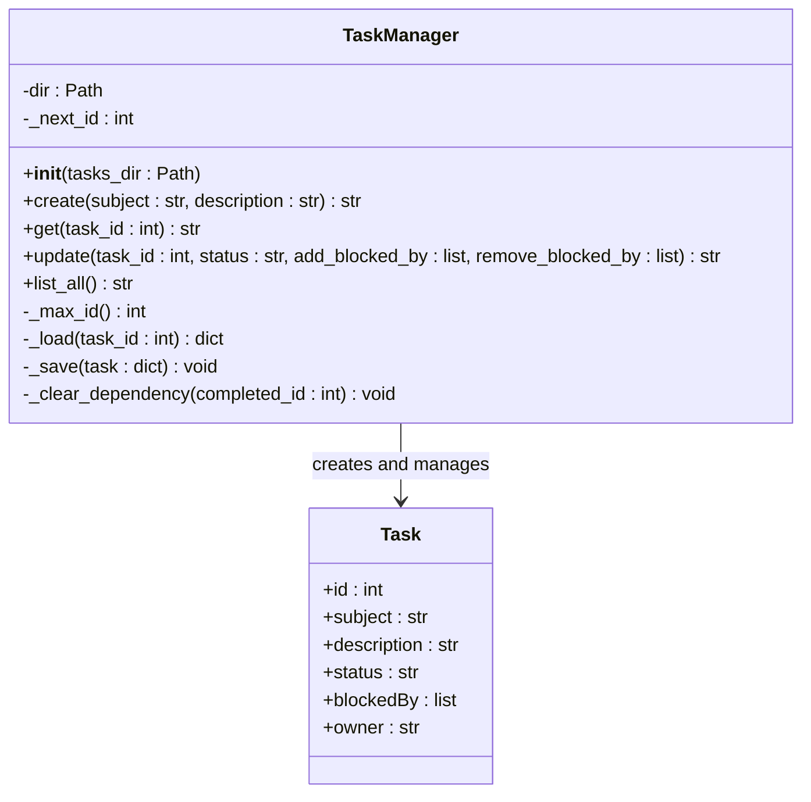

**图表来源**
- [s07_task_system.py:47-121](file://agents/s07_task_system.py#L47-L121)

### 后台任务管理系统 (BackgroundManager)

后台任务管理系统提供了守护进程线程机制，支持异步任务执行和结果通知。

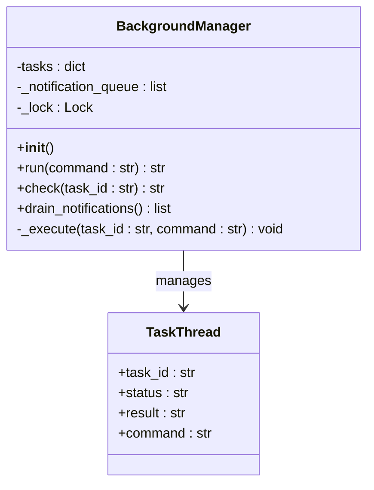

**图表来源**
- [s08_background_tasks.py:50-111](file://agents/s08_background_tasks.py#L50-L111)

**章节来源**
- [s07_task_system.py:47-121](file://agents/s07_task_system.py#L47-L121)
- [s08_background_tasks.py:50-111](file://agents/s08_background_tasks.py#L50-L111)

## 架构概览

持久化系统的整体架构展示了两个核心组件如何协同工作：

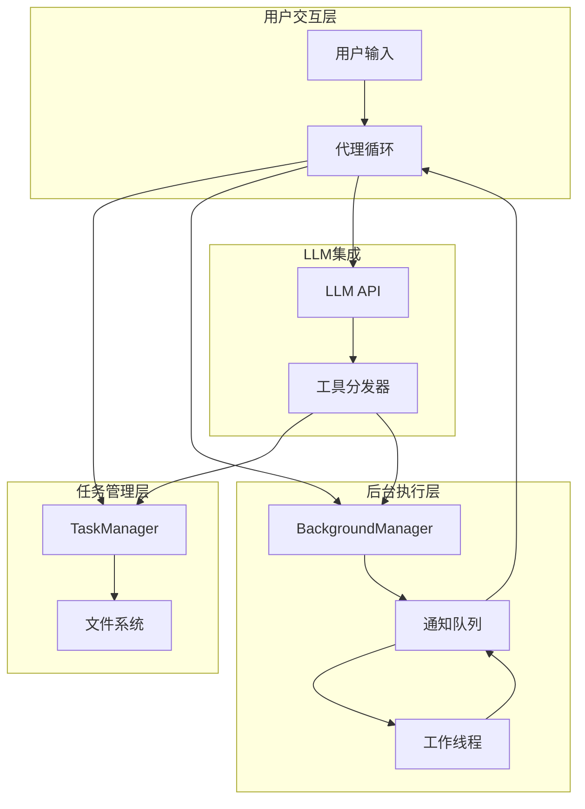

**图表来源**
- [s07_task_system.py:204-225](file://agents/s07_task_system.py#L204-L225)
- [s08_background_tasks.py:188-216](file://agents/s08_background_tasks.py#L188-L216)

## 详细组件分析

### s07文件任务系统

#### 任务图数据结构

每个任务都被持久化为一个独立的JSON文件，包含以下关键字段：

| 字段名 | 类型 | 描述 | 示例值 |
|--------|------|------|--------|
| id | integer | 任务唯一标识符 | 1, 2, 3... |
| subject | string | 任务主题描述 | "Setup project" |
| description | string | 任务详细描述 | "Initialize project structure" |
| status | string | 任务状态 | "pending", "in_progress", "completed" |
| blockedBy | array | 依赖的任务ID列表 | [1, 2] |
| owner | string | 任务负责人 | "developer" |

#### 依赖关系解析算法

任务系统的依赖关系解析是一个关键特性，它允许系统自动确定哪些任务可以并行执行：

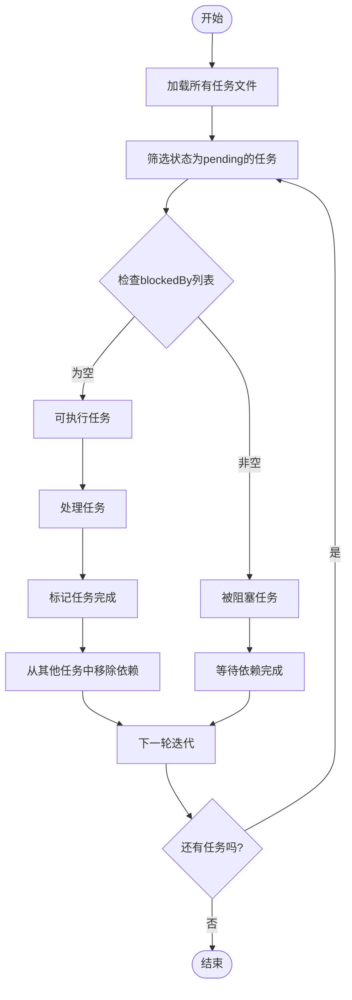

**图表来源**
- [s07_task_system.py:95-101](file://agents/s07_task_system.py#L95-L101)

#### 任务状态管理

任务状态在三个级别之间转换：
- **pending**: 任务已创建但尚未开始
- **in_progress**: 任务正在进行中
- **completed**: 任务已完成

状态转换遵循严格的规则，特别是完成状态会触发依赖清理机制。

**章节来源**
- [s07_task_system.py:67-121](file://agents/s07_task_system.py#L67-L121)
- [s07-task-system.md:49-95](file://docs/zh/s07-task-system.md#L49-L95)

### s08后台任务管理系统

#### 异步执行机制

后台任务系统通过守护进程线程实现真正的异步执行：

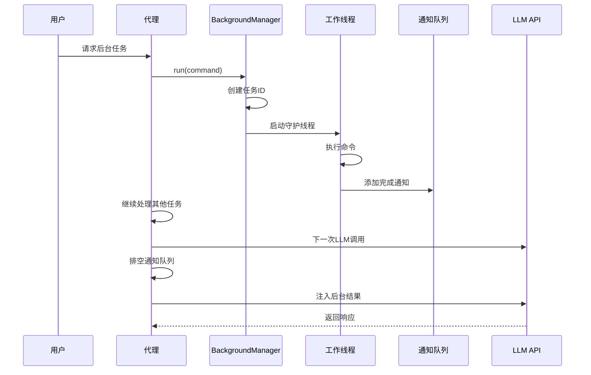

**图表来源**
- [s08_background_tasks.py:56-90](file://agents/s08_background_tasks.py#L56-L90)
- [s08_background_tasks.py:188-216](file://agents/s08_background_tasks.py#L188-L216)

#### 通知队列机制

通知队列是后台任务系统的核心组件，它确保了结果的有序传递：

| 组件 | 功能 | 线程安全性 |
|------|------|------------|
| 任务字典 | 存储当前任务状态 | 非线程安全 |
| 通知队列 | 存储完成的通知 | 线程安全 |
| 锁机制 | 保护共享资源访问 | 线程安全 |

#### 线程安全实现

后台任务系统使用Python的threading模块确保线程安全：

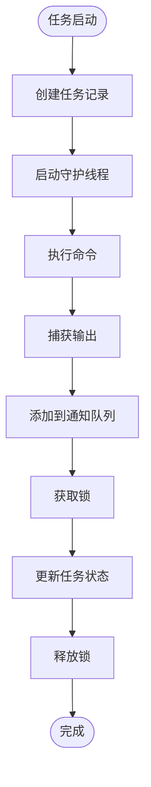

**图表来源**
- [s08_background_tasks.py:66-90](file://agents/s08_background_tasks.py#L66-L90)

**章节来源**
- [s08_background_tasks.py:50-111](file://agents/s08_background_tasks.py#L50-L111)
- [s08-background-tasks.md:33-85](file://docs/zh/s08-background-tasks.md#L33-L85)

### 完整集成实现

s_full.py文件展示了如何将两个系统完全集成到一个完整的代理环境中：

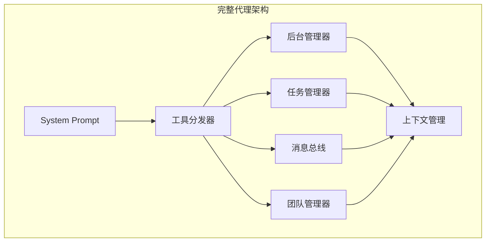

**图表来源**
- [s_full.py:544-551](file://agents/s_full.py#L544-L551)

**章节来源**
- [s_full.py:261-325](file://agents/s_full.py#L261-L325)
- [s_full.py:327-361](file://agents/s_full.py#L327-L361)

## 依赖关系分析

持久化系统内部的依赖关系展现了清晰的模块化设计：

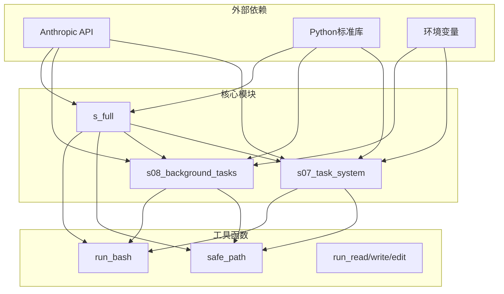

**图表来源**
- [s07_task_system.py:25-41](file://agents/s07_task_system.py#L25-L41)
- [s08_background_tasks.py:28-45](file://agents/s08_background_tasks.py#L28-L45)
- [s_full.py:39-58](file://agents/s_full.py#L39-L58)

### 数据流分析

持久化系统中的数据流展示了信息如何在不同组件间传递：

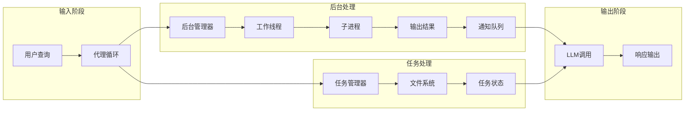

**图表来源**
- [s07_task_system.py:204-225](file://agents/s07_task_system.py#L204-L225)
- [s08_background_tasks.py:188-216](file://agents/s08_background_tasks.py#L188-L216)

**章节来源**
- [s07_task_system.py:125-201](file://agents/s07_task_system.py#L125-L201)
- [s08_background_tasks.py:114-185](file://agents/s08_background_tasks.py#L114-L185)

## 性能考虑

### 任务系统性能优化

1. **文件I/O优化**
   - 使用批量文件操作减少磁盘访问次数
   - 实现文件缓存机制避免重复读取
   - 采用原子写入确保数据一致性

2. **内存管理**
   - 限制任务列表大小防止内存泄漏
   - 实现任务状态的懒加载机制
   - 使用生成器模式处理大量任务

### 后台任务性能优化

1. **线程池管理**
   - 限制同时运行的后台任务数量
   - 实现任务优先级调度
   - 提供任务超时控制机制

2. **资源监控**
   - 监控CPU和内存使用情况
   - 实现资源使用告警机制
   - 提供性能指标收集

### 缓存策略

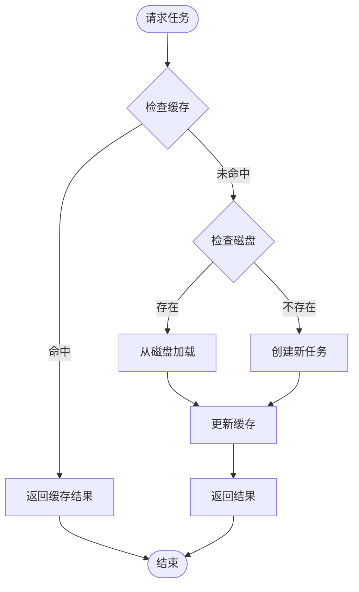

## 故障排除指南

### 常见问题及解决方案

#### 任务系统问题

1. **任务文件损坏**
   ```python
   # 检查任务文件完整性
   def validate_task_file(task_id: int) -> bool:
       try:
           task = TASKS._load(task_id)
           required_fields = ['id', 'subject', 'status']
           return all(field in task for field in required_fields)
       except Exception:
           return False
   ```

2. **依赖循环检测**
   ```python
   # 检测循环依赖
   def detect_cycles(task_id: int) -> bool:
       visited = set()
       rec_stack = set()
       return dfs_cycle_detection(task_id, visited, rec_stack)
   ```

#### 后台任务问题

1. **线程死锁**
   ```python
   # 实现超时机制
   def run_with_timeout(command: str, timeout: int = 300) -> str:
       thread = threading.Thread(target=self._execute, args=(task_id, command))
       thread.daemon = True
       thread.start()
       thread.join(timeout)
       if thread.is_alive():
           return "Error: Task timed out"
       return "Task completed"
   ```

2. **通知队列阻塞**
   ```python
   # 实现非阻塞队列操作
   def drain_non_blocking(self) -> list:
       results = []
       try:
           while True:
               results.append(self.notifications.get_nowait())
       except queue.Empty:
           pass
       return results
   ```

### 错误处理策略

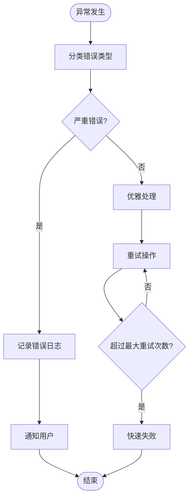

**章节来源**
- [test_s_full_background.py:52-68](file://tests/test_s_full_background.py#L52-L68)

## 结论

持久化系统通过s07文件任务系统和s08后台任务管理系统的有机结合，为代理系统提供了强大的长期任务管理和异步操作能力。该系统的主要优势包括：

1. **持久性**: 任务状态跨会话和系统重启保持不变
2. **可扩展性**: 支持复杂的任务依赖关系和并行执行
3. **可靠性**: 提供完善的错误处理和故障恢复机制
4. **性能**: 通过异步执行和缓存策略优化系统性能

这些特性使得代理系统能够在长时间运行的场景中保持稳定性和可靠性，为复杂的AI协作应用奠定了坚实的基础。