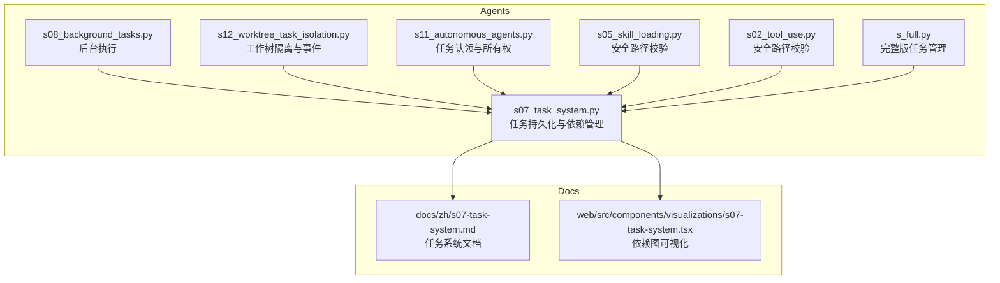
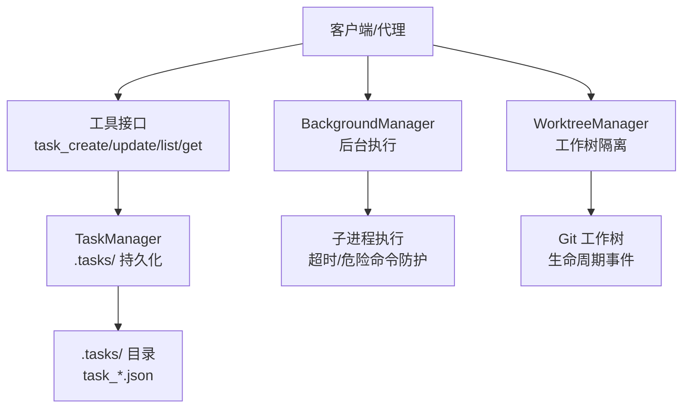
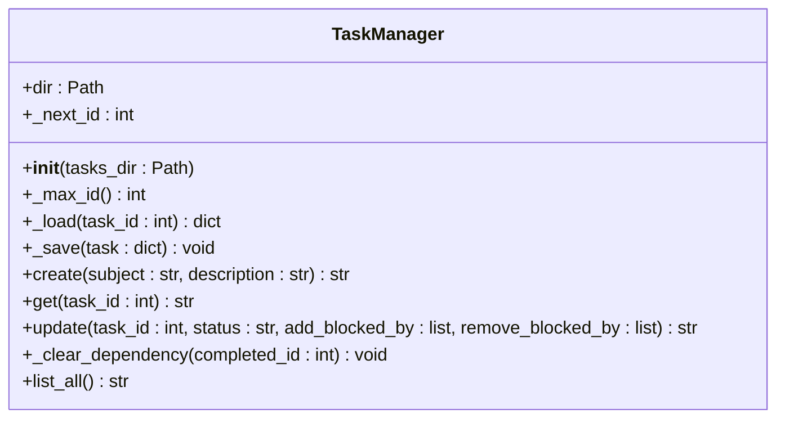
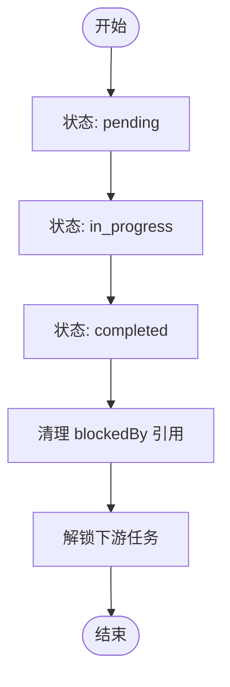
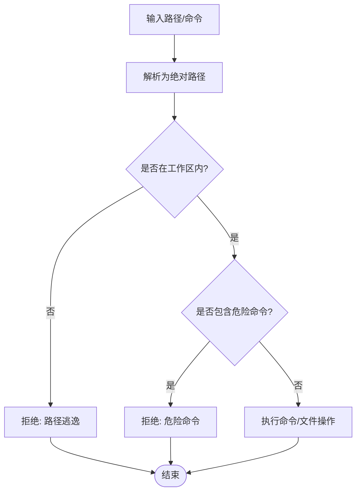
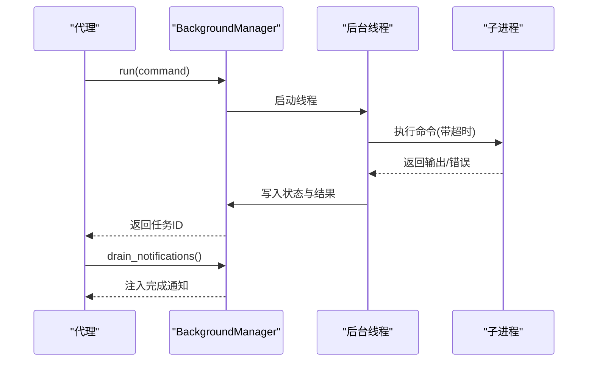
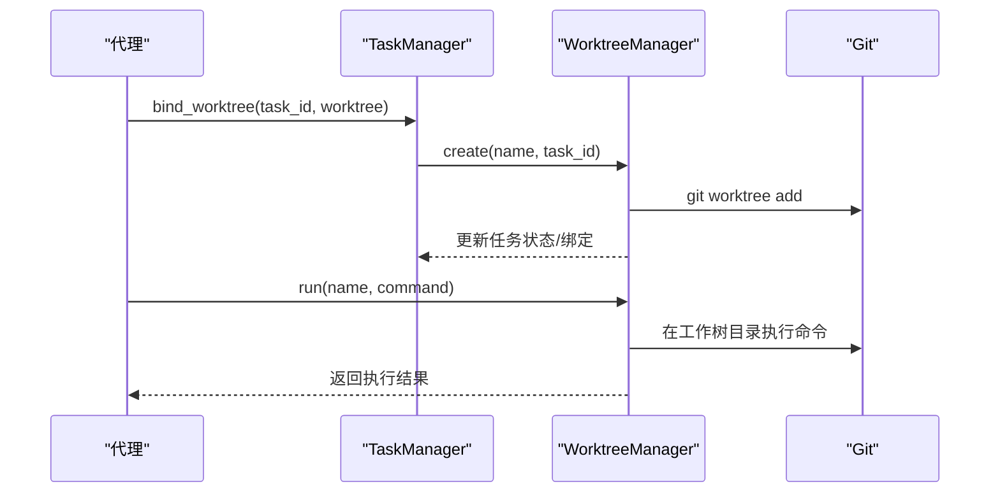
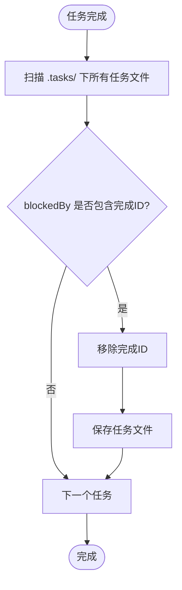
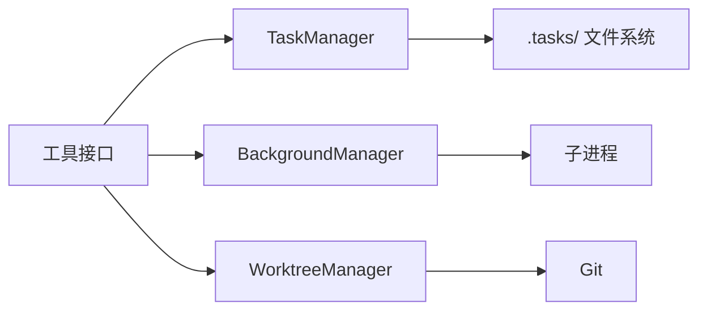

# 文件任务系统

<cite>
**本文档引用的文件**
- [s07_task_system.py](file://agents/s07_task_system.py)
- [s08_background_tasks.py](file://agents/s08_background_tasks.py)
- [s12_worktree_task_isolation.py](file://agents/s12_worktree_task_isolation.py)
- [s07-task-system.md](file://docs/zh/s07-task-system.md)
- [s07-task-system.tsx](file://web/src/components/visualizations/s07-task-system.tsx)
- [s05_skill_loading.py](file://agents/s05_skill_loading.py)
- [s02_tool_use.py](file://agents/s02_tool_use.py)
- [s11_autonomous_agents.py](file://agents/s11_autonomous_agents.py)
- [s_full.py](file://agents/s_full.py)
</cite>

## 目录
1. [简介](#简介)
2. [项目结构](#项目结构)
3. [核心组件](#核心组件)
4. [架构总览](#架构总览)
5. [详细组件分析](#详细组件分析)
6. [依赖关系分析](#依赖关系分析)
7. [性能考量](#性能考量)
8. [故障排除指南](#故障排除指南)
9. [结论](#结论)
10. [附录](#附录)

## 简介
本文件任务系统通过将任务持久化为磁盘上的 JSON 文件，实现了跨上下文压缩、重启与多代理协作的可生存任务图。系统围绕 TaskManager 类构建，支持任务的创建、查询、更新与删除，并通过 blockedBy 字段维护有向无环图(DAG)的依赖关系。当任务状态变为已完成时，系统会自动清理其在其他任务 blockedBy 列表中的引用，从而解锁下游任务。此外，系统还提供了安全的路径校验与危险命令防护，以及后台执行能力，确保在大规模任务管理中具备稳定性与可靠性。

## 项目结构
- agents 目录包含多个示例脚本，其中 s07_task_system.py 实现了基于 JSON 的任务持久化与依赖管理；s08_background_tasks.py 提供后台执行能力；s12_worktree_task_isolation.py 在 s07 的基础上扩展了工作树隔离与生命周期事件记录。
- docs/zh 目录包含中文文档，详细解释了任务系统的工作原理、状态流转与依赖图。
- web/src/components/visualizations 目录包含可视化组件，用于演示任务依赖图的状态变化过程。
- 其他 agents/*.py 文件展示了安全路径校验与危险命令防护的通用模式，贯穿于多个脚本中。

图表来源
- [s07_task_system.py:1-244](file://agents/s07_task_system.py#L1-L244)
- [s08_background_tasks.py:1-235](file://agents/s08_background_tasks.py#L1-L235)
- [s12_worktree_task_isolation.py:1-783](file://agents/s12_worktree_task_isolation.py#L1-L783)
- [s07-task-system.md:1-134](file://docs/zh/s07-task-system.md#L1-L134)
- [s07-task-system.tsx:1-495](file://web/src/components/visualizations/s07-task-system.tsx#L1-L495)

章节来源
- [s07_task_system.py:1-244](file://agents/s07_task_system.py#L1-L244)
- [s08_background_tasks.py:1-235](file://agents/s08_background_tasks.py#L1-L235)
- [s12_worktree_task_isolation.py:1-783](file://agents/s12_worktree_task_isolation.py#L1-L783)
- [s07-task-system.md:1-134](file://docs/zh/s07-task-system.md#L1-L134)
- [s07-task-system.tsx:1-495](file://web/src/components/visualizations/s07-task-system.tsx#L1-L495)

## 核心组件
- TaskManager：负责任务的 CRUD 操作、依赖图维护与状态管理。每个任务对应一个 JSON 文件，文件名格式为 task_<id>.json，存储在 .tasks/ 目录下。
- 安全工具：safe_path 函数用于防止路径逃逸攻击；run_bash 等函数内置危险命令黑名单与超时控制。
- 后台执行：BackgroundManager 提供线程池与通知队列，支持在后台运行命令并将结果注入到下一轮对话中。
- 工作树隔离：WorktreeManager 将任务与 Git 工作树绑定，实现目录级隔离与生命周期事件记录。

章节来源
- [s07_task_system.py:47-121](file://agents/s07_task_system.py#L47-L121)
- [s08_background_tasks.py:50-111](file://agents/s08_background_tasks.py#L50-L111)
- [s12_worktree_task_isolation.py:121-221](file://agents/s12_worktree_task_isolation.py#L121-L221)

## 架构总览
系统采用“控制平面 + 执行平面”的分层设计：
- 控制平面：由 TaskManager 维护任务图，提供统一的 API 供代理调用。
- 执行平面：通过后台执行或工作树隔离实现并行与隔离执行。
- 安全平面：全局的安全工具保障文件操作与命令执行的安全性。

图表来源
- [s07_task_system.py:173-201](file://agents/s07_task_system.py#L173-L201)
- [s08_background_tasks.py:163-185](file://agents/s08_background_tasks.py#L163-L185)
- [s12_worktree_task_isolation.py:536-726](file://agents/s12_worktree_task_isolation.py#L536-L726)

## 详细组件分析

### TaskManager 设计与实现
- 存储结构：每个任务一个 JSON 文件，文件名形如 task_<id>.json，位于 .tasks/ 目录。文件内容包含 id、subject、description、status、blockedBy、owner 等字段。
- ID 生成：通过扫描现有文件计算最大 id 并加一，保证唯一性。
- 依赖关系：blockedBy 字段记录上游依赖任务 ID；当某任务完成时，系统会遍历所有任务文件，移除其在其他任务 blockedBy 中的引用。
- 状态管理：支持 pending、in_progress、completed 三种状态；状态变更触发依赖清理逻辑。
- 列表与查询：提供按 ID 查询与全量列表展示，列表输出包含状态标记与阻塞信息。

图表来源
- [s07_task_system.py:47-121](file://agents/s07_task_system.py#L47-L121)

章节来源
- [s07_task_system.py:47-121](file://agents/s07_task_system.py#L47-L121)
- [s07-task-system.md:49-96](file://docs/zh/s07-task-system.md#L49-L96)

### 依赖关系图与状态流转
- 依赖解析：当任务状态设为 completed 时，系统遍历 .tasks/ 下的所有任务文件，移除 completed_id 在其他任务 blockedBy 中的引用，从而自动解锁下游任务。
- 状态流转：pending -> in_progress -> completed；completed 时触发依赖清理。
- 列表展示：list_all 输出中包含状态标记与 blockedBy 信息，便于直观查看阻塞关系。

图表来源
- [s07_task_system.py:79-101](file://agents/s07_task_system.py#L79-L101)

章节来源
- [s07_task_system.py:79-101](file://agents/s07_task_system.py#L79-L101)
- [s07-task-system.md:17-45](file://docs/zh/s07-task-system.md#L17-L45)

### 任务文件存储结构与 ID 生成机制
- 存储位置：.tasks/ 目录，文件命名规则为 task_<id>.json。
- ID 生成：扫描目录中所有 task_*.json 文件，提取 id 并取最大值加一作为下一个可用 ID。
- 文件内容：包含任务标识、主题、描述、状态、阻塞关系、负责人等字段。

章节来源
- [s07_task_system.py:41-74](file://agents/s07_task_system.py#L41-L74)
- [s07-task-system.md:24-28](file://docs/zh/s07-task-system.md#L24-L28)

### 安全考虑与路径验证
- 路径验证：safe_path 函数将相对路径解析为绝对路径，并检查是否位于工作区根目录内，防止路径逃逸攻击。
- 危险命令防护：run_bash 等函数维护危险命令黑名单，一旦检测到匹配项则直接返回错误提示；同时设置超时限制，避免长时间阻塞。
- 文件操作安全：写入前确保父目录存在，异常捕获并返回错误信息。

图表来源
- [s07_task_system.py:125-142](file://agents/s07_task_system.py#L125-L142)
- [s05_skill_loading.py:118-139](file://agents/s05_skill_loading.py#L118-L139)
- [s02_tool_use.py:41-58](file://agents/s02_tool_use.py#L41-L58)

章节来源
- [s07_task_system.py:125-142](file://agents/s07_task_system.py#L125-L142)
- [s05_skill_loading.py:118-139](file://agents/s05_skill_loading.py#L118-L139)
- [s02_tool_use.py:41-58](file://agents/s02_tool_use.py#L41-L58)

### 后台执行与通知队列
- 线程池：BackgroundManager 使用线程池执行命令，主线程无需等待。
- 通知队列：完成后将结果推送到通知队列，在下一轮 LLM 调用前注入到消息中。
- 状态查询：支持查询单个任务或列出所有任务的当前状态与命令摘要。

图表来源
- [s08_background_tasks.py:50-108](file://agents/s08_background_tasks.py#L50-L108)
- [s08_background_tasks.py:188-216](file://agents/s08_background_tasks.py#L188-L216)

章节来源
- [s08_background_tasks.py:50-108](file://agents/s08_background_tasks.py#L50-L108)
- [s08_background_tasks.py:188-216](file://agents/s08_background_tasks.py#L188-L216)

### 工作树隔离与生命周期事件
- 任务绑定：TaskManager 支持将任务与工作树名称绑定，若任务状态为 pending，则自动切换为 in_progress。
- 工作树管理：WorktreeManager 创建/列出/运行/移除工作树，并维护索引文件与生命周期事件日志。
- 事件驱动：通过 EventBus 记录事件，便于可观测性与审计。

图表来源
- [s12_worktree_task_isolation.py:183-199](file://agents/s12_worktree_task_isolation.py#L183-L199)
- [s12_worktree_task_isolation.py:284-327](file://agents/s12_worktree_task_isolation.py#L284-L327)
- [s12_worktree_task_isolation.py:368-393](file://agents/s12_worktree_task_isolation.py#L368-L393)

章节来源
- [s12_worktree_task_isolation.py:183-199](file://agents/s12_worktree_task_isolation.py#L183-L199)
- [s12_worktree_task_isolation.py:284-327](file://agents/s12_worktree_task_isolation.py#L284-L327)
- [s12_worktree_task_isolation.py:368-393](file://agents/s12_worktree_task_isolation.py#L368-L393)

### 依赖关系解析算法
- 完成清理：当任务状态设为 completed 时，系统遍历 .tasks/ 下的所有任务文件，移除 completed_id 在其他任务 blockedBy 中的引用。
- 去重与差集：add_blocked_by 使用集合去重，remove_blocked_by 使用列表推导式过滤，确保数据一致性。

图表来源
- [s07_task_system.py:95-101](file://agents/s07_task_system.py#L95-L101)

章节来源
- [s07_task_system.py:95-101](file://agents/s07_task_system.py#L95-L101)

### API 使用示例（基于工具接口）
以下示例展示如何通过工具接口进行任务管理与依赖控制。实际调用时，代理会根据用户指令选择相应工具并传入参数。

- 创建任务
  - 工具名：task_create
  - 参数：subject（必填）、description（可选）
  - 返回：新任务的 JSON 字符串
- 查询任务
  - 工具名：task_get
  - 参数：task_id（必填）
  - 返回：指定任务的 JSON 字符串
- 更新任务
  - 工具名：task_update
  - 参数：task_id（必填）、status（可选，枚举值：pending、in_progress、completed）、addBlockedBy（可选，整数数组）、removeBlockedBy（可选，整数数组）
  - 返回：更新后的任务 JSON 字符串
- 列出任务
  - 工具名：task_list
  - 参数：无
  - 返回：任务列表字符串（包含状态标记与阻塞信息）

章节来源
- [s07_task_system.py:173-201](file://agents/s07_task_system.py#L173-L201)

## 依赖关系分析
- 组件耦合：TaskManager 与文件系统耦合度高，但通过清晰的接口与工具映射降低对外部模块的依赖。
- 间接依赖：后台执行与工作树隔离分别依赖子进程与 Git，但通过独立类封装，保持任务管理的核心稳定性。
- 循环依赖：未发现循环依赖；各模块职责清晰，工具接口统一。

图表来源
- [s07_task_system.py:173-201](file://agents/s07_task_system.py#L173-L201)
- [s08_background_tasks.py:163-185](file://agents/s08_background_tasks.py#L163-L185)
- [s12_worktree_task_isolation.py:536-726](file://agents/s12_worktree_task_isolation.py#L536-L726)

章节来源
- [s07_task_system.py:173-201](file://agents/s07_task_system.py#L173-L201)
- [s08_background_tasks.py:163-185](file://agents/s08_background_tasks.py#L163-L185)
- [s12_worktree_task_isolation.py:536-726](file://agents/s12_worktree_task_isolation.py#L536-L726)

## 性能考量
- 文件扫描与解析：依赖清理涉及对 .tasks/ 的全量扫描，建议在任务数量较多时定期归档或分片管理，减少扫描范围。
- 状态更新频率：频繁的状态更新可能引发多次文件写入，建议批处理更新或引入缓存策略。
- 后台执行：后台线程池大小与超时设置需结合系统资源调整，避免过多并发导致资源争用。
- 可视化渲染：前端依赖图在大量节点时可能影响渲染性能，建议按需加载与懒渲染。

## 故障排除指南
- 任务不存在：当查询或更新不存在的任务时，系统会抛出错误。请确认 task_id 是否正确。
- 路径逃逸：safe_path 会在路径超出工作区时拒绝访问。请使用相对路径并在工作区内操作。
- 危险命令：run_bash 等函数会拦截危险命令。请避免使用 rm -rf /、sudo、shutdown、reboot 等命令。
- 超时错误：后台执行与文件读写均设置了超时。请缩短命令执行时间或优化任务粒度。
- Git 不可用：工作树功能需要在 Git 仓库中使用。请确保在正确的仓库根目录运行。

章节来源
- [s07_task_system.py:57-61](file://agents/s07_task_system.py#L57-L61)
- [s07_task_system.py:125-142](file://agents/s07_task_system.py#L125-L142)
- [s08_background_tasks.py:66-89](file://agents/s08_background_tasks.py#L66-L89)
- [s12_worktree_task_isolation.py:250-263](file://agents/s12_worktree_task_isolation.py#L250-L263)

## 结论
该文件任务系统通过将任务持久化为 JSON 文件，实现了跨上下文压缩与多代理协作的稳定任务图。TaskManager 提供了完善的 CRUD 与依赖管理能力，配合安全的路径校验与危险命令防护，确保在复杂场景下的安全性与可靠性。后台执行与工作树隔离进一步增强了系统的并发与隔离能力。建议在大规模部署时关注文件扫描与状态更新的性能瓶颈，并结合可视化工具持续优化任务规划与执行流程。

## 附录
- 依赖图可视化：前端组件通过动画展示任务状态随步骤推进的变化，帮助理解依赖关系与阻塞情况。
- 文档参考：中文文档详细阐述了任务系统的设计理念、工作原理与使用方法，适合作为入门与进阶学习资料。

章节来源
- [s07-task-system.tsx:35-69](file://web/src/components/visualizations/s07-task-system.tsx#L35-L69)
- [s07-task-system.md:121-134](file://docs/zh/s07-task-system.md#L121-L134)