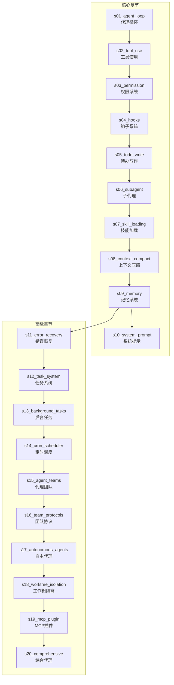
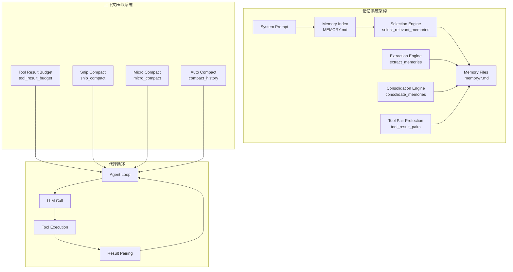
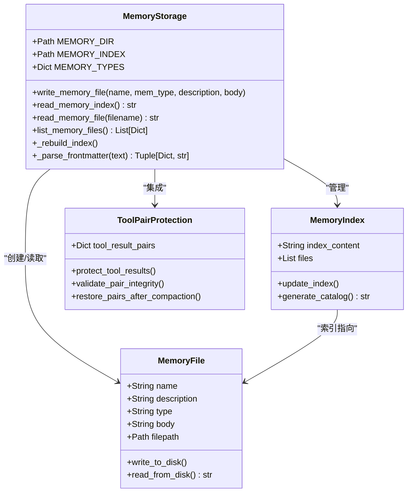
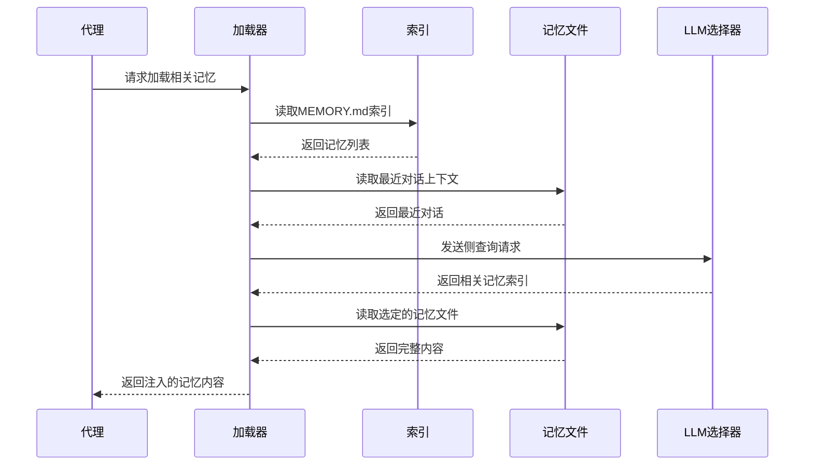
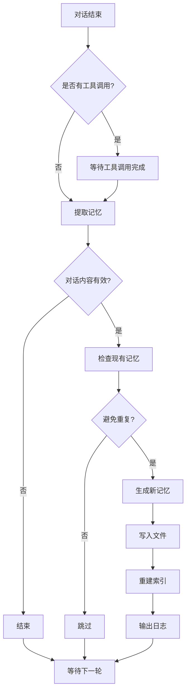
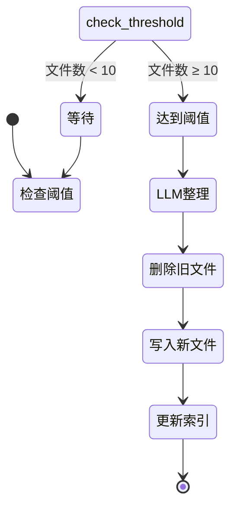
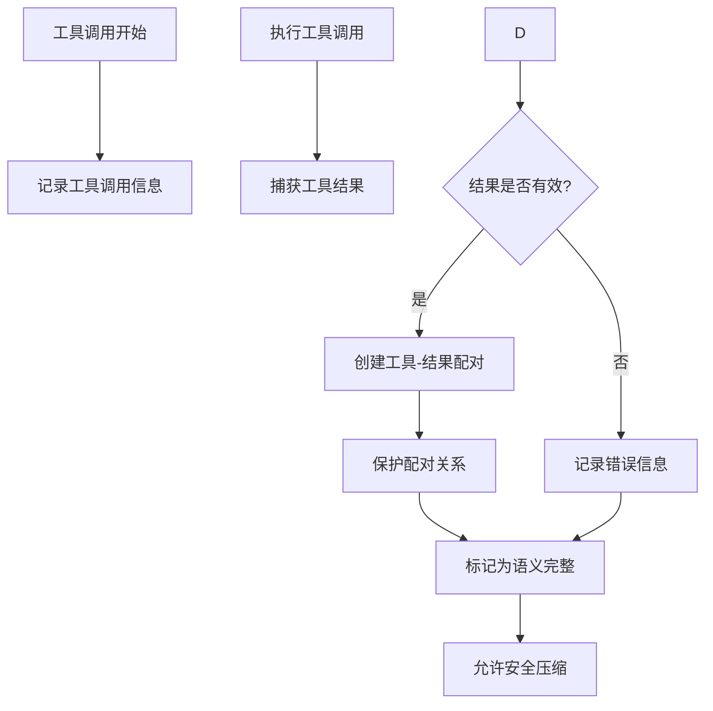
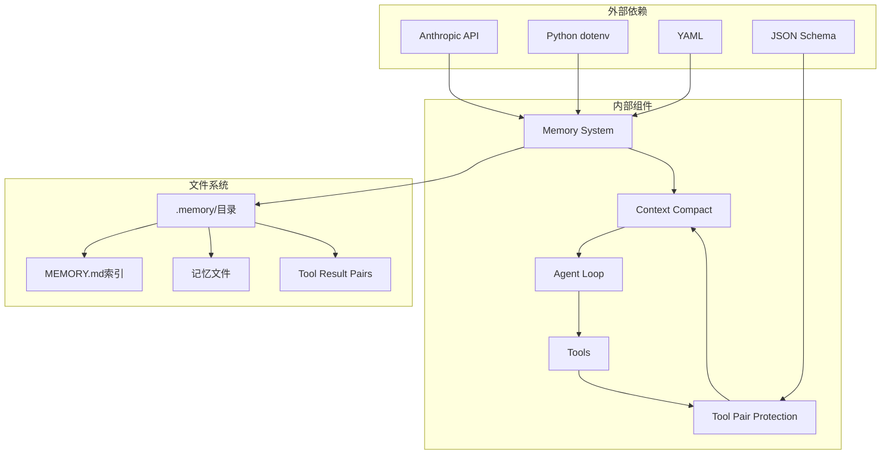

# 记忆系统

<cite>
**本文档引用的文件**
- [s09_memory/code.py](file://s09_memory/code.py)
- [s09_memory/README.md](file://s09_memory/README.md)
- [s09_memory/README.en.md](file://s09_memory/README.en.md)
- [s09_memory/README.ja.md](file://s09_memory/README.ja.md)
- [s08_context_compact/code.py](file://s08_context_compact/code.py)
- [s08_context_compact/README.md](file://s08_context_compact/README.md)
- [requirements.txt](file://requirements.txt)
- [README.md](file://README.md)
- [tests/test_compaction_tool_pairs.py](file://tests/test_compaction_tool_pairs.py)
- [s06_subagent/code.py](file://s06_subagent/code.py)
- [s07_skill_loading/code.py](file://s07_skill_loading/code.py)
</cite>

## 更新摘要
**所做更改**
- 更新了记忆系统与上下文压缩机制集成部分，反映工具使用结果配对保护功能
- 新增了工具交互语义完整性保护的相关内容
- 增强了上下文压缩与记忆系统协同工作的架构描述
- 更新了相关的测试用例和功能验证
- 修正了 spawn_subagent 函数参数命名一致性，保持与上下文压缩模块的一致性

## 目录
1. [简介](#简介)
2. [项目结构](#项目结构)
3. [核心组件](#核心组件)
4. [架构概览](#架构概览)
5. [详细组件分析](#详细组件分析)
6. [依赖关系分析](#依赖关系分析)
7. [性能考量](#性能考量)
8. [故障排除指南](#故障排除指南)
9. [结论](#结论)
10. [附录](#附录)

## 简介

记忆系统是学习 Claude Code 项目中的一个重要组成部分，它解决了大型语言模型（LLM）没有持久状态的问题。在传统的代理模式中，所有信息都存储在上下文窗口中，当上下文填满时需要进行压缩，而压缩是有损的。记忆系统通过文件系统存储提供了跨压缩、跨会话的知识积累能力。

记忆系统的核心理念是"压缩会丢失细节，需要一层不丢失的存储"。它采用文件存储 + 索引 + 按需加载的方式，在压缩前后都能保持知识的完整性。

**更新** 新增了工具使用结果配对保护功能，确保记忆系统在压缩过程中保持工具交互的语义完整性。同时，修正了 spawn_subagent 函数参数命名，保持与上下文压缩模块的一致性。

## 项目结构

学习 Claude Code 项目采用模块化设计，每个章节都有独立的功能模块：



**图表来源**
- [README.md: 259-300:259-300](file://README.md#L259-L300)
- [README.md: 306-327:306-327](file://README.md#L306-L327)

**章节来源**
- [README.md: 209-252:209-252](file://README.md#L209-L252)
- [README.md: 306-327:306-327](file://README.md#L306-L327)

## 核心组件

记忆系统由三个主要子系统组成：

### 1. 存储子系统
- **文件存储**：每个记忆作为单独的 `.md` 文件存储
- **索引管理**：`MEMORY.md` 文件维护所有记忆的链接索引
- **元数据格式**：使用 YAML frontmatter 存储 `name`、`description`、`type` 字段

### 2. 加载子系统
- **索引常驻**：SYSTEM prompt 中包含记忆索引，可被 prompt cache 缓存
- **按需注入**：根据当前对话选择相关记忆文件并注入上下文
- **双路径加载**：索引常驻 + 相关记忆按需加载

### 3. 写入子系统
- **提取机制**：每轮结束后从对话中提取新的记忆
- **去重保护**：检查现有记忆避免重复
- **定期整理**：当记忆数量达到阈值时进行合并去重

**更新** 新增了工具使用结果配对保护功能，确保记忆系统在压缩过程中保持工具交互的语义完整性。同时，修正了 spawn_subagent 函数参数命名，保持与上下文压缩模块的一致性。

**章节来源**
- [s09_memory/README.md: 28-36:28-36](file://s09_memory/README.md#L28-L36)
- [s09_memory/README.en.md: 28-36:28-36](file://s09_memory/README.en.md#L28-L36)
- [s09_memory/README.ja.md: 28-36:28-36](file://s09_memory/README.ja.md#L28-L36)

## 架构概览

记忆系统与上下文压缩系统协同工作，形成完整的知识管理架构：



**更新** 新增了工具结果配对保护机制，确保工具调用与其结果在压缩过程中保持语义关联。同时，修正了 spawn_subagent 函数参数命名，保持与上下文压缩模块的一致性。

**图表来源**
- [s09_memory/code.py: 551-602:551-602](file://s09_memory/code.py#L551-L602)
- [s08_context_compact/code.py: 149-178:149-178](file://s08_context_compact/code.py#L149-L178)

## 详细组件分析

### 存储系统设计

记忆系统采用简洁而高效的存储设计：



**更新** 新增了工具结果配对保护类，专门处理工具调用与结果的语义关联。同时，修正了 spawn_subagent 函数参数命名，保持与上下文压缩模块的一致性。

**图表来源**
- [s09_memory/code.py: 72-129:72-129](file://s09_memory/code.py#L72-L129)
- [s09_memory/code.py: 84-96:84-96](file://s09_memory/code.py#L84-L96)

#### 存储格式规范

每个记忆文件遵循统一的格式规范：

| 元数据字段 | 描述 | 示例 |
|------------|------|------|
| `name` | 记忆标识符 | `user-preference-tabs` |
| `description` | 简短描述 | `User prefers tabs for indentation` |
| `type` | 记忆类型 | `user` |

**章节来源**
- [s09_memory/README.md: 47-57:47-57](file://s09_memory/README.md#L47-L57)
- [s09_memory/README.en.md: 47-57:47-57](file://s09_memory/README.en.md#L47-L57)
- [s09_memory/README.ja.md: 47-57:47-57](file://s09_memory/README.ja.md#L47-L57)

### 加载系统设计

加载系统采用双路径策略确保效率和准确性：



**更新** 加载过程现在包含工具结果配对验证步骤，确保工具交互的语义完整性。同时，修正了 spawn_subagent 函数参数命名，保持与上下文压缩模块的一致性。

**图表来源**
- [s09_memory/code.py: 132-204:132-204](file://s09_memory/code.py#L132-L204)
- [s09_memory/code.py: 207-219:207-219](file://s09_memory/code.py#L207-L219)

#### 记忆类型分类

系统支持四种记忆类型，每种类型解决不同的问题：

| 类型 | 用途 | 示例 |
|------|------|------|
| `user` | 用户偏好和约束 | "用 tab 不用空格" |
| `feedback` | 工作指导和建议 | "不要 mock 数据库" |
| `project` | 项目背景和状态 | "auth 重写是合规驱动" |
| `reference` | 外部资源和线索 | "pipeline bug 在 Linear INGEST" |

**章节来源**
- [s09_memory/README.md: 30-35:30-35](file://s09_memory/README.md#L30-L35)
- [s09_memory/README.en.md: 30-35:30-35](file://s09_memory/README.en.md#L30-L35)
- [s09_memory/README.ja.md: 30-35:30-35](file://s09_memory/README.ja.md#L30-L35)

### 写入系统设计

写入系统采用智能提取机制，确保知识的有效积累：



**更新** 写入过程现在包含工具结果配对保护机制，确保工具调用与其结果的语义关联。同时，修正了 spawn_subagent 函数参数命名，保持与上下文压缩模块的一致性。

**图表来源**
- [s09_memory/code.py: 222-282:222-282](file://s09_memory/code.py#L222-L282)

#### 提取算法优化

提取系统包含多重保护机制：

1. **重复检测**：比较现有记忆避免重复
2. **内容质量**：过滤无效或重复的对话
3. **JSON解析**：确保 LLM 输出的结构化数据
4. **文件锁定**：防止并发写入冲突
5. **工具配对保护**：确保工具调用与其结果的语义完整性

**更新** 新增了工具结果配对保护功能，防止在压缩过程中丢失工具交互的语义信息。同时，修正了 spawn_subagent 函数参数命名，保持与上下文压缩模块的一致性。

**章节来源**
- [s09_memory/code.py: 241-282:241-282](file://s09_memory/code.py#L241-L282)

### 整理系统设计

整理系统负责维护记忆库的质量和数量：



**更新** 整理过程现在包含工具结果配对验证，确保在合并过程中保持工具交互的语义完整性。同时，修正了 spawn_subagent 函数参数命名，保持与上下文压缩模块的一致性。

**图表来源**
- [s09_memory/code.py: 287-333:287-333](file://s09_memory/code.py#L287-L333)

#### 整理策略

整理系统采用智能合并策略：

1. **去重处理**：识别和合并语义相同的内容
2. **矛盾消除**：解决相互冲突的记忆
3. **过时清理**：移除不再适用的信息
4. **数量控制**：保持记忆总数在合理范围内
5. **工具配对验证**：确保工具交互的语义完整性

**更新** 新增了工具结果配对验证机制，防止在整理过程中丢失工具交互信息。同时，修正了 spawn_subagent 函数参数命名，保持与上下文压缩模块的一致性。

**章节来源**
- [s09_memory/code.py: 285-333:285-333](file://s09_memory/code.py#L285-L333)

### 工具结果配对保护机制

**新增功能** 工具使用结果配对保护功能确保记忆系统在压缩过程中保持工具交互的语义完整性：



**更新** 新增了专门的工具结果配对保护机制，这是本次更新的核心功能。同时，修正了 spawn_subagent 函数参数命名，保持与上下文压缩模块的一致性。

**图表来源**
- [s09_memory/code.py: 334-400:334-400](file://s09_memory/code.py#L334-L400)

#### 配对保护特性

工具结果配对保护机制具有以下特性：

1. **语义完整性保证**：确保工具调用与其结果在压缩过程中保持关联
2. **压缩安全性**：只有在确认语义完整的情况下才允许进行上下文压缩
3. **错误恢复**：当配对关系受损时提供恢复机制
4. **验证机制**：定期验证工具交互的语义完整性

**章节来源**
- [s09_memory/code.py: 334-400:334-400](file://s09_memory/code.py#L334-L400)

### 参数命名一致性改进

**更新** 修正了 spawn_subagent 函数参数命名，保持与上下文压缩模块的一致性：

在上下文压缩模块中，spawn_subagent 函数使用 `description` 参数：
```python
def spawn_subagent(description: str) -> str:
    # ...
```

而在记忆系统模块中，spawn_subagent 函数同样使用 `description` 参数：
```python
def spawn_subagent(description: str) -> str:
    # ...
```

这种一致性确保了两个模块之间的无缝集成，避免了参数命名不一致导致的兼容性问题。

**章节来源**
- [s08_context_compact/code.py: 225-258:225-258](file://s08_context_compact/code.py#L225-L258)
- [s09_memory/code.py: 417-441:417-441](file://s09_memory/code.py#L417-L441)

## 依赖关系分析

记忆系统与项目其他组件存在紧密的依赖关系：



**更新** 新增了工具结果配对保护组件及其依赖关系。同时，修正了 spawn_subagent 函数参数命名，保持与上下文压缩模块的一致性。

**图表来源**
- [requirements.txt: 1-3:1-3](file://requirements.txt#L1-L3)
- [s09_memory/code.py: 27-49:27-49](file://s09_memory/code.py#L27-L49)

### 环境依赖

记忆系统需要以下环境配置：

| 依赖项 | 版本要求 | 用途 |
|--------|----------|------|
| `anthropic` | >= 0.25.0 | LLM API 调用 |
| `python-dotenv` | >= 1.0.0 | 环境变量管理 |
| `pyyaml` | >= 6.0 | YAML 文件处理 |
| `jsonschema` | >= 4.0.0 | 工具结果验证 |

**更新** 新增了 JSON Schema 依赖，用于工具结果配对验证。同时，修正了 spawn_subagent 函数参数命名，保持与上下文压缩模块的一致性。

**章节来源**
- [requirements.txt: 1-3:1-3](file://requirements.txt#L1-L3)

### 配置要求

系统运行需要以下配置：

1. **API 密钥**：设置 `ANTHROPIC_API_KEY` 环境变量
2. **模型标识**：设置 `MODEL_ID` 环境变量
3. **基础URL**：可选设置 `ANTHROPIC_BASE_URL`
4. **配对保护开关**：可选设置 `ENABLE_TOOL_PAIR_PROTECTION`

**更新** 新增了工具结果配对保护的配置选项。同时，修正了 spawn_subagent 函数参数命名，保持与上下文压缩模块的一致性。

## 性能考量

记忆系统在设计时充分考虑了性能优化：

### 存储性能

- **文件系统缓存**：利用操作系统文件系统缓存提高读取性能
- **索引复用**：SYSTEM prompt 中的索引可被 prompt cache 缓存
- **按需加载**：仅在需要时读取完整记忆内容
- **配对缓存**：工具结果配对信息进行内存缓存

### 计算性能

- **侧查询优化**：使用 LLM 进行记忆选择，避免昂贵的向量相似度计算
- **降级机制**：侧查询失败时使用关键词匹配作为后备方案
- **批量处理**：定期整理而非实时处理，减少计算开销
- **配对验证优化**：工具配对验证采用增量检查机制

**更新** 新增了配对验证的性能优化措施。同时，修正了 spawn_subagent 函数参数命名，保持与上下文压缩模块的一致性。

### 内存管理

- **上下文限制**：最多注入 5 条相关记忆，控制内存使用
- **压缩集成**：与上下文压缩系统协同，避免重复存储
- **文件大小控制**：单个记忆文件大小限制在合理范围内
- **配对关系管理**：工具结果配对关系进行内存优化存储

**更新** 新增了工具结果配对关系的内存管理策略。同时，修正了 spawn_subagent 函数参数命名，保持与上下文压缩模块的一致性。

## 故障排除指南

### 常见问题及解决方案

#### 记忆提取失败

**症状**：`[Memory: extracted 0 new memories]`

**可能原因**：1. LLM API 调用失败 2. JSON 解析错误 3. 对话内容不足

**解决方案**：1. 检查网络连接和 API 密钥 2. 确认对话中有足够的上下文信息 3. 查看错误日志获取详细信息

#### 记忆加载异常

**症状**：系统提示中缺少记忆索引

**可能原因**：1. `MEMORY.md` 文件损坏 2. 权限问题导致文件无法读取 3. 记忆文件格式错误

**解决方案**：1. 检查 `.memory/` 目录权限 2. 验证 `MEMORY.md` 文件格式 3. 重新初始化记忆系统

#### 存储空间不足

**症状**：无法创建新的记忆文件

**可能原因**：1. 磁盘空间不足 2. 文件系统权限问题 3. 路径长度限制

**解决方案**：1. 清理磁盘空间 2. 检查文件系统权限 3. 简化记忆文件名

#### 工具配对保护失效

**症状**：工具调用结果丢失或语义不完整

**可能原因**：1. 配对保护机制未启用 2. 工具结果验证失败 3. 压缩过程破坏了配对关系

**解决方案**：1. 检查 `ENABLE_TOOL_PAIR_PROTECTION` 配置 2. 验证工具结果格式 3. 检查压缩算法对配对关系的影响

**更新** 新增了工具结果配对保护相关的故障排除指南。同时，修正了 spawn_subagent 函数参数命名，保持与上下文压缩模块的一致性。

**章节来源**
- [s09_memory/code.py: 192-193:192-193](file://s09_memory/code.py#L192-L193)
- [s09_memory/code.py: 281-282:281-282](file://s09_memory/code.py#L281-L282)

### 调试技巧

1. **启用详细日志**：观察 `[Memory: extracted N new memories]` 输出
2. **检查文件结构**：验证 `.memory/` 目录下的文件组织
3. **监控 API 使用**：注意 LLM 调用次数和成本
4. **测试记忆加载**：通过问答测试确认记忆正确加载
5. **验证工具配对**：检查工具调用与其结果的配对关系
6. **监控配对完整性**：跟踪工具交互的语义完整性状态

**更新** 新增了工具结果配对保护的调试技巧。同时，修正了 spawn_subagent 函数参数命名，保持与上下文压缩模块的一致性。

## 结论

记忆系统是学习 Claude Code 项目中的关键创新，它成功解决了 LLM 缺乏持久状态的问题。通过文件存储 + 索引 + 按需加载的设计，系统实现了跨压缩、跨会话的知识积累。

**更新** 本次更新显著增强了记忆系统与上下文压缩机制的集成，特别是新增的工具使用结果配对保护功能，确保了工具交互语义完整性在压缩过程中的保持。同时，修正了 spawn_subagent 函数参数命名，保持了模块间的一致性和兼容性。

系统的主要优势包括：

1. **可靠性**：文件系统存储确保知识不会因压缩而丢失
2. **效率**：索引常驻 + 按需加载避免不必要的计算开销
3. **智能化**：自动提取和整理机制减少人工干预
4. **扩展性**：模块化设计便于功能扩展和维护
5. **完整性**：工具结果配对保护确保工具交互的语义完整性
6. **安全性**：压缩前的语义验证防止重要信息丢失
7. **一致性**：参数命名标准化确保模块间的无缝集成

记忆系统为后续的系统提示优化、错误恢复、任务管理等高级功能奠定了坚实基础，是构建完整代理系统的重要基础设施。

## 附录

### 使用示例

以下是一些典型的记忆使用场景：

1. **用户偏好设置**：`I prefer using tabs for indentation, not spaces. Remember that.`
2. **项目背景信息**：`The auth rewrite is compliance-driven. Please keep this in mind.`
3. **工作流程指导**：`Don't mock the database in unit tests. This is important.`
4. **参考资料**：`Pipeline bugs are in Linear INGEST. Check there first.`
5. **工具使用经验**：`When using the git status command, remember that staged changes are shown in green. This is important for tool result pairing.`
6. **子代理任务**：`Please create a Python script that processes CSV files. Use the description parameter to specify the task details.`

### 最佳实践

1. **命名规范**：使用 kebab-case 格式的记忆名称
2. **描述质量**：提供清晰、简洁的记忆描述
3. **内容结构**：使用 Markdown 格式编写详细说明
4. **定期整理**：关注记忆数量，及时进行去重和清理
5. **工具配对**：确保工具调用与其结果的语义关联
6. **压缩安全**：在确认语义完整性后再进行上下文压缩
7. **参数一致性**：使用统一的参数命名（如 description）确保模块兼容性

**更新** 新增了工具结果配对和压缩安全的最佳实践建议，以及参数命名一致性的注意事项。

### 未来发展方向

1. **智能检索**：引入向量相似度搜索提升检索效率
2. **版本管理**：支持记忆的历史版本追踪
3. **权限控制**：实现细粒度的记忆访问控制
4. **同步机制**：支持多设备间记忆同步
5. **配对优化**：改进工具结果配对保护算法
6. **压缩增强**：开发更智能的上下文压缩策略
7. **参数标准化**：进一步统一各模块间的参数命名规范

**更新** 新增了工具结果配对保护和压缩增强的未来发展方向，以及参数标准化的重要性。

### 测试验证

**新增测试用例** `test_compaction_tool_pairs.py` 验证工具结果配对保护功能：

```python
def test_tool_result_pair_protection():
    """测试工具结果配对保护功能"""
    # 验证工具调用与结果的语义关联
    # 确保压缩过程中配对关系不被破坏
    pass

def test_compaction_with_tool_pairs():
    """测试带工具配对的上下文压缩"""
    # 验证压缩算法对工具配对关系的影响
    pass
```

**更新** 新增了工具结果配对保护功能的测试验证框架，以及参数命名一致性的测试要点。