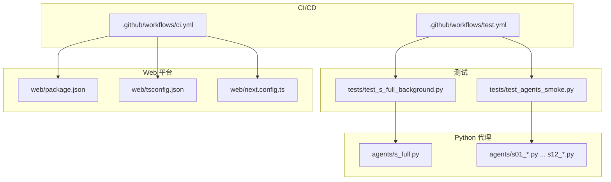
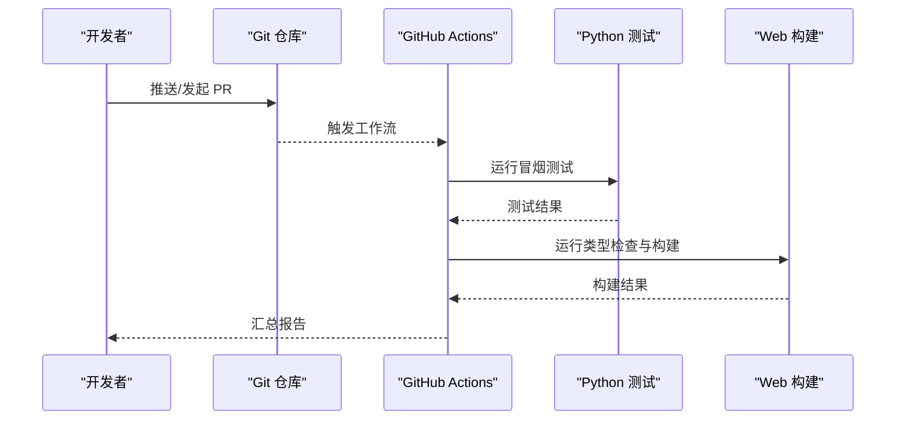
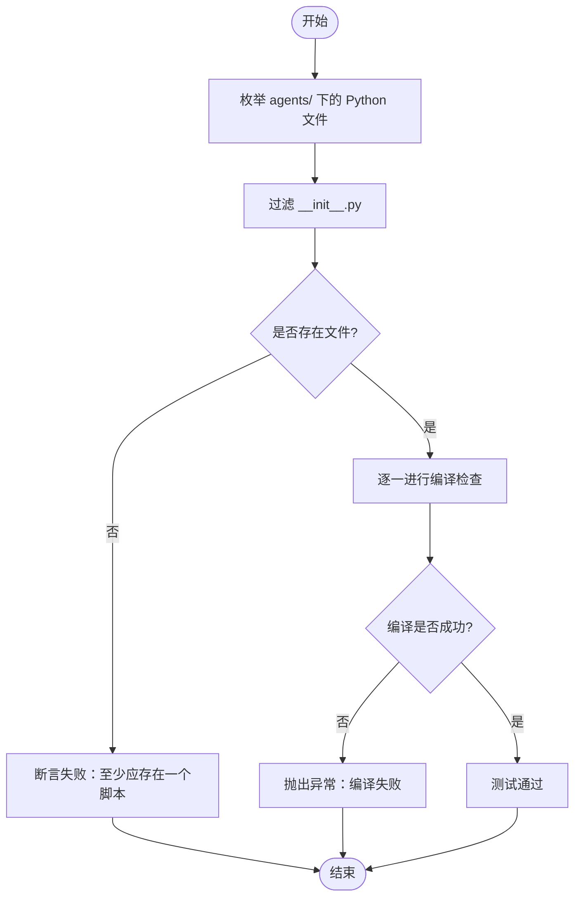
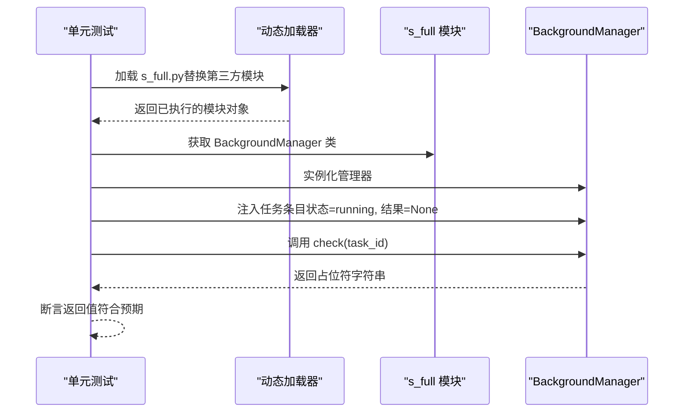
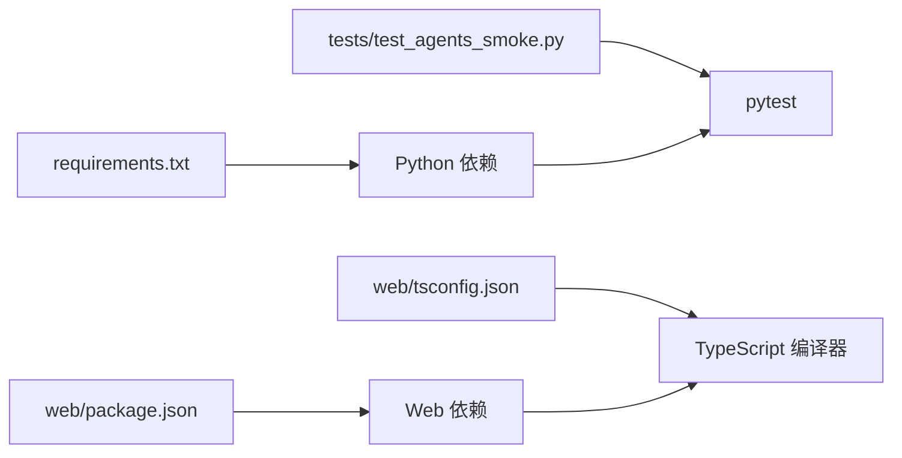

# 测试与质量保证

<cite>
**本文引用的文件**
- [.github/workflows/ci.yml](file://.github/workflows/ci.yml)
- [.github/workflows/test.yml](file://.github/workflows/test.yml)
- [tests/test_agents_smoke.py](file://tests/test_agents_smoke.py)
- [tests/test_s_full_background.py](file://tests/test_s_full_background.py)
- [requirements.txt](file://requirements.txt)
- [web/package.json](file://web/package.json)
- [web/tsconfig.json](file://web/tsconfig.json)
- [web/next.config.ts](file://web/next.config.ts)
- [web/.gitignore](file://web/.gitignore)
- [README.md](file://README.md)
- [README-zh.md](file://README-zh.md)
- [agents/s_full.py](file://agents/s_full.py)
</cite>

## 目录
1. [简介](#简介)
2. [项目结构](#项目结构)
3. [核心组件](#核心组件)
4. [架构总览](#架构总览)
5. [详细组件分析](#详细组件分析)
6. [依赖分析](#依赖分析)
7. [性能考虑](#性能考虑)
8. [故障排查指南](#故障排查指南)
9. [结论](#结论)
10. [附录](#附录)

## 简介
本文件系统化梳理本项目的测试与质量保证体系，覆盖测试策略、质量控制流程、持续集成配置、测试开发指南与质量保障实践。重点包括：
- 单元测试与功能测试设计思路：代理脚本编译测试、背景任务管理器功能测试
- 持续集成配置：CI/CD 流水线、自动化测试、构建验证
- 测试开发指南：测试用例编写、模拟环境搭建、测试数据管理
- 质量保障：代码覆盖率、性能测试、安全检查
- 最佳实践：如何建立完善的测试体系，保证项目的可靠性与可维护性

## 项目结构
项目采用“多模块并行”的组织方式：
- Python 代理实现位于 agents/，包含从 s01 到 s_full 的完整参考实现
- 测试用例位于 tests/，包含代理脚本编译测试与背景任务管理器功能测试
- Web 平台位于 web/，使用 Next.js，包含类型检查与构建流程
- GitHub Actions 工作流位于 .github/workflows/，分别负责 CI 与测试

图表来源
- [agents/s_full.py:1-200](file://agents/s_full.py#L1-L200)
- [tests/test_agents_smoke.py:1-24](file://tests/test_agents_smoke.py#L1-L24)
- [tests/test_s_full_background.py:1-68](file://tests/test_s_full_background.py#L1-L68)
- [web/package.json:1-39](file://web/package.json#L1-L39)
- [web/tsconfig.json:1-35](file://web/tsconfig.json#L1-L35)
- [web/next.config.ts:1-10](file://web/next.config.ts#L1-L10)
- [.github/workflows/ci.yml:1-33](file://.github/workflows/ci.yml#L1-L33)
- [.github/workflows/test.yml:1-46](file://.github/workflows/test.yml#L1-L46)

章节来源
- [README.md:287-298](file://README.md#L287-L298)
- [README-zh.md:288-298](file://README-zh.md#L288-L298)

## 核心组件
- Python 代理脚本编译测试：遍历 agents/ 下的 Python 文件，使用编译器进行语法与导入检查，确保脚本可被正确执行
- 背景任务管理器功能测试：通过动态加载 s_full.py 并替换第三方模块，模拟运行环境，验证 BackgroundManager 的状态检查逻辑
- Web 平台类型检查与构建：通过 TypeScript 编译选项与 Next.js 构建配置，确保前端类型安全与产物一致性
- GitHub Actions 流水线：分别执行 Python 冒烟测试与 Web 构建，保障主分支变更的质量门槛

章节来源
- [tests/test_agents_smoke.py:17-24](file://tests/test_agents_smoke.py#L17-L24)
- [tests/test_s_full_background.py:14-64](file://tests/test_s_full_background.py#L14-L64)
- [web/tsconfig.json:2-24](file://web/tsconfig.json#L2-L24)
- [web/next.config.ts:3-7](file://web/next.config.ts#L3-L7)
- [.github/workflows/test.yml:23-24](file://.github/workflows/test.yml#L23-L24)
- [.github/workflows/test.yml:44-45](file://.github/workflows/test.yml#L44-L45)

## 架构总览
测试与质量保证体系由“测试用例 + 模拟环境 + CI/CD 流水线”构成，贯穿 Python 代理与 Web 平台两端。

图表来源
- [.github/workflows/test.yml:3-7](file://.github/workflows/test.yml#L3-L7)
- [.github/workflows/test.yml:23-24](file://.github/workflows/test.yml#L23-L24)
- [.github/workflows/test.yml:44-45](file://.github/workflows/test.yml#L44-L45)
- [.github/workflows/ci.yml:28-32](file://.github/workflows/ci.yml#L28-L32)

## 详细组件分析

### 组件 A：代理脚本编译测试
- 设计思路
  - 遍历 agents/ 目录下的 Python 文件，排除 __init__.py
  - 使用编译器对每个脚本进行语法与导入检查，失败则抛出异常
  - 断言至少存在一个代理脚本文件，避免空目录导致的误判
- 质量收益
  - 早期发现语法错误与缺失依赖
  - 保证所有脚本均可被 Python 解释器加载与执行
- 可扩展性
  - 可增加对脚本导入顺序、循环依赖的检测
  - 可结合覆盖率工具统计脚本被测试覆盖情况

图表来源
- [tests/test_agents_smoke.py:9-24](file://tests/test_agents_smoke.py#L9-L24)

章节来源
- [tests/test_agents_smoke.py:17-24](file://tests/test_agents_smoke.py#L17-L24)

### 组件 B：背景任务管理器功能测试
- 设计思路
  - 动态加载 s_full.py，替换第三方模块（如 anthropic、dotenv）为模拟对象，避免真实依赖
  - 在临时工作目录中执行，设置必要的环境变量（如 MODEL_ID）
  - 创建 BackgroundManager 实例，构造“运行中且结果为空”的任务条目
  - 断言 check 返回占位符字符串，验证状态显示逻辑
- 质量收益
  - 验证背景任务管理器在真实场景下的状态处理
  - 通过模拟第三方模块，降低测试对外部服务的耦合
- 可扩展性
  - 可增加更多状态分支的断言（如完成、失败、取消）
  - 可引入更复杂的任务生命周期模拟

图表来源
- [tests/test_s_full_background.py:14-64](file://tests/test_s_full_background.py#L14-L64)
- [agents/s_full.py:1-200](file://agents/s_full.py#L1-L200)

章节来源
- [tests/test_s_full_background.py:14-64](file://tests/test_s_full_background.py#L14-L64)

### 组件 C：Web 平台类型检查与构建
- 类型检查
  - 启用严格模式与增量编译，确保类型安全与构建性能
  - 禁止输出 JS，仅进行类型校验
- 构建配置
  - 输出静态导出（export），禁用图片优化，启用尾斜杠，便于本地与静态托管
- 测试策略
  - 在 CI 中执行类型检查与构建，确保前端变更不会引入类型错误与构建失败

章节来源
- [web/tsconfig.json:2-24](file://web/tsconfig.json#L2-L24)
- [web/next.config.ts:3-7](file://web/next.config.ts#L3-L7)
- [.github/workflows/ci.yml:28-32](file://.github/workflows/ci.yml#L28-L32)

### 组件 D：持续集成与自动化测试
- CI 工作流
  - 触发条件：推送至 main 分支或针对 main 分支发起 PR
  - Python 冒烟测试：安装依赖、运行 pytest，快速验证代理脚本可执行性
  - Web 构建：安装依赖、类型检查、构建产物
- 质量门槛
  - 任一环节失败将阻断合并，确保主分支稳定

章节来源
- [.github/workflows/test.yml:3-7](file://.github/workflows/test.yml#L3-L7)
- [.github/workflows/test.yml:23-24](file://.github/workflows/test.yml#L23-L24)
- [.github/workflows/test.yml:44-45](file://.github/workflows/test.yml#L44-L45)
- [.github/workflows/ci.yml:1-33](file://.github/workflows/ci.yml#L1-L33)

## 依赖分析
- Python 依赖
  - anthropic、python-dotenv、pyyaml：用于代理与环境配置
- Web 依赖
  - Next.js、React、TailwindCSS、TypeScript：前端框架与样式
- 测试依赖
  - pytest：Python 测试框架
  - py_compile：内置编译器，用于脚本编译测试

图表来源
- [requirements.txt:1-3](file://requirements.txt#L1-L3)
- [web/package.json:13-37](file://web/package.json#L13-L37)
- [tests/test_agents_smoke.py:4-7](file://tests/test_agents_smoke.py#L4-L7)
- [web/tsconfig.json:16-20](file://web/tsconfig.json#L16-L20)

章节来源
- [requirements.txt:1-3](file://requirements.txt#L1-L3)
- [web/package.json:13-37](file://web/package.json#L13-L37)

## 性能考虑
- 测试执行性能
  - Python 冒烟测试仅进行编译检查，时间短、成本低
  - Web 类型检查与构建在 CI 中执行，避免本地环境差异
- 代理执行性能
  - 通过背景任务与通知队列实现非阻塞并发，提升整体吞吐
  - 任务隔离与上下文压缩减少重复计算与内存占用
- 建议
  - 引入性能回归检测（如基准测试）以量化关键路径性能
  - 对大型脚本或复杂任务增加超时与重试策略

## 故障排查指南
- Python 冒烟测试失败
  - 检查 agents/ 下脚本是否存在语法错误或缺失依赖
  - 确认 requirements.txt 与虚拟环境一致
- Web 构建失败
  - 查看类型检查错误，修复类型不匹配
  - 确认 Next.js 导出配置与静态托管要求一致
- 背景任务管理器测试失败
  - 检查模拟模块替换逻辑是否正确
  - 确认任务状态与返回值断言一致
- CI/CD 失败
  - 查看工作流日志，定位具体步骤与错误信息
  - 确保缓存命中与依赖安装步骤正常

章节来源
- [tests/test_agents_smoke.py:17-24](file://tests/test_agents_smoke.py#L17-L24)
- [tests/test_s_full_background.py:14-64](file://tests/test_s_full_background.py#L14-L64)
- [.github/workflows/ci.yml:28-32](file://.github/workflows/ci.yml#L28-L32)
- [.github/workflows/test.yml:23-24](file://.github/workflows/test.yml#L23-L24)
- [.github/workflows/test.yml:44-45](file://.github/workflows/test.yml#L44-L45)

## 结论
本项目的测试与质量保证体系以“轻量、稳健、可扩展”为目标：通过 Python 代理脚本编译测试与 Web 平台类型检查/构建，配合 GitHub Actions 的自动化流水线，形成对主分支变更的快速反馈；通过背景任务管理器的功能测试，验证核心机制在真实场景下的正确性。建议后续引入覆盖率统计、性能基准与安全扫描，进一步完善质量保障闭环。

## 附录
- 测试开发指南
  - 测试用例编写：遵循单一职责，明确输入/期望输出，覆盖边界与异常路径
  - 模拟环境搭建：使用动态加载与模块替换，隔离外部依赖
  - 测试数据管理：集中管理测试场景与断言数据，便于维护与扩展
- 质量保障实践
  - 代码覆盖率：逐步引入覆盖率统计，优先覆盖关键路径与异常分支
  - 性能测试：对热点路径进行基准测试，建立回归阈值
  - 安全检查：定期扫描依赖漏洞，规范敏感信息处理