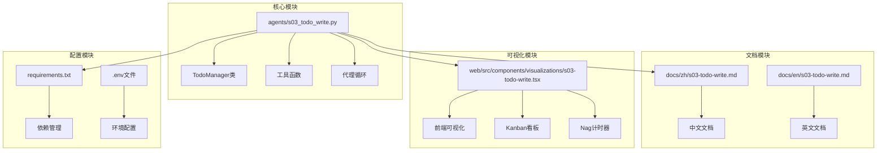
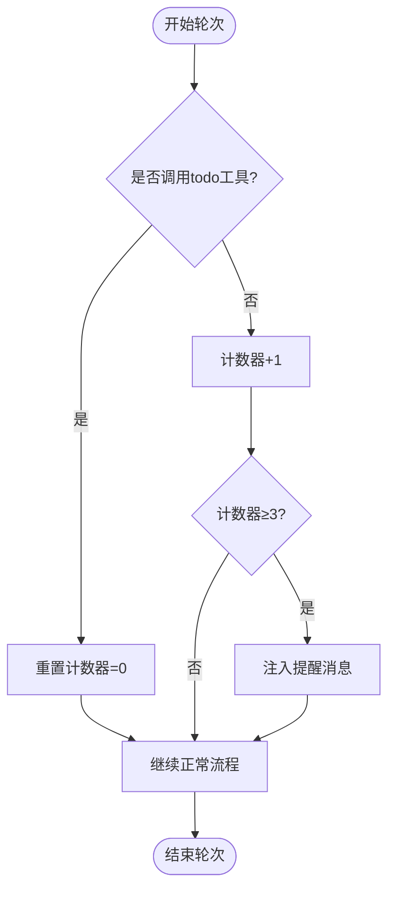
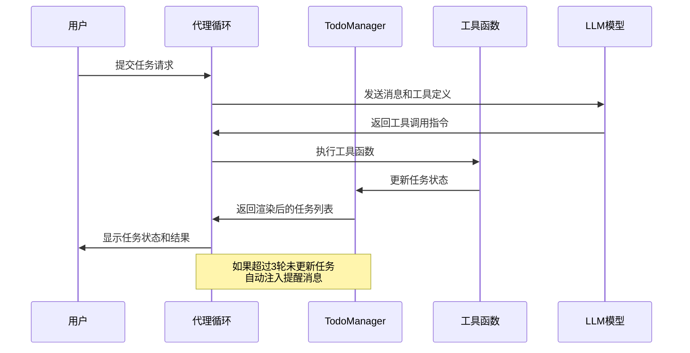
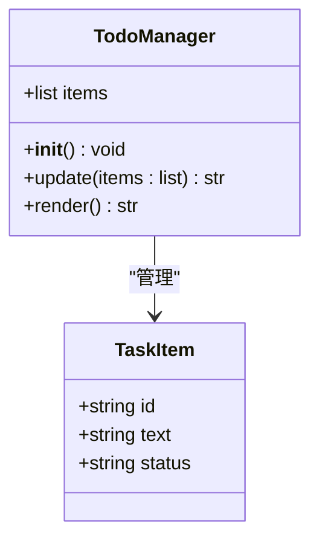
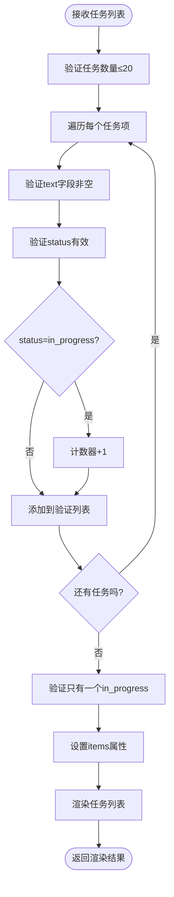
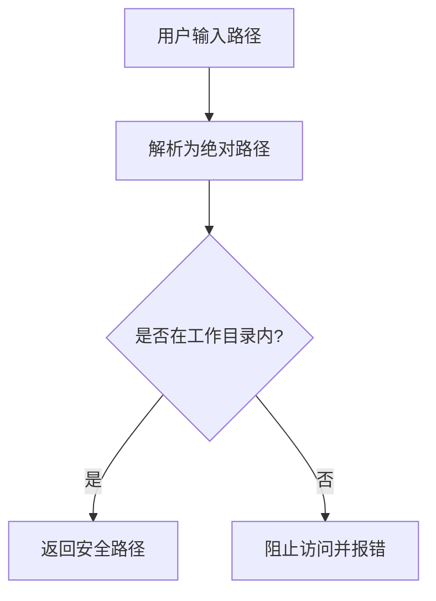
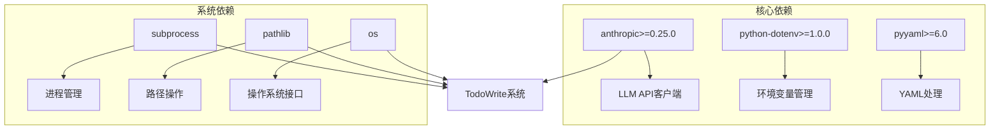
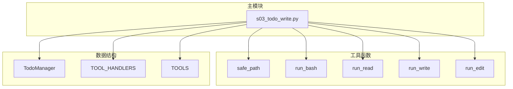

# TodoWrite任务管理系统

<cite>
**本文档引用的文件**
- [s03_todo_write.py](file://agents/s03_todo_write.py)
- [s03-todo-write.md](file://docs/zh/s03-todo-write.md)
- [s03-todo-write.tsx](file://web/src/components/visualizations/s03-todo-write.tsx)
- [README.md](file://README.md)
- [requirements.txt](file://requirements.txt)
</cite>

## 目录
1. [简介](#简介)
2. [项目结构](#项目结构)
3. [核心组件](#核心组件)
4. [架构概览](#架构概览)
5. [详细组件分析](#详细组件分析)
6. [依赖关系分析](#依赖关系分析)
7. [性能考虑](#性能考虑)
8. [故障排除指南](#故障排除指南)
9. [结论](#结论)
10. [附录](#附录)

## 简介

TodoWrite是Learn Claude Code项目中的一个关键组件，它实现了基于状态的任务管理系统，通过TodoManager类来跟踪代理的多步骤任务进度。该系统的核心创新在于引入了"nag提醒机制"，通过rounds_since_todo计数器强制代理定期更新任务状态，从而防止代理在长时间内忘记更新其工作进度。

TodoWrite系统的设计理念体现了"规划--让模型不偏航，但不替它画航线"这一Harness工程原则，它不是要控制代理的行为，而是为代理提供一个可见的、可追踪的工作计划，同时通过nag提醒机制创造问责压力，确保代理能够持续地监控和更新自己的工作进度。

## 项目结构

该项目采用模块化设计，将不同的Harness机制分离到独立的文件中：



**图表来源**
- [s03_todo_write.py:1-212](file://agents/s03_todo_write.py#L1-L212)
- [s03-todo-write.md:1-99](file://docs/zh/s03-todo-write.md#L1-L99)
- [s03-todo-write.tsx:1-324](file://web/src/components/visualizations/s03-todo-write.tsx#L1-L324)

**章节来源**
- [s03_todo_write.py:1-212](file://agents/s03_todo_write.py#L1-L212)
- [README.md:287-378](file://README.md#L287-L378)

## 核心组件

### TodoManager类

TodoManager是TodoWrite系统的核心组件，负责维护和管理任务列表的状态。它实现了以下关键功能：

#### 任务状态管理
- **pending**: 待处理任务，标记为"[ ]"
- **in_progress**: 进行中任务，标记为"[>]"
- **completed**: 已完成任务，标记为"[x]"

#### 数据验证机制
TodoManager对输入的任务数据进行严格验证：
- 最大支持20个任务
- 每个任务必须包含text字段
- status字段必须是"pending"、"in_progress"或"completed"之一
- 同一时间只能有一个任务处于"in_progress"状态

#### 渲染功能
TodoManager提供直观的任务列表渲染，显示当前所有任务的状态和完成进度。

**章节来源**
- [s03_todo_write.py:52-86](file://agents/s03_todo_write.py#L52-L86)

### 工具函数系统

系统提供了五个核心工具函数，每个都经过精心设计的安全检查：

#### 安全路径验证
```python
def safe_path(p: str) -> Path:
    path = (WORKDIR / p).resolve()
    if not path.is_relative_to(WORKDIR):
        raise ValueError(f"Path escapes workspace: {p}")
    return path
```

这个函数确保所有文件操作都在指定的工作目录范围内执行，防止路径遍历攻击。

#### 危险命令过滤
```python
dangerous = ["rm -rf /", "sudo", "shutdown", "reboot", "> /dev/"]
if any(d in command for d in dangerous):
    return "Error: Dangerous command blocked"
```

系统识别并阻止潜在危险的shell命令，包括系统级操作和可能破坏性的命令。

**章节来源**
- [s03_todo_write.py:93-139](file://agents/s03_todo_write.py#L93-L139)

### Nag提醒机制

Nag提醒机制是TodoWrite系统的关键创新，通过rounds_since_todo计数器强制代理定期更新任务状态：



**图表来源**
- [s03_todo_write.py:164-193](file://agents/s03_todo_write.py#L164-L193)

**章节来源**
- [s03_todo_write.py:164-193](file://agents/s03_todo_write.py#L164-L193)

## 架构概览

TodoWrite系统采用了经典的代理循环架构，结合了任务管理和安全控制机制：



**图表来源**
- [s03_todo_write.py:164-193](file://agents/s03_todo_write.py#L164-L193)
- [s03_todo_write.py:141-147](file://agents/s03_todo_write.py#L141-L147)

## 详细组件分析

### TodoManager类深度解析

TodoManager类实现了完整的任务状态管理功能，具有以下设计特点：

#### 类结构图


**图表来源**
- [s03_todo_write.py:52-86](file://agents/s03_todo_write.py#L52-L86)

#### 更新流程分析


**图表来源**
- [s03_todo_write.py:56-75](file://agents/s03_todo_write.py#L56-L75)

**章节来源**
- [s03_todo_write.py:52-86](file://agents/s03_todo_write.py#L52-L86)

### 安全机制设计

TodoWrite系统实施了多层次的安全防护机制：

#### 路径安全验证


**图表来源**
- [s03_todo_write.py:93-97](file://agents/s03_todo_write.py#L93-L97)

#### 命令安全过滤
系统对危险命令进行了全面的检测和拦截，包括但不限于：
- 系统级删除命令：`rm -rf /`
- 权限提升命令：`sudo`
- 系统关机命令：`shutdown`, `reboot`
- 设备破坏性操作：`> /dev/`

**章节来源**
- [s03_todo_write.py:93-139](file://agents/s03_todo_write.py#L93-L139)

### 前端可视化组件

前端组件提供了直观的任务状态可视化，增强了用户体验：

#### 看板视图设计
```mermaid
graph LR
subgraph "看板布局"
Pending[待处理列<br/>[ ]任务]
InProgress[进行中列<br/>[>]任务]
Done[已完成列<br/>[x]任务]
end
subgraph "状态指示器"
NagTimer[Nag计时器<br/>0/3]
Progress[进度条<br/>完成/总数]
end
Pending --> InProgress
InProgress --> Done
NagTimer --> Pending
Progress --> Done
```

**图表来源**
- [s03-todo-write.tsx:266-286](file://web/src/components/visualizations/s03-todo-write.tsx#L266-L286)

**章节来源**
- [s03-todo-write.tsx:17-68](file://web/src/components/visualizations/s03-todo-write.tsx#L17-L68)

## 依赖关系分析

### 外部依赖
TodoWrite系统依赖于以下关键库：



**图表来源**
- [requirements.txt:1-3](file://requirements.txt#L1-L3)
- [s03_todo_write.py:30-44](file://agents/s03_todo_write.py#L30-L44)

### 内部模块依赖


**图表来源**
- [s03_todo_write.py:93-160](file://agents/s03_todo_write.py#L93-L160)

**章节来源**
- [requirements.txt:1-3](file://requirements.txt#L1-L3)
- [s03_todo_write.py:93-160](file://agents/s03_todo_write.py#L93-L160)

## 性能考虑

### 时间复杂度分析
- **任务更新**: O(n)，其中n是任务数量，需要遍历所有任务进行验证
- **渲染输出**: O(n)，线性扫描任务列表生成文本表示
- **路径验证**: O(1)，固定时间操作
- **命令过滤**: O(m×k)，其中m是危险模式数量，k是命令长度

### 内存使用优化
- 任务列表存储采用紧凑的字典格式
- 渲染输出使用生成器模式避免内存峰值
- 文件读取支持限制行数，防止大文件占用过多内存

### 并发安全性
- 使用原子操作更新任务状态
- 文件操作通过父类创建确保目录存在
- Shell命令执行设置超时限制

## 故障排除指南

### 常见问题及解决方案

#### 任务状态错误
**问题**: "Only one task can be in_progress at a time"
**原因**: 同时设置了多个任务为进行中状态
**解决**: 确保同一时间只有一个任务处于进行中状态

#### 路径访问被拒绝
**问题**: "Path escapes workspace"
**原因**: 尝试访问工作目录之外的文件
**解决**: 使用相对路径或确保路径位于工作目录内

#### 危险命令被阻止
**问题**: "Dangerous command blocked"
**原因**: 命令包含系统级或破坏性操作
**解决**: 修改命令避免使用危险操作符

#### 超时错误
**问题**: "Error: Timeout (120s)"
**原因**: 命令执行时间超过120秒
**解决**: 优化命令或分解为更小的操作

**章节来源**
- [s03_todo_write.py:57-73](file://agents/s03_todo_write.py#L57-L73)
- [s03_todo_write.py:99-110](file://agents/s03_todo_write.py#L99-L110)

## 结论

TodoWrite任务管理系统是一个精心设计的Harness组件，它成功地解决了多步骤任务中代理容易忘记更新进度的问题。通过引入nag提醒机制和严格的验证规则，系统不仅提高了任务完成率，还确保了操作的安全性。

该系统的核心价值在于：
1. **增强的自我监控能力**: 代理可以持续追踪自己的工作进度
2. **问责压力机制**: 通过nag提醒确保代理不会长期忽略任务更新
3. **安全边界控制**: 多层安全检查防止恶意或意外的系统破坏
4. **可视化反馈**: 直观的界面帮助代理更好地理解当前状态

TodoWrite系统体现了Harness工程的核心理念：信任模型的能力，但通过精心设计的环境和工具来引导模型做出正确的决策。这种设计模式可以广泛应用于各种代理系统中，帮助提升代理的可靠性和效率。

## 附录

### 实际使用场景

#### 场景1：代码重构任务
代理需要重构一个大型Python文件，使用TodoWrite系统：
1. 创建任务列表：分析代码、添加类型注解、修复docstrings、添加main保护
2. 按顺序执行任务，每完成一个任务就更新状态
3. 如果代理忘记更新，nag提醒会强制其回到任务状态

#### 场景2：项目初始化
代理需要创建一个新的Python包：
1. 创建任务：初始化项目结构、编写__init__.py、创建utils.py、编写测试文件
2. 每个任务完成后立即更新状态
3. 通过nag提醒确保代理不会跳过任何步骤

#### 场景3：批量文件处理
代理需要处理多个文件：
1. 创建任务列表：读取每个文件、分析内容、应用修改、保存结果
2. 使用nag提醒机制确保代理不会遗漏任何文件
3. 通过任务状态可视化监控整体进度

### 最佳实践建议

#### 任务设计原则
1. **明确性**: 每个任务描述应该具体明确，避免模糊不清
2. **可执行性**: 任务应该是可执行的步骤，而不是抽象的概念
3. **顺序性**: 任务之间应该有明确的依赖关系
4. **粒度适中**: 任务既不能太粗也不能太细

#### 使用技巧
1. **及时更新**: 每完成一个子任务就立即更新状态
2. **保持专注**: 同一时间只专注于一个进行中的任务
3. **利用提醒**: 当nag提醒出现时，立即回到任务状态检查
4. **可视化监控**: 通过任务状态了解整体进度

#### 安全注意事项
1. **谨慎使用shell命令**: 避免使用可能破坏系统的命令
2. **验证路径**: 确保所有文件操作都在预期的工作目录内
3. **权限最小化**: 只授予代理完成任务所需的最小权限
4. **监控输出**: 注意观察工具调用的输出，及时发现异常