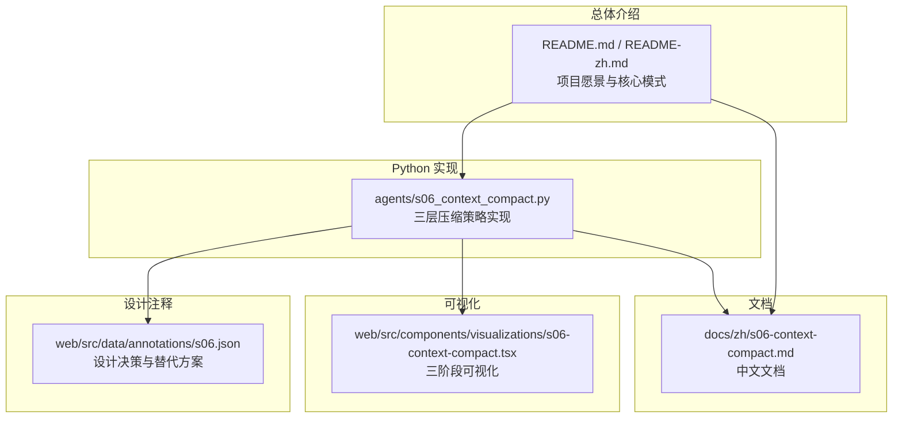
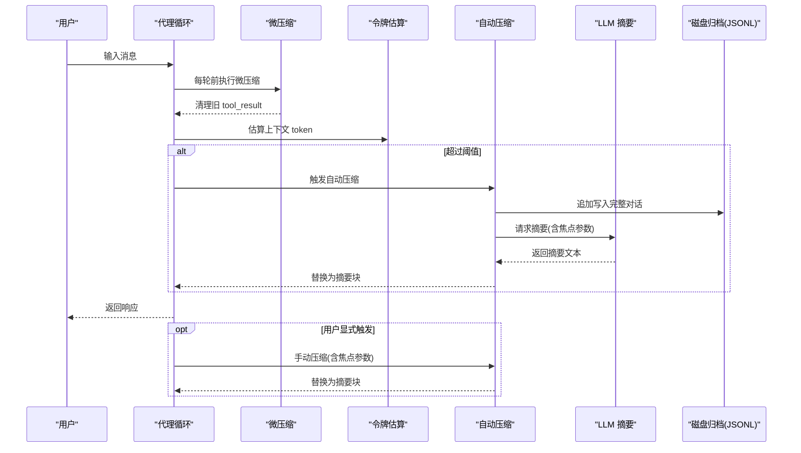
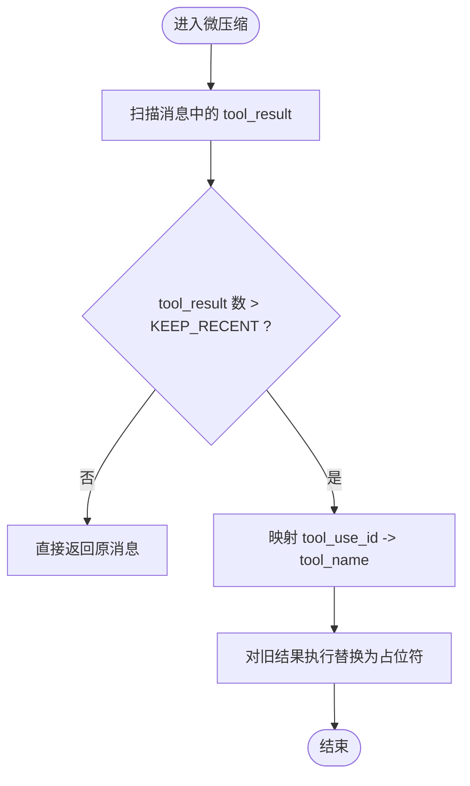
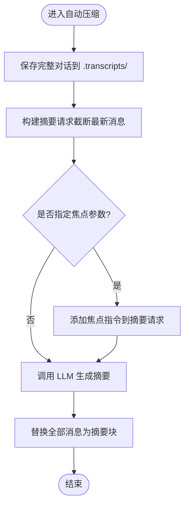
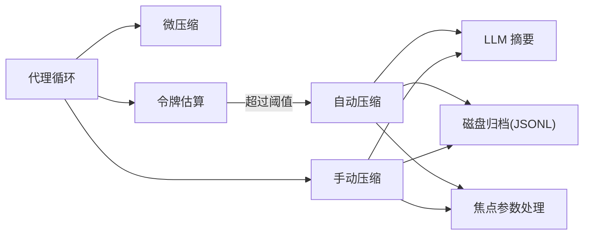

# 上下文压缩机制

<cite>
**本文引用的文件**
- [s06_context_compact.py](file://agents/s06_context_compact.py)
- [s06-context-compact.md](file://docs/zh/s06-context-compact.md)
- [s06-context-compact.tsx](file://web/src/components/visualizations/s06-context-compact.tsx)
- [s06.json](file://web/src/data/annotations/s06.json)
- [README.md](file://README.md)
- [README-zh.md](file://README-zh.md)
</cite>

## 目录
1. [简介](#简介)
2. [项目结构](#项目结构)
3. [核心组件](#核心组件)
4. [架构总览](#架构总览)
5. [详细组件分析](#详细组件分析)
6. [依赖关系分析](#依赖关系分析)
7. [性能考量](#性能考量)
8. [故障排查指南](#故障排查指南)
9. [结论](#结论)
10. [附录](#附录)

## 简介
本文件系统化阐述"上下文压缩机制"的三层策略设计与实现，覆盖摘要生成、重要性评估与选择性删除算法；解释上下文窗口限制对代理性能的影响及压缩机制如何在信息保留与内存使用之间取得平衡；提供文本预处理、相似度计算与压缩比控制的具体实现思路；说明压缩后上下文如何保持语义完整性，并给出压缩失败的处理策略；最后结合可视化与注释材料，给出性能基准与调优建议、实际压缩效果对比与最佳实践案例。

## 项目结构
本项目围绕"上下文压缩"主题，提供：
- Python 实现：三层压缩策略的参考实现，包含微压缩、自动压缩与手动压缩。
- 文档：中文技术文档，解释问题、方案、工作原理与变更。
- 可视化：Web 组件，演示三层压缩在上下文窗口中的动态变化。
- 注释：设计决策与替代方案说明，指导参数调优与容错策略。

图表来源
- [s06_context_compact.py:1-263](file://agents/s06_context_compact.py#L1-L263)
- [s06-context-compact.md:1-127](file://docs/zh/s06-context-compact.md#L1-L127)
- [s06-context-compact.tsx:1-451](file://web/src/components/visualizations/s06-context-compact.tsx#L1-L451)
- [s06.json:1-62](file://web/src/data/annotations/s06.json#L1-L62)
- [README.md:1-378](file://README.md#L1-L378)
- [README-zh.md:1-373](file://README-zh.md#L1-L373)

章节来源
- [s06_context_compact.py:1-263](file://agents/s06_context_compact.py#L1-L263)
- [s06-context-compact.md:1-127](file://docs/zh/s06-context-compact.md#L1-L127)
- [s06-context-compact.tsx:1-451](file://web/src/components/visualizations/s06-context-compact.tsx#L1-L451)
- [s06.json:1-62](file://web/src/data/annotations/s06.json#L1-L62)
- [README.md:1-378](file://README.md#L1-L378)
- [README-zh.md:1-373](file://README-zh.md#L1-L373)

## 核心组件
- 三层压缩策略
  - 微压缩（Layer 1）：每次 LLM 调用前，将旧的 tool_result 替换为占位符，保留最近若干轮结果，避免上下文被冗长输出填满。
  - 自动压缩（Layer 2）：当 token 估算超过阈值时，保存完整对话到磁盘，调用 LLM 生成摘要，替换全部消息为摘要块。
  - 手动压缩（Layer 3）：通过 compact 工具触发与自动压缩相同的摘要流程，用于明确的"重新开始"时刻。
- 上下文窗口与阈值
  - 使用粗略的字符计数估算 token 数，设定阈值以触发自动压缩。
  - 采用最小节省阈值策略，避免低价值压缩带来的质量损失与额外开销。
- 归档与恢复
  - 将完整对话以 JSONL 追加写入磁盘，确保压缩是"有损于内存上下文，无损于永久记录"。
- **新增功能**：焦点信息保留
  - 通过 `focus` 参数指定在压缩过程中要重点保留的关键信息，增强压缩的可控性和针对性。

章节来源
- [s06_context_compact.py:63-127](file://agents/s06_context_compact.py#L63-L127)
- [s06-context-compact.md:13-43](file://docs/zh/s06-context-compact.md#L13-L43)
- [s06.json:19-31](file://web/src/data/annotations/s06.json#L19-L31)

## 架构总览
三层压缩策略在代理循环中协同工作：微压缩持续清理旧 tool_result，自动压缩在达到阈值时进行大规模摘要，手动压缩允许用户在关键时刻强制深度压缩。**新增的焦点参数**为压缩过程提供了更精细的控制能力。

图表来源
- [s06_context_compact.py:201-243](file://agents/s06_context_compact.py#L201-L243)
- [s06_context_compact.py:103-127](file://agents/s06_context_compact.py#L103-L127)
- [s06_context_compact.py:113-115](file://agents/s06_context_compact.py#L113-L115)

## 详细组件分析

### 微压缩（Layer 1）
- 目标：在每次 LLM 调用前，将旧的 tool_result 替换为短占位符，减少冗长输出占用上下文。
- 关键点：
  - 收集所有 tool_result，识别最近 KEEP_RECENT 个结果保留，其余替换为占位符。
  - 通过匹配 tool_use_id 与 prior assistant 中的 tool_use，确定工具名称，生成占位符。
  - 对极短内容或特殊工具（如 read_file）不替换，避免重复读取导致的性能与一致性问题。
- 复杂度：遍历消息列表，时间复杂度 O(N)，空间复杂度 O(K)（K 为 tool_result 数）。

图表来源
- [s06_context_compact.py:69-99](file://agents/s06_context_compact.py#L69-L99)

章节来源
- [s06_context_compact.py:69-99](file://agents/s06_context_compact.py#L69-L99)
- [s06-context-compact.md:47-63](file://docs/zh/s06-context-compact.md#L47-L63)

### 自动压缩（Layer 2）
- 目标：在达到 token 阈值时，保存完整对话到磁盘，调用 LLM 生成摘要，替换全部消息为摘要块。
- 关键点：
  - 保存完整对话到 .transcripts/ 目录，文件名包含时间戳，便于后续分析与恢复。
  - 从最新消息开始截断拼接，避免一次性传输过大内容。
  - 生成摘要后，将所有历史消息替换为单条摘要消息，避免重叠内容引发的连贯性问题。
  - **新增功能**：支持 `focus` 参数，允许指定要重点保留的关键信息。
- 复杂度：保存与摘要生成为主要开销，整体受 LLM API 调用与磁盘写入影响。

图表来源
- [s06_context_compact.py:103-131](file://agents/s06_context_compact.py#L103-L131)
- [s06-context-compact.md:65-85](file://docs/zh/s06-context-compact.md#L65-L85)

章节来源
- [s06_context_compact.py:103-131](file://agents/s06_context_compact.py#L103-L131)
- [s06.json:33-45](file://web/src/data/annotations/s06.json#L33-L45)

### 手动压缩（Layer 3）
- 目标：通过 compact 工具触发与自动压缩相同的摘要流程，用于明确的"重新开始"时刻。
- 关键点：
  - compact 工具在代理循环中被识别为触发压缩的信号，立即执行自动压缩流程。
  - **新增功能**：compact 工具现在支持 `focus` 参数，允许用户指定要重点保留的信息。
  - 适合在用户确认需要"清空上下文、重新聚焦"的场景使用。

章节来源
- [s06_context_compact.py:217-243](file://agents/s06_context_compact.py#L217-L243)
- [s06-context-compact.md:87-101](file://docs/zh/s06-context-compact.md#L87-L101)

### 令牌估算与阈值控制
- 令牌估算：采用"字符串长度约等于 token 数"的粗略估算，便于快速判断是否触发压缩。
- 最小节省阈值：仅当压缩预期节省的 token 数超过一定阈值时才触发，避免低价值压缩带来的质量损失与额外开销。
- 替代方案：百分比阈值（按窗口容量比例）可自适应不同上下文窗口，但不考虑摘要生成的固定成本；固定阈值（如 10K）更激进但易造成浪费。

章节来源
- [s06_context_compact.py:63-65](file://agents/s06_context_compact.py#L63-L65)
- [s06.json:19-31](file://web/src/data/annotations/s06.json#L19-L31)

### 归档与恢复（Transcript）
- 目标：压缩是"有损于内存上下文，无损于永久记录"，完整对话以 JSONL 追加写入磁盘，支持事后分析与调试。
- 关键点：
  - JSONL 格式支持追加写入与流式处理，便于并发写入与增量分析。
  - 保存完整历史，避免压缩导致的信息丢失。

章节来源
- [s06_context_compact.py:104-110](file://agents/s06_context_compact.py#L104-L110)
- [s06.json:47-59](file://web/src/data/annotations/s06.json#L47-L59)

### 可视化演示（三阶段）
- 目标：通过可视化组件直观展示上下文增长、微压缩、自动压缩与手动压缩的效果。
- 关键点：
  - 逐步展示上下文窗口从增长到接近阈值、微压缩替换旧 tool_result、自动压缩生成摘要、手动压缩形成最深压缩。
  - 使用颜色与标签区分用户、助手与 tool_result，高度与占比反映 token 占比。

章节来源
- [s06-context-compact.tsx:56-156](file://web/src/components/visualizations/s06-context-compact.tsx#L56-L156)
- [s06-context-compact.tsx:158-194](file://web/src/components/visualizations/s06-context-compact.tsx#L158-L194)

## 依赖关系分析
- 组件耦合
  - 代理循环依赖三层压缩策略：微压缩在每次调用前执行，自动压缩在阈值触发时执行，手动压缩在用户显式触发时执行。
  - 令牌估算与阈值控制耦合：估算结果决定是否触发自动压缩。
  - 归档模块与自动压缩耦合：自动压缩完成后写入磁盘。
  - **新增依赖**：焦点参数处理逻辑，确保压缩过程的可控性。
- 外部依赖
  - LLM API：用于生成摘要。
  - 文件系统：用于保存 JSONL 归档。
- 潜在风险
  - 摘要质量不稳定：摘要可能丢失关键细节或与近期消息冲突。
  - 磁盘写入瓶颈：大量 JSONL 写入可能成为性能瓶颈。
  - 令牌估算误差：字符计数法在不同模型/编码下存在偏差。

图表来源
- [s06_context_compact.py:201-243](file://agents/s06_context_compact.py#L201-L243)
- [s06_context_compact.py:103-131](file://agents/s06_context_compact.py#L103-L131)

章节来源
- [s06_context_compact.py:201-243](file://agents/s06_context_compact.py#L201-L243)
- [s06_context_compact.py:103-131](file://agents/s06_context_compact.py#L103-L131)

## 性能考量
- 令牌估算误差与调优
  - 字符计数法在不同模型/编码下存在偏差，建议结合实际 token 包装器进行校准。
  - 最小节省阈值（如 20K）可避免低价值压缩，提升整体效率。
- 压缩比控制
  - 微压缩：将旧 tool_result 替换为短占位符，显著降低 tool_result 占比。
  - 自动压缩：将全部历史压缩为摘要块，通常可降至 10%-20% 的原始 token。
  - 手动压缩：最激进策略，适合明确的"重新开始"场景。
  - **新增优化**：焦点参数可减少不必要的信息保留，提高压缩效率。
- I/O 与 API 成本
  - JSONL 写入应异步化，避免阻塞代理循环。
  - LLM 摘要调用成本较高，建议批量触发或合并触发，减少 API 调用次数。
- 可视化与监控
  - 使用可视化组件监控上下文填充率与压缩阶段，及时发现异常增长。

章节来源
- [s06.json:19-31](file://web/src/data/annotations/s06.json#L19-L31)
- [s06-context-compact.tsx:46-47](file://web/src/components/visualizations/s06-context-compact.tsx#L46-L47)
- [s06-context-compact.tsx:118-151](file://web/src/components/visualizations/s06-context-compact.tsx#L118-L151)

## 故障排查指南
- 压缩失败或摘要为空
  - 检查 LLM API 是否正常返回摘要文本，若为空则回退为占位摘要。
  - 确认摘要请求内容是否过大，必要时缩短输入范围。
  - **新增检查**：验证焦点参数格式是否正确，避免因参数错误导致压缩失败。
- 令牌估算不准确
  - 使用更精确的 token 计数器（如模型专用分词器）替代字符计数法。
  - 结合历史运行数据统计误差，调整阈值与最小节省阈值。
- 归档缺失或损坏
  - 确认 .transcripts/ 目录存在且可写。
  - 检查 JSONL 写入是否成功，必要时增加重试与校验。
- 性能瓶颈
  - 将磁盘写入与 LLM 调用异步化，避免阻塞代理循环。
  - 优化工具结果大小（如限制 read_file 输出长度），减少上下文膨胀。
  - **新增优化**：合理设置焦点参数，避免过度保留信息影响压缩效果。

章节来源
- [s06_context_compact.py:112-131](file://agents/s06_context_compact.py#L112-L131)
- [s06_context_compact.py:104-110](file://agents/s06_context_compact.py#L104-L110)
- [s06.json:47-59](file://web/src/data/annotations/s06.json#L47-L59)

## 结论
三层压缩策略通过"微压缩（持续清理）—自动压缩（阈值触发）—手动压缩（明确重启）"的分层设计，在保证代理长期运行的同时，最大化地保留关键信息与上下文连贯性。**新增的焦点参数功能**进一步增强了压缩的可控性和针对性，使用户能够精确控制压缩过程中要保留的关键信息。结合最小节省阈值、摘要替换全部历史与 JSONL 归档，实现了"有损于内存上下文、无损于永久记录"的平衡。通过可视化与注释材料，开发者可以直观理解压缩效果并据此调优参数，以满足不同应用场景的需求。

## 附录

### 压缩算法实现要点（方法级）
- 微压缩
  - 步骤：扫描 tool_result → 识别旧结果 → 映射 tool_use_id → 替换为占位符
  - 关键参数：KEEP_RECENT、PRESERVE_RESULT_TOOLS
- 自动压缩
  - 步骤：保存完整对话 → 构建摘要请求 → **新增：处理焦点参数** → LLM 生成摘要 → 替换全部消息
  - 关键参数：阈值、摘要长度上限、截断范围、**新增：focus 参数**
- 手动压缩
  - 触发条件：compact 工具被调用
  - 行为：与自动压缩一致，**新增：支持 focus 参数**
  - **新增功能**：compact 工具现在支持 `{"focus": "要保留的关键信息"}` 参数

章节来源
- [s06_context_compact.py:69-99](file://agents/s06_context_compact.py#L69-L99)
- [s06_context_compact.py:103-131](file://agents/s06_context_compact.py#L103-L131)
- [s06_context_compact.py:217-243](file://agents/s06_context_compact.py#L217-L243)

### 压缩效果对比与最佳实践
- 效果对比
  - 微压缩：tool_result 占比下降，上下文稳定增长。
  - 自动压缩：上下文大幅下降至摘要级别，适合大体量会话。
  - 手动压缩：最深压缩，适合明确的"重新开始"场景。
  - **新增优化**：焦点参数可进一步减少压缩后的上下文大小，提高压缩效率。
- 最佳实践
  - 优先使用微压缩维持日常稳定性。
  - 设置合理的最小节省阈值，避免频繁低价值压缩。
  - 使用 JSONL 归档保留完整历史，便于事后分析。
  - 在高 I/O 场景下异步化磁盘写入与 LLM 调用。
  - **新增建议**：合理使用焦点参数，明确指定要保留的关键信息，避免过度保留影响压缩效果。
  - **新增建议**：在手动压缩时明确指定焦点，确保重要信息得到保留。

章节来源
- [s06-context-compact.tsx:158-194](file://web/src/components/visualizations/s06-context-compact.tsx#L158-L194)
- [s06.json:19-31](file://web/src/data/annotations/s06.json#L19-L31)

### 新增功能：焦点参数使用指南
- 功能概述
  - 通过 `focus` 参数指定在压缩过程中要重点保留的关键信息
  - 支持在自动压缩和手动压缩两种场景下使用
  - 提高压缩过程的可控性和针对性
- 使用示例
  - 自动压缩：系统会自动检测并应用焦点参数
  - 手动压缩：`{"name": "compact", "input": {"focus": "项目架构设计"}}`
- 应用场景
  - 保留重要的技术决策信息
  - 确保关键的业务规则不被丢失
  - 保持重要的代码片段或配置信息
  - 维护关键的分析结论和推导过程

**章节来源**
- [s06_context_compact.py:103-131](file://agents/s06_context_compact.py#L103-L131)
- [s06_context_compact.py:225-227](file://agents/s06_context_compact.py#L225-L227)
- [s06_context_compact.py:240-242](file://agents/s06_context_compact.py#L240-L242)