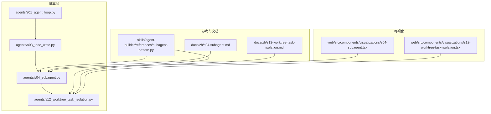
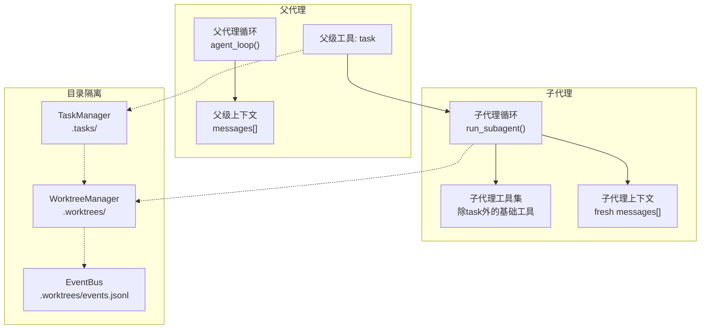
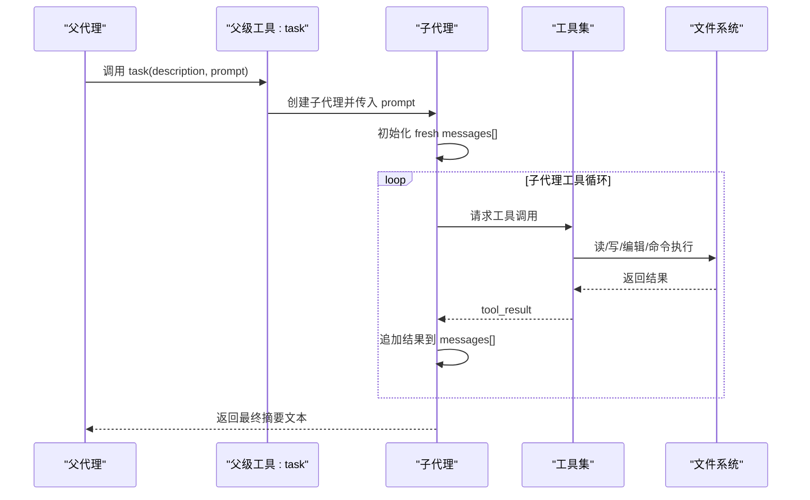
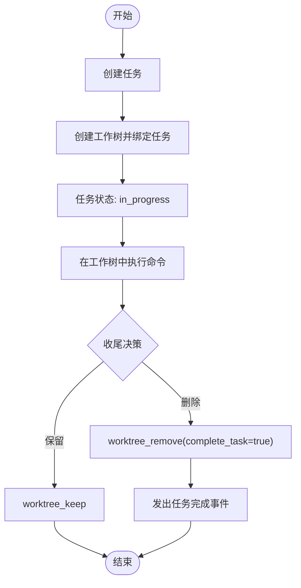
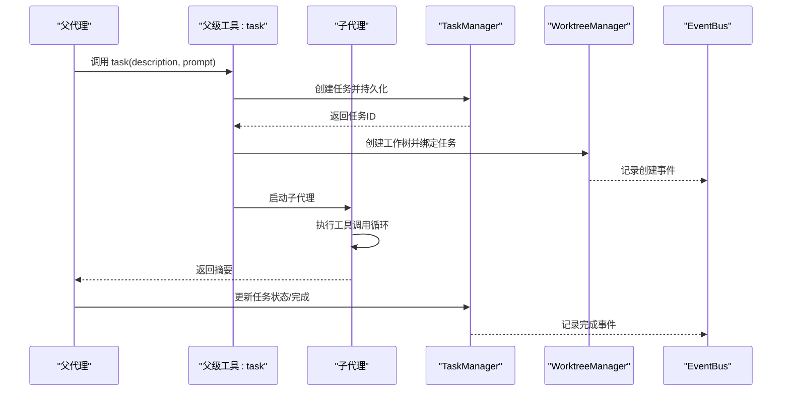
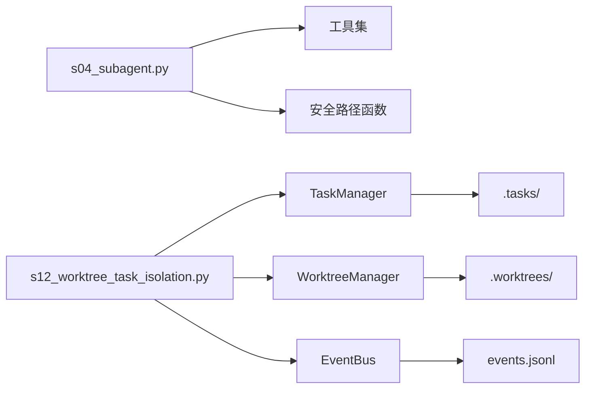

# 子代理隔离机制

<cite>
**本文引用的文件**
- [agents/s04_subagent.py](file://agents/s04_subagent.py)
- [agents/s12_worktree_task_isolation.py](file://agents/s12_worktree_task_isolation.py)
- [skills/agent-builder/references/subagent-pattern.py](file://skills/agent-builder/references/subagent-pattern.py)
- [docs/zh/s04-subagent.md](file://docs/zh/s04-subagent.md)
- [docs/zh/s12-worktree-task-isolation.md](file://docs/zh/s12-worktree-task-isolation.md)
- [web/src/components/visualizations/s04-subagent.tsx](file://web/src/components/visualizations/s04-subagent.tsx)
- [web/src/components/visualizations/s12-worktree-task-isolation.tsx](file://web/src/components/visualizations/s12-worktree-task-isolation.tsx)
- [agents/s01_agent_loop.py](file://agents/s01_agent_loop.py)
- [agents/s03_todo_write.py](file://agents/s03_todo_write.py)
</cite>

## 目录
1. [简介](#简介)
2. [项目结构](#项目结构)
3. [核心组件](#核心组件)
4. [架构总览](#架构总览)
5. [详细组件分析](#详细组件分析)
6. [依赖关系分析](#依赖关系分析)
7. [性能考量](#性能考量)
8. [故障排查指南](#故障排查指南)
9. [结论](#结论)
10. [附录](#附录)

## 简介
本文件系统性阐述“子代理隔离机制”，围绕两大维度展开：
- 上下文隔离：通过“子代理”在独立的消息上下文中执行，避免父代理上下文膨胀与噪声污染。
- 目录隔离：通过“工作树（worktree）+ 任务（task）”实现并行执行通道，确保不同任务在各自目录中安全运行，避免文件冲突与回滚困难。

文档将结合代码实现、可视化流程与最佳实践，帮助开发者理解何时使用子代理模式、如何正确创建与回收子代理、如何在多任务并行场景下进行目录隔离与状态同步。

## 项目结构
本仓库采用“分阶段演示”的组织方式，每个阶段对应一个可独立运行的脚本文件，便于学习与验证。子代理隔离机制主要体现在 s04 与 s12 两个脚本中，并辅以配套文档与可视化组件。

图表来源
- [agents/s04_subagent.py:1-188](file://agents/s04_subagent.py#L1-L188)
- [agents/s12_worktree_task_isolation.py:1-783](file://agents/s12_worktree_task_isolation.py#L1-L783)
- [skills/agent-builder/references/subagent-pattern.py:1-244](file://skills/agent-builder/references/subagent-pattern.py#L1-L244)
- [docs/zh/s04-subagent.md:1-97](file://docs/zh/s04-subagent.md#L1-L97)
- [docs/zh/s12-worktree-task-isolation.md:1-124](file://docs/zh/s12-worktree-task-isolation.md#L1-L124)
- [web/src/components/visualizations/s04-subagent.tsx:1-309](file://web/src/components/visualizations/s04-subagent.tsx#L1-L309)
- [web/src/components/visualizations/s12-worktree-task-isolation.tsx:1-279](file://web/src/components/visualizations/s12-worktree-task-isolation.tsx#L1-L279)

章节来源
- [agents/s04_subagent.py:1-188](file://agents/s04_subagent.py#L1-L188)
- [agents/s12_worktree_task_isolation.py:1-783](file://agents/s12_worktree_task_isolation.py#L1-L783)

## 核心组件
- 子代理（Subagent）
  - 设计要点：父代理拥有“任务”工具；子代理拥有除“任务”外的基础工具集，且以全新消息数组启动，仅返回摘要文本。
  - 关键实现：run_subagent 函数负责在独立上下文中执行工具调用循环，最终汇总为一段摘要返回父代理。
- 目录隔离（Worktree + Task）
  - 设计要点：任务板（.tasks）负责目标与状态协调；工作树（.worktrees）负责执行通道隔离；二者通过任务 ID 绑定，形成“控制平面 + 执行平面”的双层协作。
  - 关键实现：WorktreeManager 提供创建、运行、保留、移除等操作；TaskManager 提供任务的创建、查询、更新与绑定；EventBus 提供生命周期事件日志。

章节来源
- [agents/s04_subagent.py:118-137](file://agents/s04_subagent.py#L118-L137)
- [agents/s12_worktree_task_isolation.py:224-474](file://agents/s12_worktree_task_isolation.py#L224-L474)

## 架构总览
下图展示了“子代理上下文隔离”与“工作树目录隔离”的协同关系：前者解决“对话历史污染”，后者解决“文件系统冲突”。

图表来源
- [agents/s04_subagent.py:146-169](file://agents/s04_subagent.py#L146-L169)
- [agents/s04_subagent.py:118-137](file://agents/s04_subagent.py#L118-L137)
- [agents/s12_worktree_task_isolation.py:224-474](file://agents/s12_worktree_task_isolation.py#L224-L474)

## 详细组件分析

### 子代理：上下文隔离
- 设计原理
  - “进程隔离带来上下文隔离”：子代理以全新 messages[] 启动，工具调用产生的中间结果不会进入父代理的历史，仅最终摘要返回父代理。
  - 工具集限制：子代理不包含“task”工具，防止递归生成子代理。
- 关键流程
  - 父代理通过“task”工具触发子代理，传递简短的任务描述与指令。
  - 子代理在独立上下文中执行工具调用循环，最多固定轮次，最终汇总为一段摘要文本。
  - 父代理收到摘要后继续其自身的决策循环。
- 安全与边界
  - 文件路径校验：所有文件操作均通过安全路径函数限定在工作区根目录内。
  - 命令安全：阻断高危命令，设置超时保护。
- 结果收集
  - 仅返回最终文本块，丢弃中间上下文，保证父代理上下文清洁。

图表来源
- [agents/s04_subagent.py:146-169](file://agents/s04_subagent.py#L146-L169)
- [agents/s04_subagent.py:118-137](file://agents/s04_subagent.py#L118-L137)
- [agents/s04_subagent.py:47-102](file://agents/s04_subagent.py#L47-L102)

章节来源
- [agents/s04_subagent.py:118-137](file://agents/s04_subagent.py#L118-L137)
- [agents/s04_subagent.py:139-169](file://agents/s04_subagent.py#L139-L169)
- [docs/zh/s04-subagent.md:29-74](file://docs/zh/s04-subagent.md#L29-L74)

### 目录隔离：工作树与任务绑定
- 设计原理
  - 控制平面：任务板（.tasks）记录目标、状态、负责人与工作树绑定。
  - 执行平面：工作树（.worktrees）为每个任务分配独立目录，避免文件冲突。
  - 绑定与事件：通过任务 ID 将两者关联，并记录生命周期事件以便可观测与恢复。
- 关键流程
  - 创建任务：持久化任务元数据。
  - 分配工作树：创建 git worktree 并绑定任务，任务状态推进至 in_progress。
  - 在工作树中执行命令：以工作树目录为 cwd，执行 shell 命令或工具调用。
  - 收尾：保留（keep）或删除（remove），删除时可联动完成任务并发出事件。
- 状态机
  - 任务：pending -> in_progress -> completed
  - 工作树：absent -> active -> removed | kept

图表来源
- [agents/s12_worktree_task_isolation.py:224-474](file://agents/s12_worktree_task_isolation.py#L224-L474)
- [agents/s12_worktree_task_isolation.py:474-783](file://agents/s12_worktree_task_isolation.py#L474-L783)

章节来源
- [agents/s12_worktree_task_isolation.py:224-474](file://agents/s12_worktree_task_isolation.py#L224-L474)
- [docs/zh/s12-worktree-task-isolation.md:37-98](file://docs/zh/s12-worktree-task-isolation.md#L37-L98)

### 子代理与父代理的通信与状态同步
- 通信机制
  - 父代理通过“task”工具触发子代理，传递任务描述与指令。
  - 子代理仅返回最终摘要文本，不携带中间上下文。
- 状态同步策略
  - 任务板（TaskManager）维护任务状态与绑定关系，支持查询与更新。
  - 工作树索引（WorktreeManager）维护工作树注册表与状态，支持列出、状态查询、运行命令。
  - 事件总线（EventBus）记录关键生命周期事件，便于审计与恢复。

图表来源
- [agents/s12_worktree_task_isolation.py:224-474](file://agents/s12_worktree_task_isolation.py#L224-L474)
- [agents/s12_worktree_task_isolation.py:83-119](file://agents/s12_worktree_task_isolation.py#L83-L119)

章节来源
- [agents/s12_worktree_task_isolation.py:122-221](file://agents/s12_worktree_task_isolation.py#L122-L221)
- [agents/s12_worktree_task_isolation.py:224-474](file://agents/s12_worktree_task_isolation.py#L224-L474)

### 工作空间隔离的实现方式
- 目录管理
  - 使用 git worktree 为每个任务创建独立分支与目录，避免文件冲突。
  - 索引文件（index.json）记录工作树列表与状态，事件文件（events.jsonl）记录生命周期事件。
- 权限控制
  - 文件路径访问受控：所有文件操作必须在工作区根目录内解析，防止路径逃逸。
  - 命令执行受控：阻断高危命令，设置超时，限制输出长度，避免破坏性操作。
- 回滚与恢复
  - 通过任务板与工作树索引可重建现场；事件日志提供审计线索。

章节来源
- [agents/s12_worktree_task_isolation.py:278-327](file://agents/s12_worktree_task_isolation.py#L278-L327)
- [agents/s12_worktree_task_isolation.py:368-393](file://agents/s12_worktree_task_isolation.py#L368-L393)
- [agents/s12_worktree_task_isolation.py:478-534](file://agents/s12_worktree_task_isolation.py#L478-L534)

### 实际应用场景与性能考虑
- 应用场景
  - 大任务分解：将复杂任务拆分为多个子任务，每个子任务在独立上下文中探索与实现，避免上下文污染。
  - 并行执行：多任务在同一时间点在各自工作树中执行，互不干扰。
  - 安全实验：在隔离目录中进行高风险命令或修改，失败后可直接删除工作树而不影响主分支。
- 性能考虑
  - 子代理：工具调用次数与上下文轮次有限制，避免长时间占用；仅返回摘要，减少父代理上下文增长。
  - 工作树：创建与删除工作树存在开销，建议按需分配与复用；命令执行设置合理超时，避免长时间阻塞。

章节来源
- [docs/zh/s04-subagent.md:9-27](file://docs/zh/s04-subagent.md#L9-L27)
- [docs/zh/s12-worktree-task-isolation.md:9-13](file://docs/zh/s12-worktree-task-isolation.md#L9-L13)

## 依赖关系分析
- 组件耦合
  - 子代理依赖工具集与安全路径函数，不依赖任务工具，避免递归。
  - 目录隔离依赖 TaskManager、WorktreeManager 与 EventBus，三者通过任务 ID 协同。
- 外部依赖
  - Git：用于创建与管理工作树。
  - Anthropic 客户端：用于调用模型接口。
  - 环境变量：模型配置、基础 URL 等。

图表来源
- [agents/s04_subagent.py:47-102](file://agents/s04_subagent.py#L47-L102)
- [agents/s12_worktree_task_isolation.py:224-474](file://agents/s12_worktree_task_isolation.py#L224-L474)

章节来源
- [agents/s04_subagent.py:47-102](file://agents/s04_subagent.py#L47-L102)
- [agents/s12_worktree_task_isolation.py:224-474](file://agents/s12_worktree_task_isolation.py#L224-L474)

## 性能考量
- 子代理
  - 工具调用轮次上限：防止无限循环与上下文膨胀。
  - 输出截断：限制单次工具输出长度，避免内存压力。
  - 超时保护：命令执行设置超时，避免阻塞。
- 目录隔离
  - 工作树生命周期：按需创建与删除，减少资源占用。
  - 事件日志：定期清理或轮转，避免日志过大。
- 最佳实践
  - 将高耗时或高风险操作交给子代理或工作树执行。
  - 使用摘要返回而非完整上下文，保持父代理高效。

[本节为通用指导，无需特定文件来源]

## 故障排查指南
- 子代理无法返回摘要
  - 检查子代理是否在达到最大轮次前结束；确认最终文本块存在。
  - 查看工具调用是否抛出异常并被转换为错误字符串。
- 工作树创建失败
  - 确认当前目录为 Git 仓库；检查工作树名称合法性与唯一性。
  - 查看事件日志中的失败事件，定位具体错误原因。
- 文件路径错误
  - 确保所有文件操作通过安全路径函数；避免路径逃逸。
- 命令执行失败
  - 检查是否命中高危命令黑名单；确认超时与输出截断设置合理。

章节来源
- [agents/s04_subagent.py:53-66](file://agents/s04_subagent.py#L53-L66)
- [agents/s12_worktree_task_isolation.py:284-335](file://agents/s12_worktree_task_isolation.py#L284-L335)
- [agents/s12_worktree_task_isolation.py:380-393](file://agents/s12_worktree_task_isolation.py#L380-L393)

## 结论
子代理隔离机制通过“上下文隔离”与“目录隔离”两条主线，有效解决了大任务分解与并行执行中的关键问题：
- 上下文隔离：子代理以全新消息数组执行，仅返回摘要，避免父代理上下文膨胀与噪声污染。
- 目录隔离：工作树为每个任务提供独立执行通道，配合任务板与事件日志，实现可控、可观测、可恢复的并行工作流。

该机制既适用于探索型子任务，也适用于需要安全实验与并行开发的场景。建议在复杂任务与多任务并行时优先采用此模式，并结合可视化组件与事件日志进行调试与审计。

[本节为总结，无需特定文件来源]

## 附录
- 示例运行
  - 子代理示例：python agents/s04_subagent.py
  - 目录隔离示例：python agents/s12_worktree_task_isolation.py
- 可视化组件
  - 子代理上下文隔离可视化：web/src/components/visualizations/s04-subagent.tsx
  - 工作树任务隔离可视化：web/src/components/visualizations/s12-worktree-task-isolation.tsx
- 参考模式
  - 子代理模式参考：skills/agent-builder/references/subagent-pattern.py

章节来源
- [docs/zh/s04-subagent.md:85-97](file://docs/zh/s04-subagent.md#L85-L97)
- [docs/zh/s12-worktree-task-isolation.md:110-124](file://docs/zh/s12-worktree-task-isolation.md#L110-L124)
- [web/src/components/visualizations/s04-subagent.tsx:1-309](file://web/src/components/visualizations/s04-subagent.tsx#L1-L309)
- [web/src/components/visualizations/s12-worktree-task-isolation.tsx:1-279](file://web/src/components/visualizations/s12-worktree-task-isolation.tsx#L1-L279)
- [skills/agent-builder/references/subagent-pattern.py:119-217](file://skills/agent-builder/references/subagent-pattern.py#L119-L217)