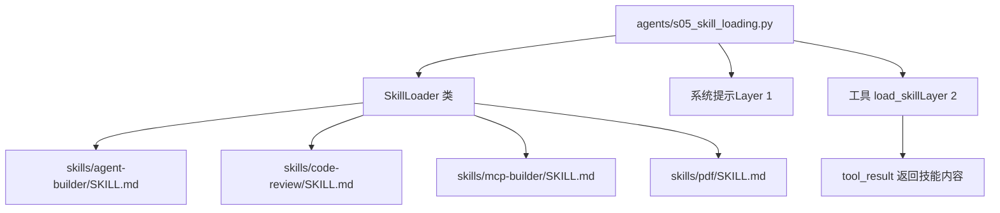
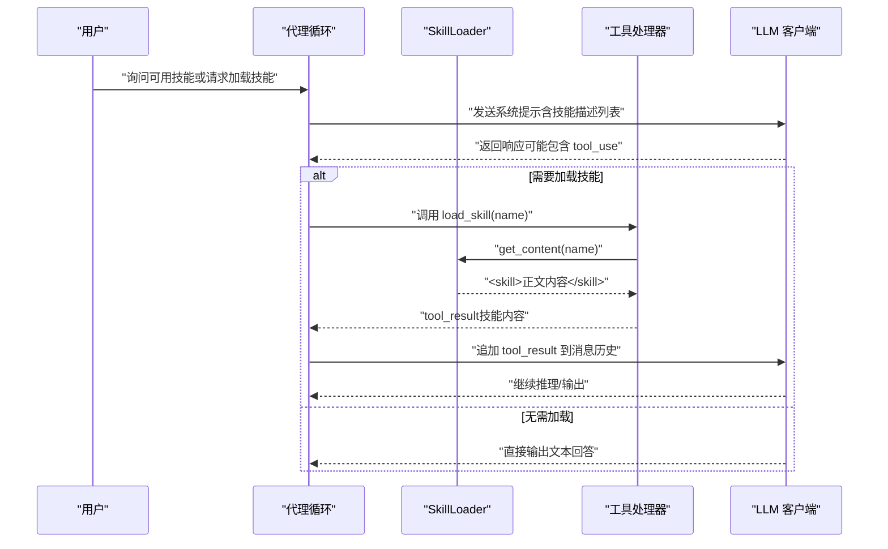
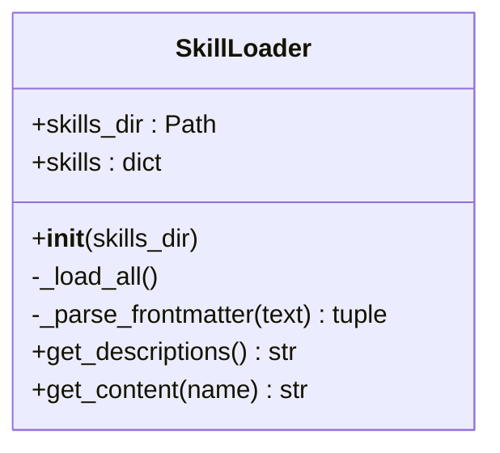
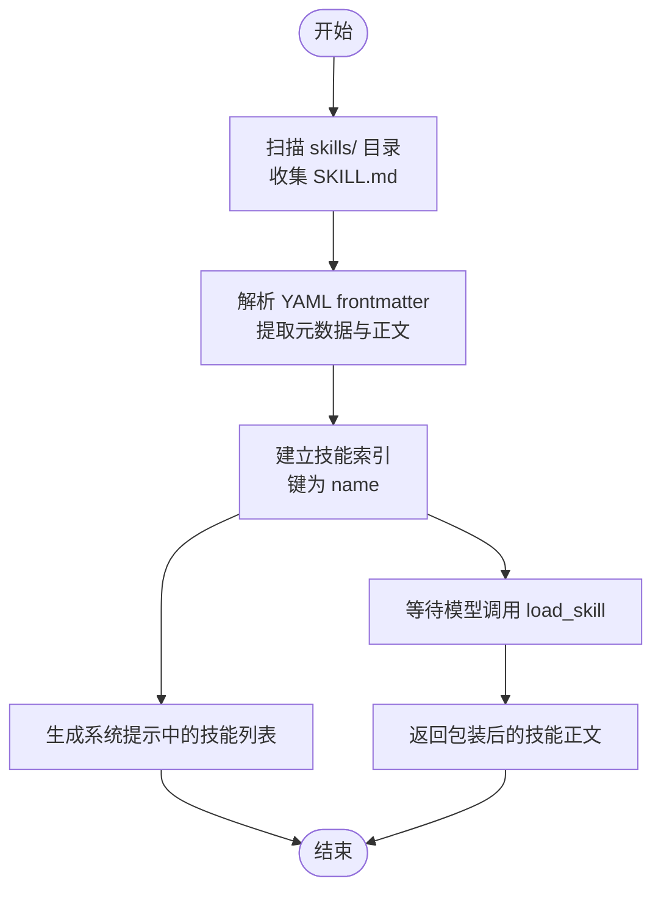
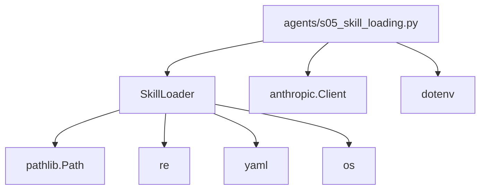

# 技能按需加载系统

<cite>
**本文引用的文件**
- [agents/s05_skill_loading.py](file://agents/s05_skill_loading.py)
- [skills/agent-builder/SKILL.md](file://skills/agent-builder/SKILL.md)
- [skills/code-review/SKILL.md](file://skills/code-review/SKILL.md)
- [skills/mcp-builder/SKILL.md](file://skills/mcp-builder/SKILL.md)
- [skills/pdf/SKILL.md](file://skills/pdf/SKILL.md)
- [docs/zh/s05-skill-loading.md](file://docs/zh/s05-skill-loading.md)
- [skills/agent-builder/references/agent-philosophy.md](file://skills/agent-builder/references/agent-philosophy.md)
- [skills/agent-builder/scripts/init_agent.py](file://skills/agent-builder/scripts/init_agent.py)
- [README.md](file://README.md)
</cite>

## 目录
1. [简介](#简介)
2. [项目结构](#项目结构)
3. [核心组件](#核心组件)
4. [架构总览](#架构总览)
5. [详细组件分析](#详细组件分析)
6. [依赖分析](#依赖分析)
7. [性能考量](#性能考量)
8. [故障排查指南](#故障排查指南)
9. [结论](#结论)
10. [附录：技能开发指南与最佳实践](#附录技能开发指南与最佳实践)

## 简介
本文件系统性阐述“技能按需加载系统”的设计与实现，重点覆盖：
- 技能文件的 YAML 元数据格式（frontmatter 结构、技能标识符与依赖声明）
- 两层注入策略的设计原理（技能元数据注入与技能内容注入）
- 技能文件系统的组织结构与命名规范
- 技能加载器的工作流程（缓存机制与版本管理建议）
- 完整的技能开发指南（模板、元数据编写、内容格式要求）
- 实际技能示例与开发最佳实践

该系统以“先元数据、后内容”的两层注入策略，避免将大量领域知识一次性塞入系统提示，从而在保持上下文可控的同时，按需注入高质量的技能内容。

## 项目结构
技能系统位于仓库根目录的 skills/ 目录下，每个技能是一个独立子目录，包含一个 SKILL.md 文件以及可选的资源文件（如 references、scripts）。agents/s05_skill_loading.py 负责扫描技能目录、解析 YAML frontmatter、生成系统提示中的技能描述列表，并在工具调用时返回技能的完整内容。

图表来源
- [agents/s05_skill_loading.py:58-107](file://agents/s05_skill_loading.py#L58-L107)
- [skills/agent-builder/SKILL.md:1-130](file://skills/agent-builder/SKILL.md#L1-L130)
- [skills/code-review/SKILL.md:1-158](file://skills/code-review/SKILL.md#L1-L158)
- [skills/mcp-builder/SKILL.md:1-214](file://skills/mcp-builder/SKILL.md#L1-L214)
- [skills/pdf/SKILL.md:1-113](file://skills/pdf/SKILL.md#L1-L113)

章节来源
- [agents/s05_skill_loading.py:11-36](file://agents/s05_skill_loading.py#L11-L36)
- [docs/zh/s05-skill-loading.md:36-87](file://docs/zh/s05-skill-loading.md#L36-L87)

## 核心组件
- SkillLoader：负责扫描 skills/ 下的所有 SKILL.md，解析 YAML frontmatter，构建技能索引；提供 get_descriptions（用于系统提示）与 get_content（用于工具返回）。
- 工具 load_skill：由 SkillLoader.get_content 提供实现，返回带包装的技能内容（tool_result）。
- 系统提示（Layer 1）：包含可用技能名称与简要描述，成本低、始终存在。
- 工具结果（Layer 2）：按需返回技能完整内容，成本较高但仅在需要时触发。

章节来源
- [agents/s05_skill_loading.py:58-107](file://agents/s05_skill_loading.py#L58-L107)
- [agents/s05_skill_loading.py:166-185](file://agents/s05_skill_loading.py#L166-L185)
- [agents/s05_skill_loading.py:109-114](file://agents/s05_skill_loading.py#L109-L114)

## 架构总览
两层注入策略的核心思想是：将“技能元数据”注入到系统提示中（Layer 1），将“技能正文内容”通过工具调用按需注入到 tool_result（Layer 2）。这样既保证了模型对可用能力的全局认知，又避免了在系统提示中塞入大量冗余内容。

图表来源
- [agents/s05_skill_loading.py:188-209](file://agents/s05_skill_loading.py#L188-L209)
- [agents/s05_skill_loading.py:166-185](file://agents/s05_skill_loading.py#L166-L185)
- [agents/s05_skill_loading.py:99-104](file://agents/s05_skill_loading.py#L99-L104)

## 详细组件分析

### SkillLoader 类
- 职责
  - 扫描 skills/ 目录下的所有 SKILL.md 文件
  - 解析 YAML frontmatter，提取元数据与正文
  - 以技能名称为键建立索引，支持按需检索
- 关键方法
  - _load_all：遍历并读取 SKILL.md，解析 frontmatter
  - _parse_frontmatter：使用正则与 YAML 解析器分离元数据与正文
  - get_descriptions：生成系统提示中的技能列表
  - get_content：返回带包装的技能正文（tool_result）

图表来源
- [agents/s05_skill_loading.py:58-107](file://agents/s05_skill_loading.py#L58-L107)

章节来源
- [agents/s05_skill_loading.py:65-83](file://agents/s05_skill_loading.py#L65-L83)
- [agents/s05_skill_loading.py:85-97](file://agents/s05_skill_loading.py#L85-L97)
- [agents/s05_skill_loading.py:99-104](file://agents/s05_skill_loading.py#L99-L104)

### YAML 元数据格式与 frontmatter 结构
- 基本结构
  - 使用 YAML frontmatter（三短横线分隔），包含 name、description 等字段
  - 后续为技能正文（Markdown）
- 字段约定
  - name：技能唯一标识符（若未提供，默认使用父目录名）
  - description：技能简述，用于系统提示（Layer 1）
  - tags（示例中出现）：可选标签，便于分类与检索
- 解析逻辑
  - 正则匹配 frontmatter 区域
  - 使用安全 YAML 解析，异常时回退为空元数据
  - 提取正文并去除首尾空白

章节来源
- [agents/s05_skill_loading.py:74-83](file://agents/s05_skill_loading.py#L74-L83)
- [skills/agent-builder/SKILL.md:1-11](file://skills/agent-builder/SKILL.md#L1-L11)
- [skills/code-review/SKILL.md:1-4](file://skills/code-review/SKILL.md#L1-L4)
- [skills/mcp-builder/SKILL.md:1-4](file://skills/mcp-builder/SKILL.md#L1-L4)
- [skills/pdf/SKILL.md:1-4](file://skills/pdf/SKILL.md#L1-L4)

### 两层注入策略
- Layer 1（系统提示，低成本）
  - 仅包含技能名称与简要描述，用于让模型了解可用能力
  - 生成逻辑：遍历技能索引，拼接“- name: description [tags]”
- Layer 2（工具结果，按需加载）
  - 当模型调用 load_skill(name) 时，返回包装后的技能正文
  - 包装格式：<skill name="...">正文</skill>，便于后续解析与注入

图表来源
- [agents/s05_skill_loading.py:65-73](file://agents/s05_skill_loading.py#L65-L73)
- [agents/s05_skill_loading.py:85-97](file://agents/s05_skill_loading.py#L85-L97)
- [agents/s05_skill_loading.py:99-104](file://agents/s05_skill_loading.py#L99-L104)

章节来源
- [agents/s05_skill_loading.py:109-114](file://agents/s05_skill_loading.py#L109-L114)
- [agents/s05_skill_loading.py:166-185](file://agents/s05_skill_loading.py#L166-L185)

### 技能文件系统组织与命名规范
- 目录结构
  - skills/<技能名>/SKILL.md：技能主文件
  - 可选 resources：references、scripts 等辅助资源
- 命名规范
  - 技能名即目录名，作为默认标识符
  - 若 frontmatter 提供 name，则优先使用该值
- 层次关系
  - 每个技能独立目录，彼此隔离
  - 支持多级嵌套（当前示例为一级目录）

章节来源
- [agents/s05_skill_loading.py:68-72](file://agents/s05_skill_loading.py#L68-L72)
- [skills/agent-builder/SKILL.md:1-130](file://skills/agent-builder/SKILL.md#L1-L130)

### 技能加载器工作流程
- 初始化
  - 构造 SkillLoader 并扫描 skills/ 目录
  - 逐个解析 SKILL.md，建立内存索引
- 系统提示阶段
  - 调用 get_descriptions 生成技能列表
- 工具调用阶段
  - load_skill(name) 触发 get_content(name)
  - 返回包装后的技能正文
- 错误处理
  - 未知技能：返回错误信息与可用技能列表
  - YAML 解析失败：回退为空元数据，正文为原始文本

章节来源
- [agents/s05_skill_loading.py:65-73](file://agents/s05_skill_loading.py#L65-L73)
- [agents/s05_skill_loading.py:85-104](file://agents/s05_skill_loading.py#L85-L104)

### 缓存机制与版本管理建议
- 当前实现
  - 内存缓存：SkillLoader 在进程内维护技能索引
  - 无持久化缓存与版本号字段
- 版本管理建议
  - 在 SKILL.md frontmatter 中增加 version 字段
  - 引入文件哈希或时间戳，用于检测变更
  - 提供 reload 接口或热更新策略
  - 支持多版本并存与选择性加载

章节来源
- [agents/s05_skill_loading.py:65-73](file://agents/s05_skill_loading.py#L65-L73)

## 依赖分析
- SkillLoader 依赖
  - pathlib.Path：路径操作
  - re：frontmatter 正则匹配
  - yaml：YAML 解析
  - os：环境变量与路径安全检查
- 工具依赖
  - anthropic：LLM 客户端
  - dotenv：环境变量加载
- 技能依赖
  - 各技能目录内的 SKILL.md 与资源文件

图表来源
- [agents/s05_skill_loading.py:38-55](file://agents/s05_skill_loading.py#L38-L55)
- [agents/s05_skill_loading.py:58-107](file://agents/s05_skill_loading.py#L58-L107)

章节来源
- [agents/s05_skill_loading.py:38-55](file://agents/s05_skill_loading.py#L38-L55)

## 性能考量
- Layer 1 成本低：技能描述列表通常每条约 100 token 左右，适合常驻系统提示
- Layer 2 成本高：技能正文通常数千 token，仅在需要时加载
- I/O 优化
  - 仅在初始化时扫描与读取 SKILL.md
  - 正文内容按需返回，避免重复序列化
- 安全与稳定性
  - frontmatter 解析失败时回退，避免中断
  - 工具调用返回错误信息而非抛出异常，便于模型继续推理

[本节为通用指导，不直接分析具体文件]

## 故障排查指南
- 问题：系统提示中没有显示技能
  - 检查 skills/ 目录是否存在且包含 SKILL.md
  - 确认 frontmatter 是否正确（三短横线包裹）
- 问题：调用 load_skill 返回未知技能
  - 确认 frontmatter 中的 name 与调用参数一致
  - 若未提供 name，确认目录名是否符合预期
- 问题：YAML 解析报错
  - 检查 frontmatter 语法，确保缩进与字符集正确
  - 确保 YAML 语法合法（如布尔值、数值等）
- 问题：工具返回错误信息
  - 检查工具处理器的输入参数与权限设置
  - 确认路径安全检查未阻断合法操作

章节来源
- [agents/s05_skill_loading.py:74-83](file://agents/s05_skill_loading.py#L74-L83)
- [agents/s05_skill_loading.py:99-104](file://agents/s05_skill_loading.py#L99-L104)

## 结论
技能按需加载系统通过两层注入策略，在控制上下文成本的同时，提供了强大的领域知识扩展能力。SkillLoader 以最小代价扫描与解析 SKILL.md，系统提示提供全局视图，工具调用按需注入高质量内容。结合本文提供的开发指南与最佳实践，开发者可以快速创建高质量、可复用的技能模块。

[本节为总结性内容，不直接分析具体文件]

## 附录：技能开发指南与最佳实践

### 技能模板与元数据编写
- 基本模板
  - frontmatter 必须包含 name 与 description
  - 可选 tags 用于分类
- 示例参考
  - agent-builder：包含哲学性内容与实现参考
  - code-review：结构化检查清单与输出格式
  - mcp-builder：协议集成与模板代码
  - pdf：实用工具与最佳实践

章节来源
- [skills/agent-builder/SKILL.md:1-130](file://skills/agent-builder/SKILL.md#L1-L130)
- [skills/code-review/SKILL.md:1-158](file://skills/code-review/SKILL.md#L1-L158)
- [skills/mcp-builder/SKILL.md:1-214](file://skills/mcp-builder/SKILL.md#L1-L214)
- [skills/pdf/SKILL.md:1-113](file://skills/pdf/SKILL.md#L1-L113)

### 内容格式要求
- 使用 Markdown 格式，清晰分节与列表
- 提供可执行命令与代码片段（必要时）
- 明确输出格式与检查清单，便于模型遵循
- 适当引用资源文件（如 references、scripts）

章节来源
- [skills/agent-builder/SKILL.md:106-130](file://skills/agent-builder/SKILL.md#L106-L130)
- [skills/code-review/SKILL.md:65-88](file://skills/code-review/SKILL.md#L65-L88)
- [skills/mcp-builder/SKILL.md:139-214](file://skills/mcp-builder/SKILL.md#L139-L214)
- [skills/pdf/SKILL.md:10-113](file://skills/pdf/SKILL.md#L10-L113)

### 开发最佳实践
- 元数据优先：确保 name 与 description 准确表达技能用途
- 分层设计：将复杂流程拆分为步骤清单，便于模型逐步执行
- 资源组织：将参考文件与脚本放入 references 与 scripts 目录，便于引用
- 安全与可审计：在工具调用中加入安全检查与日志记录
- 可测试性：为关键流程提供命令示例，便于验证与回归

章节来源
- [skills/agent-builder/references/agent-philosophy.md:1-155](file://skills/agent-builder/references/agent-philosophy.md#L1-L155)
- [skills/agent-builder/scripts/init_agent.py:1-280](file://skills/agent-builder/scripts/init_agent.py#L1-L280)
- [README.md:42-84](file://README.md#L42-L84)

### 实际技能示例
- agent-builder：面向代理构建的综合指南，包含哲学、原则与资源
- code-review：结构化代码审查流程与输出模板
- mcp-builder：MCP 协议服务器构建指南与模板
- pdf：PDF 读取、创建、合并与拆分的实用流程

章节来源
- [skills/agent-builder/SKILL.md:1-130](file://skills/agent-builder/SKILL.md#L1-L130)
- [skills/code-review/SKILL.md:1-158](file://skills/code-review/SKILL.md#L1-L158)
- [skills/mcp-builder/SKILL.md:1-214](file://skills/mcp-builder/SKILL.md#L1-L214)
- [skills/pdf/SKILL.md:1-113](file://skills/pdf/SKILL.md#L1-L113)