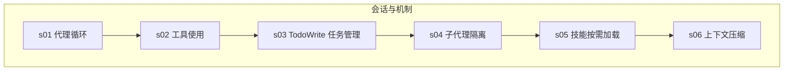
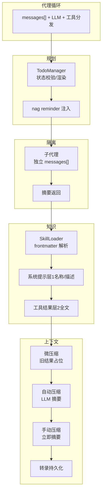
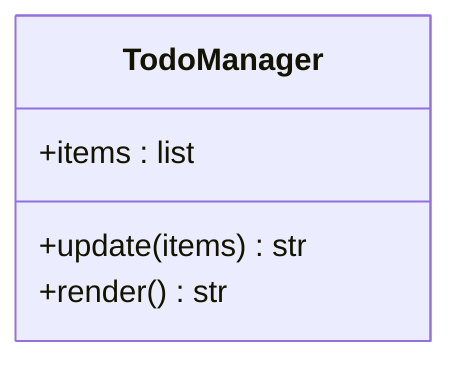
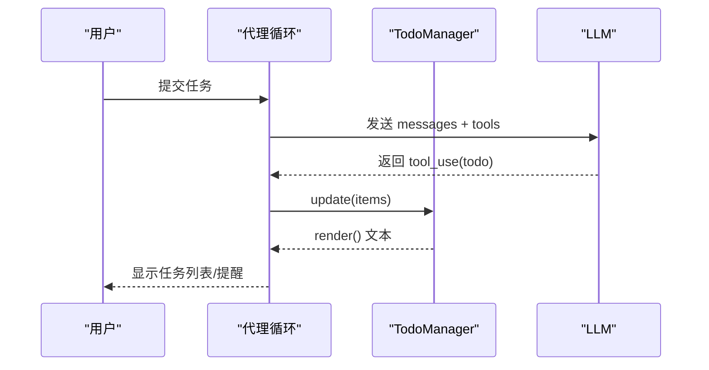
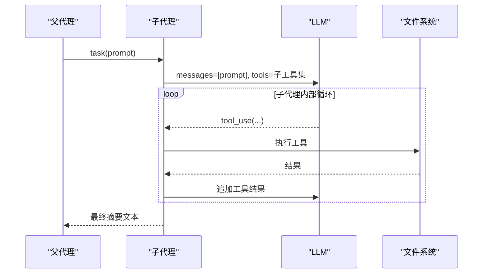
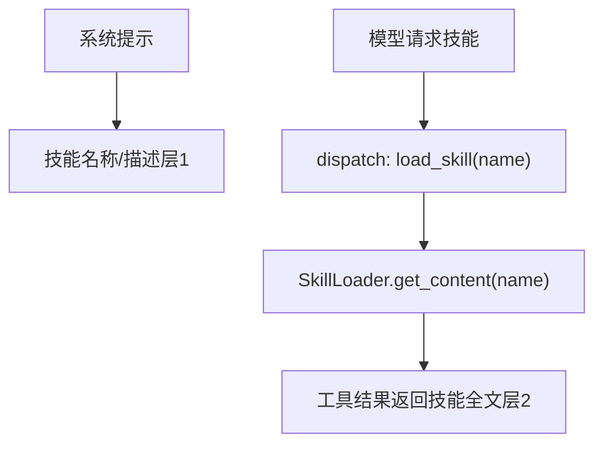
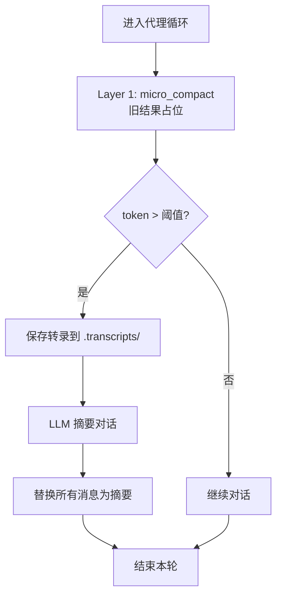

# 规划与知识管理

<cite>
**本文引用的文件**
- [s03_todo_write.py](file://agents/s03_todo_write.py)
- [s04_subagent.py](file://agents/s04_subagent.py)
- [s05_skill_loading.py](file://agents/s05_skill_loading.py)
- [s06_context_compact.py](file://agents/s06_context_compact.py)
- [README.md](file://README.md)
- [s03-todo-write.md](file://docs/zh/s03-todo-write.md)
- [s04-subagent.md](file://docs/zh/s04-subagent.md)
- [s05-skill-loading.md](file://docs/zh/s05-skill-loading.md)
- [s06-context-compact.md](file://docs/zh/s06-context-compact.md)
- [pdf/SKILL.md](file://skills/pdf/SKILL.md)
- [agent-builder/SKILL.md](file://skills/agent-builder/SKILL.md)
- [code-review/SKILL.md](file://skills/code-review/SKILL.md)
- [mcp-builder/SKILL.md](file://skills/mcp-builder/SKILL.md)
</cite>

## 目录
1. [引言](#引言)
2. [项目结构](#项目结构)
3. [核心组件](#核心组件)
4. [架构总览](#架构总览)
5. [详细组件分析](#详细组件分析)
6. [依赖分析](#依赖分析)
7. [性能考量](#性能考量)
8. [故障排查指南](#故障排查指南)
9. [结论](#结论)
10. [附录](#附录)

## 引言
本文件围绕“规划与知识管理”主题，系统梳理并讲解以下四个关键机制：
- s03 TodoWrite 任务管理系统：通过列表化思维提升执行效率与一致性
- s04 子代理隔离机制：为子任务创建独立上下文，避免主对话污染
- s05 技能按需加载系统：YAML 元数据 + 两层注入策略 + 技能文件组织
- s06 上下文压缩机制：三层压缩策略设计与实现细节

这些机制共同构成一个可扩展、可维护、可持续运行的代理 harness，既保证模型的自主决策能力，又通过工具、知识与上下文管理确保长期稳定表现。

## 项目结构
仓库采用“会话式教学”的组织方式，每个 session（从 s01 到 s12）对应一个 harness 机制，逐步叠加形成完整的代理体系。本次文档聚焦 s03–s06 的核心机制与它们之间的协同关系。

图表来源
- [README.md: 256-285:256-285](file://README.md#L256-L285)

章节来源
- [README.md: 256-285:256-285](file://README.md#L256-L285)

## 核心组件
- TodoWrite（s03）：以 TodoManager 管理任务状态，配合“nag reminder”强制更新，防止任务漂移
- 子代理（s04）：父代理派生子代理，子代理拥有独立 messages，仅返回摘要
- 技能加载（s05）：SkillLoader 扫描 skills/*/SKILL.md，系统提示层1（名称+描述），工具结果层2（全文）
- 上下文压缩（s06）：三层压缩（micro/auto/manual），控制 token 使用，支持转录持久化

章节来源
- [s03_todo_write.py: 52-86:52-86](file://agents/s03_todo_write.py#L52-L86)
- [s04_subagent.py: 118-136:118-136](file://agents/s04_subagent.py#L118-L136)
- [s05_skill_loading.py: 59-104:59-104](file://agents/s05_skill_loading.py#L59-L104)
- [s06_context_compact.py: 69-127:69-127](file://agents/s06_context_compact.py#L69-L127)

## 架构总览
四个机制在代理循环之上叠加，形成“规划—隔离—知识—压缩”的闭环，使代理在复杂任务中保持清晰的思路与可控的上下文。

图表来源
- [s03_todo_write.py: 52-86:52-86](file://agents/s03_todo_write.py#L52-L86)
- [s04_subagent.py: 118-136:118-136](file://agents/s04_subagent.py#L118-L136)
- [s05_skill_loading.py: 59-104:59-104](file://agents/s05_skill_loading.py#L59-L104)
- [s06_context_compact.py: 69-127:69-127](file://agents/s06_context_compact.py#L69-L127)

## 详细组件分析

### s03 TodoWrite 任务管理系统
- 设计目标：通过列表化思维提升执行效率，避免任务漂移
- 关键点
  - TodoManager：校验任务条目（id/text/status），限制同一时刻仅一个 in_progress
  - 渲染：统一标记符号与完成统计
  - nag reminder：当连续若干轮未调用 todo 时，在工具结果中注入提醒
  - 工具注册：todo 工具加入 dispatch map，参与循环执行

图表来源
- [s03_todo_write.py: 52-86:52-86](file://agents/s03_todo_write.py#L52-L86)

图表来源
- [s03_todo_write.py: 164-192:164-192](file://agents/s03_todo_write.py#L164-L192)

章节来源
- [s03_todo_write.py: 52-86:52-86](file://agents/s03_todo_write.py#L52-L86)
- [s03_todo_write.py: 164-192:164-192](file://agents/s03_todo_write.py#L164-L192)
- [s03-todo-write.md: 35-76:35-76](file://docs/zh/s03-todo-write.md#L35-L76)

### s04 子代理隔离机制
- 设计目标：为子任务创建独立上下文，避免噪声污染主对话
- 关键点
  - 父代理提供 task 工具；子代理拥有除 task 外的基础工具集
  - 子代理以 fresh messages=[] 启动，最多安全轮次内持续工具调用
  - 仅返回最终文本摘要，丢弃完整历史

图表来源
- [s04_subagent.py: 118-136:118-136](file://agents/s04_subagent.py#L118-L136)

章节来源
- [s04_subagent.py: 118-136:118-136](file://agents/s04_subagent.py#L118-L136)
- [s04-subagent.md: 29-74:29-74](file://docs/zh/s04-subagent.md#L29-L74)

### s05 技能按需加载系统
- 设计目标：避免将大量知识塞入系统提示，按需注入，降低 token 成本
- 关键点
  - YAML frontmatter：name/description/tags 等元数据
  - 两层注入策略
    - 层1（系统提示）：技能名称与简述（低成本）
    - 层2（工具结果）：技能全文（按需加载）
  - 技能文件组织：skills/<name>/SKILL.md

图表来源
- [s05_skill_loading.py: 59-104:59-104](file://agents/s05_skill_loading.py#L59-L104)

章节来源
- [s05_skill_loading.py: 59-104:59-104](file://agents/s05_skill_loading.py#L59-L104)
- [s05-skill-loading.md: 36-87:36-87](file://docs/zh/s05-skill-loading.md#L36-L87)
- [pdf/SKILL.md: 1-113:1-113](file://skills/pdf/SKILL.md#L1-L113)
- [agent-builder/SKILL.md: 1-130:1-130](file://skills/agent-builder/SKILL.md#L1-L130)
- [code-review/SKILL.md: 1-158:1-158](file://skills/code-review/SKILL.md#L1-L158)
- [mcp-builder/SKILL.md: 1-214:1-214](file://skills/mcp-builder/SKILL.md#L1-L214)

### s06 上下文压缩机制
- 设计目标：在无限会话中保持上下文可控，避免 token 超限
- 关键点
  - 三层压缩策略
    - Layer 1（micro_compact）：每轮静默替换旧工具结果为占位符
    - Layer 2（auto_compact）：token 超阈值时保存转录并让 LLM 摘要
    - Layer 3（compact 工具）：手动触发相同摘要流程
  - 转录持久化：.transcripts/ 目录保存完整对话，便于恢复

图表来源
- [s06_context_compact.py: 69-127:69-127](file://agents/s06_context_compact.py#L69-L127)

章节来源
- [s06_context_compact.py: 69-127:69-127](file://agents/s06_context_compact.py#L69-L127)
- [s06-context-compact.md: 45-103:45-103](file://docs/zh/s06-context-compact.md#L45-L103)

## 依赖分析
四个机制之间存在明确的协作关系：
- s03 TodoWrite 为后续的子任务分解与知识加载提供“进度锚点”
- s04 子代理隔离确保探索与子任务不会污染主上下文
- s05 技能加载在需要时提供领域知识，减少系统提示负担
- s06 上下文压缩贯穿始终，保障长期会话稳定性

图表来源
- [s03_todo_write.py: 164-192:164-192](file://agents/s03_todo_write.py#L164-L192)
- [s04_subagent.py: 146-168:146-168](file://agents/s04_subagent.py#L146-L168)
- [s05_skill_loading.py: 188-208:188-208](file://agents/s05_skill_loading.py#L188-L208)
- [s06_context_compact.py: 201-237:201-237](file://agents/s06_context_compact.py#L201-L237)

章节来源
- [s03_todo_write.py: 164-192:164-192](file://agents/s03_todo_write.py#L164-L192)
- [s04_subagent.py: 146-168:146-168](file://agents/s04_subagent.py#L146-L168)
- [s05_skill_loading.py: 188-208:188-208](file://agents/s05_skill_loading.py#L188-L208)
- [s06_context_compact.py: 201-237:201-237](file://agents/s06_context_compact.py#L201-L237)

## 性能考量
- TodoWrite
  - 通过状态约束与 nag reminder，减少无效分支与重复劳动
  - 渲染输出简洁，便于模型聚焦关键信息
- 子代理
  - 独立上下文避免历史累积，降低 token 使用
  - 仅返回摘要，减少主对话长度
- 技能加载
  - 层1（名称/描述）低成本，层2（全文）按需加载，平衡上下文与能力
- 上下文压缩
  - micro_compact 每轮静默清理，auto_compact 在阈值触发，manual_compact 提供即时控制
  - 转录持久化保留完整历史，兼顾可恢复性

章节来源
- [s03-todo-write.md: 76-76:76-76](file://docs/zh/s03-todo-write.md#L76-L76)
- [s04-subagent.md: 74-74:74-74](file://docs/zh/s04-subagent.md#L74-L74)
- [s05-skill-loading.md: 34-34:34-34](file://docs/zh/s05-skill-loading.md#L34-L34)
- [s06-context-compact.md: 103-103:103-103](file://docs/zh/s06-context-compact.md#L103-L103)

## 故障排查指南
- TodoWrite
  - 任务条目校验失败：检查 id/text/status 是否符合要求
  - in_progress 冲突：确保同一时刻仅一个任务处于进行中
  - nag reminder 未生效：确认连续未调用 todo 的轮次计数逻辑
- 子代理
  - 子代理未返回摘要：检查最终文本块是否存在
  - 递归子代理：确认子代理工具集中不含 task
- 技能加载
  - unknown skill：确认 SKILL.md 路径与 frontmatter name 是否正确
  - frontmatter 解析失败：检查 YAML 格式是否规范
- 上下文压缩
  - 自动压缩未触发：检查 token 估算与阈值设置
  - 占位符未替换：确认工具结果匹配与 tool_use_id 映射

章节来源
- [s03_todo_write.py: 56-75:56-75](file://agents/s03_todo_write.py#L56-L75)
- [s04_subagent.py: 118-136:118-136](file://agents/s04_subagent.py#L118-L136)
- [s05_skill_loading.py: 74-83:74-83](file://agents/s05_skill_loading.py#L74-L83)
- [s06_context_compact.py: 63-99:63-99](file://agents/s06_context_compact.py#L63-L99)

## 结论
s03–s06 机制共同构建了一个“可规划、可隔离、可扩展、可持续”的代理 harness：
- 列表化思维确保任务有序推进
- 子代理隔离保障上下文清洁
- 按需加载的知识体系降低 token 成本
- 三层压缩策略维持长期会话的稳定性

这些机制相互补充，既尊重模型的自主决策，又通过工具与上下文管理提升整体性能与可靠性。

## 附录
- 实际应用场景建议
  - 复杂重构：先 TodoWrite 列出步骤，再用子代理隔离探索，必要时按需加载技能，最后在长会话中启用压缩
  - 多模块开发：以子代理分别处理不同模块，主代理汇总摘要，避免上下文膨胀
  - 外部集成：通过技能加载提供领域最佳实践，结合压缩机制支撑长时间调试与迭代

章节来源
- [README.md: 168-186:168-186](file://README.md#L168-L186)
- [s03-todo-write.md: 87-99:87-99](file://docs/zh/s03-todo-write.md#L87-L99)
- [s04-subagent.md: 85-97:85-97](file://docs/zh/s04-subagent.md#L85-L97)
- [s05-skill-loading.md: 98-111:98-111](file://docs/zh/s05-skill-loading.md#L98-L111)
- [s06-context-compact.md: 115-127:115-127](file://docs/zh/s06-context-compact.md#L115-L127)