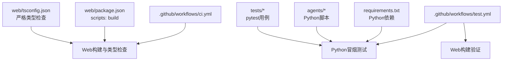
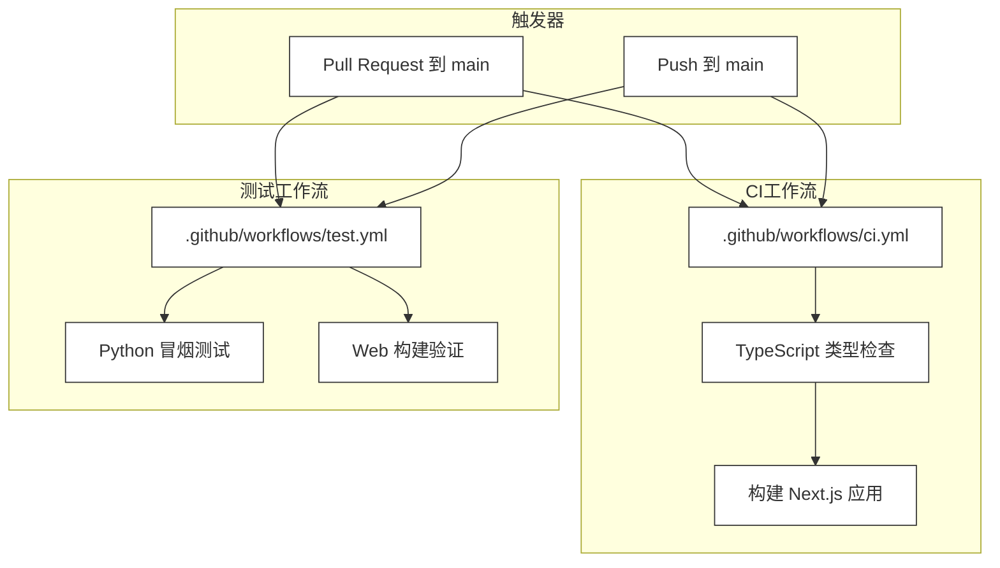
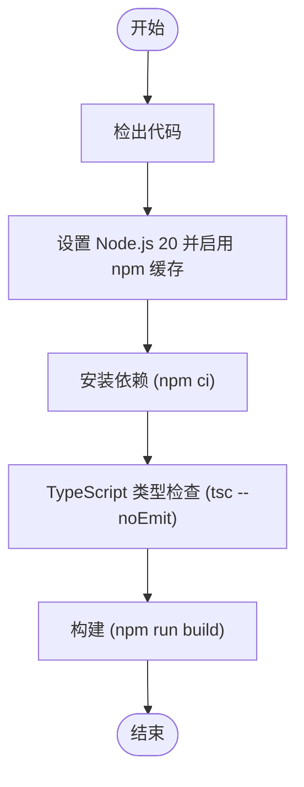
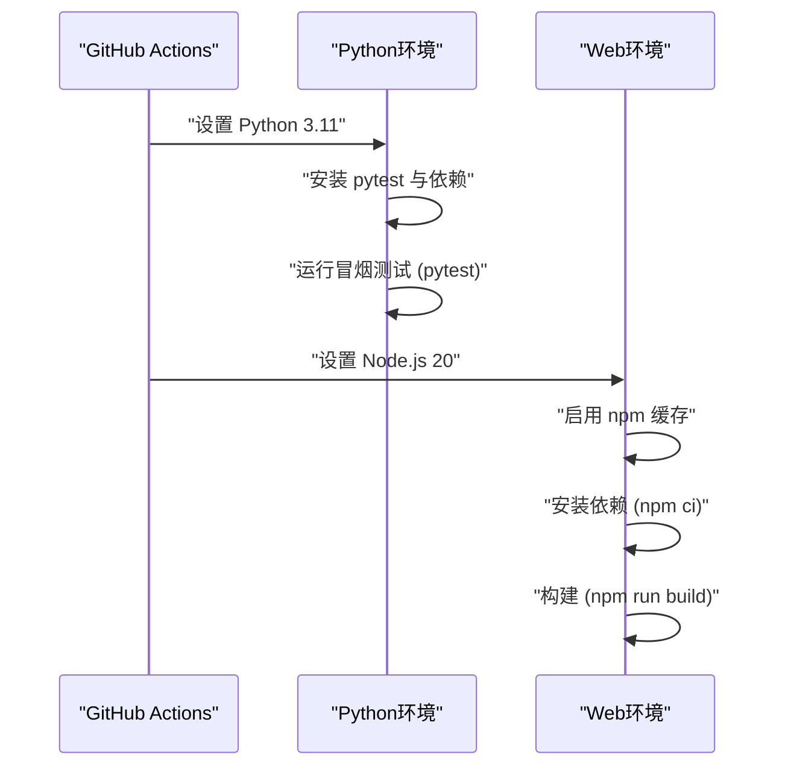
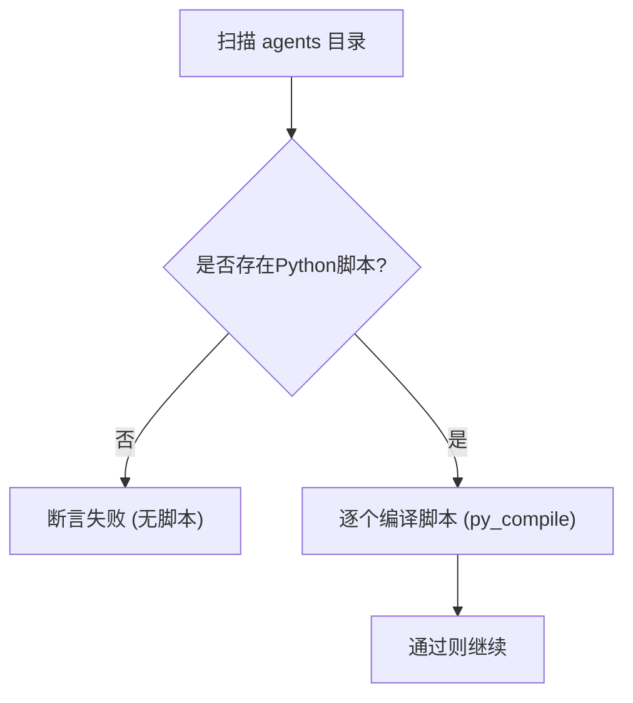
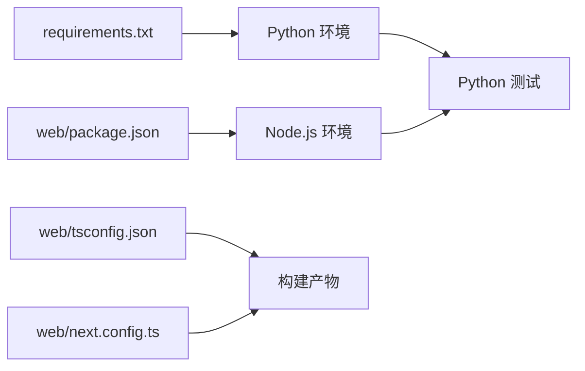

# CI/CD流水线

<cite>
**本文档引用的文件**
- [.github/workflows/ci.yml](file://.github/workflows/ci.yml)
- [.github/workflows/test.yml](file://.github/workflows/test.yml)
- [requirements.txt](file://requirements.txt)
- [README.md](file://README.md)
- [web/package.json](file://web/package.json)
- [web/tsconfig.json](file://web/tsconfig.json)
- [web/next.config.ts](file://web/next.config.ts)
- [tests/test_agents_smoke.py](file://tests/test_agents_smoke.py)
- [tests/test_s_full_background.py](file://tests/test_s_full_background.py)
- [agents/__init__.py](file://agents/__init__.py)
- [agents/s01_agent_loop.py](file://agents/s01_agent_loop.py)
- [agents/s_full.py](file://agents/s_full.py)
</cite>

## 目录
1. [简介](#简介)
2. [项目结构](#项目结构)
3. [核心组件](#核心组件)
4. [架构总览](#架构总览)
5. [详细组件分析](#详细组件分析)
6. [依赖关系分析](#依赖关系分析)
7. [性能考虑](#性能考虑)
8. [故障排除指南](#故障排除指南)
9. [结论](#结论)
10. [附录](#附录)

## 简介
本指南面向持续集成与持续部署（CI/CD）流程的落地实践，围绕该仓库中的GitHub Actions工作流进行系统性梳理，涵盖以下主题：
- GitHub Actions工作流配置：ci.yml与test.yml的工作流程定义、触发条件、执行步骤
- 自动化测试流程：单元测试、集成测试、端到端测试的执行策略与覆盖范围
- 代码质量检查：TypeScript类型检查、代码格式化、安全扫描等建议
- 构建与部署流程：构建缓存、依赖安装、产物生成与发布
- 分支保护策略与合并要求：确保代码质量与安全性
- 监控与调试：日志分析、失败重试、通知配置等

本指南以实际源码为依据，避免臆测，帮助读者快速理解并优化现有流水线。

## 项目结构
该项目采用多语言混合架构：
- Python后端与示例脚本位于根目录的agents与tests中
- Web前端基于Next.js，位于web目录，包含TypeScript配置与构建脚本
- GitHub Actions工作流位于.github/workflows目录，分别负责CI与测试

图表来源
- [.github/workflows/ci.yml:1-33](file://.github/workflows/ci.yml#L1-L33)
- [.github/workflows/test.yml:1-46](file://.github/workflows/test.yml#L1-L46)
- [web/package.json:1-39](file://web/package.json#L1-L39)
- [web/tsconfig.json:1-35](file://web/tsconfig.json#L1-L35)
- [requirements.txt:1-3](file://requirements.txt#L1-L3)

章节来源
- [.github/workflows/ci.yml:1-33](file://.github/workflows/ci.yml#L1-L33)
- [.github/workflows/test.yml:1-46](file://.github/workflows/test.yml#L1-L46)
- [web/package.json:1-39](file://web/package.json#L1-L39)
- [web/tsconfig.json:1-35](file://web/tsconfig.json#L1-L35)
- [requirements.txt:1-3](file://requirements.txt#L1-L3)

## 核心组件
- CI工作流（ci.yml）
  - 触发条件：推送到main分支或针对main分支发起PR时触发
  - 执行步骤：检出代码、设置Node.js 20、启用npm缓存、安装依赖、TypeScript类型检查、构建
  - 工作目录：web目录
- 测试工作流（test.yml）
  - 触发条件：同上
  - 执行步骤：
    - Python冒烟测试：设置Python 3.11、安装pytest与相关依赖、运行agents冒烟测试
    - Web构建验证：设置Node.js 20、启用npm缓存、安装依赖、构建
  - 工作目录：Python任务在仓库根目录，Web任务在web目录

章节来源
- [.github/workflows/ci.yml:1-33](file://.github/workflows/ci.yml#L1-L33)
- [.github/workflows/test.yml:1-46](file://.github/workflows/test.yml#L1-L46)

## 架构总览
下图展示了CI/CD流水线在仓库中的整体交互关系：

图表来源
- [.github/workflows/ci.yml:1-33](file://.github/workflows/ci.yml#L1-L33)
- [.github/workflows/test.yml:1-46](file://.github/workflows/test.yml#L1-L46)

## 详细组件分析

### CI工作流（ci.yml）
- 触发条件
  - 推送至main分支
  - 针对main分支发起PR
- 关键步骤
  - 检出代码
  - 设置Node.js 20，并启用npm缓存（缓存路径指向web/package-lock.json）
  - 安装依赖（使用npm ci确保锁定版本一致性）
  - TypeScript类型检查（通过tsc --noEmit实现）
  - 构建（调用npm run build）

图表来源
- [.github/workflows/ci.yml:16-32](file://.github/workflows/ci.yml#L16-L32)
- [web/package.json:5-11](file://web/package.json#L5-L11)
- [web/tsconfig.json:7-8](file://web/tsconfig.json#L7-L8)

章节来源
- [.github/workflows/ci.yml:1-33](file://.github/workflows/ci.yml#L1-L33)
- [web/package.json:1-39](file://web/package.json#L1-L39)
- [web/tsconfig.json:1-35](file://web/tsconfig.json#L1-L35)

### 测试工作流（test.yml）
- 触发条件：与CI相同
- Python冒烟测试
  - 设置Python 3.11
  - 安装pytest与相关依赖
  - 运行agents冒烟测试（确保Python脚本可编译且存在）
- Web构建验证
  - 设置Node.js 20，启用npm缓存
  - 安装依赖
  - 构建（验证前端构建链路）

图表来源
- [.github/workflows/test.yml:10-24](file://.github/workflows/test.yml#L10-L24)
- [.github/workflows/test.yml:26-45](file://.github/workflows/test.yml#L26-L45)
- [requirements.txt:1-3](file://requirements.txt#L1-3)

章节来源
- [.github/workflows/test.yml:1-46](file://.github/workflows/test.yml#L1-L46)
- [requirements.txt:1-3](file://requirements.txt#L1-L3)

### 测试用例与覆盖范围
- Python冒烟测试
  - 覆盖agents目录下的所有Python脚本，确保可编译且至少存在一个脚本
  - 使用pytest运行单文件测试，输出简洁模式
- 单元测试示例
  - s_full背景管理器测试：模拟外部模块、临时工作目录，验证后台任务状态检查逻辑

图表来源
- [tests/test_agents_smoke.py:9-23](file://tests/test_agents_smoke.py#L9-L23)

章节来源
- [tests/test_agents_smoke.py:1-24](file://tests/test_agents_smoke.py#L1-L24)
- [tests/test_s_full_background.py:14-67](file://tests/test_s_full_background.py#L14-L67)
- [agents/__init__.py:1-4](file://agents/__init__.py#L1-L4)

### 代码质量检查
- TypeScript类型检查
  - 在ci.yml中通过tsc --noEmit执行类型检查，确保严格模式开启
  - tsconfig.json启用严格模式、禁止输出JS、隔离模块等
- 代码格式化与安全扫描
  - 当前工作流未包含代码格式化与安全扫描步骤；建议在CI中增加eslint与安全扫描（如npm audit）以提升质量门禁

章节来源
- [.github/workflows/ci.yml:28-29](file://.github/workflows/ci.yml#L28-L29)
- [web/tsconfig.json:7-15](file://web/tsconfig.json#L7-L15)

### 构建与部署流程
- 构建缓存
  - 使用actions/setup-node的cache选项与缓存路径（web/package-lock.json），减少重复安装时间
- 依赖安装
  - 使用npm ci确保锁定版本一致
- 产物生成
  - Next.js构建产物由npm run build生成，next.config.ts配置静态导出与图片优化
- 部署
  - 当前工作流未包含部署步骤；可在构建成功后将产物上传为Artifacts或集成部署到目标平台

章节来源
- [.github/workflows/ci.yml:19-26](file://.github/workflows/ci.yml#L19-L26)
- [web/package.json:9-11](file://web/package.json#L9-L11)
- [web/next.config.ts:1-10](file://web/next.config.ts#L1-L10)

### 分支保护策略与合并要求
- 建议在仓库设置中启用以下保护规则：
  - 要求状态检查通过（CI与测试工作流）
  - 要求审查者批准
  - 禁止直接推送（仅允许快进合并）
  - 要求PR标题与描述符合规范
- 合并前强制执行：
  - 类型检查通过
  - Python冒烟测试通过
  - Web构建成功

章节来源
- [.github/workflows/ci.yml:3-7](file://.github/workflows/ci.yml#L3-L7)
- [.github/workflows/test.yml:3-7](file://.github/workflows/test.yml#L3-L7)

### 监控与调试
- 日志分析
  - 查看Actions日志中的具体步骤输出，定位类型检查与构建失败原因
- 失败重试
  - 对不稳定网络或第三方服务错误可考虑在步骤中添加重试逻辑（例如npm ci失败时重试）
- 通知配置
  - 可在工作流中集成通知（如邮件、Slack、Microsoft Teams），在失败时发送告警

章节来源
- [.github/workflows/ci.yml:16-32](file://.github/workflows/ci.yml#L16-L32)
- [.github/workflows/test.yml:12-45](file://.github/workflows/test.yml#L12-L45)

## 依赖关系分析
- Python侧
  - requirements.txt声明anthropic、python-dotenv、pyyaml等依赖
  - 测试依赖pytest与py_compile用于冒烟测试
- Node.js侧
  - web/package.json定义开发与运行时依赖，以及构建脚本
  - tsconfig.json与next.config.ts共同决定TypeScript编译与Next.js构建行为

图表来源
- [requirements.txt:1-3](file://requirements.txt#L1-L3)
- [web/package.json:13-37](file://web/package.json#L13-L37)
- [web/tsconfig.json:2-24](file://web/tsconfig.json#L2-L24)
- [web/next.config.ts:3-7](file://web/next.config.ts#L3-L7)

章节来源
- [requirements.txt:1-3](file://requirements.txt#L1-L3)
- [web/package.json:1-39](file://web/package.json#L1-L39)
- [web/tsconfig.json:1-35](file://web/tsconfig.json#L1-L35)
- [web/next.config.ts:1-10](file://web/next.config.ts#L1-L10)

## 性能考虑
- 缓存策略
  - 使用npm缓存显著降低依赖安装时间
  - 建议同时缓存Node.js版本信息与构建产物
- 依赖安装
  - 使用npm ci确保锁定版本，避免版本漂移导致的重复下载
- 并行化
  - 将Python测试与Web构建作为独立作业并行执行，缩短总耗时
- 产物复用
  - 构建成功后可将产物上传为Artifacts，供后续部署作业复用

章节来源
- [.github/workflows/ci.yml:19-26](file://.github/workflows/ci.yml#L19-L26)
- [.github/workflows/test.yml:26-45](file://.github/workflows/test.yml#L26-L45)

## 故障排除指南
- 类型检查失败
  - 检查tsconfig.json严格模式配置与文件扩展名
  - 确认所有TypeScript文件均通过tsc --noEmit
- 构建失败
  - 检查web/package.json中的构建脚本是否正确
  - 确认next.config.ts配置与静态导出需求匹配
- Python测试失败
  - 确保agents目录存在可运行脚本
  - 检查pytest命令与输出模式
- 缓存问题
  - 清理缓存后重试，或调整缓存路径与Key

章节来源
- [.github/workflows/ci.yml:28-32](file://.github/workflows/ci.yml#L28-L32)
- [web/tsconfig.json:7-8](file://web/tsconfig.json#L7-L8)
- [web/package.json:9-11](file://web/package.json#L9-L11)
- [tests/test_agents_smoke.py:17-23](file://tests/test_agents_smoke.py#L17-L23)

## 结论
本仓库的CI/CD流水线已覆盖核心的类型检查与构建流程，并通过测试工作流保障Python脚本的可用性。为进一步提升质量与效率，建议补充：
- 代码格式化与安全扫描
- 部署作业与产物发布
- 更细粒度的日志与通知机制
- 分支保护与合并策略的规范化

这些改进将使流水线更稳健、可追溯、可维护。

## 附录
- 相关文件索引
  - GitHub Actions工作流：ci.yml、test.yml
  - Web前端配置：package.json、tsconfig.json、next.config.ts
  - Python依赖：requirements.txt
  - 测试用例：test_agents_smoke.py、test_s_full_background.py
  - 示例脚本：agents/s01_agent_loop.py、agents/s_full.py

章节来源
- [README.md:296-297](file://README.md#L296-L297)
- [web/package.json:1-39](file://web/package.json#L1-L39)
- [web/tsconfig.json:1-35](file://web/tsconfig.json#L1-L35)
- [web/next.config.ts:1-10](file://web/next.config.ts#L1-L10)
- [requirements.txt:1-3](file://requirements.txt#L1-L3)
- [tests/test_agents_smoke.py:1-24](file://tests/test_agents_smoke.py#L1-L24)
- [tests/test_s_full_background.py:1-68](file://tests/test_s_full_background.py#L1-L68)
- [agents/s01_agent_loop.py:1-121](file://agents/s01_agent_loop.py#L1-L121)
- [agents/s_full.py:1-200](file://agents/s_full.py#L1-L200)