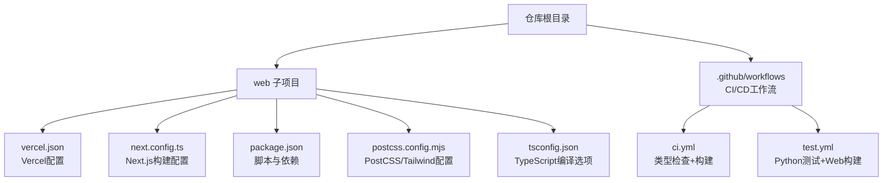
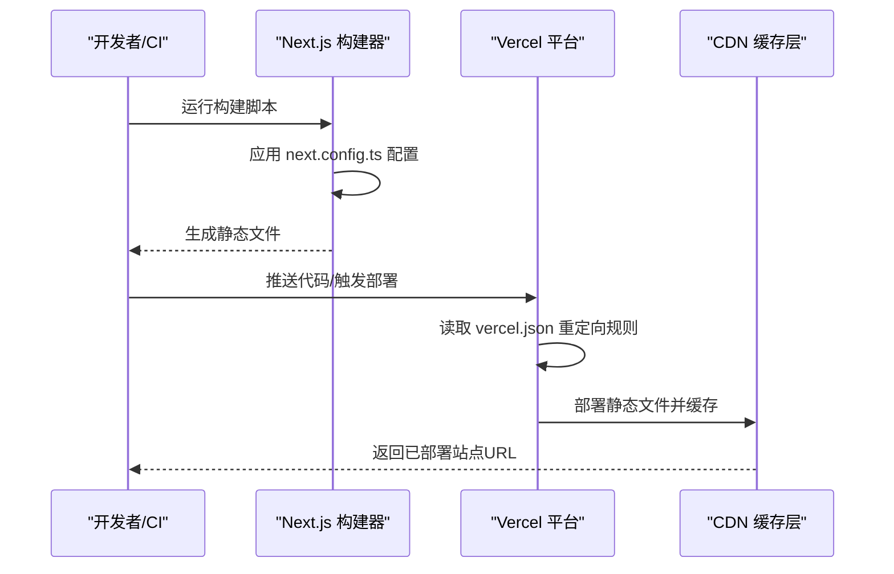
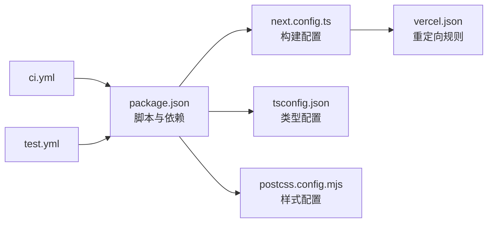

# Web平台部署

<cite>
**本文引用的文件**
- [vercel.json](file://web/vercel.json)
- [package.json](file://web/package.json)
- [next.config.ts](file://web/next.config.ts)
- [README.md（Web）](file://web/README.md)
- [README.md（根目录）](file://README.md)
- [ci.yml](file://.github/workflows/ci.yml)
- [test.yml](file://.github/workflows/test.yml)
- [postcss.config.mjs](file://web/postcss.config.mjs)
- [tsconfig.json](file://web/tsconfig.json)
</cite>

## 目录
1. [简介](#简介)
2. [项目结构](#项目结构)
3. [核心组件](#核心组件)
4. [架构总览](#架构总览)
5. [详细组件分析](#详细组件分析)
6. [依赖关系分析](#依赖关系分析)
7. [性能考虑](#性能考虑)
8. [故障排除指南](#故障排除指南)
9. [结论](#结论)
10. [附录](#附录)

## 简介
本指南面向在Vercel上部署基于Next.js的应用，涵盖以下内容：Vercel配置文件参数说明、域名与重定向规则、环境变量设置建议；Next.js构建配置（静态导出、图片优化、尾斜杠等）；本地与生产部署流程（开发服务器、构建、静态导出）；CDN与缓存策略（静态资源、浏览器缓存）；部署前性能优化（Bundle分析、图片优化、代码压缩）；以及部署后的验证与故障排除。

## 项目结构
该仓库包含一个独立的Web子项目，使用Next.js 16作为前端框架，并通过Vercel进行部署。关键配置集中在web目录下，CI/CD通过GitHub Actions在ubuntu环境中执行类型检查与构建。

图表来源
- [vercel.json:1-21](file://web/vercel.json#L1-L21)
- [next.config.ts:1-10](file://web/next.config.ts#L1-L10)
- [package.json:1-39](file://web/package.json#L1-L39)
- [postcss.config.mjs:1-8](file://web/postcss.config.mjs#L1-L8)
- [tsconfig.json:1-35](file://web/tsconfig.json#L1-L35)
- [ci.yml:1-33](file://.github/workflows/ci.yml#L1-L33)
- [test.yml:1-46](file://.github/workflows/test.yml#L1-L46)

章节来源
- [README.md（根目录）:294-297](file://README.md#L294-L297)
- [README.md（Web）:1-37](file://web/README.md#L1-L37)

## 核心组件
- Vercel配置（vercel.json）
  - 定义重定向规则：将特定主机名请求永久重定向到新地址；根路径非永久跳转至默认语言路径。
  - 适合多语言站点的路径与主机匹配重定向场景。
- Next.js构建配置（next.config.ts）
  - 输出模式为静态导出（export），用于生成纯静态站点。
  - 图片未优化（unoptimized），需配合静态导出使用。
  - 启用尾斜杠（trailingSlash），利于SEO与路径一致性。
- 构建脚本与依赖（package.json）
  - 提供开发、构建、启动脚本；包含React、Next.js、Tailwind等依赖。
  - 预构建阶段会先执行内容提取脚本。
- PostCSS与Tailwind（postcss.config.mjs）
  - 使用Tailwind PostCSS插件，确保样式构建链路正确。
- TypeScript配置（tsconfig.json）
  - 指定模块解析策略为bundler，启用严格模式与增量编译，支持Next.js插件与路径映射。

章节来源
- [vercel.json:1-21](file://web/vercel.json#L1-L21)
- [next.config.ts:1-10](file://web/next.config.ts#L1-L10)
- [package.json:1-39](file://web/package.json#L1-L39)
- [postcss.config.mjs:1-8](file://web/postcss.config.mjs#L1-L8)
- [tsconfig.json:1-35](file://web/tsconfig.json#L1-L35)

## 架构总览
下图展示了从源码到Vercel部署的关键流程：开发者在本地或CI中运行构建，Next.js根据配置输出静态文件，Vercel读取vercel.json中的重定向规则并托管静态站点。

图表来源
- [package.json:5-11](file://web/package.json#L5-L11)
- [next.config.ts:3-7](file://web/next.config.ts#L3-L7)
- [vercel.json:2-19](file://web/vercel.json#L2-L19)

## 详细组件分析

### Vercel配置（vercel.json）
- 重定向规则
  - 主机匹配：对特定主机名的请求进行匹配。
  - 永久重定向：将旧主机名请求永久跳转至新地址。
  - 根路径重定向：将根路径跳转到默认语言路径，便于国际化入口管理。
- 建议
  - 在多语言或多域名场景下，确保主机值与实际域名一致。
  - 非永久跳转仅用于临时引导，避免影响SEO权重。

章节来源
- [vercel.json:2-19](file://web/vercel.json#L2-L19)

### Next.js构建配置（next.config.ts）
- 静态导出（output: export）
  - 适用于无需服务端渲染的静态站点，部署更简单且成本更低。
- 图片优化（images.unoptimized: true）
  - 与静态导出配合使用，避免Next.js内置图像服务带来的复杂性。
- 尾斜杠（trailingSlash: true）
  - 统一路径风格，减少重复内容风险，提升SEO友好度。

章节来源
- [next.config.ts:3-7](file://web/next.config.ts#L3-L7)

### 构建脚本与依赖（package.json）
- 脚本
  - 开发：启动Next.js开发服务器。
  - 预构建：执行内容提取脚本，确保构建前数据就绪。
  - 构建：生成生产构建产物。
  - 启动：以生产模式启动Next.js服务器（通常由Vercel接管）。
- 依赖
  - React、Next.js、Tailwind、TypeScript等核心依赖。
  - 开发依赖包括Tailwind PostCSS插件与类型定义。

章节来源
- [package.json:5-11](file://web/package.json#L5-L11)
- [package.json:13-37](file://web/package.json#L13-L37)

### PostCSS与Tailwind（postcss.config.mjs）
- 插件配置
  - 引入Tailwind PostCSS插件，确保样式在构建时被正确处理。
- 建议
  - 保持与Next.js版本兼容，避免构建错误。

章节来源
- [postcss.config.mjs:1-8](file://web/postcss.config.mjs#L1-L8)

### TypeScript配置（tsconfig.json）
- 关键选项
  - 模块解析：bundler，适配Next.js打包工具链。
  - 严格模式：开启严格类型检查，提升代码质量。
  - 增量编译：提升开发体验与CI效率。
  - 路径映射：@/* 指向 src，简化导入路径。
- 建议
  - 在团队协作中统一TS配置，避免不同环境差异。

章节来源
- [tsconfig.json:10-23](file://web/tsconfig.json#L10-L23)

### CI/CD工作流（GitHub Actions）
- 类型检查与构建
  - 在ubuntu环境中安装Node.js 20，使用npm ci安装依赖，执行类型检查与构建。
- 测试
  - 分别运行Python冒烟测试与Web构建测试，保证前后端质量。
- 建议
  - 在Vercel侧可直接连接仓库，实现自动部署；CI/CD工作流可作为补充保障。

章节来源
- [ci.yml:10-32](file://.github/workflows/ci.yml#L10-L32)
- [test.yml:26-45](file://.github/workflows/test.yml#L26-L45)

## 依赖关系分析
下图展示Web子项目的核心依赖关系：package.json声明脚本与依赖；next.config.ts影响构建行为；vercel.json影响部署与路由；CI工作流负责自动化质量门禁。

图表来源
- [package.json:5-11](file://web/package.json#L5-L11)
- [next.config.ts:3-7](file://web/next.config.ts#L3-L7)
- [vercel.json:2-19](file://web/vercel.json#L2-L19)
- [tsconfig.json:10-23](file://web/tsconfig.json#L10-L23)
- [postcss.config.mjs:1-8](file://web/postcss.config.mjs#L1-L8)
- [ci.yml:16-32](file://.github/workflows/ci.yml#L16-L32)
- [test.yml:31-45](file://.github/workflows/test.yml#L31-L45)

## 性能考虑
- Bundle分析
  - 使用Next.js内置分析工具或第三方Bundle可视化工具，识别大体积依赖与重复包，按需拆分与懒加载。
- 图片优化
  - 当前配置为静态导出且图片未优化，建议在需要时引入合适的静态图片处理方案或CDN加速。
- 代码压缩与Tree Shaking
  - 生产构建默认启用压缩；确保依赖更新后重新构建，避免陈旧缓存。
- 构建缓存
  - CI中使用npm缓存，缩短构建时间；本地开发可利用增量编译提升效率。
- CDN与缓存
  - 静态导出产物由Vercel托管并具备全球CDN分发能力；结合vercel.json的重定向与路径策略，减少不必要的回源。

章节来源
- [package.json:5-11](file://web/package.json#L5-L11)
- [next.config.ts:3-7](file://web/next.config.ts#L3-L7)
- [ci.yml:20-23](file://.github/workflows/ci.yml#L20-L23)

## 故障排除指南
- 构建失败
  - 检查类型检查是否通过；确认Node.js版本与依赖安装是否成功。
- 路由异常
  - 核对vercel.json中的重定向规则与主机名配置；确认尾斜杠与路径拼接是否一致。
- 静态资源缺失
  - 确认静态导出配置生效；核对public目录与资源引用路径。
- CI/CD问题
  - 查看工作流日志定位具体步骤；确保工作目录与缓存命中正常。

章节来源
- [ci.yml:28-32](file://.github/workflows/ci.yml#L28-L32)
- [test.yml:44-45](file://.github/workflows/test.yml#L44-L45)
- [vercel.json:2-19](file://web/vercel.json#L2-L19)
- [next.config.ts:3-7](file://web/next.config.ts#L3-L7)

## 结论
本项目采用静态导出与Vercel托管的组合，具备部署简单、成本低、全球加速的优势。通过合理的vercel.json重定向配置、严格的类型检查与构建流程，以及Tailwind与Next.js的协同，可在保证质量的同时快速上线。建议在后续迭代中结合Bundle分析与CDN缓存策略进一步优化性能与用户体验。

## 附录

### 本地部署步骤
- 安装依赖并启动开发服务器
  - 参考路径：[web/README.md:5-15](file://web/README.md#L5-L15)
- 执行预构建脚本
  - 参考路径：[web/package.json:7-11](file://web/package.json#L7-L11)
- 本地预览构建结果
  - 参考路径：[web/package.json:10-11](file://web/package.json#L10-L11)

章节来源
- [README.md（Web）:5-15](file://web/README.md#L5-L15)
- [package.json:7-11](file://web/package.json#L7-L11)

### 生产部署步骤
- 在Vercel上连接仓库并启用自动部署
  - 参考路径：[web/README.md:32-36](file://web/README.md#L32-L36)
- 触发CI/CD质量门禁
  - 参考路径：[ci.yml:10-32](file://.github/workflows/ci.yml#L10-L32)、[test.yml:26-45](file://.github/workflows/test.yml#L26-L45)
- 验证静态导出与重定向
  - 参考路径：[vercel.json:2-19](file://web/vercel.json#L2-L19)、[next.config.ts:3-7](file://web/next.config.ts#L3-L7)

章节来源
- [README.md（Web）:32-36](file://web/README.md#L32-L36)
- [ci.yml:10-32](file://.github/workflows/ci.yml#L10-L32)
- [test.yml:26-45](file://.github/workflows/test.yml#L26-L45)
- [vercel.json:2-19](file://web/vercel.json#L2-L19)
- [next.config.ts:3-7](file://web/next.config.ts#L3-L7)

### CDN与缓存策略
- 静态资源缓存
  - 静态导出产物由Vercel CDN托管，默认具备全球分发与缓存能力。
- 浏览器缓存
  - 尾斜杠与路径策略有助于浏览器缓存命中；可结合HTTP缓存头进一步优化。
- API响应缓存
  - 若存在API路由，建议在Vercel函数中设置合适的缓存控制头；当前仓库为静态导出，无API路由示例。

章节来源
- [next.config.ts:3-7](file://web/next.config.ts#L3-L7)
- [vercel.json:2-19](file://web/vercel.json#L2-L19)