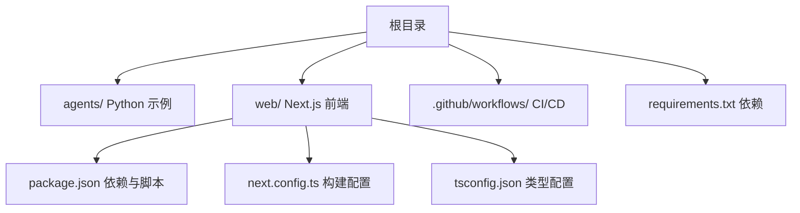
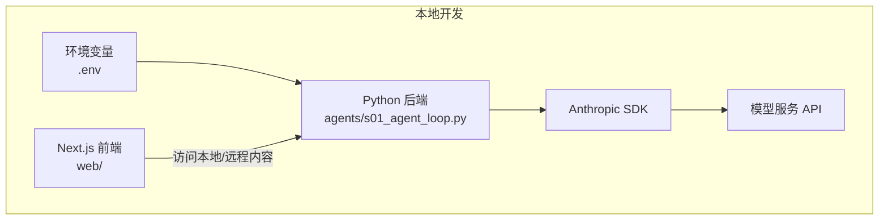
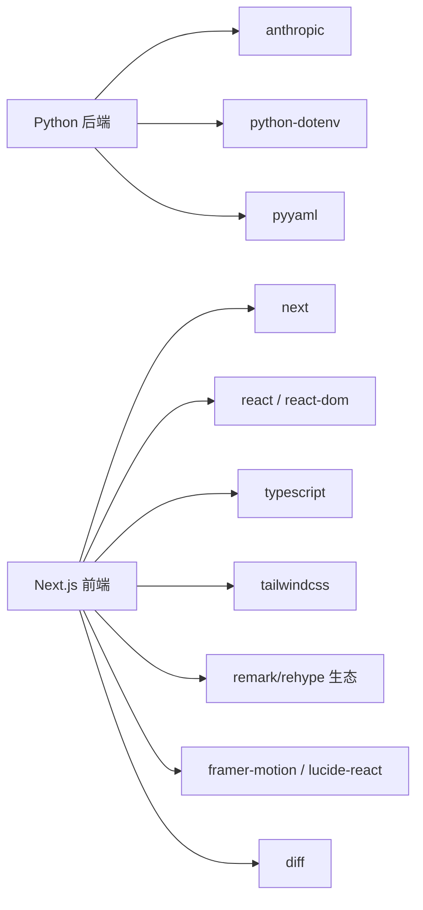

# 环境配置

<cite>
**本文引用的文件**
- [README.md](file://README.md)
- [requirements.txt](file://requirements.txt)
- [web/package.json](file://web/package.json)
- [.github/workflows/ci.yml](file://.github/workflows/ci.yml)
- [.github/workflows/test.yml](file://.github/workflows/test.yml)
- [web/next.config.ts](file://web/next.config.ts)
- [web/tsconfig.json](file://web/tsconfig.json)
- [agents/s01_agent_loop.py](file://agents/s01_agent_loop.py)
- [.gitignore](file://.gitignore)
</cite>

## 目录
1. [简介](#简介)
2. [项目结构](#项目结构)
3. [核心组件](#核心组件)
4. [架构总览](#架构总览)
5. [详细组件分析](#详细组件分析)
6. [依赖关系分析](#依赖关系分析)
7. [性能考虑](#性能考虑)
8. [故障排除指南](#故障排除指南)
9. [结论](#结论)
10. [附录](#附录)

## 简介
本指南面向需要在本地搭建与运行该仓库 Python 后端与 Next.js 前端的开发者，提供从环境准备、依赖安装、环境变量配置到跨平台安装步骤与验证方法的完整说明，并包含常见问题排查建议。该仓库同时提供 Python 示例脚本与交互式 Web 平台，便于学习与演示。

## 项目结构
该项目采用前后端分离的结构：
- Python 后端示例位于 agents/ 目录，提供逐步递进的代理循环与工具使用示例。
- Web 前端基于 Next.js（16.x），位于 web/ 目录，提供交互式可视化与文档平台。
- 根目录包含依赖清单与 GitHub Actions 工作流，用于 CI/CD 验证。

图表来源
- [README.md:287-298](file://README.md#L287-L298)
- [requirements.txt:1-3](file://requirements.txt#L1-L3)
- [web/package.json:1-39](file://web/package.json#L1-L39)
- [.github/workflows/ci.yml:1-33](file://.github/workflows/ci.yml#L1-L33)

章节来源
- [README.md:287-298](file://README.md#L287-L298)

## 核心组件
- Python 后端：通过 anthropic SDK 调用模型，使用 dotenv 加载环境变量，支持本地或自定义 API Base URL。
- Next.js 前端：使用 Next 16、React 19、TypeScript 5，构建静态导出产物，支持多语言与主题切换。
- CI/CD：使用 GitHub Actions 在 Ubuntu 上分别进行 Node.js 20 的类型检查与构建，以及 Python 3.11 的烟雾测试。

章节来源
- [README.md:232-251](file://README.md#L232-L251)
- [requirements.txt:1-3](file://requirements.txt#L1-L3)
- [web/package.json:1-39](file://web/package.json#L1-L39)
- [.github/workflows/ci.yml:19-22](file://.github/workflows/ci.yml#L19-L22)
- [.github/workflows/test.yml:15-18](file://.github/workflows/test.yml#L15-L18)

## 架构总览
下图展示了本地开发时 Python 后端与 Next.js 前端的典型交互路径，以及环境变量对后端调用的影响。

图表来源
- [agents/s01_agent_loop.py:44-49](file://agents/s01_agent_loop.py#L44-L49)
- [README.md:232-251](file://README.md#L232-L251)

## 详细组件分析

### Python 后端环境配置
- Python 版本要求
  - CI 使用 Python 3.11 进行测试，建议在本地也使用相同版本以确保一致性。
- 虚拟环境设置
  - 推荐使用 venv 创建隔离环境，避免全局污染。
- 依赖安装
  - 安装 requirements.txt 中声明的依赖，包括 anthropic、python-dotenv、pyyaml。
- 环境变量配置
  - 复制示例环境文件并填写 ANTHROPIC_API_KEY；可选地设置 ANTHROPIC_BASE_URL 指向自定义网关。
  - MODEL_ID 用于指定模型标识。
- 开发与运行
  - 可直接运行 agents/s01_agent_loop.py 进行交互式体验。
  - 支持自定义 base_url 时自动清理认证令牌相关环境变量。

章节来源
- [.github/workflows/test.yml:15-24](file://.github/workflows/test.yml#L15-L24)
- [requirements.txt:1-3](file://requirements.txt#L1-L3)
- [agents/s01_agent_loop.py:44-49](file://agents/s01_agent_loop.py#L44-L49)
- [README.md:232-243](file://README.md#L232-L243)

### Next.js 前端环境配置
- Node.js 版本要求
  - CI 使用 Node.js 20 进行类型检查与构建，建议在本地使用相同版本。
- 包管理与安装
  - 使用 npm ci 安装依赖，确保锁定文件一致。
- 开发服务器启动
  - 在 web/ 目录执行 npm run dev，默认监听本地端口（Next 默认端口为 3000）。
- 构建与导出
  - 使用 next.config.ts 将 images 设置为未优化，并启用 trailingSlash；输出模式为静态导出。
- TypeScript 配置
  - tsconfig.json 指定严格模式、模块解析策略与路径别名等。

章节来源
- [.github/workflows/ci.yml:19-22](file://.github/workflows/ci.yml#L19-L22)
- [web/package.json:5-12](file://web/package.json#L5-L12)
- [web/next.config.ts:3-7](file://web/next.config.ts#L3-L7)
- [web/tsconfig.json:2-24](file://web/tsconfig.json#L2-L24)

### 环境变量配置详解
- 必填项
  - ANTHROPIC_API_KEY：用于访问模型服务的密钥。
- 可选项
  - ANTHROPIC_BASE_URL：指向自定义网关或代理地址；若设置，则会清理相关认证令牌环境变量。
  - MODEL_ID：指定使用的模型标识。
- 其他建议
  - 可根据需要添加日志级别、调试开关等（如需扩展）。

章节来源
- [agents/s01_agent_loop.py:44-49](file://agents/s01_agent_loop.py#L44-L49)
- [README.md:238-239](file://README.md#L238-L239)

### 不同操作系统下的安装步骤

- Windows
  - 安装 Python 3.11（建议使用官方安装包或包管理器），创建并激活虚拟环境。
  - 安装 Node.js 20（建议使用官方安装包或包管理器）。
  - 在项目根目录执行 pip install -r requirements.txt。
  - 在 web/ 目录执行 npm ci。
  - 复制 .env.example 为 .env 并填写 ANTHROPIC_API_KEY。
  - 在 web/ 目录执行 npm run dev 启动前端开发服务器。
  - 在根目录执行 python agents/s01_agent_loop.py 启动后端示例。

- macOS
  - 使用 Homebrew 安装 Python 3.11 与 Node.js 20。
  - 在项目根目录执行 pip install -r requirements.txt。
  - 在 web/ 目录执行 npm ci。
  - 复制 .env.example 为 .env 并填写 ANTHROPIC_API_KEY。
  - 在 web/ 目录执行 npm run dev 启动前端开发服务器。
  - 在根目录执行 python agents/s01_agent_loop.py 启动后端示例。

- Linux
  - 使用发行版包管理器安装 Python 3.11 与 Node.js 20。
  - 在项目根目录执行 pip install -r requirements.txt。
  - 在 web/ 目录执行 npm ci。
  - 复制 .env.example 为 .env 并填写 ANTHROPIC_API_KEY。
  - 在 web/ 目录执行 npm run dev 启动前端开发服务器。
  - 在根目录执行 python agents/s01_agent_loop.py 启动后端示例。

章节来源
- [.github/workflows/test.yml:15-18](file://.github/workflows/test.yml#L15-L18)
- [.github/workflows/ci.yml:19-22](file://.github/workflows/ci.yml#L19-L22)
- [README.md:232-251](file://README.md#L232-L251)

### 环境验证方法
- 依赖检查
  - Python：确认 requirements.txt 中依赖已安装。
  - Node.js：确认 web/package.json 中依赖已安装（推荐使用 npm ci）。
- 端口测试
  - 前端默认端口为 3000，可通过浏览器访问 http://localhost:3000 验证。
- API 连通性验证
  - 启动 agents/s01_agent_loop.py，输入提示后观察是否能返回模型响应（需正确配置 ANTHROPIC_API_KEY）。
  - 若使用自定义 base_url，请确保网络可达且无需额外认证令牌。

章节来源
- [README.md:232-251](file://README.md#L232-L251)
- [agents/s01_agent_loop.py:80-101](file://agents/s01_agent_loop.py#L80-L101)

## 依赖关系分析
- Python 后端依赖
  - anthropic：模型服务 SDK。
  - python-dotenv：加载 .env 文件中的环境变量。
  - pyyaml：用于 YAML 解析（可能在某些场景中使用）。
- 前端依赖
  - next、react、react-dom：框架与运行时。
  - TypeScript 与相关类型定义：类型检查与开发体验。
  - TailwindCSS 4：样式系统。
  - remark/rehype 生态：文档渲染管线。
  - framer-motion、lucide-react：动画与图标。
  - diff：代码差异比较。
- CI/CD 依赖
  - actions/setup-python：Python 3.11。
  - actions/setup-node：Node.js 20。

图表来源
- [requirements.txt:1-3](file://requirements.txt#L1-L3)
- [web/package.json:13-37](file://web/package.json#L13-L37)

章节来源
- [requirements.txt:1-3](file://requirements.txt#L1-L3)
- [web/package.json:13-37](file://web/package.json#L13-L37)

## 性能考虑
- 前端构建
  - 使用静态导出（export）可减少运行时开销，适合文档类站点。
  - images 未优化（unoptimized: true）与 trailingSlash 启用，有助于兼容部署环境。
- Python 执行
  - 示例脚本限制了危险命令与超时时间，避免长时间阻塞。
  - 建议在生产环境中增加更严格的权限控制与资源配额。

章节来源
- [web/next.config.ts:3-7](file://web/next.config.ts#L3-L7)
- [agents/s01_agent_loop.py:65-77](file://agents/s01_agent_loop.py#L65-L77)

## 故障排除指南
- Python 环境问题
  - 版本不匹配：确保使用 Python 3.11（与 CI 一致）。
  - 依赖缺失：执行 pip install -r requirements.txt。
  - .env 未生效：确认已复制 .env.example 为 .env，并正确填写 ANTHROPIC_API_KEY。
- Node.js 环境问题
  - 版本不匹配：确保使用 Node.js 20（与 CI 一致）。
  - 依赖安装失败：使用 npm ci 而非 npm install，确保锁定文件一致。
- 端口占用
  - 前端默认端口 3000 被占用时，可在启动前释放或修改 Next 配置。
- API 访问失败
  - 检查 ANTHROPIC_API_KEY 是否有效。
  - 如使用自定义 base_url，确认网络可达且无需额外认证令牌。
- 虚拟环境隔离
  - 建议使用 venv 或 conda 创建独立环境，避免全局污染。

章节来源
- [.github/workflows/test.yml:15-18](file://.github/workflows/test.yml#L15-L18)
- [.github/workflows/ci.yml:19-22](file://.github/workflows/ci.yml#L19-L22)
- [agents/s01_agent_loop.py:44-49](file://agents/s01_agent_loop.py#L44-L49)
- [.gitignore:137-146](file://.gitignore#L137-L146)

## 结论
通过遵循本指南，您可以在 Windows、macOS、Linux 上完成 Python 与 Node.js 环境的准备与验证，并成功运行 Python 后端示例与 Next.js 前端平台。建议始终使用与 CI 一致的版本，以减少环境差异带来的问题。

## 附录
- 快速启动命令参考
  - Python：pip install -r requirements.txt；复制 .env.example 为 .env 并填写密钥；运行 agents/s01_agent_loop.py。
  - 前端：cd web；npm ci；npm run dev；在浏览器访问 http://localhost:3000。

章节来源
- [README.md:232-251](file://README.md#L232-L251)