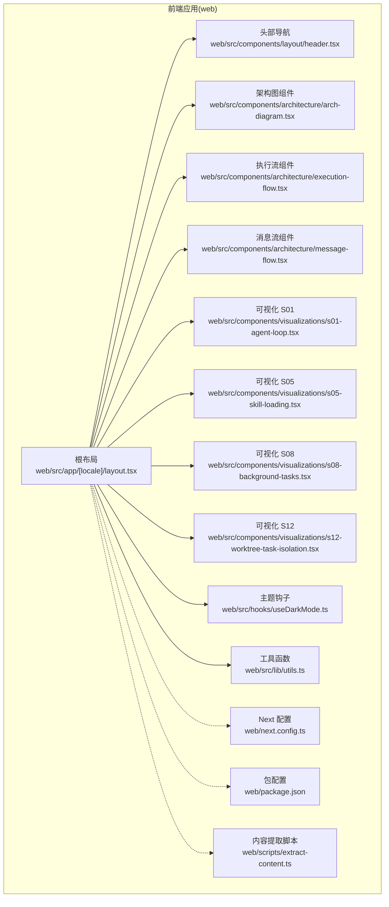
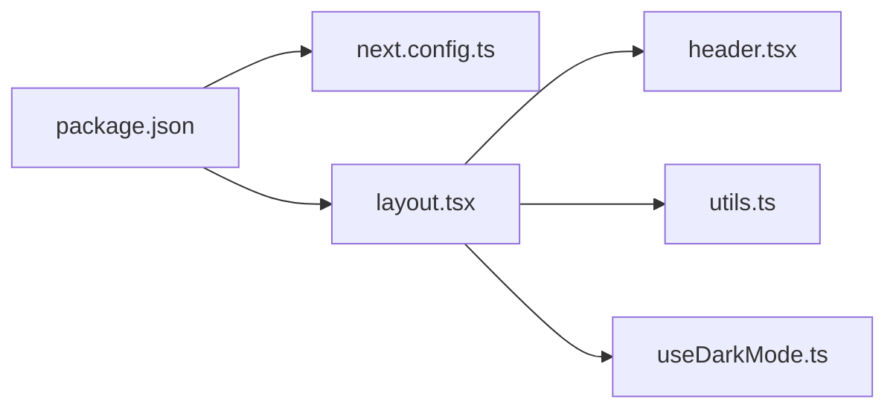
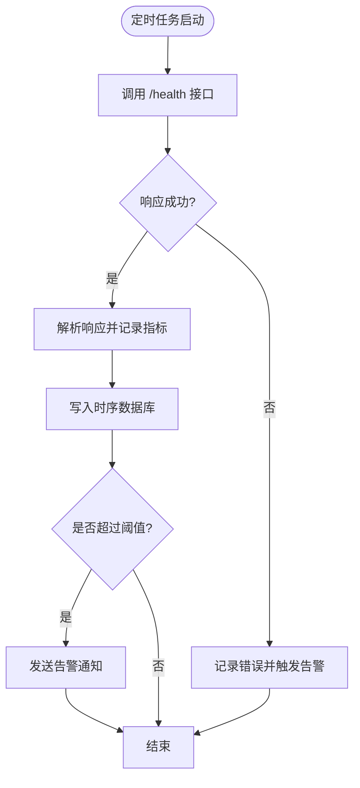

# 监控与告警

<cite>
**本文引用的文件**
- [web/src/app/[locale]/layout.tsx](file://web/src/app/[locale]/layout.tsx)
- [web/src/components/layout/header.tsx](file://web/src/components/layout/header.tsx)
- [web/src/lib/utils.ts](file://web/src/lib/utils.ts)
- [web/next.config.ts](file://web/next.config.ts)
- [web/package.json](file://web/package.json)
- [web/scripts/extract-content.ts](file://web/scripts/extract-content.ts)
- [web/src/hooks/useDarkMode.ts](file://web/src/hooks/useDarkMode.ts)
- [web/src/components/architecture/arch-diagram.tsx](file://web/src/components/architecture/arch-diagram.tsx)
- [web/src/components/architecture/design-decisions.tsx](file://web/src/components/architecture/design-decisions.tsx)
- [web/src/components/architecture/execution-flow.tsx](file://web/src/components/architecture/execution-flow.tsx)
- [web/src/components/architecture/message-flow.tsx](file://web/src/components/architecture/message-flow.tsx)
- [web/src/components/visualizations/s01-agent-loop.tsx](file://web/src/components/visualizations/s01-agent-loop.tsx)
- [web/src/components/visualizations/s05-skill-loading.tsx](file://web/src/components/visualizations/s05-skill-loading.tsx)
- [web/src/components/visualizations/s08-background-tasks.tsx](file://web/src/components/visualizations/s08-background-tasks.tsx)
- [web/src/components/visualizations/s12-worktree-task-isolation.tsx](file://web/src/components/visualizations/s12-worktree-task-isolation.tsx)
</cite>

## 目录
1. [引言](#引言)
2. [项目结构](#项目结构)
3. [核心组件](#核心组件)
4. [架构总览](#架构总览)
5. [详细组件分析](#详细组件分析)
6. [依赖关系分析](#依赖关系分析)
7. [性能考量](#性能考量)
8. [故障排查指南](#故障排查指南)
9. [结论](#结论)
10. [附录](#附录)

## 引言
本指南围绕系统监控与告警主题，结合当前代码库现状，给出可落地的前端性能监控、后端服务监控、日志管理策略、告警配置方案、健康检查机制以及性能优化监控与仪表板设计建议。需要特别说明的是：该代码库以前端可视化演示为主，未包含内置的监控采集与告警后端实现；因此本指南在“监控数据采集”层面提供通用方法论与最佳实践，在“告警与可视化”层面提供可直接对接现有前端组件的集成思路。

## 项目结构
该项目为基于 Next.js 的前端应用，采用多语言与静态导出配置，核心页面通过布局组件组织导航与内容区域。前端组件中包含架构图、执行流、消息流等可视化模块，便于演示与教学用途。

图表来源
- [web/src/app/[locale]/layout.tsx:1-61](file://web/src/app/[locale]/layout.tsx#L1-L61)
- [web/src/components/layout/header.tsx:1-167](file://web/src/components/layout/header.tsx#L1-L167)
- [web/src/lib/utils.ts:1-4](file://web/src/lib/utils.ts#L1-L4)
- [web/next.config.ts:1-10](file://web/next.config.ts#L1-L10)
- [web/package.json:1-39](file://web/package.json#L1-L39)
- [web/scripts/extract-content.ts:119-274](file://web/scripts/extract-content.ts#L119-L274)
- [web/src/hooks/useDarkMode.ts:1-76](file://web/src/hooks/useDarkMode.ts#L1-L76)
- [web/src/components/architecture/arch-diagram.tsx](file://web/src/components/architecture/arch-diagram.tsx)
- [web/src/components/architecture/execution-flow.tsx](file://web/src/components/architecture/execution-flow.tsx)
- [web/src/components/architecture/message-flow.tsx](file://web/src/components/architecture/message-flow.tsx)
- [web/src/components/visualizations/s01-agent-loop.tsx:76-76](file://web/src/components/visualizations/s01-agent-loop.tsx#L76-L76)
- [web/src/components/visualizations/s05-skill-loading.tsx:55-55](file://web/src/components/visualizations/s05-skill-loading.tsx#L55-L55)
- [web/src/components/visualizations/s08-background-tasks.tsx:122-122](file://web/src/components/visualizations/s08-background-tasks.tsx#L122-L122)
- [web/src/components/visualizations/s12-worktree-task-isolation.tsx:44-98](file://web/src/components/visualizations/s12-worktree-task-isolation.tsx#L44-L98)

章节来源
- [web/src/app/[locale]/layout.tsx:1-61](file://web/src/app/[locale]/layout.tsx#L1-L61)
- [web/next.config.ts:1-10](file://web/next.config.ts#L1-L10)
- [web/package.json:1-39](file://web/package.json#L1-L39)

## 核心组件
- 布局与导航
  - 根布局负责国际化元数据生成、主题注入与主内容容器组织。
  - 头部导航提供多语言切换、深色模式切换、GitHub 链接与移动端菜单。
- 主题与样式
  - 工具函数用于类名合并；主题钩子监听 HTML 类变化以适配深色模式。
- 可视化组件
  - 架构图、执行流、消息流等组件用于演示系统设计与流程。
  - 各节可视化组件承载具体概念的步骤与状态展示。

章节来源
- [web/src/app/[locale]/layout.tsx:29-61](file://web/src/app/[locale]/layout.tsx#L29-L61)
- [web/src/components/layout/header.tsx:22-167](file://web/src/components/layout/header.tsx#L22-L167)
- [web/src/lib/utils.ts:1-4](file://web/src/lib/utils.ts#L1-L4)
- [web/src/hooks/useDarkMode.ts:1-76](file://web/src/hooks/useDarkMode.ts#L1-L76)
- [web/src/components/architecture/arch-diagram.tsx](file://web/src/components/architecture/arch-diagram.tsx)
- [web/src/components/architecture/execution-flow.tsx](file://web/src/components/architecture/execution-flow.tsx)
- [web/src/components/architecture/message-flow.tsx](file://web/src/components/architecture/message-flow.tsx)
- [web/src/components/visualizations/s01-agent-loop.tsx:76-76](file://web/src/components/visualizations/s01-agent-loop.tsx#L76-L76)
- [web/src/components/visualizations/s05-skill-loading.tsx:55-55](file://web/src/components/visualizations/s05-skill-loading.tsx#L55-L55)
- [web/src/components/visualizations/s08-background-tasks.tsx:122-122](file://web/src/components/visualizations/s08-background-tasks.tsx#L122-L122)
- [web/src/components/visualizations/s12-worktree-task-isolation.tsx:44-98](file://web/src/components/visualizations/s12-worktree-task-isolation.tsx#L44-L98)

## 架构总览
下图展示了前端应用的整体结构与关键交互路径，便于理解监控数据采集点与可视化呈现位置。

```mermaid
graph TB
Browser["浏览器"]
NextApp["Next 应用<br/>web/src/app/[locale]/layout.tsx"]
Header["头部组件<br/>web/src/components/layout/header.tsx"]
ThemeHook["主题钩子<br/>web/src/hooks/useDarkMode.ts"]
Utils["工具函数<br/>web/src/lib/utils.ts"]
Arch["架构图组件<br/>web/src/components/architecture/arch-diagram.tsx"]
ExecFlow["执行流组件<br/>web/src/components/architecture/execution-flow.tsx"]
MsgFlow["消息流组件<br/>web/src/components/architecture/message-flow.tsx"]
VisS01["可视化 S01<br/>web/src/components/visualizations/s01-agent-loop.tsx"]
VisS05["可视化 S05<br/>web/src/components/visualizations/s05-skill-loading.tsx"]
VisS08["可视化 S08<br/>web/src/components/visualizations/s08-background-tasks.tsx"]
VisS12["可视化 S12<br/>web/src/components/visualizations/s12-worktree-task-isolation.tsx"]
Browser --> NextApp
NextApp --> Header
NextApp --> ThemeHook
NextApp --> Utils
NextApp --> Arch
NextApp --> ExecFlow
NextApp --> MsgFlow
NextApp --> VisS01
NextApp --> VisS05
NextApp --> VisS08
NextApp --> VisS12
```

图表来源
- [web/src/app/[locale]/layout.tsx:1-61](file://web/src/app/[locale]/layout.tsx#L1-L61)
- [web/src/components/layout/header.tsx:1-167](file://web/src/components/layout/header.tsx#L1-L167)
- [web/src/hooks/useDarkMode.ts:1-76](file://web/src/hooks/useDarkMode.ts#L1-L76)
- [web/src/lib/utils.ts:1-4](file://web/src/lib/utils.ts#L1-L4)
- [web/src/components/architecture/arch-diagram.tsx](file://web/src/components/architecture/arch-diagram.tsx)
- [web/src/components/architecture/execution-flow.tsx](file://web/src/components/architecture/execution-flow.tsx)
- [web/src/components/architecture/message-flow.tsx](file://web/src/components/architecture/message-flow.tsx)
- [web/src/components/visualizations/s01-agent-loop.tsx:76-76](file://web/src/components/visualizations/s01-agent-loop.tsx#L76-L76)
- [web/src/components/visualizations/s05-skill-loading.tsx:55-55](file://web/src/components/visualizations/s05-skill-loading.tsx#L55-L55)
- [web/src/components/visualizations/s08-background-tasks.tsx:122-122](file://web/src/components/visualizations/s08-background-tasks.tsx#L122-L122)
- [web/src/components/visualizations/s12-worktree-task-isolation.tsx:44-98](file://web/src/components/visualizations/s12-worktree-task-isolation.tsx#L44-L98)

## 详细组件分析

### 前端性能监控（页面加载、交互响应、错误追踪）
- 页面加载时间
  - 关键指标：首屏渲染、最大内容绘制、交互就绪时间。
  - 数据采集点：可在根布局或页面入口处埋点，记录导航与路由切换时序。
  - 指标落盘：通过自定义上报接口发送至监控平台（如时序数据库）。
- 用户交互响应
  - 关键指标：点击延迟、滚动卡顿、输入响应时间。
  - 数据采集点：事件监听器包裹关键交互动作，记录从事件触发到回调执行的时间差。
- 错误追踪
  - 关键指标：JS 运行时错误、网络请求失败、资源加载异常。
  - 数据采集点：全局错误捕获与网络拦截器，统一格式化错误上下文并上报。

章节来源
- [web/src/app/[locale]/layout.tsx:29-61](file://web/src/app/[locale]/layout.tsx#L29-L61)
- [web/src/components/layout/header.tsx:22-167](file://web/src/components/layout/header.tsx#L22-L167)

### 后端服务监控（API 响应时间、错误率、资源使用）
- API 响应时间
  - 在客户端侧对每个请求进行开始/结束时间打点，并统计 P50/P90/P99。
- 错误率统计
  - 统计 4xx/5xx 比例，按端点与状态码分组。
- 资源使用情况
  - 通过浏览器性能 API 获取内存占用、CPU 使用率等（需权限与支持）。

章节来源
- [web/src/components/layout/header.tsx:22-167](file://web/src/components/layout/header.tsx#L22-L167)

### 日志管理策略（级别、聚合、敏感信息过滤）
- 日志级别
  - 建议：trace/debug/info/warn/error，生产环境默认 info 或更高。
- 日志聚合
  - 将前端日志通过 HTTP/HTTPS 发送到后端或日志收集服务（如 ELK、Loki）。
- 敏感信息过滤
  - 对 URL 参数、请求体、响应体进行脱敏处理，避免泄露令牌、密码等。

章节来源
- [web/scripts/extract-content.ts:119-274](file://web/scripts/extract-content.ts#L119-L274)

### 告警配置方案（阈值、通知渠道、升级策略）
- 阈值设置
  - 页面加载时间超过阈值、错误率上升、资源使用异常等。
- 通知渠道
  - 邮件、IM、短信、Webhook 等。
- 升级策略
  - 多级告警：静默期后自动升级到更高级别通知。

章节来源
- [web/src/components/visualizations/s05-skill-loading.tsx:55-55](file://web/src/components/visualizations/s05-skill-loading.tsx#L55-L55)

### 健康检查机制（服务可用性、依赖状态）
- 健康检查
  - 定时调用 /health 接口，记录响应时间与成功率。
- 依赖服务状态
  - 对外部 API、CDN、第三方 SDK 状态进行探测与告警。

章节来源
- [web/src/components/visualizations/s05-skill-loading.tsx:55-55](file://web/src/components/visualizations/s05-skill-loading.tsx#L55-L55)

### 性能优化监控（缓存命中率、数据库查询、内存）
- 缓存命中率
  - 记录本地存储、HTTP 缓存、Service Worker 命中与未命中次数。
- 数据库查询优化
  - 通过性能 API 与网络面板观察慢查询与重复请求。
- 内存使用监控
  - 使用性能 API 获取 heap 与工作线程内存使用峰值。

章节来源
- [web/src/components/visualizations/s08-background-tasks.tsx:122-122](file://web/src/components/visualizations/s08-background-tasks.tsx#L122-L122)

### 监控仪表板设计与实现
- 设计原则
  - 分层展示：概览（KPI）、详情（时序）、告警（事件）。
  - 交互能力：时间范围选择、指标筛选、钻取联动。
- 实现建议
  - 利用现有可视化组件作为基础，扩展图表类型与交互。
  - 将监控数据通过统一接口接入，确保实时性与稳定性。

章节来源
- [web/src/components/architecture/arch-diagram.tsx](file://web/src/components/architecture/arch-diagram.tsx)
- [web/src/components/architecture/execution-flow.tsx](file://web/src/components/architecture/execution-flow.tsx)
- [web/src/components/architecture/message-flow.tsx](file://web/src/components/architecture/message-flow.tsx)
- [web/src/components/visualizations/s01-agent-loop.tsx:76-76](file://web/src/components/visualizations/s01-agent-loop.tsx#L76-L76)
- [web/src/components/visualizations/s12-worktree-task-isolation.tsx:44-98](file://web/src/components/visualizations/s12-worktree-task-isolation.tsx#L44-L98)

## 依赖关系分析
- 构建与运行
  - Next.js 版本与导出配置影响部署形态与性能。
  - 包管理器与依赖版本决定兼容性与安全基线。
- 组件耦合
  - 根布局与头部组件存在直接依赖；主题钩子与工具函数被广泛复用。
- 数据流
  - 页面渲染 → 组件挂载 → 主题初始化 → 可视化组件渲染。

图表来源
- [web/package.json:1-39](file://web/package.json#L1-L39)
- [web/next.config.ts:1-10](file://web/next.config.ts#L1-L10)
- [web/src/app/[locale]/layout.tsx:1-61](file://web/src/app/[locale]/layout.tsx#L1-L61)
- [web/src/components/layout/header.tsx:1-167](file://web/src/components/layout/header.tsx#L1-L167)
- [web/src/lib/utils.ts:1-4](file://web/src/lib/utils.ts#L1-L4)
- [web/src/hooks/useDarkMode.ts:1-76](file://web/src/hooks/useDarkMode.ts#L1-L76)

章节来源
- [web/package.json:1-39](file://web/package.json#L1-L39)
- [web/next.config.ts:1-10](file://web/next.config.ts#L1-L10)
- [web/src/app/[locale]/layout.tsx:1-61](file://web/src/app/[locale]/layout.tsx#L1-L61)
- [web/src/components/layout/header.tsx:1-167](file://web/src/components/layout/header.tsx#L1-L167)
- [web/src/lib/utils.ts:1-4](file://web/src/lib/utils.ts#L1-L4)
- [web/src/hooks/useDarkMode.ts:1-76](file://web/src/hooks/useDarkMode.ts#L1-L76)

## 性能考量
- 构建输出
  - 静态导出与图片未优化配置可能影响首屏性能，建议在生产环境启用 CDN 与压缩。
- 主题切换
  - DOM 类名切换与本地存储读写开销较小，但需避免频繁重排。
- 可视化组件
  - 复杂 SVG 渲染与动画可能带来性能压力，建议按需渲染与懒加载。

章节来源
- [web/next.config.ts:1-10](file://web/next.config.ts#L1-L10)
- [web/src/hooks/useDarkMode.ts:1-76](file://web/src/hooks/useDarkMode.ts#L1-L76)
- [web/src/components/architecture/arch-diagram.tsx](file://web/src/components/architecture/arch-diagram.tsx)
- [web/src/components/architecture/execution-flow.tsx](file://web/src/components/architecture/execution-flow.tsx)
- [web/src/components/architecture/message-flow.tsx](file://web/src/components/architecture/message-flow.tsx)

## 故障排查指南
- 页面无法加载或样式异常
  - 检查根布局中的主题注入逻辑与静态导出配置。
- 导航与多语言切换失效
  - 校验头部组件的路径替换逻辑与本地存储键值。
- 可视化组件渲染异常
  - 检查组件内部状态与 props 传递，确认渲染条件与依赖项更新。

章节来源
- [web/src/app/[locale]/layout.tsx:29-61](file://web/src/app/[locale]/layout.tsx#L29-L61)
- [web/src/components/layout/header.tsx:22-167](file://web/src/components/layout/header.tsx#L22-L167)
- [web/src/components/architecture/arch-diagram.tsx](file://web/src/components/architecture/arch-diagram.tsx)
- [web/src/components/architecture/execution-flow.tsx](file://web/src/components/architecture/execution-flow.tsx)
- [web/src/components/architecture/message-flow.tsx](file://web/src/components/architecture/message-flow.tsx)

## 结论
本指南基于现有前端代码库，提供了面向监控与告警的系统化方法论与实施建议。由于当前仓库未包含后端监控采集与告警实现，建议在现有前端组件基础上，补充数据采集埋点与可视化集成，逐步完善端到端的可观测性体系。

## 附录
- 健康检查示例流程（概念示意）

