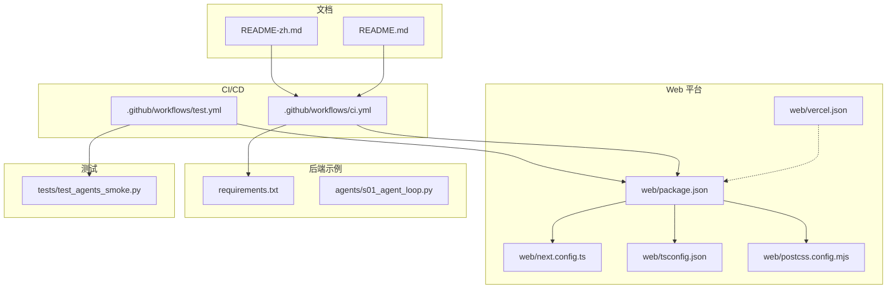
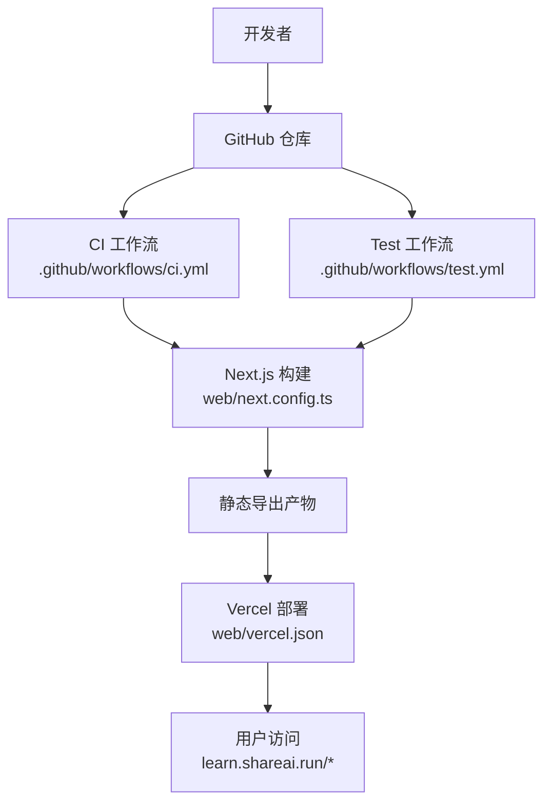
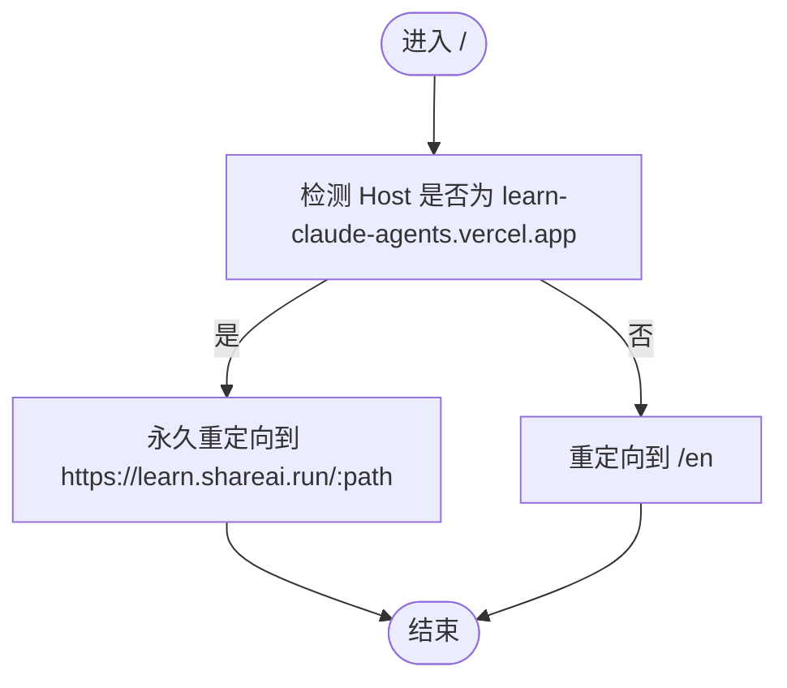
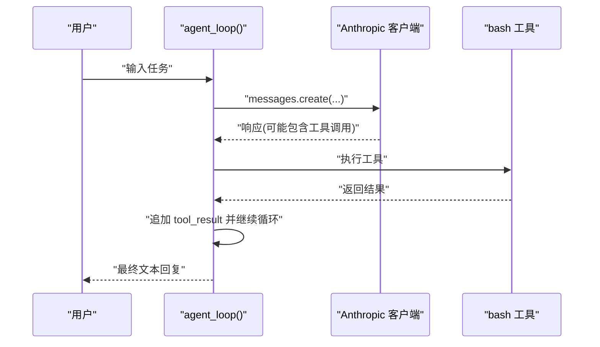
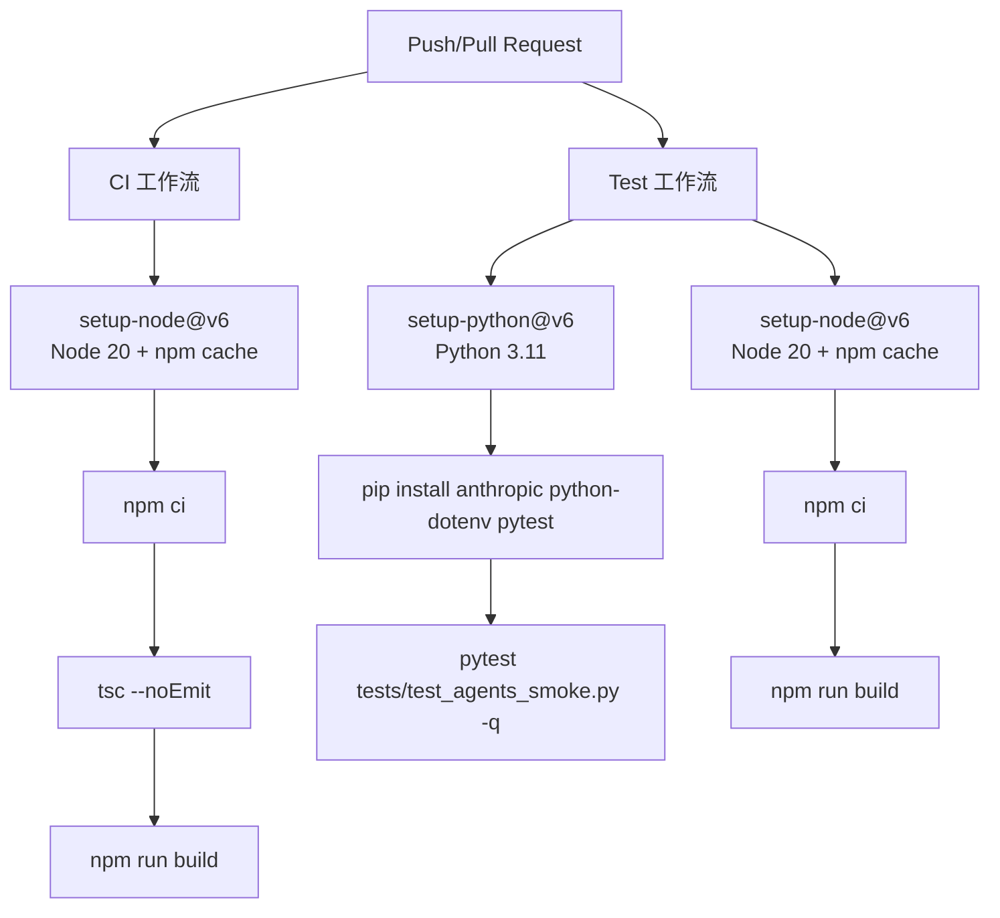
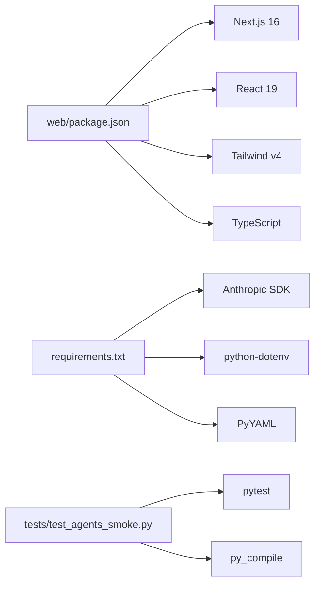

# 部署与运维

<cite>
**本文引用的文件**
- [web/package.json](file://web/package.json)
- [web/next.config.ts](file://web/next.config.ts)
- [web/tsconfig.json](file://web/tsconfig.json)
- [web/postcss.config.mjs](file://web/postcss.config.mjs)
- [web/vercel.json](file://web/vercel.json)
- [.github/workflows/ci.yml](file://.github/workflows/ci.yml)
- [.github/workflows/test.yml](file://.github/workflows/test.yml)
- [requirements.txt](file://requirements.txt)
- [README.md](file://README.md)
- [README-zh.md](file://README-zh.md)
- [agents/s01_agent_loop.py](file://agents/s01_agent_loop.py)
- [tests/test_agents_smoke.py](file://tests/test_agents_smoke.py)
</cite>

## 目录
1. [简介](#简介)
2. [项目结构](#项目结构)
3. [核心组件](#核心组件)
4. [架构总览](#架构总览)
5. [详细组件分析](#详细组件分析)
6. [依赖关系分析](#依赖关系分析)
7. [性能考虑](#性能考虑)
8. [故障排查指南](#故障排查指南)
9. [结论](#结论)
10. [附录](#附录)

## 简介
本指南面向生产环境的部署与运维，结合当前仓库现状，聚焦以下方面：
- 生产环境部署配置：环境变量管理、依赖安装、服务配置
- Web 平台部署策略：Vercel 部署、静态导出、重定向与国际化策略
- 性能优化建议：代码分割、缓存策略、资源压缩与静态导出
- 监控与告警：日志收集、性能指标、异常处理
- 版本管理与发布流程：Git 工作流、发布策略、回滚机制
- 运维最佳实践：稳定性保障与高效维护

本仓库包含 Python 后端示例与 Next.js Web 平台，CI/CD 使用 GitHub Actions；前端采用静态导出模式，部署于 Vercel。

## 项目结构
仓库采用多模块结构：
- web：Next.js 16 静态导出 Web 平台
- agents：Python 示例脚本（s01-s12）
- docs：多语言文档
- skills：技能文件（s05）
- tests：Python 烟雾测试
- .github/workflows：CI/CD 流水线

**图表来源**
- [web/package.json:1-39](file://web/package.json#L1-L39)
- [web/next.config.ts:1-10](file://web/next.config.ts#L1-L10)
- [web/tsconfig.json:1-35](file://web/tsconfig.json#L1-L35)
- [web/postcss.config.mjs:1-8](file://web/postcss.config.mjs#L1-L8)
- [web/vercel.json:1-21](file://web/vercel.json#L1-L21)
- [.github/workflows/ci.yml:1-33](file://.github/workflows/ci.yml#L1-L33)
- [.github/workflows/test.yml:1-46](file://.github/workflows/test.yml#L1-L46)
- [requirements.txt:1-3](file://requirements.txt#L1-L3)
- [agents/s01_agent_loop.py:1-121](file://agents/s01_agent_loop.py#L1-L121)
- [tests/test_agents_smoke.py:1-24](file://tests/test_agents_smoke.py#L1-L24)
- [README.md:1-378](file://README.md#L1-L378)
- [README-zh.md:1-373](file://README-zh.md#L1-L373)

**章节来源**
- [web/package.json:1-39](file://web/package.json#L1-L39)
- [web/next.config.ts:1-10](file://web/next.config.ts#L1-L10)
- [.github/workflows/ci.yml:1-33](file://.github/workflows/ci.yml#L1-L33)
- [.github/workflows/test.yml:1-46](file://.github/workflows/test.yml#L1-L46)
- [README.md:245-252](file://README.md#L245-L252)

## 核心组件
- Web 平台（Next.js 静态导出）
  - 使用静态导出模式，适合纯前端展示与文档演示
  - 支持多语言路由与国际化
  - 通过 vercel.json 实现域名重定向与首页默认语言
- 后端示例（Python）
  - s01 示例脚本演示最小 Agent 循环与工具调用
  - 依赖 Anthropic SDK、dotenv、PyYAML
- CI/CD（GitHub Actions）
  - CI：类型检查 + 构建
  - Test：Python 烟雾测试 + Web 构建

**章节来源**
- [web/next.config.ts:3-7](file://web/next.config.ts#L3-L7)
- [web/vercel.json:2-19](file://web/vercel.json#L2-L19)
- [requirements.txt:1-3](file://requirements.txt#L1-L3)
- [.github/workflows/ci.yml:16-32](file://.github/workflows/ci.yml#L16-L32)
- [.github/workflows/test.yml:20-24](file://.github/workflows/test.yml#L20-L24)

## 架构总览
Web 平台采用静态导出，部署于 Vercel。CI/CD 在 GitHub Actions 上执行类型检查与构建，确保前端质量与一致性。

**图表来源**
- [.github/workflows/ci.yml:16-32](file://.github/workflows/ci.yml#L16-L32)
- [.github/workflows/test.yml:32-45](file://.github/workflows/test.yml#L32-L45)
- [web/next.config.ts:3-7](file://web/next.config.ts#L3-L7)
- [web/vercel.json:2-19](file://web/vercel.json#L2-L19)

## 详细组件分析

### Web 平台（Next.js 静态导出与 Vercel 部署）
- 静态导出与图片优化
  - 配置静态导出与图片未优化，适合文档型站点
  - trailingSlash 为 true，便于静态托管
- TypeScript 与 Tailwind 集成
  - tsconfig 使用 bundler 解析与严格模式
  - PostCSS 集成 Tailwind 插件
- Vercel 配置
  - 主域名重定向至 learn.shareai.run
  - 根路径重定向至默认语言路径
- 国际化与路由
  - 多语言路由结构，根路径默认语言重定向

**图表来源**
- [web/vercel.json:2-19](file://web/vercel.json#L2-L19)

**章节来源**
- [web/next.config.ts:3-7](file://web/next.config.ts#L3-L7)
- [web/tsconfig.json:1-35](file://web/tsconfig.json#L1-L35)
- [web/postcss.config.mjs:1-8](file://web/postcss.config.mjs#L1-L8)
- [web/vercel.json:1-21](file://web/vercel.json#L1-L21)

### 后端示例（Python Agent）
- 依赖与环境
  - Anthropic SDK、dotenv、PyYAML
  - 通过环境变量注入 API Key 与模型标识
- 最小 Agent 循环
  - LLM 推理 → 工具调用 → 结果回写 → 循环直至停止
  - 包含危险命令拦截与超时保护

**图表来源**
- [agents/s01_agent_loop.py:80-102](file://agents/s01_agent_loop.py#L80-L102)

**章节来源**
- [requirements.txt:1-3](file://requirements.txt#L1-L3)
- [agents/s01_agent_loop.py:27-50](file://agents/s01_agent_loop.py#L27-L50)
- [agents/s01_agent_loop.py:65-78](file://agents/s01_agent_loop.py#L65-L78)
- [agents/s01_agent_loop.py:80-102](file://agents/s01_agent_loop.py#L80-L102)

### CI/CD（GitHub Actions）
- CI 工作流
  - Node.js 20，使用 npm ci
  - 类型检查与构建
  - 工作目录设置为 web
- Test 工作流
  - Python 烟雾测试（编译检查）
  - Web 构建验证

**图表来源**
- [.github/workflows/ci.yml:16-32](file://.github/workflows/ci.yml#L16-L32)
- [.github/workflows/test.yml:15-45](file://.github/workflows/test.yml#L15-L45)

**章节来源**
- [.github/workflows/ci.yml:1-33](file://.github/workflows/ci.yml#L1-L33)
- [.github/workflows/test.yml:1-46](file://.github/workflows/test.yml#L1-L46)

## 依赖关系分析
- 前端依赖
  - Next.js 16、React 19、Tailwind v4、TypeScript
  - 构建脚本包含提取内容、开发与构建命令
- 后端依赖
  - Anthropic SDK、dotenv、PyYAML
- 测试依赖
  - pytest、py_compile（烟雾测试）

**图表来源**
- [web/package.json:13-37](file://web/package.json#L13-L37)
- [requirements.txt:1-3](file://requirements.txt#L1-L3)
- [tests/test_agents_smoke.py:1-24](file://tests/test_agents_smoke.py#L1-L24)

**章节来源**
- [web/package.json:1-39](file://web/package.json#L1-L39)
- [requirements.txt:1-3](file://requirements.txt#L1-L3)
- [tests/test_agents_smoke.py:1-24](file://tests/test_agents_smoke.py#L1-L24)

## 性能考虑
- 静态导出与 CDN
  - 使用 Next.js 静态导出，适合文档与演示场景
  - Vercel 提供全球 CDN，结合 vercel.json 的重定向与默认语言策略
- 资源优化
  - Tailwind v4 与 PostCSS 配置用于样式打包
  - 图片未优化配置，适合静态文档
- 构建与缓存
  - GitHub Actions 使用 npm cache 与 Python setup 缓存，提升 CI 速度
- 建议
  - 如需动态功能，可考虑启用 Image Optimization 或边缘函数
  - 对大型文档可启用增量构建与预渲染策略

**章节来源**
- [web/next.config.ts:3-7](file://web/next.config.ts#L3-L7)
- [web/postcss.config.mjs:1-8](file://web/postcss.config.mjs#L1-L8)
- [.github/workflows/ci.yml:20-23](file://.github/workflows/ci.yml#L20-L23)
- [.github/workflows/test.yml:35-39](file://.github/workflows/test.yml#L35-L39)

## 故障排查指南
- 环境变量缺失
  - Python 示例依赖 ANTHROPIC_API_KEY 与 MODEL_ID
  - 建议在本地与 CI 中均配置对应环境变量
- 构建失败
  - CI 中类型检查与构建失败通常由 tsconfig 或依赖问题导致
  - 检查 web 目录下的依赖与 Node 版本
- 部署异常
  - Vercel 重定向与默认语言策略可能导致访问路径差异
  - 确认 vercel.json 的 host 条件与目标路径
- 测试失败
  - Python 烟雾测试仅检查脚本可编译与存在性
  - 若新增脚本，请同步更新测试用例

**章节来源**
- [agents/s01_agent_loop.py:44-50](file://agents/s01_agent_loop.py#L44-L50)
- [.github/workflows/ci.yml:28-32](file://.github/workflows/ci.yml#L28-L32)
- [web/vercel.json:2-19](file://web/vercel.json#L2-L19)
- [tests/test_agents_smoke.py:17-24](file://tests/test_agents_smoke.py#L17-L24)

## 结论
本仓库以静态导出的 Web 平台为核心，配合 GitHub Actions 实现自动化构建与测试，满足文档型项目的生产部署需求。建议在现有基础上：
- 明确环境变量管理规范与密钥轮换策略
- 逐步引入边缘函数与动态路由以增强交互能力
- 建立灰度发布与回滚机制，保障变更可控
- 完善日志与性能监控，持续优化用户体验

## 附录

### 环境变量清单（建议）
- ANTHROPIC_API_KEY：Anthropic API 密钥
- MODEL_ID：模型标识符
- ANTHROPIC_BASE_URL：可选，自定义基础地址

**章节来源**
- [agents/s01_agent_loop.py:44-50](file://agents/s01_agent_loop.py#L44-L50)

### 依赖安装与启动
- Web 平台
  - 安装依赖与启动开发服务器
- 后端示例
  - 安装依赖并准备 .env 文件

**章节来源**
- [README.md:245-252](file://README.md#L245-L252)
- [README-zh.md:246-252](file://README-zh.md#L246-L252)