# 学习路径

<cite>
**本文引用的文件**
- [README.md](file://README.md)
- [README-zh.md](file://README-zh.md)
- [requirements.txt](file://requirements.txt)
- [s01_agent_loop.py](file://agents/s01_agent_loop.py)
- [s02_tool_use.py](file://agents/s02_tool_use.py)
- [s03_todo_write.py](file://agents/s03_todo_write.py)
- [s04_subagent.py](file://agents/s04_subagent.py)
- [s05_skill_loading.py](file://agents/s05_skill_loading.py)
- [s06_context_compact.py](file://agents/s06_context_compact.py)
- [s07_task_system.py](file://agents/s07_task_system.py)
- [s08_background_tasks.py](file://agents/s08_background_tasks.py)
- [s09_agent_teams.py](file://agents/s09_agent_teams.py)
- [s10_team_protocols.py](file://agents/s10_team_protocols.py)
- [s11_autonomous_agents.py](file://agents/s11_autonomous_agents.py)
- [s12_worktree_task_isolation.py](file://agents/s12_worktree_task_isolation.py)
- [s_full.py](file://agents/s_full.py)
- [s03_permission/README.md](file://s03_permission/README.md)
- [s04_hooks/README.md](file://s04_hooks/README.md)
- [s09_memory/README.md](file://s09_memory/README.md)
- [s10_system_prompt/README.md](file://s10_system_prompt/README.md)
- [s11_error_recovery/README.md](file://s11_error_recovery/README.md)
- [s12_task_system/README.md](file://s12_task_system/README.md)
- [s13_background_tasks/README.md](file://s13_background_tasks/README.md)
- [s14_cron_scheduler/README.md](file://s14_cron_scheduler/README.md)
- [s15_agent_teams/README.md](file://s15_agent_teams/README.md)
- [s16_team_protocols/README.md](file://s16_team_protocols/README.md)
- [s17_autonomous_agents/README.md](file://s17_autonomous_agents/README.md)
- [s18_worktree_isolation/README.md](file://s18_worktree_isolation/README.md)
- [s19_mcp_plugin/README.md](file://s19_mcp_plugin/README.md)
- [s20_comprehensive/README.md](file://s20_comprehensive/README.md)
- [SKILL.md](file://skills/agent-builder/SKILL.md)
- [package.json](file://web/package.json)
</cite>

## 目录
1. [引言](#引言)
2. [项目结构](#项目结构)
3. [核心组件](#核心组件)
4. [架构总览](#架构总览)
5. [详细组件分析](#详细组件分析)
6. [依赖关系分析](#依赖关系分析)
7. [性能考虑](#性能考虑)
8. [故障排查指南](#故障排查指南)
9. [结论](#结论)
10. [附录](#附录)

## 引言
本学习路径面向希望掌握"代理循环"到"复杂多代理协作系统"的渐进式学习者。项目以20个session为主线，从基础代理循环逐步引入权限系统、钩子扩展、计划与进度、子代理、技能加载、上下文压缩、记忆系统、系统提示组装、错误恢复、任务持久化、后台任务、定时调度、团队协作、通信协议、自组织代理、工作树隔离、MCP插件集成，最终形成完整的"代理Harness工程"体系。每个session聚焦一个Harness机制，并配有对应的"格言"，帮助建立工程直觉与模式化思维。

- 学习目标：理解代理循环的本质、掌握Harness工程方法论、构建可扩展的代理系统。
- 学习路径：分为两个阶段，共20个session，覆盖从个体代理能力到多代理协作的完整演进。
- 实践导向：每个session提供可运行的Python脚本、配套文档与Web可视化平台，便于从理论到实践的过渡。

章节来源
- [README.md: 1-461:1-461](file://README.md#L1-L461)
- [README-zh.md: 1-373:1-373](file://README-zh.md#L1-L373)

## 项目结构
仓库采用"模块化+渐进式"的组织方式：
- s01-s20/: 包含20个session的完整章节，每个章节包含README.md、README.en.md、README.ja.md、code.py和images/
- agents/: 包含原有12个session的参考实现与s_full.py总纲
- docs/{en,zh,ja}/: 多语言文档，每个session对应一篇
- web/: 交互式学习平台（Next.js），提供可视化、源码查看、分步演示
- skills/: 可按需加载的技能（SKILL.md）示例
- tests/: 基础测试用例
- .github/workflows/: CI类型检查与构建

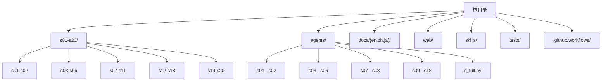

图表来源
- [README.md: 383-402:383-402](file://README.md#L383-L402)

章节来源
- [README.md: 383-402:383-402](file://README.md#L383-L402)
- [package.json: 1-39:1-39](file://web/package.json#L1-L39)

## 核心组件
- 代理循环（Agent Loop）：模型决定是否调用工具，Harness负责执行与回传结果。这是所有session的共同内核。
- 权限系统（Permission）：在工具执行前进行安全检查，包含拒绝列表、规则匹配和用户审批。
- 钩子系统（Hooks）：在代理循环的关键节点插入扩展逻辑，支持PreToolUse、PostToolUse、UserPromptSubmit、Stop等事件。
- 工具系统（Tools）：将具体能力封装为工具，通过dispatch映射到处理器；新增工具只需扩展工具清单与处理器。
- 计划与进度（TodoWrite）：通过结构化列表跟踪多步任务，避免漂移。
- 子代理（Subagents）：为复杂探索或子任务创建独立上下文，避免污染主对话。
- 技能加载（Skills）：按需注入知识，避免系统提示膨胀。
- 上下文压缩（Context Compact）：三层压缩策略，确保长时间会话的可持续性。
- 记忆系统（Memory）：文件系统存储 + 索引 + 按需加载，实现跨压缩、跨会话的知识积累。
- 系统提示组装（System Prompt）：分段 + 运行时组装，避免硬编码带来的维护成本。
- 错误恢复（Error Recovery）：针对输出截断、上下文超限、临时故障的四条恢复路径。
- 任务系统（Task System）：文件持久化任务图，支持依赖与状态管理。
- 后台任务（Background Tasks）：异步执行耗时操作，提升交互流畅度。
- 定时调度（Cron Scheduler）：基于时间触发的任务执行机制。
- 团队协作（Agent Teams）：基于JSONL邮箱的异步通信，支持多代理并行。
- 协议（Protocols）：shutdown与plan approval的request-id握手模式。
- 自组织代理（Autonomous Agents）：空闲轮询、自动认领任务、身份重注入。
- 工作树隔离（Worktree Isolation）：目录级隔离与任务绑定，实现并行执行与安全收敛。
- MCP插件（MCP Plugin）：外部工具路由到统一工具池，扩展代理能力边界。
- 综合代理（Comprehensive Agent）：将所有机制合为一体，形成完整的代理Harness。

章节来源
- [README.md: 89-104:89-104](file://README.md#L89-L104)
- [README-zh.md: 189-219:189-219](file://README-zh.md#L189-L219)

## 架构总览
下图展示从s01到s20的演进路径与关键机制的叠加关系，分为两个阶段：

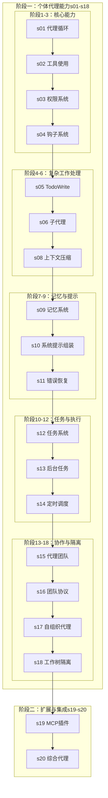

图表来源
- [README.md: 259-300:259-300](file://README.md#L259-L300)
- [README-zh.md: 254-286:254-286](file://README-zh.md#L254-L286)

## 详细组件分析

### s01 代理循环（One loop & Bash is all you need）
- 学习目标：理解代理循环的本质，掌握模型与Harness的职责划分。
- 核心概念：stop_reason、tool_use、tool_result的闭环。
- 技能要点：安全命令执行、危险命令拦截、输出截断。
- 实践练习：运行s01，输入自然语言指令，观察模型如何调用bash工具并返回结果。
- motto：One loop & Bash is all you need
- 工程原理：Harness保持极简，模型决定何时行动，Harness只负责执行。

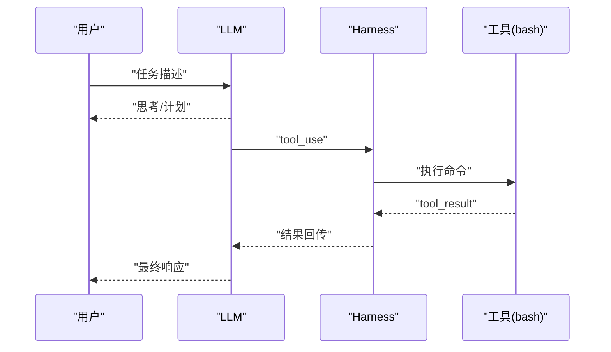

图表来源
- [s01_agent_loop.py: 80-102:80-102](file://agents/s01_agent_loop.py#L80-L102)

章节来源
- [s01_agent_loop.py: 1-121:1-121](file://agents/s01_agent_loop.py#L1-L121)

### s02 工具使用（Adding a tool means adding one handler）
- 学习目标：理解工具注册与分发机制，掌握dispatch map的扩展方式。
- 核心概念：TOOLS清单、TOOL_HANDLERS映射、工具输入schema。
- 技能要点：新增工具只需两步：定义工具描述与处理器。
- 实践练习：在s02基础上新增read_file、write_file、edit_file工具，验证分发与执行。
- motto：Adding a tool means adding one handler
- 工程原理：工具清单与处理器解耦，便于增量扩展。

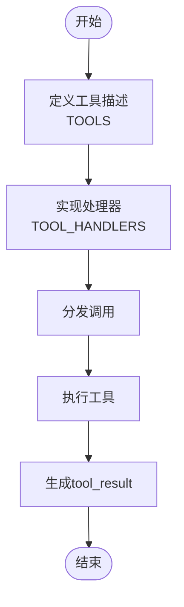

图表来源
- [s02_tool_use.py: 94-101:94-101](file://agents/s02_tool_use.py#L94-L101)
- [s02_tool_use.py: 114-132:114-132](file://agents/s02_tool_use.py#L114-L132)

章节来源
- [s02_tool_use.py: 1-151:1-151](file://agents/s02_tool_use.py#L1-L151)

### s03 权限系统（Set boundaries first, then grant freedom）
- 学习目标：掌握三道闸门权限检查机制，确保工具执行安全。
- 核心概念：拒绝列表、规则匹配、用户审批的三层权限管线。
- 技能要点：硬拒绝优先、软询问次之、用户决定最终权限。
- 实践练习：测试不同命令组合，观察闸门触发和权限决策。
- motto：Set boundaries first, then grant freedom
- 工程原理：在工具执行前进行安全检查，避免危险操作。

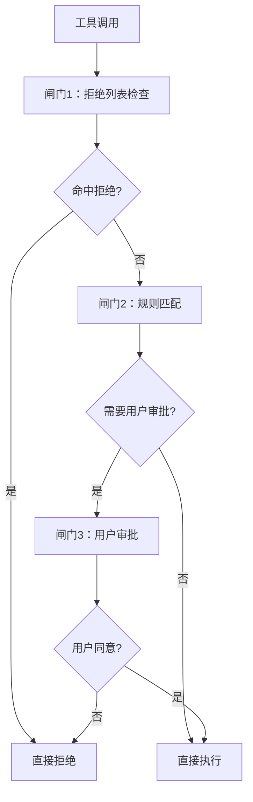

图表来源
- [s03_permission/README.md: 22-40:22-40](file://s03_permission/README.md#L22-L40)

章节来源
- [s03_permission/README.md: 1-233:1-233](file://s03_permission/README.md#L1-L233)

### s04 钩子系统（Hook around the loop, never rewrite the loop）
- 学习目标：掌握钩子扩展机制，将扩展逻辑从循环中分离。
- 核心概念：PreToolUse、PostToolUse、UserPromptSubmit、Stop四个关键事件。
- 技能要点：注册表模式、事件触发、扩展逻辑挂载。
- 实践练习：添加自定义钩子，观察在不同事件点的执行时机。
- motto：Hook around the loop, never rewrite the loop
- 工程原理：通过钩子系统实现循环与扩展逻辑的解耦。

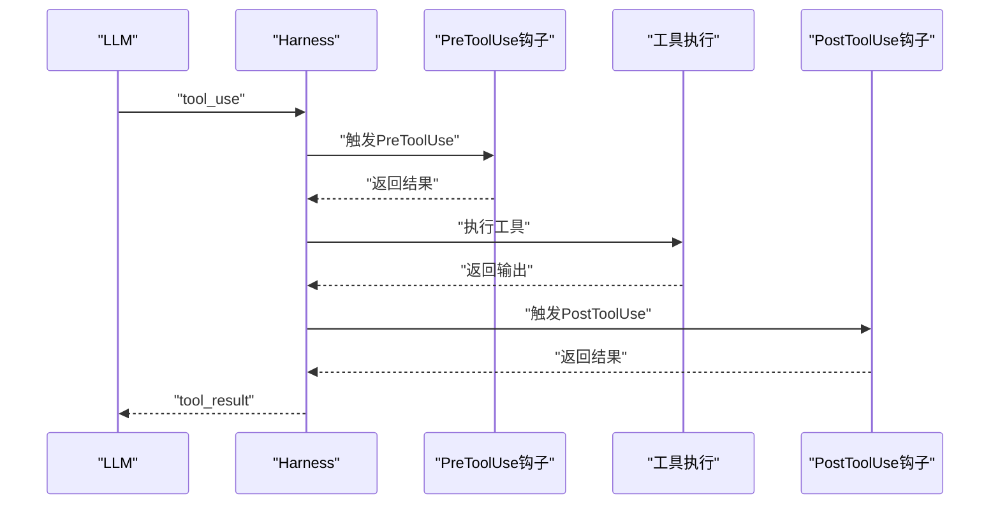

图表来源
- [s04_hooks/README.md: 39-58:39-58](file://s04_hooks/README.md#L39-L58)

章节来源
- [s04_hooks/README.md: 1-283:1-283](file://s04_hooks/README.md#L1-L283)

### s05 TodoWrite（An agent without a plan drifts）
- 学习目标：掌握结构化计划与进度跟踪，避免多步任务迷失。
- 核心概念：TodoManager状态机、nag提醒注入。
- 技能要点：任务项校验、状态约束、渲染与统计。
- 实践练习：使用todo工具维护任务列表，观察nag提醒触发条件。
- motto：An agent without a plan drifts
- 工程原理：通过结构化状态让模型持续追踪进度，Harness负责提醒注入。

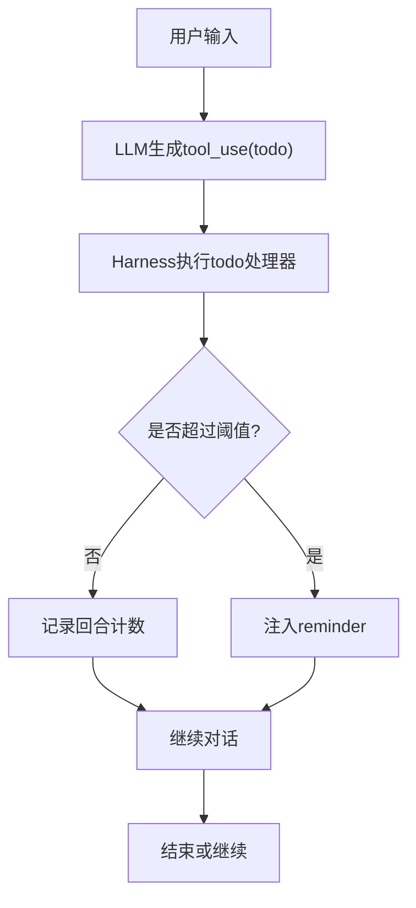

图表来源
- [s03_todo_write.py: 163-193:163-193](file://agents/s03_todo_write.py#L163-L193)

章节来源
- [s03_todo_write.py: 1-212:1-212](file://agents/s03_todo_write.py#L1-L212)

### s06 子代理（Big tasks split small, each subtask gets clean context）
- 学习目标：理解上下文隔离的重要性，掌握子代理的创建与回收。
- 核心概念：独立messages[]、子代理生命周期、summary返回。
- 技能要点：子代理工具集裁剪、父-子消息传递、结果收敛。
- 实践练习：使用task工具派生子代理，观察其独立上下文与结果汇总。
- motto：Big tasks split small, each subtask gets clean context
- 工程原理：进程级隔离带来天然的上下文隔离，适合探索性任务。

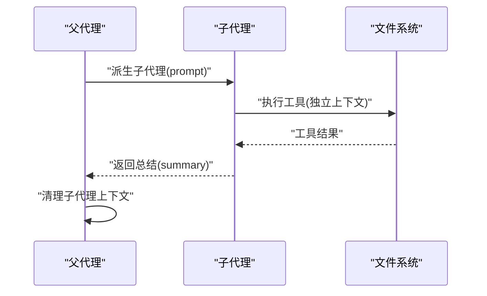

图表来源
- [s04_subagent.py: 117-137:117-137](file://agents/s04_subagent.py#L117-L137)

章节来源
- [s04_subagent.py: 1-188:1-188](file://agents/s04_subagent.py#L1-L188)

### s07 技能加载（Load knowledge when you need it, not upfront）
- 学习目标：掌握按需知识注入的两层机制，避免系统提示膨胀。
- 核心概念：SkillLoader、YAML frontmatter、Layer 1/2。
- 技能要点：系统提示中仅列出技能概要，具体知识在tool_result中注入。
- 实践练习：准备skills目录下的SKILL.md，使用load_skill工具动态加载。
- motto：Load knowledge when you need it, not upfront
- 工程原理：将昂贵的系统提示替换为低成本的技能索引与按需加载。

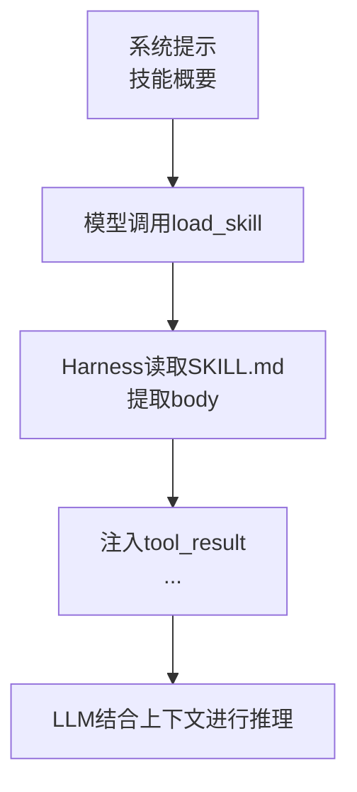

图表来源
- [s05_skill_loading.py: 58-105:58-105](file://agents/s05_skill_loading.py#L58-L105)
- [SKILL.md: 1-130:1-130](file://skills/agent-builder/SKILL.md#L1-L130)

章节来源
- [s05_skill_loading.py: 1-228:1-228](file://agents/s05_skill_loading.py#L1-L228)

### s08 上下文压缩（Context always fills up -- have a way to make room）
- 学习目标：掌握三层次压缩策略，确保长期会话的可持续性。
- 核心概念：micro_compact、auto_compact、manual_compact。
- 技能要点：令牌估算、结果占位、摘要生成、转储对话。
- 实践练习：构造长对话，触发auto_compact，观察摘要注入与转储文件。
- motto：Context always fills up -- have a way to make room
- 工程原理：通过分层压缩在不丢失关键信息的前提下控制上下文大小。

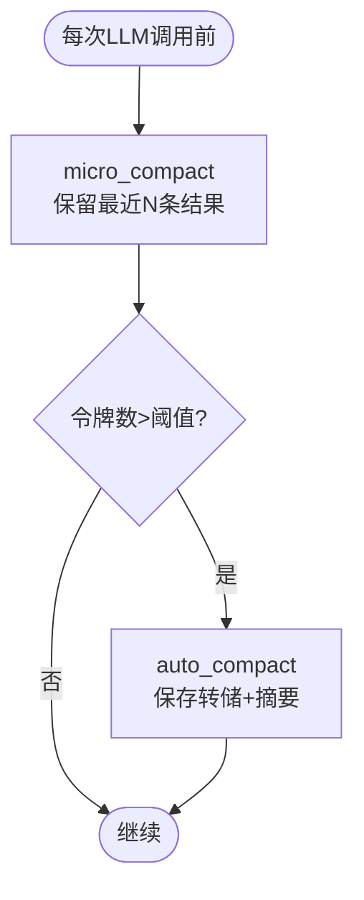

图表来源
- [s06_context_compact.py: 201-238:201-238](file://agents/s06_context_compact.py#L201-L238)

章节来源
- [s06_context_compact.py: 1-257:1-257](file://agents/s06_context_compact.py#L1-L257)

### s09 记忆系统（Remember what matters, forget what doesn't）
- 学习目标：掌握文件系统存储 + 索引 + 按需加载的记忆机制。
- 核心概念：Markdown文件存储、YAML frontmatter元数据、MEMORY.md索引。
- 技能要点：记忆提取、相关性选择、定期整理去重。
- 实践练习：输入偏好信息，观察记忆提取和后续对话中的使用。
- motto：Remember what matters, forget what doesn't
- 工程原理：通过文件系统实现跨压缩、跨会话的知识积累。

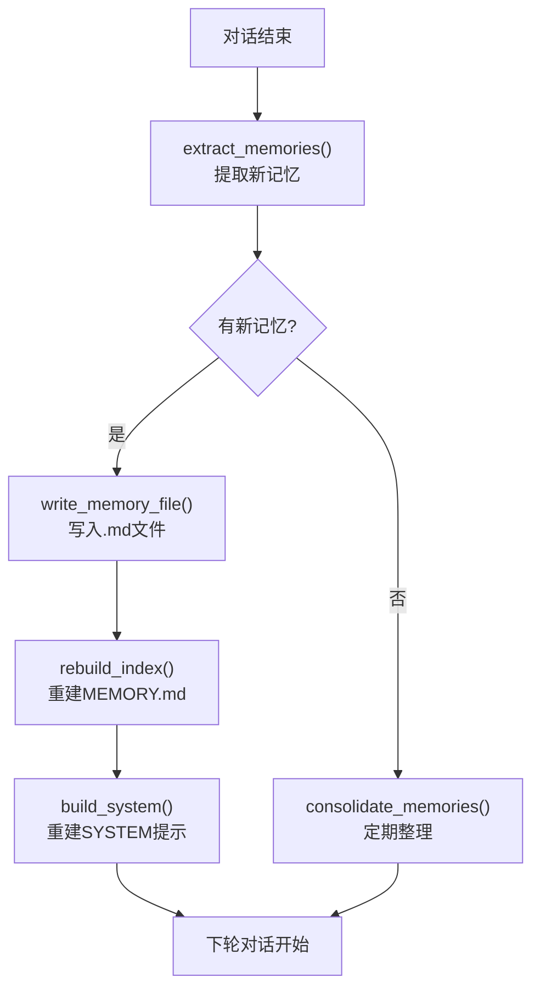

图表来源
- [s09_memory/README.md: 22-41:22-41](file://s09_memory/README.md#L22-L41)

章节来源
- [s09_memory/README.md: 1-280:1-280](file://s09_memory/README.md#L1-L280)

### s10 系统提示组装（Prompts are assembled at runtime, not hardcoded）
- 学习目标：掌握分段 + 运行时组装的系统提示机制。
- 核心概念：PROMPT_SECTIONS字典、assemble_system_prompt函数、缓存机制。
- 技能要点：按需加载、缓存避免重复拼接、真实状态判断。
- 实践练习：创建.memory/MEMORY.md文件，观察memory section的自动加载。
- motto：Prompts are assembled at runtime, not hardcoded
- 工程原理：将硬编码的SYSTEM提示拆分为独立段落，按真实状态组装。

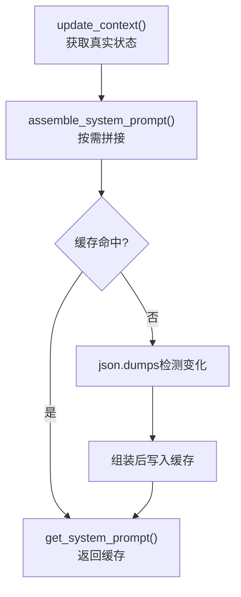

图表来源
- [s10_system_prompt/README.md: 64-84:64-84](file://s10_system_prompt/README.md#L64-L84)

章节来源
- [s10_system_prompt/README.md: 1-255:1-255](file://s10_system_prompt/README.md#L1-L255)

### s11 错误恢复（Errors aren't the end, they're the start of a retry）
- 学习目标：掌握针对不同类型错误的恢复策略。
- 核心概念：输出截断、上下文超限、临时故障的三条恢复路径。
- 技能要点：升级token、reactive compact、指数退避、备用模型切换。
- 实践练习：故意制造不同类型的错误，观察恢复机制的触发。
- motto：Errors aren't the end, they're the start of a retry
- 工程原理：通过分类错误并采取相应恢复措施，提升代理韧性。

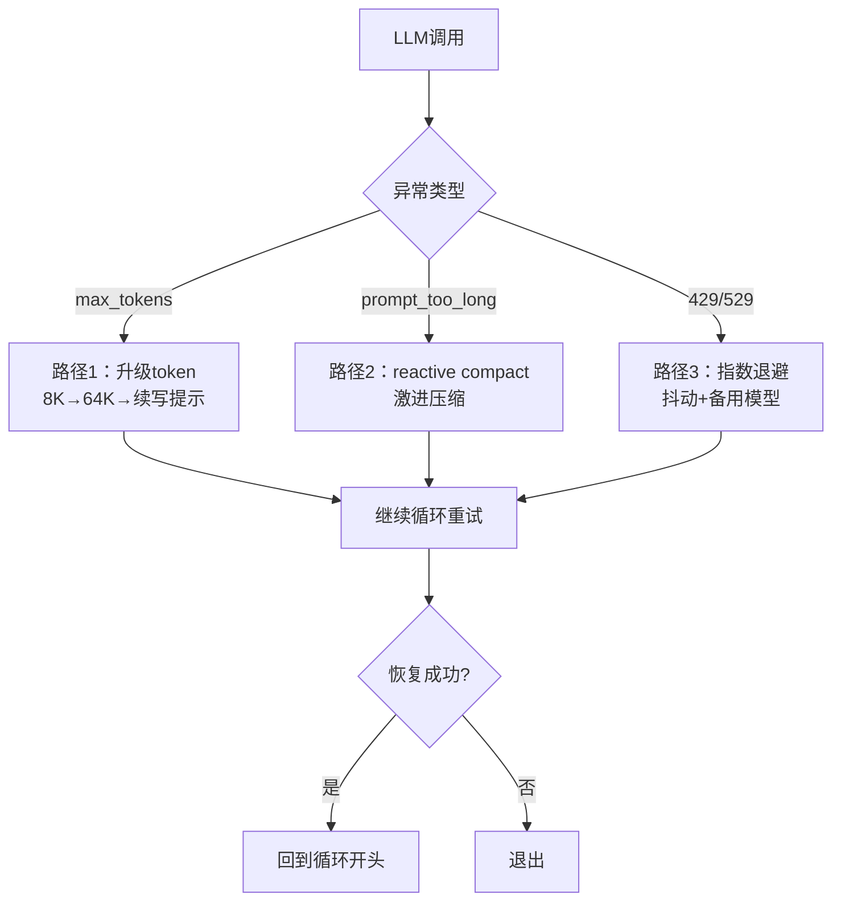

图表来源
- [s11_error_recovery/README.md: 28-42:28-42](file://s11_error_recovery/README.md#L28-L42)

章节来源
- [s11_error_recovery/README.md: 1-278:1-278](file://s11_error_recovery/README.md#L1-L278)

### s12 任务系统（Big goals break into small tasks, ordered, persisted to disk）
- 学习目标：掌握文件持久化任务图，支持依赖与状态管理。
- 核心概念：TaskManager、blockedBy依赖、CRUD操作。
- 技能要点：任务创建、状态更新、依赖解析、列表渲染。
- 实践练习：创建任务、设置依赖、标记完成，观察依赖解除效果。
- motto：Big goals break into small tasks, ordered, persisted to disk
- 工程原理：将"目标-步骤-依赖"固化为文件，突破单次会话限制。

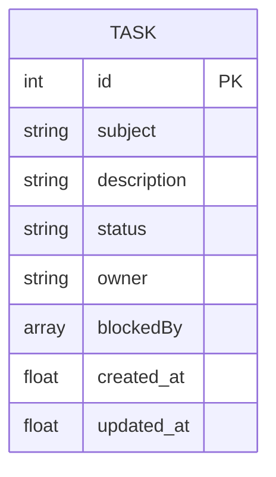

图表来源
- [s07_task_system.py: 46-121:46-121](file://agents/s07_task_system.py#L46-L121)

章节来源
- [s07_task_system.py: 1-244:1-244](file://agents/s07_task_system.py#L1-L244)

### s13 后台任务（Slow ops go background, agent keeps thinking）
- 学习目标：掌握后台线程执行与通知队列，提升交互体验。
- 核心概念：BackgroundManager、通知注入、状态查询。
- 技能要点：任务启动、结果收集、队列清空、结果注入。
- 实践练习：使用background_run提交长任务，观察LLM调用前的通知注入。
- motto：Slow ops go background, agent keeps thinking
- 工程原理：异步执行+同步注入，使模型在等待期间继续思考下一步。

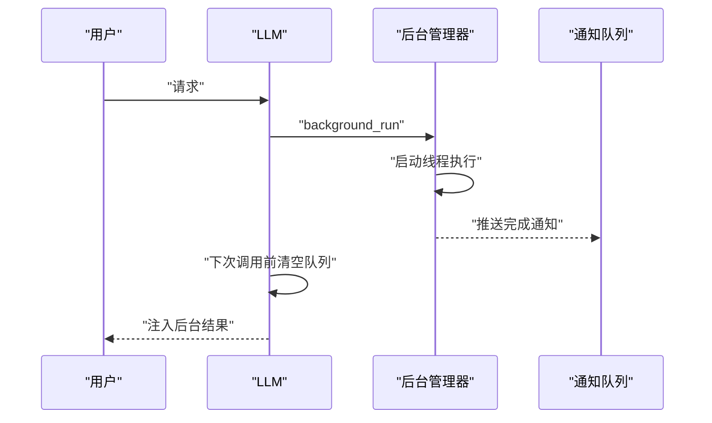

图表来源
- [s08_background_tasks.py: 188-216:188-216](file://agents/s08_background_tasks.py#L188-L216)

章节来源
- [s08_background_tasks.py: 1-235:1-235](file://agents/s08_background_tasks.py#L1-L235)

### s14 定时调度（Fire on schedule, no human kick needed）
- 学习目标：掌握基于时间触发的任务执行机制。
- 核心概念：cron表达式、任务注册、时间触发器。
- 技能要点：任务持久化、触发条件判断、执行结果记录。
- 实践练习：设置定时任务，观察在指定时间自动执行。
- motto：Fire on schedule, no human kick needed
- 工程原理：通过定时调度实现无人值守的任务执行。

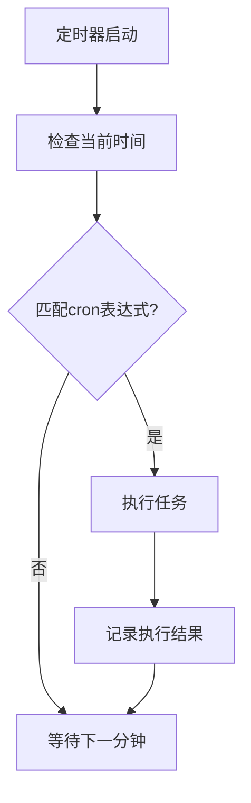

图表来源
- [s14_cron_scheduler/README.md: 1-280:1-280](file://s14_cron_scheduler/README.md#L1-L280)

章节来源
- [s14_cron_scheduler/README.md: 1-280:1-280](file://s14_cron_scheduler/README.md#L1-L280)

### s15 代理团队（Too big for one agent -- delegate to teammates）
- 学习目标：掌握基于JSONL邮箱的异步通信，支持多代理协作。
- 核心概念：MessageBus、TeammateManager、持久化配置。
- 技能要点：spawn_teammate、send_message、read_inbox、广播。
- 实践练习：创建团队成员，发送消息与广播，观察异步处理。
- motto：Too big for one agent -- delegate to teammates
- 工程原理：文件系统作为消息总线，实现跨进程/线程通信。

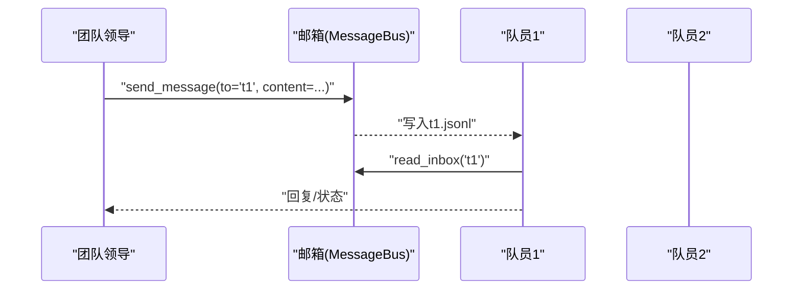

图表来源
- [s09_agent_teams.py: 345-379:345-379](file://agents/s09_agent_teams.py#L345-L379)

章节来源
- [s09_agent_teams.py: 1-404:1-404](file://agents/s09_agent_teams.py#L1-L404)

### s16 团队协议（Teammates need shared communication rules）
- 学习目标：掌握shutdown与plan approval的request-id握手协议。
- 核心概念：请求跟踪器、状态机、消息类型。
- 技能要点：shutdown_request/response、plan_approval/response。
- 实践练习：发起shutdown请求与计划审批，观察状态变更。
- motto：Teammates need shared communication rules
- 工程原理：统一的消息格式与request-id关联，确保跨代理一致性。

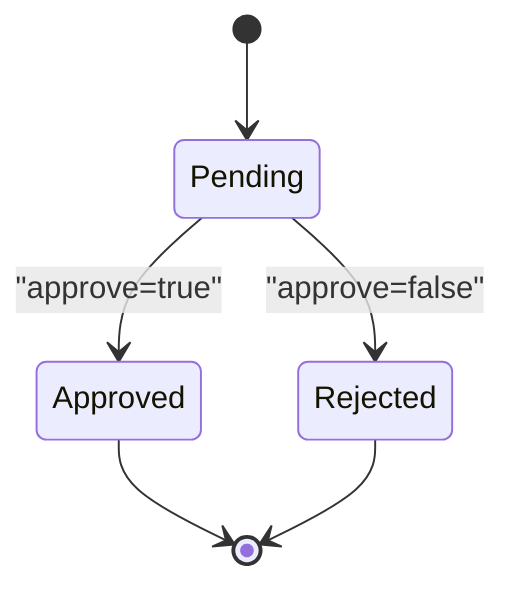

图表来源
- [s10_team_protocols.py: 351-374:351-374](file://agents/s10_team_protocols.py#L351-L374)

章节来源
- [s10_team_protocols.py: 1-485:1-485](file://agents/s10_team_protocols.py#L1-L485)

### s17 自组织代理（Teammates check the board, claim work themselves）
- 学习目标：掌握自组织代理的空闲轮询与自动认领机制。
- 核心概念：空闲周期、任务扫描、身份重注入、自动恢复。
- 技能要点：idle工具、claim_task、任务过滤、超时关闭。
- 实践练习：启动自组织代理，观察其空闲轮询与任务认领。
- motto：Teammates check the board, claim work themselves
- 工程原理：通过空闲轮询与任务板扫描，减少中心化调度。

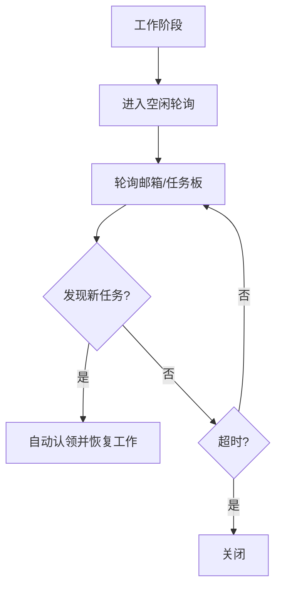

图表来源
- [s11_autonomous_agents.py: 225-303:225-303](file://agents/s11_autonomous_agents.py#L225-L303)

章节来源
- [s11_autonomous_agents.py: 1-587:1-587](file://agents/s11_autonomous_agents.py#L1-L587)

### s18 工作树隔离（Each works in its own directory, no interference）
- 学习目标：掌握目录级隔离与任务绑定，实现并行执行与安全收敛。
- 核心概念：WorktreeManager、Git工作树、生命周期事件。
- 技能要点：创建/运行/保留/移除工作树、事件日志、任务绑定。
- 实践练习：创建任务并绑定工作树，分别在不同工作树执行命令，最后选择保留或移除。
- motto：Each works in its own directory, no interference
- 工程原理：以任务为控制平面，以工作树为执行平面，实现安全并行。

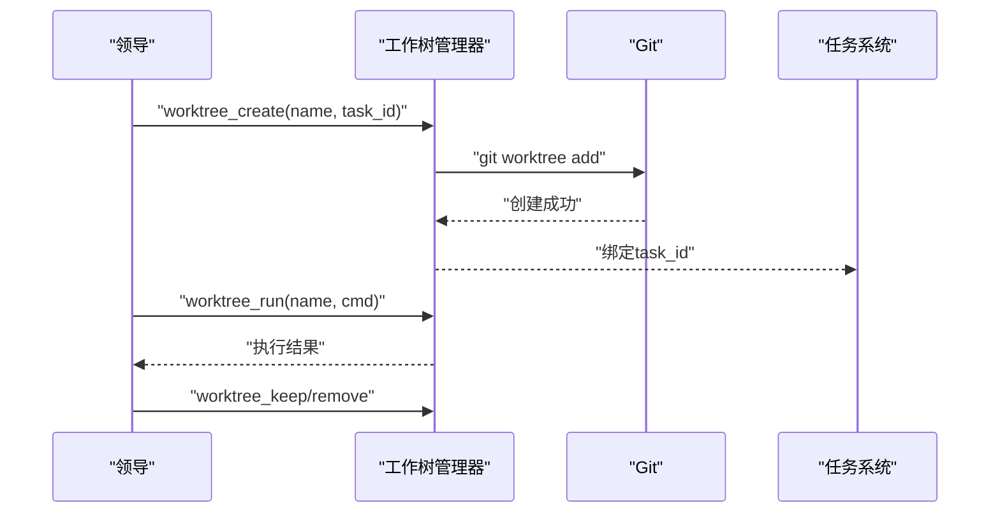

图表来源
- [s12_worktree_task_isolation.py: 284-472:284-472](file://agents/s12_worktree_task_isolation.py#L284-L472)

章节来源
- [s12_worktree_task_isolation.py: 1-783:1-783](file://agents/s12_worktree_task_isolation.py#L1-L783)

### s19 MCP插件（Not enough capability? Plug in more via MCP）
- 学习目标：掌握MCP（Model Context Protocol）插件系统，扩展代理能力边界。
- 核心概念：多传输、通道路由、工具池组装。
- 技能要点：外部工具接入、协议适配、能力扩展。
- 实践练习：配置MCP客户端，观察外部工具在统一工具池中的使用。
- motto：Not enough capability? Plug in more via MCP
- 工程原理：通过MCP协议将外部工具无缝集成到代理工具池中。

```mermaid
flowchart TD
A["MCP客户端"] --> B["协议适配层"]
B --> C["工具池组装"]
C --> D["统一dispatch"]
D --> E["工具调用"]
```

图表来源
- [s19_mcp_plugin/README.md: 1-280:1-280](file://s19_mcp_plugin/README.md#L1-L280)

章节来源
- [s19_mcp_plugin/README.md: 1-280:1-280](file://s19_mcp_plugin/README.md#L1-L280)

### s20 综合代理（Many mechanisms, one loop）
- 学习目标：理解各机制的协同与调用顺序，掌握完整代理Harness的实现。
- 核心概念：压缩管道、后台通知注入、inbox检查、工具分发。
- 技能要点：顺序执行、异常处理、REPL命令（/compact、/tasks、/team、/inbox）。
- 实践练习：运行s20，体验从权限检查到团队协作的完整流程。
- motto：Many mechanisms, one loop
- 工程原理：将所有机制合为一体，形成完整的代理Harness。

章节来源
- [s20_comprehensive/README.md: 1-280:1-280](file://s20_comprehensive/README.md#L1-L280)

### s_full.py 总纲（将所有机制合为一体）
- 学习目标：理解各机制的协同与调用顺序，掌握"完整舱面"的实现。
- 核心概念：压缩管道、后台通知注入、inbox检查、工具分发。
- 技能要点：顺序执行、异常处理、REPL命令（/compact、/tasks、/team、/inbox）。
- 实践练习：运行s_full.py，体验从压缩到团队通信的完整流程。
- motto：将所有机制合为一体
- 工程原理：s_full.py是s01-s11的整合版本，s12单独教学。

章节来源
- [s_full.py: 1-741:1-741](file://agents/s_full.py#L1-L741)

## 依赖关系分析
- 运行时依赖：anthropic、python-dotenv、pyyaml（安装与配置见requirements.txt）。
- Web平台：Next.js + React生态，提供可视化、源码查看与交互式演示。
- 项目内依赖：各session脚本相互独立，s_full.py依赖s01-s11的所有机制。

```mermaid
graph LR
Req["requirements.txt"] --> Anthropic["anthropic"]
Req --> DotEnv["python-dotenv"]
Req --> PyYaml["pyyaml"]
Web["web/package.json"] --> Next["next"]
Web --> React["react"]
Web --> UI["ui库/样式"]
```

图表来源
- [requirements.txt: 1-3:1-3](file://requirements.txt#L1-L3)
- [package.json: 13-38:13-38](file://web/package.json#L13-L38)

章节来源
- [requirements.txt: 1-3:1-3](file://requirements.txt#L1-L3)
- [package.json: 1-39:1-39](file://web/package.json#L1-L39)

## 性能考虑
- 上下文控制：通过micro_compact与auto_compact控制令牌占用，避免超出模型上下文上限。
- 异步执行：后台任务避免阻塞主循环，提升交互流畅度。
- 目录隔离：工作树隔离降低冲突风险，提高并行效率。
- 资源限制：为子进程设置超时与危险命令拦截，保障稳定性。
- 记忆缓存：通过索引常驻与按需加载，平衡存储访问与计算成本。
- 错误恢复：指数退避与备用模型切换，提升系统可用性。
- 提示组装：分段组装与缓存，避免重复拼接带来的性能损耗。

## 故障排查指南
- 环境变量：确保正确配置ANTHROPIC_API_KEY与MODEL_ID，必要时设置ANTHROPIC_BASE_URL。
- 权限与路径：注意safe_path与相对路径限制，避免路径逃逸。
- 超时与错误：子进程超时与异常会被捕获并返回错误信息，便于定位问题。
- Git相关：s18需要在Git仓库中运行，否则工作树工具会报错。
- 记忆文件：确保.memory目录可读写，文件格式符合YAML frontmatter规范。
- 系统提示：检查PROMPT_SECTIONS配置，确保段落拼接逻辑正确。
- 错误恢复：监控指数退避参数，避免过度重试导致资源浪费。

章节来源
- [s01_agent_loop.py: 44-49:44-49](file://agents/s01_agent_loop.py#L44-L49)
- [s08_background_tasks.py: 66-89:66-89](file://agents/s08_background_tasks.py#L66-L89)
- [s12_worktree_task_isolation.py: 250-263:250-263](file://agents/s12_worktree_task_isolation.py#L250-L263)

## 结论
本学习路径以"Harness工程"为核心理念，通过20个session逐步构建从基础代理循环到复杂多代理协作系统的完整能力谱系。每个session聚焦一个Harness机制，并以"格言"强化工程直觉。项目分为两个阶段：个体代理能力（s01-s18）和多代理协作（s19-s20），涵盖权限系统、钩子扩展、记忆系统、系统提示组装、错误恢复、任务持久化、定时调度、团队协作、工作树隔离、MCP插件集成等核心能力。配合多语言文档、Python脚本与Web可视化平台，学习者可以快速从理论走向实践，掌握构建真实代理系统的方法论与工程能力。

## 附录

### 学习进度跟踪建议
- 每个session完成后，记录以下内容：
  - 掌握的概念与机制
  - 遇到的问题与解决方案
  - 自己的改进建议或扩展想法
- 定期回顾s_full.py和s20，理解各机制的协同顺序与调用时机。
- 使用Web平台的可视化功能，对照源码查看每个session的执行流程。
- 建立个人知识库，整理常见问题和最佳实践。

### 最佳实践
- 保持Harness极简：只暴露必要的工具与接口。
- 信任模型：让模型决定何时行动与如何行动。
- 持续压缩：定期触发压缩，避免上下文膨胀。
- 安全优先：严格拦截危险命令，设置超时与权限边界。
- 可观测性：利用事件日志与转储文件，记录关键行为。
- 模块化设计：每个机制独立实现，通过接口连接。
- 渐进式集成：先验证单个机制，再逐步组合多个机制。

### 从理论到应用的实用指导
- 环境配置
  - 安装依赖：pip install -r requirements.txt
  - 复制并编辑.env：cp .env.example .env，填入API密钥与模型ID
  - 启动Web平台：cd web && npm install && npm run dev
- 代码运行
  - 逐session运行s01_agent_loop/code.py至s20_comprehensive/code.py
  - 使用s_full.py体验完整流程
  - 每个章节都有独立的code.py文件，可直接运行
- 调试技巧
  - 使用/compact强制压缩上下文
  - 使用/teams、/inbox、/tasks查看状态
  - 查看转储文件与事件日志定位问题
  - 利用钩子系统添加自定义日志输出
  - 通过环境变量调整调试级别

章节来源
- [README.md: 350-380:350-380](file://README.md#L350-L380)
- [README-zh.md: 320-337:320-337](file://README-zh.md#L320-L337)